# NTRPX Systems — Complete Formulations

<CardGroup cols={4}>

<Card title="All Systems Go™" icon="bolt" color="#5A8FA8">
3 Formulas · Daily Protocol
</Card>

<Card title="Neuraldrink™" icon="droplet" color="#4AC1E0">
2 Formulas · Circadian Beverages
</Card>

<Card title="ParaCaffeine +™" icon="mug-hot" color="#F4A460">
1 Formula · Clean Stimulation
</Card>

<Card title="Sprint™" icon="rocket" color="#FF6B6B">
1 Formula · Peak Performance
</Card>

</CardGroup>

---

# All Systems Go™ — Foundation System

**The flagship daily protocol. Three formulations synchronized to circadian biology providing complete coverage of the 12 biological domains.**

---

## ☀️ Boost™ — Morning Activation

<CardGroup cols={4}>

<Card title="Timing" icon="clock" color="#F4A460">
6:00 - 10:00 AM
</Card>

<Card title="With Food" icon="utensils" color="#F4A460">
Light breakfast
</Card>

<Card title="Primary Targets" icon="bullseye" color="#F4A460">
Cholinergic · Dopaminergic · Mitochondrial
</Card>

<Card title="Philosophy" icon="lightbulb" color="#F4A460">
"Wake up sharp, not wired"
</Card>

</CardGroup>

<AccordionGroup>

<Accordion title="Complete Formulation Table" icon="flask-vial">

### Boost™ Ingredient Specifications

| Ingredient | Form | Dose | Domain | Mechanism | Evidence |
|:-----------|:-----|:-----|:-------|:----------|:---------|
| **CDP-Choline** | Cognizin® | 300 mg | Cholinergic | Choline + uridine donor; ACh synthesis | TIER 1 |
| **L-Tyrosine** | N-Acetyl-L-Tyrosine | 500 mg | Dopaminergic | DA/NE precursor; stress resilience | TIER 1 |
| **Creatine** | Creapure® Monohydrate | 2.5 g | ATP Systems | Phosphocreatine buffer; cognitive reserve | TIER 1 |
| **PQQ** | BioPQQ® | 20 mg | Mitochondrial | PGC-1α activation; biogenesis | TIER 2 |
| **CoQ10** | Kaneka Ubiquinol | 100 mg | Mitochondrial | Electron transport; ATP production | TIER 1 |
| **Salidroside** | Rhodiola 3% standardized | 100 mg salidroside | HPA Axis | MAO-B inhibition; adaptogenic | TIER 2 |
| **Lion's Mane** | Fruiting body + mycelium | 500 mg | Neuroprotection | NGF/BDNF stimulation | TIER 2 |

### Boost™ B-Complex (Active Forms)

| Vitamin | Form | Dose | Rationale |
|:--------|:-----|:-----|:----------|
| **B1** | Benfotiamine | 150 mg | High-bioavailability thiamine; AGE inhibition |
| **B1** | TTFD (Sulbutiamine) | 50 mg | CNS-penetrant thiamine; cognitive energy |
| **B2** | Riboflavin-5'-Phosphate | 15 mg | Active coenzyme; supports B6/B9/B3 |
| **B3** | Nicotinamide | 100 mg | NAD+ precursor; morning energy |
| **B5** | D-Calcium Pantothenate | 50 mg | CoA synthesis |
| **B6** | Pyridoxal-5'-Phosphate | 15 mg | Neurotransmitter synthesis; ONLY safe form |
| **B7** | D-Biotin | 300 mcg | Carboxylase support |
| **B9** | L-5-MTHF (Quatrefolic®) | 400 mcg | Active folate; bypasses MTHFR |
| **B12** | Methylcobalamin | 500 mcg | Cytoplasmic coenzyme; methylation |
| **B12** | Adenosylcobalamin | 250 mcg | Mitochondrial coenzyme |

### Boost™ Mechanism Map

```mermaid
flowchart TB
    subgraph BOOST_MECH["☀️ BOOST™ MECHANISM INTEGRATION"]
        subgraph CHOLINE_B["Cholinergic Priming"]
            CDP_B["CDP-Choline 300mg"] --> ACH_B["↑ Acetylcholine"]
            CDP_B --> URIDINE_B["→ Uridine Release"]
            URIDINE_B --> MEMBRANE_B["↑ Membrane Synthesis"]
            LION_B["Lion's Mane 500mg"] --> NGF_B["↑ NGF"]
            NGF_B --> NEURON_HEALTH["Cholinergic Neuron Health"]
        end
        
        subgraph DA_B["Dopaminergic Drive"]
            TYR_B["L-Tyrosine 500mg"] --> DA_SYNTH["↑ DA Synthesis"]
            SALID_B["Salidroside 100mg"] --> MAO_B["MAO-B Inhibition"]
            MAO_B --> DA_SPARE["↑ DA Availability"]
            DA_SYNTH --> MOTIVATION["Motivation & Drive"]
            DA_SPARE --> MOTIVATION
        end
        
        subgraph MITO_B["Mitochondrial Ignition"]
            PQQ_B["PQQ 20mg"] --> BIOGEN["↑ Biogenesis (PGC-1α)"]
            COQ10_B["CoQ10 100mg"] --> ETC["↑ ETC Efficiency"]
            CREATINE_B["Creatine 2.5g"] --> PCR["↑ Phosphocreatine"]
            BIOGEN --> ATP_B["Maximum ATP Capacity"]
            ETC --> ATP_B
            PCR --> ATP_B
        end
        
        ACH_B --> OUTPUT_B["MORNING OUTPUT:<br/>Sharp · Motivated · Energized"]
        MOTIVATION --> OUTPUT_B
        ATP_B --> OUTPUT_B
        NEURON_HEALTH --> OUTPUT_B
    end
```

</Accordion>

<Accordion title="Dosing Rationale" icon="scale-balanced">

### Why These Specific Doses?

| Ingredient | Dose | Rationale |
|:-----------|:-----|:----------|
| **CDP-Choline 300mg** | Split daily total of 500-600mg between Boost/Sustain; acute cognitive dose range 250-500mg |
| **L-Tyrosine 500mg** | Effective cognitive dose 500-2000mg; 500mg morning provides substrate without overload |
| **Creatine 2.5g** | Combined with Sol™ (2.5g) = 5g/day maintenance dose; split improves absorption |
| **PQQ 20mg** | Clinical dose for cognitive effects (Itoh et al. 2016); BioPQQ® studied dose |
| **CoQ10 100mg** | Ubiquinol effective at 100-200mg; higher absorption than ubiquinone |
| **Salidroside 100mg** | Standardized to 3% from ~330mg Rhodiola extract; clinically effective range |
| **Lion's Mane 500mg** | Moderate chronic dose; Mori et al. used 3g/day but saw effects at lower doses |
| **B-vitamins** | Therapeutic doses of active forms; well above RDA for optimization |

</Accordion>

</AccordionGroup>

---

## 🌤️ Sustain™ — Daytime Performance

<CardGroup cols={4}>

<Card title="Timing" icon="clock" color="#FFD700">
10:00 AM - 2:00 PM
</Card>

<Card title="With Food" icon="utensils" color="#FFD700">
With lunch
</Card>

<Card title="Primary Targets" icon="bullseye" color="#FFD700">
Cholinergic · Membrane · Memory · Alertness
</Card>

<Card title="Philosophy" icon="lightbulb" color="#FFD700">
"All-day cognitive endurance"
</Card>

</CardGroup>

<AccordionGroup>

<Accordion title="Complete Formulation Table" icon="flask-vial">

### Sustain™ Ingredient Specifications

| Ingredient | Form | Dose | Domain | Mechanism | Evidence |
|:-----------|:-----|:-----|:-------|:----------|:---------|
| **CDP-Choline** | Cognizin® | 250 mg | Cholinergic | Continued ACh support; uridine | TIER 1 |
| **Phosphatidylserine** | Sharp-PS® (sunflower) | 100 mg | Neuroprotection | Membrane fluidity; cortisol modulation | TIER 1 |
| **Paraxanthine** | enfinity® | 100 mg | Adenosine | Clean A2A antagonism; alert without anxious | TIER 2 |
| **L-Theanine** | Suntheanine® | 100 mg | GABAergic | Balances paraxanthine; alpha waves | TIER 1 |
| **Bacopa monnieri** | BaCognize® 45% bacosides | 300 mg | Neuroprotection | Memory consolidation; serotonergic | TIER 1 |
| **Ashwagandha** | KSM-66® | 300 mg | HPA Axis | Cortisol reduction; GABAergic | TIER 1 |
| **Saffron** | affron® | 28 mg | Serotonergic | Serotonin reuptake; mood | TIER 2 |
| **DHA** | Life's DHA® (algal) | 250 mg | Structural | Neuronal membrane; synaptic | TIER 1 |
| **EPA** | Algal | 125 mg | Cardiovascular | Anti-inflammatory; mood | TIER 1 |

### Sustain™ B-Complex Continuation

| Vitamin | Form | Dose | Rationale |
|:--------|:-----|:-----|:----------|
| **B1** | Benfotiamine | 100 mg | Continued metabolic support |
| **B2** | Riboflavin-5'-Phosphate | 10 mg | Cofactor maintenance |
| **B5** | D-Calcium Pantothenate | 50 mg | CoA synthesis |
| **B6** | Pyridoxal-5'-Phosphate | 10 mg | Neurotransmitter maintenance |
| **B12** | Adenosylcobalamin | 250 mcg | Mitochondrial B12 complement |

### Sustain™ Mechanism Map

```mermaid
flowchart TB
    subgraph SUSTAIN_MECH["🌤️ SUSTAIN™ MECHANISM INTEGRATION"]
        subgraph ENDURANCE_S["Cognitive Endurance"]
            CDP_S["CDP-Choline 250mg"] --> ACH_S["Sustained ACh"]
            PS_S["Phosphatidylserine 100mg"] --> MEMBRANE_S["↑ Membrane Integrity"]
            DHA_S["DHA 250mg + EPA 125mg"] --> MEMBRANE_S
            MEMBRANE_S --> RECEPTOR_S["Optimized Receptors"]
        end
        
        subgraph ALERT_S["Clean Alertness"]
            PARA_S["Paraxanthine 100mg"] --> A2A_S["A2A Antagonism 2.2×"]
            THEA_S["L-Theanine 100mg"] --> ALPHA_S["↑ Alpha Waves"]
            A2A_S --> ALERT_CALM["Alert Without Anxious"]
            ALPHA_S --> ALERT_CALM
        end
        
        subgraph MEMORY_S["Memory & Mood"]
            BACOPA_S["Bacopa 300mg"] --> MEMORY_CONSOL["Memory Consolidation"]
            SAFFRON_S["Saffron 28mg"] --> MOOD_S["↑ Serotonin → Mood"]
            ASH_S["Ashwagandha 300mg"] --> CORTISOL_S["↓ Cortisol"]
            CORTISOL_S --> STRESS_RESIL["Stress Resilience"]
        end
        
        ACH_S --> OUTPUT_S["DAYTIME OUTPUT:<br/>Focused · Calm · Resilient"]
        ALERT_CALM --> OUTPUT_S
        MEMORY_CONSOL --> OUTPUT_S
        STRESS_RESIL --> OUTPUT_S
        MOOD_S --> OUTPUT_S
    end
```

</Accordion>

<Accordion title="Paraxanthine vs Caffeine" icon="bolt">

### Why Paraxanthine Replaces Caffeine

| Property | Caffeine | Paraxanthine |
|:---------|:---------|:-------------|
| **A2A receptor affinity** | 1× | **2.2×** |
| **Half-life** | 5-6 hours | **3-4 hours** |
| **Metabolites** | Theobromine (long t½), Theophylline (anxiogenic) | **None problematic** |
| **Jitters/anxiety** | Common | **Rare** |
| **Sleep interference** | High (long clearance) | **Lower** (faster clearance) |
| **Tolerance** | Rapid | **Slower** |

**Paraxanthine IS caffeine's primary active metabolite** — the compound responsible for most cognitive benefits. By supplementing directly, you skip the problematic metabolites.

</Accordion>

</AccordionGroup>

---

## 🌙 Recover™ — Evening Recovery

<CardGroup cols={4}>

<Card title="Timing" icon="clock" color="#4A5568">
30-60 min before bed
</Card>

<Card title="With Food" icon="utensils" color="#4A5568">
Light or without
</Card>

<Card title="Primary Targets" icon="bullseye" color="#4A5568">
GABAergic · Circadian · NAD+ · Repair
</Card>

<Card title="Philosophy" icon="lightbulb" color="#4A5568">
"Sleep deep, wake restored"
</Card>

</CardGroup>

<AccordionGroup>

<Accordion title="Complete Formulation Table" icon="flask-vial">

### Recover™ Ingredient Specifications

| Ingredient | Form | Dose | Domain | Mechanism | Evidence |
|:-----------|:-----|:-----|:-------|:----------|:---------|
| **Glycine** | Pharmaceutical grade | 3,000 mg | Circadian | NMDA → hypothalamus → core temp ↓0.3°C | TIER 1 |
| **Magnesium L-Threonate** | Magtein® | 144 mg elemental | GABAergic | Brain-penetrant; synaptic plasticity | TIER 2 |
| **Magnesium Glycinate** | Chelated | 100 mg elemental | GABAergic | GABA potentiation; +400mg glycine | TIER 1 |
| **L-Theanine** | Suntheanine® | 200 mg | GABAergic | Alpha waves; GABA/glutamate balance | TIER 1 |
| **Apigenin** | 98% extract | 50 mg | NAD+, GABAergic | CD38 inhibition; anxiolytic | TIER 2 |
| **Taurine** | Pharmaceutical grade | 1,000 mg | GABAergic | GABA-A agonist; inhibitory tone | TIER 2 |
| **NR** | Niagen® | 300 mg | NAD+ Metabolism | NAD+ for overnight repair; sirtuins | TIER 2 |
| **Zinc** | Zinc Picolinate | 15 mg | Cellular Repair | Immune; sleep regulation | TIER 1 |

### Recover™ Evening B-Vitamins

| Vitamin | Form | Dose | Rationale |
|:--------|:-----|:-----|:----------|
| **B6** | Pyridoxal-5'-Phosphate | 10 mg | GABA synthesis cofactor |
| **B9** | L-5-MTHF | 400 mcg | Methylation support continues overnight |
| **B12** | Methylcobalamin | 250 mcg | No sleep interference; supports repair |

### Recover™ Mechanism Map

```mermaid
flowchart TB
    subgraph RECOVER_MECH["🌙 RECOVER™ MECHANISM INTEGRATION"]
        subgraph SLEEP_ONSET_R["Sleep Onset Cascade"]
            GLYCINE_R["Glycine 3g"] --> NMDA_R["NMDA Receptor"]
            NMDA_R --> HYPOTHAL["Hypothalamus Signal"]
            HYPOTHAL --> VASODIL["Peripheral Vasodilation"]
            VASODIL --> HEAT_LOSS["Heat Loss from Extremities"]
            HEAT_LOSS --> TEMP_DROP["Core Temp ↓0.3°C"]
            TEMP_DROP --> SLEEP_SIGNAL["Natural Sleep Signal"]
        end
        
        subgraph GABA_R["GABAergic Support"]
            MAG_T_R["Mg Threonate 144mg"] --> BRAIN_MG["↑ Brain Magnesium"]
            MAG_G_R["Mg Glycinate 100mg"] --> GABA_POT["GABA Potentiation"]
            THEA_R["L-Theanine 200mg"] --> ALPHA_R["↑ Alpha Waves"]
            TAURINE_R["Taurine 1g"] --> GABA_A["GABA-A Agonism"]
            
            BRAIN_MG --> RELAX["Deep Relaxation"]
            GABA_POT --> RELAX
            ALPHA_R --> RELAX
            GABA_A --> DEEP_SLEEP["↑ Deep Sleep"]
        end
        
        subgraph REPAIR_R["Overnight Repair"]
            NR_R["NR 300mg"] --> NAD_R["↑ NAD+"]
            APIG_R["Apigenin 50mg"] --> CD38_R["CD38 Inhibition"]
            CD38_R --> |"Preserves"| NAD_R
            NAD_R --> SIRT_R["Sirtuin Activation"]
            ZINC_R["Zinc 15mg"] --> IMMUNE_R["Immune Function"]
            SIRT_R --> REPAIR["Cellular Repair<br/>DNA · Protein · Autophagy"]
            IMMUNE_R --> REPAIR
        end
        
        SLEEP_SIGNAL --> OUTPUT_R["EVENING OUTPUT:<br/>Rapid Onset · Deep Sleep · Full Repair"]
        RELAX --> OUTPUT_R
        DEEP_SLEEP --> OUTPUT_R
        REPAIR --> OUTPUT_R
    end
```

</Accordion>

<Accordion title="The Glycine Thermoregulation Mechanism" icon="temperature-low">

### Why Exactly 3g Glycine?

```mermaid
flowchart LR
    G3["Glycine 3g<br/>Oral Dose"] --> PLASMA["↑ Plasma Glycine"]
    PLASMA --> NMDA["NMDA Receptor<br/>Activation"]
    NMDA --> SCN["Suprachiasmatic<br/>Nucleus Signaling"]
    SCN --> PERIPH["Peripheral<br/>Vasodilation"]
    PERIPH --> HEAT["↑ Heat Loss<br/>from Hands/Feet"]
    HEAT --> CORE["Core Temp<br/>↓0.3°C"]
    CORE --> SLEEP["Sleep Onset<br/>Facilitated"]
```

| Dose | Effect | Clinical Evidence |
|:-----|:-------|:------------------|
| **< 3g** | Insufficient hypothalamic signaling | Subtherapeutic |
| **= 3g** | Reliable 0.3°C core temperature drop; improved sleep quality | Bannai 2012, Inagawa 2006 |
| **> 3g** | No additional benefit | Dose-response plateaus |

**This is NOT sedation.** Glycine triggers the body's OWN sleep-onset mechanism. The temperature drop is what signals "time to sleep" — the same process that happens naturally when you get sleepy.

</Accordion>

<Accordion title="The Apigenin + NR Synergy" icon="infinity">

### CD38 Inhibition Preserves NAD+

**The Problem:** CD38 is a major NAD+ consumer, degrading much of the NAD+ you produce.

**The Solution:** Apigenin inhibits CD38, preserving the NAD+ generated from NR supplementation. This synergy maximizes overnight repair processes.

</Accordion>

</AccordionGroup>

---

## All Systems Go™ Daily Totals

<AccordionGroup>

<Accordion title="Complete Daily Intake Summary" icon="calculator">

### All Systems Go™ Combined Daily Intake

| Ingredient | Boost™ | Sustain™ | Recover™ | **Daily Total** |
|:-----------|:------:|:--------:|:--------:|:---------------:|
| **CDP-Choline** | 300 mg | 250 mg | — | **550 mg** |
| **L-Tyrosine** | 500 mg | — | — | **500 mg** |
| **Creatine** | 2,500 mg | — | — | **2,500 mg** |
| **PQQ** | 20 mg | — | — | **20 mg** |
| **CoQ10** | 100 mg | — | — | **100 mg** |
| **Salidroside** | 100 mg | — | — | **100 mg** |
| **Lion's Mane** | 500 mg | — | — | **500 mg** |
| **Phosphatidylserine** | — | 100 mg | — | **100 mg** |
| **Paraxanthine** | — | 100 mg | — | **100 mg** |
| **L-Theanine** | — | 100 mg | 200 mg | **300 mg** |
| **Bacopa** | — | 300 mg | — | **300 mg** |
| **Ashwagandha** | — | 300 mg | — | **300 mg** |
| **Saffron** | — | 28 mg | — | **28 mg** |
| **DHA** | — | 250 mg | — | **250 mg** |
| **EPA** | — | 125 mg | — | **125 mg** |
| **Glycine** | — | — | 3,000 mg | **3,000 mg** |
| **Mg L-Threonate** | — | — | 144 mg | **144 mg** (elemental) |
| **Mg Glycinate** | — | — | 100 mg | **100 mg** (elemental) |
| **Apigenin** | — | — | 50 mg | **50 mg** |
| **Taurine** | — | — | 1,000 mg | **1,000 mg** |
| **NR** | — | — | 300 mg | **300 mg** |
| **Zinc** | — | — | 15 mg | **15 mg** |

### B-Vitamin Daily Totals (All Systems Go™)

| Vitamin | Form | Boost™ | Sustain™ | Recover™ | **Daily Total** |
|:--------|:-----|:------:|:--------:|:--------:|:---------------:|
| **B1** | Benfotiamine | 150 mg | 100 mg | — | **250 mg** |
| **B1** | TTFD | 50 mg | — | — | **50 mg** |
| **B2** | R5P | 15 mg | 10 mg | — | **25 mg** |
| **B3** | Nicotinamide | 100 mg | — | — | **100 mg** |
| **B5** | Calcium Pantothenate | 50 mg | 50 mg | — | **100 mg** |
| **B6** | P5P | 15 mg | 10 mg | 10 mg | **35 mg** |
| **B7** | D-Biotin | 300 mcg | — | — | **300 mcg** |
| **B9** | L-5-MTHF | 400 mcg | — | 400 mcg | **800 mcg** |
| **B12** | Methylcobalamin | 500 mcg | — | 250 mcg | **750 mcg** |
| **B12** | Adenosylcobalamin | 250 mcg | 250 mcg | — | **500 mcg** |

</Accordion>

</AccordionGroup>

---

# Neuraldrink™ — Circadian Beverages

**Precision-formulated hydration synchronized to circadian biology.**

---

## ☀️ Sol™ — Daytime Hydration + Energy

<CardGroup cols={4}>

<Card title="Timing" icon="clock" color="#FFD700">
Morning through Early Afternoon
</Card>

<Card title="Serving" icon="glass-water" color="#FFD700">
Mix in 16-20 oz water
</Card>

<Card title="Primary Targets" icon="bullseye" color="#FFD700">
Hydration · ATP · NO · Adaptogens
</Card>

<Card title="Philosophy" icon="lightbulb" color="#FFD700">
"Clean energy that sustains"
</Card>

</CardGroup>

<AccordionGroup>

<Accordion title="Complete Formulation Table" icon="flask-vial">

### Sol™ Ingredient Specifications

| Ingredient | Form | Dose | Domain | Mechanism | Evidence |
|:-----------|:-----|:-----|:-------|:----------|:---------|
| **Paraxanthine** | enfinity® | 100 mg | Adenosine | A2A antagonism; clean alertness | TIER 2 |
| **Creatine** | Creapure® Monohydrate | 2,500 mg | ATP Systems | Phosphocreatine; cognitive + physical | TIER 1 |
| **L-Tyrosine** | N-Acetyl-L-Tyrosine | 300 mg | Dopaminergic | DA/NE precursor | TIER 1 |
| **L-Citrulline** | Free form | 3,000 mg | Cardiovascular | NO production; blood flow | TIER 1 |
| **Cordyceps** | CS-4 standardized | 1,500 mg | Mitochondrial | O₂ utilization; AMPK; adenosine | TIER 2 |
| **Rhodiola** | 3% salidroside | 150 mg (4.5mg salidroside) | HPA Axis | Adaptogenic; fatigue resistance | TIER 2 |
| **Taurine** | Pharmaceutical grade | 1,000 mg | Cellular | Osmoregulation; antioxidant | TIER 1 |

### Sol™ Electrolyte Complex

| Electrolyte | Form | Dose | Rationale |
|:------------|:-----|:-----|:----------|
| **Sodium** | Citrate + Pink Himalayan | 1,000 mg | Primary hydration driver |
| **Potassium** | Citrate | 500 mg | Intracellular balance |
| **Magnesium** | Citrate | 100 mg | Cofactor; muscle function |
| **Chloride** | From sodium chloride | 400 mg | Fluid balance |
| **Calcium** | Citrate | 100 mg | Nerve transmission |

### Sol™ B-Vitamin Hydration Complex

| Vitamin | Form | Dose | Rationale |
|:--------|:-----|:-----|:----------|
| **B1** | Thiamine HCl | 25 mg | Sweat loss replacement |
| **B2** | R5P | 10 mg | Energy metabolism |
| **B3** | Niacinamide | 50 mg | NAD+ support |
| **B5** | Calcium Pantothenate | 25 mg | CoA synthesis |
| **B6** | P5P | 10 mg | Amino acid metabolism |
| **B12** | Methylcobalamin | 250 mcg | Energy; nerve function |
| **Vitamin C** | Ascorbic Acid | 100 mg | Antioxidant; collagen |

</Accordion>

<Accordion title="The L-Citrulline Decision" icon="heart">

### Why L-Citrulline Over L-Arginine

After comprehensive evaluation (see: L-Citrulline Evaluation, L-Arginine Evaluation, Nitrosigine Comparison), L-Citrulline is selected for Sol™:

| Factor | L-Arginine | L-Citrulline | Winner |
|:-------|:-----------|:-------------|:-------|
| **Oral bioavailability** | ~20% | ~80% | Citrulline |
| **First-pass metabolism** | Extensive | Minimal | Citrulline |
| **Plasma arginine increase** | Modest, brief | Sustained, significant | Citrulline |
| **GI tolerance** | Issues at >6g | Well-tolerated at 6g+ | Citrulline |
| **Effective dose** | 6-10g (impractical) | 3-6g (feasible) | Citrulline |
| **Arginase bypass** | No | Yes | Citrulline |

**3g L-Citrulline in Sol™** provides superior NO production compared to equivalent or higher arginine doses.

</Accordion>

<Accordion title="Cordyceps: The Oxygen Optimizer" icon="lungs">

### Why Cordyceps in Sol™

Cordyceps militaris / CS-4 provides unique benefits for a daytime energy drink:

| Mechanism | Effect | Application |
|:----------|:-------|:------------|
| **Adenosine analog** | Modulates adenosine receptors | Synergizes with paraxanthine |
| **AMPK activation** | Cellular energy sensing | Metabolic efficiency |
| **↑ Oxygen utilization** | Improved VO2 | Endurance; altitude adaptation |
| **ATP production** | Direct mitochondrial support | Sustained energy |

**1.5g daily dose** based on clinical studies showing endurance benefits.

</Accordion>

</AccordionGroup>

---

## 🌙 Luna™ — Nighttime Hydration + Sleep

<CardGroup cols={4}>

<Card title="Timing" icon="clock" color="#4A5568">
1-2 hours before bed
</Card>

<Card title="Serving" icon="glass-water" color="#4A5568">
Mix in 12-16 oz water
</Card>

<Card title="Primary Targets" icon="bullseye" color="#4A5568">
Hydration · Thermoregulation · Sleep Architecture
</Card>

<Card title="Philosophy" icon="lightbulb" color="#4A5568">
"Hydrate while you restore"
</Card>

</CardGroup>

<AccordionGroup>

<Accordion title="Complete Formulation Table" icon="flask-vial">

### Luna™ Ingredient Specifications

| Ingredient | Form | Dose | Domain | Mechanism | Evidence |
|:-----------|:-----|:-----|:-------|:----------|:---------|
| **Glycine** | Pharmaceutical grade | 3,000 mg | Circadian | Core temp ↓0.3°C; sleep onset | TIER 1 |
| **Magnesium Glycinate** | Chelated | 200 mg elemental | GABAergic | GABA potentiation; +800mg glycine | TIER 1 |
| **L-Theanine** | Suntheanine® | 150 mg | GABAergic | Alpha waves; relaxation | TIER 1 |
| **Taurine** | Pharmaceutical grade | 500 mg | GABAergic | GABA-A agonism | TIER 2 |
| **Apigenin** | 98% extract | 25 mg | NAD+, GABAergic | CD38 inhibition; anxiolytic | TIER 2 |

### Luna™ Electrolyte Complex (Reduced Sodium for Night)

| Electrolyte | Form | Dose | Rationale |
|:------------|:-----|:-----|:----------|
| **Sodium** | Citrate | 300 mg | Lower than Sol™; prevents nighttime thirst |
| **Potassium** | Citrate | 300 mg | Intracellular balance maintained |
| **Magnesium** | From Glycinate above | (included) | Higher for sleep |
| **Zinc** | Picolinate | 15 mg | Sleep regulation; overnight immune |

### Luna™ Synergy with Recover™

| Ingredient | Recover™ | Luna™ | **Combined** | Effect |
|:-----------|:--------:|:-----:|:------------:|:-------|
| **Glycine** | 3,000 mg | 3,000 mg | **6,000 mg** | Maximum thermoregulation |
| **Magnesium** | 244 mg | 200 mg | **444 mg** | Full coverage |
| **L-Theanine** | 200 mg | 150 mg | **350 mg** | Enhanced alpha waves |
| **Taurine** | 1,000 mg | 500 mg | **1,500 mg** | Strong GABA tone |
| **Apigenin** | 50 mg | 25 mg | **75 mg** | Robust CD38 inhibition |

<Note>
**Maximum Sleep Protocol:** Recover™ + Luna™ together provides the most comprehensive sleep support in the NTRPX system. Use for jet lag, sleep debt recovery, or maximum recovery needs.
</Note>

</Accordion>

</AccordionGroup>

---

# ParaCaffeine +™ — Clean Stimulation

<CardGroup cols={4}>

<Card title="Timing" icon="clock" color="#F4A460">
Morning or Early Afternoon
</Card>

<Card title="Cutoff" icon="ban" color="#F4A460">
2:00 PM (strict)
</Card>

<Card title="Frequency" icon="rotate" color="#F4A460">
As needed; sustainable daily use OK
</Card>

<Card title="Philosophy" icon="lightbulb" color="#F4A460">
"Caffeine evolved — no jitters, no crash"
</Card>

</CardGroup>

<AccordionGroup>

<Accordion title="Complete Formulation Table" icon="flask-vial">

### ParaCaffeine +™ Ingredient Specifications

| Ingredient | Form | Dose | Domain | Mechanism | Evidence |
|:-----------|:-----|:-----|:-------|:----------|:---------|
| **Paraxanthine** | enfinity® | 100 mg | Adenosine | A2A antagonism 2.2×; clean alertness | TIER 2 |
| **L-Theanine** | Suntheanine® | 200 mg | GABAergic | Smooths stimulation; alpha waves | TIER 1 |
| **CDP-Choline** | Cognizin® | 100 mg | Cholinergic | Sustains ACh under stimulation | TIER 1 |
| **L-Tyrosine** | NALT | 200 mg | Dopaminergic | Replenishes catecholamines | TIER 1 |
| **Theobromine** | Cacao-derived | 50 mg | Cardiovascular | Mild vasodilation; smooth curve | TIER 2 |
| **B6** | P5P | 10 mg | Methylation | Neurotransmitter cofactor | TIER 1 |
| **B12** | Methylcobalamin | 250 mcg | Methylation | Energy; nerve function | TIER 1 |

### ParaCaffeine +™ Mechanism Map

```mermaid
flowchart TB
    subgraph PARA_MECH["⚡ PARACAFFEINE +™ MECHANISM"]
        subgraph ALERT_P["Clean Alertness"]
            PARA_P["Paraxanthine 100mg"] --> A2A_P["A2A Antagonism<br/>2.2× Caffeine Affinity"]
            A2A_P --> ADENOSINE_BLOCK["Block Adenosine<br/>'Sleepiness Signal'"]
            ADENOSINE_BLOCK --> ALERT_P_OUT["Sustained Alertness<br/>No Tolerance Build-up"]
        end
        
        subgraph SMOOTH_P["Smoothing Complex"]
            THEA_P["L-Theanine 200mg"] --> ALPHA_P["↑ Alpha Waves"]
            THEO_P["Theobromine 50mg"] --> VASO_P["Mild Vasodilation"]
            ALPHA_P --> SMOOTH_OUT["Alert Without Anxious"]
            VASO_P --> SMOOTH_OUT
        end
        
        subgraph SUSTAIN_P["Neurotransmitter Support"]
            CDP_P["CDP-Choline 100mg"] --> ACH_P["Sustain ACh"]
            TYR_P["L-Tyrosine 200mg"] --> DA_P["Replenish DA/NE"]
            ACH_P --> COGNITIVE_P["Cognitive Edge"]
            DA_P --> COGNITIVE_P
        end
        
        ALERT_P_OUT --> OUTPUT_P["PARACAFFEINE +™ OUTPUT:<br/>Alert · Focused · No Crash"]
        SMOOTH_OUT --> OUTPUT_P
        COGNITIVE_P --> OUTPUT_P
    end
```

</Accordion>

<Accordion title="Why These Cofactors?" icon="puzzle-piece">

### The Cofactor Strategy

| Cofactor | Problem It Solves | Mechanism |
|:---------|:------------------|:----------|
| **L-Theanine 200mg** | Stimulants → jitters/anxiety | Promotes alpha waves; GABA/glutamate balance |
| **CDP-Choline 100mg** | Stimulants deplete ACh | Provides choline substrate |
| **L-Tyrosine 200mg** | Stimulants deplete catecholamines | Replenishes DA/NE precursor |
| **Theobromine 50mg** | Energy curve too sharp | Mild, longer-acting; smooth transition |
| **B6 + B12** | Neurotransmitter synthesis requires cofactors | Ensures adequate conversion capacity |

**Result:** Sustainable stimulation appropriate for daily use without the downsides of caffeine.

</Accordion>

</AccordionGroup>

---

# Sprint™ — Acute Peak Performance

<CardGroup cols={4}>

<Card title="Timing" icon="clock" color="#FF6B6B">
60-90 min before peak demand
</Card>

<Card title="Frequency" icon="warning" color="#FF6B6B">
1-2× per week MAXIMUM
</Card>

<Card title="Replaces" icon="arrow-right-arrow-left" color="#FF6B6B">
Boost™ on event days
</Card>

<Card title="Philosophy" icon="lightbulb" color="#FF6B6B">
"Reserved for when you need peak output"
</Card>

</CardGroup>

<Warning>
**Sprint™ is NOT for daily use.** It is designed for high-stakes cognitive events — presentations, exams, competitions, critical deadlines. Daily use will cause tolerance, receptor downregulation, and diminished efficacy.
</Warning>

<AccordionGroup>

<Accordion title="Complete Formulation Table" icon="flask-vial">

### Sprint™ Ingredient Specifications

| Ingredient | Form | Dose | Domain | Mechanism | Evidence |
|:-----------|:-----|:-----|:-------|:----------|:---------|
| **Alpha-GPC** | 50% | 600 mg (300mg α-GPC) | Cholinergic | Rapid high-bioavailability choline | TIER 2 |
| **Huperzine A** | 1% extract | 200 mcg | Cholinergic | AChE inhibitor; amplifies ACh signal | TIER 2 |
| **Caffeine** | Anhydrous | 100 mg | Adenosine | Broad receptor profile; acute power | TIER 1 |
| **L-Theanine** | Suntheanine® | 200 mg | GABAergic | Prevents overshoot; smooth focus | TIER 1 |
| **Mucuna pruriens** | 15% L-DOPA | 500 mg (75mg L-DOPA) | Dopaminergic | Direct DA precursor | TIER 2 |
| **CDP-Choline** | Cognizin® | 250 mg | Cholinergic | Additional choline; uridine | TIER 1 |
| **Phosphatidylserine** | Sharp-PS® | 100 mg | Neuroprotection | Membrane; cortisol modulation | TIER 1 |
| **Lion's Mane** | Fruiting body 8:1 | 500 mg | Neuroprotection | NGF support | TIER 2 |
| **TTFD** | Sulbutiamine derivative | 50 mg | Mitochondrial | CNS-penetrant thiamine | TIER 3 |

### Sprint™ B-Vitamin Support

| Vitamin | Form | Dose | Rationale |
|:--------|:-----|:-----|:----------|
| **B6** | P5P | 25 mg | DOPA decarboxylase cofactor (critical for Mucuna) |
| **B12** | Methylcobalamin | 1,000 mcg | Elevated for acute demand |

### Sprint™ Mechanism Map

</Accordion>

<Accordion title="Why Caffeine in Sprint™ (Not Paraxanthine)?" icon="question">

### Caffeine vs Paraxanthine for Acute Performance

For **Sprint™ specifically**, caffeine is preferred over paraxanthine:

| Factor | Rationale |
|:-------|:----------|
| **Broader receptor profile** | Caffeine blocks A1 + A2A; more complete adenosine antagonism |
| **Faster onset** | Caffeine peaks faster for acute demands |
| **Occasional use context** | Sleep disruption less relevant for single events |
| **Synergy with L-DOPA** | Traditional, well-studied pairing |
| **Stronger acute drive** | Paraxanthine is "cleaner" — Sprint™ needs raw power |

**For daily use:** Paraxanthine (ParaCaffeine +™, Sustain™, Sol™)
**For acute events:** Caffeine (Sprint™)

</Accordion>

<Accordion title="Why Alpha-GPC Only in Sprint™?" icon="shield-exclamation">

### The Alpha-GPC Safety Consideration

A 2021 study (Yun et al., BMJ Open) found:
- **46% increased stroke risk** with 10+ years of Alpha-GPC use
- N = 12 million+ individuals aged 50+
- Mechanism: possible TMAO elevation

**NTRPX Decision:**
- **Daily/chronic use:** CDP-Choline (Boost™, Sustain™) — lower TMAO risk
- **Acute/occasional use:** Alpha-GPC (Sprint™ only) — superior acute choline delivery

Sprint™ is used 1-2× per week maximum. At this frequency, Alpha-GPC provides acute benefits without chronic exposure risk.

</Accordion>

<Accordion title="Sprint™ Usage Protocol" icon="clipboard-check">

### When to Use Sprint™

| ✅ Appropriate | ❌ Not Appropriate |
|:---------------|:-------------------|
| Major presentation | Daily productivity |
| Final exam | Regular work tasks |
| Competition day | Catching up on sleep |
| Critical negotiation | Social events |
| Job interview | Routine exercise |
| Creative deadline (acute) | Ongoing projects |

### Event Day Protocol

| Time | Action |
|:-----|:-------|
| **Morning** | Sprint™ replaces Boost™ (not in addition to) |
| **60-90 min before event** | Take Sprint™ if event is later in day |
| **No Sustain™** | Optional; ride Sprint™ effects or take Sustain™ PM only |
| **No ParaCaffeine +™** | Sprint™ contains caffeine |
| **Evening** | Recover™ + Luna™ as normal (critical for recovery) |
| **Next day** | Return to normal All Systems Go™ protocol |

### Frequency Limits

| Usage | Assessment |
|:------|:-----------|
| **1× per week** | ✅ Optimal; maintains efficacy |
| **2× per week** | ✅ Acceptable maximum |
| **3× per week** | ⚠️ Too frequent; reduce |
| **Daily** | ❌ Will cause tolerance; defeats purpose |

</Accordion>

</AccordionGroup>

---

## Document Control

| Version | Date | Author | Changes |
|:--------|:-----|:-------|:--------|
| 2.0 | 2026-01-25 | NTRPX R&D | Complete formulations for all 7 products |

---

<Tip>
**The NTRPX Meta System™ is complete.** All Systems Go™ (Boost™ + Sustain™ + Recover™) provides the foundation. Neuraldrink™ (Sol™ + Luna™) amplifies with circadian hydration. ParaCaffeine +™ offers sustainable clean stimulation. Sprint™ delivers maximum acute output for high-stakes events. Together: the most comprehensive, synergistic supplementation system ever conceived.
</Tip>