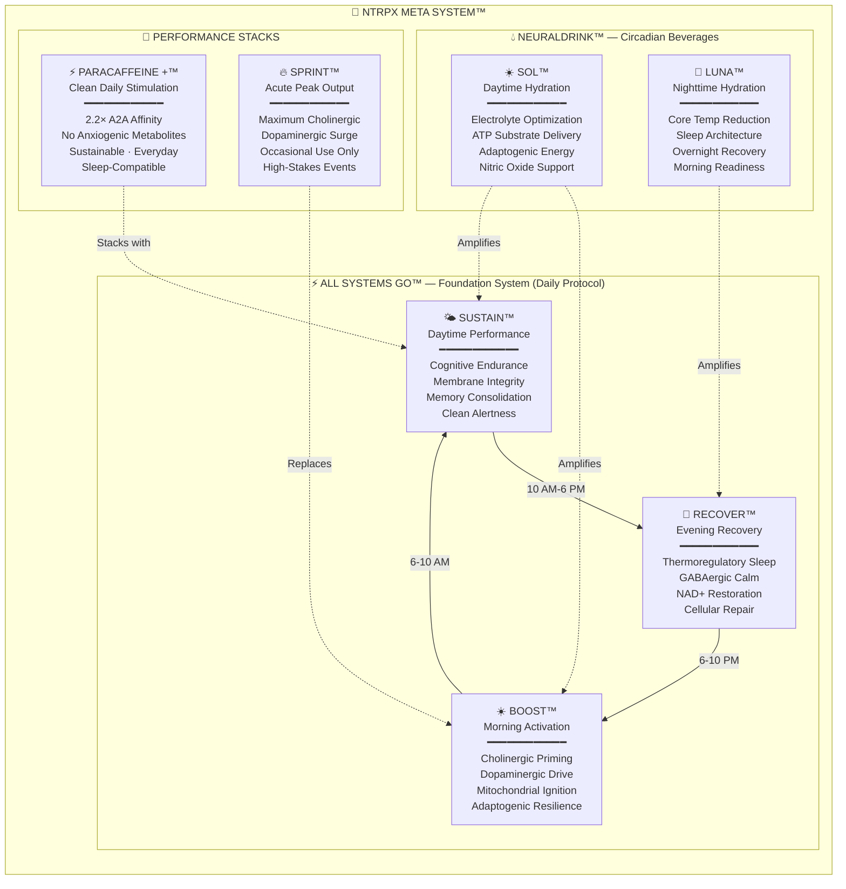
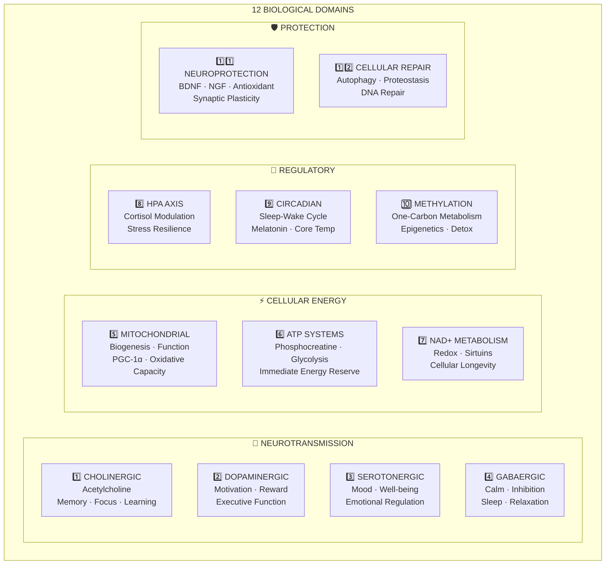
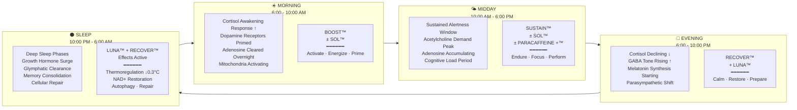
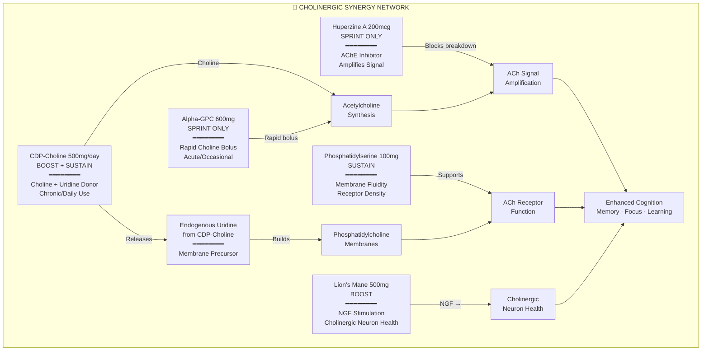
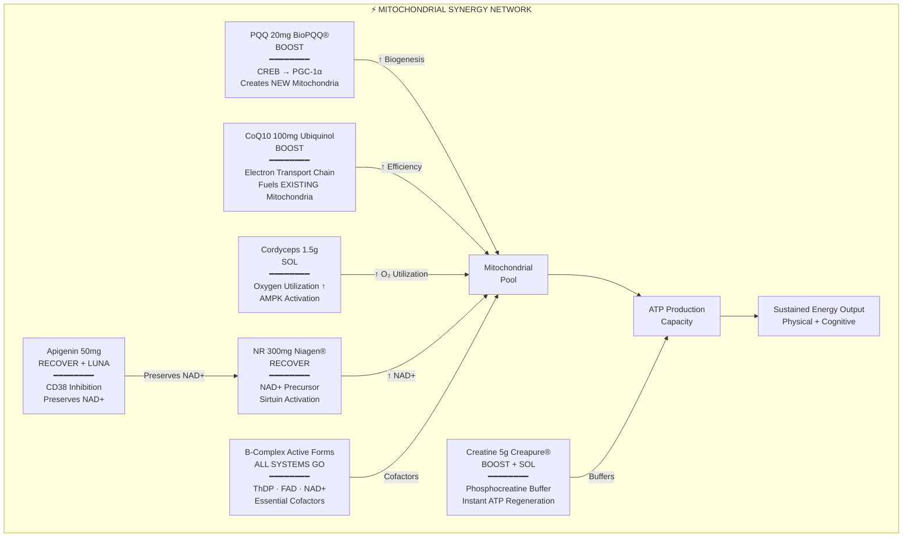
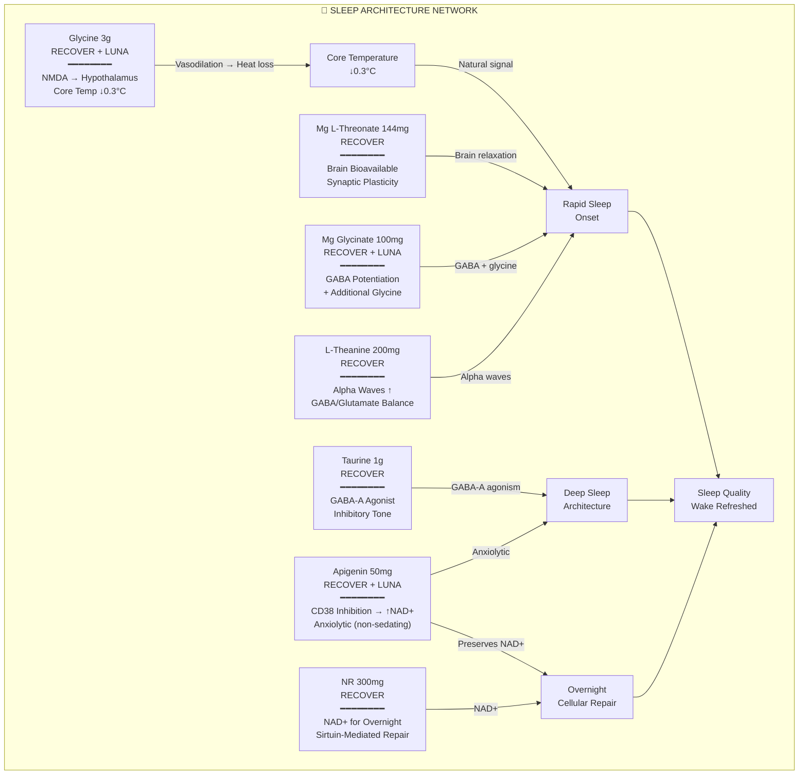
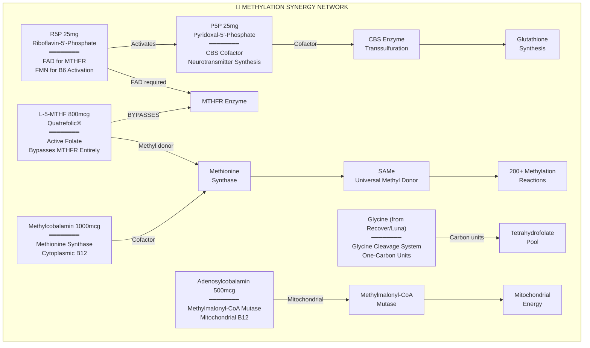
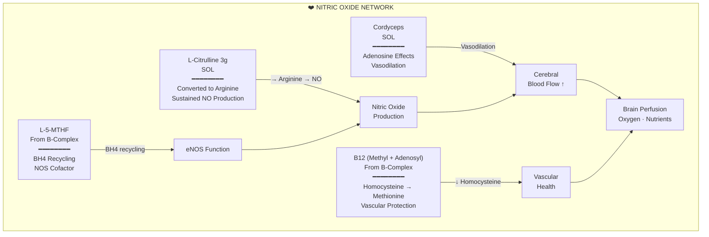
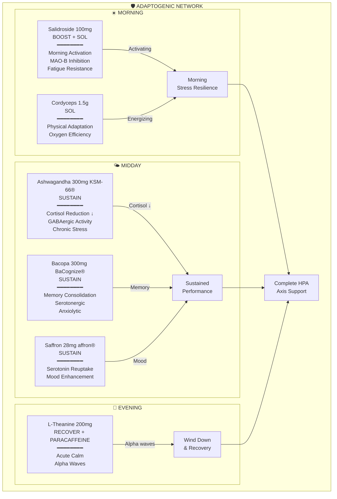
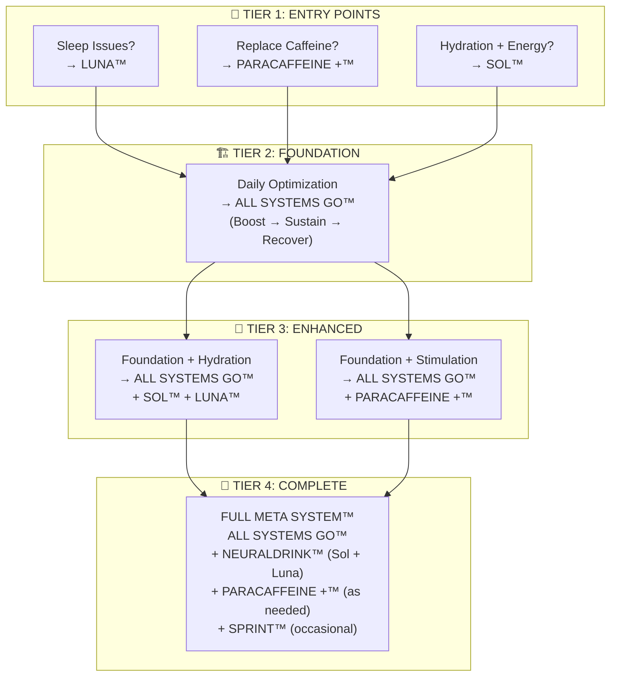

# NTRPX Meta System™

<CardGroup cols={4}>

<Card title="Systems" icon="cubes" color="#5A8FA8">
**4 Integrated Systems**
All Systems Go™ · Neuraldrink™ · ParaCaffeine +™ · Sprint™
</Card>

<Card title="Subsystems" icon="cube" color="#5A8FA8">
**7 Targeted Formulations**
Boost · Sustain · Recover · Sol · Luna · ParaCaffeine + · Sprint
</Card>

<Card title="Biological Domains" icon="dna" color="#5A8FA8">
**12 Optimized Pathways**
Every system governing human performance
</Card>

<Card title="Core Principle" icon="circle-nodes" color="#5A8FA8">
**Circadian Synchronization**
Right compounds at right times
</Card>

</CardGroup>

---

## Executive Summary

**The NTRPX Meta System™ is the most comprehensive, synergistic supplementation architecture ever conceived** — engineered from first principles to optimize every domain of human biological performance.

This is not a collection of supplements. It is a unified system where every ingredient, every dose, and every timing decision has been made with full awareness of every other component. The result:

- **Standalone viability**: Each subsystem works independently
- **Combined optimization**: Full protocol exceeds sum of parts  
- **Zero antagonisms**: No ingredient conflicts with another
- **Maximum synergy**: Compounds amplify each other's effects
- **Circadian synchronization**: Biology-matched timing
- **Complete coverage**: All 12 biological domains addressed

<Note>
**Design Philosophy**: We don't formulate products, then figure out how they work together. We map the complete biological terrain first, identify every pathway that governs human performance, then engineer a unified system where each component plays a defined role. Redundancy is eliminated. Synergies are maximized. Antagonisms are impossible.
</Note>

---

## System Hierarchy

---

## The 12 Biological Domains

<AccordionGroup>

<Accordion title="Complete Domain Map & Coverage Matrix" icon="dna">

The NTRPX Meta System™ systematically optimizes 12 biological domains. Every ingredient maps to specific domains, ensuring complete coverage without wasteful overlap.

### Domain Coverage Matrix

| Domain | Boost™ | Sustain™ | Recover™ | Sol™ | Luna™ | ParaCaffeine +™ | Sprint™ |
|:-------|:------:|:--------:|:--------:|:----:|:-----:|:---------------:|:-------:|
| **1. Cholinergic** | ★★★★ | ★★★★ | ★ | ★ | — | ★★ | ★★★★★ |
| **2. Dopaminergic** | ★★★★★ | ★★ | — | ★★ | — | ★★★ | ★★★★★ |
| **3. Serotonergic** | ★★ | ★★★ | ★★ | ★ | ★ | ★ | — |
| **4. GABAergic** | — | ★ | ★★★★★ | — | ★★★★★ | — | — |
| **5. Mitochondrial** | ★★★★★ | ★★★ | ★★★ | ★★★★ | ★★ | ★★ | ★★★ |
| **6. ATP Systems** | ★★★★★ | ★★★ | ★★ | ★★★★★ | ★★ | ★★★ | ★★★★ |
| **7. NAD+ Metabolism** | ★★★ | ★★ | ★★★★★ | ★★ | ★★★ | — | ★★ |
| **8. HPA Axis** | ★★★★ | ★★★ | ★★★ | ★★★ | ★★ | ★★ | ★ |
| **9. Circadian** | ★★★★ | ★★★ | ★★★★★ | ★★★ | ★★★★★ | ★★ | ★ |
| **10. Methylation** | ★★★★★ | ★★★ | ★★★ | ★★ | ★★ | ★★ | ★★ |
| **11. Neuroprotection** | ★★★★★ | ★★★★ | ★★★ | ★★★ | ★★ | ★★ | ★★★ |
| **12. Cellular Repair** | ★★★ | ★★ | ★★★★★ | ★★ | ★★★★ | — | — |

<Note>
**Reading the Matrix:** ★★★★★ = Primary target with maximum support. — = Intentionally excluded to maintain circadian appropriateness. Notice how GABAergic compounds concentrate in evening formulas (Recover™, Luna™), while dopaminergic activation is morning-weighted (Boost™).
</Note>

</Accordion>

</AccordionGroup>

---

## Master Ingredient Registry

<AccordionGroup>

<Accordion title="Complete Ingredient Catalog by Mechanism" icon="flask">

### All Ingredients in the NTRPX Meta System™

Every compound has been evaluated, selected, and placed based on mechanism, evidence, bioavailability, safety, and synergy with the complete system.

#### 🧠 Neurotransmitter Systems

| Ingredient | Form | Primary Systems | Mechanism | Evidence Tier |
|:-----------|:-----|:----------------|:----------|:-------------:|
| **CDP-Choline** | Cognizin® | Boost™, Sustain™ | Choline + uridine donor; ACh synthesis, membrane support | TIER 1 |
| **Alpha-GPC** | 50% | Sprint™ only | Rapid choline delivery; high bioavailability | TIER 2 |
| **Huperzine A** | 1% extract | Sprint™ only | Acetylcholinesterase inhibitor; amplifies ACh | TIER 2 |
| **L-Tyrosine** | NALT | Boost™, Sol™ | Dopamine/norepinephrine precursor | TIER 1 |
| **L-Theanine** | Suntheanine® | Sustain™, Recover™, ParaCaffeine +™ | Alpha waves; GABA/glutamate balance | TIER 1 |
| **Apigenin** | 98% extract | Recover™, Luna™ | CD38 inhibition; anxiolytic; NAD+ preservation | TIER 2 |
| **Paraxanthine** | enfinity® | Sustain™, Sol™, ParaCaffeine +™ | A2A antagonism 2.2×; no anxiogenic metabolites | TIER 2 |

#### ⚡ Bioenergetics

| Ingredient | Form | Primary Systems | Mechanism | Evidence Tier |
|:-----------|:-----|:----------------|:----------|:-------------:|
| **Creatine** | Creapure® Monohydrate | Boost™, Sol™ | Phosphocreatine buffer; cognitive + physical ATP | TIER 1 |
| **PQQ** | BioPQQ® | Boost™ | Mitochondrial biogenesis via PGC-1α; CREB activation | TIER 2 |
| **CoQ10** | Kaneka Ubiquinol | Boost™ | Electron transport chain; existing mito efficiency | TIER 1 |
| **Cordyceps** | CS-4 / militaris | Sol™ | Oxygen utilization; AMPK; adenosine analog | TIER 2 |
| **NR** | Niagen® | Recover™ | NAD+ precursor; sirtuin activation | TIER 2 |

#### 🌿 Adaptogens & Herbs

| Ingredient | Form | Primary Systems | Mechanism | Evidence Tier |
|:-----------|:-----|:----------------|:----------|:-------------:|
| **Rhodiola/Salidroside** | 3% salidroside | Boost™, Sol™ | MAO-B inhibition; HPA modulation; fatigue resistance | TIER 2 |
| **Lion's Mane** | Fruiting body + mycelium | Boost™ | NGF/BDNF stimulation; neuroplasticity | TIER 2 |
| **Ashwagandha** | KSM-66® or Sensoril® | Sustain™ | Cortisol reduction; GABAergic; adaptogenic | TIER 1 |
| **Bacopa** | BaCognize® 45% bacosides | Sustain™ | Memory consolidation; serotonergic; antioxidant | TIER 1 |
| **Saffron** | affron® 3.5% lepticrosalides | Sustain™ | Serotonin reuptake; mood; neuroprotection | TIER 2 |

#### 😴 Sleep & Circadian

| Ingredient | Form | Primary Systems | Mechanism | Evidence Tier |
|:-----------|:-----|:----------------|:----------|:-------------:|
| **Glycine** | Pharmaceutical grade | Recover™, Luna™ | NMDA → hypothalamus → core temp ↓0.3°C | TIER 1 |
| **Magnesium L-Threonate** | Magtein® | Recover™ | Brain-penetrant Mg; synaptic density; sleep quality | TIER 2 |
| **Magnesium Glycinate** | Chelated | Recover™, Luna™ | GABA potentiation; relaxation; additional glycine | TIER 1 |
| **Taurine** | Pharmaceutical grade | Recover™ | GABA-A agonist; osmoregulation; inhibitory tone | TIER 2 |

#### 🏗️ Structural & Cellular

| Ingredient | Form | Primary Systems | Mechanism | Evidence Tier |
|:-----------|:-----|:----------------|:----------|:-------------:|
| **Phosphatidylserine** | Sharp-PS® (sunflower) | Sustain™ | Membrane fluidity; cortisol modulation; receptor density | TIER 1 |
| **DHA** | Life's DHA® (algal) | Sustain™ | Neuronal membrane; anti-inflammatory; synaptic | TIER 1 |
| **EPA** | Algal | Sustain™ | Anti-inflammatory; cardiovascular; mood | TIER 1 |

#### ❤️ Cardiovascular / Nitric Oxide

| Ingredient | Form | Primary Systems | Mechanism | Evidence Tier |
|:-----------|:-----|:----------------|:----------|:-------------:|
| **L-Citrulline** | Free form | Sol™ | Arginine precursor; sustained NO; blood flow | TIER 1 |
| **Nitrosigine®** | Arginine silicate inositol | Sol™ (alternative) | Stabilized arginine; rapid NO | TIER 2 |

#### 🧬 Essential Nutrients (B-Vitamins — Active Forms Only)

| Vitamin | Form | Primary Systems | Rationale |
|:--------|:-----|:----------------|:----------|
| **B1** | Benfotiamine + TTFD | Boost™, Sustain™ | Benfotiamine peripheral; TTFD CNS-penetrant |
| **B2** | Riboflavin-5'-Phosphate (R5P) | All Systems Go™ | Active coenzyme; no conversion needed |
| **B3** | Nicotinamide Riboside (NR) | Recover™ | NAD+ precursor; superior to niacin/NMN |
| **B5** | D-Calcium Pantothenate | All Systems Go™ | CoA synthesis; standard form effective |
| **B6** | Pyridoxal-5'-Phosphate (P5P) | All Systems Go™ | ONLY acceptable form; pyridoxine neurotoxic |
| **B7** | D-Biotin | Boost™ | Standard form; avoid >1000mcg (lab interference) |
| **B9** | L-5-MTHF (Quatrefolic®) | All Systems Go™ | Active folate; bypasses MTHFR; NO folic acid |
| **B12** | Methylcobalamin + Adenosylcobalamin | All Systems Go™ | Both coenzyme forms; complete B12 support |

#### 🔋 Electrolytes (Neuraldrink™)

| Electrolyte | Form | Sol™ | Luna™ | Rationale |
|:------------|:-----|:----:|:-----:|:----------|
| **Sodium** | Citrate + Pink Himalayan | 1000mg | 300mg | Primary hydration driver; lower at night |
| **Potassium** | Citrate | 500mg | 300mg | Intracellular balance; muscle function |
| **Magnesium** | Citrate + Glycinate | 100mg | 200mg | Higher at night for sleep |
| **Chloride** | From sodium chloride | 400mg | 150mg | Fluid balance |
| **Calcium** | Citrate | 100mg | 50mg | Nerve transmission |
| **Zinc** | Picolinate | — | 15mg | Nighttime immune; sleep regulation |

</Accordion>

<Accordion title="Ingredients Evaluated but EXCLUDED" icon="ban">

### Compounds Considered but Not Included

The following ingredients were rigorously evaluated but excluded from the NTRPX Meta System™ for specific reasons:

| Ingredient | Reason for Exclusion |
|:-----------|:---------------------|
| **Methylene Blue** | Narrow therapeutic window; MAOI interactions; photosensitivity; requires medical supervision; not appropriate for consumer supplement |
| **L-Arginine** | Poor oral bioavailability; extensive first-pass metabolism; L-Citrulline superior for NO production |
| **Folic Acid** | Synthetic; requires multi-step conversion; 30%+ population has MTHFR variants; masks B12 deficiency; L-5-MTHF universally superior |
| **Pyridoxine HCl** | Documented neurotoxicity risk; competitive inhibition of P5P at high doses; P5P is the only acceptable B6 form |
| **Cyanocobalamin** | Requires conversion; contains cyanide moiety; methylcobalamin + adenosylcobalamin provide direct coenzyme forms |
| **Caffeine** | Produces anxiogenic metabolites (theophylline); longer half-life than paraxanthine; paraxanthine is the active metabolite with 2.2× A2A affinity |
| **Melatonin** | Creates dependency; suppresses endogenous production; glycine's thermoregulatory mechanism is superior for sleep onset |
| **Alpha-GPC (daily use)** | 2021 study: 46% increased stroke risk with 10+ year use; CDP-Choline preferred for chronic use; Alpha-GPC reserved for acute/occasional Sprint™ |
| **Choline Bitartrate** | Poor brain bioavailability; doesn't cross BBB efficiently; CDP-Choline and Alpha-GPC superior |
| **Racetams** | Regulatory uncertainty; limited clinical evidence in healthy populations; mechanism overlap with established nootropics |
| **Phenylpiracetam** | Banned by WADA; limited availability; unclear long-term safety |
| **Modafinil** | Prescription-only; not appropriate for supplement formulation |

</Accordion>

</AccordionGroup>

---

## Circadian Synchronization Protocol

<AccordionGroup>

<Accordion title="24-Hour Optimization Architecture" icon="clock">

### The Circadian Imperative

Human biology oscillates in predictable 24-hour cycles. Cortisol peaks in morning. Melatonin rises at night. Neurotransmitter receptor sensitivity shifts throughout the day. Core body temperature follows a precise rhythm that signals sleep onset.

**A supplementation system that ignores circadian biology is fundamentally flawed.**

### Circadian Ingredient Placement Matrix

| Ingredient Category | Morning ☀️ | Midday 🌤️ | Evening 🌙 | Rationale |
|:--------------------|:----------:|:----------:|:----------:|:----------|
| **Dopamine Precursors** (Tyrosine) | ✓✓✓ | ✓ | ✗ | Aligns with cortisol; evening use disrupts sleep architecture |
| **Cholinergics** (CDP-Choline) | ✓✓✓ | ✓✓✓ | ✓ | Supports waking cognition; lower evening dose acceptable |
| **Adenosine Antagonists** (Paraxanthine) | ✓✓ | ✓✓ | ✗ | t½ 3-4h; must clear before sleep; 2PM cutoff recommended |
| **Activating Adaptogens** (Rhodiola) | ✓✓✓ | ✓✓ | ✗ | Morning stress resilience; may interfere with wind-down |
| **Calming Adaptogens** (Ashwagandha) | ✓ | ✓✓ | ✓ | GABAergic; acceptable anytime but emphasize midday |
| **Memory Herbs** (Bacopa, Lion's Mane) | ✓✓ | ✓✓✓ | ✓ | Chronic effects; timing less critical |
| **GABAergics** (Theanine, Taurine, Apigenin) | ✓ | ✓ | ✓✓✓ | Low doses OK anytime; concentrate evening for sleep |
| **Thermoregulatory** (Glycine 3g) | ✗ | ✗ | ✓✓✓ | Specifically triggers sleep via core temp ↓0.3°C |
| **Magnesium Threonate** | ✓ | ✓ | ✓✓✓ | Brain-penetrant; emphasize evening for sleep quality |
| **Magnesium Glycinate** | ✓ | ✓ | ✓✓✓ | GABA potentiation; emphasize evening |
| **PQQ + CoQ10** | ✓✓✓ | ✓ | ✓ | Mitochondrial activation; morning emphasis |
| **NR (NAD+)** | ✓ | ✓ | ✓✓✓ | Evening for overnight sirtuin activation and repair |
| **Creatine** | ✓✓✓ | ✓✓ | ✓ | Primary morning/midday; no sleep interference |
| **B-Vitamins** | ✓✓✓ | ✓✓ | ✓ | Energy cofactors; B6 evening for GABA synthesis |
| **Omega-3 (DHA/EPA)** | ✓ | ✓✓✓ | ✓ | Structural; timing less critical; with food |

</Accordion>

</AccordionGroup>

---

## Cross-System Synergy Architecture

<AccordionGroup>

<Accordion title="Synergy Network 1: Cholinergic Amplification" icon="brain">

### The Cholinergic Stack

Acetylcholine is the master neurotransmitter of cognition — governing memory formation, sustained attention, and learning. The NTRPX Meta System™ provides comprehensive cholinergic support through multiple synergistic mechanisms.

### Why This Architecture?

| Design Decision | Rationale |
|:----------------|:----------|
| **CDP-Choline for daily use** | Provides BOTH choline AND uridine; lower TMAO risk than Alpha-GPC; safe for chronic use |
| **Alpha-GPC for Sprint™ only** | 2021 study showed 46% increased stroke risk with 10+ year use; reserved for acute/occasional |
| **Huperzine A for Sprint™ only** | Potent AChE inhibitor; 24h half-life; would accumulate with daily use |
| **PS in Sustain™** | Membrane support complements choline supply; cortisol modulation aids sustained performance |
| **Lion's Mane in Boost™** | NGF stimulation supports long-term cholinergic neuron health; morning dosing standard |

</Accordion>

<Accordion title="Synergy Network 2: Mitochondrial Optimization" icon="bolt">

### The Bioenergetic Stack

Mitochondria are the powerhouses of every cell. The NTRPX Meta System™ addresses both mitochondrial biogenesis (creating MORE mitochondria) and mitochondrial function (making EXISTING mitochondria work better), plus ATP buffering for immediate availability.

### The PQQ + CoQ10 + Creatine + Cordyceps Mega-Stack

| Component | Role | Timing |
|:----------|:-----|:-------|
| **PQQ** | Creates new mitochondria (biogenesis via PGC-1α) | Morning (Boost™) |
| **CoQ10** | Makes existing mitochondria work better (electron transport) | Morning (Boost™) |
| **Cordyceps** | Improves oxygen utilization; AMPK activation | Daytime (Sol™) |
| **Creatine** | Buffers ATP for instant availability | Morning + Daytime (Boost™ + Sol™) |
| **NR** | Provides NAD+ for overnight mitochondrial maintenance | Evening (Recover™) |
| **Apigenin** | Inhibits CD38 to preserve NAD+ | Evening (Recover™ + Luna™) |
| **B-vitamins** | Essential cofactors for all energy pathways | All day (All Systems Go™) |

**Combined Effect:** More powerhouses (PQQ), working better (CoQ10), using oxygen efficiently (Cordyceps), with reserve capacity (Creatine), maintained overnight (NR + Apigenin).

</Accordion>

<Accordion title="Synergy Network 3: Sleep Architecture" icon="moon">

### The Thermoregulatory Sleep Stack

The NTRPX Meta System™ does NOT rely on sedation for sleep. Instead, it leverages the body's natural thermoregulatory sleep-onset mechanism plus GABAergic support for deep sleep architecture.

### Why Glycine at Exactly 3g is Non-Negotiable

| Dose | Effect | Evidence |
|:-----|:-------|:---------|
| **< 3g** | Insufficient hypothalamic signaling | Subtherapeutic |
| **= 3g** | Triggers measurable 0.3°C core temperature drop | Bannai et al. 2012; Inagawa et al. 2006 |
| **> 3g** | No additional benefit; waste | Dose-response plateaus |

**This is the body's natural sleep signal** — peripheral vasodilation causes heat loss, core temperature drops, hypothalamus interprets this as "time to sleep." Not sedation. Not dependency. Natural physiology.

### Why NOT Melatonin?

| Problem | Explanation |
|:--------|:------------|
| **Suppresses endogenous production** | Long-term use reduces natural melatonin synthesis |
| **Creates dependency** | Users often need increasing doses |
| **Doesn't address architecture** | Only affects onset, not deep sleep quality |
| **Timing sensitivity** | Wrong timing can shift circadian phase |

**The NTRPX Solution:** Glycine triggers the body's OWN sleep mechanisms. Apigenin + NR support overnight repair. Magnesium + Taurine + Theanine support deep sleep architecture. No dependency. No suppression.

</Accordion>

<Accordion title="Synergy Network 4: Methylation Pathway" icon="dna">

### The One-Carbon Metabolism Stack

Methylation governs over 200 biochemical reactions including neurotransmitter synthesis, DNA repair, detoxification, and gene expression. The NTRPX Meta System™ provides complete methylation support using ONLY active/coenzyme forms.

### Why ONLY Active B-Vitamin Forms

| Vitamin | Excluded Form | Why Excluded | Included Form | Why Included |
|:--------|:--------------|:-------------|:--------------|:-------------|
| **B6** | Pyridoxine HCl | **Neurotoxicity risk**; competitive inhibition of P5P | P5P | Direct coenzyme; no conversion |
| **B9** | Folic acid | Requires 4-step conversion; MTHFR variants; masks B12 deficiency | L-5-MTHF (Quatrefolic®) | Already active; bypasses all variants |
| **B12** | Cyanocobalamin | Requires conversion; cyanide moiety | Methylcobalamin + Adenosylcobalamin | Direct coenzymes; complete coverage |
| **B2** | Riboflavin | Requires phosphorylation | R5P | Direct coenzyme |

**Critical:** These are not preferences — they are requirements. Pyridoxine can cause peripheral neuropathy. Folic acid may be harmful to 30%+ of the population with MTHFR variants.

</Accordion>

<Accordion title="Synergy Network 5: Nitric Oxide & Blood Flow" icon="heart">

### The Vascular Support Stack

Cognitive performance depends on blood flow delivering oxygen and nutrients to the brain. The NTRPX Meta System™ optimizes nitric oxide production for enhanced perfusion.

### Why L-Citrulline Over L-Arginine

| Factor | L-Arginine | L-Citrulline |
|:-------|:-----------|:-------------|
| **Oral bioavailability** | ~20% (extensive first-pass) | ~80% |
| **Plasma arginine increase** | Modest, brief | Sustained, significant |
| **Effective dose** | 6-10g (GI distress) | 3-6g (well-tolerated) |
| **NO production** | Limited by arginase | Bypasses arginase |
| **NTRPX Decision** | ❌ Excluded | ✅ Included in Sol™ |

**Alternative:** Nitrosigine® (arginine silicate inositol) provides stabilized arginine with better bioavailability — acceptable alternative to L-Citrulline.

</Accordion>

<Accordion title="Synergy Network 6: Adaptogenic Stress Resilience" icon="shield">

### The HPA Axis Modulation Stack

Chronic stress degrades cognitive performance, depletes neurotransmitters, and disrupts sleep. The NTRPX Meta System™ employs a circadian-synchronized adaptogen strategy.

### Adaptogen Timing Strategy

| Adaptogen | Timing | Rationale |
|:----------|:-------|:----------|
| **Salidroside/Rhodiola** | Morning (Boost™, Sol™) | Activating; MAO-B inhibition extends dopamine; may interfere with sleep if evening |
| **Cordyceps** | Daytime (Sol™) | Energizing; oxygen efficiency; pairs with physical activity |
| **Ashwagandha** | Midday (Sustain™) | GABAergic properties; cortisol reduction; some find too sedating for morning |
| **Bacopa** | Midday (Sustain™) | Chronic nootropic; timing less critical; traditionally with food |
| **Saffron** | Midday (Sustain™) | Serotonergic; mood support during active hours |
| **L-Theanine** | Anytime, emphasize evening | Acutely calming; pairs with stimulants to smooth; concentrate evening for sleep |

</Accordion>

</AccordionGroup>

---

## Ingredient Interaction Matrix

<AccordionGroup>

<Accordion title="Synergies, Redundancies, and Prevented Antagonisms" icon="diagram-project">

### Confirmed Synergistic Pairs in NTRPX

| Pair | Mechanism | Location |
|:-----|:----------|:---------|
| **CDP-Choline + Uridine (endogenous)** | Phosphatidylcholine synthesis; membrane + ACh | Boost™ + Sustain™ |
| **PQQ + CoQ10** | Biogenesis + function; new + efficient mitochondria | Boost™ |
| **Creatine + PQQ + CoQ10** | More mitochondria, working better, with ATP buffer | Boost™ + Sol™ |
| **Paraxanthine + L-Theanine** | Alert without anxious; smooth stimulation | ParaCaffeine +™ |
| **Glycine + Magnesium** | Thermoregulation + GABA; comprehensive sleep onset | Recover™ + Luna™ |
| **Apigenin + NR** | CD38 inhibition preserves NR-derived NAD+ | Recover™ |
| **Salidroside + Tyrosine** | MAO-B inhibition + DA precursor = extended DA | Boost™ |
| **DHA + PS** | Membrane fluidity synergy; receptor support | Sustain™ |
| **Ashwagandha + Bacopa** | Stress reduction + memory; complementary mechanisms | Sustain™ |
| **L-Citrulline + B9/B12** | NO production + vascular protection | Sol™ + All Systems Go™ |
| **Cordyceps + Creatine** | Oxygen efficiency + ATP buffer; endurance stack | Sol™ |

### Prevented Antagonisms

| Avoided Combination | Why It's Bad | NTRPX Solution |
|:--------------------|:-------------|:---------------|
| **High-dose B6 (pyridoxine) + Levodopa** | Peripheral conversion reduces efficacy | P5P only; L-DOPA only in Sprint™ |
| **Stimulants + High-dose GABAergics (same time)** | Opposing effects waste both | Circadian separation |
| **Iron + Polyphenols/Tannins** | Absorption interference | No iron in NTRPX formulas |
| **Alpha-GPC (chronic) + cardiovascular risk** | 46% increased stroke risk long-term | CDP-Choline daily; Alpha-GPC Sprint™ only |
| **Huperzine A (daily)** | 24h half-life; accumulation | Sprint™ only (occasional) |
| **Multiple strong stimulants** | Overstimulation; anxiety | Paraxanthine replaces caffeine (cleaner) |
| **Melatonin + endogenous production** | Suppression; dependency | Glycine thermoregulation instead |

### Intentional Redundancies (Reinforcement)

| "Redundancy" | Why It's Intentional |
|:-------------|:---------------------|
| **Glycine in Recover™ AND Luna™** | Critical threshold (3g+) for thermoregulation; insurance |
| **Magnesium in Recover™ AND Luna™** | Multiple forms for different functions; ensures adequacy |
| **CDP-Choline in Boost™ AND Sustain™** | All-day cholinergic support; split dosing optimal |
| **Creatine in Boost™ AND Sol™** | Loading/maintenance; multiple touchpoints improve compliance |
| **L-Theanine in multiple products** | Ubiquitously useful; smooths stimulants, aids sleep |

</Accordion>

</AccordionGroup>

---

## Usage Protocols

<AccordionGroup>

<Accordion title="Protocol Tiers: Entry to Complete" icon="stairs">

### The NTRPX Meta System™ is modular by design.

Users can enter at any level and progress as desired. Each tier provides standalone value while building toward complete optimization.

### Protocol Specifications

| Tier | Products | Use Case | Expected Benefits |
|:-----|:---------|:---------|:------------------|
| **1: Entry** | Luna™ OR ParaCaffeine +™ OR Sol™ | Specific need; testing the system | Targeted improvement in sleep OR energy OR hydration |
| **2: Foundation** | All Systems Go™ (Boost + Sustain + Recover) | Daily optimization | Complete circadian support; energy, cognition, sleep |
| **3: Enhanced** | All Systems Go™ + Neuraldrink™ OR ParaCaffeine +™ | Serious optimization | Foundation + hydration/ATP OR additional clean energy |
| **4: Complete** | All products as indicated | Maximum optimization | Full biological coverage across all 12 domains |

</Accordion>

<Accordion title="Daily Schedule: Complete Protocol" icon="calendar-day">

### 24-Hour Complete Protocol Schedule

| Time | Products | Ritual |
|:-----|:---------|:-------|
| **6:00-7:00 AM** | **BOOST™** | Upon waking, with light breakfast |
| **7:00-9:00 AM** | **SOL™** | First hydration; mix in 16-20oz water |
| **9:00-10:00 AM** | *(Optional: PARACAFFEINE +™)* | If additional alertness needed; 90-120 min after waking |
| **12:00-2:00 PM** | **SUSTAIN™** | With lunch |
| **2:00-4:00 PM** | **SOL™** (second serving, optional) | Afternoon hydration; NO paraxanthine products after 2PM |
| **6:00-8:00 PM** | **LUNA™** | Evening hydration; begin wind-down |
| **8:30-9:30 PM** | **RECOVER™** | 30-60 minutes before bed |
| **10:00-11:00 PM** | Sleep | Target 7-9 hours |

### Event Day Protocol (Sprint™)

For high-demand cognitive events (presentations, exams, competitions):

| Time | Modification |
|:-----|:-------------|
| **Morning** | **SPRINT™** replaces Boost™ |
| **Midday** | Sustain™ as normal (or skip if Sprint™ effects persist) |
| **No ParaCaffeine +™** | Sprint™ contains caffeine; no stacking |
| **Evening** | Recover™ + Luna™ as normal (extra important for recovery) |
| **Frequency** | Maximum 1-2× per week; not for daily use |

</Accordion>

<Accordion title="Stacking Rules & Paraxanthine Management" icon="layer-group">

### Paraxanthine Daily Limits

Paraxanthine appears in multiple NTRPX products. Track total daily intake:

| Product | Paraxanthine Content |
|:--------|:---------------------|
| **Sustain™** | 100mg |
| **Sol™** | 100mg |
| **ParaCaffeine +™** | 100mg |

| Combination | Total | Assessment |
|:------------|:------|:-----------|
| Sustain™ alone | 100mg | ✅ Safe |
| Sustain™ + ParaCaffeine +™ | 200mg | ✅ Safe |
| Sustain™ + Sol™ | 200mg | ✅ Safe |
| Sustain™ + Sol™ + ParaCaffeine +™ | 300mg | ⚠️ Maximum; rare occasions only |
| Any paraxanthine after 2PM | Variable | ❌ Avoid; sleep interference |

### What NOT to Combine

| Combination | Why Avoid |
|:------------|:----------|
| **Sprint™ + ParaCaffeine +™** | Sprint™ contains caffeine; excessive stimulation |
| **Sprint™ + Boost™ (same day)** | Redundant; Sprint™ replaces Boost™ for that day |
| **Sprint™ + evening products (same day)** | Sprint™ may override evening wind-down; ensure sleep |
| **Any stimulant after 2PM** | Sleep is sacred; no exceptions |
| **Huperzine A daily** | Only in Sprint™; 24h half-life; would accumulate |

</Accordion>

</AccordionGroup>

---

## Product Specifications Overview

*Detailed formulations for each product follow in the next document.*

<CardGroup cols={2}>

<Card title="All Systems Go™" icon="bolt" color="#5A8FA8">
**Foundation System — Daily Protocol**

Three circadian-synchronized formulations providing complete daily biological optimization.

- **Boost™**: Morning activation
- **Sustain™**: Daytime performance  
- **Recover™**: Evening recovery

*The core of the NTRPX Meta System™*
</Card>

<Card title="Neuraldrink™" icon="droplet" color="#4AC1E0">
**Circadian Functional Beverages**

Precision-formulated hydration synchronized to circadian biology.

- **Sol™**: Daytime hydration + energy + NO
- **Luna™**: Nighttime hydration + sleep support

*Amplifies All Systems Go™*
</Card>

<Card title="ParaCaffeine +™" icon="mug-hot" color="#F4A460">
**Clean Daily Stimulation**

Caffeine evolved. Paraxanthine with synergistic cofactors for sustainable, sleep-compatible energy.

- 2.2× A2A receptor affinity
- No anxiogenic metabolites
- Everyday use appropriate

*Stacks with Sustain™*
</Card>

<Card title="Sprint™" icon="rocket" color="#FF6B6B">
**Acute Peak Performance**

Maximum cholinergic + dopaminergic drive for high-stakes cognitive events.

- Alpha-GPC + Huperzine A
- Caffeine + L-DOPA support
- **Occasional use only (1-2×/week)**

*Replaces Boost™ on event days*
</Card>

</CardGroup>

---

## Document Control

| Version | Date | Author | Changes |
|:--------|:-----|:-------|:--------|
| 2.0 | 2026-01-25 | NTRPX R&D | Complete Meta System architecture with all ingredients from site |

---

<Tip>
**Next Document:** Complete formulations for each product — All Systems Go™ (Boost™, Sustain™, Recover™), Neuraldrink™ (Sol™, Luna™), ParaCaffeine +™, and Sprint™ — with exact doses, forms, and rationales.
</Tip>