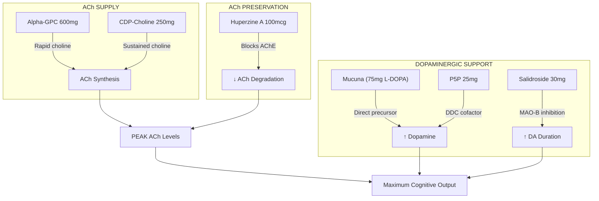

# NTRPX Systems — Complete Formulations v3

<Note>
**Version 3 Corrections:**
- Removed paraxanthine from Neuraldrink™ Sol (ParaCaffeine +™ is the optional stimulant add-on)
- All salidroside now ≥98% pure precision-fermented, capsules only (bitter)
- Complete taste profile verification for all Neuraldrink™ ingredients
- Added physiological melatonin micro-dose (0.3mg) to Recover™
- Huperzine A changed to ≥98% synthetic pure form
- Removed non-acute ingredients from Sprint™ (PS, Lion's Mane)
- Sodium sources changed to pharmaceutical grade (removed Pink Himalayan)
- Added complete glucose:fructose carbohydrate system to Neuraldrink™
- Verified All Systems Go™ independence from Neuraldrink™
</Note>

---

# All Systems Go™ — Foundation System

**The complete daily protocol. Standalone viability — does NOT depend on Neuraldrink™ for optimization.**

---

## ☀️ Boost™ — Morning Activation

<CardGroup cols={4}>

<Card title="Timing" icon="clock" color="#F4A460">
6:00 - 10:00 AM
</Card>

<Card title="With Food" icon="utensils" color="#F4A460">
Light breakfast
</Card>

<Card title="Format" icon="capsules" color="#F4A460">
Capsules (6-8 capsules)
</Card>

<Card title="Philosophy" icon="lightbulb" color="#F4A460">
"Wake up sharp, not wired"
</Card>

</CardGroup>

### Boost™ Complete Formulation

| Ingredient | Form | Dose | Domain | Notes |
|:-----------|:-----|:-----|:-------|:------|
| **CDP-Choline** | Cognizin® | 300 mg | Cholinergic | Pharmaceutical-grade citicoline |
| **L-Tyrosine** | N-Acetyl-L-Tyrosine (NALT) | 500 mg | Dopaminergic | Improved stability vs free form |
| **Creatine** | Creapure® Monohydrate | 2,500 mg | ATP Systems | Combined with Sustain = 5g/day |
| **PQQ** | BioPQQ® | 20 mg | Mitochondrial | Clinically validated dose |
| **CoQ10** | Kaneka Ubiquinol | 100 mg | Mitochondrial | Reduced form; 8× absorption |
| **Salidroside** | ≥98% Precision Fermented | 15 mg | HPA Axis | PureRosea™; NOT Rhodiola extract |
| **Lion's Mane** | Dual Extract (Fruiting Body + Mycelium) | 500 mg | Neuroprotection | Standardized to hericenones + erinacines |

### Boost™ B-Complex (Active Forms Only)

| Vitamin | Form | Dose | Rationale |
|:--------|:-----|:-----|:----------|
| **B1** | Benfotiamine | 150 mg | Fat-soluble; AGE inhibition; peripheral nerves |
| **B1** | TTFD (Sulbutiamine) | 50 mg | CNS-penetrant thiamine; crosses BBB |
| **B2** | Riboflavin-5'-Phosphate (R5P) | 15 mg | Active coenzyme; supports B6/B9 activation |
| **B3** | Nicotinamide | 100 mg | NAD+ precursor; no flush |
| **B5** | D-Calcium Pantothenate | 50 mg | CoA synthesis |
| **B6** | Pyridoxal-5'-Phosphate (P5P) | 15 mg | **ONLY safe form** — pyridoxine neurotoxic |
| **B7** | D-Biotin | 300 mcg | Keep \<1000mcg (lab interference) |
| **B9** | L-5-MTHF (Quatrefolic®) | 400 mcg | Active folate; bypasses MTHFR |
| **B12** | Methylcobalamin | 500 mcg | Cytoplasmic coenzyme |
| **B12** | Adenosylcobalamin | 250 mcg | Mitochondrial coenzyme |

---

## 🌤️ Sustain™ — Daytime Performance

<CardGroup cols={4}>

<Card title="Timing" icon="clock" color="#FFD700">
10:00 AM - 2:00 PM
</Card>

<Card title="With Food" icon="utensils" color="#FFD700">
With lunch
</Card>

<Card title="Format" icon="capsules" color="#FFD700">
Capsules (6-8 capsules)
</Card>

<Card title="Philosophy" icon="lightbulb" color="#FFD700">
"All-day cognitive endurance"
</Card>

</CardGroup>

### Sustain™ Complete Formulation

| Ingredient | Form | Dose | Domain | Notes |
|:-----------|:-----|:-----|:-------|:------|
| **CDP-Choline** | Cognizin® | 250 mg | Cholinergic | Continued ACh support |
| **Creatine** | Creapure® Monohydrate | 2,500 mg | ATP Systems | Combined with Boost = 5g/day |
| **Phosphatidylserine** | Sharp-PS® (sunflower) | 100 mg | Neuroprotection | Chronic membrane support |
| **L-Theanine** | Suntheanine® | 100 mg | GABAergic | Alpha waves; calm focus |
| **Bacopa monnieri** | BaCognize® 45% bacosides | 300 mg | Memory | Chronic nootropic |
| **Ashwagandha** | KSM-66® | 300 mg | HPA Axis | Cortisol modulation |
| **Saffron** | affron® 3.5% lepticrosalides | 28 mg | Serotonergic | Mood support |
| **DHA** | Life's DHA® (algal) | 250 mg | Structural | Neuronal membrane |
| **EPA** | Algal | 125 mg | Cardiovascular | Anti-inflammatory |

### Sustain™ B-Complex Continuation

| Vitamin | Form | Dose |
|:--------|:-----|:-----|
| **B1** | Benfotiamine | 100 mg |
| **B2** | R5P | 10 mg |
| **B5** | Calcium Pantothenate | 50 mg |
| **B6** | P5P | 10 mg |
| **B12** | Adenosylcobalamin | 250 mcg |

---

## 🌙 Recover™ — Evening Recovery

<CardGroup cols={4}>

<Card title="Timing" icon="clock" color="#4A5568">
30-60 min before bed
</Card>

<Card title="With/Without" icon="utensils" color="#4A5568">
Light or empty stomach
</Card>

<Card title="Format" icon="capsules" color="#4A5568">
Capsules + Powder (glycine)
</Card>

<Card title="Philosophy" icon="lightbulb" color="#4A5568">
"Sleep deep, wake restored"
</Card>

</CardGroup>

### Recover™ Complete Formulation

| Ingredient | Form | Dose | Domain | Notes |
|:-----------|:-----|:-----|:-------|:------|
| **Glycine** | Pharmaceutical grade | 3,000 mg | Circadian | Core temp ↓0.3°C — non-negotiable dose |
| **Magnesium L-Threonate** | Magtein® | 144 mg (elem.) | GABAergic | Brain-penetrant Mg |
| **Magnesium Glycinate** | Chelated | 100 mg (elem.) | GABAergic | GABA potentiation + glycine |
| **L-Theanine** | Suntheanine® | 200 mg | GABAergic | Alpha waves; relaxation |
| **Apigenin** | ≥98% extract | 50 mg | NAD+ | CD38 inhibition; anxiolytic |
| **Taurine** | Pharmaceutical grade | 1,000 mg | GABAergic | GABA-A agonist |
| **NR** | Niagen® | 300 mg | NAD+ | Overnight NAD+ restoration |
| **Melatonin** | Pharmaceutical grade | **0.3 mg** | Circadian | Physiological dose (MIT research) |
| **Zinc** | Zinc Picolinate | 15 mg | Repair | Sleep regulation; immune |

### Recover™ Evening B-Vitamins

| Vitamin | Form | Dose | Rationale |
|:--------|:-----|:-----|:----------|
| **B6** | P5P | 10 mg | GABA synthesis cofactor |
| **B9** | L-5-MTHF | 400 mcg | Overnight methylation |
| **B12** | Methylcobalamin | 250 mcg | No sleep interference |

<AccordionGroup>

<Accordion title="Why Melatonin 0.3mg is Safe and Sustainable" icon="moon">

### MIT Research on Physiological Melatonin Dosing

Dr. Richard Wurtman's research at MIT established critical findings:

| Dose | Effect | Sustainability |
|:-----|:-------|:---------------|
| **0.3 mg** | Physiological; restores normal nocturnal levels | ✅ Does not suppress endogenous production |
| **3.0 mg** | Supraphysiological (10×); LESS effective | ❌ May cause tolerance, hypothermia |

**Key findings:**
- 0.3 mg raises plasma melatonin to **within the normal nocturnal range** (113 ± 13.5 pg/ml)
- Higher doses (3mg+) are actually **less effective** for treating insomnia
- Low doses don't cause "hangover effects"
- One-month treatment maintained efficacy **without tolerance** in primate studies

**Why this works with Glycine:**
- Glycine → thermoregulatory sleep onset (peripheral mechanism)
- Melatonin 0.3mg → gentle circadian signal (central mechanism)
- **Complementary, non-redundant pathways**

</Accordion>

</AccordionGroup>

---

## All Systems Go™ Daily Totals

### Summary: What You Get Per Day

| Category | Boost™ | Sustain™ | Recover™ | **Daily Total** |
|:---------|:------:|:--------:|:--------:|:---------------:|
| **Creatine** | 2,500 mg | 2,500 mg | — | **5,000 mg** ✓ |
| **CDP-Choline** | 300 mg | 250 mg | — | **550 mg** ✓ |
| **Magnesium** | — | — | 244 mg | **244 mg** |
| **DHA + EPA** | — | 375 mg | — | **375 mg** |
| **All B-vitamins** | Distributed | Distributed | Distributed | **Complete** ✓ |

### All Systems Go™ Independence Verification

<Check>
**All Systems Go™ is COMPLETE without Neuraldrink™:**
- Full creatine dosing (5g/day) ✓
- Full choline support (550mg/day) ✓  
- Full B-complex (active forms) ✓
- Full omega-3 (DHA + EPA) ✓
- Full sleep support (glycine, magnesium, NR, melatonin) ✓
- Full adaptogens (salidroside, ashwagandha, bacopa) ✓

**Neuraldrink™ ADDS:**
- Optimized hydration + electrolytes
- Brain glucose fuel (cognitive facilitation)
- Additional glycine (Luna) for enhanced sleep
</Check>

---

# Neuraldrink™ — Circadian Functional Beverages

**Precision-formulated hydration drinks — taste-optimized for daily enjoyment.**

---

## Neuraldrink™ Taste Profile Requirements

<Warning>
**Ingredient Placement Rules for Drink Mixes:**

The following ingredients are **EXCLUDED from Neuraldrink™** due to taste/solubility:

| Ingredient | Issue | Appropriate Product |
|:-----------|:------|:--------------------|
| **Salidroside** | Bitter | Boost™, Sprint™ (capsules) |
| **PQQ** | Red-orange color; bitter | Boost™ (capsules) |
| **Alpha-GPC** | Fishy taste | Sprint™ (capsules) |
| **Huperzine A** | Extremely bitter | Sprint™ (capsules) |
| **Phosphatidylserine** | Fat-soluble; doesn't dissolve | Sustain™ (capsules) |
| **Bacopa** | Bitter | Sustain™ (capsules) |
| **Ashwagandha** | Earthy/bitter | Sustain™ (capsules) |
| **Creatine** | Sandy texture; incomplete dissolution | Boost™/Sustain™ (capsules) |
| **Lion's Mane** | Earthy taste | Boost™ (capsules) |

**Neuraldrink™ ingredients must be:**
✓ Water-soluble (complete dissolution)
✓ Neutral or sweet taste (or easily masked)
✓ Stable in solution
✓ Color-compatible with citrus drink
</Warning>

---

## ☀️ Sol™ — Daytime Hydration + Energy

<CardGroup cols={4}>

<Card title="Timing" icon="clock" color="#FFD700">
Morning through Early Afternoon
</Card>

<Card title="Serving" icon="glass-water" color="#FFD700">
Mix in 16-20 oz water
</Card>

<Card title="Flavor" icon="lemon" color="#FFD700">
Citrus (Lemon-Lime / Orange)
</Card>

<Card title="Philosophy" icon="lightbulb" color="#FFD700">
"Clean energy that sustains"
</Card>

</CardGroup>

### Sol™ Complete Formulation

<Note>
**NO PARAXANTHINE** — ParaCaffeine +™ is the optional stimulant add-on for those who want it.
Sol™ is pure hydration + brain fuel + NO support.
</Note>

#### Carbohydrate System (Brain Fuel)

| Ingredient | Amount | Function | Taste |
|:-----------|:-------|:---------|:------|
| **D-Glucose Monohydrate** | 15 g | Immediate brain fuel; cognitive facilitation | Sweet ✓ |
| **Fructose** | 8 g | Sustained energy; liver glycogen | Very sweet ✓ |

**Glucose:Fructose Ratio:** 65:35 (optimized for brain + sustained energy)  
**Total Sugars:** 23g per serving

#### Active Ingredients

| Ingredient | Form | Dose | Domain | Taste Profile |
|:-----------|:-----|:-----|:-------|:--------------|
| **L-Citrulline** | Free form | 3,000 mg | Cardiovascular | Slightly tart ✓ (citrus-compatible) |
| **Cordyceps** | CS-4 Water Extract | 1,000 mg | Mitochondrial | Mild; easily masked ✓ |
| **Taurine** | Pharmaceutical grade | 1,000 mg | Cellular | Slightly sweet ✓ |
| **L-Tyrosine** | Free form | 300 mg | Dopaminergic | Neutral ✓ |

#### Electrolyte Complex (Pharmaceutical Grade)

| Electrolyte | Form | Dose | Notes |
|:------------|:-----|:-----|:------|
| **Sodium** | Sodium Citrate (USP) | 500 mg | Citrate provides alkalinity |
| **Sodium** | Sodium Chloride (USP) | 500 mg | NaCl for chloride |
| **Potassium** | Potassium Citrate (USP) | 500 mg | Intracellular balance |
| **Magnesium** | Magnesium Citrate | 75 mg (elem.) | Tart; citrus-compatible ✓ |
| **Calcium** | Calcium Citrate | 100 mg (elem.) | Neutral ✓ |
| **Chloride** | (from NaCl above) | ~300 mg | Fluid balance |

**Total Sodium:** 1,000 mg (from citrate + chloride sources)

#### B-Vitamin Hydration Complex

| Vitamin | Form | Dose | Taste |
|:--------|:-----|:-----|:------|
| **B1** | Thiamine HCl | 2 mg | Mild ✓ |
| **B2** | R5P | 2 mg | Slight yellow; mild ✓ |
| **B3** | Niacinamide | 25 mg | Mild; no flush ✓ |
| **B5** | Calcium Pantothenate | 15 mg | Mild ✓ |
| **B6** | P5P | 5 mg | Mild ✓ |
| **B12** | Methylcobalamin | 250 mcg | Tasteless ✓ |
| **Vitamin C** | Ascorbic Acid | 100 mg | Tart; citrus-compatible ✓ |
| **Chromium** | Chromium Picolinate | 100 mcg | Tasteless ✓ |

<AccordionGroup>

<Accordion title="Why NO Paraxanthine in Sol™" icon="ban">

### Sol™ is NOT a Stimulant Drink

**Design Philosophy:**
- Sol™ = foundational hydration + brain fuel + nitric oxide support
- ParaCaffeine +™ = optional clean stimulant add-on
- **Users should be able to hydrate WITHOUT stimulation**

**Use Cases:**
- Afternoon hydration (after 2PM cutoff for stimulants)
- Hydration during/after exercise
- Users who don't want stimulants
- Cycling off stimulants

**If you want stimulation:** Add ParaCaffeine +™ to your protocol

</Accordion>

<Accordion title="Sodium Source Clarification" icon="flask">

### Why Pharmaceutical Grade Sodium, NOT Pink Himalayan

**Research findings on Pink Himalayan Salt:**

| Concern | Evidence |
|:--------|:---------|
| **Lead contamination** | 2020 Australian study: one sample exceeded maximum contaminant level (>2 mg/kg) |
| **Microplastics** | 2023 study: Coarse Himalayan pink salt had **highest microplastics load** of tested salts |
| **Heavy metals** | Arsenic, cadmium detected in some samples |
| **Mineral claims** | Trace minerals at nutritionally insignificant levels; would need >30g/day to matter |

**NTRPX Solution:**

| Source | Form | Why |
|:-------|:-----|:----|
| **Sodium Citrate** | USP grade | Provides sodium + citrate (pH buffering); pharmaceutical purity |
| **Sodium Chloride** | USP/Ph. Eur. grade | Provides sodium + chloride; >99.9% pure; no contaminants |

**Both sources are pharmaceutical grade with guaranteed purity and no heavy metal/microplastic concerns.**

</Accordion>

</AccordionGroup>

---

## 🌙 Luna™ — Nighttime Hydration + Sleep

<CardGroup cols={4}>

<Card title="Timing" icon="clock" color="#4A5568">
1-2 hours before bed
</Card>

<Card title="Serving" icon="glass-water" color="#4A5568">
Mix in 12-16 oz water
</Card>

<Card title="Flavor" icon="moon" color="#4A5568">
Citrus-Chamomile / Berry
</Card>

<Card title="Philosophy" icon="lightbulb" color="#4A5568">
"Hydrate while you restore"
</Card>

</CardGroup>

### Luna™ Complete Formulation

#### Carbohydrate System (Lower for Evening)

| Ingredient | Amount | Function | Taste |
|:-----------|:-------|:---------|:------|
| **D-Glucose Monohydrate** | 8 g | Baseline brain support | Sweet ✓ |
| **Fructose** | 4 g | Gentle sustained release | Very sweet ✓ |

**Glucose:Fructose Ratio:** 67:33  
**Total Sugars:** 12g per serving (lower for evening)

#### Sleep Support Ingredients

| Ingredient | Form | Dose | Domain | Taste Profile |
|:-----------|:-----|:-----|:-------|:--------------|
| **Glycine** | Pharmaceutical grade | 3,000 mg | Circadian | Sweet ✓ (naturally sweet amino acid) |
| **Magnesium Glycinate** | Chelated | 200 mg (elem.) | GABAergic | Mild ✓ |
| **L-Theanine** | Suntheanine® | 150 mg | GABAergic | Mild umami; easily masked ✓ |
| **Taurine** | Pharmaceutical grade | 500 mg | GABAergic | Slightly sweet ✓ |
| **Apigenin** | 98% extract | 25 mg | NAD+ | Slight bitterness — requires masking |

#### Electrolyte Complex (Reduced Sodium for Night)

| Electrolyte | Form | Dose | Notes |
|:------------|:-----|:-----|:------|
| **Sodium** | Sodium Citrate (USP) | 200 mg | Lower at night; prevents thirst |
| **Sodium** | Sodium Chloride (USP) | 100 mg | Minimal for overnight balance |
| **Potassium** | Potassium Citrate | 300 mg | Intracellular |
| **Zinc** | Zinc Picolinate | 15 mg | Sleep; immune; tasteless ✓ |

**Total Sodium:** 300 mg (reduced from Sol™ for evening)

### Luna™ + Recover™ Synergy

| Ingredient | Recover™ | Luna™ | **Combined** |
|:-----------|:--------:|:-----:|:------------:|
| **Glycine** | 3,000 mg | 3,000 mg | **6,000 mg** |
| **Magnesium** | 244 mg | 200 mg | **444 mg** |
| **L-Theanine** | 200 mg | 150 mg | **350 mg** |
| **Taurine** | 1,000 mg | 500 mg | **1,500 mg** |
| **Apigenin** | 50 mg | 25 mg | **75 mg** |
| **Melatonin** | 0.3 mg | — | **0.3 mg** |
| **Zinc** | 15 mg | 15 mg | **30 mg** |

<Note>
**Maximum Sleep Protocol:** Recover™ + Luna™ together for jet lag, sleep debt recovery, or maximum overnight optimization.
</Note>

---

# ParaCaffeine +™ — Clean Stimulation

<CardGroup cols={4}>

<Card title="Timing" icon="clock" color="#F4A460">
Morning or Early Afternoon
</Card>

<Card title="Cutoff" icon="ban" color="#F4A460">
2:00 PM (strict)
</Card>

<Card title="Format" icon="capsules" color="#F4A460">
Capsules (2 capsules)
</Card>

<Card title="Philosophy" icon="lightbulb" color="#F4A460">
"Caffeine evolved"
</Card>

</CardGroup>

### ParaCaffeine +™ Complete Formulation

| Ingredient | Form | Dose | Domain | Rationale |
|:-----------|:-----|:-----|:-------|:----------|
| **Paraxanthine** | enfinity® | 100 mg | Adenosine | 2.2× A2A affinity; no anxiogenic metabolites |
| **L-Theanine** | Suntheanine® | 200 mg | GABAergic | Smooths stimulation; alpha waves |
| **CDP-Choline** | Cognizin® | 100 mg | Cholinergic | Sustains ACh under stimulation |
| **L-Tyrosine** | NALT | 200 mg | Dopaminergic | Replenishes catecholamines |
| **Theobromine** | Cacao-derived | 50 mg | Cardiovascular | Mild, longer-acting; smooth curve |
| **B6** | P5P | 10 mg | Methylation | Neurotransmitter cofactor |
| **B12** | Methylcobalamin | 250 mcg | Methylation | Energy support |

### Why Paraxanthine Replaces Caffeine

| Property | Caffeine | Paraxanthine |
|:---------|:---------|:-------------|
| **A2A receptor affinity** | 1× | **2.2×** |
| **Half-life** | 5-6 hours | **3-4 hours** |
| **Metabolites** | Theophylline (anxiogenic) | **None problematic** |
| **Sleep interference** | High | **Lower** |
| **Jitters** | Common | **Rare** |

---

# Sprint™ — Acute Peak Performance

<CardGroup cols={4}>

<Card title="Timing" icon="clock" color="#FF6B6B">
60-90 min before peak demand
</Card>

<Card title="Frequency" icon="warning" color="#FF6B6B">
1-2× per week MAXIMUM
</Card>

<Card title="Format" icon="capsules" color="#FF6B6B">
Capsules (4-6 capsules)
</Card>

<Card title="Philosophy" icon="lightbulb" color="#FF6B6B">
"Reserved for peak output"
</Card>

</CardGroup>

<Warning>
**Sprint™ is for ACUTE effects only.**

Removed from v2:
- ❌ Phosphatidylserine — No acute effects; chronic benefit only (per monograph: "PS benefits build over time... this is not an acute-effect supplement")
- ❌ Lion's Mane — Acute evidence mixed; primary NGF mechanism is chronic; moved to Boost™

These ingredients provide long-term benefits and belong in daily formulas, not acute stacks.
</Warning>

### Sprint™ Complete Formulation (v3 — Acute Only)

| Ingredient | Form | Dose | Domain | Acute Mechanism |
|:-----------|:-----|:-----|:-------|:----------------|
| **Alpha-GPC** | 50% | 600 mg | Cholinergic | Rapid high-bioavailability choline bolus |
| **Huperzine A** | ≥98% Synthetic Pure | 100 mcg | Cholinergic | AChE inhibitor; immediate ACh amplification |
| **Caffeine** | Anhydrous | 100 mg | Adenosine | Broad receptor blockade; acute power |
| **L-Theanine** | Suntheanine® | 200 mg | GABAergic | Prevents overshoot; smooth focus |
| **Mucuna pruriens** | 15% L-DOPA | 500 mg (75mg L-DOPA) | Dopaminergic | Direct DA precursor; acute drive |
| **CDP-Choline** | Cognizin® | 250 mg | Cholinergic | Sustained choline; uridine |
| **Salidroside** | ≥98% Precision Fermented | 30 mg | HPA Axis | Acute MAO-B inhibition; extends DA |
| **TTFD** | Sulbutiamine derivative | 50 mg | Mitochondrial | CNS-penetrant thiamine; acute brain energy |
| **B6** | P5P | 25 mg | Methylation | Critical DOPA decarboxylase cofactor |
| **B12** | Methylcobalamin | 1,000 mcg | Methylation | Elevated for acute demand |

<AccordionGroup>

<Accordion title="Why ≥98% Synthetic Huperzine A" icon="gem">

### Premium Form Specification

**Not acceptable:** "1% Huperzine A extract from Huperzia serrata"
- Requires ~10mg extract to deliver 100mcg Huperzine A
- Variable quality and potency
- Sustainability concerns (endangered plant)
- Inconsistent batches

**NTRPX Standard:** ≥98% Synthetic Huperzine A
- **Molecularly identical** to plant-derived
- **Exact, consistent potency**
- **Pharmaceutical purity** — no contaminants
- **Sustainable** — no wild harvesting
- **Dose precision** — 100 mcg is exactly 100 mcg

</Accordion>

<Accordion title="Sprint™ Cholinergic Cascade Mechanism" icon="brain">

### How Sprint™ Creates Maximum ACh

</Accordion>

</AccordionGroup>

---

## Ingredient Purity Standards Summary

| Ingredient | Required Specification | NOT Acceptable |
|:-----------|:-----------------------|:---------------|
| **Salidroside** | ≥98% precision fermented | 3% Rhodiola extract |
| **Huperzine A** | ≥98% synthetic pure | 1% Huperzia serrata extract |
| **Apigenin** | ≥98% extract | \<95% or crude extract |
| **Ubiquinol** | Kaneka Ubiquinol | Ubiquinone; generic ubiquinol |
| **B6** | Pyridoxal-5'-Phosphate (P5P) | Pyridoxine HCl |
| **B9** | L-5-MTHF (Quatrefolic®) | Folic acid |
| **B12** | Methylcobalamin + Adenosylcobalamin | Cyanocobalamin |
| **CDP-Choline** | Cognizin® | Generic/unbranded |
| **Creatine** | Creapure® | Generic monohydrate |
| **Sodium** | USP/Ph. Eur. grade | Pink Himalayan; sea salt |
| **Magnesium Threonate** | Magtein® | Generic; oxide; carbonate |

---

## Document Control

| Version | Date | Author | Key Changes |
|:--------|:-----|:-------|:------------|
| 3.0 | 2026-01-26 | NTRPX R&D | Removed paraxanthine from Sol; ≥98% salidroside/huperzine; melatonin 0.3mg; removed non-acute from Sprint; pharmaceutical sodium; added glucose:fructose system; verified All Systems Go independence |

---

<Tip>
**The NTRPX Meta System™ v3** is now fully corrected with premium ingredient forms, proper taste considerations for drink mixes, physiological melatonin dosing, acute-only Sprint™ formulation, and pharmaceutical-grade electrolyte sources.
</Tip>