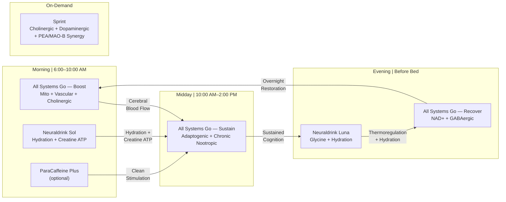

# NTRPX Systems™ Complete Formulations

<Card title="The NTRPX Meta System™" icon="layers" color="#0f172a">

A circadian-optimized nootropic architecture designed around human biology. Each system delivers targeted support at the optimal time of day, with premium branded ingredients at clinically validated doses.

<CardGroup cols={4}>
<Card title="6 Systems" icon="grid-2" color="#334155">Complete Protocol</Card>
<Card title="50+ Ingredients" icon="flask" color="#334155">Branded Forms</Card>
<Card title="18 Biological Targets" icon="dna" color="#334155">Mechanism Coverage</Card>
<Card title="Circadian Design" icon="clock" color="#334155">Time-Optimized</Card>
</CardGroup>

</Card>

---

# All Systems Go™ — Foundation System

**The complete daily capsule protocol. Engineered for standalone efficacy with full-spectrum coverage of mitochondrial, vascular, cholinergic, and adaptogenic pathways.**

---

## All Systems Go™ — Boost

<Card title="All Systems Go™ — Boost" icon="sun" color="#d97706">

### Morning Activation

<CardGroup cols={4}>
<Card title="Timing" icon="clock">6:00–10:00 AM</Card>
<Card title="With Food" icon="utensils">Light Breakfast</Card>
<Card title="Total Weight" icon="scale-balanced">2,615 mg</Card>
<Card title="Capsules" icon="capsules">6 (Size-0) | 4 (Size-00)</Card>
</CardGroup>

</Card>

### Boost — Complete Formulation

<Card title="Mitochondrial Rejuvenation Stack" icon="bolt" color="#d97706">

| Ingredient | Branded Form | Dose | Weight | Mechanism |
|------------|--------------|------|--------|-----------|
| Acetyl-L-Carnitine | Carnipure® ALC | 500 mg | 500 mg | Mitochondrial fuel transport; acetyl donor; BBB-penetrant |
| R-Alpha Lipoic Acid | Bio-Enhanced® Na-R-ALA | 300 mg | 300 mg | Universal antioxidant; PDH cofactor; ALCAR synergy |
| CoQ10 | Kaneka Ubiquinol | 100 mg | 100 mg | Electron transport chain; reduced form (8× absorption) |
| PQQ | BioPQQ® | 20 mg | 20 mg | Mitochondrial biogenesis signaling |

**Subtotal:** 920 mg

</Card>

<Card title="Vascular-Cognitive Matrix" icon="heart-pulse" color="#dc2626">

| Ingredient | Branded Form | Dose | Weight | Mechanism |
|------------|--------------|------|--------|-----------|
| Cocoa Flavanol Extract | Cocoapro™-equivalent | 500 mg | 500 mg | NO synthesis; BDNF; 80mg (–)-epicatechin |
| CDP-Choline | Cognizin® | 300 mg | 300 mg | Choline + uridine; phosphatidylcholine synthesis |
| N-Acetyl L-Tyrosine | NALT | 500 mg | 500 mg | Dopamine/norepinephrine precursor; stress resilience |
| Salidroside | ≥98% Precision Fermented | 15 mg | 15 mg | HPA axis modulation; anti-fatigue |

**Subtotal:** 1,315 mg

</Card>

<Card title="B-Complex — Active Forms" icon="dna" color="#0ea5e9">

| Vitamin | Form | Dose | Weight | Function |
|---------|------|------|--------|----------|
| B1 | Benfotiamine | 150 mg | 150 mg | Fat-soluble thiamine; AGE inhibition |
| B1 | TTFD (Sulbutiamine) | 50 mg | 50 mg | CNS-penetrant; crosses BBB |
| B2 | Riboflavin-5'-Phosphate | 15 mg | 15 mg | Active coenzyme; FAD precursor |
| B3 | Nicotinamide | 100 mg | 100 mg | NAD+ precursor; no flush |
| B5 | D-Calcium Pantothenate | 50 mg | 50 mg | Coenzyme A synthesis |
| B6 | Pyridoxal-5'-Phosphate | 15 mg | 15 mg | Active form only — pyridoxine excluded |
| B7 | D-Biotin | 300 mcg | \<1 mg | Carboxylase cofactor |
| B9 | L-5-MTHF (Quatrefolic®) | 400 mcg | \<1 mg | Active folate; bypasses MTHFR |
| B12 | Methylcobalamin | 500 mcg | \<1 mg | Cytoplasmic coenzyme |
| B12 | Adenosylcobalamin | 250 mcg | \<1 mg | Mitochondrial coenzyme |

**Subtotal:** 380 mg

</Card>

<Tip>
**Vascular-Mitochondrial Synergy:** Cocoa flavanols increase nitric oxide synthesis, enhancing cerebral blood flow and oxygen delivery to support the mitochondrial rejuvenation stack (ALCAR + R-ALA). The COSMOS trial (n=21,442; 3.6 years) demonstrated 27% reduction in cardiovascular mortality and 16% reduction in major cardiovascular events with 500mg cocoa flavanols containing 80mg (–)-epicatechin daily.
</Tip>

---

## All Systems Go™ — Sustain

<Card title="All Systems Go™ — Sustain" icon="battery-full" color="#059669">

### Daytime Performance

<CardGroup cols={4}>
<Card title="Timing" icon="clock">10:00 AM–2:00 PM</Card>
<Card title="With Food" icon="utensils">With Lunch</Card>
<Card title="Total Weight" icon="scale-balanced">2,373 mg</Card>
<Card title="Capsules" icon="capsules">5 (Size-0) | 4 (Size-00)</Card>
</CardGroup>

</Card>

### Sustain — Complete Formulation

<Card title="Cognitive Maintenance" icon="brain" color="#059669">

| Ingredient | Branded Form | Dose | Weight | Mechanism |
|------------|--------------|------|--------|-----------|
| Cocoa Flavanol Extract | Cocoapro™-equivalent | 250 mg | 250 mg | Continued vascular support; 40mg (–)-epicatechin |
| CDP-Choline | Cognizin® | 250 mg | 250 mg | Sustained cholinergic support |
| Phosphatidylserine | Sharp-PS® (sunflower) | 100 mg | 100 mg | Membrane integrity; cortisol modulation |
| L-Theanine | Suntheanine® | 100 mg | 100 mg | Alpha wave induction; calm focus |
| Lion's Mane | Dual Extract 30% β-glucans | 500 mg | 500 mg | NGF/BDNF support; chronic neuroplasticity |

**Subtotal:** 1,200 mg

</Card>

<Tip>
**Chronic Nootropic Clustering:** Lion's Mane is paired with Bacopa in Sustain because both are chronic-benefit nootropics that work over weeks to months via neuroplasticity mechanisms (NGF, BDNF, dendritic arborization). Neither requires acute morning timing — taking with lunch optimizes absorption and reduces morning pill burden.
</Tip>

<Card title="Adaptogenic Complex" icon="leaf" color="#059669">

| Ingredient | Branded Form | Dose | Weight | Mechanism |
|------------|--------------|------|--------|-----------|
| Bacopa monnieri | BaCognize® 45% bacosides | 300 mg | 300 mg | Memory consolidation; chronic nootropic |
| Ashwagandha | KSM-66® | 300 mg | 300 mg | Cortisol modulation; stress adaptation |
| Saffron | affron® 3.5% lepticrosalides | 28 mg | 28 mg | Serotonergic support; mood balance |

**Subtotal:** 628 mg

</Card>

<Card title="Essential Fatty Acids" icon="droplet" color="#059669">

| Ingredient | Branded Form | Dose | Weight | Mechanism |
|------------|--------------|------|--------|-----------|
| DHA | Life's DHA® (algal) | 250 mg | 250 mg | Neuronal membrane fluidity |
| EPA | Algal source | 125 mg | 125 mg | Anti-inflammatory; cardiovascular |

**Subtotal:** 375 mg

</Card>

<Card title="B-Complex — Continuation" icon="dna" color="#0ea5e9">

| Vitamin | Form | Dose | Weight |
|---------|------|------|--------|
| B1 | Benfotiamine | 100 mg | 100 mg |
| B2 | Riboflavin-5'-Phosphate | 10 mg | 10 mg |
| B5 | D-Calcium Pantothenate | 50 mg | 50 mg |
| B6 | Pyridoxal-5'-Phosphate | 10 mg | 10 mg |
| B12 | Adenosylcobalamin | 250 mcg | \<1 mg |

**Subtotal:** 170 mg

</Card>

<Note>
**Omega-3 Delivery:** DHA and EPA are provided in softgel format for optimal stability and absorption. These may be packaged separately or as part of the Sustain serving.
</Note>

---

## All Systems Go™ — Recover

<Card title="All Systems Go™ — Recover" icon="moon" color="#7c3aed">

### Evening Recovery

<CardGroup cols={4}>
<Card title="Timing" icon="clock">30–60 min before bed</Card>
<Card title="With Food" icon="utensils">Light or empty</Card>
<Card title="Total Weight" icon="scale-balanced">2,136 mg</Card>
<Card title="Capsules" icon="capsules">5 (Size-0) | 3 (Size-00)</Card>
</CardGroup>

</Card>

### Recover — Complete Formulation

<Card title="Sleep Architecture" icon="bed" color="#7c3aed">

| Ingredient | Branded Form | Dose | Weight | Mechanism |
|------------|--------------|------|--------|-----------|
| Magnesium L-Threonate | Magtein® | 1,000 mg | 1,000 mg | Brain-penetrant Mg (72 mg elem.); synaptic plasticity |
| L-Theanine | Suntheanine® | 200 mg | 200 mg | Alpha waves; GABAergic modulation |
| Taurine | Pharmaceutical grade | 500 mg | 500 mg | GABA-A receptor agonist |
| Apigenin | ≥98% extract | 50 mg | 50 mg | CD38 inhibition; anxiolytic |

**Subtotal:** 1,750 mg

</Card>

<Card title="Overnight Restoration" icon="sparkles" color="#7c3aed">

| Ingredient | Branded Form | Dose | Weight | Mechanism |
|------------|--------------|------|--------|-----------|
| Nicotinamide Riboside | Niagen® | 300 mg | 300 mg | NAD+ restoration during sleep |
| Melatonin | Pharmaceutical grade | 0.3 mg | \<1 mg | Physiological dose (MIT protocol) |
| Zinc | Picolinate | 75 mg | 75 mg | Sleep regulation; overnight repair (15 mg elem.) |

**Subtotal:** 375 mg

</Card>

<Card title="B-Complex — Evening" icon="dna" color="#0ea5e9">

| Vitamin | Form | Dose | Weight | Function |
|---------|------|------|--------|----------|
| B6 | Pyridoxal-5'-Phosphate | 10 mg | 10 mg | GABA synthesis cofactor |
| B9 | L-5-MTHF (Quatrefolic®) | 400 mcg | \<1 mg | Overnight methylation |
| B12 | Methylcobalamin | 250 mcg | \<1 mg | No sleep interference |

**Subtotal:** 11 mg

</Card>

<Tip>
**Cacao Exclusion Rationale:** Cocoa flavanols contain trace methylxanthines (theobromine, caffeine) that may interfere with sleep architecture. Recover is optimized exclusively for GABAergic and restorative pathways without vascular-stimulant components.
</Tip>

---

## All Systems Go™ — Daily Totals

<Card title="Foundation Stack — Combined Daily Intake" icon="calculator" color="#0f172a">

| Nutrient Category | Boost | Sustain | Recover | Daily Total |
|-------------------|-------|---------|---------|-------------|
| **ALCAR** | 500 mg | — | — | 500 mg |
| **R-Alpha Lipoic Acid** | 300 mg | — | — | 300 mg |
| **Cocoa Flavanols** | 500 mg | 250 mg | — | 750 mg |
| **(–)-Epicatechin** | 80 mg | 40 mg | — | 120 mg |
| **CDP-Choline** | 300 mg | 250 mg | — | 550 mg |
| **Magnesium** | — | — | 72 mg | 72 mg (elem.) |
| **B-Complex** | Complete | Continuation | Evening | Full Spectrum |
| **DHA + EPA** | — | 375 mg | — | 375 mg |
| **Total Weight** | 2,615 mg | 2,373 mg | 2,136 mg | **7,124 mg** |
| **Capsules (Size-0)** | 6 | 5 | 5 | **16 capsules** |
| **Capsules (Size-00)** | 4 | 4 | 3 | **11 capsules** |

</Card>

---

# Neuraldrink™ — Circadian Functional Beverages

**Precision-formulated hydration optimized for circadian biology. Delivers brain fuel, electrolytes, and bulky performance ingredients in bioavailable liquid form.**

---

## Neuraldrink™ Sol

<Card title="Neuraldrink™ Sol" icon="sun" color="#ea580c">

### Daytime Hydration + Performance

<CardGroup cols={4}>
<Card title="Timing" icon="clock">Morning–Early Afternoon</Card>
<Card title="Serving" icon="glass-water">16–20 oz water</Card>
<Card title="Flavor" icon="lemon">Citrus</Card>
<Card title="Powder Weight" icon="scale-balanced">36.5 g</Card>
</CardGroup>

</Card>

### Sol — Complete Formulation

<Card title="Brain Fuel" icon="bolt" color="#ea580c">

| Ingredient | Form | Dose | Weight | Function |
|------------|------|------|--------|----------|
| D-Glucose | Monohydrate | 15,000 mg | 15,000 mg | Immediate cerebral fuel |
| Fructose | Crystalline | 8,000 mg | 8,000 mg | Sustained release; hepatic glycogen |

**Glucose:Fructose Ratio:** 65:35 (optimized for cognitive performance)
**Total Carbohydrates:** 23 g

</Card>

<Card title="Performance Matrix" icon="chart-line" color="#ea580c">

| Ingredient | Branded Form | Dose | Weight | Function |
|------------|--------------|------|--------|----------|
| Creatine Monohydrate | Creapure® Micronized | 5,000 mg | 5,000 mg | Cognitive ATP buffer; full clinical dose |
| L-Citrulline | Free form | 3,000 mg | 3,000 mg | Nitric oxide synthesis; cerebral blood flow |
| Taurine | Pharmaceutical grade | 1,000 mg | 1,000 mg | Cellular osmoregulation; antioxidant |
| Cordyceps | CS-4 Water Extract | 1,000 mg | 1,000 mg | Oxygen utilization; mitochondrial efficiency |

**Subtotal:** 10,000 mg

</Card>

<Card title="Electrolyte Complex" icon="droplet" color="#0ea5e9">

| Electrolyte | Source | Dose | Elemental |
|-------------|--------|------|-----------|
| Sodium | Citrate + Chloride (USP) | 2,500 mg | 1,000 mg |
| Potassium | Citrate (USP) | 1,400 mg | 500 mg |
| Magnesium | Citrate | 500 mg | 75 mg |
| Calcium | Citrate | 500 mg | 100 mg |

**Total Electrolyte Salts:** 4,900 mg

</Card>

<Card title="Micronutrients" icon="sparkles" color="#0ea5e9">

| Nutrient | Form | Dose |
|----------|------|------|
| Vitamin C | Ascorbic Acid | 100 mg |
| Chromium | Picolinate | 1 mg (100 mcg elem.) |

**Subtotal:** 101 mg

</Card>

<Note>
**Cacao Exclusion Rationale:** Cocoa extracts have bitter/astringent taste profiles that compromise beverage palatability. Additionally, L-Citrulline already provides robust nitric oxide pathway support (3,000 mg = 6g arginine equivalent), making flavanol addition redundant in this delivery format. Cocoa flavanols are optimally delivered via the All Systems Go capsule protocol where precise standardization is assured.
</Note>

---

## Neuraldrink™ Luna

<Card title="Neuraldrink™ Luna" icon="moon" color="#6366f1">

### Evening Hydration + Sleep Preparation

<CardGroup cols={4}>
<Card title="Timing" icon="clock">1–2 hours before bed</Card>
<Card title="Serving" icon="glass-water">12–16 oz water</Card>
<Card title="Flavor" icon="leaf">Berry-Chamomile</Card>
<Card title="Powder Weight" icon="scale-balanced">19.3 g</Card>
</CardGroup>

</Card>

### Luna — Complete Formulation

<Card title="Sleep Support Matrix" icon="bed" color="#6366f1">

| Ingredient | Branded Form | Dose | Weight | Function |
|------------|--------------|------|--------|----------|
| Glycine | Pharmaceutical grade | 3,000 mg | 3,000 mg | Thermoregulation (core temp ↓0.3°C) |
| Taurine | Pharmaceutical grade | 1,000 mg | 1,000 mg | GABA-A receptor agonist |
| Magnesium Glycinate | Chelated | 1,400 mg | 1,400 mg | GABA potentiation; relaxation (200 mg elem.) |

**Subtotal:** 5,400 mg

</Card>

<Card title="Evening Brain Fuel" icon="bolt" color="#6366f1">

| Ingredient | Form | Dose | Weight | Function |
|------------|------|------|--------|----------|
| D-Glucose | Monohydrate | 8,000 mg | 8,000 mg | Baseline cerebral support |
| Fructose | Crystalline | 4,000 mg | 4,000 mg | Gentle sustained release |

**Glucose:Fructose Ratio:** 67:33
**Total Carbohydrates:** 12 g (reduced for evening)

</Card>

<Card title="Electrolyte Complex — Reduced" icon="droplet" color="#0ea5e9">

| Electrolyte | Source | Dose | Elemental |
|-------------|--------|------|-----------|
| Sodium | Citrate + Chloride (USP) | 500 mg | 300 mg |
| Potassium | Citrate (USP) | 900 mg | 300 mg |

**Total Electrolyte Salts:** 1,400 mg (reduced to prevent nocturnal thirst)

</Card>

<Note>
**Absolute Cacao Exclusion:** All cacao-derived ingredients (flavanols, theobromine, PEA) have stimulant properties or extended half-lives incompatible with sleep preparation. Luna is formulated exclusively with GABAergic, glycinergic, and thermoregulatory compounds.
</Note>

---

## Neuraldrink™ + Recover Synergy

<Card title="Maximum Sleep Protocol" icon="layers" color="#1e1b4b">

**Neuraldrink™ Luna + All Systems Go™ — Recover**

| Nutrient | Luna | Recover | Combined |
|----------|------|---------|----------|
| Glycine | 3,000 mg | — | 3,000 mg |
| Taurine | 1,000 mg | 500 mg | 1,500 mg |
| Magnesium | 200 mg | 72 mg | 272 mg (elem.) |
| L-Theanine | — | 200 mg | 200 mg |
| Apigenin | — | 50 mg | 50 mg |
| NR (Niagen®) | — | 300 mg | 300 mg |
| Melatonin | — | 0.3 mg | 0.3 mg |

*For maximum sleep architecture optimization, jet lag recovery, or sleep debt repayment.*

</Card>

---

# ParaCaffeine Plus™ — Clean Stimulation

<Card title="ParaCaffeine Plus™" icon="bolt" color="#dc2626">

### Evolved Stimulation

<CardGroup cols={4}>
<Card title="Timing" icon="clock">Morning–Early Afternoon</Card>
<Card title="Cutoff" icon="ban">2:00 PM (strict)</Card>
<Card title="Total Weight" icon="scale-balanced">661 mg</Card>
<Card title="Capsules" icon="capsules">2 (Size-0) | 1 (Size-00)</Card>
</CardGroup>

</Card>

### ParaCaffeine Plus — Complete Formulation

<Card title="Stimulation Matrix" icon="list-check" color="#dc2626">

| Ingredient | Branded Form | Dose | Weight | Mechanism |
|------------|--------------|------|--------|-----------|
| Paraxanthine | enfinity® | 100 mg | 100 mg | A2A adenosine antagonist (2.2× affinity vs caffeine) |
| L-Theanine | Suntheanine® | 200 mg | 200 mg | Alpha wave induction; smooths stimulation curve |
| CDP-Choline | Cognizin® | 100 mg | 100 mg | Sustains acetylcholine under stimulation |
| N-Acetyl L-Tyrosine | NALT | 200 mg | 200 mg | Catecholamine precursor replenishment |
| Theobromine | 99% Pharmaceutical grade | 50 mg | 50 mg | Extended half-life (7h); peripheral vasodilation |
| B6 | Pyridoxal-5'-Phosphate | 10 mg | 10 mg | Neurotransmitter synthesis cofactor |
| B12 | Methylcobalamin | 1 mg | 1 mg | Energy metabolism support |

**Total Weight:** 661 mg

</Card>

### Methylxanthine Pharmacology

<Card title="Stimulant Comparison" icon="chart-column" color="#1e1b4b">

| Property | Caffeine | Paraxanthine | Theobromine |
|----------|----------|--------------|-------------|
| A2A Receptor Affinity | 1.0× | **2.2×** | 0.2× |
| Half-Life | 5–6 hours | **3–4 hours** | **7–8 hours** |
| Anxiogenic Metabolites | Theophylline | **None** | **None** |
| BBB Penetration | High | High | Low |
| Blood Pressure Effect | ↑ Increases | Neutral | **↓ Decreases** |
| Primary Action Site | Central | Central | Peripheral |

*Paraxanthine provides central stimulation while theobromine extends the curve via peripheral mechanisms and counteracts vasoconstriction.*

</Card>

<Tip>
**Theobromine Synergy:** At 50mg, theobromine provides a 7-hour half-life extension of adenosine antagonism without negative mood effects (which emerge at doses exceeding 250mg). Its vasodilatory properties counteract any mild hypertensive effect from paraxanthine, creating a balanced hemodynamic profile. Research confirms theobromine's optimal dose window is 50–150mg for sustained, jitter-free energy.
</Tip>

<Note>
**PEA Exclusion Rationale:** Phenylethylamine was evaluated but excluded from ParaCaffeine Plus due to the absence of MAO-B inhibition in this formula. Without MAO-B blockade, PEA has a half-life of only 5–10 minutes, providing negligible sustained benefit. PEA is optimally deployed in Sprint where salidroside provides the necessary MAO-B inhibition to extend its effects.
</Note>

---

# Sprint™ — Acute Peak Performance

<Card title="Sprint™" icon="rocket" color="#f97316">

### Reserved for Peak Cognitive Demand

<CardGroup cols={4}>
<Card title="Timing" icon="clock">60–90 min before demand</Card>
<Card title="Frequency" icon="calendar">1–2× per week maximum</Card>
<Card title="Total Weight" icon="scale-balanced">2,256 mg</Card>
<Card title="Capsules" icon="capsules">5 (Size-0) | 3 (Size-00)</Card>
</CardGroup>

</Card>

<Warning>
**Acute Protocol Only.** Sprint™ is engineered for peak cognitive events: presentations, examinations, competitions, critical negotiations. Chronic-benefit ingredients have been excluded. Do not exceed recommended frequency.
</Warning>

### Sprint — Complete Formulation

<Card title="Cholinergic Cascade" icon="brain" color="#f97316">

| Ingredient | Branded Form | Dose | Weight | Acute Mechanism |
|------------|--------------|------|--------|-----------------|
| Alpha-GPC | 50% | 600 mg | 600 mg | Rapid high-bioavailability choline bolus |
| Huperzine A | ≥98% Synthetic | 100 mcg | \<1 mg | Acetylcholinesterase inhibition |
| CDP-Choline | Cognizin® | 250 mg | 250 mg | Sustained choline; uridine provision |

**Subtotal:** 850 mg

</Card>

<Card title="Dopaminergic Drive" icon="arrow-up" color="#f97316">

| Ingredient | Branded Form | Dose | Weight | Acute Mechanism |
|------------|--------------|------|--------|-----------------|
| Phenylethylamine | PEA HCl Pharmaceutical grade | 150 mg | 150 mg | Acute DA/NE release; TAAR1 agonist |
| Mucuna pruriens | 15% L-DOPA standardized | 500 mg | 500 mg | Direct dopamine precursor (75 mg L-DOPA) |
| Salidroside | ≥98% Precision Fermented | 30 mg | 30 mg | MAO-B inhibition; extends PEA + DA signaling |

**Subtotal:** 680 mg

</Card>

<Card title="Acute Energy + Modulation" icon="bolt" color="#f97316">

| Ingredient | Branded Form | Dose | Weight | Acute Mechanism |
|------------|--------------|------|--------|-----------------|
| Caffeine | Anhydrous | 100 mg | 100 mg | Broad adenosine receptor antagonism |
| Theobromine | 99% Pharmaceutical grade | 50 mg | 50 mg | Extended stimulation curve (7h half-life) |
| Acetyl-L-Carnitine | Carnipure® ALC | 250 mg | 250 mg | Acute brain energy; acetyl donor |
| TTFD | Sulbutiamine derivative | 50 mg | 50 mg | CNS-penetrant thiamine |
| L-Theanine | Suntheanine® | 200 mg | 200 mg | Prevents overstimulation; smooth focus |

**Subtotal:** 650 mg

</Card>

<Card title="Cofactors" icon="dna" color="#0ea5e9">

| Vitamin | Form | Dose | Weight | Function |
|---------|------|------|--------|----------|
| B6 | Pyridoxal-5'-Phosphate | 25 mg | 25 mg | Critical DOPA decarboxylase cofactor |
| B12 | Methylcobalamin | 1 mg | 1 mg | Elevated for acute demand |

**Subtotal:** 26 mg

</Card>

<Card title="PEA + Salidroside Synergy" icon="link" color="#7c3aed">

**The MAO-B Potentiation Mechanism**

Phenylethylamine (PEA) is a trace amine that triggers rapid release of dopamine and norepinephrine via TAAR1 receptor activation. However, PEA is normally degraded within 5–10 minutes by monoamine oxidase-B (MAO-B), limiting its utility as a standalone supplement.

Sprint™ contains salidroside at 30mg — a selective MAO-B inhibitor at this dose. By blocking MAO-B, salidroside extends PEA's half-life from minutes to approximately 2 hours, creating a sustained dopaminergic/noradrenergic enhancement that synergizes with Mucuna's L-DOPA provision.

| Without MAO-B Inhibition | With Salidroside |
|--------------------------|------------------|
| PEA half-life: 5–10 min | PEA half-life: ~2 hours |
| Fleeting effect | Sustained enhancement |
| DA/NE spike + crash | Smooth DA/NE elevation |

This synergy is the pharmacological rationale for PEA's placement exclusively in Sprint™, where the infrastructure for MAO-B inhibition already exists.

</Card>

---

# System Architecture

## Circadian Mechanism Map

## Cacao Ingredient Placement Matrix

<Card title="Cacao-Derived Component Distribution" icon="table-cells" color="#7c3aed">

| Ingredient | Boost | Sustain | Recover | Sol | Luna | ParaCaffeine | Sprint |
|------------|-------|---------|---------|-----|------|--------------|--------|
| **Cocoa Flavanols** | 500 mg | 250 mg | — | — | — | — | — |
| **(–)-Epicatechin** | 80 mg | 40 mg | — | — | — | — | — |
| **Theobromine** | — | — | — | — | — | 50 mg | 50 mg |
| **PEA** | — | — | — | — | — | — | 150 mg |

**Placement Rationale:**

| Ingredient | Optimal System | Rationale |
|------------|----------------|-----------|
| Cocoa Flavanols | Boost + Sustain | Vascular/cognitive support requires capsule standardization; daytime-only due to trace methylxanthines |
| Theobromine | ParaCaffeine + Sprint | Extends adenosine antagonism curve; 7h half-life synergizes with shorter-acting stimulants |
| PEA | Sprint only | Requires MAO-B inhibition (salidroside) to extend half-life; too fleeting otherwise |

</Card>

## Full Ingredient Placement Matrix

<Card title="Cross-System Distribution" icon="table-cells" color="#0f172a">

| Ingredient | Boost | Sustain | Recover | Sol | Luna | ParaCaffeine | Sprint |
|------------|-------|---------|---------|-----|------|--------------|--------|
| **ALCAR** | 500 mg | — | — | — | — | — | 250 mg |
| **R-ALA** | 300 mg | — | — | — | — | — | — |
| **Cocoa Flavanols** | 500 mg | 250 mg | — | — | — | — | — |
| **Lion's Mane** | — | 500 mg | — | — | — | — | — |
| **CDP-Choline** | 300 mg | 250 mg | — | — | — | 100 mg | 250 mg |
| **Creatine** | — | — | — | 5,000 mg | — | — | — |
| **Glycine** | — | — | — | — | 3,000 mg | — | — |
| **L-Citrulline** | — | — | — | 3,000 mg | — | — | — |
| **Theobromine** | — | — | — | — | — | 50 mg | 50 mg |
| **PEA** | — | — | — | — | — | — | 150 mg |
| **Magnesium** | — | — | 72 mg | 75 mg | 200 mg | — | — |
| **L-Theanine** | — | 100 mg | 200 mg | — | — | 200 mg | 200 mg |
| **Taurine** | — | — | 500 mg | 1,000 mg | 1,000 mg | — | — |
| **B-Complex** | Full | Cont. | Evening | — | — | B6/B12 | B6/B12 |

</Card>

---

# Cocoa Flavanol Evidence Summary

<Card title="COSMOS Trial Results (n=21,442)" icon="chart-line" color="#059669">

### Cardiovascular Outcomes (3.6 Year Follow-up)

| Outcome | Hazard Ratio | 95% CI | Significance |
|---------|--------------|--------|--------------|
| Cardiovascular Death | **0.73** | 0.54–0.98 | p < 0.05 |
| Major CVD Events | **0.84** | 0.72–0.98 | p < 0.05 |
| Total CVD Events | 0.90 | 0.78–1.02 | p = 0.11 |
| All-Cause Mortality | 0.89 | 0.77–1.03 | Trend |

### Per-Protocol Analysis (Compliant Participants)

| Outcome | Hazard Ratio | Significance |
|---------|--------------|--------------|
| Total CVD Events | **0.85** | p < 0.05 |
| Cardiovascular Death | **0.61** | p < 0.01 |
| Major CVD Events | **0.76** | p < 0.01 |

**Protocol:** 500 mg cocoa flavanols/day containing 80 mg (–)-epicatechin, ~50 mg theobromine, ~15 mg caffeine

</Card>

<Card title="Mechanism of Action" icon="dna" color="#0ea5e9">

| Pathway | Mechanism | Outcome |
|---------|-----------|---------|
| **Nitric Oxide** | (–)-Epicatechin activates eNOS | Increased NO bioavailability |
| **Cerebral Blood Flow** | Vasodilation of cerebral vessels | Enhanced O2/nutrient delivery |
| **BDNF Modulation** | Flavanol-induced upregulation | Neuroplasticity support |
| **Inflammation** | Reduced hsCRP, IL-6 | Anti-inflammatory protection |
| **Endothelial Function** | Improved FMD within 2 hours | Vascular health |

</Card>

<Card title="NTRPX Integration Summary" icon="puzzle-piece" color="#d97706">

| System | Cocoa Flavanols | (–)-Epicatechin | Timing Rationale |
|--------|-----------------|-----------------|------------------|
| **Boost** | 500 mg | 80 mg | Morning vascular activation; COSMOS-equivalent dose |
| **Sustain** | 250 mg | 40 mg | Continued vascular support; afternoon cognitive maintenance |
| **Recover** | — | — | Excluded: trace methylxanthines may disrupt sleep |

**Daily Total:** 750 mg cocoa flavanols with 120 mg (–)-epicatechin — exceeding the COSMOS cardioprotective threshold while optimizing for cognitive performance.

</Card>

---

# Ingredient Purity Standards

<Card title="Premium Specification Requirements" icon="certificate" color="#059669">

| Ingredient | Required Specification | Excluded Forms | Rationale |
|------------|------------------------|----------------|-----------|
| Acetyl-L-Carnitine | Carnipure® ALC ≥99% L-isomer | Generic ALCAR; D,L-carnitine | Only L-isomer is bioactive |
| R-Alpha Lipoic Acid | Bio-Enhanced® Na-R-ALA | Racemic ALA; unstabilized R-ALA | Polymerization reduces bioavailability to \<10% |
| Cocoa Flavanol Extract | Cocoapro™-equivalent ≥16% epicatechin | Generic cocoa powder | Standardization ensures consistent (–)-epicatechin delivery |
| Theobromine | ≥99% Pharmaceutical grade | Cocoa powder extracts | Precise dosing critical (negative effects >250mg) |
| PEA | Pharmaceutical grade HCl | Food-grade PEA | Purity essential for acute neurotransmitter effects |
| Creatine | Creapure® Micronized | Generic monohydrate | Purity certification; optimal dissolution |
| CDP-Choline | Cognizin® | Generic citicoline | Clinical validation; purity guarantee |
| Salidroside | ≥98% Precision Fermented | Rhodiola extract (3% salidroside) | 30× higher potency; batch consistency |
| Huperzine A | ≥98% Synthetic Pure | Huperzia serrata extract (1%) | Exact potency; sustainable sourcing |
| CoQ10 | Kaneka Ubiquinol | Ubiquinone; generic ubiquinol | Reduced form; 8× superior absorption |
| Magnesium (Brain) | Magtein® L-Threonate | Oxide; citrate; glycinate | Only form proven to elevate brain Mg |
| B6 | Pyridoxal-5'-Phosphate only | Pyridoxine HCl | Pyridoxine associated with peripheral neuropathy |
| B9 | L-5-MTHF (Quatrefolic®) | Folic acid | Active form; bypasses MTHFR polymorphisms |
| B12 | Methylcobalamin + Adenosylcobalamin | Cyanocobalamin | Active coenzyme forms; no cyanide moiety |
| L-Theanine | Suntheanine® | Generic L-theanine | Patented enzymatic process; isomeric purity |

</Card>

---

# System Summary

<Card title="NTRPX Meta System™" icon="trophy" color="#0f172a">

<CardGroup cols={3}>
<Card title="All Systems Go™" icon="capsules" color="#334155">
**Foundation Protocol**

| System | Weight | Size-0 | Size-00 |
|--------|--------|--------|---------|
| Boost | 2,615 mg | 6 | 4 |
| Sustain | 2,373 mg | 5 | 4 |
| Recover | 2,136 mg | 5 | 3 |
| **Daily** | **7,124 mg** | **16** | **11** |

</Card>

<Card title="Neuraldrink™" icon="glass-water" color="#334155">
**Circadian Beverages**

| System | Powder Weight |
|--------|---------------|
| Sol | 36.5 g |
| Luna | 19.3 g |

*Mix with water as directed*
</Card>

<Card title="Performance" icon="bolt" color="#334155">
**Targeted Support**

| System | Weight | Size-0 | Size-00 |
|--------|--------|--------|---------|
| ParaCaffeine Plus | 661 mg | 2 | 1 |
| Sprint | 2,256 mg | 5 | 3 |

*Observe timing protocols*
</Card>
</CardGroup>

</Card>

---

<Card title="Design Philosophy" icon="compass" color="#1e1b4b">

The NTRPX Meta System™ is architected around four core principles:

**Circadian Optimization** — Each system is timed to biological rhythms. Morning formulas activate mitochondrial, vascular, and dopaminergic pathways. Midday formulas sustain with adaptogens and continued vascular support. Evening formulas support GABAergic inhibition and thermoregulation. Cacao-derived ingredients are deployed exclusively during daytime hours due to their stimulant properties.

**Vascular-Cognitive Integration** — Cocoa flavanols (750mg daily, 120mg epicatechin) enhance nitric oxide synthesis, improving cerebral blood flow and oxygen delivery. This vascular foundation — validated by the COSMOS trial's 27% reduction in cardiovascular mortality — amplifies the efficacy of every downstream cognitive intervention.

**Mechanism Synergy** — Ingredients are selected for complementary mechanisms. ALCAR provides mitochondrial fuel while R-ALA protects the enzymes that process it. Creatine buffers ATP while citrulline enhances delivery. Theobromine extends paraxanthine's stimulation curve while counteracting vasoconstriction. PEA triggers acute dopamine release while salidroside's MAO-B inhibition extends its half-life from minutes to hours.

**Form Specificity** — Every ingredient is specified in its optimal form. Active B-vitamins bypass genetic polymorphisms. Stabilized R-ALA prevents polymerization. Brain-penetrant magnesium (Magtein®) is reserved for cognitive applications. Cocoa flavanols are standardized to (–)-epicatechin content. Theobromine is pharmaceutical-grade 99% pure. No compromises.

</Card>

---

# Document Control

| Field | Value |
|-------|-------|
| **Document** | NTRPX Systems™ Complete Formulations |
| **Version** | 5.1 |
| **Status** | Production |
| **Last Updated** | 2026-01-27 | 10:15 UTC |
| **Author** | NTRPX Research and Development |
| **Review Cycle** | Quarterly |

| Version | Date | Time (UTC) | Summary |
|---------|------|------------|---------|
| 5.1 | 2026-01-27 | 10:15 | Relocated Lion's Mane (500mg) from Boost to Sustain for chronic nootropic clustering with Bacopa; rebalanced Boost/Sustain weights (2,615/2,373mg) |
| 5.0 | 2026-01-27 | 09:42 | Integrated cacao-derived ingredients: cocoa flavanols (750mg daily) in Boost/Sustain, theobromine (50mg) in ParaCaffeine Plus/Sprint, PEA (150mg) in Sprint with salidroside MAO-B synergy; comprehensive placement rationale; COSMOS evidence integration |
| 4.0 | 2026-01-26 | 18:45 | Integrated mitochondrial rejuvenation stack (ALCAR + R-ALA); optimized circadian ingredient placement |
| 3.0 | 2026-01-25 | — | Removed paraxanthine from Sol; pharmaceutical-grade sodium sources; physiological melatonin dosing |
| 2.0 | 2026-01-20 | — | Initial system architecture |