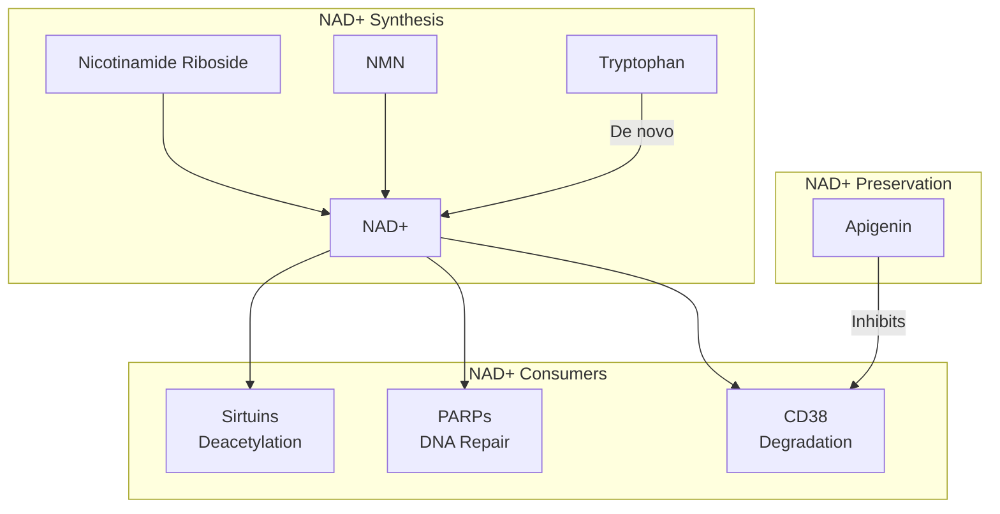
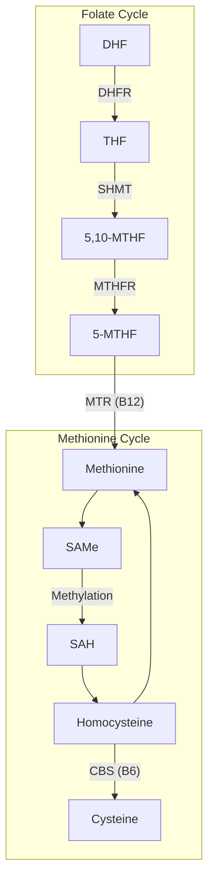
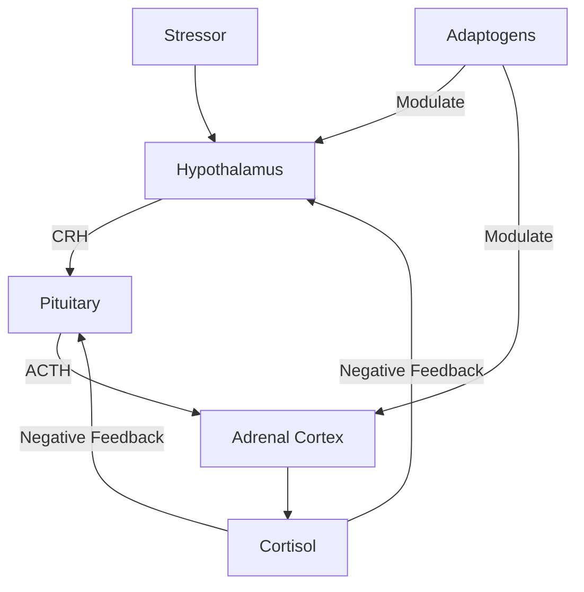

# Biological Domain Classification System

## Critical Analysis of v1.0 (12 Domains)

<AccordionGroup>

<Accordion title="Issues with Current Classification" icon="triangle-exclamation">

### Structural Problems

| Issue | Description | Examples |
|:------|:------------|:---------|
| **Inconsistent granularity** | Mixing very specific systems with very broad categories | Cholinergic (specific neurotransmitter) vs. Neuroprotection (broad outcome) |
| **Missing major neurotransmitter** | Glutamate is the brain's PRIMARY excitatory neurotransmitter | Glycine is an NMDA co-agonist; Mg is NMDA modulator — where do they map? |
| **Noradrenergic omission** | Norepinephrine is distinct from dopamine with different functions | Tyrosine → L-DOPA → Dopamine → **Norepinephrine** — this pathway is incomplete |
| **Redundant energy domains** | Mitochondrial, ATP Systems, NAD+ Metabolism overlap significantly | All are "cellular energy" — unclear boundaries |
| **Missing vascular domain** | No place for L-Citrulline, NO, blood flow | A core Neuraldrink™ mechanism has no domain |
| **Missing immune/inflammatory** | Omega-3s, adaptogens affect inflammation | No domain for this major pathway |
| **Outcome vs. mechanism confusion** | "Neuroprotection" is an outcome, not a biological system | BDNF, NGF, antioxidants are mechanisms; "protection" is the result |

### Missing Domains (Critical)

| Omitted Domain | Why It Matters | NTRPX Ingredients That Target It |
|:---------------|:---------------|:--------------------------------|
| **Glutamatergic/NMDA** | Primary excitatory neurotransmitter; glycine's sleep mechanism works via NMDA | Glycine, Magnesium, Theanine |
| **Noradrenergic** | Alertness, attention, stress response; distinct from dopamine | Tyrosine, Caffeine, Paraxanthine |
| **Vascular/Nitric Oxide** | Blood flow to brain and body; endothelial function | L-Citrulline, DHA/EPA |
| **Immune/Inflammatory** | Cytokine modulation, inflammation control | Omega-3s, Ashwagandha, Cordyceps |
| **Glucose Metabolism** | Brain's primary fuel; insulin sensitivity | Chromium, B-vitamins, Glucose itself |

### Boundary Ambiguities

| Ingredient | Current Assignment Problem |
|:-----------|:---------------------------|
| **Glycine** | Assigned to "Circadian" but mechanism is NMDA → hypothalamic thermoregulation |
| **L-Theanine** | Assigned to "GABAergic" but also modulates glutamate |
| **Magnesium** | Affects GABA, NMDA, ATP, HPA — where does it primarily belong? |
| **Omega-3s** | Assigned to "Structural" but also anti-inflammatory and neuroprotective |
| **Creatine** | Is it "ATP Systems" or "Mitochondrial"? |

</Accordion>

</AccordionGroup>

---

## Proposed Domain Classification v2.0

### Design Principles

1. **Mechanistic, not outcome-based** — Domains describe biological pathways, not desired results
2. **Consistent granularity** — All domains at similar level of specificity
3. **Mutually exclusive, collectively exhaustive (MECE)** — Minimal overlap, complete coverage
4. **Supplement-relevant** — Domains map to ingredients we can actually modulate
5. **Hierarchically organized** — Related domains grouped into super-categories

---

## The 16-Domain Classification System

```mermaid
flowchart TB
    subgraph NEURO["🧠 I. NEUROTRANSMISSION"]
        N1["1. Cholinergic<br/>Acetylcholine"]
        N2["2. Catecholaminergic<br/>Dopamine + Norepinephrine"]
        N3["3. Serotonergic<br/>Serotonin"]
        N4["4. GABAergic<br/>Inhibitory Tone"]
        N5["5. Glutamatergic<br/>Excitatory + NMDA"]
    end
    
    subgraph ENERGY["⚡ II. ENERGY METABOLISM"]
        E1["6. Mitochondrial<br/>Biogenesis + OxPhos"]
        E2["7. Bioenergetics<br/>ATP + Phosphocreatine"]
        E3["8. NAD+ Metabolism<br/>Sirtuins + Redox"]
        E4["9. Glucose Metabolism<br/>Glycolysis + Uptake"]
    end
    
    subgraph CELLULAR["🔬 III. CELLULAR PROCESSES"]
        C1["10. Methylation<br/>One-Carbon + Epigenetic"]
        C2["11. Membrane Integrity<br/>Phospholipids + Fluidity"]
        C3["12. Cellular Homeostasis<br/>Autophagy + Repair"]
    end
    
    subgraph REGULATORY["🔄 IV. REGULATORY SYSTEMS"]
        R1["13. HPA Axis<br/>Stress Response"]
        R2["14. Circadian<br/>Sleep-Wake Architecture"]
    end
    
    subgraph VASCULAR["❤️ V. CARDIOVASCULAR"]
        V1["15. Vascular Function<br/>NO + Blood Flow"]
        V2["16. Inflammatory Balance<br/>Immune + Cytokines"]
    end
```

---

## Domain Definitions & Key Markers

<AccordionGroup>

<Accordion title="I. NEUROTRANSMISSION (Domains 1-5)" icon="brain">

### Domain 1: Cholinergic System
**Definition:** Acetylcholine synthesis, release, receptor activation, and degradation pathways.

| Aspect | Details |
|:-------|:--------|
| **Primary neurotransmitter** | Acetylcholine (ACh) |
| **Key enzymes** | Choline acetyltransferase (ChAT), Acetylcholinesterase (AChE) |
| **Receptors** | Nicotinic (nAChR), Muscarinic (mAChR) |
| **Functions** | Memory encoding, sustained attention, learning, neuromuscular junction |
| **NTRPX ingredients** | CDP-Choline, Alpha-GPC, Huperzine A, Phosphatidylserine |
| **Biomarkers** | RBC AChE activity, choline levels |

---

### Domain 2: Catecholaminergic System
**Definition:** Dopamine AND norepinephrine/epinephrine synthesis, release, reuptake, and degradation. Combined because they share a biosynthetic pathway.

```mermaid
flowchart LR
    TYR[Tyrosine] --> |"Tyrosine Hydroxylase<br/>(rate-limiting)"| LDOPA[L-DOPA]
    LDOPA --> |"DOPA Decarboxylase<br/>(needs P5P)"| DA[Dopamine]
    DA --> |"Dopamine β-Hydroxylase"| NE[Norepinephrine]
    NE --> |"PNMT"| EPI[Epinephrine]
```

| Aspect | Dopaminergic | Noradrenergic |
|:-------|:-------------|:--------------|
| **Functions** | Motivation, reward, executive function | Alertness, attention, stress response |
| **Receptors** | D1-D5 | α1, α2, β1, β2, β3 |
| **Degradation** | MAO-A/B, COMT | MAO-A, COMT |
| **NTRPX ingredients** | Tyrosine, Mucuna (L-DOPA), Salidroside (MAO-B) | Tyrosine, Caffeine, Paraxanthine |

**Why combined:** Tyrosine supplementation feeds BOTH pathways. MAO inhibition affects both. They cannot be cleanly separated at the intervention level.

---

### Domain 3: Serotonergic System
**Definition:** Serotonin (5-HT) synthesis, release, reuptake, and receptor modulation.

| Aspect | Details |
|:-------|:--------|
| **Primary neurotransmitter** | Serotonin (5-hydroxytryptamine, 5-HT) |
| **Biosynthesis** | Tryptophan → 5-HTP → Serotonin |
| **Receptors** | 5-HT1A through 5-HT7 (14+ subtypes) |
| **Functions** | Mood regulation, emotional well-being, gut motility, sleep onset |
| **NTRPX ingredients** | Saffron (reuptake), Bacopa (5-HT modulation) |
| **Note** | 95% of serotonin is in gut; CNS serotonin is synthesized locally |

---

### Domain 4: GABAergic System
**Definition:** Gamma-aminobutyric acid synthesis, receptor modulation, and inhibitory tone.

| Aspect | Details |
|:-------|:--------|
| **Primary neurotransmitter** | GABA (gamma-aminobutyric acid) |
| **Biosynthesis** | Glutamate → GABA (via GAD; requires P5P) |
| **Receptors** | GABA-A (ionotropic, fast), GABA-B (metabotropic, slow) |
| **Binding sites** | GABA site, Benzodiazepine site, Barbiturate site, Neurosteroid site |
| **Functions** | Inhibitory tone, anxiety reduction, sleep, muscle relaxation |
| **NTRPX ingredients** | L-Theanine, Taurine, Apigenin, Magnesium, Ashwagandha |

---

### Domain 5: Glutamatergic System *(NEW)*
**Definition:** Glutamate signaling, NMDA/AMPA receptor modulation, and excitatory-inhibitory balance.

| Aspect | Details |
|:-------|:--------|
| **Primary neurotransmitter** | Glutamate (THE primary excitatory NT) |
| **Key receptors** | NMDA, AMPA, Kainate (ionotropic); mGluR (metabotropic) |
| **NMDA requirements** | Glutamate + Glycine (co-agonist) + Depolarization + Mg²⁺ unblock |
| **Functions** | Learning, memory consolidation, synaptic plasticity, LTP |
| **NTRPX ingredients** | Glycine (NMDA co-agonist), Magnesium (voltage-dependent block), L-Theanine (glutamate modulation) |

**Critical insight:** Glycine's sleep-onset mechanism works via NMDA receptors in the hypothalamus, triggering thermoregulatory changes. This is a GLUTAMATERGIC mechanism, not purely "circadian."

</Accordion>

<Accordion title="II. ENERGY METABOLISM (Domains 6-9)" icon="bolt">

### Domain 6: Mitochondrial System
**Definition:** Mitochondrial biogenesis, dynamics (fusion/fission), and oxidative phosphorylation efficiency.

| Aspect | Details |
|:-------|:--------|
| **Biogenesis pathway** | PGC-1α → NRF1/2 → TFAM → mtDNA transcription |
| **Key activators** | AMPK, SIRT1, CREB |
| **Electron transport chain** | Complex I-IV + ATP synthase |
| **NTRPX ingredients** | PQQ (biogenesis), CoQ10 (ETC), Cordyceps (O₂ utilization) |
| **Biomarkers** | Mitochondrial DNA copy number, citrate synthase activity |

---

### Domain 7: Bioenergetics (ATP/Phosphocreatine)
**Definition:** Immediate and short-term energy buffering systems; ATP regeneration.

| System | Timeframe | NTRPX Ingredients |
|:-------|:----------|:------------------|
| **Phosphocreatine (PCr)** | 0-10 seconds | Creatine |
| **Glycolytic** | 10 sec - 2 min | Glucose, B-vitamins (cofactors) |
| **Oxidative** | >2 min | Mitochondrial support |

**Key enzyme:** Creatine kinase (PCr + ADP ⇌ Cr + ATP)

---

### Domain 8: NAD+ Metabolism
**Definition:** Nicotinamide adenine dinucleotide synthesis, consumption, and salvage pathways.

| NTRPX Ingredients | Mechanism |
|:------------------|:----------|
| **NR (Niagen®)** | NAD+ precursor (salvage pathway) |
| **Apigenin** | CD38 inhibitor (preserves NAD+) |
| **Niacinamide** | Direct NAD+ precursor |

---

### Domain 9: Glucose Metabolism *(NEW)*
**Definition:** Glucose uptake, glycolysis, gluconeogenesis, and insulin signaling.

| Aspect | Details |
|:-------|:--------|
| **Brain requirement** | ~120g glucose/day; 20-25% of body's total |
| **Key transporters** | GLUT1 (BBB), GLUT3 (neurons), GLUT4 (insulin-responsive) |
| **Glycolysis cofactors** | Thiamine (B1), Riboflavin (B2), Niacin (B3), Pantothenic acid (B5), Magnesium |
| **Insulin sensitivity** | Chromium, Magnesium |
| **NTRPX ingredients** | D-Glucose, Chromium, B-vitamins, Magnesium |

**Critical for Neuraldrink™:** The brain REQUIRES glucose. This domain captures the carbohydrate fuel system.

</Accordion>

<Accordion title="III. CELLULAR PROCESSES (Domains 10-12)" icon="microscope">

### Domain 10: Methylation / Epigenetic
**Definition:** One-carbon metabolism, methylation reactions, and epigenetic regulation.

| Aspect | Details |
|:-------|:--------|
| **Universal methyl donor** | S-adenosylmethionine (SAMe) |
| **200+ reactions** | DNA methylation, neurotransmitter synthesis, creatine synthesis, phospholipid synthesis |
| **Key variants** | MTHFR C677T (30%+ population) |
| **NTRPX ingredients** | L-5-MTHF, Methylcobalamin, Adenosylcobalamin, P5P, R5P |

---

### Domain 11: Membrane & Structural Integrity
**Definition:** Phospholipid composition, membrane fluidity, and structural support.

| Component | Function | NTRPX Ingredients |
|:----------|:---------|:------------------|
| **Phosphatidylcholine** | Primary membrane phospholipid | CDP-Choline (provides choline + uridine) |
| **Phosphatidylserine** | Inner leaflet; signaling | Phosphatidylserine |
| **DHA** | Neuronal membrane fluidity; 50%+ of brain PUFA | DHA (algal) |
| **EPA** | Anti-inflammatory; membrane precursor | EPA (algal) |
| **Cholesterol** | Membrane structure; myelin | (Endogenous) |

---

### Domain 12: Cellular Homeostasis (Autophagy & Repair)
**Definition:** Protein quality control, autophagy, DNA repair, and cellular maintenance.

| Process | Description | Modulators |
|:--------|:------------|:-----------|
| **Autophagy** | "Self-eating" — degradation of damaged components | AMPK activation, mTOR inhibition |
| **Mitophagy** | Selective autophagy of damaged mitochondria | PINK1/Parkin pathway |
| **DNA repair** | Base excision, nucleotide excision, double-strand break repair | NAD+ (PARP substrate), Zinc |
| **Proteostasis** | Protein folding, chaperones, proteasome | Heat shock proteins |
| **NTRPX ingredients** | NR (NAD+ for PARP), Zinc, Apigenin (autophagy modulation) |

</Accordion>

<Accordion title="IV. REGULATORY SYSTEMS (Domains 13-14)" icon="sliders">

### Domain 13: HPA Axis & Stress Response
**Definition:** Hypothalamic-pituitary-adrenal axis function, cortisol regulation, and stress adaptation.

| Aspect | Details |
|:-------|:--------|
| **Key hormones** | CRH, ACTH, Cortisol |
| **Diurnal rhythm** | Cortisol peaks AM, lowest at midnight |
| **Adaptogen mechanisms** | HSP70 induction, cortisol modulation, neurotransmitter balance |
| **NTRPX ingredients** | Ashwagandha, Rhodiola/Salidroside, Phosphatidylserine, Cordyceps |

---

### Domain 14: Circadian & Sleep Architecture
**Definition:** Sleep-wake cycle regulation, melatonin signaling, and core body temperature rhythm.

| Process | Mechanism | NTRPX Ingredients |
|:--------|:----------|:------------------|
| **Sleep onset** | Core temp ↓, melatonin ↑ | Glycine (thermoregulation), Melatonin (0.3mg) |
| **Sleep architecture** | NREM/REM cycling, slow-wave sleep | Magnesium, Taurine, Apigenin |
| **Clock genes** | CLOCK, BMAL1, PER, CRY | Light exposure, feeding timing |
| **Adenosine clearance** | A2A receptor antagonism (wake-promoting) | Paraxanthine, Caffeine |

**Note:** Glycine's mechanism involves NMDA receptors (Domain 5) but the *outcome* is circadian (sleep onset). Classification by PRIMARY functional impact.

</Accordion>

<Accordion title="V. CARDIOVASCULAR & INFLAMMATORY (Domains 15-16)" icon="heart">

### Domain 15: Vascular Function & Nitric Oxide *(NEW)*
**Definition:** Endothelial function, nitric oxide production, and blood flow regulation.

```mermaid
flowchart LR
    CIT[L-Citrulline] --> |"Argininosuccinate<br/>Synthase/Lyase"| ARG[L-Arginine]
    ARG --> |"eNOS<br/>(needs BH4, NADPH)"| NO[Nitric Oxide]
    NO --> sGC[sGC Activation]
    sGC --> cGMP[↑ cGMP]
    cGMP --> VASODILATION[Vasodilation<br/>↑ Blood Flow]
    
    B9[L-5-MTHF] --> |"BH4 Recycling"| eNOS
```

| Aspect | Details |
|:-------|:--------|
| **Key enzyme** | Endothelial nitric oxide synthase (eNOS) |
| **Cofactors** | BH4, NADPH, FAD, FMN |
| **Functions** | Vasodilation, blood pressure regulation, exercise performance, cognitive blood flow |
| **NTRPX ingredients** | L-Citrulline, L-5-MTHF (BH4 recycling), Cordyceps |

**Critical for Neuraldrink™ Sol:** This domain captures the L-Citrulline mechanism that had no home in v1.0.

---

### Domain 16: Inflammatory Balance & Immune *(NEW)*
**Definition:** Pro-inflammatory vs. anti-inflammatory balance, cytokine modulation, and immune function.

| Process | Pro-Inflammatory | Anti-Inflammatory |
|:--------|:-----------------|:------------------|
| **Cytokines** | IL-1β, IL-6, TNF-α | IL-10, TGF-β |
| **Lipid mediators** | AA → Prostaglandins, Leukotrienes | EPA/DHA → Resolvins, Protectins |
| **Pathways** | NF-κB activation | Nrf2 activation |
| **NTRPX ingredients** | — | DHA, EPA, Ashwagandha, Cordyceps |

| Aspect | Details |
|:-------|:--------|
| **Zinc** | Immune cell function, wound healing |
| **Omega-3s** | Resolution of inflammation; specialized pro-resolving mediators |
| **Adaptogens** | Immunomodulatory; cytokine balance |

</Accordion>

</AccordionGroup>

---

## v2.0 Domain Coverage Matrix

<Note>
**Rating Scale:**
- ★★★★★ = Primary target with maximum support (multiple ingredients, primary mechanism)
- ★★★★ = Strong support (1-2 dedicated ingredients)
- ★★★ = Moderate support (indirect or secondary mechanism)
- ★★ = Mild support (tertiary effect)
- ★ = Minimal support
- — = Intentionally excluded (circadian appropriateness or not relevant)
</Note>

### Complete Coverage Matrix (16 Domains × 7 Products)

| Domain | Boost™ | Sustain™ | Recover™ | Sol™ | Luna™ | ParaCaffeine +™ | Sprint™ |
|:-------|:------:|:--------:|:--------:|:----:|:-----:|:---------------:|:-------:|
| **I. NEUROTRANSMISSION** |
| 1. Cholinergic | ★★★★ | ★★★★ | ★ | — | — | ★★ | ★★★★★ |
| 2. Catecholaminergic | ★★★★★ | ★★ | — | ★★★ | — | ★★★★ | ★★★★★ |
| 3. Serotonergic | ★★ | ★★★★ | ★★ | — | — | — | — |
| 4. GABAergic | — | ★★ | ★★★★★ | — | ★★★★★ | — | — |
| 5. Glutamatergic | ★ | ★★ | ★★★★ | — | ★★★★ | — | — |
| **II. ENERGY METABOLISM** |
| 6. Mitochondrial | ★★★★★ | ★★★ | ★★★ | ★★★★ | ★★ | ★★ | ★★★ |
| 7. Bioenergetics (ATP) | ★★★★★ | ★★★★★ | ★★ | ★★★★★ | ★★ | ★★★ | ★★★★ |
| 8. NAD+ Metabolism | ★★★ | ★★ | ★★★★★ | — | ★★★ | — | ★★ |
| 9. Glucose Metabolism | ★★★★ | ★★★ | ★★ | ★★★★★ | ★★★★ | ★★ | ★★★ |
| **III. CELLULAR PROCESSES** |
| 10. Methylation | ★★★★★ | ★★★★ | ★★★ | ★★★ | ★★ | ★★ | ★★★ |
| 11. Membrane Integrity | ★★★ | ★★★★★ | ★★ | ★★ | ★★ | ★★ | ★★★ |
| 12. Cellular Homeostasis | ★★★ | ★★ | ★★★★★ | ★★ | ★★★★ | — | — |
| **IV. REGULATORY SYSTEMS** |
| 13. HPA Axis | ★★★★ | ★★★★ | ★★★ | ★★★ | ★★ | ★★ | ★★ |
| 14. Circadian | ★★★★ | ★★★ | ★★★★★ | ★★★ | ★★★★★ | ★★ | ★ |
| **V. CARDIOVASCULAR** |
| 15. Vascular/NO | ★★ | ★★★ | ★★ | ★★★★★ | ★★ | ★★ | ★★ |
| 16. Inflammatory Balance | ★★ | ★★★★ | ★★★ | ★★★ | ★★ | — | — |

---

## Domain-to-Ingredient Mapping

### Which Ingredients Target Which Domains?

| Ingredient | Primary Domain(s) | Secondary Domain(s) |
|:-----------|:------------------|:--------------------|
| **CDP-Choline** | 1. Cholinergic, 11. Membrane | 10. Methylation |
| **Alpha-GPC** | 1. Cholinergic | — |
| **Huperzine A** | 1. Cholinergic | — |
| **L-Tyrosine** | 2. Catecholaminergic | 13. HPA Axis |
| **Salidroside** | 2. Catecholaminergic, 13. HPA | 6. Mitochondrial |
| **Mucuna (L-DOPA)** | 2. Catecholaminergic | — |
| **Paraxanthine** | 2. Catecholaminergic, 14. Circadian | 7. Bioenergetics |
| **Caffeine** | 2. Catecholaminergic, 14. Circadian | 7. Bioenergetics |
| **Saffron** | 3. Serotonergic | — |
| **Bacopa** | 3. Serotonergic, 1. Cholinergic | 12. Cellular Homeostasis |
| **L-Theanine** | 4. GABAergic, 5. Glutamatergic | 14. Circadian |
| **Taurine** | 4. GABAergic | 7. Bioenergetics |
| **Apigenin** | 4. GABAergic, 8. NAD+ | 12. Cellular Homeostasis |
| **Ashwagandha** | 4. GABAergic, 13. HPA Axis | 16. Inflammatory |
| **Magnesium** | 4. GABAergic, 5. Glutamatergic | 7. Bioenergetics, 9. Glucose |
| **Glycine** | 5. Glutamatergic (NMDA co-agonist) | 14. Circadian, 10. Methylation |
| **PQQ** | 6. Mitochondrial (biogenesis) | — |
| **CoQ10** | 6. Mitochondrial (ETC) | — |
| **Cordyceps** | 6. Mitochondrial, 15. Vascular | 13. HPA Axis |
| **Creatine** | 7. Bioenergetics | 6. Mitochondrial |
| **NR (Niagen)** | 8. NAD+ | 12. Cellular Homeostasis |
| **B-vitamins (complex)** | 9. Glucose, 10. Methylation | 6. Mitochondrial |
| **Chromium** | 9. Glucose | — |
| **D-Glucose** | 9. Glucose | 7. Bioenergetics |
| **Phosphatidylserine** | 11. Membrane | 13. HPA Axis |
| **DHA** | 11. Membrane | 16. Inflammatory |
| **EPA** | 11. Membrane, 16. Inflammatory | 15. Vascular |
| **Lion's Mane** | 12. Cellular Homeostasis | 1. Cholinergic (NGF) |
| **Zinc** | 12. Cellular Homeostasis | 16. Inflammatory |
| **L-Citrulline** | 15. Vascular | — |
| **Melatonin** | 14. Circadian | — |

---

## v1.0 → v2.0 Comparison

| Aspect | v1.0 (12 Domains) | v2.0 (16 Domains) |
|:-------|:------------------|:------------------|
| **Neurotransmission** | 4 domains (Cholinergic, Dopaminergic, Serotonergic, GABAergic) | 5 domains (+Glutamatergic, combined DA+NE as Catecholaminergic) |
| **Energy** | 3 domains (Mitochondrial, ATP, NAD+) | 4 domains (+Glucose Metabolism) |
| **Cellular** | 2 domains (Methylation, Cellular Repair) | 3 domains (+Membrane Integrity separated) |
| **Regulatory** | 2 domains (HPA, Circadian) | 2 domains (unchanged) |
| **Cardiovascular** | 0 domains | 2 domains (Vascular/NO, Inflammatory) |
| **Neuroprotection** | 1 domain (outcome-based) | Distributed across Cellular Homeostasis, Membrane, Inflammatory |
| **Total** | 12 | 16 |

### Key Improvements

| Improvement | Rationale |
|:------------|:----------|
| **Added Glutamatergic** | The brain's PRIMARY excitatory neurotransmitter was missing; glycine's mechanism now has a home |
| **Combined DA + NE** | Share biosynthetic pathway; cannot be cleanly separated at intervention level |
| **Added Vascular/NO** | L-Citrulline, a core Neuraldrink™ ingredient, had no domain |
| **Added Inflammatory** | Omega-3s, adaptogens affect this critical pathway |
| **Added Glucose Metabolism** | Brain fuel system; central to Neuraldrink™ |
| **Separated Membrane Integrity** | Distinct from other cellular processes; phospholipids warrant own domain |
| **Removed "Neuroprotection"** | Outcome-based; mechanisms distributed to appropriate domains |

---

## Scientific Justification Summary

<CardGroup cols={4}>

<Card title="MECE Design" icon="diagram-project" color="#5A8FA8">
**Mutually Exclusive, Collectively Exhaustive**
Each ingredient maps to specific domains without ambiguity
</Card>

<Card title="Mechanistic" icon="gears" color="#5A8FA8">
**Pathway-Based**
Domains describe biological mechanisms, not desired outcomes
</Card>

<Card title="Supplement-Relevant" icon="flask" color="#5A8FA8">
**Actionable**
Every domain can be modulated by nutritional intervention
</Card>

<Card title="Consistent Granularity" icon="ruler" color="#5A8FA8">
**Balanced Specificity**
All domains at similar level of abstraction
</Card>

</CardGroup>

---

## Document Control

| Version | Date | Author | Changes |
|:--------|:-----|:-------|:--------|
| 2.0 | 2026-01-26 | NTRPX R&D | Complete redesign with 16 scientifically-rigorous domains |

---

<Tip>
**The NTRPX Biological Domain System v2.0** provides a comprehensive, scientifically-appropriate classification that:
- Captures ALL major pathways relevant to cognitive and metabolic optimization
- Provides clear homes for every NTRPX ingredient
- Maintains consistent granularity across all domains
- Separates mechanisms from outcomes
- Adds critical missing domains (Glutamatergic, Vascular/NO, Inflammatory, Glucose Metabolism)
</Tip>