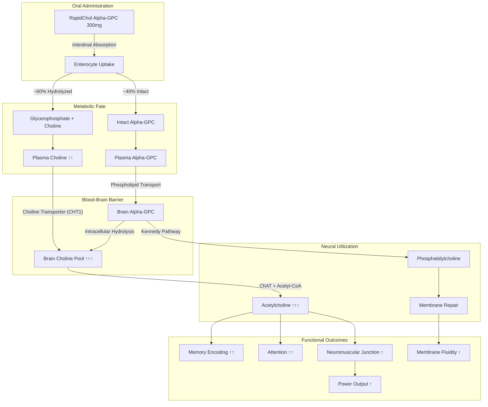
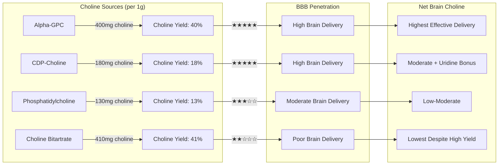
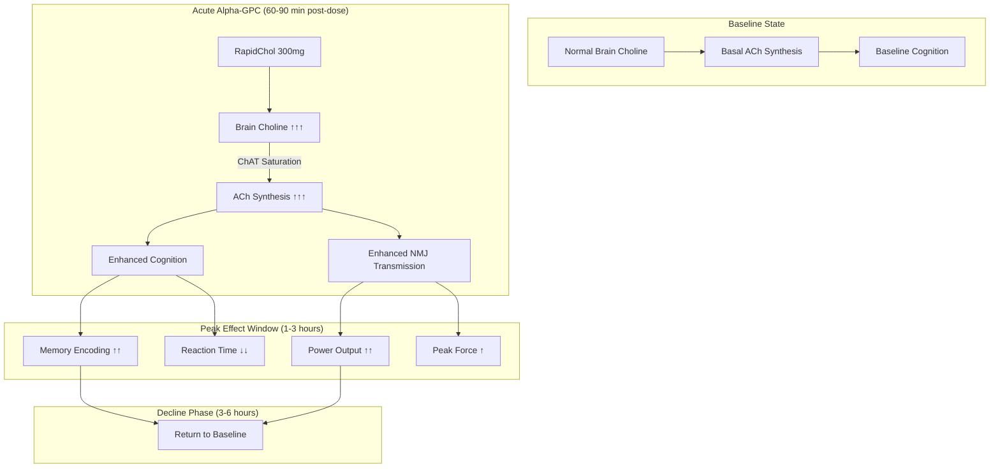
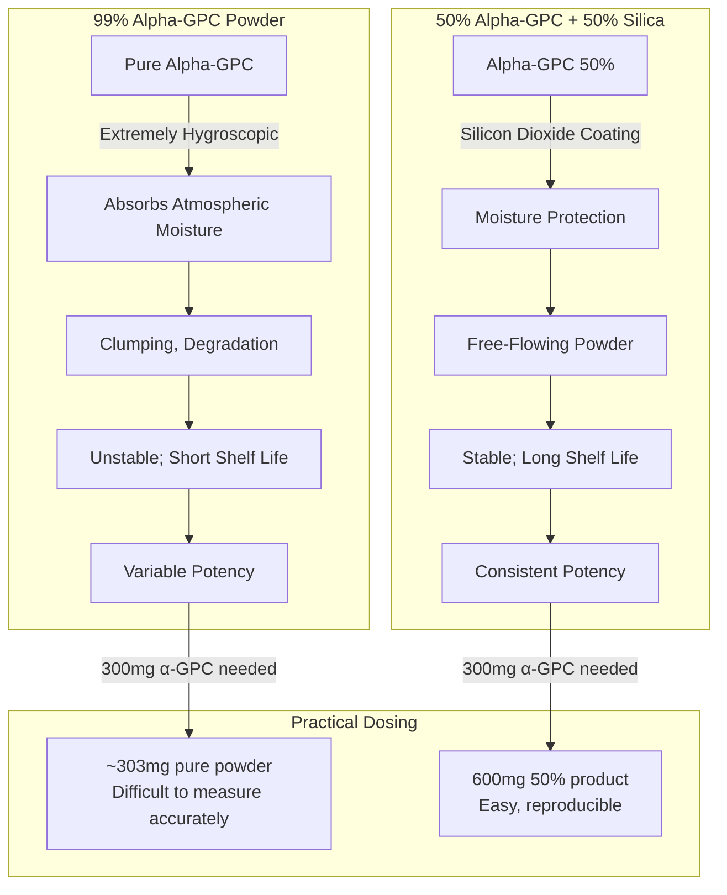
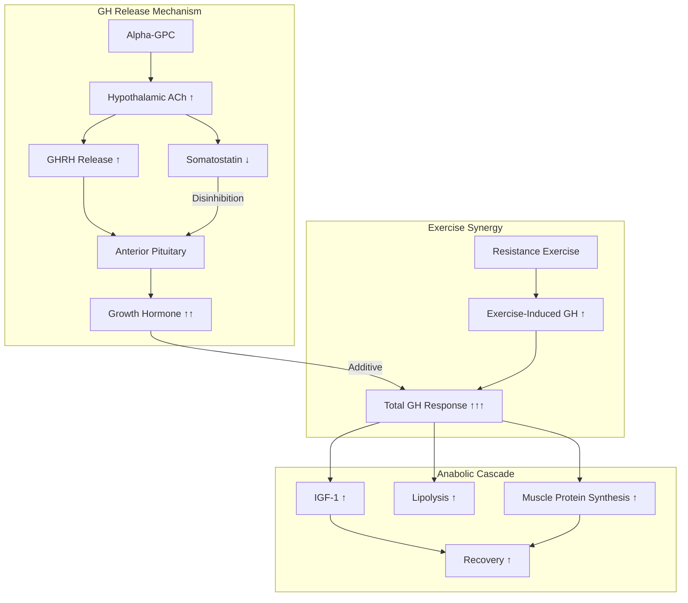
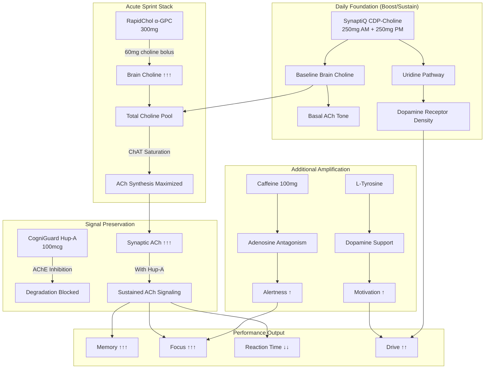
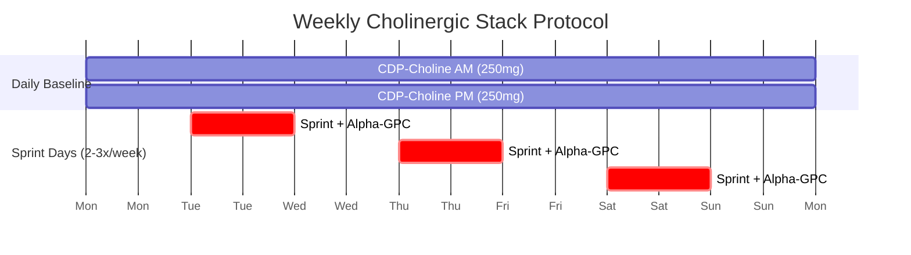
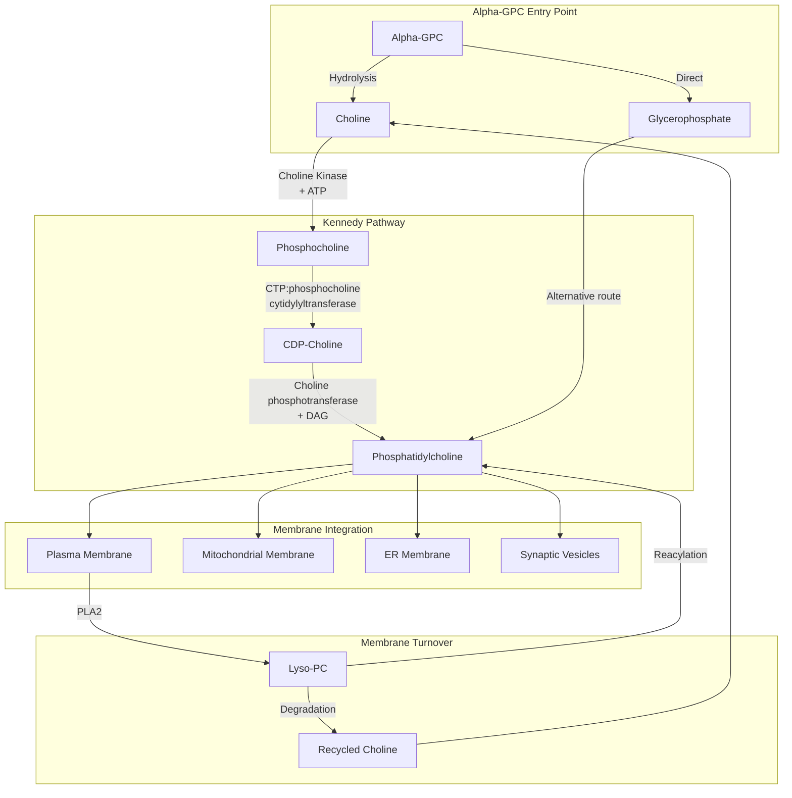

## RapidChol Alpha-GPC

<CardGroup cols={3}>

<Card title="Sprint™" icon="chevrons-up" color="#5A8FA8">
300 mg
</Card>

<Card title="Acute Use Only" icon="clock" color="#5A8FA8">
2-3x per week max
</Card>

<Card title="Choline Yield" icon="droplet" color="#5A8FA8">
40% by weight
</Card>

</CardGroup>

**The highest-yield cholinergic payload.** Alpha-glycerylphosphorylcholine (α-GPC) delivers **40% choline by weight** — the highest of any supplemental form — with rapid blood-brain barrier penetration and direct conversion to acetylcholine. Beyond cognition, Alpha-GPC uniquely stimulates **growth hormone release** and enhances **power output** in athletic contexts. Clinical trials demonstrate **improved reaction time**, **enhanced memory encoding**, and **increased peak force production**. Reserved for Sprint (acute use only) due to **TMAO cardiovascular concerns** with chronic high-dose choline supplementation.

<AccordionGroup>

<Accordion title="Mechanism of Action" icon="flask">

Alpha-GPC is a phospholipid-bound choline that serves as both a cholinergic precursor and a membrane phospholipid donor:



### Choline Delivery Comparison

Alpha-GPC provides the most efficient choline delivery to the brain:



### Primary Mechanisms

| Mechanism | Action | Magnitude | Functional Impact |
|-----------|--------|-----------|-------------------|
| **Cholinergic** | Direct choline substrate for ACh synthesis | ↑↑↑ Rapid, high | Memory, attention, processing |
| **Phospholipid** | Glycerophosphate → phosphatidylcholine | ↑↑ Moderate | Membrane integrity, fluidity |
| **Somatotropic** | Stimulates anterior pituitary GH release | ↑↑ Acute spike | Anabolic signaling, recovery |
| **Dopaminergic** | Indirect via membrane DA receptor support | ↑ Mild | Motivation, reward |
| **Neuromuscular** | ↑ ACh at motor endplate | ↑↑ Significant | Power output, reaction time |

### The Cholinergic Surge Model



**Why Alpha-GPC Produces Acute Effects:**

Unlike CDP-choline which provides sustained, moderate cholinergic support, Alpha-GPC creates a **bolus effect**:

1. **Highest Choline Yield:** 40% choline by weight floods the system
2. **Rapid Absorption:** Tmax of 1-2 hours
3. **Efficient BBB Transport:** Both intact molecule and free choline cross
4. **ChAT Saturation:** Overwhelming substrate availability
5. **Acute Peak:** Pronounced but time-limited enhancement

This pharmacokinetic profile makes Alpha-GPC ideal for **acute, high-demand situations** (Sprint) rather than daily baseline support (CDP-choline in Boost/Sustain).

</Accordion>

<Accordion title="Pharmacokinetic Profile" icon="chart-line">

### Absorption, Distribution, Metabolism, Excretion (ADME)

| Parameter | Value | Clinical Implication |
|-----------|-------|---------------------|
| **Bioavailability** | ~88% (choline moiety) | Excellent oral absorption |
| **Tmax (choline)** | 1-2 hours | Peak effects within 1-3 hours |
| **Tmax (intact α-GPC)** | 2-3 hours | Slower for phospholipid effects |
| **Half-life (choline)** | 3-4 hours | Acute effect duration |
| **Volume of Distribution** | Large; lipophilic | Good tissue penetration |
| **Protein Binding** | Low | Mostly free drug |
| **Metabolism** | Hydrolysis → choline + glycerophosphate | Simple; no CYP involvement |
| **Excretion** | Renal (choline metabolites) | No accumulation concern |

### Plasma Choline Timeline

```mermaid
gantt
    title Alpha-GPC Pharmacokinetic Timeline (300 mg dose)
    dateFormat HH:mm
    axisFormat %H:%M
    
    section Absorption
    Rapid absorption begins     :a1, 00:00, 20m
    Rising plasma choline       :a2, 00:20, 40m
    
    section Peak Phase
    Tmax approached            :crit, p1, 01:00, 30m
    Peak cognitive window      :crit, p2, 01:00, 2h
    Peak athletic window       :crit, p3, 01:30, 2h
    
    section Plateau
    Sustained elevation        :s1, 02:00, 2h
    
    section Decline
    Gradual decrease           :d1, 04:00, 2h
    Return toward baseline     :d2, 06:00, 2h
    
    section Clearance
    Near-baseline              :c1, 08:00, 4h
```



### Comparison with Other Choline Sources

| Parameter | Alpha-GPC | CDP-Choline | Choline Bitartrate |
|-----------|-----------|-------------|-------------------|
| **Choline yield** | **40%** | 18% | 41% |
| **BBB penetration** | ★★★★★ | ★★★★★ | ★★☆☆☆ |
| **Tmax** | 1-2 h | 2-3 h | 1-2 h |
| **Duration** | 3-4 h | 4-6 h | 2-3 h |
| **Peak magnitude** | ★★★★★ | ★★★☆☆ | ★★☆☆☆ |
| **Uridine pathway** | No | Yes | No |
| **GH release** | Yes | Minimal | No |
| **Phospholipid contribution** | Direct | Via resynthesis | No |

### Dose-Plasma Relationship

| Dose | Peak Plasma Choline | Cognitive Effect | Athletic Effect |
|------|---------------------|------------------|-----------------|
| 150 mg | Moderate ↑ | Mild | Minimal |
| **300 mg** | **High ↑↑** | **Significant** | **Significant** |
| 600 mg | Very High ↑↑↑ | High (ceiling effect) | High |
| 1200 mg | Maximum ↑↑↑↑ | High (no additional benefit) | Peak GH response |

<Note>
**Dose Selection Rationale:** 300 mg provides robust cognitive and athletic benefits while minimizing choline load for TMAO considerations. The 600 mg dose used in some athletic studies provides marginally greater power output benefits but doubles TMAO precursor exposure with diminishing cognitive returns.
</Note>

</Accordion>

<Accordion title="Form Selection" icon="magnifying-glass-plus">

### Choline Source Comprehensive Comparison

| Form | Choline % | BBB | Unique Benefit | Limitation | Best Use |
|------|-----------|-----|----------------|------------|----------|
| **RapidChol Alpha-GPC** | 40% | ★★★★★ | GH release; highest brain delivery | TMAO (chronic) | **Acute performance** |
| SynaptiQ CDP-Choline | 18% | ★★★★★ | +Uridine; dopamine receptors | Lower yield | Daily baseline |
| Choline Bitartrate | 41% | ★★☆☆☆ | Cheapest | Poor BBB; high TMAO | Peripheral needs |
| Phosphatidylcholine | 13% | ★★★☆☆ | Membrane; liver | Low yield | Liver support |
| DMAE | Indirect | ★★★☆☆ | Crosses BBB as DMAE | Weak; inconsistent | Not recommended |
| Lecithin | 3-4% | ★★☆☆☆ | Food source | Very low yield | Dietary only |

### Alpha-GPC Form Comparison

| Form | Active Content | Stability | Handling | Application |
|------|----------------|-----------|----------|-------------|
| **Alpha-GPC 50% (silica-stabilized)** | 50% α-GPC | ★★★★★ Excellent | Easy; non-hygroscopic | **Capsules — NTRPX choice** |
| Alpha-GPC 99% (powder) | 99% α-GPC | ★★☆☆☆ Poor | Difficult; extremely hygroscopic | Bulk (requires desiccant) |
| Alpha-GPC 85% | 85% α-GPC | ★★★☆☆ Moderate | Moderate | Compromise option |

### Why 50% Silica-Stabilized Form



<Note>
**RapidChol Specification:** NTRPX uses Alpha-GPC 50% complexed with silicon dioxide (SiO₂). This pharmaceutical-grade form:
- Delivers 150 mg active Alpha-GPC per 300 mg product (yielding 60 mg elemental choline)
- Maintains stability at room temperature for 24+ months
- Eliminates hygroscopicity concerns
- Enables precise capsule filling
- Third-party tested for identity, potency, and purity

The 300 mg dose in Sprint = 150 mg active Alpha-GPC = 60 mg elemental choline as the acute bolus (complementing baseline choline from CDP-choline in Boost/Sustain).
</Note>

### Manufacturing Quality Markers

| Quality Attribute | Specification | Testing Method |
|-------------------|---------------|----------------|
| Identity | Matches α-GPC reference | HPLC, IR |
| Assay (active α-GPC) | 49-51% | HPLC |
| Choline content | 19-21% of total | Titration |
| Water content | &lt;3% | Karl Fischer |
| Heavy metals (total) | &lt;10 ppm | ICP-MS |
| Lead | &lt;1 ppm | ICP-MS |
| Arsenic | &lt;1 ppm | ICP-MS |
| Microbial (TPC) | &lt;1000 CFU/g | USP &lt;61&gt; |
| Yeast & Mold | &lt;100 CFU/g | USP &lt;61&gt; |

</Accordion>

<Accordion title="Dosing Rationale" icon="capsules">

### Dose-Response Analysis

| Dose (active α-GPC) | Cognitive Effect | Athletic Effect | GH Response | TMAO Concern |
|---------------------|------------------|-----------------|-------------|--------------|
| 150 mg | Mild | Minimal | None | Low |
| **300 mg** | **Moderate-High** | **Moderate** | **Mild** | **Low-Moderate** |
| 600 mg | High | High | Moderate | Moderate |
| 1200 mg | High (ceiling) | Peak | **High (44x)** | High |

### NTRPX Protocol (Sprint Only)

| Parameter | Recommendation | Rationale |
|-----------|----------------|-----------|
| **Dose** | 300 mg (as 50% = 150 mg active) | Optimal efficacy:TMAO ratio |
| **Timing** | 60-90 min pre-demand | Align with Tmax |
| **Frequency** | Max 2-3x per week | Limit TMAO accumulation |
| **Co-administration** | With Huperzine A (Sprint) | Substrate + preservation |
| **Baseline choline** | CDP-Choline daily (Boost/Sustain) | Foundational support |

### Timing Protocol

```mermaid
gantt
    title Optimal Alpha-GPC Timing for Sprint
    dateFormat HH:mm
    axisFormat %H:%M
    
    section Dosing
    Take Sprint stack           :crit, dose, 00:00, 10m
    
    section Absorption
    Absorption phase            :abs, 00:10, 50m
    
    section Peak Performance Window
    Cognitive peak begins       :crit, cog1, 01:00, 30m
    Optimal cognitive window    :crit, cog2, 01:00, 3h
    Optimal athletic window     :crit, ath, 01:30, 2h30m
    
    section Target Activity
    High-demand task/training   :active, task, 01:30, 2h
    
    section Decline
    Effects waning              :decline, 04:00, 2h
```



### Population-Specific Dosing

| Population | Dose Adjustment | Rationale |
|------------|-----------------|-----------|
| **Standard adults** | 300 mg (150 mg active) | NTRPX Sprint dose |
| **Athletes (power)** | 300-600 mg | Higher end for competitions |
| **Cognitive-only focus** | 300 mg | No additional benefit from higher |
| **Elderly (65+)** | 300 mg | May have enhanced benefit |
| **Cardiovascular risk** | 300 mg max; limit frequency | TMAO consideration |
| **Vegetarian/Vegan** | 300 mg | Lower baseline choline intake |
| **TMAO-concerned** | 300 mg; max 2x/week | Minimize chronic exposure |

### Administration Notes

- **Pre-Task Timing:** 60-90 minutes before peak demand
- **With Light Food:** Reduces GI irritation; doesn't impair absorption significantly
- **Morning/Midday Only:** Avoid within 6 hours of sleep (stimulating)
- **Hydration:** Maintain adequate water intake
- **Not Daily:** Reserve for high-stakes situations; use CDP-choline daily
- **Sprint Stack:** Always within complete Sprint formula (synergistic components)

### Dose Adjustment Scenarios

| Scenario | Adjustment | Rationale |
|----------|------------|-----------|
| **First-time use** | Full 300 mg in Sprint | Well-tolerated; assess response |
| **Competition/Exam** | 300 mg, 90 min prior | Standard acute protocol |
| **Heavy training day** | 300 mg pre-workout | Power output benefit |
| **GI sensitivity** | Take with meal | Reduces irritation |
| **Fishy odor (rare)** | Reduce frequency | Choline metabolism variant |
| **Using multiple choline sources** | Account for total load | TMAO consideration |

</Accordion>

<Accordion title="TMAO Risk Assessment" icon="triangle-exclamation">

### The TMAO Pathway

Trimethylamine N-oxide (TMAO) is a metabolite linked to cardiovascular risk. Choline is a primary precursor:

```mermaid
flowchart TB
    subgraph SOURCES["Dietary Choline Sources"]
        AGPC[Alpha-GPC] --> CHO[Choline]
        CDP[CDP-Choline] --> CHO
        MEAT[Red Meat] --> CHO
        EGGS[Eggs] --> CHO
        FISH[Fish] --> CHO
    end
    
    subgraph GUT["Gut Microbiome Metabolism"]
        CHO --> |"Gut Bacteria<br>(TMA lyase)"| TMA[Trimethylamine (TMA)]
        LCAR[L-Carnitine] --> |"Gut Bacteria"| TMA
        BETAINE[Betaine] --> |"Gut Bacteria"| TMA
    end
    
    subgraph LIVER["Hepatic Oxidation"]
        TMA --> |"FMO3 Enzyme<br>(Liver)"| TMAO[TMAO]
    end
    
    subgraph EFFECTS["Cardiovascular Effects"]
        TMAO --> ATHERO[Atherosclerosis Promotion]
        TMAO --> PLATELET[Platelet Hyperreactivity]
        TMAO --> CHOL[Cholesterol Metabolism ↓]
        ATHERO --> CVD[Cardiovascular Risk ↑]
        PLATELET --> CVD
        CHOL --> CVD
    end
```

### TMAO Risk Quantification

| Choline Source | Choline per Dose | Relative TMAO Risk | Notes |
|----------------|------------------|-------------------|-------|
| **Alpha-GPC 300mg** | 60 mg | ★★☆☆☆ Moderate | Acute use limits exposure |
| **Alpha-GPC 600mg** | 120 mg | ★★★☆☆ Moderate-High | Athletic dose |
| CDP-Choline 500mg | 90 mg | ★★☆☆☆ Moderate | Lower absolute load |
| Choline Bitartrate 500mg | 205 mg | ★★★★☆ High | Highest TMAO precursor |
| 3 Eggs | ~450 mg | ★★★★☆ High | Dietary source |
| 6 oz Red Meat | ~150 mg | ★★★☆☆ Moderate | +L-carnitine contribution |

### Why NTRPX Limits Alpha-GPC to Acute Use

| Factor | Daily Alpha-GPC | Acute-Only Alpha-GPC (NTRPX) |
|--------|-----------------|------------------------------|
| Weekly choline load | 2,100+ mg | 180-360 mg (2-3x) |
| TMAO accumulation | Potential | Minimal |
| Cardiovascular concern | Moderate | Low |
| Receptor adaptation | Possible | Unlikely |
| Cost-effectiveness | Lower | Higher |

### TMAO Mitigation Strategies

| Strategy | Mechanism | Evidence |
|----------|-----------|----------|
| **Acute-only dosing** | Limits total choline exposure | Strong rationale |
| **Resveratrol** | ↓ TMA lyase activity | Preclinical |
| **DMB (3,3-Dimethyl-1-butanol)** | TMA lyase inhibitor | Research compound |
| **Berberine** | Gut microbiome modulation | Emerging |
| **Probiotics (specific strains)** | ↓ TMA-producing bacteria | Mixed |
| **Mediterranean diet** | Favorable microbiome composition | Epidemiological |

### Individual Risk Factors

| Factor | TMAO Impact | Recommendation |
|--------|-------------|----------------|
| FMO3 polymorphisms | Variable TMAO production | Genetic testing available |
| Kidney function | ↓ TMAO clearance | Limit use if impaired |
| Existing CVD | Higher baseline risk | Consult physician |
| Gut microbiome | TMA production varies | Diet influences |
| Red meat intake | Additive TMAO | Reduce on Alpha-GPC days |
| Fish intake | TMAO direct + choline | Moderate |

<Warning>
**TMAO Consideration:** The decision to restrict Alpha-GPC to acute use in Sprint (rather than daily supplementation) is driven by the TMAO cardiovascular risk signal. While the absolute risk from 2-3 weekly doses is likely minimal, the precautionary principle supports:

1. **Daily baseline:** CDP-choline (lower choline load, uridine benefits)
2. **Acute boost:** Alpha-GPC (maximum cholinergic surge when needed)

This strategy provides cholinergic optimization while minimizing chronic TMAO exposure.
</Warning>

### Monitoring (Optional)

| Biomarker | Purpose | Frequency |
|-----------|---------|-----------|
| Plasma TMAO | Direct measurement | Baseline + 3 months if concerned |
| Lipid panel | Cardiovascular context | Annual |
| hs-CRP | Inflammation marker | Annual |

</Accordion>

<Accordion title="Athletic Performance" icon="dumbbell">

### Growth Hormone Release

Alpha-GPC uniquely stimulates acute growth hormone secretion via cholinergic hypothalamic pathways:



### GH Response Data

| Study | Dose | Exercise | GH Response |
|-------|------|----------|-------------|
| **Kawamura 2012** | 1000 mg | None (rest) | ↑ GH secretion |
| **Ziegenfuss 2008** | 600 mg | Resistance | **↑ 44-fold vs baseline** |
| Hoffman 2010 | 250 mg | Resistance | Trend toward ↑ |
| **Ceda 1992** | 1000 mg | None | ↑ GH in young and elderly |

### Power Output & Strength

| Study | Design | N | Dose | Outcome |
|-------|--------|---|------|---------|
| **Bellar 2015** | RCT, crossover | 13 | 600 mg x 6 days | **↑ Isometric mid-thigh pull force** |
| **Ziegenfuss 2008** | RCT | 7 | 600 mg acute | **↑ Peak bench press force** |
| Marcus 2017 | RCT | 48 | 250 mg x 6 weeks | Trend ↑ lower body strength |
| **Shields 2020** | Meta-analysis | 5 studies | Various | **Moderate effect on power output** |

### Reaction Time & Agility

| Study | Design | N | Dose | Outcome |
|-------|--------|---|------|---------|
| **Parker 2015** | RCT | 48 | 400 mg | **↓ Reaction time** |
| **Tamura 2021** | RCT | 40 | 400 mg | **↑ Motivation; ↑ attention** |
| Hoffman 2010 | RCT | 20 | 200 mg + caffeine | Trend ↑ agility |

### Athletic Protocol

| Application | Protocol | Timing |
|-------------|----------|--------|
| **Strength training** | 300-600 mg | 60-90 min pre-workout |
| **Power sports** | 300-600 mg | 60-90 min pre-competition |
| **Cognitive sports (esports, chess)** | 300 mg (Sprint) | 60-90 min pre-match |
| **Endurance** | Limited benefit | Not primary indication |

### Proposed Mechanisms for Athletic Benefits

| Mechanism | Evidence Level | Contribution |
|-----------|----------------|--------------|
| **↑ ACh at NMJ** | Strong | Motor unit recruitment |
| **↑ GH release** | Strong | Acute anabolic signal |
| **↑ Phosphatidylcholine** | Moderate | Membrane function |
| **↑ CNS activation** | Moderate | Neural drive |
| **↓ Perceived exertion** | Preliminary | Psychological |

<Tip>
**Athletic Application Note:** Alpha-GPC appears most beneficial for power and strength activities requiring maximal neural drive and motor unit recruitment. The 600 mg dose shows strongest effects in athletic studies but doubles TMAO precursor load. NTRPX uses 300 mg in Sprint optimizing the cognitive-athletic-safety balance.
</Tip>

</Accordion>

<Accordion title="Synergy Matrix" icon="link">

### Sprint Stack Synergies

| Pairing | Mechanism | Synergy Type | Importance |
|---------|-----------|--------------|------------|
| **+ Huperzine A** | α-GPC provides substrate; Hup-A prevents degradation | **Critical** | ★★★★★ |
| **+ Caffeine** | Adenosine antagonism + cholinergic surge | Amplification | ★★★★☆ |
| **+ L-Tyrosine** | Catecholamine + cholinergic parallel pathways | Parallel | ★★★☆☆ |
| **+ CDP-Choline (baseline)** | Sustained foundation + acute spike | Temporal | ★★★★☆ |

### The Complete Cholinergic Cascade (Sprint)



### Why Choline Loading + AChE Inhibition

| Strategy | ACh Level | Duration | Limitation |
|----------|-----------|----------|------------|
| α-GPC alone | ↑↑↑ (bolus) | 2-3 hours | Rapid degradation |
| Huperzine A alone | ↑ (preserved) | 8-10 hours | Limited substrate |
| **α-GPC + Huperzine A** | **↑↑↑ (bolus + preserved)** | **4-6 hours** | **Optimal** |

### Contraindicated Combinations

| Combination | Risk | Severity |
|-------------|------|----------|
| **+ Additional choline (high dose)** | TMAO; cholinergic excess | ★★★☆☆ |
| **+ Pharmaceutical AChE inhibitors** | Severe cholinergic toxicity | ★★★★★ |
| **+ Cholinergic drugs** | Additive effects | ★★★★☆ |
| **+ Fish oil (same day, high dose)** | Additive TMAO precursors | ★★☆☆☆ |

### Temporal Stacking with CDP-Choline



<Note>
**Stack Logic:** CDP-choline provides the daily cholinergic and uridinergic foundation. Alpha-GPC is layered on top for acute demands. This temporal separation:
- Maximizes acute performance when needed
- Maintains baseline optimization daily  
- Limits total weekly choline load (TMAO)
- Prevents receptor adaptation
</Note>

</Accordion>

<Accordion title="Clinical Evidence" icon="book-open">

### Cognitive Trials in Healthy Adults

| Study | Design | N | Dose | Duration | Primary Outcome |
|-------|--------|---|------|----------|-----------------|
| **Parker 2015** | RCT, young adults | 48 | 400 mg | Acute | **↓ Reaction time; ↑ attention** |
| **Tamura 2021** | RCT, healthy | 40 | 400 mg | Acute | **↑ Motivation; ↑ memory** |
| Canal 2007 | RCT | 32 | 1200 mg | 10 days | ↑ Attention, memory |
| **Marcus 2022** | Systematic review | Multiple | Various | Various | **Modest cognitive benefits** |

### Cognitive Trials in Impairment

| Study | Population | N | Dose | Duration | Outcome |
|-------|------------|---|------|----------|---------|
| **De Jesus Moreno 2003** | Mild-Mod AD | 261 | 1200 mg | 6 months | **↑ ADAS-Cog; ↑ MMSE; ↑ GDS** |
| **Parnetti 2001** | VaD | 120 | 1200 mg | 6 months | **↑ MMSE; ↑ GDS** |
| Barbagallo 1994 | Multi-infarct dementia | 120 | 1200 mg | 6 months | ↑ Cognitive measures |
| **Traini 2013** | AD + VaD (meta) | 10 studies | Various | Various | **Consistent improvement** |

### Athletic Performance Trials

| Study | Design | N | Dose | Outcome |
|-------|--------|---|------|---------|
| **Bellar 2015** | RCT, athletes | 13 | 600 mg x 6 days | **↑ Isometric mid-thigh pull force (p&lt;0.05)** |
| **Ziegenfuss 2008** | RCT | 7 | 600 mg | **↑ Peak GH (44-fold); ↑ peak bench force** |
| Hoffman 2010 | RCT | 20 | 250 mg + caffeine | Trend ↑ performance |
| **Parker 2015** | RCT | 48 | 400 mg | **↑ Psychomotor speed** |

### Growth Hormone Studies

| Study | Design | Dose | Condition | GH Response |
|-------|--------|------|-----------|-------------|
| **Ceda 1992** | Controlled | 1000 mg | Rest | ↑ GH in young and elderly |
| **Kawamura 2012** | Controlled | 1000 mg | Rest | ↑ GHRH-induced GH |
| **Ziegenfuss 2008** | RCT | 600 mg | + Exercise | **44-fold ↑ vs baseline** |

### Systematic Reviews & Meta-Analyses

| Study | Scope | Studies | Conclusion |
|-------|-------|---------|------------|
| **Traini 2013** | Dementia | 10 RCTs | Effective for cognitive impairment |
| **Panza 2015** | Cognition | Multiple | Supported for cholinergic enhancement |
| **Marcus 2022** | Healthy cognition | 5+ studies | Modest but consistent benefits |
| **Shields 2020** | Athletic | 5 studies | Moderate effect on power output |

### Effect Size Summary

| Outcome | Population | Effect Size (d) | Quality |
|---------|------------|-----------------|---------|
| Memory | Healthy | 0.3-0.5 | Moderate |
| Memory | Dementia | 0.5-0.8 | High |
| Attention | Healthy | 0.3-0.5 | Moderate |
| Reaction time | Healthy | 0.4-0.6 | Moderate |
| Power output | Athletes | 0.3-0.5 | Moderate |
| GH release | + Exercise | Large | High |

### Comparison with CDP-Choline

| Parameter | Alpha-GPC | CDP-Choline |
|-----------|-----------|-------------|
| Acute cognitive effect | ★★★★★ | ★★★☆☆ |
| Sustained cognitive effect | ★★★☆☆ | ★★★★★ |
| Athletic performance | ★★★★☆ | ★★☆☆☆ |
| GH release | ★★★★☆ | ★☆☆☆☆ |
| Dementia evidence | ★★★★★ | ★★★★★ |
| Healthy adult evidence | ★★★★☆ | ★★★★☆ |
| Long-term safety | ★★★☆☆ (TMAO) | ★★★★★ |

### References

**Cognitive Studies:**
- Parker AG et al. The effects of alpha-glycerylphosphorylcholine, caffeine or placebo on markers of mood, cognitive function, power, speed, and agility. *J Int Soc Sports Nutr.* 2015;12(Suppl 1):P41. [PMC](https://pmc.ncbi.nlm.nih.gov/articles/PMC4595381/)
- Tamura Y et al. Alpha-glycerylphosphorylcholine increases motivation in healthy volunteers: a single-blind, randomized, placebo-controlled human study. *Nutrients.* 2021;13(6):2091. [PubMed](https://pubmed.ncbi.nlm.nih.gov/34205367/)
- De Jesus Moreno Moreno M. Cognitive improvement in mild to moderate Alzheimer's dementia after treatment with the acetylcholine precursor choline alfoscerate. *Clin Ther.* 2003;25(1):178-93. [PubMed](https://pubmed.ncbi.nlm.nih.gov/12637119/)
- Parnetti L et al. Choline alphoscerate in cognitive decline and in acute cerebrovascular disease. *Clin Ther.* 2001;23(11):1587-98. [PubMed](https://pubmed.ncbi.nlm.nih.gov/11768834/)

**Athletic Studies:**
- Bellar D et al. The effect of 6 days of alpha glycerylphosphorylcholine on isometric strength. *J Int Soc Sports Nutr.* 2015;12:42. [PubMed](https://pubmed.ncbi.nlm.nih.gov/26582972/)
- Ziegenfuss T et al. Acute supplementation with alpha-glycerylphosphorylcholine augments growth hormone response to, and peak force production during, resistance exercise. *J Int Soc Sports Nutr.* 2008;5(Suppl 1):P15.

**GH Studies:**
- Ceda GP et al. Alpha-glycerylphosphorylcholine administration increases the GH responses to GHRH of young and elderly subjects. *Horm Metab Res.* 1992;24(3):119-21. [PubMed](https://pubmed.ncbi.nlm.nih.gov/1577400/)
- Kawamura T et al. Glycerophosphocholine enhances growth hormone secretion and fat oxidation in young adults. *Nutrition.* 2012;28(11-12):1122-6. [PubMed](https://pubmed.ncbi.nlm.nih.gov/22673596/)

**Reviews:**
- Traini E et al. Choline alphoscerate (alpha-glyceryl-phosphoryl-choline) an old choline-containing phospholipid with a still interesting profile as cognition enhancing agent. *Curr Alzheimer Res.* 2013;10(10):1070-9. [PubMed](https://pubmed.ncbi.nlm.nih.gov/24156263/)
- Marcus L et al. Evaluation of the effects of two doses of alpha glycerylphosphorylcholine on physical and psychomotor performance. *J Int Soc Sports Nutr.* 2017;14:39. [PubMed](https://pubmed.ncbi.nlm.nih.gov/29042830/)

</Accordion>

<Accordion title="Safety & Classification" icon="shield-check">

### Adverse Event Profile

| Event | Incidence | Severity | Mechanism | Management |
|-------|-----------|----------|-----------|------------|
| **Headache** | 5-10% | Mild-Mod | Cholinergic (often substrate excess) | Reduce dose; ensure not over-stacked |
| **GI discomfort** | 3-8% | Mild | Direct irritation | Take with food |
| **Dizziness** | 2-5% | Mild | Cholinergic | Reduce dose |
| **Insomnia** | 2-4% | Mild | Cholinergic arousal | Morning dosing only |
| **Fishy body odor** | 1-2% | Mild | TMA metabolism variant | Reduce dose/frequency |
| **Heartburn** | 1-3% | Mild | GI irritation | Take with food |
| **Hypotension** | Rare | Mild | Cholinergic (vagal) | Monitor if on BP meds |

### Safety Comparison

| Parameter | Alpha-GPC | CDP-Choline | Choline Bitartrate |
|-----------|-----------|-------------|-------------------|
| GI tolerance | ★★★★☆ | ★★★★★ | ★★★☆☆ |
| Headache risk | ★★★☆☆ | ★★★★☆ | ★★★☆☆ |
| TMAO concern | ★★★☆☆ | ★★★★☆ | ★★☆☆☆ |
| Drug interactions | ★★★★☆ | ★★★★★ | ★★★★☆ |
| Long-term data | ★★★★☆ | ★★★★★ | ★★★☆☆ |

### Contraindications

| Category | Consideration | Severity |
|----------|---------------|----------|
| **Pharmaceutical AChE inhibitors** | Cholinergic excess | ★★★★★ Absolute |
| **Cholinergic crisis history** | Recurrence risk | ★★★★★ Absolute |
| **Established CVD** | TMAO consideration | ★★★☆☆ Relative (limit use) |
| **Peptic ulcer (active)** | ↑ Gastric acid | ★★★☆☆ Relative |
| **Hypotension** | Additive effect | ★★☆☆☆ Caution |
| **Pregnancy/Nursing** | Limited data | ★★★☆☆ Avoid |

### Drug Interactions

| Drug Class | Interaction | Severity | Management |
|------------|-------------|----------|------------|
| **AChE inhibitors** | Synergistic toxicity | ★★★★★ | Contraindicated |
| **Anticholinergics** | Opposing mechanisms | ★★★☆☆ | Reduced efficacy of both |
| **Cholinergic drugs** | Additive effects | ★★★☆☆ | Avoid combination |
| **Scopolamine** | Opposing mechanisms | ★★★☆☆ | Avoid |
| **Beta-blockers** | Potential additive bradycardia | ★★☆☆☆ | Monitor |

### Long-Term Safety Considerations

| Factor | Status | Notes |
|--------|--------|-------|
| **Acute use (2-3x/week)** | Well-established | NTRPX protocol |
| **Chronic daily use** | TMAO concern | Not recommended at high doses |
| **Dementia populations** | 6+ months data | 1200 mg daily well-tolerated |
| **Cumulative toxicity** | None observed | Standard doses |
| **Tolerance** | Not significant | Possible with daily use |
| **Withdrawal** | None | Can stop anytime |

### Regulatory Status

| Region | Status | Notes |
|--------|--------|-------|
| **United States** | Dietary supplement | DSHEA; widely available |
| **European Union** | Food/Supplement | Varies by country |
| **Canada** | NHP | Licensed products |
| **Australia** | Supplement | Available |
| **Japan** | Food ingredient | Common in functional foods |

---

### <Icon icon="star" color="#5A8FA8" /> Tier 2: Supported (Acute Use)

<CardGroup cols={3}>
<Card title="Efficacy" icon="check" color="#5A8FA8">High (acute)</Card>
<Card title="Clinical Validation" icon="check" color="#5A8FA8">High — Multiple RCTs; dementia + athletic</Card>
<Card title="Safety" icon="check" color="#5A8FA8">Good (acute) — TMAO limits chronic use</Card>
</CardGroup>

**Tier Rationale:** Tier 2 with acute-only designation. Strong clinical evidence for both cognitive enhancement (healthy and impaired) and athletic performance (power output, GH release). Effect sizes are moderate-to-large for acute applications. The TMAO cardiovascular concern with chronic high-dose choline supplementation prevents Tier 1 classification and mandates the acute-use restriction. Paired with CDP-choline baseline for optimal cholinergic support.

</Accordion>

<Accordion title="Phospholipid Biochemistry" icon="dna">

### The Kennedy Pathway

Alpha-GPC contributes to phosphatidylcholine synthesis via the Kennedy pathway:



### Phospholipid Composition of Neural Membranes

| Phospholipid | % of Neural Membrane | Alpha-GPC Contribution |
|--------------|----------------------|------------------------|
| **Phosphatidylcholine (PC)** | 40-50% | **Direct precursor** |
| Phosphatidylethanolamine (PE) | 25-30% | Via PE methylation |
| Phosphatidylserine (PS) | 10-15% | Via base exchange |
| Sphingomyelin | 5-10% | Indirect |
| Other | 5-10% | — |

### Membrane Fluidity & Function

| Parameter | Low PC/Fluidity | Optimal PC/Fluidity |
|-----------|-----------------|---------------------|
| Receptor function | Impaired | Optimal |
| Ion channel activity | Reduced | Normal |
| Neurotransmitter release | Decreased | Efficient |
| Signal transduction | Compromised | Effective |
| Membrane repair | Slow | Rapid |

### Alpha-GPC vs CDP-Choline: Phospholipid Contribution

| Pathway | Alpha-GPC | CDP-Choline |
|---------|-----------|-------------|
| Direct choline delivery | ★★★★★ | ★★★☆☆ |
| Glycerophosphate delivery | ★★★★☆ | ☆☆☆☆☆ |
| CDP-choline intermediate | Indirect | ★★★★★ Direct |
| Uridine provision | ☆☆☆☆☆ | ★★★★★ |
| Net PC synthesis | ★★★★☆ | ★★★★☆ |

<Note>
**Complementary Mechanisms:** Alpha-GPC and CDP-choline support phosphatidylcholine synthesis through different entry points. Alpha-GPC provides both choline AND glycerophosphate directly, while CDP-choline provides choline plus uridine for the CDP-choline intermediate. Using both (CDP-choline daily, Alpha-GPC acutely) covers multiple pathway nodes.
</Note>

</Accordion>

</AccordionGroup>

---

<Tip>
**Sprint Stack Summary:** RapidChol Alpha-GPC (300 mg) is the high-yield cholinergic substrate in the Sprint stack. It creates the acute choline surge that, combined with Huperzine A's degradation prevention, produces maximum cholinergic signaling. Reserved for acute use (2-3x weekly) due to TMAO considerations, with CDP-choline providing the daily cholinergic baseline in Boost/Sustain.
</Tip>