## ChamomiLux Apigenin

<CardGroup cols={4}>

<Card title="Luna" icon="moon" color="#5A8FA8">
50 mg
</Card>

<Card title="Effect" icon="chevron-down" color="#5A8FA8">
Calming
</Card>

<Card title="GABA-A" icon="brain" color="#5A8FA8">
Anxiolytic
</Card>

<Card title="CD38" icon="hourglass-half" color="#5A8FA8">
NAD+ Sparing
</Card>

</CardGroup>

**The chamomile molecule with a longevity secret.** Apigenin is a naturally occurring flavonoid found abundantly in chamomile, parsley, and celery. For centuries, chamomile tea has been humanity's gentle sleep aid — and apigenin is the compound responsible. At the molecular level, apigenin binds to **GABA-A receptors** at the benzodiazepine site, producing **anxiolytic effects without sedation or cognitive impairment**. But apigenin holds a deeper secret: it's one of the most potent natural **CD38 inhibitors** known, preserving **NAD+** levels that decline with age. This positions apigenin at the intersection of **sleep science** and **longevity research**. In Luna, ChamomiLux Apigenin completes the sleep stack — adding GABAergic calm to glycine's thermoregulation, L-theanine's alpha waves, and magnesium's NMDA modulation.

<AccordionGroup>

<Accordion title="Mechanism of Action" icon="flask">

Apigenin works through two distinct and complementary mechanisms:

### Mechanism 1: GABA-A Receptor Modulation

Apigenin binds to the benzodiazepine site on GABA-A receptors:

**Key Distinction from Benzodiazepines:**

| Property | Apigenin | Benzodiazepines |
|----------|----------|-----------------|
| Binding site | Same (BZD site) | Same |
| Binding affinity | Low-moderate | High |
| Efficacy | Partial agonist | Full agonist |
| Sedation | **Minimal** | Significant |
| Cognitive impairment | **None** | Yes |
| Dependence potential | **None** | High |
| Anxiolysis | Yes | Yes |

### Mechanism 2: CD38 Inhibition and NAD+ Preservation

This is apigenin's unique longevity mechanism:

### What is CD38?

| Property | CD38 |
|----------|------|
| Full name | Cluster of Differentiation 38 |
| Type | NAD+ glycohydrolase (ectoenzyme) |
| Function | Degrades NAD+ → cADPR, ADPR, NAADP |
| Age-related change | Expression increases 2-3× with aging |
| Problem | Major driver of age-related NAD+ decline |
| Apigenin effect | **IC50 ~10 µM (potent inhibition)** |

### NAD+ and Aging

### Complete Mechanism Summary

| Mechanism | Target | Effect | Timeframe |
|-----------|--------|--------|-----------|
| **GABA-A PAM** | BZD site | Anxiolysis, calm | Acute (hours) |
| **CD38 inhibition** | CD38 enzyme | NAD+ preservation | Chronic (weeks-months) |
| **Anti-inflammatory** | NF-κB, COX-2 | ↓ Inflammation | Chronic |
| **Antioxidant** | ROS scavenging | ↓ Oxidative stress | Acute + chronic |

### Why Both Mechanisms Matter for Sleep

</Accordion>

<Accordion title="GABA-A Pharmacology" icon="brain">

### The Benzodiazepine Binding Site

Apigenin binds to the same site as benzodiazepines but with critical differences:

### Apigenin vs Benzodiazepines vs Other Anxiolytics

| Compound | Affinity | Efficacy | Selectivity | Sedation | Dependence |
|----------|----------|----------|-------------|----------|------------|
| **Apigenin** | Low-Mod | Partial | α2-preferring | **None** | **None** |
| Diazepam | High | Full | Non-selective | High | High |
| Alprazolam | High | Full | Non-selective | Moderate | High |
| Zolpidem | High | Full | α1-selective | High | Moderate |
| L-Theanine | N/A | Indirect | N/A | None | None |

### Why Partial Agonism Matters

### Clinical Implications

| Effect | Benzodiazepines | Apigenin |
|--------|-----------------|----------|
| Anxiety relief | ★★★★★ | ★★★☆☆ |
| Sleep onset | ★★★★★ | ★★★☆☆ |
| Sleep quality | ★★☆☆☆ (impaired) | ★★★★☆ (preserved) |
| Next-day function | ★★☆☆☆ (impaired) | ★★★★★ |
| Memory | ★★☆☆☆ (impaired) | ★★★★★ |
| Long-term safety | ★★☆☆☆ | ★★★★★ |

### Binding Affinity Data

| Compound | GABA-A Ki (nM) | Notes |
|----------|----------------|-------|
| Diazepam | 3-10 | Very high affinity |
| Alprazolam | 5-15 | Very high affinity |
| **Apigenin** | **1,000-4,000** | **Low-moderate affinity** |
| Chrysin | 3,000-5,000 | Similar flavonoid |

**The low affinity is a feature, not a bug** — it produces meaningful anxiolysis without the risks of high-affinity GABAergic compounds.

</Accordion>

<Accordion title="CD38 and NAD+ Deep Dive" icon="hourglass-half">

### The NAD+ Decline Problem

NAD+ (nicotinamide adenine dinucleotide) is essential for:

### Age-Related NAD+ Decline

| Age | NAD+ Level (Relative) | CD38 Expression | Consequences |
|-----|----------------------|-----------------|--------------|
| 20s | 100% | Baseline | Optimal function |
| 40s | ~70% | ↑ 1.5× | Early decline |
| 60s | ~50% | ↑ 2× | Significant decline |
| 80s | ~30% | ↑ 2.5-3× | Major dysfunction |

### CD38: The NAD+ Destroyer

### Apigenin as CD38 Inhibitor

| Parameter | Value | Significance |
|-----------|-------|--------------|
| IC50 | ~10 µM | Potent inhibition |
| Mechanism | Competitive inhibition | Blocks substrate access |
| Selectivity | Relatively selective | Minimal off-target |
| Bioavailability | Moderate | Reaches target tissues |

### NAD+ Preservation Strategies Compared

| Strategy | Mechanism | Apigenin Relevance |
|----------|-----------|-------------------|
| **CD38 inhibition** | Block NAD+ degradation | **Apigenin's mechanism** |
| NMN/NR supplementation | Increase NAD+ synthesis | Complementary |
| NAMPT activation | Salvage pathway boost | Different pathway |
| PARP inhibition | Reduce NAD+ consumption | Different consumer |

### The Synergy with NAD+ Precursors

<Note>
**Longevity Context:** Apigenin's CD38 inhibition positions it as a longevity compound beyond its sleep benefits. The 50mg dose in Luna provides meaningful CD38 inhibition alongside GABA-A anxiolysis. For those focused on NAD+ optimization, apigenin complements NMN/NR supplementation by reducing NAD+ consumption rather than just increasing production.
</Note>

</Accordion>

<Accordion title="Pharmacokinetic Profile" icon="chart-line">

### ADME Parameters

| Parameter | Value | Notes |
|-----------|-------|-------|
| **Bioavailability** | ~30% (variable) | Improved with fat |
| **Tmax** | 1-2 hours | Peak plasma |
| **Half-life** | 12-24 hours | Long duration |
| **Metabolism** | Glucuronidation, sulfation | Phase II |
| **Excretion** | Biliary + renal | Enterohepatic recycling |
| **Protein binding** | ~90% | Highly bound |

### Absorption and Metabolism

### Plasma Timeline (50mg dose)

```mermaid
gantt
    title Apigenin Pharmacokinetics (50mg Luna Dose)
    dateFormat HH:mm
    axisFormat %H:%M
    
    section Absorption
    Intake           :a1, 00:00, 15m
    Dissolve         :a2, 00:15, 30m
    GI uptake        :a3, 00:30, 60m
    First-pass       :a4, 01:00, 30m
    
    section Plasma Levels
    Rising           :p1, 00:45, 75m
    Peak             :crit, p2, 01:30, 90m
    Plateau          :p3, 02:30, 4h
    Decline          :p4, 06:30, 4h
    
    section Tissue
    Distribution     :t1, 01:30, 3h
    Tissue levels    :crit, t2, 03:00, 8h
    Clearance        :t3, 10:00, 2h
    
    section Effect
    GABA onset       :crit, e1, 01:00, 30m
    Peak calm        :crit, e2, 01:30, 4h
    Sustained        :e3, 05:00, 6h
```

### Bioavailability Enhancement

| Factor | Effect | Recommendation |
|--------|--------|----------------|
| **Fat co-ingestion** | ↑ 2-3× absorption | Take with food or Luna stack |
| **Quercetin co-admin** | ↓ Glucuronidation | May prolong half-life |
| **Piperine** | ↓ Metabolism | May increase levels |
| **Fasting** | ↓ Absorption | Avoid for acute effect |

### Long Half-Life Implications

| Implication | Clinical Relevance |
|-------------|-------------------|
| Once-daily dosing | ✓ Sufficient |
| Accumulation | Modest with daily dosing |
| Steady state | Reached in 3-5 days |
| CD38 inhibition | Sustained with daily use |
| Timing flexibility | Less critical than short T½ compounds |

### Comparison with Chamomile Tea

| Parameter | Apigenin Extract (50mg) | Chamomile Tea (1 cup) |
|-----------|-------------------------|----------------------|
| Apigenin content | 50 mg | 3-10 mg |
| Standardization | Precise | Variable |
| Bioavailability | Optimized | Lower (aqueous) |
| Other compounds | Purified | Matrix effects |
| Dosing precision | Exact | Approximate |

</Accordion>

<Accordion title="Form Selection" icon="magnifying-glass-plus">

### Apigenin Sources Compared

| Source | Apigenin Content | Purity | Standardization | Recommendation |
|--------|------------------|--------|-----------------|----------------|
| **Chamomile extract (std.)** | 1-10% | Moderate | Yes | **Good option** |
| **Pure apigenin** | 98-99% | High | Yes | **Best precision** |
| Dried chamomile | 0.3-0.5% | Low | No | Requires large amounts |
| Parsley extract | Variable | Low | Variable | Not practical |
| Celery extract | Low | Low | Variable | Not practical |

### ChamomiLux Specification

| Attribute | Specification | Method |
|-----------|---------------|--------|
| Identity | Apigenin (4',5,7-trihydroxyflavone) | HPLC, MS |
| Assay | ≥95% apigenin | HPLC |
| Water content | ≤5% | Karl Fischer |
| Heavy metals (total) | ≤10 ppm | ICP-MS |
| Lead | ≤1 ppm | ICP-MS |
| Arsenic | ≤1 ppm | ICP-MS |
| Microbial (TPC) | ≤1000 CFU/g | USP &lt;61&gt; |
| Pesticides | Per USP &lt;561&gt; | GC-MS |

### Why Standardized Extract vs Tea

### Chamomile Tea: The Traditional Source

| Tea Property | Value |
|--------------|-------|
| Scientific name | *Matricaria chamomilla* |
| Apigenin per cup | 3-10 mg (variable) |
| Traditional use | Sleep, digestion, calm |
| History | 1000+ years medicinal use |
| Safety | Excellent (food/beverage) |

<Note>
**From Tea to Extract:** Chamomile's sleep benefits have been known for millennia. Modern extraction allows us to deliver the active compound (apigenin) at therapeutic doses without drinking 5-15 cups of tea. ChamomiLux provides 50mg standardized apigenin — ensuring consistent, meaningful effects.
</Note>

</Accordion>

<Accordion title="Dosing Rationale" icon="capsules">

### Dose-Response Analysis

| Dose | GABA Effect | CD38 Inhibition | Practical Notes |
|------|-------------|-----------------|-----------------|
| 10 mg | Minimal | Minimal | Subtherapeutic |
| 25 mg | Mild | Mild | Lower range |
| **50 mg** | **Moderate** | **Moderate** | **Luna dose — optimal** |
| 100 mg | Good | Good | Higher range |
| 200+ mg | Strong | Strong | Research doses |

### Clinical Trial Dosing

| Study | Population | Dose | Finding |
|-------|------------|------|---------|
| **Srivastava 2010** | GAD patients | Chamomile extract | ↓ Anxiety (HAM-A) |
| **Amsterdam 2012** | GAD | 1500 mg chamomile (~50mg apigenin) | Significant anxiolysis |
| **Mao 2016** | GAD long-term | Chamomile extract | Sustained benefit |
| **Preclinical** | Rodents | 25-100 mg/kg | Sleep, anxiety effects |

### NTRPX Protocol (Luna)

| Parameter | Recommendation | Rationale |
|-----------|----------------|-----------|
| **Dose** | 50 mg | Optimal efficacy-safety |
| **Timing** | 30-60 min before bed | Allow absorption |
| **Frequency** | Nightly | Safe for daily use |
| **With food** | Optional but may help | ↑ Bioavailability |

### Timing Optimization

### Population-Specific Dosing

| Population | Dose | Notes |
|------------|------|-------|
| **Standard adults** | 50 mg | Luna protocol |
| **Sensitive individuals** | 25-50 mg | Start lower |
| **High anxiety** | 50-100 mg | May increase |
| **Elderly** | 50 mg | Well-tolerated |
| **Longevity focus** | 50-100 mg | CD38 emphasis |

### Why 50mg in Luna?

| Factor | Rationale |
|--------|-----------|
| **GABA effect** | Sufficient for anxiolysis |
| **CD38 inhibition** | Meaningful at this dose |
| **Safety margin** | Well below any concern |
| **Stack balance** | Complements other Luna ingredients |
| **Cost efficiency** | Reasonable extract amount |

</Accordion>

<Accordion title="Synergy Matrix" icon="link">

### Luna Stack Integration

Apigenin completes the Luna sleep stack with its unique GABAergic mechanism:

### NTRPX System Synergies

| Pairing | Products | Mechanism | Synergy Type |
|---------|----------|-----------|--------------|
| **Apigenin + Glycine** | Luna | GABA + thermoregulation | Complementary |
| **Apigenin + L-Theanine** | Luna | GABA + glutamate modulation | Amplifying |
| **Apigenin + Magnesium** | Luna | GABA + NMDA | Complementary |
| **Apigenin + CDP-Choline** | Luna + Boost | Rest + cognitive foundation | Circadian |

### The Four Pathways of Luna

### Clinically-Supported Synergies

| Combination | Evidence | Mechanism |
|-------------|----------|-----------|
| **Apigenin + Magnesium** | Moderate | Both reduce neural excitability |
| **Apigenin + L-Theanine** | Logical | GABA + alpha waves = calm focus |
| **Apigenin + Glycine** | Logical | Anxiolysis + thermoregulation |
| **Chamomile + Valerian** | Clinical | Traditional combination |
| **Chamomile + Lavender** | Clinical | Aromatherapy research |

### Longevity Stack Synergies

Apigenin's CD38 inhibition creates synergy with NAD+ compounds:

### Synergy with External Compounds

| External Compound | Synergy with Apigenin | Notes |
|-------------------|----------------------|-------|
| **NMN/NR** | Strong | Synthesis + preservation |
| **Resveratrol** | Moderate | Both affect sirtuins |
| **Quercetin** | Moderate | Flavonoid synergy |
| **Melatonin** | Complementary | Different sleep pathways |
| **Valerian** | Additive | Both GABAergic |

### Contraindicated Combinations

| Combination | Concern | Recommendation |
|-------------|---------|----------------|
| **Apigenin + Benzodiazepines** | Excessive GABAergic | Avoid or medical supervision |
| **Apigenin + Sedative antihistamines** | Additive sedation | Caution |
| **High-dose apigenin + CYP substrates** | Theoretical CYP inhibition | Monitor |

### Synergy Rating Summary

| Synergy | Products | Evidence | Rating |
|---------|----------|----------|--------|
| Apigenin + Glycine + L-Theanine + Mg | Luna (complete) | Strong | ★★★★★ |
| Apigenin + NMN/NR | Luna + External | Logical | ★★★★☆ |
| Apigenin + Melatonin | Luna + External | Logical | ★★★★☆ |
| Apigenin + CDP-Choline | Luna + Boost | Circadian | ★★★☆☆ |
| Apigenin + Resveratrol | External | Logical | ★★★☆☆ |

</Accordion>

<Accordion title="Clinical Evidence" icon="book-open">

### Chamomile/Apigenin Anxiety Trials

| Study | Design | N | Intervention | Duration | Finding |
|-------|--------|---|--------------|----------|---------|
| **Amsterdam 2009** | RCT | 57 | Chamomile extract | 8 weeks | ↓ HAM-A scores (GAD) |
| **Amsterdam 2012** | RCT | 179 | Chamomile extract | 8 weeks | Significant anxiolysis |
| **Mao 2016** | RCT | 93 | Chamomile long-term | 38 weeks | Sustained GAD benefit |
| **Keefe 2016** | RCT | 45 | Chamomile | 8 weeks | ↓ GAD-7 scores |

### Sleep Studies

| Study | Design | N | Intervention | Finding |
|-------|--------|---|--------------|---------|
| **Zick 2011** | RCT | 34 | Chamomile extract | Modest sleep improvement |
| **Chang 2016** | RCT | 80 | Chamomile tea | ↑ Sleep quality (postpartum) |
| **Adib-Hajbaghery 2017** | RCT | 60 | Chamomile extract | ↑ Sleep quality (elderly) |

### Preclinical CD38/NAD+ Evidence

| Study | Model | Finding |
|-------|-------|---------|
| **Escande 2013** | Mice | Apigenin inhibits CD38; ↑ NAD+ |
| **Haffner 2015** | Cell culture | IC50 ~10 µM for CD38 |
| **Chini 2017** | Aging mice | CD38 drives NAD+ decline |
| **Camacho-Pereira 2016** | Aged mice | CD38 increases 2-3× with age |

### Mechanism Studies

| Study | Focus | Finding |
|-------|-------|---------|
| **Viola 1995** | GABA-A binding | Confirmed BZD site binding |
| **Avallone 2000** | Anxiolytic effect | GABA-A mediated |
| **Campbell 2004** | Selectivity | Partial agonist profile |

### Effect Size Summary

| Outcome | Effect Size | Evidence Level |
|---------|-------------|----------------|
| Anxiety (GAD) | d = 0.4-0.7 | Moderate-High |
| Sleep quality | d = 0.3-0.5 | Moderate |
| CD38 inhibition | IC50 ~10 µM | Preclinical |
| NAD+ preservation | Significant | Preclinical |

### References

**Anxiety/Sleep:**
- Amsterdam JD et al. Chamomile (Matricaria recutita) may provide antidepressant activity in anxious, depressed humans. *Altern Ther Health Med.* 2012;18(5):44-9. [PubMed](https://pubmed.ncbi.nlm.nih.gov/22894890/)
- Mao JJ et al. Long-term chamomile therapy for generalized anxiety disorder. *Phytomedicine.* 2016;23(14):1735-42. [PubMed](https://pubmed.ncbi.nlm.nih.gov/27912875/)
- Chang SM, Chen CH. Effects of an intervention with drinking chamomile tea on sleep quality and depression in sleep disturbed postnatal women. *J Adv Nurs.* 2016;72(2):306-15. [PubMed](https://pubmed.ncbi.nlm.nih.gov/26483209/)

**GABA-A:**
- Viola H et al. Apigenin, a component of Matricaria recutita flowers, is a central benzodiazepine receptors-ligand with anxiolytic effects. *Planta Med.* 1995;61(3):213-6. [PubMed](https://pubmed.ncbi.nlm.nih.gov/7617761/)
- Avallone R et al. Pharmacological profile of apigenin, a flavonoid isolated from Matricaria chamomilla. *Biochem Pharmacol.* 2000;59(11):1387-94. [PubMed](https://pubmed.ncbi.nlm.nih.gov/10751547/)

**CD38/NAD+:**
- Escande C et al. Flavonoid apigenin is an inhibitor of the NAD+ase CD38. *Diabetes.* 2013;62(4):1084-93. [PubMed](https://pubmed.ncbi.nlm.nih.gov/23172919/)
- Chini EN et al. CD38 ecto-enzyme in immune cells is induced during aging and regulates NAD+ and NMN levels. *Nat Metab.* 2019;1:1096-1108.

</Accordion>

<Accordion title="Safety & Classification" icon="shield-check">

### Adverse Event Profile

| Event | Incidence | Severity | Notes |
|-------|-----------|----------|-------|
| **GI upset** | &lt;5% | Mild | Rare with food |
| **Allergic reaction** | Rare | Variable | Asteraceae allergy |
| **Drowsiness** | Rare | Mild | Usually desired |
| **Contact dermatitis** | Rare | Mild | Topical exposure |

### Safety Data

| Parameter | Finding |
|-----------|---------|
| **LD50 (mouse, oral)** | &gt;5,000 mg/kg |
| **NOAEL** | Not clearly defined (very safe) |
| **Chamomile safety** | GRAS; centuries of use |
| **Maximum human studied** | Chamomile extract 1,500 mg (~50-100mg apigenin) |
| **Genotoxicity** | Generally negative |
| **Carcinogenicity** | No evidence; some anticarcinogenic data |

### Regulatory Status

| Region | Status | Notes |
|--------|--------|-------|
| **United States** | GRAS (chamomile); supplement | Food/supplement use |
| **European Union** | Traditional herbal | Chamomile monograph |
| **WHO** | Monograph exists | Recognized medicinal plant |
| **Germany (Commission E)** | Approved | GI, inflammation, skin |

### Contraindications

| Category | Consideration | Severity |
|----------|---------------|----------|
| **Asteraceae allergy** | Ragweed, chrysanthemum family | ★★★★☆ Absolute |
| **Pregnancy** | Limited data; likely safe (tea) | ★★☆☆☆ Consult provider |
| **Coumarin anticoagulants** | Theoretical interaction | ★★☆☆☆ Caution |

### Drug Interactions

| Drug Class | Interaction | Severity | Notes |
|------------|-------------|----------|-------|
| **Benzodiazepines** | Additive GABA effect | ★★★☆☆ | Usually avoid combo |
| **Sedatives** | Additive sedation | ★★☆☆☆ | Monitor |
| **Warfarin** | Theoretical (coumarins) | ★★☆☆☆ | Monitor INR |
| **CYP3A4 substrates** | Weak inhibition potential | ★☆☆☆☆ | Usually insignificant |

### Long-Term Safety

| Parameter | Finding |
|-----------|---------|
| **Chronic use** | Safe (chamomile tea for millennia) |
| **Tolerance** | Not observed |
| **Dependence** | None |
| **Withdrawal** | None |
| **Accumulation** | Minimal with normal dosing |

### Special Populations

| Population | Safety Status | Notes |
|------------|---------------|-------|
| **Healthy adults** | Excellent | Primary use |
| **Elderly** | Excellent | Often beneficial |
| **GAD patients** | Good | Studied population |
| **Pregnancy** | Caution (consult) | Tea likely safe; extract uncertain |
| **Children** | Limited data | Chamomile tea traditionally used |
| **Asteraceae allergy** | Avoid | Cross-reactivity |

---

### <Icon icon="star" color="#5A8FA8" /> Tier 2: Supported

<CardGroup cols={3}>
<Card title="Efficacy" icon="check" color="#5A8FA8">Moderate</Card>
<Card title="Validation" icon="check" color="#5A8FA8">Moderate — Good anxiety trials; emerging NAD+</Card>
<Card title="Safety" icon="check" color="#5A8FA8">Excellent — GRAS; centuries of use</Card>
</CardGroup>

**Tier Rationale:** Tier 2 (Supported) classification. Apigenin has moderate clinical evidence for anxiolytic effects through GABA-A binding, primarily from chamomile extract trials. Effect sizes for anxiety are meaningful (d = 0.4-0.7). Sleep evidence is more modest. The CD38/NAD+ mechanism is well-established preclinically but lacks human outcome data. Safety is excellent given chamomile's long history. In Luna, apigenin provides the GABAergic component that completes the four-pathway sleep stack.

</Accordion>

<Accordion title="Chamomile: Historical Context" icon="scroll">

### Traditional Use

Chamomile has been used medicinally for thousands of years:

| Era | Use | Region |
|-----|-----|--------|
| Ancient Egypt | Dedicated to sun god Ra; cosmetics, embalming | Egypt |
| Ancient Greece | "Ground apple" (khamai + melon); fever, female disorders | Greece |
| Roman Empire | Incense, beverages, medicine | Rome |
| Medieval Europe | "Plant's physician" (helped other plants grow) | Europe |
| Traditional Chinese | Digestive, calming | China |
| Modern | Sleep, anxiety, digestion, skin | Global |

### Botanical Information

| Property | Value |
|----------|-------|
| Scientific name | *Matricaria chamomilla* (German chamomile) |
| Family | Asteraceae (daisy family) |
| Active compounds | Apigenin, bisabolol, chamazulene, flavonoids |
| Part used | Flower heads |
| Cultivation | Europe, North America, Australia |

### Apigenin Content in Chamomile

| Preparation | Apigenin Content |
|-------------|------------------|
| Dried flowers | 0.3-0.5% |
| Chamomile tea (1 cup) | 3-10 mg |
| Chamomile extract (std.) | 1-10% |
| **ChamomiLux** | **≥95% pure** |

### From Folk Remedy to Modern Science

<Note>
**Ancient Wisdom, Modern Validation:** Chamomile's calming effects have been known for millennia. Modern science has identified apigenin as the key active compound and elucidated its dual mechanism — GABA-A binding for acute calm and CD38 inhibition for long-term cellular health. ChamomiLux delivers this ancient botanical's benefits at therapeutic doses.
</Note>

</Accordion>

</AccordionGroup>

---

<Tip>
**ChamomiLux Summary:** Apigenin (50mg in Luna) is the chamomile-derived flavonoid that completes the Luna sleep stack with GABAergic anxiolysis. Unlike benzodiazepines, apigenin's partial agonism at GABA-A receptors provides calm without sedation, cognitive impairment, or dependence. Beyond sleep, apigenin's potent CD38 inhibition preserves NAD+ levels — connecting nightly rest to longevity science. Four pathways, one goal: optimized sleep and cellular health.
</Tip>