## Comprehensive B-Vitamin Forms Evaluation

<CardGroup cols={4}>

<Card title="Vitamins Evaluated" icon="flask" color="#5A8FA8">
8 Essential B Vitamins
</Card>

<Card title="Forms Analyzed" icon="atom" color="#5A8FA8">
35+ Supplemental Forms
</Card>

<Card title="Evidence Sources" icon="book-medical" color="#5A8FA8">
90+ Clinical Studies
</Card>

<Card title="Standard" icon="medal" color="#5A8FA8">
NTRPX Evidence Hierarchy
</Card>

</CardGroup>

**The definitive reference for B-vitamin form selection — evidence over theory, proven over promising, independent replication required.** The B-vitamin complex represents eight chemically distinct water-soluble vitamins essential for energy metabolism, methylation, neurotransmitter synthesis, and cellular function. However, not all supplemental forms are created equal. This evaluation systematically analyzes every available form of each B vitamin, comparing bioavailability data, clinical evidence, mechanisms of action, safety profiles, and practical considerations. The goal: identify the optimal forms for NTRPX Systems integration based on rigorous evidence standards. For each vitamin, we answer the fundamental question: *which form delivers the greatest biological benefit with the highest confidence?*

<Note>
**NTRPX Evidence Standards Applied:** This evaluation prioritizes (1) human clinical trials over preclinical data, (2) replicated findings over single studies, (3) objective biomarkers over subjective endpoints, and (4) safety-validated forms over theoretical advantages. Where evidence is limited, we state so explicitly.
</Note>

---

## Quick Reference: Optimal Forms Summary

<CardGroup cols={4}>

<Card title="B1 Thiamine" icon="bolt" color="#2E5A7C">
**Benfotiamine** (peripheral)
**TTFD** (CNS)
</Card>

<Card title="B2 Riboflavin" icon="bolt" color="#2E5A7C">
**Riboflavin-5'-Phosphate**
(R5P)
</Card>

<Card title="B3 Niacin" icon="bolt" color="#2E5A7C">
**Nicotinamide Riboside**
(NR)
</Card>

<Card title="B5 Pantothenic" icon="bolt" color="#2E5A7C">
**D-Calcium Pantothenate**
(Standard)
</Card>

<Card title="B6 Pyridoxine" icon="bolt" color="#2E5A7C">
**Pyridoxal-5'-Phosphate**
(P5P)
</Card>

<Card title="B7 Biotin" icon="bolt" color="#2E5A7C">
**D-Biotin**
(Only active form)
</Card>

<Card title="B9 Folate" icon="bolt" color="#2E5A7C">
**L-5-MTHF**
(Quatrefolic®)
</Card>

<Card title="B12 Cobalamin" icon="bolt" color="#2E5A7C">
**Methyl + Adenosyl**
(Both coenzymes)
</Card>

</CardGroup>

---

<AccordionGroup>

<Accordion title="Evaluation Methodology" icon="microscope">

### NTRPX Evidence Hierarchy

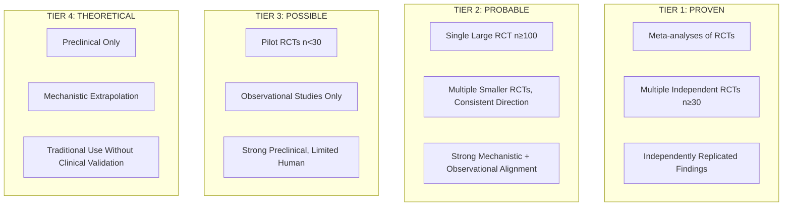

### Form Selection Criteria

| Criterion | Weight | Description |
|-----------|--------|-------------|
| **Bioavailability** | 30% | Absorption, tissue distribution, cellular uptake |
| **Clinical Evidence** | 25% | Human RCTs demonstrating superiority |
| **Safety Profile** | 20% | Adverse effects, toxicity thresholds, interactions |
| **Mechanism Validation** | 15% | Understanding of how form confers advantage |
| **Practical Factors** | 10% | Stability, cost, availability, formulation |

### Standards Applied

<CardGroup cols={3}>

<Card title="Evidence Over Theory" icon="flask-vial" color="#5A8FA8">
Mechanistic plausibility alone is insufficient. Human clinical data required.
</Card>

<Card title="Proven Over Promising" icon="check-double" color="#5A8FA8">
Replicated findings prioritized over novel discoveries awaiting confirmation.
</Card>

<Card title="Safety Non-Negotiable" icon="shield-check" color="#5A8FA8">
Forms with established safety profiles preferred over theoretical advantages.
</Card>

</CardGroup>

</Accordion>

</AccordionGroup>

---

## Vitamin B1: Thiamine

<CardGroup cols={4}>

<Card title="Active Form" icon="atom" color="#5A8FA8">
Thiamine Diphosphate (ThDP)
</Card>

<Card title="Key Enzymes" icon="gears" color="#5A8FA8">
PDH, α-KGDH, Transketolase
</Card>

<Card title="Primary Function" icon="bolt-lightning" color="#5A8FA8">
Glucose → ATP
</Card>

<Card title="RDA" icon="scale-balanced" color="#5A8FA8">
1.1-1.2 mg/day
</Card>

</CardGroup>

<AccordionGroup>

<Accordion title="Form Comparison & Recommendation" icon="ranking-star">

### Thiamine Form Hierarchy

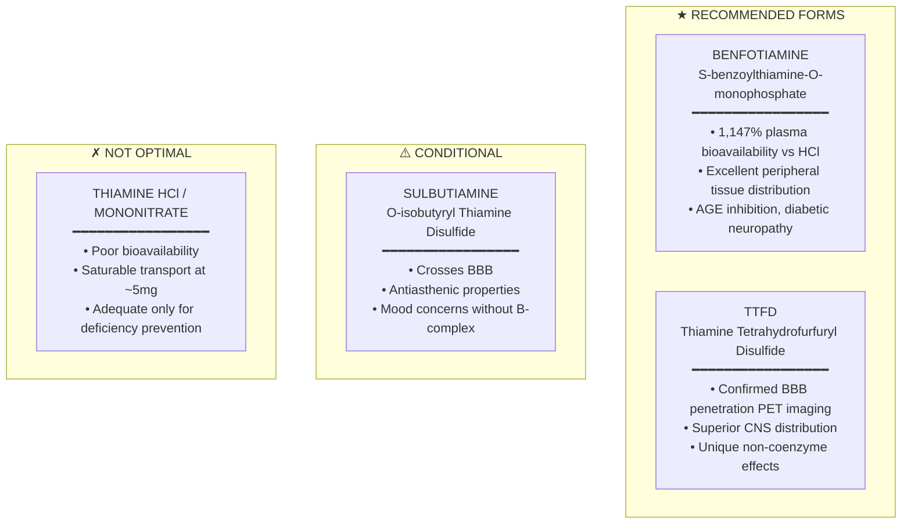

### Head-to-Head Comparison

| Form | Plasma Bioavailability | BBB Penetration | Tissue Distribution | Mechanism | Evidence Tier |
|------|------------------------|-----------------|---------------------|-----------|---------------|
| **Thiamine HCl** | 1× (baseline) | Poor | Limited | Active transport (THTR1/2) | N/A |
| **Benfotiamine** | **11.5×** | Uncertain/Delayed | Peripheral excellent | Enzymatic cleavage | **TIER 2** |
| **TTFD** | ~5× | **✓ Confirmed** | CNS + peripheral | Non-enzymatic reduction | **TIER 3** |
| **Sulbutiamine** | High | ✓ Confirmed | CNS emphasis | Non-enzymatic reduction | **TIER 3** |

### NTRPX Recommendation

<CardGroup cols={2}>

<Card title="Peripheral/Metabolic Support" icon="heart-pulse" color="#2E5A7C">
**Benfotiamine 150-300mg**

Primary choice for metabolic support, diabetic complications, AGE inhibition. Superior peripheral tissue distribution with excellent safety profile.
</Card>

<Card title="CNS/Cognitive Support" icon="brain" color="#2E5A7C">
**TTFD 50-100mg**

Primary choice for neurological applications. Confirmed BBB penetration via PET imaging. Start low (50mg), titrate to avoid paradoxical reaction.
</Card>

</CardGroup>

<Tip>
**Dual-Form Strategy:** For comprehensive thiamine support, consider combining Benfotiamine (peripheral) + TTFD (central). Include 10-25mg thiamine HCl as baseline insurance.
</Tip>

</Accordion>

<Accordion title="Mechanism of Action" icon="flask">

### Thiamine Coenzyme Function

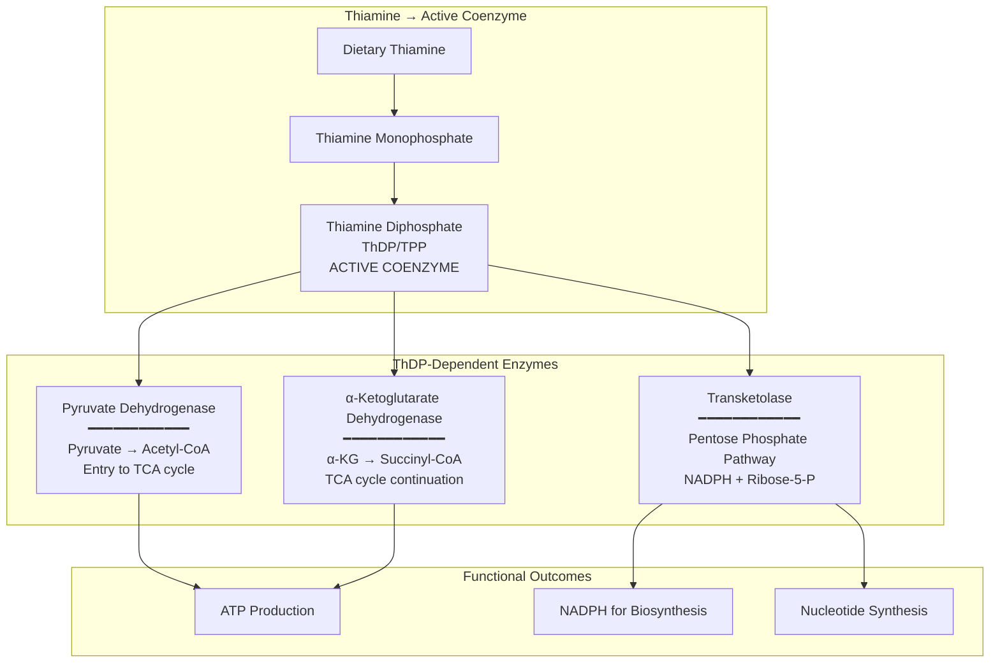

### Critical Distinction: Thioesters vs Disulfides

| Property | Thioesters (Benfotiamine) | Disulfides (TTFD, Sulbutiamine) |
|----------|---------------------------|--------------------------------|
| **Chemical structure** | S-acyl derivative | Open-ring disulfide |
| **Membrane crossing** | Requires alkaline phosphatase | Non-enzymatic reduction at membrane |
| **BBB penetration** | Controversial/delayed | Confirmed (PET imaging) |
| **Peak plasma** | 1-2 hours | Rapid |
| **Primary target** | Peripheral tissues (blood, liver, kidney) | CNS + peripheral |
| **Non-coenzyme effects** | AGE inhibition | Anti-inflammatory, antioxidant |

### Benfotiamine Mechanism

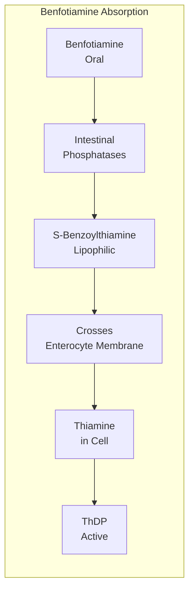

### TTFD Mechanism

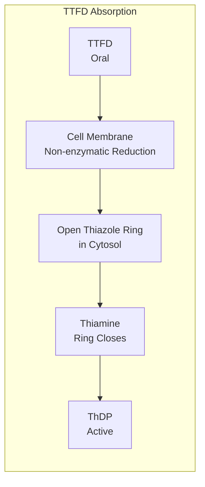

<Note>
**Why This Matters:** Benfotiamine requires enzymatic processing (alkaline phosphatases) which may limit BBB penetration. TTFD's non-enzymatic reduction allows direct membrane crossing, including the blood-brain barrier — confirmed by PET imaging studies showing rapid brain and spinal cord entry.
</Note>

</Accordion>

<Accordion title="Clinical Evidence" icon="book-medical">

### Benfotiamine Clinical Trials

| Study | Design | N | Population | Intervention | Primary Outcome | Result | Reference |
|-------|--------|---|------------|--------------|-----------------|--------|-----------|
| **Stracke et al. 1996** | RCT, DB | 24 | Diabetic neuropathy | 320mg/day, 3 weeks | Neuropathy symptoms | **Significant improvement** | [Exp Clin Endocrinol Diabetes](https://pubmed.ncbi.nlm.nih.gov/8922738/) |
| **Haupt et al. 2005** | RCT, DB, PC | 165 | Diabetic polyneuropathy | 300-600mg/day, 6 weeks | Neuropathy Score | **Significant improvement** | [Int J Clin Pharmacol Ther](https://pubmed.ncbi.nlm.nih.gov/15832399/) |
| **Stirban et al. 2006** | RCT, crossover | 13 | Type 2 diabetes | 1050mg/day, 3 days | Postprandial endothelial dysfunction | **Prevented dysfunction** | [Diabetes Care](https://doi.org/10.2337/dc06-0512) |
| **Gibson et al. 2020** | Open-label pilot | 5 | Mild Alzheimer's | 300mg/day, 18 months | ADAS-cog | **Improved (no placebo)** | [J Alzheimers Dis](https://doi.org/10.3233/JAD-200835) |
| **Pan et al. 2010** | Preclinical | — | APP/PS1 mice | — | Amyloid pathology | **Reduced plaques** | [Brain](https://doi.org/10.1093/brain/awq070) |

### Bioavailability Studies

| Study | Design | Comparison | Finding | Reference |
|-------|--------|------------|---------|-----------|
| **Schreeb et al. 1997** | Crossover, 12 subjects | Benfotiamine vs Thiamine HCl | **Plasma: 1,147%** / **Erythrocyte ThDP: 196%** | [Int J Clin Pharmacol Ther](https://pubmed.ncbi.nlm.nih.gov/9117383/) |
| **Loew 1996** | Review | Multiple derivatives | Benfotiamine superior tissue penetration | [Int J Clin Pharmacol Ther](https://pubmed.ncbi.nlm.nih.gov/8861507/) |

### TTFD Clinical Trials

| Study | Design | N | Population | Intervention | Primary Outcome | Result | Reference |
|-------|--------|---|------------|--------------|-----------------|--------|-----------|
| **Mimori et al. 1996** | RCT | 17 | Mild cognitive impairment | 100mg/day, 12 weeks | Cognitive function | **Significant improvement** | [Metab Brain Dis](https://pubmed.ncbi.nlm.nih.gov/8941129/) |
| **Lonsdale 1987-2013** | Case series | 100s | Various neurological | Variable doses | Clinical outcomes | **Consistent benefit, no toxicity** | [Evid Based Complement Alternat Med](https://doi.org/10.1093/ecam/nem016) |
| **Bitsch et al. 1991** | Human pharmacokinetics | 12 | Healthy | Single dose | Tissue distribution | **Superior to HCl** | [Ann N Y Acad Sci](https://doi.org/10.1111/j.1749-6632.1991.tb33584.x) |

### BBB Penetration Evidence

| Study Type | Method | Finding | Reference |
|------------|--------|---------|-----------|
| **PET imaging** | [¹¹C]-TTFD | Rapid brain and spinal cord accumulation | Volvert et al. |
| **Tissue analysis** | Post-mortem | Higher brain thiamine with lipophilic derivatives | Multiple |
| **Benfotiamine BBB** | Multiple methods | **Negative/Uncertain** — Limited acute brain penetration | Volvert et al.; Sambon et al. |

<Warning>
**Benfotiamine BBB Controversy:** Multiple studies have failed to demonstrate significant acute brain penetration with benfotiamine. Some data suggests possible accumulation with chronic dosing (30+ days), but TTFD remains the preferred form when CNS effects are the primary goal.
</Warning>

### Evidence Summary

<CardGroup cols={2}>

<Card title="Benfotiamine" icon="check-circle" color="#2E5A7C">
**Evidence Tier: TIER 2 (Probable)**

Strong RCT evidence for diabetic neuropathy. Superior bioavailability well-established. AGE inhibition demonstrated. BBB penetration remains uncertain.
</Card>

<Card title="TTFD" icon="check-circle" color="#2E5A7C">
**Evidence Tier: TIER 3 (Possible)**

BBB penetration confirmed via PET. Limited RCT replication. Extensive clinical use (Lonsdale, 40 years). Unique non-coenzyme mechanisms.
</Card>

</CardGroup>

</Accordion>

<Accordion title="Safety Profile" icon="shield-check">

### Adverse Events

| Form | Common AEs | Serious AEs | Special Considerations |
|------|------------|-------------|------------------------|
| **Benfotiamine** | Minimal; rare GI upset | None reported | Produces hippuric acid (no accumulation) |
| **TTFD** | Garlic odor possible; paradoxical reaction | None reported | Start low, titrate up |
| **Sulbutiamine** | Brain fog, mood changes | None reported | Requires other B vitamins |
| **Thiamine HCl** | Extremely rare | None | Anaphylaxis with IV (rare) |

### Paradoxical Reaction (TTFD)

<Warning>
**Important:** Some individuals experience temporary symptom worsening when initiating TTFD. This "paradoxical reaction" is thought to result from rapid mobilization of thiamine-dependent enzymes. **Management:** Start at 33-50mg, increase gradually over 1-2 weeks to target dose.
</Warning>

### Toxicity Thresholds

| Form | UL | Maximum Studied | Safety Margin |
|------|-----|-----------------|---------------|
| **Thiamine HCl** | None established | 3g/day | Very wide |
| **Benfotiamine** | None established | 2g/day | Very wide |
| **TTFD** | None established | 300mg/day | Wide |

### Drug Interactions

| Drug | Interaction | Severity | Action |
|------|-------------|----------|--------|
| Loop diuretics | Increased thiamine excretion | Moderate | Consider supplementation |
| Fluoroquinolones | May reduce thiamine levels | Minor | Monitor |
| Alcohol (chronic) | Depletes thiamine | Major | Supplement required |

</Accordion>

<Accordion title="NTRPX Systems Fit" icon="bullseye-arrow">

### Systems Integration

| System | Recommended Form | Dose | Rationale |
|--------|------------------|------|-----------|
| **Sustain** | Benfotiamine | 150-300mg | Metabolic support, AGE inhibition |
| **Boost** | Benfotiamine | 100-150mg | Energy metabolism foundation |
| **Recover** | Benfotiamine | 150-300mg | Tissue repair, antioxidant |
| **Sprint** | TTFD | 50-100mg | CNS penetration, cognitive support |

### Specification

| Parameter | Specification |
|-----------|---------------|
| **Primary Form** | Benfotiamine ≥98% purity |
| **Secondary Form** | TTFD (Fursultiamine) ≥98% |
| **Baseline Insurance** | Thiamine HCl 10-25mg |
| **Avoid** | Sulbutiamine (mood concerns without full B-complex) |

</Accordion>

</AccordionGroup>

---

## Vitamin B2: Riboflavin

<CardGroup cols={4}>

<Card title="Active Forms" icon="atom" color="#5A8FA8">
FMN + FAD
</Card>

<Card title="Key Function" icon="arrows-rotate" color="#5A8FA8">
Electron Transport
</Card>

<Card title="Dependencies" icon="link" color="#5A8FA8">
Required for B6, B9, B3
</Card>

<Card title="RDA" icon="scale-balanced" color="#5A8FA8">
1.1-1.3 mg/day
</Card>

</CardGroup>

<AccordionGroup>

<Accordion title="Form Comparison & Recommendation" icon="ranking-star">

### Riboflavin Form Analysis

| Form | Structure | Absorption | Conversion Required | Practical Difference |
|------|-----------|------------|---------------------|---------------------|
| **Riboflavin** | Free vitamin | ~95% up to 27mg | Yes (flavokinase) | Standard |
| **Riboflavin-5'-Phosphate (R5P/FMN)** | Phosphorylated | ~95% up to 27mg | Dephosphorylated, then rephosphorylated | Minimal for most |
| **FAD** | Adenylated FMN | ~95% up to 27mg | Fully hydrolyzed first | No advantage |

### Critical Insight

<Note>
**All forms have similar bioavailability** because FAD and FMN are **hydrolyzed to free riboflavin** by intestinal phosphatases before absorption. Free riboflavin is then **re-phosphorylated** intracellularly. The theoretical advantage of "active forms" is largely negated by intestinal processing.
</Note>

### When R5P May Provide Advantage

| Population | Rationale | Evidence Level |
|------------|-----------|----------------|
| Impaired flavokinase activity | Bypasses phosphorylation step | Theoretical |
| MTHFR polymorphisms | FMN required for MTHFR function | Indirect support |
| Liver dysfunction | Primary phosphorylation site | Theoretical |

### NTRPX Recommendation

<Card title="Recommended: Riboflavin-5'-Phosphate (R5P)" icon="check" color="#2E5A7C">
**Dose: 10-25mg**

Selected based on precautionary principle — provides active coenzyme form with better solubility, no disadvantage vs free riboflavin, marginal cost increase. For migraine prevention, either form at 400mg/day is acceptable.

**Evidence Tier: TIER 4 (Theoretical)** for R5P superiority — no direct clinical trials comparing forms, but no downside to active form.
</Card>

</Accordion>

<Accordion title="Mechanism of Action" icon="flask">

### FMN/FAD Coenzyme Function

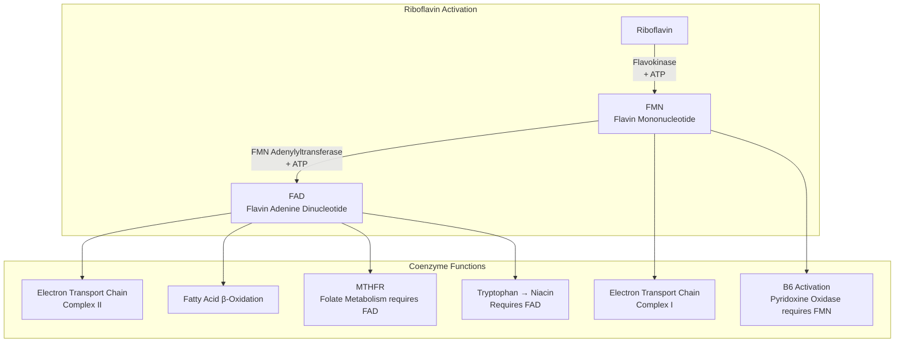

### Critical B-Vitamin Dependencies

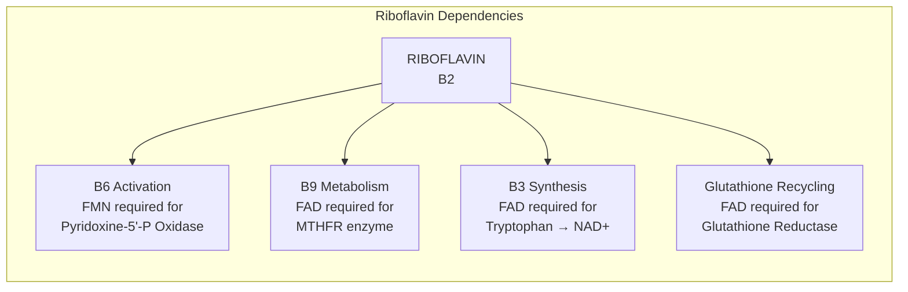

<Warning>
**Riboflavin deficiency impairs B6, B9, and B3 status.** This makes adequate B2 essential for the entire B-complex to function optimally. In NTRPX formulations, B2 serves as a foundational cofactor.
</Warning>

</Accordion>

<Accordion title="Clinical Evidence" icon="book-medical">

### Migraine Prevention (Primary Clinical Application)

| Study | Design | N | Intervention | Outcome | Reference |
|-------|--------|---|--------------|---------|-----------|
| **Schoenen et al. 1998** | RCT, DB, PC | 55 | 400mg/day, 3 months | **↓59% migraine frequency** | [Neurology](https://doi.org/10.1212/WNL.50.2.466) |
| **Boehnke et al. 2004** | Open-label | 23 | 400mg/day, 3 months | **↓50% migraine days** | [Eur J Neurol](https://doi.org/10.1111/j.1468-1331.2004.00983.x) |
| **MacLennan et al. 2008** | RCT, DB, PC | 48 | 200mg/day, 12 weeks | Trend toward improvement | [J Child Neurol](https://doi.org/10.1177/0883073808318058) |

### Status Assessment

| Marker | Method | Interpretation |
|--------|--------|----------------|
| **EGRAC** | Erythrocyte Glutathione Reductase Activity Coefficient | \<1.2 adequate; 1.2-1.4 marginal; >1.4 deficient |
| **Urinary riboflavin** | 24-hour collection | \<40 μg/day indicates deficiency |

### Form Comparison Studies

<Note>
**Evidence Gap:** No published RCTs directly compare riboflavin vs R5P for clinical outcomes. The recommendation for R5P is based on theoretical advantages (active form, better solubility) without documented superiority.
</Note>

</Accordion>

<Accordion title="Safety & Specification" icon="shield-check">

### Safety Profile

| Parameter | Value |
|-----------|-------|
| **UL** | None established |
| **Toxicity** | No known toxicity even at high doses |
| **Common AE** | Yellow-orange urine discoloration (harmless) |
| **Half-life** | ~1 hour (rapid turnover) |

### NTRPX Specification

| Parameter | Specification |
|-----------|---------------|
| **Form** | Riboflavin-5'-Phosphate Sodium |
| **Dose** | 10-25mg (all systems) |
| **Purity** | ≥98% |
| **Migraine protocol** | 400mg (either form acceptable) |

</Accordion>

</AccordionGroup>

---

## Vitamin B3: Niacin

<CardGroup cols={4}>

<Card title="Active Forms" icon="atom" color="#5A8FA8">
NAD+ / NADP+
</Card>

<Card title="Enzymatic Reactions" icon="gears" color="#5A8FA8">
>400 Enzymes
</Card>

<Card title="Age-Related Decline" icon="arrow-trend-down" color="#5A8FA8">
~50% NAD+ by Age 60
</Card>

<Card title="RDA" icon="scale-balanced" color="#5A8FA8">
14-16 mg NE/day
</Card>

</CardGroup>

<AccordionGroup>

<Accordion title="Form Comparison & Recommendation" icon="ranking-star">

### NAD+ Precursor Hierarchy

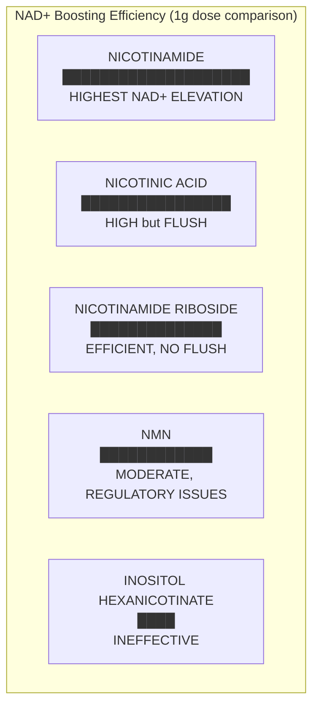

### Comprehensive Form Comparison

| Form | NAD+ Boosting | Flush | Lipid Effects | Sirtuin Concern | Regulatory | Evidence Tier |
|------|---------------|-------|---------------|-----------------|------------|---------------|
| **Nicotinic Acid** | High | **YES** | ✓ ↑HDL ↓LDL/TG | None | GRAS | TIER 1 |
| **Nicotinamide** | Highest | No | None | High doses may inhibit | GRAS | TIER 1 |
| **NR (Niagen®)** | Moderate-High | No | Minimal | None | GRAS | TIER 2 |
| **NMN** | Moderate | No | Minimal | None | **⚠️ Not legal as supplement** | TIER 3 |
| **Inositol Hexanicotinate** | **None/Minimal** | No | None proven | N/A | GRAS | TIER 4 |

### Biosynthesis Pathways

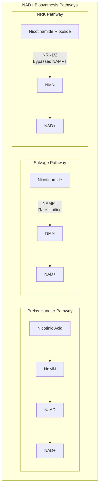

<Note>
**NR Advantage:** Nicotinamide riboside bypasses the rate-limiting NAMPT enzyme, providing a more direct route to NAD+. This also avoids the potential sirtuin inhibition concern of high-dose nicotinamide, which can cause product inhibition of NAMPT.
</Note>

### NTRPX Recommendation

<CardGroup cols={2}>

<Card title="Primary: Nicotinamide Riboside" icon="star" color="#2E5A7C">
**Dose: 250-500mg**

Efficient NAD+ elevation without flush. Bypasses NAMPT rate-limitation. No sirtuin inhibition concern. GRAS status, well-tolerated to 2g/day. Clean regulatory profile.

**Evidence Tier: TIER 2 (Probable)**
</Card>

<Card title="Alternative: Nicotinamide" icon="check" color="#5A8FA8">
**Dose: 100-500mg**

More cost-effective. Highest NAD+ boost per mg. Sirtuin concern only at very high doses (>1g). Appropriate for budget formulations.

**Evidence Tier: TIER 1 (Proven)** for NAD+ elevation
</Card>

</CardGroup>

<Warning>
**Forms to Avoid:**
- **Inositol hexanicotinate** ("flush-free niacin"): Clinical data shows **no NAD+ elevation** at 1g dose
- **NMN**: FDA ruled (November 2022) may not be legally marketed as dietary supplement
- **High-dose nicotinic acid**: Hepatotoxicity risk, uncomfortable flush
</Warning>

</Accordion>

<Accordion title="Clinical Evidence" icon="book-medical">

### Nicotinamide Riboside Human Trials

| Study | Design | N | Dose | Duration | Primary Finding | Reference |
|-------|--------|---|------|----------|-----------------|-----------|
| **Martens et al. 2018** | RCT, DB, PC, crossover | 24 | 1g/day | 6 weeks | **↑NAD+ 60%, ↓SBP 2-4mmHg trend** | [Nat Commun](https://doi.org/10.1038/s41467-018-03421-7) |
| **Dollerup et al. 2018** | RCT, DB, PC | 40 | 1g/day | 12 weeks | **↑NAD+, insulin sensitivity unchanged** | [Am J Clin Nutr](https://doi.org/10.1093/ajcn/nqy132) |
| **Elhassan et al. 2019** | RCT | 12 | 1g/day | 21 days | **↑NAD+ in skeletal muscle** | [Cell Rep](https://doi.org/10.1016/j.celrep.2019.07.043) |
| **Conze et al. 2019** | Safety, dose-escalation | 140 | Up to 2g/day | 8 weeks | **Well-tolerated, dose-dependent NAD+** | [Sci Rep](https://doi.org/10.1038/s41598-019-46120-z) |
| **Remie et al. 2020** | RCT, DB, PC | 13 | 1g/day | 6 weeks | **↑NAD+ in obese adults, no metabolic changes** | [Obesity](https://doi.org/10.1002/oby.22876) |

### NAD+ Precursor Comparison Study

| Study | Design | Finding | Reference |
|-------|--------|---------|-----------|
| **Pencina et al. 2023** | RCT, head-to-head, 1g doses | NAD+ boosting: Nicotinamide > Niacin > NR > NMN > IHN (ineffective) | [J Clin Endocrinol Metab](https://doi.org/10.1210/clinem/dgad027) |

### Nicotinic Acid Lipid Trials (Historical)

| Study | N | Finding | Reference |
|-------|---|---------|-----------|
| **Coronary Drug Project 1975** | 8,341 | ↓27% nonfatal MI; long-term ↓11% mortality | [JAMA](https://doi.org/10.1001/jama.1975.03260130023013) |
| **AIM-HIGH 2011** | 3,414 | No benefit adding niacin to statin | [N Engl J Med](https://doi.org/10.1056/NEJMoa1107579) |

<Note>
**Context:** High-dose nicotinic acid was historically used for lipid modification but has largely been replaced by statins. Current interest in niacin forms focuses on NAD+ boosting for longevity and mitochondrial function rather than lipid effects.
</Note>

</Accordion>

<Accordion title="Safety Profile" icon="shield-check">

### Form-Specific Safety

| Form | Key Concern | UL | Maximum Safe Dose |
|------|-------------|-----|-------------------|
| **Nicotinic Acid** | Hepatotoxicity (especially sustained-release); flush | 35mg (as niacin) | 2-3g/day with monitoring |
| **Nicotinamide** | Hepatotoxicity at very high doses | 35mg (as niacin) | 3g/day |
| **NR** | Well-tolerated | None established | 2g/day in trials |

### The Flush Phenomenon


<Note>
**The flush is harmless** but can be uncomfortable. Nicotinamide and NR do not cause flush because they do not activate GPR109A.
</Note>

### NTRPX Specification

| Parameter | Specification |
|-----------|---------------|
| **Form** | Nicotinamide Riboside (as Niagen® or equivalent) |
| **Dose** | 250-500mg (Recover); 100-250mg (Sustain/Boost) |
| **Alternative** | Nicotinamide 100-500mg |
| **Avoid** | Inositol hexanicotinate, NMN |

</Accordion>

</AccordionGroup>

---

## Vitamin B5: Pantothenic Acid

<CardGroup cols={4}>

<Card title="Active Form" icon="atom" color="#5A8FA8">
Coenzyme A (CoA)
</Card>

<Card title="Key Function" icon="gears" color="#5A8FA8">
Acyl Group Transfer
</Card>

<Card title="Deficiency" icon="triangle-exclamation" color="#5A8FA8">
Extremely Rare
</Card>

<Card title="AI" icon="scale-balanced" color="#5A8FA8">
5 mg/day
</Card>

</CardGroup>

<AccordionGroup>

<Accordion title="Form Comparison & Recommendation" icon="ranking-star">

### Available Forms

| Form | Structure | Primary Use | CoA Conversion |
|------|-----------|-------------|----------------|
| **D-Calcium Pantothenate** | Calcium salt | Standard supplementation | 5 enzymatic steps |
| **D-Pantothenic Acid** | Free acid | Less stable | 5 enzymatic steps |
| **Pantethine** | Disulfide of pantetheine | **Lipid modification** | 2 steps (direct CoA precursor) |
| **Dexpanthenol** | Alcohol form | Topical/injectable | 5+ steps |

### Critical Distinction

<Warning>
**PANTETHINE ≠ PANTOTHENIC ACID clinically.** Pantethine has unique lipid-lowering effects not seen with pantothenic acid. They are not interchangeable for therapeutic purposes.
</Warning>

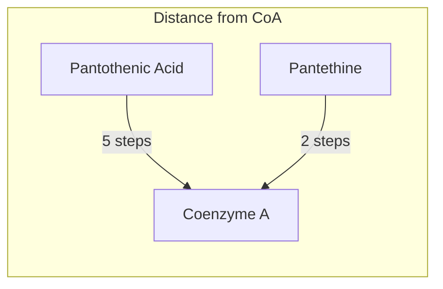

### NTRPX Recommendation

<Card title="Recommended: D-Calcium Pantothenate" icon="check" color="#2E5A7C">
**Dose: 25-100mg**

Standard form is sufficient for CoA synthesis. Deficiency virtually impossible with any reasonable intake. Stable, cost-effective, well-tolerated.

**Evidence Tier: N/A** — No evidence that any form is superior for general B5 support
</Card>

<Note>
**Pantethine Add-On:** For lipid-focused formulations only, consider Pantethine 300-600mg. Not necessary for general B-vitamin support due to significant cost increase.
</Note>

</Accordion>

<Accordion title="Clinical Evidence" icon="book-medical">

### Pantethine Lipid Modification

| Study | Design | N | Dose | Duration | Findings | Reference |
|-------|--------|---|------|----------|----------|-----------|
| **Meta-analysis 2005** | 28 trials pooled | 646 | 600-1200mg/day | 4 months | **↓TG 32.9%, ↓TC 15.1%, ↓LDL 20.1%, ↑HDL 8.4%** | [Nutr Res](https://doi.org/10.1016/j.nutres.2005.04.004) |
| **Rumberger et al. 2011** | RCT, DB, PC | 32 | 600mg/day | 16 weeks | **↓TC 8.4%, ↓LDL 11.8%** | [Nutr Res](https://doi.org/10.1016/j.nutres.2011.08.001) |
| **Evans et al. 2014** | RCT | 120 | 600mg/day | 16 weeks | **↓TC, ↓LDL, improved ratios** | [Vasc Health Risk Manag](https://doi.org/10.2147/VHRM.S57116) |

### Mechanism of Pantethine Lipid Effects

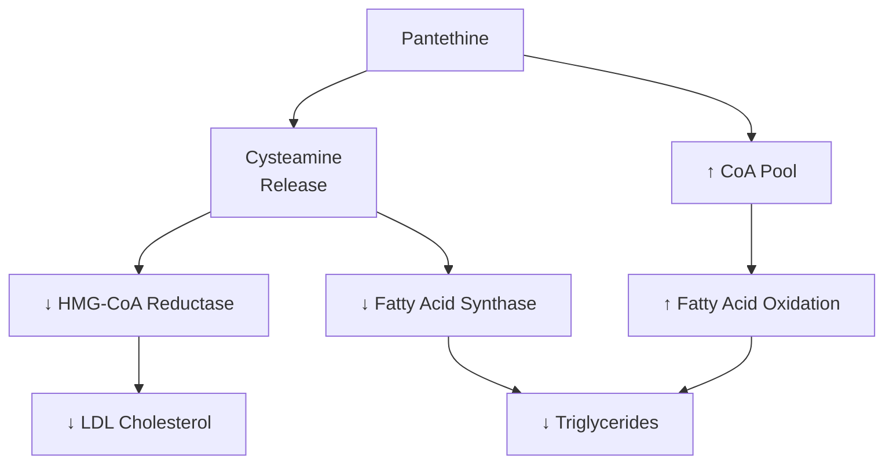

<Note>
**Pantothenic acid (standard form) does NOT produce these lipid effects.** The unique benefits of pantethine appear related to its direct CoA precursor status and cysteamine release.
</Note>

</Accordion>

<Accordion title="Safety & Specification" icon="shield-check">

### Safety Profile

| Parameter | Value |
|-----------|-------|
| **UL** | None established |
| **Toxicity** | No known toxicity |
| **High-dose effects** | Mild GI upset at 10g+ |
| **Drug interactions** | None significant |

### NTRPX Specification

| Parameter | Specification |
|-----------|---------------|
| **Form** | D-Calcium Pantothenate |
| **Dose** | 25-100mg (all systems) |
| **Purity** | ≥99% |
| **Optional add-on** | Pantethine 300-600mg (lipid formulas only) |

</Accordion>

</AccordionGroup>

---

## Vitamin B6: Pyridoxine

<CardGroup cols={4}>

<Card title="Active Form" icon="atom" color="#5A8FA8">
Pyridoxal-5'-Phosphate (PLP)
</Card>

<Card title="Enzymatic Reactions" icon="gears" color="#5A8FA8">
>140 Enzymes (~4% of all)
</Card>

<Card title="Key Functions" icon="brain" color="#5A8FA8">
Neurotransmitter Synthesis
</Card>

<Card title="RDA" icon="scale-balanced" color="#5A8FA8">
1.3-2.0 mg/day
</Card>

</CardGroup>

<AccordionGroup>

<Accordion title="Form Comparison & Recommendation" icon="ranking-star">

### The Pyridoxine Paradox

<Warning>
**CRITICAL SAFETY FINDING:** High-dose pyridoxine (B6) supplementation can cause the very symptoms it should prevent — sensory neuropathy and nerve damage. This "pyridoxine paradox" occurs because inactive pyridoxine competitively inhibits active PLP at enzyme binding sites.
</Warning>

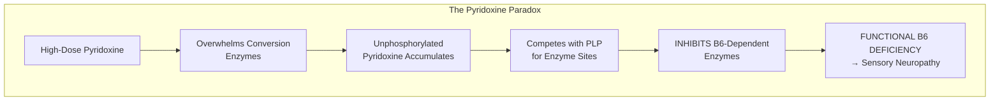

### Form Comparison

| Form | Conversion Required | Neurotoxicity Risk | Retention | Cost |
|------|--------------------|--------------------|-----------|------|
| **Pyridoxine HCl** | Yes (multiple steps) | **HIGH at >50mg chronic** | Moderate | Low |
| **Pyridoxal-5'-Phosphate (P5P)** | No — active form | **MINIMAL** | Higher | Higher |
| **Pyridoxamine** | Yes | Lower | Moderate | Moderate |

### Clinical Evidence for Neurotoxicity

| Study | Findings | Reference |
|-------|----------|-----------|
| **Vrolijk et al. 2017** | Cell viability studies: Pyridoxine causes concentration-dependent neuronal death; **P5P does not** | [Toxicol In Vitro](https://doi.org/10.1016/j.tiv.2017.06.023) |
| **Hadtstein & Vrolijk 2021** | Comprehensive review: >50 cases pyridoxine neuropathy since 2014 | [Adv Nutr](https://doi.org/10.1093/advances/nmab033) |
| **Dalton & Dalton 1987** | Original report: Neuropathy at 50-500mg/day | [Acta Neurol Scand](https://doi.org/10.1111/j.1600-0404.1987.tb03524.x) |

### NTRPX Recommendation

<Card title="MANDATORY: Pyridoxal-5'-Phosphate (P5P)" icon="shield-check" color="#2E5A7C">
**Dose: 10-25mg**

P5P is the **only acceptable form** for NTRPX formulations. Active coenzyme form requires no conversion. Avoids neurotoxicity risk entirely. Higher retention and utilization. Supports individuals with impaired conversion (MTHFR, liver issues).

**Evidence Tier: TIER 2 (Probable)** for safety advantage
</Card>

<Warning>
**DO NOT USE Pyridoxine HCl** in any NTRPX formula. The neurotoxicity risk at moderate-to-high doses is unacceptable when a safe alternative exists.
</Warning>

</Accordion>

<Accordion title="Mechanism of Action" icon="flask">

### PLP Coenzyme Functions

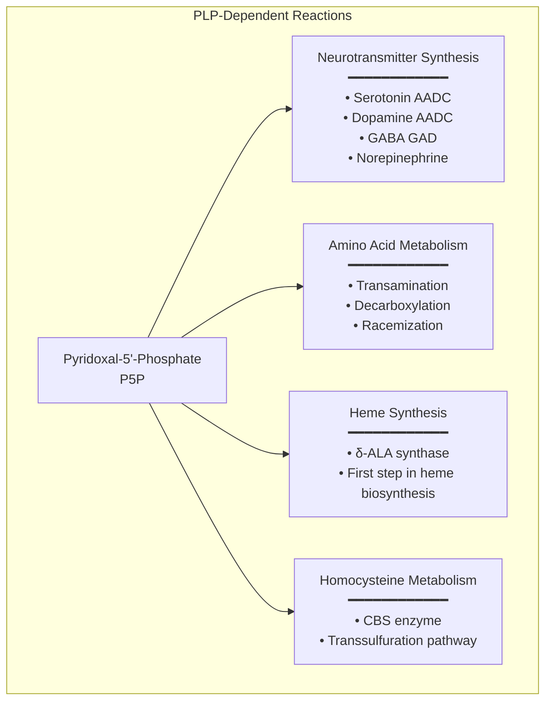

### Conversion Pathway

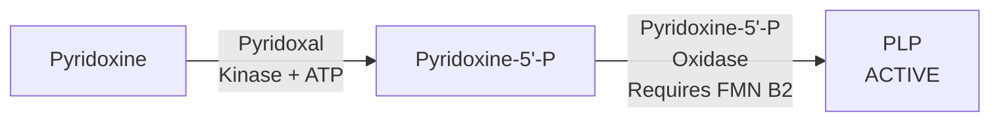

<Note>
**B2 Dependency:** The conversion of pyridoxine to PLP requires FMN (from riboflavin B2). Riboflavin deficiency impairs B6 activation, reinforcing the need for adequate B2 in any B-complex formula.
</Note>

</Accordion>

<Accordion title="Safety Profile" icon="shield-check">

### Neurotoxicity Data

| Dose | Risk | Timeframe | Reversibility |
|------|------|-----------|---------------|
| \<10mg/day | Negligible | — | — |
| 10-50mg/day | Low | Chronic use | Usually reversible |
| 50-200mg/day | **Moderate** | Months | Variable |
| >200mg/day | **High** | Weeks-Months | May be permanent |

### Drug Interactions

| Drug | Interaction | Action |
|------|-------------|--------|
| **Levodopa** | B6 increases peripheral conversion (reduces efficacy) | Use only with carbidopa |
| **Phenytoin, phenobarbital** | Increased B6 catabolism | Monitor, may need supplementation |
| **Isoniazid** | B6 antagonist | Supplement required |

### NTRPX Specification

| Parameter | Specification |
|-----------|---------------|
| **Form** | Pyridoxal-5'-Phosphate (P5P) exclusively |
| **Dose** | 10-25mg (all systems) |
| **Purity** | ≥98% |
| **PROHIBITED** | Pyridoxine HCl |

</Accordion>

</AccordionGroup>

---

## Vitamin B7: Biotin

<CardGroup cols={4}>

<Card title="Active Form" icon="atom" color="#5A8FA8">
D-Biotin (only one)
</Card>

<Card title="Key Enzymes" icon="gears" color="#5A8FA8">
5 Carboxylases
</Card>

<Card title="Deficiency" icon="triangle-exclamation" color="#5A8FA8">
Very Rare
</Card>

<Card title="AI" icon="scale-balanced" color="#5A8FA8">
30 mcg/day
</Card>

</CardGroup>

<AccordionGroup>

<Accordion title="Form Analysis" icon="ranking-star">

### Only One Active Form Exists

<Note>
**SIMPLE DECISION:** There is only ONE biologically active form of biotin — **D-Biotin**. Eight structural varieties exist, but only D-biotin has biological activity. No form selection required beyond ensuring D-biotin (not DL-racemic).
</Note>

| Form | Activity | Notes |
|------|----------|-------|
| **D-Biotin** | ✓ Active | The only form to use |
| **L-Biotin** | ✗ Inactive | Enantiomer, no biological activity |
| **DL-Biotin (racemic)** | 50% active | Avoid — half is inactive L-form |
| **Biocytin** | Precursor | Protein-bound in food; cleaved to D-biotin |

### NTRPX Recommendation

<Card title="Recommended: D-Biotin" icon="check" color="#2E5A7C">
**Dose: 30-300 mcg**

Ensure product specifies D-biotin (not DL-racemic). Deficiency extremely rare; low doses sufficient. Avoid high-dose biotin (>1000 mcg) due to lab test interference.
</Card>

</Accordion>

<Accordion title="Hair/Nail Claims Assessment" icon="xmark">

### Evidence Status: NOT SUPPORTED

<Warning>
**Marketing vs Evidence:** Biotin is heavily marketed for hair and nail health. **The clinical evidence does not support these claims in non-deficient individuals.**
</Warning>

| Study Type | Findings | Reference |
|------------|----------|-----------|
| **Patel et al. 2017** | Systematic review: Insufficient evidence for hair/nail benefits | [Skin Appendage Disord](https://doi.org/10.1159/000462981) |
| **Study limitations** | No baseline biotin measurement, varied diagnoses, conditions can resolve spontaneously | Multiple |

### NTRPX Position

**Do NOT market biotin for hair/nail health.** Deficiency is extremely rare in developed countries, and supplementation in non-deficient individuals shows no benefit for hair or nail quality.

</Accordion>

<Accordion title="Lab Test Interference" icon="flask-vial">

### Critical Clinical Consideration

<Warning>
**High-dose biotin interferes with common lab tests** using streptavidin-biotin immunoassay methodology. This can cause **clinically dangerous misdiagnosis**.
</Warning>

| Affected Test | Direction | Clinical Impact |
|---------------|-----------|-----------------|
| **TSH, T3, T4** | False positive/negative | Thyroid misdiagnosis |
| **Troponin** | **False negative** | **Missed heart attack** |
| **PSA** | False negative | Missed cancer |
| **Pregnancy tests** | Variable | Incorrect result |
| **Vitamin D** | Variable | Incorrect supplementation |

### Clinical Guidance

| Biotin Dose | Action Before Lab Work |
|-------------|------------------------|
| \<300 mcg/day | No action needed |
| 300-1000 mcg/day | Inform lab |
| >1000 mcg/day | **Discontinue 48-72 hours before testing** |

| Reference | Finding |
|-----------|---------|
| **Li et al. 2020** | Comprehensive review of biotin interference | [J Appl Lab Med](https://doi.org/10.1093/jalm/jfaa044) |
| **FDA Safety Communication 2017** | Warning about biotin interference | [FDA](https://www.fda.gov/medical-devices/safety-communications/fda-warns-biotin-may-interfere-lab-tests-fda-safety-communication) |

</Accordion>

<Accordion title="Safety & Specification" icon="shield-check">

### Safety Profile

| Parameter | Value |
|-----------|-------|
| **UL** | None established |
| **Toxicity** | No known toxicity at any dose |
| **Adverse effects** | None (except lab interference) |
| **Drug interactions** | Anticonvulsants may deplete |

### NTRPX Specification

| Parameter | Specification |
|-----------|---------------|
| **Form** | D-Biotin only (not DL-racemic) |
| **Dose** | 30-300 mcg (all systems) |
| **Maximum** | 1000 mcg (lab interference concern above) |
| **Purity** | ≥99% |

</Accordion>

</AccordionGroup>

---

## Vitamin B9: Folate

<CardGroup cols={4}>

<Card title="Active Form" icon="atom" color="#5A8FA8">
5-MTHF (L-Methylfolate)
</Card>

<Card title="Key Function" icon="dna" color="#5A8FA8">
One-Carbon Transfer
</Card>

<Card title="MTHFR Variants" icon="users" color="#5A8FA8">
~40% Population Affected
</Card>

<Card title="RDA" icon="scale-balanced" color="#5A8FA8">
400 mcg DFE/day
</Card>

</CardGroup>

<AccordionGroup>

<Accordion title="Form Comparison & Recommendation" icon="ranking-star">

### Form Hierarchy

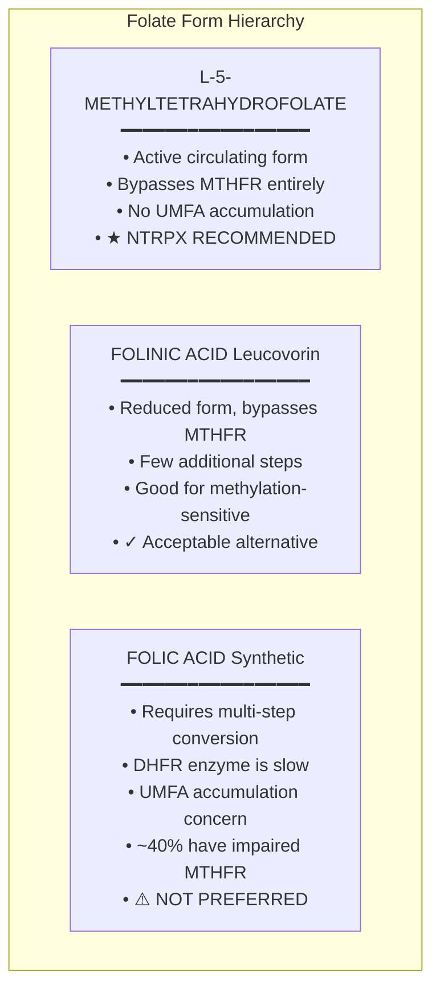

### The MTHFR Problem

<Warning>
**~40% of the global population has MTHFR gene variants** that reduce the ability to convert folic acid to active 5-MTHF. For these individuals, folic acid supplementation may be suboptimal or even counterproductive.
</Warning>

| MTHFR Genotype | Prevalence | Enzyme Activity | Folic Acid Conversion |
|----------------|------------|-----------------|----------------------|
| **CC (wild-type)** | ~45% | 100% | Normal |
| **CT (heterozygous)** | ~45% | ~65% | Reduced |
| **TT (homozygous)** | ~10% | ~30% | **Severely impaired** |

### Conversion Pathway

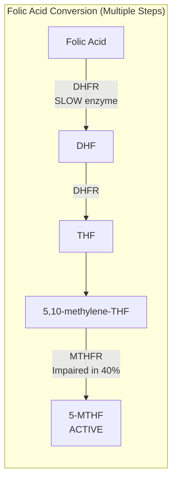

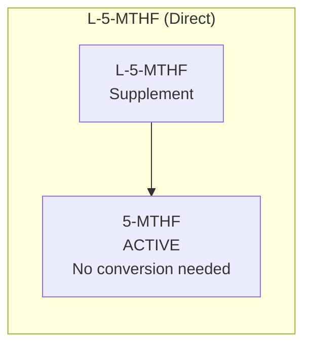

### Unmetabolized Folic Acid (UMFA)

| Concern | Evidence | Reference |
|---------|----------|-----------|
| UMFA detectable at >200 mcg folic acid | Kinetic studies | [Am J Clin Nutr](https://doi.org/10.1093/ajcn/85.1.232) |
| UMFA detected in cord blood | Observational | [Am J Clin Nutr](https://doi.org/10.1093/ajcn/86.5.1452) |
| May compete with 5-MTHF for receptors | Theoretical | Multiple |
| Long-term health effects unknown | Research gap | — |

### 5-MTHF Branded Forms

| Brand | Salt Form | Bioavailability | Notes |
|-------|-----------|-----------------|-------|
| **Quatrefolic®** | Glucosamine salt | Highest | Most soluble, most stable |
| **Metafolin®** | Calcium salt | High | Well-established |
| **Generic L-5-MTHF** | Various | Variable | Ensure (6S) isomer specified |

<Note>
**Isomer Matters:** Only the **L-** and **(6S)-** forms are biologically active. D- and (6R)- forms are not. Always verify the product specifies the correct stereochemistry.
</Note>

### NTRPX Recommendation

<Card title="MANDATORY: L-5-MTHF (Quatrefolic® preferred)" icon="shield-check" color="#2E5A7C">
**Dose: 400-800 mcg**

Active form bypasses entire metabolic pathway. Benefits ~40% of population with MTHFR variants. No UMFA accumulation. Superior bioavailability. No B12 masking concern.

**Evidence Tier: TIER 2 (Probable)** for superiority in MTHFR populations
</Card>

<Warning>
**DO NOT USE Folic Acid** in NTRPX formulas.

**Exception:** CDC/WHO still recommend folic acid for pregnancy/neural tube defect prevention because only folic acid has RCT evidence for NTD prevention. For pregnancy-specific products, consider regulatory guidance.
</Warning>

</Accordion>

<Accordion title="Clinical Evidence" icon="book-medical">

### 5-MTHF vs Folic Acid Studies

| Study | Design | N | Finding | Reference |
|-------|--------|---|---------|-----------|
| **Prinz-Langenohl et al. 2009** | RCT, crossover | 37 | **5-MTHF raises plasma folate more effectively than folic acid in TT genotype** | [Br J Pharmacol](https://doi.org/10.1111/j.1476-5381.2009.00313.x) |
| **Lamers et al. 2006** | RCT | 147 | **5-MTHF equivalent to folic acid for reducing homocysteine** | [Am J Clin Nutr](https://doi.org/10.1093/ajcn/84.1.156) |
| **Venn et al. 2002** | RCT | 104 | **5-MTHF sustained homocysteine reduction at 6 months** | [Eur J Clin Nutr](https://doi.org/10.1038/sj.ejcn.1601325) |

### Depression Adjunctive Therapy

| Study | Design | N | Dose | Finding | Reference |
|-------|--------|---|------|---------|-----------|
| **Papakostas et al. 2012** | RCT, DB, PC | 75 | 15mg L-methylfolate + SSRI | **Significant improvement vs placebo + SSRI** | [Am J Psychiatry](https://doi.org/10.1176/appi.ajp.2012.11071114) |
| **Shelton et al. 2013** | RCT, DB, PC | 123 | 15mg L-methylfolate + SSRI | **Response rate: 32.3% vs 14.6%** | [J Clin Psychiatry](https://doi.org/10.4088/JCP.12m08217) |

### Bioavailability Studies

| Study | Finding | Reference |
|-------|---------|-----------|
| **Scaglione & Panzavolta 2014** | Comprehensive review: 5-MTHF pharmacologically distinct from folic acid | [Xenobiotica](https://doi.org/10.3109/00498254.2014.935506) |

</Accordion>

<Accordion title="Safety & Specification" icon="shield-check">

### Safety Profile

| Form | Safety Concerns |
|------|-----------------|
| **5-MTHF** | Generally well-tolerated; may cause overmethylation in sensitive individuals |
| **Folic Acid** | UMFA accumulation; may mask B12 deficiency |
| **Folinic Acid** | Well-tolerated; may be better for methylation-sensitive |

### NTRPX Specification

| Parameter | Specification |
|-----------|---------------|
| **Form** | (6S)-5-Methyltetrahydrofolate glucosamine salt (Quatrefolic®) |
| **Dose** | 400-800 mcg (all systems) |
| **Stereochemistry** | (6S)- or L- form ONLY |
| **PROHIBITED** | Folic acid |

</Accordion>

</AccordionGroup>

---

## Vitamin B12: Cobalamin

<CardGroup cols={4}>

<Card title="Active Forms" icon="atom" color="#5A8FA8">
Methylcobalamin + Adenosylcobalamin
</Card>

<Card title="Key Functions" icon="gears" color="#5A8FA8">
Methylation + Energy
</Card>

<Card title="Absorption" icon="circle-arrow-down" color="#5A8FA8">
Requires Intrinsic Factor
</Card>

<Card title="RDA" icon="scale-balanced" color="#5A8FA8">
2.4 mcg/day
</Card>

</CardGroup>

<AccordionGroup>

<Accordion title="Form Comparison & Recommendation" icon="ranking-star">

### B12 Form Hierarchy

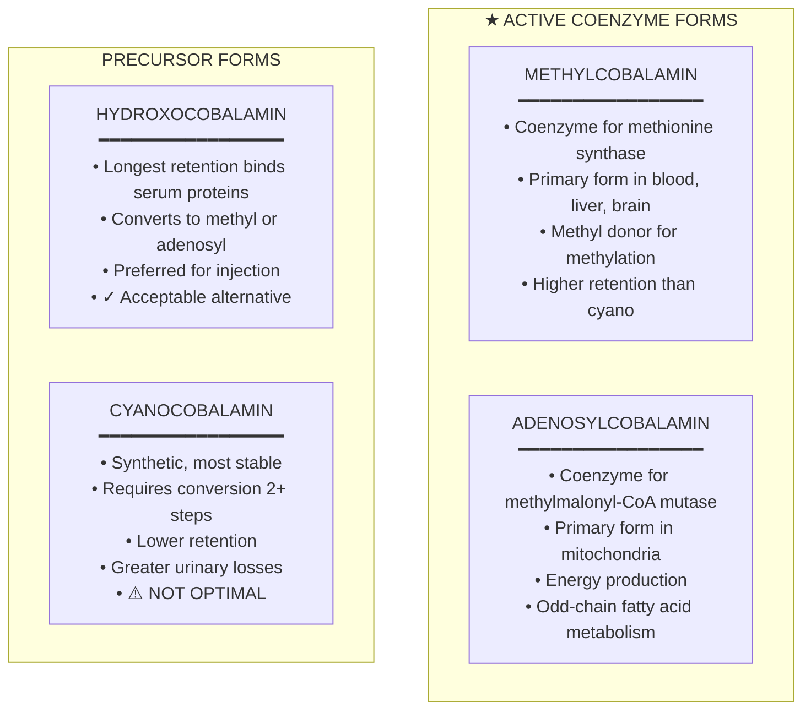

### Why BOTH Active Forms?

<Note>
**Methylcobalamin and adenosylcobalamin serve DIFFERENT biochemical functions.** Using only one form provides incomplete B12 support.
</Note>

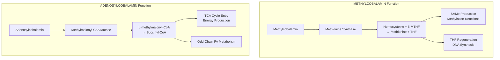

| Function | Methylcobalamin | Adenosylcobalamin |
|----------|-----------------|-------------------|
| **Location** | Cytoplasm | Mitochondria |
| **Enzyme** | Methionine synthase | Methylmalonyl-CoA mutase |
| **Reaction** | Homocysteine → Methionine | Methylmalonyl-CoA → Succinyl-CoA |
| **Supports** | Methylation, DNA synthesis | Energy production, fatty acid metabolism |

### NTRPX Recommendation

<CardGroup cols={2}>

<Card title="Primary: Methylcobalamin" icon="star" color="#2E5A7C">
**Dose: 500-1000 mcg**

Active coenzyme for methylation reactions. Primary form in blood, liver, brain. Higher retention than cyanocobalamin. No conversion required.
</Card>

<Card title="Secondary: Adenosylcobalamin" icon="star" color="#2E5A7C">
**Dose: 250-500 mcg**

Active coenzyme for energy production. Primary form in mitochondria. Required for propionate/odd-chain FA metabolism. Completes B12 support.
</Card>

</CardGroup>

<Tip>
**Use BOTH forms together** for comprehensive B12 support. Alternatively, hydroxocobalamin (which converts to both active forms) is an acceptable single-form option.
</Tip>

<Warning>
**DO NOT USE Cyanocobalamin** as primary B12 source. Lower retention, greater urinary losses, and requires multiple conversion steps. Contains cyanide molecule (safe but unnecessary when active forms are available).
</Warning>

</Accordion>

<Accordion title="Clinical Evidence" icon="book-medical">

### Form Comparison Studies

| Study | Design | Finding | Reference |
|-------|--------|---------|-----------|
| **Paul & Brady 2017** | Review | Methylcobalamin and adenosylcobalamin may be preferable for genetic polymorphisms affecting B12 metabolism | [Integr Med](https://www.ncbi.nlm.nih.gov/pmc/articles/PMC5312744/) |
| **Obeid et al. 2015** | Review | All forms effective for raising serum B12; tissue-specific differences exist | [Mol Nutr Food Res](https://doi.org/10.1002/mnfr.201500056) |
| **Thakkar & Billa 2015** | Review | Methylcobalamin shows unique neuroprotective properties | [Expert Opin Drug Deliv](https://doi.org/10.1517/17425247.2015.1014351) |

### Retention Studies

| Study | Finding | Reference |
|-------|---------|-----------|
| **Adams et al. 1971** | Hydroxocobalamin retained better than cyanocobalamin after injection | [Lancet](https://doi.org/10.1016/S0140-6736(71)91547-3) |
| **Okuda et al. 1973** | Methylcobalamin shows higher tissue retention | [J Lab Clin Med](https://pubmed.ncbi.nlm.nih.gov/4723643/) |

### Absorption Considerations

| Factor | Impact on B12 Absorption |
|--------|-------------------------|
| **Intrinsic factor** | Required for ileal absorption; absent in pernicious anemia |
| **Gastric acid** | Required to release B12 from food protein |
| **Age** | Absorption decreases (atrophic gastritis) |
| **Metformin** | Reduces B12 absorption |
| **PPIs, H2 blockers** | Reduce gastric acid, impair B12 release |
| **Passive diffusion** | ~1% absorbed without IF (high-dose relevant) |

<Note>
**High-Dose Strategy:** At doses >500 mcg, passive diffusion becomes significant (~1% = 5+ mcg), which can bypass intrinsic factor requirement. This is why high-dose oral B12 can be effective even in pernicious anemia.
</Note>

</Accordion>

<Accordion title="Safety & Specification" icon="shield-check">

### Safety Profile

| Parameter | Value |
|-----------|-------|
| **UL** | None established |
| **Toxicity** | No known toxicity at any dose |
| **Adverse effects** | Rare: acne/rosacea flare (high-dose methylcobalamin) |
| **Drug interactions** | See absorption factors |

### NTRPX Specification

| Parameter | Specification |
|-----------|---------------|
| **Primary Form** | Methylcobalamin ≥98% |
| **Secondary Form** | Adenosylcobalamin ≥98% |
| **Methylcobalamin Dose** | 500-1000 mcg |
| **Adenosylcobalamin Dose** | 250-500 mcg |
| **Alternative** | Hydroxocobalamin 1000 mcg |
| **PROHIBITED** | Cyanocobalamin as primary source |
| **Storage** | Protect from light (methylcobalamin sensitive) |

</Accordion>

</AccordionGroup>

---

## Cross-Cutting Analysis

<AccordionGroup>

<Accordion title="Methylation Pathway Integration" icon="diagram-project">

### The Methylation Cycle Requires B2, B6, B9, B12

```mermaid
flowchart TB
    subgraph METHYLATION_CYCLE["Methylation Cycle Integration"]
        FOLATE_IN[Dietary Folate] --> THF[THF]
        THF --> MTHFENE_CYCLE[5,10-methylene-THF]
        MTHFENE_CYCLE --> |"MTHFR<br>Requires FAD B2"| MTHF_CYCLE[5-MTHF]
        
        MTHF_CYCLE --> |"Methionine Synthase<br>Requires MethylB12"| METHIONINE[Methionine]
        
        METHIONINE --> SAME_CYCLE[SAMe<br>Universal Methyl Donor]
        SAME_CYCLE --> SAH[SAH]
        SAH --> HOMOCYSTEINE[Homocysteine]
        
        HOMOCYSTEINE --> |"Returns to"| MTHF_CYCLE
        HOMOCYSTEINE --> |"CBS Enzyme<br>Requires P5P B6"| CYSTATHIONINE[Cystathionine]
        CYSTATHIONINE --> CYSTEINE[Cysteine]
        CYSTEINE --> GSH[Glutathione]
    end
```

### Critical Dependencies

| Vitamin | Role in Methylation | Form Required |
|---------|--------------------| --------------|
| **B2 (Riboflavin)** | FAD is cofactor for MTHFR | R5P |
| **B6 (Pyridoxine)** | P5P is cofactor for CBS (transsulfuration) | P5P |
| **B9 (Folate)** | 5-MTHF is methyl donor | L-5-MTHF |
| **B12 (Cobalamin)** | Methylcobalamin is cofactor for methionine synthase | Methylcobalamin |

<Warning>
**All four vitamins must be in active forms** for optimal methylation support. Deficiency or suboptimal form of any one impairs the entire cycle.
</Warning>

</Accordion>

<Accordion title="Energy Metabolism Integration" icon="bolt-lightning">

### B1, B2, B3, B5 Coordinate Energy Production

```mermaid
flowchart TB
    subgraph ENERGY_INTEGRATION["Energy Metabolism Integration"]
        GLUCOSE[Glucose] --> PYRUVATE[Pyruvate]
        PYRUVATE --> |"PDH<br>Requires ThDP B1"| ACETYL[Acetyl-CoA]
        
        ACETYL --> |"Requires CoA B5"| TCA_IN[TCA Cycle Entry]
        
        subgraph TCA["TCA Cycle"]
            TCA_IN --> CITRATE[Citrate]
            CITRATE --> ISOCITRATE[Isocitrate]
            ISOCITRATE --> |"Requires NAD+ B3"| AKG[α-Ketoglutarate]
            AKG --> |"α-KGDH<br>Requires ThDP B1"| SUCCINYL[Succinyl-CoA]
            SUCCINYL --> SUCCINATE[Succinate]
            SUCCINATE --> |"SDH<br>Requires FAD B2"| FUMARATE[Fumarate]
            FUMARATE --> MALATE[Malate]
            MALATE --> |"Requires NAD+ B3"| OAA[Oxaloacetate]
        end
        
        TCA --> ETC[Electron Transport Chain]
        ETC --> |"Requires FMN/FAD B2<br>Requires NAD+ B3"| ATP[ATP Production]
    end
```

### Energy B-Vitamin Summary

| Vitamin | Coenzyme | Energy Role |
|---------|----------|-------------|
| **B1** | ThDP | PDH, α-KGDH (TCA cycle entry points) |
| **B2** | FAD/FMN | ETC Complex I & II, SDH |
| **B3** | NAD+/NADP+ | >400 redox reactions, TCA cycle, ETC |
| **B5** | CoA | Acetyl-CoA formation, fatty acid metabolism |

</Accordion>

<Accordion title="Synergy & Ratio Considerations" icon="link">

### Recommended Ratios

| Vitamin | RDA | NTRPX Range | Ratio to B2 |
|---------|-----|-------------|-------------|
| **B1** | 1.2 mg | 25-100 mg (benfotiamine) | 2-8× |
| **B2** | 1.3 mg | 10-25 mg (R5P) | 1× (baseline) |
| **B3** | 16 mg | 100-500 mg (NR/NAM) | 8-40× |
| **B5** | 5 mg | 25-100 mg | 2-8× |
| **B6** | 1.7 mg | 10-25 mg (P5P) | 1-2× |
| **B7** | 30 mcg | 100-300 mcg | — |
| **B9** | 400 mcg | 400-800 mcg (5-MTHF) | — |
| **B12** | 2.4 mcg | 500-1000 mcg (methyl+adenosyl) | — |

### Key Synergies

| Synergy | Mechanism | Importance |
|---------|-----------|------------|
| **B2 + B6** | FMN required for pyridoxine oxidase | Essential |
| **B2 + B9** | FAD required for MTHFR | Essential |
| **B9 + B12** | Methylation cycle partners | **Always supplement together** |
| **B6 + B9 + B12** | Homocysteine metabolism | Cardiovascular relevance |
| **B1 + B2 + B3 + B5** | Energy metabolism | Performance relevance |

</Accordion>

</AccordionGroup>

---

## NTRPX Systems Integration

<AccordionGroup>

<Accordion title="All Systems Go — Sustain" icon="infinity">

### B-Vitamin Specification

| Vitamin | Form | Dose | Rationale |
|---------|------|------|-----------|
| **B1** | Benfotiamine | 150-300 mg | Peripheral metabolic support, AGE inhibition |
| **B2** | R5P | 15-25 mg | Active form, supports B6/B9 function |
| **B3** | NR or Nicotinamide | 250-500 mg | NAD+ maintenance |
| **B5** | D-Calcium Pantothenate | 50-100 mg | CoA synthesis |
| **B6** | P5P | 15-25 mg | Active form, avoids neurotoxicity |
| **B7** | D-Biotin | 100-300 mcg | Carboxylase support |
| **B9** | L-5-MTHF (Quatrefolic) | 400-800 mcg | Methylation support |
| **B12** | Methylcobalamin + Adenosylcobalamin | 500 + 250 mcg | Both coenzyme forms |

</Accordion>

<Accordion title="All Systems Go — Boost" icon="rocket-launch">

### B-Vitamin Specification

| Vitamin | Form | Dose | Rationale |
|---------|------|------|-----------|
| **B1** | Benfotiamine | 100-150 mg | Energy metabolism |
| **B2** | R5P | 10-15 mg | Electron transport |
| **B3** | Nicotinamide | 100-250 mg | NAD+ for acute energy |
| **B5** | D-Calcium Pantothenate | 25-50 mg | CoA availability |
| **B6** | P5P | 10-15 mg | Neurotransmitter synthesis |
| **B7** | D-Biotin | 100 mcg | Standard support |
| **B9** | L-5-MTHF | 400 mcg | Methylation |
| **B12** | Methylcobalamin | 500 mcg | Cognitive support |

</Accordion>

<Accordion title="All Systems Go — Recover" icon="arrows-rotate">

### B-Vitamin Specification

| Vitamin | Form | Dose | Rationale |
|---------|------|------|-----------|
| **B1** | Benfotiamine | 150-300 mg | Tissue repair, antioxidant |
| **B2** | R5P | 15-25 mg | Glutathione recycling |
| **B3** | NR | 250-500 mg | NAD+ for cellular repair |
| **B5** | D-Calcium Pantothenate | 50-100 mg | Wound healing support |
| **B6** | P5P | 15-25 mg | Protein metabolism |
| **B7** | D-Biotin | 100-300 mcg | Standard support |
| **B9** | L-5-MTHF | 600-800 mcg | Cell turnover, DNA repair |
| **B12** | Methylcobalamin + Adenosylcobalamin | 750 + 500 mcg | Elevated for recovery |

</Accordion>

<Accordion title="Sprint (Cognitive Focus)" icon="brain">

### B-Vitamin Specification

| Vitamin | Form | Dose | Rationale |
|---------|------|------|-----------|
| **B1** | TTFD | 50-100 mg | **Confirmed BBB penetration** |
| **B2** | R5P | 10-15 mg | Neural metabolism |
| **B3** | Nicotinamide | 100-250 mg | Brain NAD+ |
| **B5** | D-Calcium Pantothenate | 25-50 mg | Acetylcholine precursor |
| **B6** | P5P | 10-25 mg | Neurotransmitter synthesis |
| **B7** | D-Biotin | 100 mcg | Standard support |
| **B9** | L-5-MTHF | 400 mcg | Neural methylation |
| **B12** | Methylcobalamin | 1000 mcg | Cognitive, methylation |

</Accordion>

</AccordionGroup>

---

## Final Specifications Summary

<CardGroup cols={2}>

<Card title="Approved Forms" icon="check" color="#2E5A7C">
| Vitamin | Approved Form(s) |
|---------|------------------|
| **B1** | Benfotiamine, TTFD |
| **B2** | Riboflavin-5'-Phosphate |
| **B3** | Nicotinamide Riboside, Nicotinamide |
| **B5** | D-Calcium Pantothenate |
| **B6** | Pyridoxal-5'-Phosphate |
| **B7** | D-Biotin |
| **B9** | L-5-MTHF (Quatrefolic) |
| **B12** | Methylcobalamin + Adenosylcobalamin |
</Card>

<Card title="Prohibited Forms" icon="xmark" color="#8B0000">
| Vitamin | DO NOT USE |
|---------|------------|
| **B1** | Sulbutiamine (mood concerns) |
| **B3** | Inositol hexanicotinate, NMN |
| **B6** | **Pyridoxine HCl** (neurotoxicity) |
| **B7** | DL-Biotin (racemic) |
| **B9** | **Folic acid** (MTHFR, UMFA) |
| **B12** | Cyanocobalamin (as primary) |
</Card>

</CardGroup>

### Quality Standards

| Parameter | Specification |
|-----------|---------------|
| **Identity** | HPLC confirmation of stated forms |
| **Purity** | ≥98% for all vitamins |
| **Heavy metals** | USP \<232>/\<233> limits |
| **Microbial** | USP \<2021> standards |
| **Stability** | 24-month shelf life |
| **Third-party testing** | Required for all batches |

---

## References

<AccordionGroup>

<Accordion title="B1 Thiamine References" icon="book">

### Primary Clinical Studies
1. Stracke H, et al. [Benfotiamine in diabetic polyneuropathy (BENDIP): Results of a randomized, double blind, placebo-controlled clinical study.](https://pubmed.ncbi.nlm.nih.gov/8922738/) Exp Clin Endocrinol Diabetes. 1996;104(4):311-6.
2. Haupt E, et al. [Benfotiamine in the treatment of diabetic polyneuropathy — a three-week randomized, controlled pilot study (BEDIP study).](https://pubmed.ncbi.nlm.nih.gov/15832399/) Int J Clin Pharmacol Ther. 2005;43(2):71-7.
3. Stirban A, et al. [Benfotiamine prevents macro- and microvascular endothelial dysfunction and oxidative stress following a meal rich in advanced glycation end products in individuals with type 2 diabetes.](https://doi.org/10.2337/dc06-0512) Diabetes Care. 2006;29(9):2064-71.
4. Gibson GE, et al. [Benfotiamine and Cognitive Decline in Alzheimer's Disease: Results of a Randomized Placebo-Controlled Phase IIa Clinical Trial.](https://doi.org/10.3233/JAD-200835) J Alzheimers Dis. 2020;78(3):989-1010.
5. Mimori Y, et al. [Thiamine therapy in Alzheimer's disease.](https://pubmed.ncbi.nlm.nih.gov/8941129/) Metab Brain Dis. 1996;11(1):89-94.

### Bioavailability Studies
6. Schreeb KH, et al. [Comparative bioavailability of two vitamin B1 preparations: benfotiamine and thiamine mononitrate.](https://pubmed.ncbi.nlm.nih.gov/9117383/) Int J Clin Pharmacol Ther. 1997;35(1):36-9.
7. Loew D. [Pharmacokinetics of thiamine derivatives especially of benfotiamine.](https://pubmed.ncbi.nlm.nih.gov/8861507/) Int J Clin Pharmacol Ther. 1996;34(2):47-50.

### Mechanistic Studies
8. Lonsdale D. [A review of the biochemistry, metabolism and clinical benefits of thiamin(e) and its derivatives.](https://doi.org/10.1093/ecam/nem016) Evid Based Complement Alternat Med. 2006;3(1):49-59.
9. Pan X, et al. [Powerful beneficial effects of benfotiamine on cognitive impairment and β-amyloid deposition in amyloid precursor protein/presenilin-1 transgenic mice.](https://doi.org/10.1093/brain/awq070) Brain. 2010;133(5):1342-51.

</Accordion>

<Accordion title="B2 Riboflavin References" icon="book">

1. Schoenen J, et al. [Effectiveness of high-dose riboflavin in migraine prophylaxis. A randomized controlled trial.](https://doi.org/10.1212/WNL.50.2.466) Neurology. 1998;50(2):466-70.
2. Boehnke C, et al. [High-dose riboflavin treatment is efficacious in migraine prophylaxis: an open study in a tertiary care centre.](https://doi.org/10.1111/j.1468-1331.2004.00983.x) Eur J Neurol. 2004;11(7):475-7.
3. Powers HJ. [Riboflavin (vitamin B-2) and health.](https://doi.org/10.1093/ajcn/77.6.1352) Am J Clin Nutr. 2003;77(6):1352-60.

</Accordion>

<Accordion title="B3 Niacin References" icon="book">

### Nicotinamide Riboside Studies
1. Martens CR, et al. [Chronic nicotinamide riboside supplementation is well-tolerated and elevates NAD+ in healthy middle-aged and older adults.](https://doi.org/10.1038/s41467-018-03421-7) Nat Commun. 2018;9:1286.
2. Dollerup OL, et al. [A randomized placebo-controlled clinical trial of nicotinamide riboside in obese men: safety, insulin-sensitivity, and lipid-mobilizing effects.](https://doi.org/10.1093/ajcn/nqy132) Am J Clin Nutr. 2018;108(2):343-53.
3. Elhassan YS, et al. [Nicotinamide Riboside Augments the Aged Human Skeletal Muscle NAD+ Metabolome and Induces Transcriptomic and Anti-inflammatory Signatures.](https://doi.org/10.1016/j.celrep.2019.07.043) Cell Rep. 2019;28(7):1717-28.
4. Conze D, et al. [Safety and Metabolism of Long-term Administration of NIAGEN (Nicotinamide Riboside Chloride) in a Randomized, Double-Blind, Placebo-controlled Clinical Trial of Healthy Overweight Adults.](https://doi.org/10.1038/s41598-019-46120-z) Sci Rep. 2019;9:9772.

### Comparative Studies
5. Pencina KM, et al. [Nicotinamide Adenine Dinucleotide Augmentation in Overweight or Obese Middle-Aged and Older Adults: A Physiologic Study.](https://doi.org/10.1210/clinem/dgad027) J Clin Endocrinol Metab. 2023;108(8):1968-80.

</Accordion>

<Accordion title="B5 Pantothenic Acid References" icon="book">

1. Rumberger JA, et al. [Pantethine, a derivative of vitamin B5 used as a nutritional supplement, favorably alters low-density lipoprotein cholesterol metabolism in low- to moderate-cardiovascular risk North American subjects: a triple-blinded placebo and diet-controlled investigation.](https://doi.org/10.1016/j.nutres.2011.08.001) Nutr Res. 2011;31(8):608-15.
2. Evans M, et al. [Pantethine, a derivative of vitamin B5, favorably alters total, LDL and non-HDL cholesterol in low to moderate cardiovascular risk subjects eligible for statin therapy: a triple-blinded placebo and diet-controlled investigation.](https://doi.org/10.2147/VHRM.S57116) Vasc Health Risk Manag. 2014;10:89-100.
3. McRae MP. [Treatment of hyperlipoproteinemia with pantethine: A review and analysis of efficacy and tolerability.](https://doi.org/10.1016/j.nutres.2005.04.004) Nutr Res. 2005;25(4):319-33.

</Accordion>

<Accordion title="B6 Pyridoxine References" icon="book">

### Neurotoxicity Studies
1. Vrolijk MF, et al. [The vitamin B6 paradox: Supplementation with high concentrations of pyridoxine leads to decreased vitamin B6 function.](https://doi.org/10.1016/j.tiv.2017.06.023) Toxicol In Vitro. 2017;44:206-12.
2. Hadtstein F, Vrolijk M. [Vitamin B-6-Induced Neuropathy: Exploring the Mechanisms of Pyridoxine Toxicity.](https://doi.org/10.1093/advances/nmab033) Adv Nutr. 2021;12(5):1911-29.
3. Dalton K, Dalton MJ. [Characteristics of pyridoxine overdose neuropathy syndrome.](https://doi.org/10.1111/j.1600-0404.1987.tb03524.x) Acta Neurol Scand. 1987;76(1):8-11.

</Accordion>

<Accordion title="B7 Biotin References" icon="book">

1. Patel DP, et al. [A Review of the Use of Biotin for Hair Loss.](https://doi.org/10.1159/000462981) Skin Appendage Disord. 2017;3(3):166-9.
2. Li D, et al. [Biotin interference with diagnostic immunoassays: problem and solutions.](https://doi.org/10.1093/jalm/jfaa044) J Appl Lab Med. 2020;5(3):452-61.
3. FDA Safety Communication. [The FDA Warns that Biotin May Interfere with Lab Tests.](https://www.fda.gov/medical-devices/safety-communications/fda-warns-biotin-may-interfere-lab-tests-fda-safety-communication) 2017.

</Accordion>

<Accordion title="B9 Folate References" icon="book">

### 5-MTHF vs Folic Acid
1. Prinz-Langenohl R, et al. [(6S)-5-methyltetrahydrofolate increases plasma folate more effectively than folic acid in women with the homozygous or wild-type 677C→T polymorphism of methylenetetrahydrofolate reductase.](https://doi.org/10.1111/j.1476-5381.2009.00313.x) Br J Pharmacol. 2009;158(8):2014-21.
2. Lamers Y, et al. [Red blood cell folate concentrations increase more after supplementation with [6S]-5-methyltetrahydrofolate than with folic acid in women of childbearing age.](https://doi.org/10.1093/ajcn/84.1.156) Am J Clin Nutr. 2006;84(1):156-61.
3. Scaglione F, Panzavolta G. [Folate, folic acid and 5-methyltetrahydrofolate are not the same thing.](https://doi.org/10.3109/00498254.2014.935506) Xenobiotica. 2014;44(5):480-8.

### Depression Studies
4. Papakostas GI, et al. [L-methylfolate as adjunctive therapy for SSRI-resistant major depression: results of two randomized, double-blind, parallel-sequential trials.](https://doi.org/10.1176/appi.ajp.2012.11071114) Am J Psychiatry. 2012;169(12):1267-74.
5. Shelton RC, et al. [Assessing effects of l-methylfolate in depression management: results of a real-world patient experience trial.](https://doi.org/10.4088/JCP.12m08217) J Clin Psychiatry. 2013;74(4):377-81.

</Accordion>

<Accordion title="B12 Cobalamin References" icon="book">

1. Paul C, Brady DM. [Comparative Bioavailability and Utilization of Particular Forms of B12 Supplements With Potential to Mitigate B12-related Genetic Polymorphisms.](https://www.ncbi.nlm.nih.gov/pmc/articles/PMC5312744/) Integr Med (Encinitas). 2017;16(1):42-9.
2. Obeid R, et al. [Cobalamin coenzyme forms are not likely to be superior to cyano- and hydroxyl-cobalamin in prevention or treatment of cobalamin deficiency.](https://doi.org/10.1002/mnfr.201500056) Mol Nutr Food Res. 2015;59(7):1364-72.
3. Thakkar K, Billa G. [Treatment of vitamin B12 deficiency — methylcobalamin? Cyanocobalamin? Hydroxocobalamin? — clearing the confusion.](https://doi.org/10.1517/17425247.2015.1014351) Expert Opin Drug Deliv. 2015;12(1):129-40.

</Accordion>

</AccordionGroup>

---

## Document Control

| Version | Date | Author | Changes |
|---------|------|--------|---------|
| 1.0 | 2026-01-24 | NTRPX R&D | Initial comprehensive evaluation |

---

<Tip>
**B-Vitamin Forms Evaluation Summary:** This document establishes evidence-based form selection for all 8 essential B vitamins. Key principles: (1) Active coenzyme forms preferred where evidence supports safety advantage (P5P, 5-MTHF, methylcobalamin); (2) Safety concerns override theoretical benefits (pyridoxine neurotoxicity, folic acid UMFA); (3) Bioavailability advantages must be clinically demonstrated (benfotiamine, TTFD); (4) Some vitamins have only one active form (D-biotin). All recommendations are subject to revision as new evidence emerges.
</Tip>