## SynaptiQ CDP-Choline

<CardGroup cols={4}>

<Card title="Boost" icon="rocket-launch" color="#5A8FA8">
250 mg
</Card>

<Card title="Sustain" icon="rocket" color="#5A8FA8">
250 mg
</Card>

<Card title="Dual Action" icon="arrows-split-up-and-left" color="#5A8FA8">
Choline + Cytidine
</Card>

<Card title="Daily Use" icon="calendar-check" color="#5A8FA8">
No Cycling Required
</Card>

</CardGroup>

**The thinking person's choline.** CDP-Choline (cytidine 5'-diphosphocholine, also called citicoline) is a naturally occurring intermediate in the synthesis of phosphatidylcholine — the primary phospholipid of neuronal membranes. Unlike simple choline salts, CDP-Choline delivers **two synergistic molecules**: **choline** for acetylcholine synthesis and membrane construction, and **cytidine** which converts to **uridine** for additional neuroplastic benefits. This dual-action compound has been studied in over **11,000 patients** across clinical trials, demonstrating benefits for memory, attention, and neuroprotection. As the **daily baseline cholinergic** in NTRPX Boost and Sustain, SynaptiQ CDP-Choline provides the foundation upon which acute stacks (Sprint's Alpha-GPC + Huperzine A) can build.

<AccordionGroup>

<Accordion title="Mechanism of Action" icon="flask">

CDP-Choline works through two parallel pathways — cholinergic enhancement and membrane phospholipid synthesis:

### Pathway 1: Cholinergic Enhancement

### Pathway 2: Membrane Phospholipid Synthesis (Kennedy Pathway)

**Key Insight:** Oral CDP-Choline bypasses the rate-limiting CCT step by providing pre-formed CDP-Choline that converts to both choline AND cytidine (→ uridine → UTP → CTP), supplying substrates from multiple angles.

### Pathway 3: Cytidine → Uridine Conversion

This cytidine → uridine conversion is significant because uridine has independent neuroplastic effects:

| Uridine Effect | Mechanism | Cognitive Relevance |
|----------------|-----------|---------------------|
| ↑ Phosphatidylcholine | Kennedy pathway substrate | Membrane synthesis |
| ↑ Synaptic proteins | Gene expression | Synaptogenesis |
| ↑ Neurite outgrowth | P2Y receptors | Neuroplasticity |
| ↑ Dopamine release | D1/D2 modulation | Motivation, reward |

### Complete Mechanism Summary

| Mechanism | Pathway | Magnitude | Outcome |
|-----------|---------|-----------|---------|
| **ACh synthesis** | Choline → ACh | ★★★★★ | Memory, attention |
| **PC synthesis** | Kennedy pathway | ★★★★★ | Membrane integrity |
| **Uridine effects** | Cytidine → Uridine | ★★★★☆ | Neuroplasticity |
| **Dopamine modulation** | Uridine → DA | ★★★☆☆ | Motivation |
| **Neuroprotection** | Multiple | ★★★★☆ | Brain health |

### Why CDP-Choline Over Other Choline Sources?

</Accordion>

<Accordion title="Pharmacokinetic Profile" icon="chart-line">

### ADME Parameters

| Parameter | Value | Notes |
|-----------|-------|-------|
| **Bioavailability** | ~90% (oral) | Excellent absorption |
| **Metabolism** | Hydrolyzed → Choline + Cytidine | In gut and liver |
| **Choline Tmax** | 2-3 hours | Peak choline levels |
| **Cytidine Tmax** | 1-2 hours | Rapidly converted to uridine |
| **Half-life** | Biphasic: 2-3h (initial), 56h (terminal) | Long tissue retention |
| **Brain uptake** | Crosses BBB as choline + uridine | Both components enter CNS |
| **Excretion** | Renal + respiratory (as CO₂) | Complete elimination |

### Absorption and Metabolism

### Plasma Timeline

### Biphasic Elimination

CDP-Choline has an unusual pharmacokinetic profile with two distinct half-lives:

| Phase | Half-Life | Significance |
|-------|-----------|--------------|
| **Initial (α)** | 2-3 hours | Plasma redistribution |
| **Terminal (β)** | 56 hours | Tissue incorporation |

**Implication:** Single daily dosing is effective because tissue levels remain stable even as plasma fluctuates.

### Comparison with Alpha-GPC Kinetics

| Parameter | CDP-Choline | Alpha-GPC |
|-----------|-------------|-----------|
| Choline Tmax | 2-3 hours | 1-2 hours |
| Peak magnitude | Moderate | High |
| Duration | Prolonged | Shorter |
| Additional benefits | Uridine/cytidine | None |
| Best for | Daily baseline | Acute performance |

</Accordion>

<Accordion title="Form Selection" icon="magnifying-glass-plus">

### CDP-Choline (Citicoline) vs Other Choline Forms

| Form | Choline Content | Brain Uptake | Additional Benefits | Best Application |
|------|-----------------|--------------|---------------------|------------------|
| **CDP-Choline** | 18.5% | ★★★★☆ High | Cytidine → Uridine | **Daily cognitive** |
| **Alpha-GPC** | 40% | ★★★★★ Highest | None | **Acute performance** |
| Choline Bitartrate | 41% | ★★☆☆☆ Low | None | Basic supplementation |
| Phosphatidylcholine | 13% | ★★★☆☆ Moderate | Phospholipid | Liver, membrane |
| Choline Chloride | 75% | ★★☆☆☆ Low | None | Industrial/animal |

### Why CDP-Choline for Daily Use

### Quality Specifications (SynaptiQ)

| Attribute | Specification | Method |
|-----------|---------------|--------|
| Identity | Cytidine 5'-diphosphocholine | HPLC, NMR |
| Assay | ≥98.0% | HPLC |
| Water content | ≤5.0% | Karl Fischer |
| Heavy metals | ≤10 ppm | ICP-MS |
| Lead | ≤1 ppm | ICP-MS |
| Arsenic | ≤1 ppm | ICP-MS |
| Microbial (TPC) | ≤1000 CFU/g | USP &lt;61&gt; |
| Residual solvents | Per ICH Q3C | GC |

### Cognizin® vs Generic CDP-Choline

| Parameter | Cognizin® | Generic |
|-----------|-----------|---------|
| Purity | ≥99% | Variable (95-99%) |
| Clinical trials | Multiple (branded) | Limited |
| Consistency | Batch-to-batch verified | Variable |
| Cost | Higher | Lower |
| Recommendation | Preferred if available | Acceptable if tested |

<Note>
**SynaptiQ Specification:** NTRPX sources pharmaceutical-grade CDP-Choline meeting or exceeding Cognizin® standards. Each batch undergoes third-party testing for identity, purity, heavy metals, and microbial contamination. The 250mg dose in Boost and Sustain provides clinically-relevant choline and cytidine support for daily cognitive function.
</Note>

</Accordion>

<Accordion title="Dosing Rationale" icon="capsules">

### Dose-Response Analysis

| Dose | Cognitive Effect | Neuroprotection | Notes |
|------|------------------|-----------------|-------|
| 100 mg | Minimal | Minimal | Subtherapeutic |
| **250 mg** | Moderate | Moderate | **NTRPX Boost/Sustain dose** |
| 500 mg | Good | Good | Common clinical dose |
| 1000 mg | Strong | Strong | Upper range; stroke trials |
| 2000 mg | Strong | Strong | Acute brain injury trials |

### NTRPX Protocol

| Product | CDP-Choline Dose | Purpose | Timing |
|---------|------------------|---------|--------|
| **Boost** | 250 mg | Daily foundation | Morning |
| **Sustain** | 250 mg | Afternoon maintenance | Afternoon |
| **Combined** | 500 mg | Full daily coverage | AM + PM |

### Clinical Trial Dosing

| Study | Population | Dose | Duration | Finding |
|-------|------------|------|----------|---------|
| **Alvarez 1997** | Healthy elderly | 500 mg | 28 days | ↑ Memory |
| **Spiers 1996** | Age-related memory | 1000 mg | 3 months | ↑ Verbal memory |
| **McGlade 2012** | Healthy adults | 250-500 mg | 28 days | ↑ Attention, ↓ impulsivity |
| **Bruce 2014** | Healthy women | 250-500 mg | 28 days | ↑ Attention |
| **ICTUS Trial** | Stroke | 2000 mg | 6 weeks | Neuroprotection trend |

### Timing Optimization

```mermaid
gantt
    title Optimal CDP-Choline Daily Protocol
    dateFormat HH:mm
    axisFormat %H:%M
    
    section Morning
    Wake         :w, 06:30, 30m
    Boost+CDP    :crit, b, 07:00, 15m
    
    section Afternoon
    Sustain+CDP  :crit, s, 13:00, 15m
    
    section Effect
    Coverage     :crit, e, 07:30, 10h
```

### Population-Specific Dosing

| Population | Dose | Frequency | Notes |
|------------|------|-----------|-------|
| **Healthy adults** | 250-500 mg | Daily | Cognitive maintenance |
| **Cognitive decline** | 500-1000 mg | Daily | Higher therapeutic range |
| **Students/Professionals** | 250-500 mg | Daily | Focus, memory support |
| **Elderly** | 500-1000 mg | Daily | Neuroprotection emphasis |
| **Athletes** | 250-500 mg | Daily | Cholinergic support |
| **With Sprint stack** | 250 mg | Morning (Boost) | Baseline before acute |

### Why Split Dosing (Boost + Sustain)

| Factor | Single 500mg AM | Split 250mg + 250mg |
|--------|-----------------|---------------------|
| Plasma stability | Peaks then drops | More consistent |
| Afternoon coverage | Diminished | Maintained |
| GI tolerance | Good | Better |
| Flexibility | Less | More |
| NTRPX approach | — | **Preferred** |

</Accordion>

<Accordion title="Synergy Matrix" icon="link">

### NTRPX System Synergies

CDP-Choline forms the **cholinergic baseline** upon which other NTRPX ingredients build:

### Clinically-Proven Synergies

| Combination | Evidence Level | Mechanism | Outcome |
|-------------|----------------|-----------|---------|
| **CDP-Choline + Alpha-GPC** | Moderate (logical) | Baseline + acute surge | Enhanced cholinergic range |
| **CDP-Choline + Huperzine A** | Moderate | ↑ ACh synthesis + ↓ ACh breakdown | Amplified ACh signaling |
| **CDP-Choline + Uridine + DHA** | Strong (Wurtman) | Full Kennedy pathway support | Synaptogenesis ↑↑ |
| **CDP-Choline + Piracetam** | Strong (clinical) | Cholinergic + racetam | Enhanced memory |
| **CDP-Choline + Memantine** | Moderate (clinical) | Cholinergic + NMDA modulation | Dementia adjunct |

### The Sprint Cholinergic Cascade

This is the core NTRPX cholinergic synergy:

**Why This Works:**
1. **CDP-Choline (daily):** Establishes baseline ACh and membrane support
2. **Alpha-GPC (acute):** Rapid, high-magnitude ACh surge
3. **Huperzine A (acute):** Prevents ACh breakdown, extends surge

### The Wurtman Stack (Uridine + DHA + Choline)

Dr. Richard Wurtman at MIT demonstrated powerful synergy between uridine, DHA, and choline for synaptogenesis:

| Component | Dose | CDP-Choline Provides |
|-----------|------|---------------------|
| **Uridine** | 150-300 mg | ✓ Via cytidine conversion |
| **DHA** | 500-1000 mg | ✗ Add separately |
| **Choline** | 250-500 mg | ✓ Direct provision |

### Synergies with Other NTRPX Ingredients

| NTRPX Ingredient | Product | Synergy Type | Mechanism |
|------------------|---------|--------------|-----------|
| **Alpha-GPC** | Sprint | Amplifying | Baseline + acute surge |
| **Huperzine A** | Sprint | Amplifying | Synthesis + preservation |
| **Paraxanthine** | ParaCaffeine | Complementary | Cholinergic + adenosinergic |
| **L-Theanine** | Luna | Complementary | ACh + alpha waves |
| **Magnesium** | Luna/Boost | Supportive | NMDA modulation + cholinergic |
| **Glycine** | Luna | Supportive | NMDA glycine site + cholinergic |
| **Creatine** | Future | Supportive | ATP for ACh synthesis |

### Paraxanthine + CDP-Choline

Dual-pathway cognitive enhancement:

### L-Theanine + CDP-Choline

Calm focus with cholinergic support:

| CDP-Choline Contribution | L-Theanine Contribution | Combined |
|--------------------------|-------------------------|----------|
| ACh ↑ for memory | Alpha waves for calm | Focused learning |
| Membrane support | Glutamate modulation | Neuroprotection |
| Sustained effect | Sustained effect | All-day coverage |

### Logical/Theoretical Synergies

| Combination | Rationale | Theoretical Benefit |
|-------------|-----------|---------------------|
| **CDP-Choline + Bacopa** | ACh + antioxidant + memory consolidation | Enhanced long-term memory |
| **CDP-Choline + Lion's Mane** | ACh + NGF support | Neuroplasticity + cholinergic |
| **CDP-Choline + Phosphatidylserine** | Two membrane phospholipids | Comprehensive membrane support |
| **CDP-Choline + B-vitamins** | Methylation support | SAMe cycle support |
| **CDP-Choline + Racetams** | Classic stack | Enhanced racetam response |

### Contraindicated Combinations

| Combination | Issue | Recommendation |
|-------------|-------|----------------|
| **CDP-Choline + High-dose Alpha-GPC daily** | Excessive choline; possible TMAO | Use Alpha-GPC acutely only |
| **CDP-Choline + Anticholinergics** | Opposing mechanisms | Avoid or separate |
| **CDP-Choline + AChE inhibitor drugs** | Excessive cholinergic activity | Medical supervision only |

### Synergy Summary Table

| Synergy | NTRPX Products | Evidence | Rating |
|---------|----------------|----------|--------|
| CDP-Choline + Alpha-GPC + Huperzine A | Boost/Sustain + Sprint | Logical (strong) | ★★★★★ |
| CDP-Choline + Paraxanthine | Boost + ParaCaffeine | Logical | ★★★★☆ |
| CDP-Choline + L-Theanine + Mg | Boost + Luna | Logical | ★★★★☆ |
| CDP-Choline + Uridine + DHA | Boost + External | Clinical (Wurtman) | ★★★★★ |
| CDP-Choline + Creatine | Boost + Future | Logical | ★★★★☆ |

<Note>
**NTRPX Synergy Philosophy:** CDP-Choline serves as the **daily cholinergic foundation** across Boost and Sustain. It establishes baseline acetylcholine levels and membrane support that acute stacks (Sprint) can amplify. This "baseline + acute" model is central to NTRPX's approach — sustainable daily support with on-demand enhancement.
</Note>

</Accordion>

<Accordion title="Clinical Evidence" icon="book-open">

### Healthy Adult Cognition

| Study | Design | N | Dose | Duration | Finding |
|-------|--------|---|------|----------|---------|
| **McGlade 2012** | RCT | 60 | 250-500 mg | 28 days | ↑ Attention, ↓ impulsivity (CPT) |
| **Bruce 2014** | RCT | 60 | 250-500 mg | 28 days | ↑ Attention (healthy women) |
| **Knott 2015** | RCT | 24 | 500 mg | Acute | ↑ Attention (ERP changes) |
| **Alvarez 1997** | RCT | 24 | 500 mg | 28 days | ↑ Memory (elderly healthy) |

### Age-Related Cognitive Decline

| Study | Design | N | Dose | Duration | Finding |
|-------|--------|---|------|----------|---------|
| **Spiers 1996** | RCT | 95 | 1000 mg | 3 months | ↑ Verbal memory |
| **Cacabelos 1996** | Open | 2067 | 1000 mg | Variable | ↑ MMSE, attention, memory |
| **Fioravanti 2005** | Cochrane Review | 14 trials | Various | Various | Positive effects on memory, behavior |

### Stroke and Brain Injury

| Study | Design | N | Dose | Duration | Finding |
|-------|--------|---|------|----------|---------|
| **ICTUS 2012** | RCT | 2298 | 2000 mg | 6 weeks | Non-significant trend toward benefit |
| **Davalos 2002** | Meta-analysis | 1372 | Various | Various | Improved recovery outcomes |
| **Saver 2010** | Meta-analysis | 4 trials | Various | Various | Favorable outcomes |

### Mechanism Studies

| Study | Focus | Finding |
|-------|-------|---------|
| **Wurtman 2000** | Uridine effects | ↑ Phosphatidylcholine synthesis |
| **Secades 2006** | Comprehensive review | Multiple neuroprotective mechanisms |
| **Adibhatla 2002** | Membrane repair | ↑ Phospholipid synthesis post-injury |

### Effect Size Summary

| Outcome | Effect Size | Evidence Level |
|---------|-------------|----------------|
| Attention (healthy) | d = 0.3-0.5 | Moderate-High |
| Memory (elderly) | d = 0.4-0.6 | Moderate |
| Verbal fluency | d = 0.3-0.4 | Moderate |
| Global cognition (impaired) | Variable | Moderate |
| Stroke recovery | Modest | Moderate |

### Total Clinical Evidence Base

| Metric | Value |
|--------|-------|
| Total patients studied | &gt;11,000 |
| Randomized controlled trials | 50+ |
| Systematic reviews | 5+ |
| Countries studied in | 20+ |
| Decades of research | 4+ |

### References

**Healthy Cognition:**
- McGlade E et al. Improved attentional performance following citicoline administration. *Food Nutr Sci.* 2012;3(6):769-73.
- Bruce SE et al. Improvements in concentration, working memory and sustained attention following consumption of a natural citicoline-caffeine beverage. *Int J Food Sci Nutr.* 2014;65(8):1003-7. [PubMed](https://pubmed.ncbi.nlm.nih.gov/25046515/)

**Age-Related Decline:**
- Spiers PA et al. Citicoline improves verbal memory in aging. *Arch Neurol.* 1996;53(5):441-8. [PubMed](https://pubmed.ncbi.nlm.nih.gov/8624220/)
- Fioravanti M, Yanagi M. Cytidinediphosphocholine (CDP-choline) for cognitive and behavioural disturbances. *Cochrane Database Syst Rev.* 2005;(2):CD000269. [PubMed](https://pubmed.ncbi.nlm.nih.gov/15846601/)

**Stroke:**
- Davalos A et al. Citicoline in the treatment of acute ischaemic stroke. *Lancet.* 2012;380(9839):349-57. [PubMed](https://pubmed.ncbi.nlm.nih.gov/22691567/)

**Mechanism:**
- Wurtman RJ et al. Effect of oral CDP-choline on plasma choline and uridine levels in humans. *Biochem Pharmacol.* 2000;60(7):989-92. [PubMed](https://pubmed.ncbi.nlm.nih.gov/10974208/)
- Secades JJ, Lorenzo JL. Citicoline: pharmacological and clinical review. *Methods Find Exp Clin Pharmacol.* 2006;28(Suppl B):1-56. [PubMed](https://pubmed.ncbi.nlm.nih.gov/17171187/)

</Accordion>

<Accordion title="Safety & Classification" icon="shield-check">

### Adverse Event Profile

| Event | Incidence | Severity | Notes |
|-------|-----------|----------|-------|
| **Headache** | 2-5% | Mild | Usually transient |
| **GI upset** | 2-3% | Mild | Nausea, diarrhea |
| **Insomnia** | 1-2% | Mild | If taken late; avoid evening |
| **Restlessness** | &lt;1% | Mild | Rare; dose-related |

### Safety Data

| Parameter | Finding |
|-----------|---------|
| **LD50 (rat, oral)** | &gt;4,000 mg/kg |
| **NOAEL** | 1,000 mg/kg/day (rat, 6 months) |
| **Maximum studied (acute stroke)** | 4,000 mg/day |
| **Chronic studied dose** | 2,000 mg/day for months |
| **Genotoxicity** | Negative |
| **Carcinogenicity** | No evidence |
| **Teratogenicity** | No evidence |

### Regulatory Status

| Region | Status | Notes |
|--------|--------|-------|
| **United States** | GRAS; Dietary supplement | FDA no objection to GRAS |
| **European Union** | Medical food / Supplement | Some countries Rx, some OTC |
| **Japan** | Approved drug | Prescription for stroke |
| **Canada** | NHP | Licensed products |
| **Australia** | Complementary medicine | TGA listed |

### Contraindications

| Category | Consideration | Severity |
|----------|---------------|----------|
| **None absolute** | Very safe profile | — |
| **AChE inhibitor drugs** | Additive cholinergic effect | ★★★☆☆ Medical supervision |
| **Parkinson's meds** | Theoretical interaction | ★★☆☆☆ Consult provider |

### Drug Interactions

| Drug Class | Interaction | Severity | Notes |
|------------|-------------|----------|-------|
| **AChE inhibitors (Aricept, etc.)** | Additive ACh effect | ★★★☆☆ | Often used together under supervision |
| **Anticholinergics** | Opposing effects | ★★☆☆☆ | May reduce benefit |
| **Levodopa** | Theoretical potentiation | ★★☆☆☆ | Monitor |
| **Meclizine** | Anticholinergic opposition | ★★☆☆☆ | May reduce benefit |

### Long-Term Safety

| Parameter | Finding |
|-----------|---------|
| **Chronic use (months-years)** | Well-tolerated |
| **Tolerance** | Not observed |
| **Dependence** | None |
| **Withdrawal** | None |
| **Accumulation** | None with normal dosing |

### Special Populations

| Population | Safety Status | Notes |
|------------|---------------|-------|
| **Healthy adults** | Excellent | Primary market |
| **Elderly** | Excellent | Extensively studied |
| **Stroke patients** | Good | High-dose trials |
| **Pregnancy** | Limited data | Avoid unless prescribed |
| **Children** | Limited data | Not typically recommended |

---

### <Icon icon="star" color="#5A8FA8" /> Tier 1: Foundation

<CardGroup cols={3}>
<Card title="Efficacy" icon="check" color="#5A8FA8">Moderate-High</Card>
<Card title="Validation" icon="check" color="#5A8FA8">Very High — 11,000+ patients; 50+ RCTs</Card>
<Card title="Safety" icon="check" color="#5A8FA8">Excellent — GRAS; decades of use</Card>
</CardGroup>

**Tier Rationale:** Tier 1 (Foundation) classification. CDP-Choline is one of the most extensively researched nootropic compounds with over 11,000 patients across 50+ clinical trials. Its dual mechanism (choline + cytidine/uridine) provides both cholinergic support and membrane synthesis benefits. Effect sizes are moderate but consistent. Safety profile is excellent with GRAS status and decades of human use. As the daily cholinergic foundation in NTRPX Boost and Sustain, CDP-Choline establishes the baseline upon which acute performance stacks can build.

</Accordion>

<Accordion title="The Kennedy Pathway Deep Dive" icon="dna">

### Phosphatidylcholine: The Target Molecule

Phosphatidylcholine (PC) is the most abundant phospholipid in eukaryotic membranes:

### Complete Kennedy Pathway

### Rate-Limiting Step: CCT Enzyme

| Parameter | CCT Enzyme |
|-----------|------------|
| Full name | CTP:phosphocholine cytidylyltransferase |
| Role | Converts phosphocholine → CDP-choline |
| Rate-limiting? | **Yes — controls PC synthesis rate** |
| Regulation | Membrane translocation, phosphorylation |
| CTP requirement | Requires CTP (from UTP → CTP) |

**Why CDP-Choline Supplementation Works:**

1. **Provides choline:** Substrate for phosphocholine
2. **Provides cytidine → uridine → UTP → CTP:** Substrate for CCT
3. **Effectively bypasses the rate-limit** by supplying both substrates

### Membrane Composition

| Phospholipid | % of Neural Membrane | Role |
|--------------|---------------------|------|
| **Phosphatidylcholine (PC)** | 40-50% | Primary structural |
| Phosphatidylethanolamine (PE) | 20-30% | Inner leaflet |
| Phosphatidylserine (PS) | 5-10% | Signaling |
| Sphingomyelin | 5-10% | Raft formation |
| Phosphatidylinositol (PI) | 2-5% | Signaling |

### DHA Integration

The fatty acid composition of PC matters — DHA-enriched PC is particularly important for neural function:

**This is why CDP-Choline + DHA (Wurtman stack) is so powerful** — CDP-Choline provides the choline and cytidine, while DHA provides the optimal fatty acid for neural PC.

</Accordion>

<Accordion title="Comparison with Alpha-GPC" icon="scale-balanced">

### Head-to-Head Analysis

| Parameter | CDP-Choline | Alpha-GPC |
|-----------|-------------|-----------|
| **Choline content** | 18.5% | 40% |
| **Choline delivery** | Moderate, sustained | High, rapid |
| **Additional benefits** | Cytidine → Uridine | None |
| **Mechanism breadth** | Dual pathway | Single pathway |
| **Peak effect** | 2-3 hours | 1-2 hours |
| **Duration** | Prolonged (56h terminal) | Shorter |
| **Best application** | **Daily baseline** | **Acute performance** |
| **TMAO concern** | Lower (less choline) | Higher (more choline) |
| **GH release** | Minimal | Documented |
| **Clinical trials** | Extensive (11,000+) | Moderate |
| **NTRPX role** | Boost/Sustain (daily) | Sprint (acute) |

### Complementary Use: The NTRPX Model

### Why Not Just Use Alpha-GPC Daily?

| Concern | Alpha-GPC Daily | CDP-Choline Daily |
|---------|-----------------|-------------------|
| **TMAO production** | Higher (more choline) | Lower |
| **Receptor downregulation** | Possible with chronic high ACh | Less likely |
| **Cost** | Higher per day | Lower |
| **Breadth of benefit** | Choline only | Choline + Uridine |
| **Sustained effect** | Less | More (long terminal half-life) |

### Summary: Use Both, Use Differently

| Compound | When | Product | Purpose |
|----------|------|---------|---------|
| **CDP-Choline** | Daily | Boost, Sustain | Baseline, membrane, uridine |
| **Alpha-GPC** | Acute (2-3×/week) | Sprint | Peak performance surge |

</Accordion>

<Accordion title="Practical Considerations" icon="clipboard-list">

### When to Take CDP-Choline

| Goal | Timing | Dose | Product |
|------|--------|------|---------|
| **Daily cognitive support** | Morning | 250 mg | Boost |
| **Extended daily support** | Morning + afternoon | 250 mg × 2 | Boost + Sustain |
| **Pre-learning/study** | 1-2 hours before | 250-500 mg | Boost |
| **Before Sprint stack** | Morning (baseline) | 250 mg | Boost |

### What to Expect

| Timeframe | Expected Response |
|-----------|-------------------|
| **Acute (first dose)** | Subtle; some report mild clarity |
| **1-2 weeks** | Improved attention, verbal fluency |
| **4+ weeks** | Cumulative memory benefits |
| **Chronic** | Maintained cognitive support |

### Signs It's Working

| Domain | Positive Indicators |
|--------|---------------------|
| **Attention** | Easier focus, less distraction |
| **Memory** | Better recall, verbal fluency |
| **Mental clarity** | Reduced brain fog |
| **Learning** | Information retention |

### Optimizing Response

| Factor | Optimization |
|--------|--------------|
| **Consistency** | Daily use for cumulative benefit |
| **Timing** | Morning/afternoon; avoid late evening |
| **Stacking** | Combine with DHA for Wurtman synergy |
| **Acute boost** | Add Sprint for peak demands |
| **Cofactors** | B-vitamins support methylation |

### Common Questions

**Q: How is this different from eating eggs?**
A: Eggs provide choline (primarily as phosphatidylcholine), but CDP-Choline provides choline PLUS cytidine for uridine benefits. CDP-Choline also bypasses digestion of phospholipids.

**Q: Can I take CDP-Choline and Alpha-GPC together?**
A: Yes, but use CDP-Choline daily and Alpha-GPC acutely (Sprint days). Daily high-dose Alpha-GPC may increase TMAO.

**Q: Will CDP-Choline keep me awake?**
A: It's mildly activating. Take in morning/afternoon, not evening.

**Q: How long until I notice effects?**
A: Subtle effects may be noticed within days; full benefits develop over 2-4 weeks of consistent use.

**Q: Is it safe long-term?**
A: Yes. CDP-Choline has been used chronically in clinical trials and medical practice for decades with excellent safety.

</Accordion>

</AccordionGroup>

---

<Tip>
**SynaptiQ Summary:** CDP-Choline (250mg in Boost and Sustain) is the daily cholinergic foundation of the NTRPX system. Unlike simple choline salts, it delivers dual benefits: choline for acetylcholine synthesis and membrane construction, plus cytidine that converts to uridine for neuroplastic support. With over 11,000 patients studied across 50+ clinical trials, CDP-Choline provides well-validated cognitive support with an excellent safety profile. Use daily as baseline; amplify with Sprint (Alpha-GPC + Huperzine A) for acute demands.
</Tip>