## NeuroCreatine Creatine Monohydrate

<CardGroup cols={4}>

<Card title="Boost" icon="rocket-launch" color="#5A8FA8">
5,000 mg (5g)
</Card>

<Card title="Recover" icon="rotate" color="#5A8FA8">
5,000 mg (5g)
</Card>

<Card title="ATP System" icon="bolt" color="#5A8FA8">
Phosphocreatine
</Card>

<Card title="Research" icon="flask" color="#5A8FA8">
500+ Studies
</Card>

</CardGroup>

**The most researched supplement in human history.** Creatine monohydrate has been studied in over 500 clinical trials across 50+ years, establishing it as the gold standard for safe, effective performance enhancement. While famous for building muscle and power, creatine's *true mechanism* is cellular energy — it regenerates ATP, the universal energy currency, faster than any other system. This makes creatine valuable far beyond the gym: the brain is among the most metabolically demanding organs, consuming 20% of total ATP despite being only 2% of body weight. Clinical trials now demonstrate creatine's benefits for *working memory, cognitive processing under stress, and mental fatigue resistance* — particularly in vegetarians, vegans, elderly, and sleep-deprived individuals who have lower baseline creatine stores. In NTRPX Boost and Recover, NeuroCreatine provides foundational ATP support for both *cognitive endurance* and *physical recovery*.

<AccordionGroup>

<Accordion title="Mechanism of Action" icon="flask">

Creatine works through one elegant mechanism: *rapid ATP regeneration via the phosphocreatine system*.

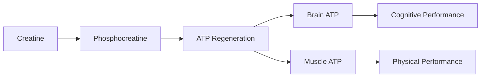

### The ATP-Phosphocreatine Shuttle

ATP (adenosine triphosphate) is the universal energy molecule. When cells use energy, ATP becomes ADP:

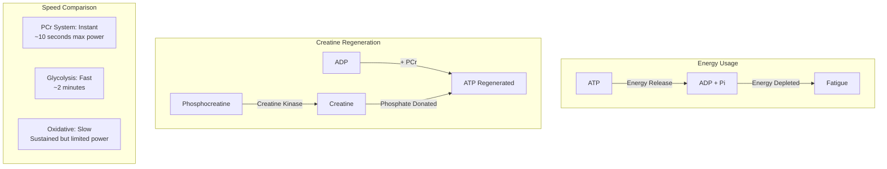

### The Three Energy Systems

| System | Speed | Duration | Power Output | Creatine Role |
|--------|-------|----------|--------------|---------------|
| **Phosphocreatine** | *Instant* | 6-10 sec | *Highest* | **Primary fuel** |
| Glycolytic | Fast | 30 sec - 2 min | High | Buffer during transition |
| Oxidative | Slow | Minutes-hours | Moderate | Indirect support |

### Why Phosphocreatine Matters for the Brain

The brain has *unique* energy demands:

| Brain Property | Value | Implication |
|----------------|-------|-------------|
| % of body weight | ~2% | Small organ |
| % of total ATP use | ~20% | *Massive* energy demand |
| ATP turnover | ~6 kg/day | Constant regeneration needed |
| PCr reserve | Limited | Vulnerable to depletion |
| Creatine content | ~5 mM | Supplementation can increase |

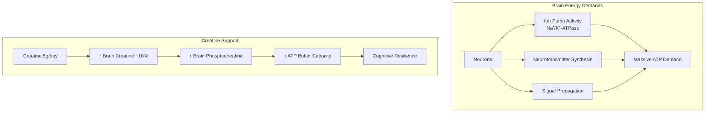

### Complete Mechanism Summary

| Mechanism | Target | Effect | Outcome |
|-----------|--------|--------|---------|
| **ATP regeneration** | Phosphocreatine system | Faster ATP resynthesis | Energy resilience |
| **Brain creatine ↑** | CNS stores | ~10% increase | Cognitive support |
| **Muscle PCr ↑** | Skeletal muscle | ~20% increase | Power output |
| **Osmotic cell volumization** | Intracellular water | Cell swelling | Anabolic signal |
| **Satellite cell activation** | Muscle stem cells | ↑ Myonuclei | Muscle growth |

### Creatine Kinase Reaction

The enzyme creatine kinase (CK) catalyzes the reversible transfer:

**Phosphocreatine + ADP ⇌ Creatine + ATP**

This reaction is:
- *Instantaneous* (microseconds)
- *Reversible* (stores energy when ATP is high)
- *Localized* (occurs at the site of ATP use)
- *Buffered* (maintains ATP:ADP ratio)

</Accordion>

<Accordion title="Cognitive Benefits" icon="brain">

### The Nootropic Case for Creatine

Creatine's cognitive benefits are increasingly recognized:

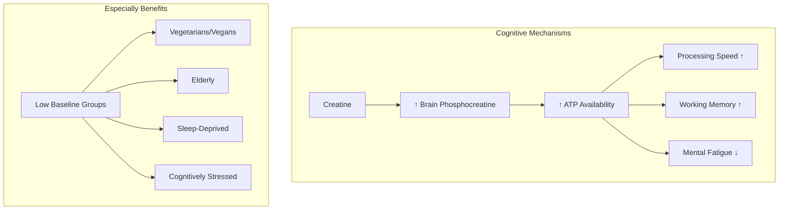

### Clinical Evidence: Cognitive Performance

| Study | Population | Dose | Duration | Finding |
|-------|------------|------|----------|---------|
| **Rae 2003** | Vegetarians | 5g | 6 weeks | *↑ Working memory, IQ* |
| **McMorris 2006** | Sleep-deprived | 20g load + 5g | Acute | *↓ Mental fatigue* |
| **Rawson 2008** | Elderly | 5g | 2 weeks | *↑ Cognitive performance* |
| **Watanabe 2002** | Healthy adults | 8g | 5 days | *↓ Mental fatigue (calculation task)* |
| **Hammett 2010** | Healthy adults | 5g | 6 weeks | *↑ Processing speed (MRI study)* |

### Why Vegetarians Benefit More

Vegetarians and vegans have *significantly lower* baseline creatine stores:

| Population | Muscle Creatine | Brain Creatine | Response to Supplementation |
|------------|-----------------|----------------|----------------------------|
| **Omnivores** | Baseline | Baseline | Moderate |
| **Vegetarians** | ~20-30% lower | ~10-15% lower | *Strong* |
| **Vegans** | ~20-30% lower | ~10-15% lower | *Strong* |

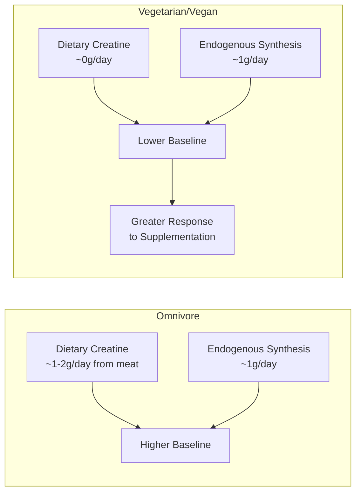

### Brain Regions Affected

| Region | Function | Creatine Impact |
|--------|----------|-----------------|
| **Prefrontal cortex** | Working memory, executive function | ↑ Performance under load |
| **Hippocampus** | Memory formation | ↑ Energy for consolidation |
| **Basal ganglia** | Motor control, reward | ATP for dopamine systems |
| **Cerebellum** | Coordination, learning | Motor-cognitive integration |

### Cognitive Performance Timeline

| Time Point | Expected Change | Notes |
|------------|-----------------|-------|
| Day 1-7 | Minimal | Loading phase if used |
| Week 2-4 | Emerging | Brain creatine rising |
| Week 4-6 | *Noticeable* | Brain saturation (~10% ↑) |
| Week 6+ | *Maintained* | Sustained with 5g/day |

### Conditions Where Cognitive Benefits Are Strongest

| Condition | Mechanism | Effect Size |
|-----------|-----------|-------------|
| **Sleep deprivation** | ATP depletion during extended wake | Large |
| **Vegetarian/Vegan** | Low baseline stores | Large |
| **Elderly** | Age-related creatine decline | Moderate-Large |
| **Cognitive stress** | High ATP demand | Moderate |
| **Normal, rested** | Already optimized | Small-Moderate |

</Accordion>

<Accordion title="Physical Performance" icon="dumbbell">

### Ergogenic Effects

Creatine's physical benefits are the most extensively documented of any supplement:

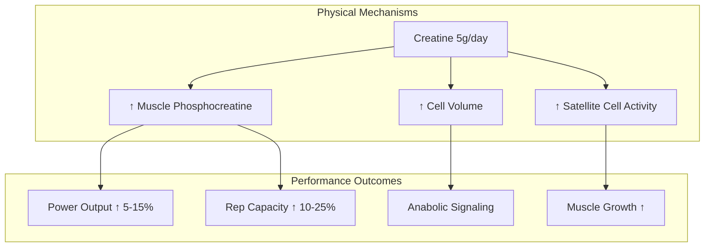

### Meta-Analysis Summary

| Outcome | Effect | Studies | Confidence |
|---------|--------|---------|------------|
| **Lean mass** | +1-2 kg over 4-12 weeks | 50+ | Very High |
| **Strength (1RM)** | +5-10% | 40+ | Very High |
| **Power output** | +5-15% | 30+ | Very High |
| **Sprint performance** | +5-10% (repeated sprints) | 20+ | High |
| **Endurance** | Minimal | 15+ | High (no effect) |

### Who Benefits Most Physically

| Population | Benefit Level | Notes |
|------------|---------------|-------|
| **Strength athletes** | *Very High* | Primary demographic |
| **Power athletes (sprinters)** | *Very High* | Repeated sprint benefit |
| **Team sport athletes** | High | Intermittent high-intensity |
| **Elderly (sarcopenia)** | High | Preserves muscle mass |
| **Endurance athletes** | Low | Not primary energy system |
| **Weight-class athletes** | Moderate | Water retention consideration |

### Muscle Creatine Saturation

| Phase | Protocol | Duration | Muscle Cr Change |
|-------|----------|----------|------------------|
| **Loading (optional)** | 20g/day (4×5g) | 5-7 days | +20% rapidly |
| **Maintenance** | 5g/day | Ongoing | Maintains saturation |
| **No loading** | 5g/day only | 3-4 weeks | +20% gradually |

### Physical Performance Timeline

| Timeframe | Expectation |
|-----------|-------------|
| Day 1-5 (loading) | Water retention, weight ↑1-2kg |
| Week 1-2 | Emerging strength gains |
| Week 2-4 | *Noticeable power improvement* |
| Week 4-8 | *Peak physical benefits* |
| Week 8+ | Maintained with continued use |

</Accordion>

<Accordion title="Pharmacokinetic Profile" icon="chart-line">

### ADME Parameters

| Parameter | Value | Notes |
|-----------|-------|-------|
| **Bioavailability** | ~99% (monohydrate) | Excellent absorption |
| **Tmax** | 1-2 hours | Peak plasma |
| **Half-life** | ~3 hours (plasma) | But tissue retention is key |
| **Tissue uptake** | Active transport (SLC6A8) | Muscle, brain, heart |
| **Distribution** | 95% in skeletal muscle | Also brain, heart |
| **Excretion** | Renal (as creatinine) | ~2g/day turnover |

### Absorption and Distribution

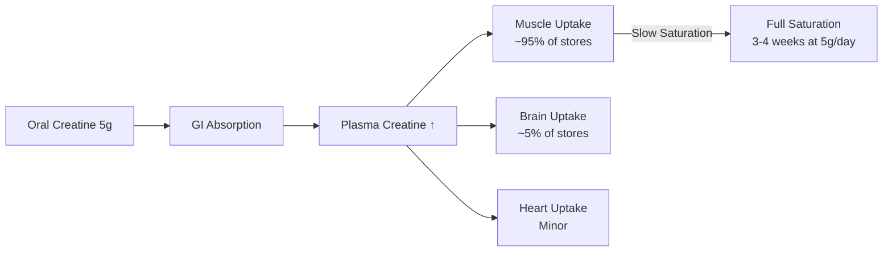

### Plasma and Tissue Timeline

| Time After Dose | Plasma Level | Muscle Level | Brain Level |
|-----------------|--------------|--------------|-------------|
| 0 hours | Baseline | Baseline | Baseline |
| 1 hour | *Peak* | Minimal change | Minimal change |
| 3 hours | Declining | Slight ↑ | Minimal |
| 24 hours | Baseline | Cumulative ↑ | Cumulative ↑ |
| 1 week | Baseline (trough) | +10-15% | +3-5% |
| 4 weeks | Baseline (trough) | *+20% (saturated)* | *+8-10%* |

### Tissue Saturation Kinetics

| Loading Protocol | Time to Muscle Saturation | Time to Brain Saturation |
|------------------|---------------------------|--------------------------|
| 20g/day × 5 days | ~5-7 days | ~2-3 weeks |
| 5g/day (no load) | ~3-4 weeks | ~4-6 weeks |

### The Creatinine Question

Creatine naturally converts to creatinine (waste product):

*Important:* Creatine supplementation raises serum creatinine, which can *falsely* suggest kidney dysfunction on standard tests. This is a *measurement artifact*, not actual kidney harm. Inform healthcare providers of supplementation.

</Accordion>

<Accordion title="Form Selection" icon="magnifying-glass-plus">

### Creatine Form Comparison

| Form | Bioavailability | Research Base | Cost | Recommendation |
|------|-----------------|---------------|------|----------------|
| **Monohydrate** | *~99%* | *500+ studies* | Low | **Gold standard** |
| Micronized Monohydrate | ~99% | Same as mono | Moderate | *Better solubility* |
| Creatine HCl | ~99% | Limited | High | No proven advantage |
| Buffered (Kre-Alkalyn) | ~99% | Limited | High | No proven advantage |
| Creatine Ethyl Ester | Lower | Limited | High | *Avoid* (degrades) |
| Creatine Nitrate | ~99% | Very limited | High | Insufficient evidence |
| Liquid Creatine | Degraded | None | High | *Avoid* |

### Why Monohydrate Remains King

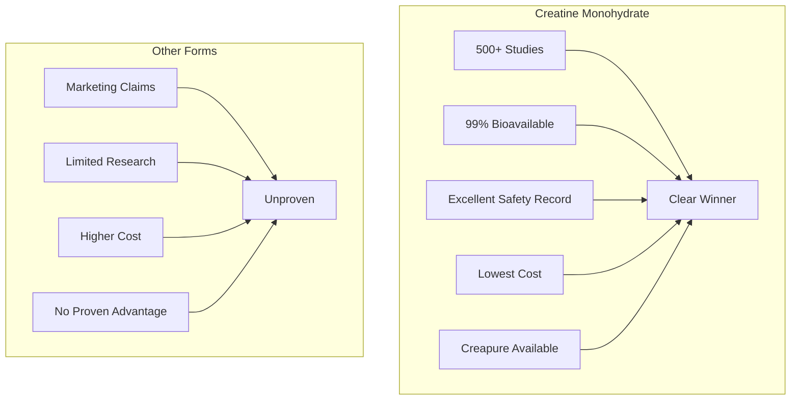

### Quality Specification (NeuroCreatine)

| Attribute | Specification | Method |
|-----------|---------------|--------|
| Identity | Creatine Monohydrate | HPLC, IR |
| Assay | ≥99.5% | HPLC |
| Creatinine | ≤100 ppm | HPLC |
| Dicyandiamide | ≤50 ppm | HPLC |
| Dihydrotriazine | Undetectable | HPLC |
| Heavy metals (total) | ≤10 ppm | ICP-MS |
| Lead | ≤1 ppm | ICP-MS |
| Arsenic | ≤1 ppm | ICP-MS |
| Microbial (TPC) | ≤100 CFU/g | USP &lt;61&gt; |

### Creapure® vs Generic

| Parameter | Creapure® | Generic |
|-----------|-----------|---------|
| Origin | Germany (AlzChem) | Various (often China) |
| Purity | ≥99.95% | 95-99% |
| Contaminants | Near-zero | Variable |
| Testing | Extensive | Variable |
| Certifications | Multiple | Variable |
| Cost | ~20% more | Lower |
| Recommendation | *Preferred* | Acceptable if tested |

### Solubility and Administration

| Form | Solubility | Best Practice |
|------|------------|---------------|
| Standard monohydrate | ~1g/100mL (20°C) | Stir well; slight grittiness OK |
| Micronized monohydrate | ~2g/100mL | Better dissolution |
| Any form | ↑ with warm water | But not necessary |

<Note>
**NeuroCreatine Specification:** NTRPX sources pharmaceutical-grade creatine monohydrate meeting Creapure® standards. Each batch is tested for identity, purity (≥99.5%), and absence of contaminants (creatinine, dicyandiamide, dihydrotriazine). The 5g dose in Boost and Recover provides the clinically-validated amount for both cognitive and physical benefits.
</Note>

</Accordion>

<Accordion title="Dosing Rationale" icon="capsules">

### Dose-Response Analysis

| Dose | Physical Effect | Cognitive Effect | Notes |
|------|-----------------|------------------|-------|
| 2-3g | Suboptimal | Suboptimal | Below saturation threshold |
| **5g** | *Optimal* | *Optimal* | **Standard maintenance** |
| 10g | Same as 5g | Same as 5g | No additional benefit |
| 20g | Loading phase | Loading phase | Only for rapid saturation |

### Loading vs No-Loading

| Approach | Protocol | Time to Saturation | Practical Notes |
|----------|----------|-------------------|-----------------|
| **Loading** | 20g/day × 5-7 days, then 5g | ~1 week | Faster; more GI issues |
| **No loading** | 5g/day from start | ~3-4 weeks | Slower; better tolerated |

*Both approaches reach the same endpoint.* Loading is optional and primarily useful when rapid benefit is desired.

### NTRPX Protocol

| Product | Creatine Dose | Timing | Purpose |
|---------|---------------|--------|---------|
| **Boost** | 5g | Morning | Cognitive + foundational |
| **Recover** | 5g | Post-workout | Physical recovery |
| **Either** | 5g | Any consistent time | Tissue saturation is key |

### Timing Flexibility

| Claim | Reality |
|-------|---------|
| "Must take post-workout" | Timing matters minimally |
| "Must take with carbs" | May help slightly; not required |
| "Must take with protein" | No strong evidence |
| "Timing is critical" | *Consistency matters more than timing* |

### Daily Protocol

| Timing | Recommendation | Rationale |
|--------|----------------|-----------|
| **Morning (with Boost)** | *Preferred for NTRPX* | Consistent daily habit |
| Post-workout | Also effective | Traditional approach |
| With meal | Acceptable | May improve absorption slightly |
| Before bed | Acceptable | No sleep interference |

### Population-Specific Dosing

| Population | Dose | Loading | Notes |
|------------|------|---------|-------|
| **Standard adults** | 5g/day | Optional | Standard protocol |
| **Larger individuals (&gt;100kg)** | 5-10g/day | Optional | May benefit from upper range |
| **Vegetarians/Vegans** | 5g/day | Recommended | Greater response expected |
| **Elderly** | 5g/day | Optional | Sarcopenia prevention |
| **Athletes (high-intensity)** | 5g/day | Optional | Standard effective |
| **Cognitive focus only** | 5g/day | Not needed | Patience required (4-6 weeks) |

### Long-Term Use

| Duration | Recommendation |
|----------|----------------|
| Short-term (weeks) | Effective; benefits building |
| Medium-term (months) | *Optimal;* full saturation |
| Long-term (years) | Safe; no cycling required |
| Cycling on/off | *Not necessary* — no benefit to cycling |

</Accordion>

<Accordion title="Synergy Matrix" icon="link">

### NTRPX System Synergies

Creatine provides foundational ATP support that enhances multiple NTRPX pathways:

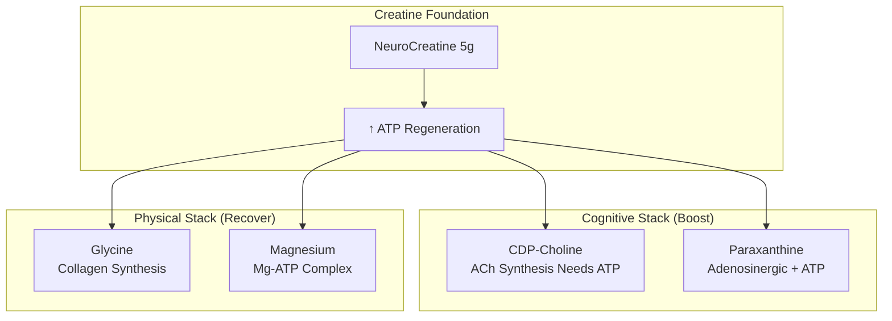

### ATP-Dependent Synergies

Many nootropics and supplements require ATP for their mechanisms:

| NTRPX Ingredient | ATP Requirement | Creatine Synergy |
|------------------|-----------------|------------------|
| **CDP-Choline** | ACh synthesis uses ATP | ↑ Choline → ACh conversion |
| **Paraxanthine** | Adenosine is ATP-derived | Shared adenine nucleotide pool |
| **Magnesium** | Mg-ATP is active form | Creatine + Mg optimize ATP function |
| **L-Tyrosine** | Catecholamine synthesis | ↑ DA/NE production capacity |
| **Glycine** | Protein synthesis | ↑ Collagen production capacity |

### Creatine + CDP-Choline Synergy

Both support neuronal energy and function:

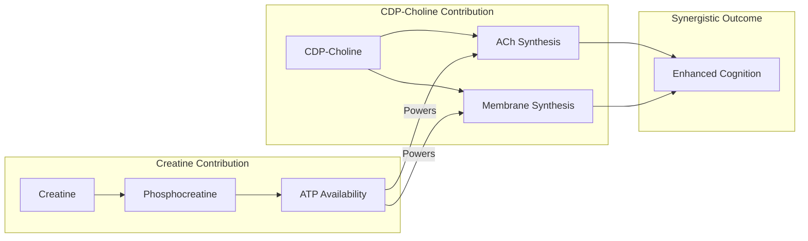

### Creatine + Magnesium: The Mg-ATP Complex

ATP functions as *Mg-ATP*, not free ATP:

| Concept | Explanation |
|---------|-------------|
| Active form of ATP | Mg-ATP complex |
| Mg role | Stabilizes ATP; required for kinases |
| Creatine + Mg | *Both* optimize ATP function |
| NTRPX application | Creatine (Boost) + Mg (Boost/Luna) |

### Creatine + Caffeine/Paraxanthine

| Combination | Historical Concern | Current Understanding |
|-------------|-------------------|----------------------|
| Creatine + Caffeine | Early study suggested interference | *Subsequent research shows no issue* |
| Creatine + Paraxanthine | Untested directly | Expected to be fine (similar to caffeine) |

*Take together without concern.* The single early negative study has not been replicated.

### Clinically-Demonstrated Synergies

| Combination | Evidence | Mechanism | Benefit |
|-------------|----------|-----------|---------|
| **Creatine + Resistance Training** | *Very Strong* | ATP for power + mechanical stimulus | Maximized muscle/strength |
| **Creatine + Protein** | Strong | ATP for synthesis + substrate | Muscle protein synthesis |
| **Creatine + Beta-Alanine** | Moderate | PCr + carnosine systems | High-intensity performance |
| **Creatine + HMB** | Moderate | ATP + anti-catabolic | Lean mass preservation |
| **Creatine + Carbohydrate** | Moderate | Insulin enhances uptake | Faster saturation |

### Synergies with External Compounds

| External Compound | Synergy Type | Notes |
|-------------------|--------------|-------|
| **Beta-Alanine** | Complementary buffers | Different fatigue pathways |
| **Citrulline** | Blood flow + ATP | Dual performance support |
| **HMB** | Anti-catabolic + energy | Preservation during deficits |
| **Omega-3 (DHA)** | Membrane + energy | Brain health stack |
| **Vitamin D** | Both affect muscle | Common co-deficiencies |

### Synergy Rating Summary

| Synergy | Products | Evidence | Rating |
|---------|----------|----------|--------|
| Creatine + CDP-Choline | Boost | Logical | ★★★★☆ |
| Creatine + Magnesium | Boost/Luna | Logical | ★★★★☆ |
| Creatine + Paraxanthine | Boost/ParaCaffeine | Logical | ★★★☆☆ |
| Creatine + Glycine | Boost/Luna/Recover | Logical | ★★★☆☆ |
| Creatine + Resistance Training | Recover + Training | *Very Strong* | ★★★★★ |
| Creatine + Beta-Alanine | External | Moderate | ★★★★☆ |

### No Negative Interactions

Creatine has *no known negative interactions* with other supplements or foods at normal doses. It is one of the safest compounds to stack.

</Accordion>

<Accordion title="Clinical Evidence" icon="book-open">

### Cognitive Performance Trials

| Study | Design | N | Dose | Duration | Finding |
|-------|--------|---|------|----------|---------|
| **Rae 2003** | RCT | 45 | 5g | 6 weeks | *↑ Working memory, IQ (vegetarians)* |
| **McMorris 2006** | RCT | 20 | 20g + 5g | Acute | *↓ Mental fatigue (sleep-deprived)* |
| **Rawson 2008** | RCT | 32 | 5g | 2 weeks | *↑ Cognitive tasks (elderly)* |
| **Watanabe 2002** | RCT | 24 | 8g | 5 days | *↓ Mental fatigue* |
| **Hammett 2010** | RCT + MRI | 19 | 5g | 6 weeks | *↑ Brain creatine, processing speed* |
| **Benton 2011** | RCT | 128 | 5g | 6 weeks | No effect (well-rested omnivores) |

**Key pattern:** Benefits most pronounced in *depleted states* (vegetarian, sleep-deprived, stressed, elderly).

### Physical Performance Meta-Analyses

| Meta-Analysis | Studies | Finding |
|---------------|---------|---------|
| **Branch 2003** | 100 studies | *↑ Lean mass, strength, power* |
| **Rawson 2003** | 22 studies | *↑ Strength 8%, power 14%* |
| **Lanhers 2015** | 53 studies | *↑ Upper body strength 5-8%* |
| **Devries 2014** | 10 studies | *↑ Muscle mass, strength in elderly* |

### Safety Studies

| Study | Duration | Finding |
|-------|----------|---------|
| **Kreider 2003** | 21 months | No adverse effects on health markers |
| **Poortmans 2000** | Meta-analysis | No kidney function impairment |
| **Kim 2011** | 12 weeks | Safe in elderly |
| **Cancela 2008** | 8 weeks | Safe with exercise in elderly |

### ISSN Position Stand (2017)

The International Society of Sports Nutrition concluded:

1. Creatine monohydrate is the *most effective* ergogenic supplement
2. *Safe* for short and long-term use
3. No evidence of harm in healthy individuals
4. Benefits extend beyond athletics to *brain health*

### Effect Size Summary

| Outcome | Effect Size | Evidence Level |
|---------|-------------|----------------|
| Lean mass | d = 0.3-0.5 | *Very High* |
| Strength | d = 0.4-0.6 | *Very High* |
| Power | d = 0.5-0.7 | *Very High* |
| Working memory (depleted) | d = 0.4-0.8 | Moderate-High |
| Mental fatigue (depleted) | d = 0.5-0.7 | Moderate |
| Cognition (normal state) | d = 0.1-0.2 | Moderate (minimal) |

### References

**Cognitive:**
- Rae C et al. Oral creatine monohydrate supplementation improves brain performance. *Proc Biol Sci.* 2003;270(1529):2147-50. [PubMed](https://pubmed.ncbi.nlm.nih.gov/14561278/)
- McMorris T et al. Effect of creatine supplementation and sleep deprivation on cognitive performance. *Psychopharmacology.* 2006;185(1):93-103. [PubMed](https://pubmed.ncbi.nlm.nih.gov/16416332/)
- Rawson ES, Venezia AC. Use of creatine in the elderly and evidence for effects on cognitive function. *Amino Acids.* 2011;40(5):1349-62. [PubMed](https://pubmed.ncbi.nlm.nih.gov/21394604/)

**Physical:**
- Branch JD. Effect of creatine supplementation on body composition and performance. *Int J Sport Nutr Exerc Metab.* 2003;13(2):198-226. [PubMed](https://pubmed.ncbi.nlm.nih.gov/12945830/)
- Rawson ES, Volek JS. Effects of creatine supplementation and resistance training on muscle strength and weightlifting performance. *J Strength Cond Res.* 2003;17(4):822-31. [PubMed](https://pubmed.ncbi.nlm.nih.gov/14636102/)

**Safety:**
- Kreider RB et al. Long-term creatine supplementation does not significantly affect clinical markers of health. *Mol Cell Biochem.* 2003;244(1-2):95-104. [PubMed](https://pubmed.ncbi.nlm.nih.gov/12701816/)
- Poortmans JR, Francaux M. Adverse effects of creatine supplementation. *Sports Med.* 2000;30(3):155-70. [PubMed](https://pubmed.ncbi.nlm.nih.gov/10999421/)

**Position Stand:**
- Kreider RB et al. International Society of Sports Nutrition position stand: safety and efficacy of creatine supplementation. *J Int Soc Sports Nutr.* 2017;14:18. [PubMed](https://pubmed.ncbi.nlm.nih.gov/28615996/)

</Accordion>

<Accordion title="Safety & Classification" icon="shield-check">

### Adverse Event Profile

| Event | Incidence | Severity | Notes |
|-------|-----------|----------|-------|
| **Weight gain (water)** | Common | Mild | 1-2 kg; intracellular (not bloating) |
| **GI discomfort** | 5-10% (loading) | Mild | Reduced with maintenance dose |
| **Muscle cramping** | Rare (myth) | — | Studies show *no increase* |
| **Dehydration** | Rare (myth) | — | Studies show *no increase* |

### Common Myths Debunked

| Myth | Reality |
|------|---------|
| "Causes kidney damage" | *False* — No evidence in healthy individuals |
| "Causes dehydration" | *False* — Increases intracellular water |
| "Causes muscle cramps" | *False* — No increase; may reduce |
| "Is a steroid" | *False* — Natural amino acid derivative |
| "Only for bodybuilders" | *False* — Brain benefits established |
| "Must cycle on/off" | *False* — Continuous use is safe |

### Safety Data

| Parameter | Finding |
|-----------|---------|
| **LD50** | Not determined (too safe to establish) |
| **Long-term studies** | 21+ months without adverse effects |
| **Kidney function** | *No impairment* in healthy individuals |
| **Liver function** | No impairment |
| **Genotoxicity** | Negative |
| **Carcinogenicity** | No evidence |

### Regulatory Status

| Region | Status | Notes |
|--------|--------|-------|
| **United States** | GRAS; Dietary supplement | FDA no safety concerns |
| **European Union** | Novel Food approved | EFSA reviewed |
| **Australia** | Permitted supplement | TGA listed |
| **WADA** | *Not prohibited* | Legal for sport |
| **NCAA** | *Permitted* | Legal for collegiate athletes |

### Contraindications

| Category | Consideration | Severity |
|----------|---------------|----------|
| **Kidney disease (pre-existing)** | May stress kidneys | ★★★★☆ Consult nephrologist |
| **Taking nephrotoxic drugs** | Combined stress | ★★★☆☆ Consult provider |
| **Pregnancy/Nursing** | Limited data | ★★☆☆☆ Likely safe; consult |

### Drug Interactions

| Drug Class | Interaction | Severity | Notes |
|------------|-------------|----------|-------|
| **NSAIDs (high-dose chronic)** | Theoretical kidney stress | ★★☆☆☆ | Monitor if combining |
| **Nephrotoxic drugs** | Combined kidney load | ★★★☆☆ | Consult provider |
| **Caffeine** | None (early concern debunked) | ★☆☆☆☆ | Safe to combine |
| **Most supplements** | None | ★☆☆☆☆ | Highly compatible |

### Special Populations

| Population | Safety Status | Notes |
|------------|---------------|-------|
| **Healthy adults** | *Excellent* | Primary demographic |
| **Adolescents** | Good | ISSN: acceptable with supervision |
| **Elderly** | *Excellent* | May benefit most |
| **Vegetarians/Vegans** | *Excellent* | Addresses natural deficiency |
| **Athletes** | *Excellent* | Most studied population |
| **Kidney disease** | Caution | Requires medical supervision |

### The Creatinine Misunderstanding

| Fact | Implication |
|------|-------------|
| Creatine → Creatinine | Natural conversion |
| Supplementation raises serum creatinine | *Expected* finding |
| Elevated creatinine usually indicates kidney dysfunction | BUT not with creatine use |
| **Action:** Inform healthcare providers | Prevents unnecessary concern |

---

### <Icon icon="star" color="#5A8FA8" /> Tier 1: Foundation

<CardGroup cols={3}>
<Card title="Efficacy" icon="check" color="#5A8FA8">Very High (Physical); Moderate-High (Cognitive)</Card>
<Card title="Validation" icon="check" color="#5A8FA8">Highest — 500+ studies; ISSN position stand</Card>
<Card title="Safety" icon="check" color="#5A8FA8">Excellent — Decades of research; GRAS</Card>
</CardGroup>

**Tier Rationale:** Tier 1 (Foundation) classification with highest confidence. Creatine monohydrate is the single most researched and validated supplement in existence. Physical performance benefits (strength, power, lean mass) are conclusively established with large effect sizes. Cognitive benefits are demonstrated particularly in depleted populations (vegetarians, sleep-deprived, elderly). Safety profile is exceptional across all studied populations. The 5g daily dose is the consensus recommendation supported by hundreds of studies. This is a true foundational compound.

</Accordion>

<Accordion title="Vegetarian & Vegan Considerations" icon="leaf">

### The Vegetarian Creatine Gap

Vegetarians and vegans are *uniquely positioned* to benefit from creatine supplementation:

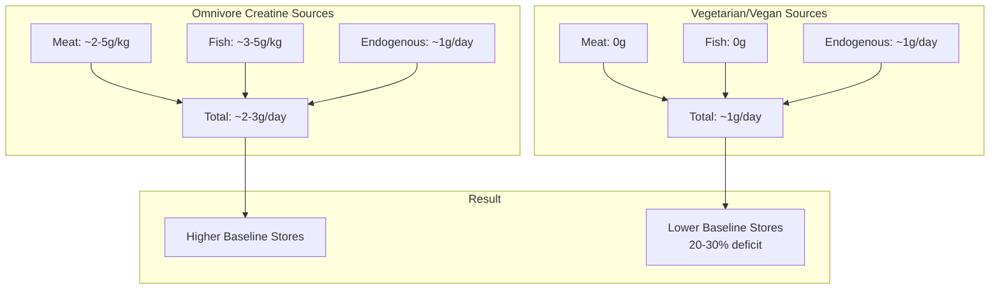

### Baseline Differences

| Marker | Omnivores | Vegetarians | Vegans |
|--------|-----------|-------------|--------|
| Muscle creatine | Baseline | *-20 to -30%* | *-20 to -30%* |
| Plasma creatine | Baseline | *-15 to -25%* | *-15 to -25%* |
| Brain creatine | Baseline | *-10 to -15%* | *-10 to -15%* |
| Dietary intake | 1-2 g/day | 0 g/day | 0 g/day |

### Greater Response to Supplementation

| Population | Response to 5g/day | Time to Saturation | Cognitive Benefit |
|------------|-------------------|-------------------|-------------------|
| Omnivores | Moderate | 3-4 weeks | Small-Moderate |
| *Vegetarians* | *Large* | *3-4 weeks* | *Moderate-Large* |
| *Vegans* | *Large* | *3-4 weeks* | *Moderate-Large* |

### Study: Rae 2003 (Key Finding)

| Parameter | Detail |
|-----------|--------|
| Participants | 45 vegetarians |
| Intervention | Creatine 5g vs placebo |
| Duration | 6 weeks |
| Findings | *↑ Working memory*, *↑ Processing speed*, *↑ Intelligence measures* |
| Significance | p &lt; 0.05 for cognitive tests |

### Why Vegetarians/Vegans Should Especially Consider Creatine

1. *Natural dietary gap* — Zero intake from food
2. *Greater response* — More room for improvement
3. *Cognitive benefits* — Brain creatine particularly affected
4. *Completely plant-compatible* — Synthetic creatine is vegan
5. *Addresses a common concern* — "Vegetarians lack creatine"

### Creatine Is Vegan

| Property | Status |
|----------|--------|
| Source | Synthetic (chemical synthesis) |
| Animal products | None |
| Vegan certifiable | Yes |
| Common misconception | "Creatine comes from meat" — *False* |

<Note>
**For Vegetarians & Vegans:** Creatine supplementation may be *more important* for you than for omnivores. Your naturally lower creatine stores mean you have more to gain from supplementation, particularly for cognitive function. The synthetic creatine in supplements contains no animal products and is appropriate for vegan diets.
</Note>

</Accordion>

<Accordion title="Practical Considerations" icon="clipboard-list">

### Getting Started

| Phase | Duration | Protocol |
|-------|----------|----------|
| **Option A: No loading** | Day 1+ | 5g/day (NTRPX default) |
| **Option B: Loading** | Days 1-5, then ongoing | 20g/day (4×5g), then 5g/day |

*Both approaches reach full saturation.* No-loading is simpler and equally effective.

### What to Expect

| Timeframe | Physical | Cognitive |
|-----------|----------|-----------|
| Week 1 | Weight ↑ 1-2kg (water) | Minimal |
| Week 2-3 | Emerging strength gains | Emerging (if depleted) |
| Week 4-6 | *Full benefits* | *Full benefits* |
| Ongoing | Maintained | Maintained |

### Signs It's Working

| Domain | Positive Indicators |
|--------|---------------------|
| **Physical** | More reps, faster recovery, strength gains |
| **Cognitive** | Sustained focus, less mental fatigue |
| **General** | Slight weight increase (water; not fat) |

### Administration Tips

| Tip | Rationale |
|-----|-----------|
| Take with Boost in AM | Consistent habit |
| Mix in water or beverage | Dissolves acceptably |
| Timing is flexible | Saturation matters, not acute timing |
| Stay hydrated | Good practice (not because of dehydration risk) |
| Be patient | 4-6 weeks for full cognitive benefits |

### Common Questions

**Q: Will creatine make me bloated?**
A: No. The water retention is *intracellular* (inside muscle cells), not subcutaneous bloating.

**Q: Do I need to cycle creatine?**
A: No. Continuous use is safe and maintains benefits. No advantage to cycling.

**Q: Will creatine damage my kidneys?**
A: No evidence of this in healthy individuals. Those with pre-existing kidney disease should consult a nephrologist.

**Q: I'm not an athlete — should I still take it?**
A: Yes, if cognitive benefits interest you, especially if vegetarian/vegan, elderly, or often sleep-deprived.

**Q: Is the weight gain fat?**
A: No. It's intracellular water, which is beneficial (cell volumization). It's typically 1-2 kg.

**Q: Can I take creatine with coffee?**
A: Yes. Early concerns about caffeine interference have been debunked.

</Accordion>

</AccordionGroup>

---

<Tip>
**NeuroCreatine Summary:** Creatine monohydrate (5g in Boost and Recover) is the most researched supplement in human history — over 500 studies confirming its safety and efficacy. While famous for physical performance, creatine's true mechanism is *ATP regeneration*, making it valuable for the energy-hungry brain as well. Cognitive benefits are particularly pronounced in vegetarians, vegans, the elderly, and sleep-deprived individuals. With a pristine safety record and no need for cycling, creatine is the ultimate foundational compound for both mental and physical performance.
</Tip>