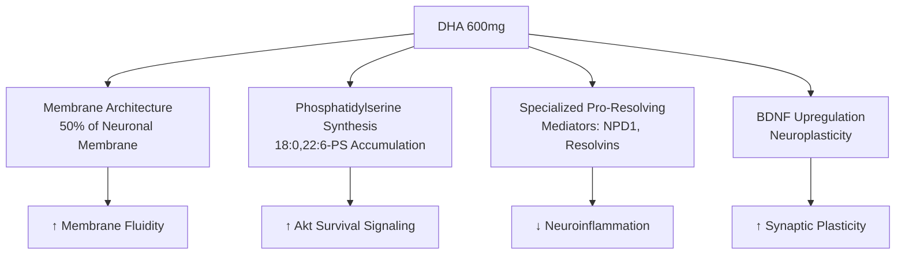
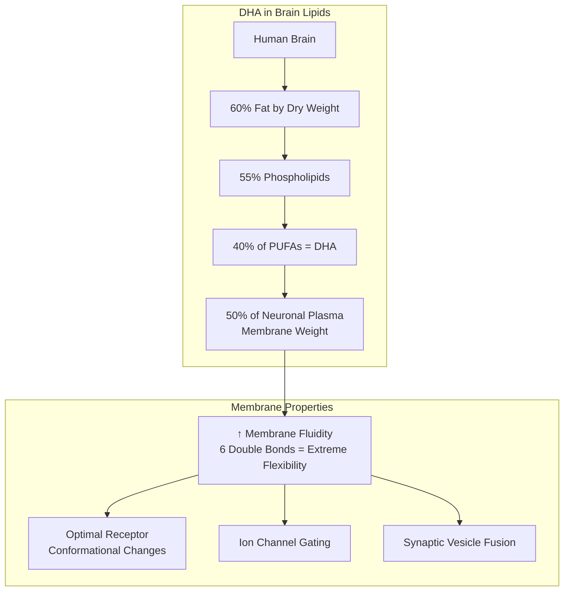
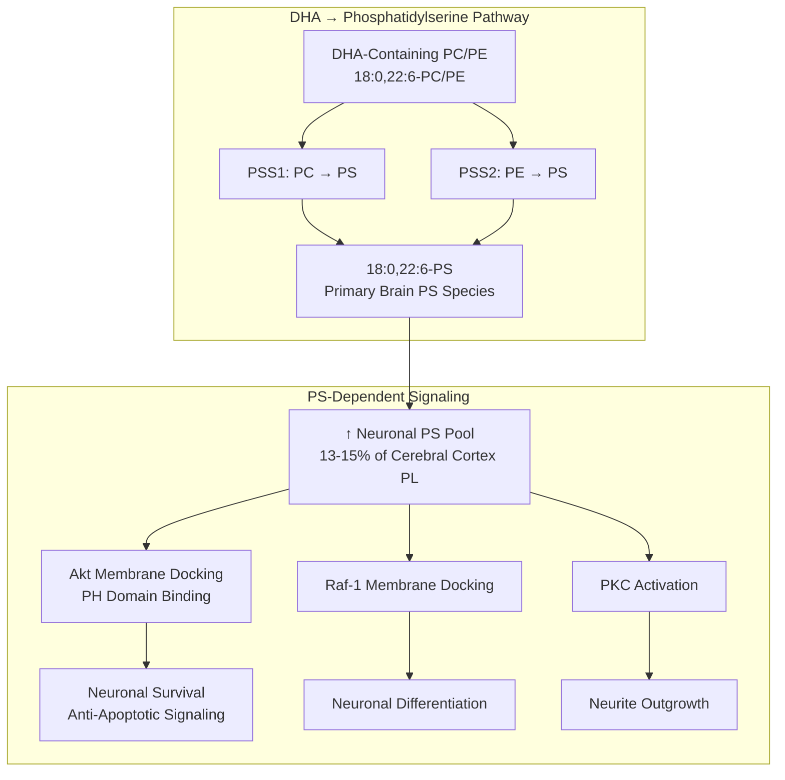
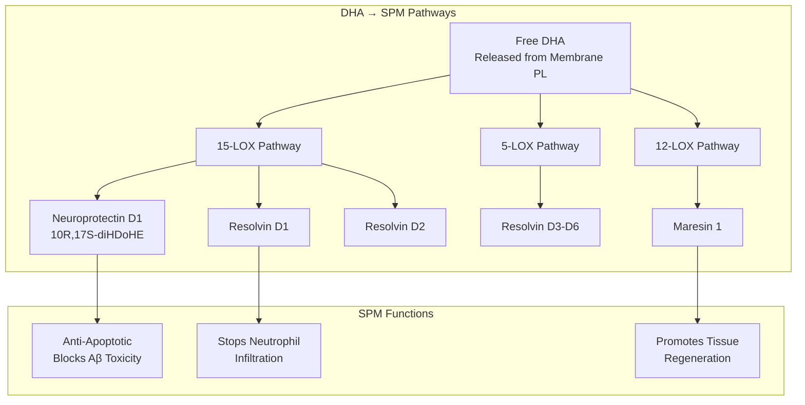
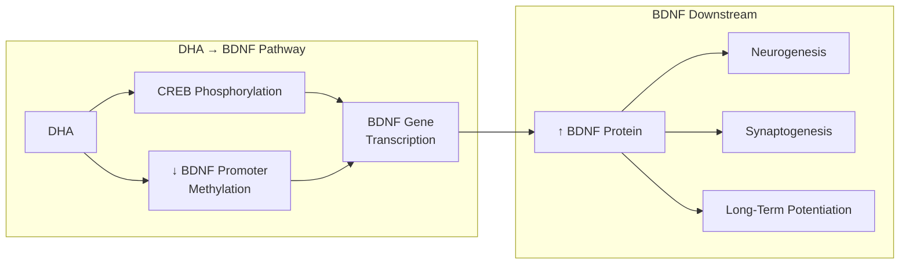
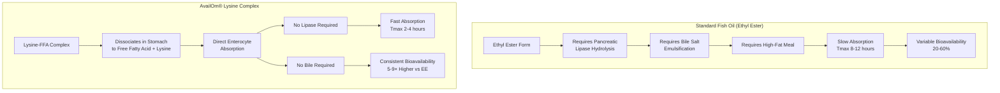
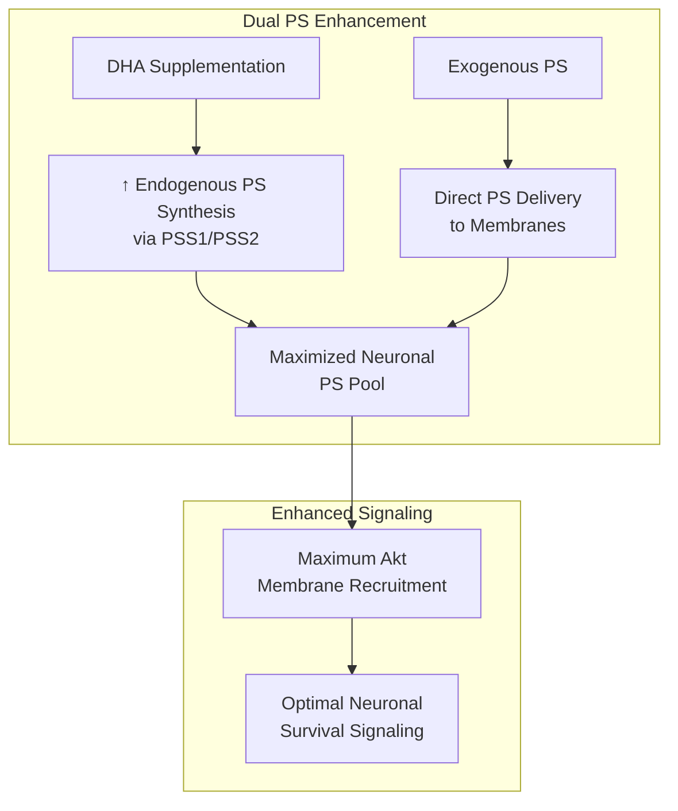
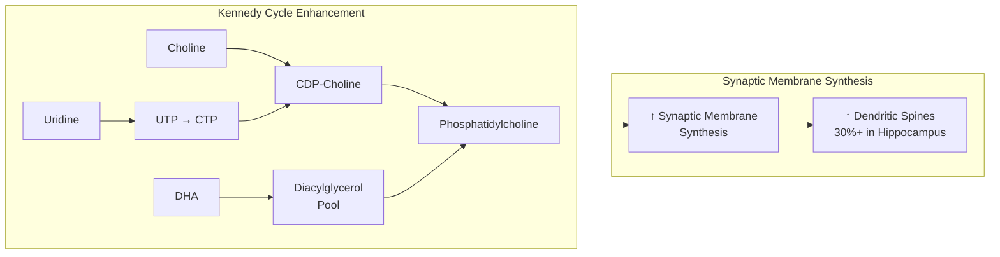
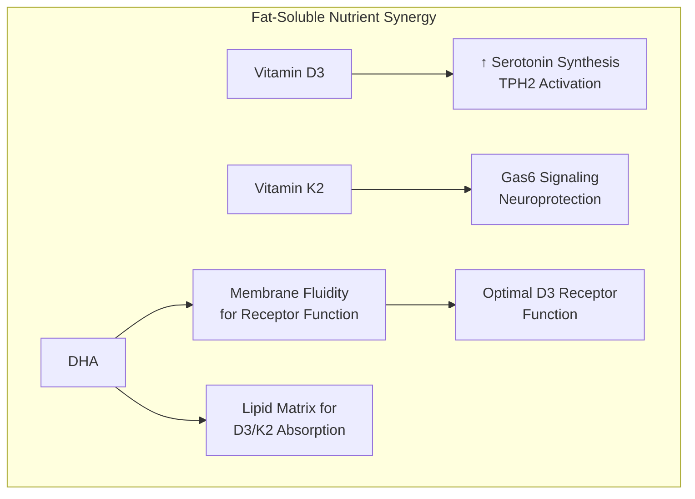

## NeuroStructure DHA

<CardGroup cols={4}>

<Card title="Boost" icon="rocket-launch" color="#64748b">
400 mg DHA
</Card>

<Card title="Sustain" icon="sun" color="#64748b">
200 mg DHA
</Card>

<Card title="Form" icon="flask-vial" color="#64748b">
AvailOm® High DHA
</Card>

<Card title="Bioavailability" icon="chart-line" color="#64748b">
5-9× vs Ethyl Esters
</Card>

</CardGroup>

**The molecule that builds your brain — the single most abundant omega-3 fatty acid in the central nervous system, comprising 50% of neuronal membrane weight.** Docosahexaenoic acid (DHA, 22:6n-3) isn't merely *beneficial* for brain function — it's *structural*. Your neurons are literally built from DHA. This 22-carbon polyunsaturated fatty acid with six double bonds creates the extraordinary membrane fluidity required for synaptic vesicle fusion, receptor conformation changes, and ion channel gating. More remarkably, DHA uniquely drives phosphatidylserine (PS) synthesis in neurons, expanding the PS pool that anchors the Akt survival pathway. When DHA is depleted, PS falls, Akt signaling collapses, and neurons become vulnerable. DHA is also the precursor to Neuroprotectin D1 (NPD1) and other specialized pro-resolving mediators that actively terminate neuroinflammation. NTRPX uses AvailOm® High DHA — a revolutionary lysine-complexed free fatty acid form with **5-9× higher bioavailability** than standard fish oil — delivering the brain's essential building block in its most absorbable state. In ASG Boost and Sustain, NeuroStructure DHA provides *the molecular foundation of cognitive architecture*.

<AccordionGroup>

<Accordion title="Mechanism of Action" icon="flask">

DHA (all-cis-docosa-4,7,10,13,16,19-hexaenoic acid) operates through four distinct but interconnected mechanisms:

### Mechanism 1: Neuronal Membrane Architecture (Primary Mechanism)

DHA's fundamental role is as the *primary structural lipid* of neuronal membranes:

| Brain Region | DHA Content | Functional Significance |
|--------------|-------------|------------------------|
| **Gray matter** | 35-40% of phospholipids | Neuronal cell bodies, synapses |
| **Synaptic membranes** | 60-65% of PS molecular species | Signal transmission |
| **Retina (photoreceptors)** | 60% of PUFAs | Phototransduction |
| **Hippocampus** | High concentration | Learning and memory |

**Why Six Double Bonds Matter:** DHA's unique structure — 22 carbons with 6 *cis* double bonds — creates extraordinary conformational flexibility. The molecule rapidly isomerizes between thousands of conformational states, creating "loosely packed" membrane domains that allow embedded proteins to move, change shape, and function. Without adequate DHA, membrane viscosity increases, receptor function declines, and synaptic transmission becomes sluggish.

### Mechanism 2: Phosphatidylserine Synthesis (Critical for Neuronal Survival)

DHA uniquely drives PS accumulation in neurons — a mechanism with profound implications for cell survival:

| PS Synthesis Step | DHA's Role | Evidence |
|-------------------|------------|----------|
| **PSS1 substrate** | 18:0,22:6-PC is *best* substrate | Kim et al. 2004 |
| **PSS2 substrate** | 18:0,22:6-PE is *best* substrate | Wen & Kim 2007 |
| **PS accumulation** | DHA uniquely increases neuronal PS | Garcia et al. 1998 |
| **Neuron-specific** | Effect occurs *only* in neurons | Guo et al. 2007 |

**Key Finding (Kim Laboratory, NIH):** DHA-containing phospholipids (PC and PE) are the *preferred substrates* for phosphatidylserine synthase enzymes. When neurons are supplemented with DHA, PS content increases specifically in neuronal cells — not in other cell types like CHO-K1 or HEK-293. This neuron-specific PS expansion has profound consequences:

1. **PS provides the docking site** for Akt's PH domain
2. **Akt membrane translocation** is required for phosphorylation and activation
3. **Activated Akt** phosphorylates pro-survival targets (Bad, GSK-3β, FOXO)
4. **Result:** Enhanced neuronal survival under stress conditions

**n-3 Fatty Acid Deficiency:** When dietary DHA is depleted, brain PS falls by 25-35% specifically in neuronal tissues (cortex, hippocampus, olfactory bulb, retina). Liver and adrenal PS remain unchanged — demonstrating the neuron-specific nature of DHA-PS coupling.

### Mechanism 3: Specialized Pro-Resolving Mediators (SPMs)

DHA is the precursor to D-series resolvins, protectins, and maresins — bioactive lipid mediators that *actively resolve* inflammation:

| SPM | Precursor | Key Actions | Potency |
|-----|-----------|-------------|---------|
| **Neuroprotectin D1 (NPD1)** | DHA via 15-LOX | Neuroprotection, anti-Aβ, anti-apoptotic | Picomolar |
| **Resolvin D1 (RvD1)** | DHA via 15-LOX/5-LOX | Stops neutrophil transmigration | Nanomolar |
| **Resolvin D2 (RvD2)** | DHA via 15-LOX/5-LOX | Reduces inflammatory cytokines | Nanomolar |
| **Maresin 1 (MaR1)** | DHA via 12-LOX | Promotes macrophage efferocytosis | Nanomolar |

**Neuroprotectin D1 — The Brain's Resolution Signal:**
- Synthesized in brain tissue from DHA in response to oxidative stress
- Potent protection against amyloid-β-induced apoptosis
- Inhibits COX-2 expression and pro-inflammatory gene transcription
- Promotes pro-survival Bcl-2 family protein expression
- Active at *picomolar* concentrations — extraordinarily potent

### Mechanism 4: BDNF Upregulation and Neuroplasticity

DHA enhances brain-derived neurotrophic factor (BDNF) through epigenetic and transcriptional mechanisms:

| BDNF Effect | DHA Contribution | Cognitive Relevance |
|-------------|------------------|---------------------|
| **↑ BDNF mRNA** | CREB activation | Learning capacity |
| **↑ Synaptic proteins** | Synapsin-1, PSD-95, GluR-1 | Memory consolidation |
| **↑ Dendritic spines** | 30%+ increase in hippocampus | Neural connectivity |
| **Enhanced LTP** | Stronger synaptic potentiation | Memory formation |

### Molecular Identity

| Property | Value |
|----------|-------|
| **IUPAC Name** | (4Z,7Z,10Z,13Z,16Z,19Z)-docosa-4,7,10,13,16,19-hexaenoic acid |
| **Notation** | 22:6(n-3) or 22:6ω3 |
| **Synonyms** | Cervonic acid, DHA |
| **Molecular Formula** | C₂₂H₃₂O₂ |
| **Molecular Weight** | 328.49 g/mol |
| **CAS Number** | 6217-54-5 |
| **Double Bonds** | 6 (all *cis* configuration) |
| **Melting Point** | -44°C (liquid at body temperature) |

</Accordion>

<Accordion title="AvailOm® Technology" icon="atom">

### The Bioavailability Problem

Traditional omega-3 supplements face fundamental absorption challenges:

### AvailOm® High DHA Specifications

| Parameter | Specification |
|-----------|---------------|
| **Form** | Omega-3 lysine complex powder |
| **DHA Content** | ≥30% free fatty acid by weight |
| **EPA Content** | ~15% free fatty acid by weight |
| **Total EPA+DHA** | ≥50% as free fatty acids |
| **Lysine Content** | ~14% L-lysine (essential amino acid) |
| **Appearance** | Free-flowing powder |
| **Stability** | >4 years at 25°C (no refrigeration) |
| **Regulatory** | GRAS (FDA), NDI registered, Novel Food (EU) |

### Clinical Bioavailability Evidence

**Wageningen University Study (2020):**
- First in-human pharmacokinetic trial
- Crossover design: AvailOm® vs standard ethyl ester
- Result: **5× higher AUC** for AvailOm®
- Faster Tmax (peak reached earlier)

**BioTeSys Three-Way Crossover RCT (2024):**
- 21 healthy subjects (10 men, 11 women)
- Three-way crossover: AvailOm® vs EE vs TG
- Results:

| Comparison | 0-12h Bioavailability | 0-24h Bioavailability |
|------------|----------------------|----------------------|
| **AvailOm® vs Ethyl Ester** | **9.33× higher** | **8.09× higher** |
| **AvailOm® vs Triglyceride** | **1.57× higher** | **1.44× higher** |

### Why Lysine Complexation Works

1. **Stabilization:** Lysine (cationic amino acid) forms ionic complex with free fatty acid (anionic)
2. **Powder form:** Creates stable, dry powder from liquid oil
3. **Gastric dissociation:** Complex rapidly breaks down at gastric pH
4. **Direct absorption:** Free fatty acids absorbed directly by enterocytes
5. **No enzymatic step:** Bypasses need for pancreatic lipase
6. **No bile dependence:** Absorbs efficiently regardless of dietary fat

### Bonus: L-Lysine

AvailOm® provides ~14% L-lysine by weight — an essential amino acid:
- Required for carnitine synthesis (fat transport into mitochondria)
- Supports collagen formation
- Enhances calcium absorption
- Contributes to daily amino acid requirements

</Accordion>

<Accordion title="Clinical Evidence" icon="microscope">

### DHA and Cognitive Function

| Study | Population | Dose/Duration | Key Findings |
|-------|------------|---------------|--------------|
| **Lee et al. (2013)** | MCI, 12 months | 1491mg DHA + 351mg EPA | ↑ Short-term memory, working memory, immediate verbal memory, delayed recall |
| **Stonehouse et al. (2013)** | Healthy young adults | 1160mg DHA, 6 months | ↑ Episodic memory (women), ↓ RT working memory (men) |
| **Zhang et al. (2018)** | MCI, 12 months | 2g DHA/day | ↑ Full-scale IQ, Information, Digit Span; slowed hippocampal atrophy |
| **Yurko-Mauro et al. (2010)** | ARCD, 24 weeks | 900mg DHA/day | ↑ Paired associate learning (PAL) memory |

### DHA and Brain Volume/Structure

**Zhang et al. 2016 (Tianjin, China):**
- 240 MCI subjects, 12-month RCT
- 2g DHA/day vs corn oil placebo
- Results:

| Outcome | DHA Effect | P-value |
|---------|------------|---------|
| **Left hippocampal volume** | Preserved | p = 0.016 |
| **Right hippocampal volume** | Preserved | p = 0.008 |
| **Total hippocampal volume** | Preserved | p = 0.023 |
| **Global cerebrum volume** | Preserved | p = 0.032 |
| **Full-Scale IQ** | Improved | p = 0.039 |
| **Digit Span** | Improved | p < 0.001 |

**Interpretation:** DHA supplementation at 2g/day for 12 months significantly slowed hippocampal atrophy and improved cognitive function in MCI patients.

### DHA Brain Delivery (CSF Penetration)

**Arellanes et al. (2020) — eBioMedicine:**
- 33 cognitively unimpaired adults
- 2,152mg DHA/day for 6 months
- Lumbar puncture before and after

| Outcome | Change | P-value |
|---------|--------|---------|
| **CSF DHA** | +28% | p < 0.0001 |
| **CSF EPA** | +43% | p < 0.0001 |

**APOE4 Effect:** Non-APOE4 carriers had 3× greater CSF EPA increase than APOE4 carriers, suggesting APOE4 carriers may need higher doses.

### Meta-Analysis: Dose-Response Relationship

**2025 Meta-Analysis (Scientific Reports):**
- 58 RCTs included
- Dose-response analysis per 2000mg/day omega-3

| Cognitive Domain | SMD per 2g/day | 95% CI | GRADE |
|------------------|----------------|--------|-------|
| **Attention** | 0.98 | 0.41–1.54 | Low |
| **Perceptual speed** | 0.50 | 0.05–0.95 | Moderate |
| **Language** | 0.37 | 0.12–0.62 | Moderate |

**Conclusion:** Higher omega-3 doses (≥2g/day) show dose-dependent cognitive benefits.

### Stage-Dependent Effects

Clinical evidence consistently shows DHA is most effective when initiated *before* significant cognitive decline:

| Population | DHA Efficacy | Interpretation |
|------------|--------------|----------------|
| **Healthy adults** | Positive (memory, RT) | Prevention potential |
| **Mild cognitive impairment** | Positive (multiple domains) | Early intervention effective |
| **Early Alzheimer's (MMSE >27)** | Positive | Narrow therapeutic window |
| **Moderate-severe Alzheimer's** | Negative | Too late; damage irreversible |

### APOE Genotype Considerations

APOE4 carriers show altered DHA metabolism:
- **Less efficient** DHA delivery to brain
- **Lower CSF DHA increase** after supplementation
- **May require higher doses** for equivalent brain effects
- **Shorter DHA half-life** in plasma

**Clinical Implication:** APOE4 carriers may benefit from higher DHA doses or longer supplementation periods.

</Accordion>

<Accordion title="Synergies" icon="arrows-split-up-and-left">

### DHA + Phosphatidylserine (Synergistic PS Expansion)

DHA and exogenous PS work through complementary mechanisms:

**NTRPX Synergy:** ASG Boost contains both DHA (400mg) and Phosphatidylserine (100mg), providing dual-pathway PS optimization.

### DHA + Choline + Uridine (Kennedy Cycle)

The "Kennedy Cycle" for phosphatidylcholine synthesis is enhanced by DHA:

**MIT Research (Wurtman Lab):** Combined DHA + choline + uridine supplementation increases hippocampal synapses by 30%+ in animal models.

**NTRPX Implementation:** 
- DHA from AvailOm® High DHA
- Choline from CDP-Choline (Citicoline)
- Uridine provided by CDP-Choline breakdown

### DHA + Vitamin D3 + K2 (Fat-Soluble Triad)

**Synergy Logic:**
- DHA provides optimal membrane environment for vitamin D receptor function
- Vitamin D regulates serotonin synthesis — DHA enhances serotonin receptor function
- K2 activates Gas6 (neuroprotective) — requires proper membrane integration
- AvailOm® oil matrix enhances absorption of fat-soluble vitamins

### DHA + EPA (Complementary Omega-3s)

| Omega-3 | Primary Role | Brain Fate | NTRPX Timing |
|---------|--------------|------------|--------------|
| **DHA** | Structural (membrane) | Incorporated into phospholipids | AM (Boost) |
| **EPA** | Signaling (anti-inflammatory) | Rapidly metabolized to SPMs | PM (Recover) |

**NTRPX Strategy:** DHA-predominant in morning products (structural foundation), EPA-predominant in evening products (inflammation resolution during sleep).

### DHA + Magnesium

| Magnesium Role | DHA Interaction |
|----------------|-----------------|
| **Enzyme cofactor** | Required for fatty acid metabolism enzymes |
| **Membrane stability** | Both modulate membrane fluidity |
| **GABA function** | Both support GABAergic signaling |
| **Anti-inflammatory** | Complementary pathways |

</Accordion>

<Accordion title="Dosing Strategy" icon="prescription-bottle">

### NTRPX DHA Distribution

| Product | DHA Dose | EPA Dose | Total ω-3 | Timing Rationale |
|---------|----------|----------|-----------|------------------|
| **ASG Boost™** | 400mg | 300mg | 700mg | Morning structural foundation |
| **ASG Sustain™** | 200mg | 100mg | 300mg | Afternoon maintenance |
| **ASG Recover™** | 100mg | 300mg | 400mg | Evening EPA-dominant recovery |
| **Daily Total** | **700mg** | **700mg** | **1,400mg** | Comprehensive coverage |

### Effective Dose Equivalency

AvailOm® bioavailability advantage means lower doses achieve equivalent plasma levels:

| AvailOm® Dose | Equivalent Ethyl Ester Dose | Equivalent TG Dose |
|---------------|----------------------------|-------------------|
| 100mg DHA | 500-900mg DHA (EE) | 140-160mg DHA (TG) |
| 400mg DHA | 2,000-3,600mg DHA (EE) | 560-640mg DHA (TG) |
| 700mg DHA (daily) | **3,500-6,300mg** DHA (EE) | 980-1,120mg DHA (TG) |

**Implication:** NTRPX's 700mg DHA from AvailOm® delivers the equivalent brain exposure of 3,500-6,300mg from standard fish oil softgels.

### Evidence-Based Dosing by Indication

| Indication | DHA Dose | Duration | Evidence Level |
|------------|----------|----------|----------------|
| **General brain health** | 250-500mg | Ongoing | Strong |
| **Cognitive optimization** | 500-1,000mg | Ongoing | Moderate-Strong |
| **MCI intervention** | 1,000-2,000mg | 12+ months | Strong |
| **Pregnancy/lactation** | 200-600mg | Gestation + nursing | Strong (critical) |
| **Cardiovascular** | 500-1,000mg | Ongoing | Strong |

### Timing Considerations

| Timing | Rationale | NTRPX Implementation |
|--------|-----------|---------------------|
| **With food** | Enhanced absorption (though AvailOm® less food-dependent) | Recommended with meals |
| **Morning emphasis** | DHA structural role; cognitive priming | Boost (400mg DHA) |
| **Split dosing** | Maintains more stable plasma levels | Boost + Sustain |
| **Evening EPA** | Resolution during sleep/recovery | Recover (EPA-dominant) |

### Population-Specific Dosing

| Population | DHA Consideration | NTRPX Guidance |
|------------|-------------------|----------------|
| **Healthy adults** | 500-700mg/day adequate | Standard protocol |
| **APOE4 carriers** | May need higher doses | Consider adding fatty fish 2×/week |
| **Elderly (65+)** | Higher baseline need | Standard protocol appropriate |
| **Pregnancy** | Critical for fetal brain | Consult physician; DHA essential |
| **Vegetarian/vegan** | Algal DHA option | AvailOm® is fish-derived; algal alternatives exist |

</Accordion>

<Accordion title="Whole Foods Sources" icon="fish">

### Omega-3 Content of Common Foods

| Food Source | Serving | DHA (mg) | EPA (mg) | Total ω-3 (mg) |
|-------------|---------|----------|----------|----------------|
| **Atlantic Salmon (wild)** | 3 oz (85g) | 1,240 | 590 | 1,830 |
| **Atlantic Salmon (farmed)** | 3 oz (85g) | 1,090 | 590 | 1,680 |
| **Atlantic Mackerel** | 3 oz (85g) | 1,400 | 500 | 4,580* |
| **Sardines (canned)** | 3 oz (85g) | 740 | 450 | 1,190 |
| **Herring** | 3 oz (85g) | 940 | 770 | 1,710 |
| **Anchovies** | 3 oz (85g) | 870 | 760 | 1,630 |
| **Rainbow Trout (farmed)** | 3 oz (85g) | 500 | 400 | 900 |
| **Albacore Tuna** | 3 oz (85g) | 530 | 200 | 730 |
| **Oysters (raw)** | 6 medium | 200 | 260 | 460 |
| **Cod** | 3 oz (85g) | 130 | 50 | 180 |

*Mackerel includes additional omega-3s beyond EPA+DHA

### Food Equivalents for NTRPX Daily DHA

To match NTRPX's 700mg DHA from AvailOm® (accounting for 5-9× bioavailability = **3,500-6,300mg equivalent**):

| Food Source | Amount Needed Daily | Practical? | Notes |
|-------------|---------------------|------------|-------|
| **Wild Salmon** | 10-18 oz (280-510g) | ✗ Impractical | Cost: $15-30/day |
| **Canned Sardines** | 15-27 oz (425-765g) | ✗ Impractical | 4-7 cans/day |
| **Mackerel** | 7-13 oz (200-370g) | ⚠️ Challenging | Mercury consideration |
| **Herring** | 12-21 oz (340-595g) | ✗ Impractical | Rare in Western diet |

**Reality Check:** Achieving equivalent DHA brain exposure through food alone is extremely difficult due to:
1. Standard fish oil absorption is 5-9× lower than AvailOm®
2. Cost of high-quality fatty fish
3. Practical consumption limits
4. Mercury exposure with large fish
5. Preparation time

### Dietary Strategy for NTRPX Users

**Optimized Approach:** Use NTRPX omega-3s as reliable baseline; add whole food sources for additional benefits:

| Weekly Target | Rationale | Foods |
|---------------|-----------|-------|
| **2-3 fatty fish servings** | Provides matrix of nutrients beyond DHA | Salmon, sardines, mackerel |
| **Seafood variety** | Additional minerals (zinc, selenium, iodine) | Oysters, mussels, shrimp |
| **Low-mercury choices** | Safety | Sardines, anchovies, herring |

### Why Not Plant Sources?

| Source | Omega-3 Type | Conversion to DHA | Practical DHA |
|--------|--------------|-------------------|---------------|
| **Flaxseed** | ALA | \<0.5% conversion | Negligible |
| **Chia seeds** | ALA | \<0.5% conversion | Negligible |
| **Walnuts** | ALA | \<0.5% conversion | Negligible |
| **Hemp seeds** | ALA | \<0.5% conversion | Negligible |

**Conversion Problem:** Humans convert ALA → EPA → DHA extremely inefficiently:
- ALA → EPA: ~5-10%
- ALA → DHA: **\<0.5%**

Plant sources cannot meaningfully contribute to DHA status. Direct DHA from marine sources (fish, algae) is required.

### Cost Comparison

| Source | Daily Cost for Equivalent DHA |
|--------|------------------------------|
| **Wild salmon (6+ oz/day)** | $15-25 |
| **Quality fish oil softgels (8-12 caps)** | $2-4 |
| **NTRPX (AvailOm® DHA)** | Included in system |
| **AvailOm® (standalone)** | ~$1-2 |

**Value Proposition:** AvailOm® provides superior bioavailability at a fraction of whole food cost, without mercury concerns or preparation requirements.

</Accordion>

<Accordion title="Safety & Classification" icon="shield-check">

### Adverse Event Profile

| Event | Incidence | Severity | Notes |
|-------|-----------|----------|-------|
| **Fishy aftertaste** | Rare with AvailOm® | Minimal | Lysine complex prevents |
| **GI upset** | Uncommon | Mild | Less than ethyl esters |
| **Loose stools** | Rare | Mild | High doses only |
| **Prolonged bleeding time** | Theoretical | N/A | Only at very high doses |

At NTRPX doses (700mg DHA/day), adverse events are *uncommon and mild*.

### Safety Data

| Parameter | Finding | Source |
|-----------|---------|--------|
| **Human clinical (up to 3g/day)** | No serious adverse events | Multiple RCTs |
| **FDA GRAS** | Up to 3g/day EPA+DHA | FDA |
| **EFSA** | Up to 5g/day EPA+DHA | EFSA 2012 |
| **Oxidation markers** | No increase at clinical doses | Multiple studies |
| **LDL cholesterol** | Modest increase possible at high doses | Monitor if concerned |
| **AvailOm® stability** | >4 years, low oxidation | Evonik data |

### Regulatory Status

| Region | Status | Notes |
|--------|--------|-------|
| **United States** | GRAS; dietary supplement | NDI registered |
| **European Union** | Novel Food approved | AvailOm® specifically |
| **Japan** | Food ingredient | Long history |
| **Canada** | NHP eligible | Licensed products |

### Drug Interactions

| Drug Class | Interaction | Severity | Recommendation |
|------------|-------------|----------|----------------|
| **Anticoagulants** (warfarin) | Additive bleeding risk | ★★★☆☆ | Monitor INR |
| **Antiplatelet** (aspirin, clopidogrel) | Additive effect | ★★☆☆☆ | Generally safe; monitor |
| **Antihypertensives** | Additive BP lowering | ★☆☆☆☆ | May allow dose reduction |
| **Statins** | Complementary | ★☆☆☆☆ | Beneficial combination |

### Contraindications

| Category | Consideration | Severity |
|----------|---------------|----------|
| **Fish/shellfish allergy** | Use algal DHA alternative | ★★★★★ Absolute |
| **Scheduled surgery** | Stop 1-2 weeks before | ★★★☆☆ Temporary |
| **Active bleeding** | Avoid until resolved | ★★★★☆ Temporary |

### Special Populations

| Population | Safety Status | Notes |
|------------|---------------|-------|
| **Healthy adults** | Excellent | Well-tolerated |
| **Pregnancy** | **Essential** | DHA critical for fetal brain; 200-600mg recommended |
| **Lactation** | **Essential** | DHA transfers to breast milk |
| **Children** | Excellent | Age-appropriate dosing |
| **Elderly** | Excellent | May have higher requirements |
| **APOE4 carriers** | Safe | May need higher doses for effect |

---

### <Icon icon="star" color="#64748b" /> Tier 1: Foundation

<CardGroup cols={3}>
<Card title="Efficacy" icon="check" color="#64748b">High — Essential structural nutrient</Card>
<Card title="Validation" icon="check" color="#64748b">Strong — Extensive RCTs, mechanism elucidated</Card>
<Card title="Safety" icon="check" color="#64748b">Excellent — GRAS, essential nutrient, long history</Card>
</CardGroup>

**Tier Rationale:** Tier 1 (Foundation) classification. DHA is not optional — it's *essential* for brain structure, comprising 50% of neuronal membrane weight. Unlike most supplements that modulate function, DHA is literally *structural*. The brain cannot be built or maintained without it. Depletion causes measurable deficits in PS content, Akt signaling, and cognitive function. Human clinical trials demonstrate benefits for memory, hippocampal volume preservation, and cognitive function across multiple populations. The mechanism is definitively established: membrane architecture, PS synthesis, SPM production, and BDNF modulation. AvailOm® technology provides 5-9× superior bioavailability over standard supplements, ensuring actual brain delivery. Safety is excellent — DHA is an essential nutrient with GRAS status and extensive human data, including in pregnancy where it's actively recommended.

</Accordion>

<Accordion title="Practical Considerations" icon="clipboard-list">

### When to Use DHA

| Scenario | Expected Benefit | Protocol |
|----------|------------------|----------|
| **Cognitive optimization** | *High* | 400-700mg daily, ongoing |
| **Memory support** | *High* | 500-1000mg daily, 6+ months |
| **MCI intervention** | *High* | 1000-2000mg daily, 12+ months |
| **Pregnancy/nursing** | *Critical* | 200-600mg daily, entire period |
| **Cardiovascular** | *High* | 500-1000mg daily, ongoing |
| **General wellness** | Moderate-High | 250-500mg daily, ongoing |

### Realistic Expectations

| Timeframe | What to Expect |
|-----------|----------------|
| **Week 1-2** | Plasma DHA rising; minimal subjective effects |
| **Week 4-8** | RBC membrane composition changing |
| **Month 3** | Brain DHA increasing; subtle cognitive effects |
| **Month 6+** | *Measurable* cognitive and structural benefits |
| **Ongoing** | Maintained brain architecture; prevention effects |

**Key Insight:** DHA is a *structural* intervention. Unlike acute-acting compounds, DHA slowly incorporates into membrane phospholipids. Full effects require months of consistent supplementation.

### Signs It's Working

| Indicator | Description |
|-----------|-------------|
| **↑ Mental clarity** | Improved focus and processing |
| **↑ Memory** | Better recall, especially episodic |
| **↓ Brain fog** | Reduced cognitive fatigue |
| **Mood stability** | More even emotional state |
| **Visual function** | Potentially improved (DHA in retina) |

### Optimizing Response

| Strategy | Rationale |
|----------|-----------|
| **Take with meals** | Enhanced absorption (less critical with AvailOm®) |
| **Consistent daily use** | Membrane incorporation requires chronic dosing |
| **Combine with PS** | Dual-pathway PS optimization |
| **Include choline** | Kennedy Cycle synergy |
| **Ensure vitamin D** | Receptor function requires membrane fluidity |
| **Add fatty fish** | Whole food matrix benefits |

### Frequently Asked Questions

<AccordionGroup>

<Accordion title="How is DHA different from fish oil?">
DHA is the *active molecule* — one of the omega-3 fatty acids in fish oil. Standard fish oil contains a mix of omega-3s (typically 30% EPA+DHA), plus other fatty acids. NTRPX uses concentrated DHA in the highly bioavailable AvailOm® form, ensuring you get the specific brain-building fatty acid in optimal amounts without filler fats.
</Accordion>

<Accordion title="Why does it take months to feel effects?">
DHA is a *structural* molecule — it physically incorporates into your neuronal membranes. This isn't like caffeine (instant effect) or even adaptogens (weeks). Membrane remodeling takes time: DHA must be absorbed, transported to the brain, acylated into phospholipids, and distributed across billions of neurons. Full membrane saturation requires 3-6 months of consistent supplementation.
</Accordion>

<Accordion title="Can I get enough DHA from diet alone?">
Theoretically yes, but practically difficult. You'd need to eat fatty fish (salmon, mackerel, sardines) almost daily. Most people eat fish 1-2× per week at best, providing ~100mg DHA daily — far below optimal. Factor in cost ($15-25/day for adequate salmon), mercury concerns, and convenience, and supplementation becomes the practical solution.
</Accordion>

<Accordion title="What about plant-based omega-3s (flax, chia)?">
Plant sources provide ALA (alpha-linolenic acid), not DHA. Humans convert ALA to DHA at *\<0.5% efficiency*. You cannot meaningfully raise brain DHA levels with flax or chia seeds. If avoiding fish, use algae-derived DHA supplements (the original DHA source that fish accumulate).
</Accordion>

<Accordion title="Is AvailOm® worth the premium over standard fish oil?">
Absolutely. Standard ethyl ester fish oil has 5-9× *lower* bioavailability than AvailOm®. You'd need to take 5-9 standard capsules to match one AvailOm® dose. Factor in the superior stability (no refrigeration, 4+ year shelf life), absence of fishy burps, and predictable absorption regardless of meal fat content — AvailOm® is the superior technology.
</Accordion>

<Accordion title="Should APOE4 carriers take more DHA?">
Possibly. Research shows APOE4 carriers have less efficient DHA brain delivery and lower CSF DHA increases after supplementation. While the standard NTRPX dose provides excellent coverage, APOE4 carriers may benefit from additional fatty fish consumption or considering the upper end of dosing ranges. Discuss with a physician if you know your APOE status.
</Accordion>

<Accordion title="Can pregnant women take NTRPX DHA?">
DHA is *essential* during pregnancy — it's critical for fetal brain and eye development. International guidelines recommend 200-600mg DHA daily during pregnancy and lactation. However, pregnant women should consult their physician before taking any supplements, including NTRPX products.
</Accordion>

<Accordion title="Does DHA help with depression?">
The omega-3 with strongest antidepressant evidence is *EPA*, not DHA. DHA supports brain structure and serotonin receptor function, but EPA more directly modulates inflammatory pathways linked to depression. NTRPX provides both: DHA-predominant in Boost/Sustain for structure, EPA-predominant in Recover for mood/inflammation.
</Accordion>

</AccordionGroup>

</Accordion>

</AccordionGroup>

---

<Tip>
**NeuroStructure Summary:** DHA (Docosahexaenoic Acid) at 700mg daily via AvailOm® High DHA is the *structural foundation* of cognitive architecture — comprising 50% of neuronal membrane weight and uniquely driving phosphatidylserine synthesis for Akt survival signaling. With 5-9× superior bioavailability over standard fish oil, AvailOm® ensures actual brain delivery of this essential fatty acid. Human clinical trials demonstrate preservation of hippocampal volume, improved memory, and cognitive benefits across multiple populations. DHA also serves as the precursor to Neuroprotectin D1 and other specialized pro-resolving mediators that terminate neuroinflammation. In NTRPX ASG Boost and Sustain, NeuroStructure DHA delivers *the molecular foundation your neurons are literally built from*.
</Tip>

---

<Note>
**Version:** 1.0 | **Last Updated:** January 23, 2026 | **Document Status:** Complete Clinical Monograph

This monograph establishes the DHA framework for NTRPX Systems. AvailOm® High DHA has been selected as the gold-standard delivery form based on superior bioavailability (5-9× vs ethyl esters), stability (>4 years), and clinical validation. Doses and product placements are optimized for synergy with phosphatidylserine, choline, and other NTRPX ingredients.
</Note>