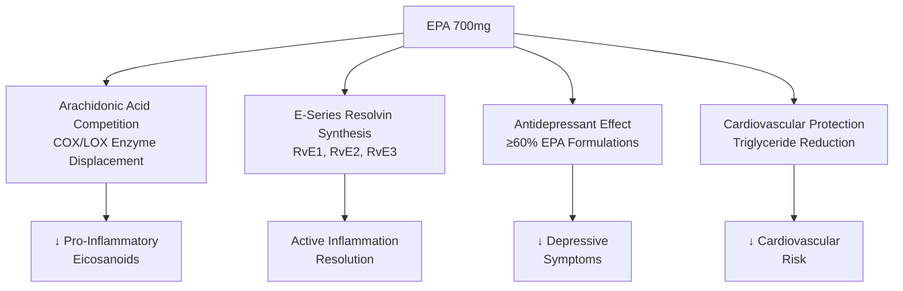
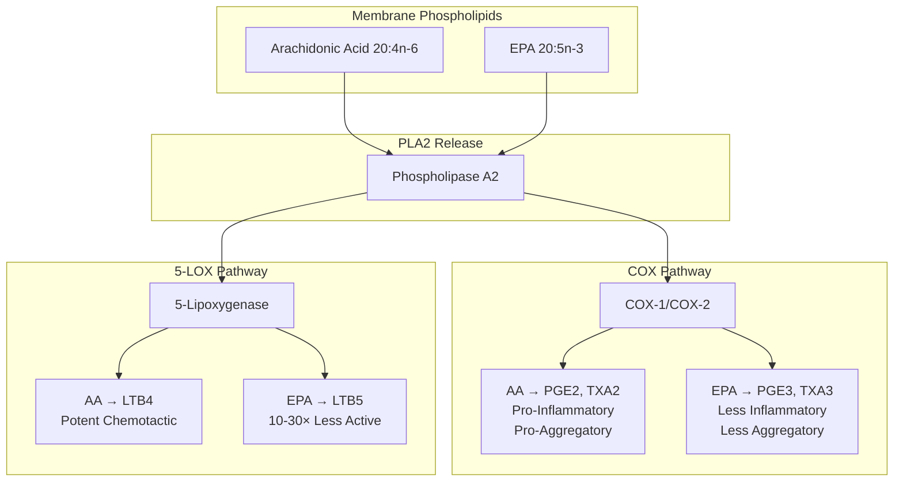
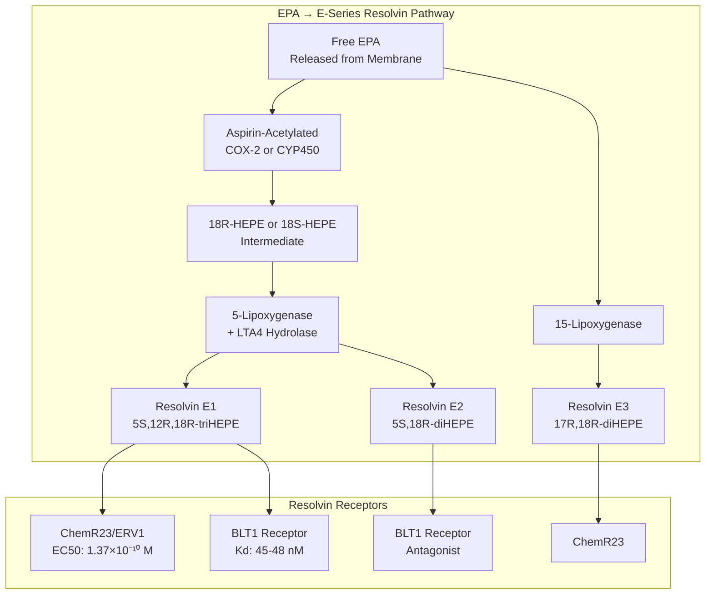
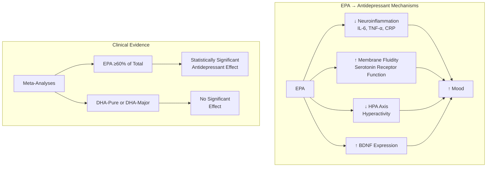
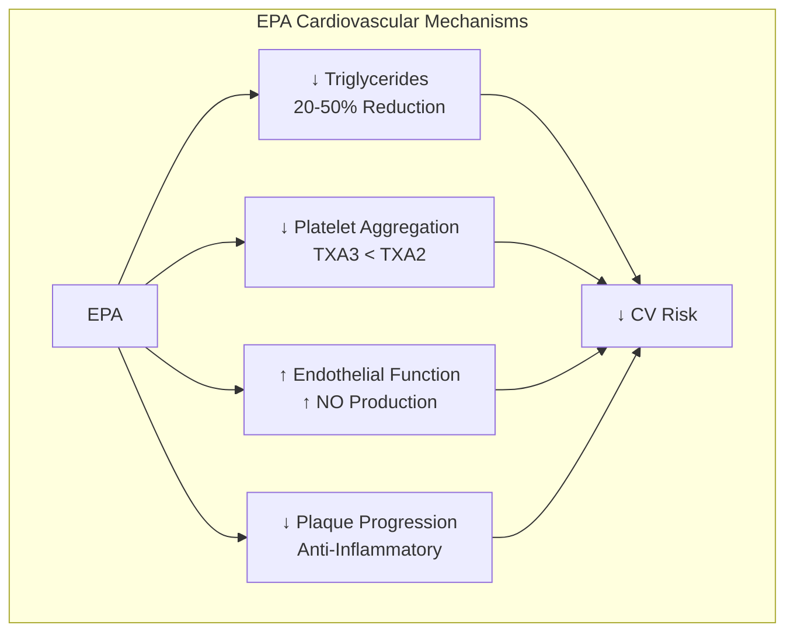
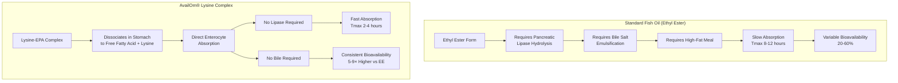
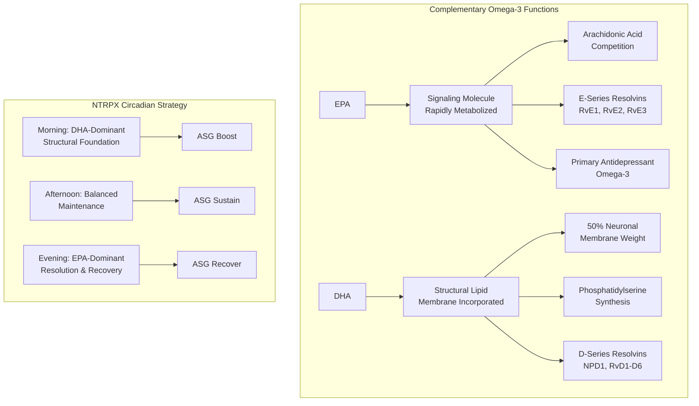
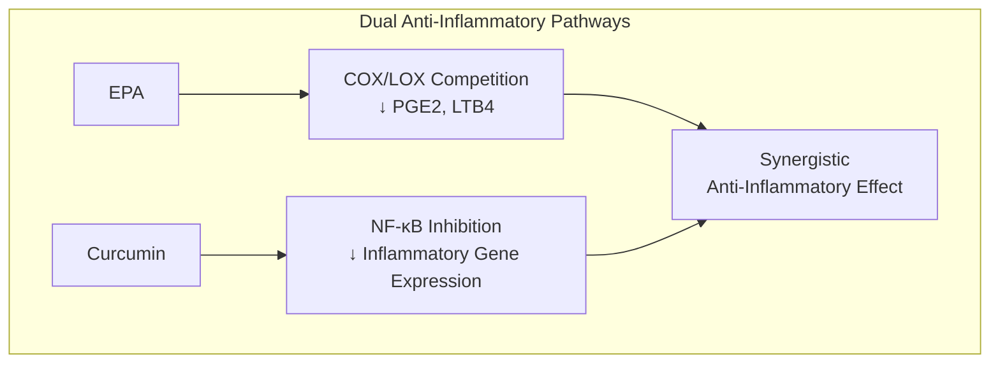
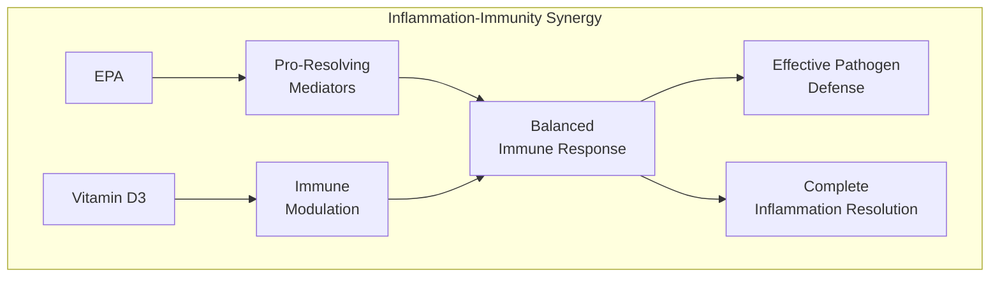
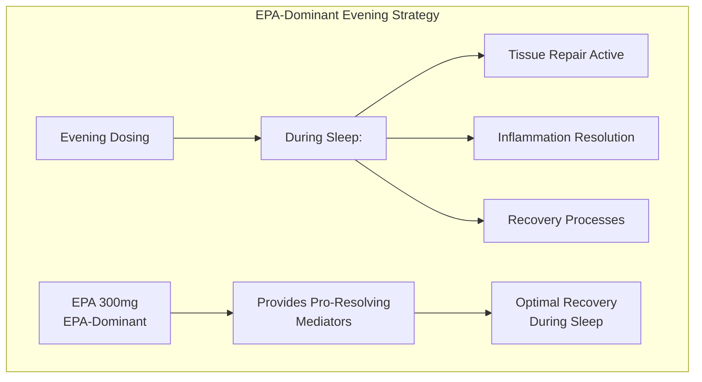

## ResolvePro EPA

<CardGroup cols={4}>

<Card title="Recover" icon="moon" color="#64748b">
300 mg EPA
</Card>

<Card title="Boost" icon="rocket-launch" color="#64748b">
300 mg EPA
</Card>

<Card title="Form" icon="flask-vial" color="#64748b">
AvailOm® 50 High EPA
</Card>

<Card title="Bioavailability" icon="chart-line" color="#64748b">
5-9× vs Ethyl Esters
</Card>

</CardGroup>

**The molecule that ends inflammation — the omega-3 fatty acid that competes directly with arachidonic acid to shift your body from pro-inflammatory to pro-resolving.** While DHA builds your neurons, EPA (eicosapentaenoic acid, 20:5n-3) actively *resolves* inflammation through competitive displacement of arachidonic acid from COX and LOX enzymes, producing anti-inflammatory eicosanoids instead of pro-inflammatory ones. But EPA's most remarkable property is its transformation into E-series resolvins (RvE1, RvE2, RvE3) — specialized pro-resolving mediators that don't merely *suppress* inflammation but actively *terminate* it through receptor-mediated resolution programs. EPA is also the only omega-3 with robust meta-analytic evidence for antidepressant efficacy — formulations with **≥60% EPA** consistently outperform DHA-dominant preparations in clinical trials. NTRPX uses AvailOm® 50 High EPA — a lysine-complexed free fatty acid form with **5-9× higher bioavailability** than standard fish oil — strategically concentrated in ASG Recover for evening resolution and ASG Boost for daytime anti-inflammatory support. In NTRPX, ResolvePro EPA delivers *the molecular machinery of inflammation termination*.

<AccordionGroup>

<Accordion title="Mechanism of Action" icon="flask">

EPA (all-cis-eicosa-5,8,11,14,17-pentaenoic acid) operates through four distinct but synergistic mechanisms:

### Mechanism 1: Arachidonic Acid Competition (Primary Anti-Inflammatory)

EPA's fundamental anti-inflammatory action stems from competitive displacement of arachidonic acid (AA) in eicosanoid synthesis:

| Enzyme | AA Product | EPA Product | Difference |
|--------|------------|-------------|------------|
| **COX-1/2** | PGE2 (pro-inflammatory) | PGE3 (weakly inflammatory) | PGE3 is 10× less potent |
| **COX-1** | TXA2 (pro-aggregatory) | TXA3 (weakly aggregatory) | TXA3 is 3× less potent |
| **COX-2** | PGI2 (vasodilator) | PGI3 (vasodilator) | Both vasodilatory |
| **5-LOX** | LTB4 (neutrophil chemotaxis) | LTB5 (weak chemotaxis) | LTB5 is 10-30× less active |

**The EPA:AA Ratio — A Marker of Inflammatory Status:**

| EPA:AA Ratio | Inflammatory Status | Clinical Implication |
|--------------|---------------------|---------------------|
| **\<0.1** | Highly pro-inflammatory | Western diet typical |
| **0.1–0.3** | Moderately inflammatory | Needs improvement |
| **0.3–0.5** | Balanced | Optimal range |
| **>0.5** | Anti-inflammatory dominant | Japanese diet typical |

**Key Finding (Wada et al., 2007, J Biol Chem):** EPA competes directly with AA for both the catalytic and allosteric sites of COX enzymes. When EPA occupies COX-2, the enzyme produces PGE3 instead of PGE2 — a 3-series prostaglandin that is dramatically less inflammatory. This competition is dose-dependent: as dietary EPA increases, membrane EPA content rises, the AA:EPA ratio falls, and the balance of eicosanoid production shifts from pro-inflammatory to neutral/anti-inflammatory.

### Mechanism 2: E-Series Resolvin Biosynthesis (Active Resolution)

EPA's most sophisticated action is serving as the precursor to E-series resolvins — specialized pro-resolving mediators that *actively terminate* inflammation:

| Resolvin | Complete Structure | Key Receptor | Primary Actions |
|----------|-------------------|--------------|-----------------|
| **RvE1** | 5S,12R,18R-trihydroxy-EPA | ChemR23, BLT1 | Stops neutrophil transmigration, enhances macrophage phagocytosis |
| **RvE2** | 5S,18R-dihydroxy-EPA | BLT1 (antagonist) | Blocks LTB4 signaling, reduces PMN infiltration |
| **RvE3** | 17R,18R-dihydroxy-EPA | ChemR23 | Potent neutrophil migration inhibition |

**Resolution vs. Suppression — A Critical Distinction:**

Traditional anti-inflammatory drugs (NSAIDs, corticosteroids) *suppress* the inflammatory response by blocking enzyme activity. This can impair healing and immune function. Resolvins work differently:

| Mechanism | Traditional NSAIDs | E-Series Resolvins |
|-----------|-------------------|-------------------|
| **Mode** | Enzyme inhibition (blockade) | Receptor-mediated (resolution program) |
| **Effect on neutrophils** | Blocks recruitment | Promotes apoptosis and efferocytosis |
| **Effect on macrophages** | Reduced function | Enhanced phagocytosis of debris |
| **Healing** | May impair | Actively promotes |
| **Potency** | Micromolar | *Picomolar-Nanomolar* |

**Resolvin E1 — Dual Receptor Mechanism:**

1. **ChemR23 Agonism:** Activates resolution programs on macrophages and dendritic cells
   - Enhances phagocytosis of apoptotic cells (efferocytosis)
   - Reduces IL-12 production
   - Promotes tissue repair signaling

2. **BLT1 Partial Agonism/Antagonism:** Blocks pro-inflammatory LTB4 signaling
   - Competes with LTB4 for receptor binding (Kd ~45-48 nM)
   - Attenuates neutrophil chemotaxis
   - Reduces NF-κB activation

### Mechanism 3: Antidepressant Effect (EPA-Specific)

EPA demonstrates robust antidepressant activity in clinical trials — an effect *not* consistently seen with DHA-dominant preparations:

**Meta-Analytic Evidence (Sublette et al., 2011; Liao et al., 2019):**

| Formulation | Effect Size | Significance | Conclusion |
|-------------|-------------|--------------|------------|
| **EPA ≥60% of total EPA+DHA** | SMD = 0.532 | p < 0.001 | **Effective** |
| **EPA-pure (100% EPA)** | SMD = -0.50 | p = 0.003 | **Effective** |
| **EPA-major (≥60%)** | SMD = -1.03 | p = 0.03 | **Effective** |
| **EPA \<60% of total** | SMD = -0.026 | p = 0.756 | Not effective |
| **DHA-pure** | No significant effect | — | Not effective |
| **DHA-major** | No significant effect | — | Not effective |

**Optimal Antidepressant Dosing:**
- EPA ≥60% of total EPA+DHA
- Dose range: 1-2g EPA/day
- As adjunct to standard antidepressants (more effective than monotherapy)
- Duration: 8-12 weeks minimum

**Why EPA Works Better Than DHA for Depression:**
1. **Superior neuroinflammation suppression** — EPA more effectively reduces inflammatory cytokines linked to depression
2. **Faster metabolism** — EPA is more rapidly converted to bioactive resolvins; DHA is structurally incorporated
3. **Differential receptor effects** — EPA-derived mediators may have stronger mood-relevant receptor activity

### Mechanism 4: Cardiovascular Protection

EPA provides multiple cardioprotective effects:

| CV Effect | Mechanism | Magnitude |
|-----------|-----------|-----------|
| **Triglyceride reduction** | ↓ VLDL synthesis, ↑ lipoprotein lipase | 20-50% at 2-4g/day |
| **Anti-thrombotic** | TXA3 vs TXA2; ↓ platelet aggregation | Clinically significant |
| **Anti-arrhythmic** | Membrane stabilization, ion channel effects | Reduced sudden death |
| **Endothelial function** | ↑ eNOS, ↑ NO bioavailability | Improved vasodilation |
| **Anti-inflammatory** | ↓ CRP, ↓ IL-6, resolvin production | 20-30% CRP reduction |

**REDUCE-IT Trial (2018):** Icosapent ethyl (purified EPA) at 4g/day reduced cardiovascular events by 25% compared to placebo in statin-treated patients with elevated triglycerides — demonstrating EPA's cardioprotective effects beyond triglyceride lowering.

### Molecular Identity

| Property | Value |
|----------|-------|
| **IUPAC Name** | (5Z,8Z,11Z,14Z,17Z)-icosa-5,8,11,14,17-pentaenoic acid |
| **Notation** | 20:5(n-3) or 20:5ω3 |
| **Synonyms** | Timnodonic acid, EPA |
| **Molecular Formula** | C₂₀H₃₀O₂ |
| **Molecular Weight** | 302.45 g/mol |
| **CAS Number** | 10417-94-4 |
| **Double Bonds** | 5 (all *cis* configuration) |
| **Melting Point** | -54°C (liquid at body temperature) |

</Accordion>

<Accordion title="AvailOm® Technology" icon="atom">

### The Bioavailability Problem

Traditional omega-3 supplements face fundamental absorption challenges that limit EPA delivery:

### AvailOm® 50 High EPA Specifications

| Parameter | Specification |
|-----------|---------------|
| **Form** | Omega-3 lysine complex powder |
| **EPA Content** | ≥30% free fatty acid by weight |
| **DHA Content** | ~15% free fatty acid by weight |
| **Total EPA+DHA** | ≥50% as free fatty acids |
| **Lysine Content** | ~14% L-lysine (essential amino acid) |
| **Appearance** | Free-flowing powder |
| **Stability** | >4 years at 25°C (no refrigeration required) |
| **Regulatory** | GRAS (FDA), NDI registered, Novel Food (EU) |

### Clinical Bioavailability Evidence

**Wageningen University Study (2020):**
- First in-human pharmacokinetic trial
- Crossover design: AvailOm® vs standard ethyl ester
- Result: **5× higher AUC** for AvailOm®
- Faster Tmax (peak reached earlier)

**BioTeSys Three-Way Crossover RCT (2024):**
- 21 healthy subjects (10 men, 11 women)
- Three-way crossover: AvailOm® vs EE vs TG
- Results:

| Comparison | 0-12h Bioavailability | 0-24h Bioavailability |
|------------|----------------------|----------------------|
| **AvailOm® vs Ethyl Ester** | **9.33× higher** | **8.09× higher** |
| **AvailOm® vs Triglyceride** | **1.57× higher** | **1.44× higher** |

### Why Lysine Complexation Works

1. **Ionic Stabilization:** Lysine (cationic amino acid) forms stable ionic complex with free fatty acid (anionic)
2. **Powder Format:** Creates stable, dry powder from liquid oil — no capsule required
3. **Gastric Dissociation:** Complex rapidly breaks down at gastric pH to release free EPA
4. **Direct Absorption:** Free fatty acids absorbed directly by enterocytes via fatty acid transport proteins
5. **Lipase-Independent:** Bypasses need for pancreatic lipase hydrolysis
6. **Bile-Independent:** Absorbs efficiently regardless of dietary fat or gallbladder function

### Bonus: L-Lysine Content

AvailOm® provides ~14% L-lysine by weight — an essential amino acid with its own benefits:

| Lysine Function | Relevance |
|-----------------|-----------|
| **Carnitine synthesis** | Required precursor; supports fat transport into mitochondria |
| **Collagen formation** | Structural protein synthesis |
| **Calcium absorption** | Enhances intestinal Ca²⁺ uptake |
| **Immune function** | Supports antibody production |
| **Daily AA requirements** | Contributes to essential amino acid intake |

</Accordion>

<Accordion title="Clinical Evidence" icon="microscope">

### EPA and Depression — The Definitive Evidence

Multiple meta-analyses confirm EPA's antidepressant efficacy:

**Sublette et al. (2011) — J Clin Psychiatry:**
- 15 RCTs, 916 participants
- Primary finding: EPA ≥60% showed significant benefit (effect size = 0.532, p < 0.001)
- EPA \<60% showed no benefit
- Dose range 200-2,200mg EPA in excess of DHA

**Liao et al. (2019) — Translational Psychiatry:**
- 26 RCTs, 2,160 participants
- EPA-pure (100% EPA): SMD = -0.50, p = 0.003
- EPA-major (≥60%): SMD = -1.03, p = 0.03
- DHA formulations: No significant effect

**Kelaiditis et al. (2023) — Prostaglandins Leukot Essent Fatty Acids:**
- 10 RCTs, 1,426 participants
- EPA ≥60%: SMD = -0.36, p = 0.02
- EPA 1-2g/day: SMD = -0.43, p = 0.02
- EPA ≥2g/day: Not more effective (plateau effect)

| Meta-Analysis | Finding | Clinical Implication |
|---------------|---------|---------------------|
| Sublette 2011 | EPA ≥60% effective; EPA \<60% not effective | Use EPA-dominant formulas |
| Liao 2019 | EPA-pure/major effective; DHA not effective | EPA is the active antidepressant |
| Kelaiditis 2023 | EPA 1-2g/day optimal; >2g/day not better | Dose ceiling exists |

### EPA and Inflammation

**Clinical Evidence for Anti-Inflammatory Effects:**

| Study | Population | EPA Dose | Inflammatory Marker | Result |
|-------|------------|----------|---------------------|--------|
| **Itariu et al. 2012** | Obese adults | 1.8g/day | Adipose TNF-α, IL-6 | Significant reduction |
| **Vedin et al. 2008** | AD patients | 1.7g EPA+0.6g DHA | Cytokines | Reduced inflammation |
| **Calder et al. 2020** | Meta-analysis | Various | CRP, IL-6 | Consistent reductions |

### EPA and Cardiovascular Outcomes

**REDUCE-IT Trial (Bhatt et al., 2019, NEJM):**
- 8,179 patients on statins with elevated TG
- Icosapent ethyl (purified EPA) 4g/day vs placebo
- Primary endpoint (CV death, MI, stroke, revascularization, unstable angina): **25% reduction** (HR 0.75, p < 0.001)
- Triglyceride reduction alone did not explain the benefit
- Supports EPA's pleiotropic cardioprotective effects

| REDUCE-IT Outcome | EPA Group | Placebo | Relative Risk Reduction |
|-------------------|-----------|---------|------------------------|
| **Primary endpoint** | 17.2% | 22.0% | 25% (p < 0.001) |
| **CV death** | 4.3% | 5.2% | 20% |
| **Myocardial infarction** | 6.1% | 8.7% | 31% |
| **Stroke** | 2.3% | 2.9% | 28% |

### EPA:AA Ratio and Clinical Outcomes

| EPA:AA Ratio | Associated Outcomes | Population |
|--------------|---------------------|------------|
| **\<0.1** | Highest CV event rate | Western populations |
| **0.3-0.5** | Optimal CV protection | Japanese populations |
| **>0.5** | Lowest CV event rate | High fish consumers |

**Clinical Implication:** Raising the EPA:AA ratio through EPA supplementation shifts inflammatory balance toward resolution.

### Resolvin Formation in Humans

**Welty et al. (2016):** Omega-3 supplementation in humans increases circulating RvE1, RvE2, and RvE3 levels — confirming that dietary EPA is converted to bioactive resolvins in vivo.

**Plasma EPA levels correlate with:**
- ↑ Circulating E-series resolvins
- ↓ Inflammatory cytokines (IL-6, TNF-α)
- ↓ High-sensitivity CRP
- Improved inflammatory resolution capacity

</Accordion>

<Accordion title="Synergies" icon="arrows-split-up-and-left">

### EPA + DHA (Complementary Omega-3s)

EPA and DHA serve fundamentally different but complementary roles:

| Property | EPA | DHA | NTRPX Strategy |
|----------|-----|-----|----------------|
| **Primary role** | Anti-inflammatory signaling | Structural membrane lipid | Both needed |
| **Metabolism** | Rapid conversion to eicosanoids/resolvins | Slow incorporation into phospholipids | EPA evening, DHA morning |
| **Depression** | Primary antidepressant omega-3 | No consistent antidepressant effect | EPA in Recover |
| **Brain structure** | Minor membrane role | 50% of neuronal membrane | DHA in Boost |
| **Resolvins** | E-series (RvE1-3) | D-series (RvD1-6, NPD1) | Both pathways active |

**NTRPX Omega-3 Distribution:**
- **Boost (AM):** 400mg DHA + 300mg EPA — Structural foundation + daytime anti-inflammatory
- **Sustain (PM):** 200mg DHA + 100mg EPA — Maintenance
- **Recover (PM):** 100mg DHA + 300mg EPA — **EPA-dominant** for evening resolution

### EPA + Curcumin (Anti-Inflammatory Synergy)

| Compound | Primary Target | Effect | Synergy Logic |
|----------|----------------|--------|---------------|
| **EPA** | COX/LOX enzymes | ↓ Eicosanoid production | Upstream block |
| **Curcumin** | NF-κB, AP-1 | ↓ Inflammatory gene transcription | Downstream block |
| **Combined** | Multiple pathways | Comprehensive inflammation control | Multiplicative |

### EPA + Aspirin (Resolvin Enhancement)

Aspirin acetylates COX-2, enabling the production of aspirin-triggered resolvins with enhanced stability:

| Without Aspirin | With Aspirin |
|-----------------|--------------|
| EPA → 18R-HEPE → RvE1 | EPA → 18S-HEPE → 18S-RvE1 |
| Standard resolvin | Aspirin-triggered resolvin |
| Normal activity | Higher receptor affinity (EC50 6.33×10⁻¹² M vs 1.37×10⁻¹⁰ M) |

**Clinical Implication:** Low-dose aspirin users may derive enhanced resolvin production from EPA supplementation.

### EPA + Vitamin D3 (Inflammation-Immunity Balance)

### EPA + Magnesium (Enzymatic Support)

| Magnesium Role | EPA Interaction |
|----------------|-----------------|
| **COX/LOX cofactor** | Magnesium required for proper enzyme function |
| **Anti-inflammatory** | Both reduce inflammatory markers |
| **Cardiovascular** | Complementary cardioprotective effects |
| **Mood support** | Both have independent mood benefits |

</Accordion>

<Accordion title="Dosing Strategy" icon="prescription-bottle">

### NTRPX EPA Distribution

| Product | EPA Dose | DHA Dose | Ratio | Timing Rationale |
|---------|----------|----------|-------|------------------|
| **ASG Boost™** | 300mg | 400mg | DHA-dominant | Morning structural foundation |
| **ASG Sustain™** | 100mg | 200mg | DHA-dominant | Afternoon maintenance |
| **ASG Recover™** | 300mg | 100mg | **EPA-dominant** | Evening resolution & recovery |
| **Daily Total** | **700mg** | **700mg** | 1:1 balanced | Comprehensive coverage |

### Why EPA-Dominant in Evening (Recover)?

| Timing | Dominant Omega-3 | Rationale |
|--------|------------------|-----------|
| **Morning** | DHA | Cognitive priming; structural foundation for day |
| **Afternoon** | DHA | Sustained membrane support |
| **Evening** | **EPA** | Resolution pathways; recovery during sleep |

### Effective Dose Equivalency

AvailOm® bioavailability advantage means lower doses achieve equivalent plasma levels:

| AvailOm® Dose | Equivalent Ethyl Ester Dose | Equivalent TG Dose |
|---------------|----------------------------|-------------------|
| 100mg EPA | 500-900mg EPA (EE) | 140-160mg EPA (TG) |
| 300mg EPA | 1,500-2,700mg EPA (EE) | 420-480mg EPA (TG) |
| 700mg EPA (daily) | **3,500-6,300mg** EPA (EE) | 980-1,120mg EPA (TG) |

**Implication:** NTRPX's 700mg EPA from AvailOm® delivers the equivalent plasma exposure of 3,500-6,300mg from standard fish oil softgels — well within the therapeutic range for anti-inflammatory and antidepressant effects.

### Evidence-Based Dosing by Indication

| Indication | EPA Dose | Duration | Evidence Level |
|------------|----------|----------|----------------|
| **General wellness** | 250-500mg | Ongoing | Strong |
| **Anti-inflammatory** | 500-1,000mg | Ongoing | Strong |
| **Adjunctive antidepressant** | 1,000-2,000mg | 8-12 weeks | Strong |
| **Cardiovascular (high risk)** | 2,000-4,000mg | Ongoing | Strong (REDUCE-IT) |
| **Triglyceride reduction** | 2,000-4,000mg | Ongoing | Strong |

### The 60% Rule for Depression

For antidepressant efficacy, EPA must comprise **≥60% of total EPA+DHA**:

| Formulation | EPA % | Antidepressant Efficacy |
|-------------|-------|------------------------|
| EPA-pure | 100% | **Effective** |
| EPA-major (NTRPX Recover ratio) | 75% | **Effective** |
| Balanced 1:1 | 50% | Marginal |
| DHA-major | \<40% | Not effective |
| DHA-pure | 0% | Not effective |

**NTRPX Recover:** 300mg EPA + 100mg DHA = **75% EPA** — optimal for antidepressant effect.

### Timing Considerations

| Timing | Rationale | NTRPX Implementation |
|--------|-----------|---------------------|
| **With food** | Enhanced absorption (less critical with AvailOm®) | Recommended with meals |
| **Evening for mood** | Aligns with sleep recovery; resolvin production | Recover (EPA-dominant) |
| **Split dosing** | Maintains stable plasma levels | Boost + Recover |
| **Consistency** | Membrane incorporation requires chronic dosing | Daily protocol |

</Accordion>

<Accordion title="Whole Foods Sources" icon="fish">

### EPA Content of Common Foods

| Food Source | Serving | EPA (mg) | DHA (mg) | Total ω-3 (mg) |
|-------------|---------|----------|----------|----------------|
| **Atlantic Mackerel** | 3 oz (85g) | 500 | 1,400 | 4,580* |
| **Herring** | 3 oz (85g) | 770 | 940 | 1,710 |
| **Anchovies** | 3 oz (85g) | 760 | 870 | 1,630 |
| **Atlantic Salmon (wild)** | 3 oz (85g) | 590 | 1,240 | 1,830 |
| **Atlantic Salmon (farmed)** | 3 oz (85g) | 590 | 1,090 | 1,680 |
| **Sardines (canned)** | 3 oz (85g) | 450 | 740 | 1,190 |
| **Rainbow Trout (farmed)** | 3 oz (85g) | 400 | 500 | 900 |
| **Albacore Tuna** | 3 oz (85g) | 200 | 530 | 730 |
| **Oysters (raw)** | 6 medium | 260 | 200 | 460 |
| **Cod** | 3 oz (85g) | 50 | 130 | 180 |

*Mackerel includes additional omega-3s beyond EPA+DHA

### Food Equivalents for NTRPX Daily EPA

To match NTRPX's 700mg EPA from AvailOm® (accounting for 5-9× bioavailability = **3,500-6,300mg equivalent**):

| Food Source | Amount Needed Daily | Practical? | Notes |
|-------------|---------------------|------------|-------|
| **Herring** | 15-27 oz (425-765g) | ✗ Impractical | Strong flavor |
| **Anchovies** | 15-26 oz (425-735g) | ✗ Impractical | Extremely salty |
| **Wild Salmon** | 20-35 oz (570-990g) | ✗ Impractical | $25-50/day cost |
| **Mackerel** | 23-42 oz (650-1,190g) | ✗ Impractical | Mercury concern |
| **Sardines** | 26-46 oz (735-1,300g) | ✗ Impractical | 7-13 cans/day |

**Reality Check:** Achieving equivalent EPA exposure through food alone is essentially impossible due to:
1. Standard fish absorption is 5-9× lower than AvailOm®
2. The sheer volume of fish required
3. Cost ($25-50/day for adequate amounts)
4. Mercury accumulation risk with large fish
5. Practical consumption limits

### Dietary Strategy for NTRPX Users

**Optimized Approach:** Use NTRPX omega-3s as reliable baseline; add whole food sources for additional benefits:

| Weekly Target | Rationale | Best Foods |
|---------------|-----------|------------|
| **2-3 fatty fish servings** | Provides nutrient matrix beyond omega-3s | Salmon, sardines, mackerel |
| **Small oily fish emphasis** | Lower mercury, higher EPA | Sardines, anchovies, herring |
| **Variety** | Additional minerals (selenium, iodine, zinc) | Oysters, mussels, wild-caught |

### Why EPA from Supplements Is Optimal

| Factor | Whole Fish | AvailOm® EPA |
|--------|------------|--------------|
| **Bioavailability** | Variable (20-60%) | Consistent (5-9× higher) |
| **Dose precision** | Difficult to calculate | Exact dosing |
| **Mercury risk** | Present in large fish | Purified, tested |
| **Cost** | $15-50/day for therapeutic dose | Included in NTRPX |
| **Convenience** | Preparation required | Ready to use |
| **Stability** | Oxidizes during cooking | >4 year shelf life |

### Plant Sources?

**Important:** Plants cannot provide EPA.

| Source | Omega-3 Type | Conversion to EPA | Practical EPA |
|--------|--------------|-------------------|---------------|
| **Flaxseed** | ALA | 5-10% conversion | Minimal |
| **Chia seeds** | ALA | 5-10% conversion | Minimal |
| **Walnuts** | ALA | 5-10% conversion | Minimal |
| **Hemp seeds** | ALA | 5-10% conversion | Minimal |

**Conversion Problem:** Humans convert ALA → EPA at only 5-10% efficiency (and ALA → DHA at \<0.5%). Plant sources cannot meaningfully contribute to EPA status. Direct EPA from marine sources (fish, algae) is required for therapeutic effects.

</Accordion>

<Accordion title="Safety & Classification" icon="shield-check">

### Adverse Event Profile

| Event | Incidence | Severity | Notes |
|-------|-----------|----------|-------|
| **Fishy aftertaste** | Rare with AvailOm® | Minimal | Lysine complex prevents |
| **GI upset** | Uncommon | Mild | Less than ethyl esters |
| **Loose stools** | Rare | Mild | High doses only |
| **Prolonged bleeding time** | Theoretical | N/A | Only at very high doses (>3g/day) |

At NTRPX doses (700mg EPA/day), adverse events are *uncommon and mild*.

### Safety Data

| Parameter | Finding | Source |
|-----------|---------|--------|
| **Human clinical (up to 4g/day)** | No serious adverse events | REDUCE-IT, multiple RCTs |
| **FDA GRAS** | Up to 3g/day EPA+DHA | FDA |
| **EFSA** | Up to 5g/day EPA+DHA | EFSA 2012 |
| **Bleeding risk** | Not clinically significant at ≤4g/day | Multiple meta-analyses |
| **LDL cholesterol** | Modest increase possible at high doses | Dose-dependent |
| **AvailOm® stability** | >4 years, low oxidation | Evonik data |

### Regulatory Status

| Region | Status | Notes |
|--------|--------|-------|
| **United States** | GRAS; dietary supplement | NDI registered |
| **European Union** | Novel Food approved | AvailOm® specifically |
| **Japan** | Food ingredient | Long history |
| **Canada** | NHP eligible | Licensed products |

### Drug Interactions

| Drug Class | Interaction | Severity | Recommendation |
|------------|-------------|----------|----------------|
| **Anticoagulants** (warfarin) | Additive bleeding risk | ★★★☆☆ | Monitor INR |
| **Antiplatelet** (aspirin, clopidogrel) | Additive effect | ★★☆☆☆ | Generally safe; may enhance aspirin-triggered resolvins |
| **Antihypertensives** | Additive BP lowering | ★☆☆☆☆ | May allow dose reduction |
| **Statins** | Complementary | ★☆☆☆☆ | Beneficial combination (REDUCE-IT used with statins) |
| **Antidepressants** | Complementary | ★☆☆☆☆ | EPA adjunctive to SSRIs more effective than either alone |

### Contraindications

| Category | Consideration | Severity |
|----------|---------------|----------|
| **Fish/shellfish allergy** | Use algal EPA alternative | ★★★★★ Absolute |
| **Scheduled surgery** | Consider stopping 1-2 weeks before | ★★★☆☆ Temporary |
| **Active bleeding** | Avoid until resolved | ★★★★☆ Temporary |

### Special Populations

| Population | Safety Status | Notes |
|------------|---------------|-------|
| **Healthy adults** | Excellent | Well-tolerated |
| **Cardiovascular patients** | Excellent | REDUCE-IT demonstrated safety |
| **Depression patients** | Excellent | Used as adjunct to antidepressants |
| **Pregnancy** | Safe | Less emphasized than DHA for fetal brain |
| **Elderly** | Excellent | May have enhanced benefit |

---

### <Icon icon="star" color="#64748b" /> Tier 1: Foundation

<CardGroup cols={3}>
<Card title="Efficacy" icon="check" color="#64748b">High — Unique resolution mechanism</Card>
<Card title="Validation" icon="check" color="#64748b">Strong — Multiple meta-analyses, REDUCE-IT trial</Card>
<Card title="Safety" icon="check" color="#64748b">Excellent — GRAS, extensive clinical data to 4g/day</Card>
</CardGroup>

**Tier Rationale:** Tier 1 (Foundation) classification. EPA is the master inflammation resolver — the only nutritional compound that both competes with arachidonic acid for eicosanoid synthesis *and* produces specialized pro-resolving mediators (E-series resolvins) that actively terminate inflammation through receptor-mediated resolution programs. Unlike anti-inflammatory drugs that suppress inflammation, EPA resolves it. EPA is also the only omega-3 with robust, consistent meta-analytic evidence for antidepressant efficacy (≥60% EPA formulations). The REDUCE-IT trial demonstrated EPA's cardiovascular benefits at 4g/day with a 25% reduction in CV events. AvailOm® technology provides 5-9× superior bioavailability over standard supplements. Safety is excellent — GRAS status, extensive clinical data including in cardiovascular patients on statins and antiplatelet therapy.

</Accordion>

<Accordion title="Practical Considerations" icon="clipboard-list">

### When to Use EPA

| Scenario | Expected Benefit | Protocol |
|----------|------------------|----------|
| **Inflammation management** | *High* | 500-1000mg daily, ongoing |
| **Adjunctive depression treatment** | *High* | 1000-2000mg (≥60% of total), 8-12 weeks |
| **Cardiovascular protection** | *High* | 500-2000mg daily, ongoing |
| **Recovery optimization** | *High* | 300-500mg evening dose |
| **General wellness** | Moderate-High | 250-500mg daily, ongoing |

### Realistic Expectations

| Timeframe | What to Expect |
|-----------|----------------|
| **Week 1-2** | Plasma EPA rising; resolvin production beginning |
| **Week 4** | Membrane EPA:AA ratio improving; inflammatory markers may decrease |
| **Week 8** | *Noticeable* — mood effects, inflammatory marker reductions |
| **Week 12+** | *Full effect* — sustained anti-inflammatory, mood benefits |

**Key Insight:** EPA works through both acute mechanisms (eicosanoid competition) and chronic remodeling (membrane ratio shifts). Anti-inflammatory effects begin within weeks; full mood benefits require 8-12 weeks.

### Signs It's Working

| Indicator | Description |
|-----------|-------------|
| **↓ Inflammation markers** | Reduced CRP, IL-6 (if measured) |
| **↑ Mood stability** | Improved emotional regulation |
| **↓ Joint stiffness** | Reduced inflammatory joint symptoms |
| **↑ Recovery** | Faster bounce-back from exercise/stress |
| **Improved energy** | Less fatigue from chronic inflammation |

### Optimizing Response

| Strategy | Rationale |
|----------|-----------|
| **Take with meals** | Enhanced absorption (less critical with AvailOm®) |
| **Evening emphasis** | Aligns with nighttime resolution/recovery |
| **Combine with DHA** | Complementary omega-3 actions |
| **Include curcumin** | Synergistic anti-inflammatory pathways |
| **Consistent daily use** | Membrane remodeling requires chronic dosing |
| **Low-dose aspirin users** | May enhance aspirin-triggered resolvin production |

### Frequently Asked Questions

<AccordionGroup>

<Accordion title="Why is EPA better for depression than DHA?">
Multiple meta-analyses consistently show EPA-dominant formulations (≥60% EPA) produce significant antidepressant effects, while DHA-dominant formulations do not. The mechanism isn't fully understood, but EPA more potently suppresses neuroinflammation (elevated in depression), is more rapidly converted to bioactive mediators, and may have different effects on serotonin receptor function. For depression specifically, EPA is the omega-3 to prioritize.
</Accordion>

<Accordion title="What does 'resolution' mean vs. 'suppression'?">
Traditional anti-inflammatories (NSAIDs, steroids) *suppress* inflammation by blocking enzymes or immune cells — but this can impair healing and create "unresolved" chronic inflammation. *Resolution* is the active, programmed termination of inflammation through specialized mediators (resolvins) that stop neutrophil infiltration, enhance macrophage cleanup of debris, and promote tissue repair. EPA produces resolvins that *resolve* inflammation properly.
</Accordion>

<Accordion title="Why is EPA concentrated in the evening product?">
NTRPX places EPA-dominant dosing (300mg EPA, 100mg DHA = 75% EPA) in ASG Recover because:
1. Tissue repair and recovery are active during sleep
2. Inflammation resolution aligns with circadian repair processes
3. EPA's signaling role (vs. DHA's structural role) is better suited to evening/recovery
4. The antidepressant effect may support restorative sleep
</Accordion>

<Accordion title="Can I take EPA with blood thinners?">
EPA has mild antiplatelet effects, so theoretical interaction exists. However, meta-analyses show no significant bleeding risk increase at doses up to 4g/day (REDUCE-IT used 4g/day with statin-treated patients, many on aspirin). At NTRPX doses (700mg/day), risk is minimal. Still, consult your physician and monitor INR if on warfarin.
</Accordion>

<Accordion title="How does the EPA:AA ratio work?">
Arachidonic acid (AA, omega-6) and EPA (omega-3) compete for the same enzymes (COX, LOX). When AA dominates, pro-inflammatory eicosanoids (PGE2, LTB4) predominate. When EPA increases, it displaces AA, producing less inflammatory mediators (PGE3, LTB5) plus pro-resolving resolvins. The EPA:AA ratio reflects this balance — higher ratio = more anti-inflammatory status. Western diets create ratios \<0.1; optimal is 0.3-0.5.
</Accordion>

<Accordion title="Is AvailOm® worth it over regular fish oil?">
Absolutely. Standard ethyl ester fish oil has 5-9× *lower* bioavailability than AvailOm®. You'd need 5-9 standard capsules to match one AvailOm® dose. Factor in superior stability (no refrigeration, 4+ year shelf life), absence of fishy burps, and consistent absorption regardless of meal fat content — AvailOm® is the superior technology for delivering therapeutic EPA levels.
</Accordion>

<Accordion title="Should I take EPA if I'm not depressed?">
Yes — EPA's benefits extend far beyond depression. Its anti-inflammatory, cardioprotective, and pro-resolving effects benefit anyone with chronic low-grade inflammation (most adults), cardiovascular risk factors, or simply pursuing optimal health. Depression studies demonstrate EPA's efficacy most dramatically, but the resolution mechanisms benefit broad populations.
</Accordion>

<Accordion title="What about plant-based EPA?">
There is no plant-based EPA. Plants contain ALA (alpha-linolenic acid), which humans convert to EPA at only 5-10% efficiency — far too low for therapeutic benefit. If avoiding fish, algae-derived EPA supplements exist (algae is where fish accumulate their omega-3s originally).
</Accordion>

</AccordionGroup>

</Accordion>

</AccordionGroup>

---

<Tip>
**ResolvePro Summary:** EPA (Eicosapentaenoic Acid) at 700mg daily via AvailOm® 50 High EPA is the *master inflammation resolver* — the omega-3 that competes directly with arachidonic acid for COX/LOX enzymes while producing E-series resolvins (RvE1, RvE2, RvE3) that actively terminate inflammation through receptor-mediated resolution programs. With 5-9× superior bioavailability over standard fish oil, AvailOm® ensures therapeutic EPA delivery. Multiple meta-analyses confirm EPA (≥60% of total omega-3) as the *only* omega-3 with consistent antidepressant efficacy. The REDUCE-IT trial demonstrated 25% cardiovascular event reduction with purified EPA. In NTRPX ASG Recover (EPA-dominant evening formula) and ASG Boost, ResolvePro EPA delivers *the molecular machinery to end inflammation and support recovery*.
</Tip>

---

<Note>
**Version:** 1.0 | **Last Updated:** January 23, 2026 | **Document Status:** Complete Clinical Monograph

This monograph establishes the EPA framework for NTRPX Systems. AvailOm® 50 High EPA has been selected as the gold-standard delivery form based on superior bioavailability (5-9× vs ethyl esters), stability (>4 years), and clinical validation. The EPA-dominant formulation in ASG Recover (75% EPA) is specifically designed to meet the ≥60% EPA threshold validated for antidepressant efficacy while supporting evening resolution and recovery processes.
</Note>