## GlyciWave Glycine

<CardGroup cols={4}>

<Card title="Neuraldrink™" icon="glass-water" color="#5A8FA8">
3,000 mg (3g)
</Card>

<Card title="Clinical Dose" icon="flask-vial" color="#5A8FA8">
Research-Validated
</Card>

<Card title="Form" icon="droplet" color="#5A8FA8">
Pharmaceutical-Grade Powder
</Card>

<Card title="Solubility" icon="water" color="#5A8FA8">
Excellent (Beverage-Ready)
</Card>

</CardGroup>

**The amino acid that cools you into sleep and powers you through tomorrow.** Glycine is the simplest amino acid by structure, yet one of the most profoundly versatile in function. At the clinical dose of 3 grams — precisely what Neuraldrink delivers — glycine initiates a *thermoregulatory cascade* that lowers core body temperature by ~0.3°C, signaling the brain that it's time to sleep. But this is just the beginning: glycine also acts as an inhibitory neurotransmitter (promoting calm), an NMDA receptor co-agonist (supporting learning and memory), and a precursor to glutathione (the body's master antioxidant). Clinical trials demonstrate that 3g glycine before bed *shortens sleep latency*, *improves sleep efficiency*, and — remarkably — *enhances next-day cognitive performance* and reduces fatigue. Its natural sweetness and exceptional water solubility make glycine the ideal functional beverage ingredient. In Neuraldrink, GlyciWave Glycine transforms your evening ritual into a scientifically-validated pathway to better sleep *and* sharper mornings.

<AccordionGroup>

<Accordion title="Mechanism of Action" icon="flask">

Glycine exerts its effects through four distinct but interconnected mechanisms:

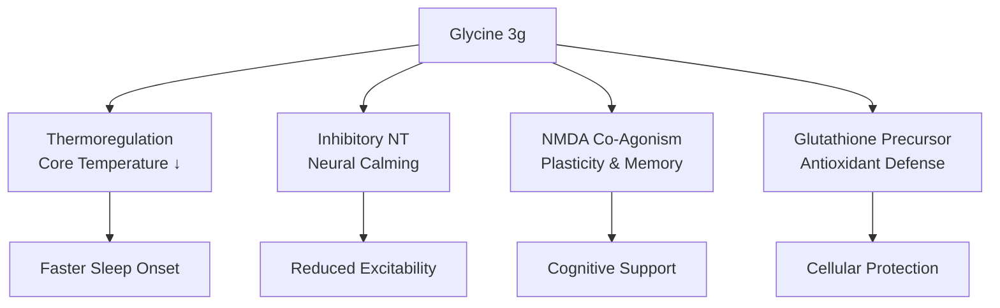

### Mechanism 1: Thermoregulatory Cascade (Primary Sleep Mechanism)

This is glycine's most distinctive mechanism — and the key to its sleep-promoting effects:

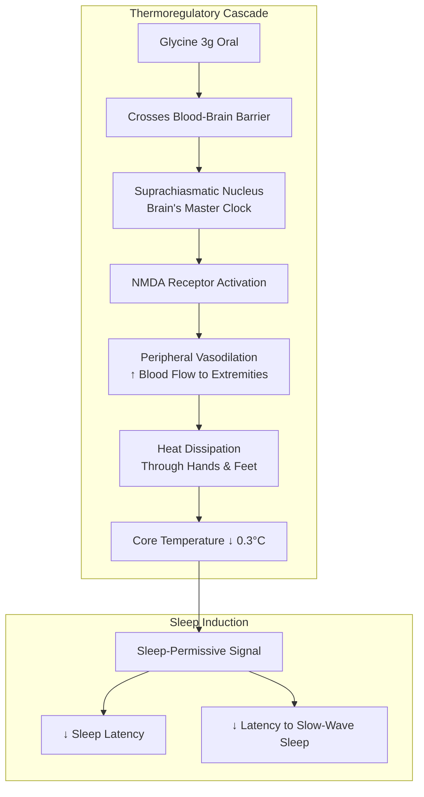

| Step | Physiological Event | Magnitude |
|------|---------------------|-----------|
| 1. Absorption | Glycine crosses BBB | Within 30-60 min |
| 2. SCN activation | NMDA receptors in suprachiasmatic nucleus | Dose-dependent |
| 3. Vasodilation | Peripheral blood vessel dilation | Measurable ↑ blood flow |
| 4. Heat dissipation | Heat loss through extremities | ~0.28-0.3°C drop |
| 5. Sleep signal | Core cooling triggers sleep onset | Faster sleep latency |

**Why temperature matters for sleep:**
The body naturally cools by 1-2°C during sleep onset. This temperature drop is not merely *correlated* with sleep — it's *causally involved* in initiating it. Glycine accelerates this natural process by activating peripheral heat loss mechanisms.

### Mechanism 2: Inhibitory Neurotransmission

Glycine is a major inhibitory neurotransmitter in the brainstem and spinal cord:

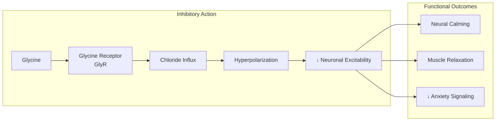

| Parameter | Effect |
|-----------|--------|
| **Receptor** | Glycine Receptor (GlyR) — chloride channel |
| **Ion movement** | Cl⁻ influx → hyperpolarization |
| **Net effect** | *Reduced neuronal firing* |
| **Brain regions** | Brainstem, spinal cord, retina |
| **Functional outcome** | Calming, muscle relaxation |

### Mechanism 3: NMDA Receptor Co-Agonism

Glycine has a *dual role* — it's also an obligatory co-agonist at excitatory NMDA receptors:

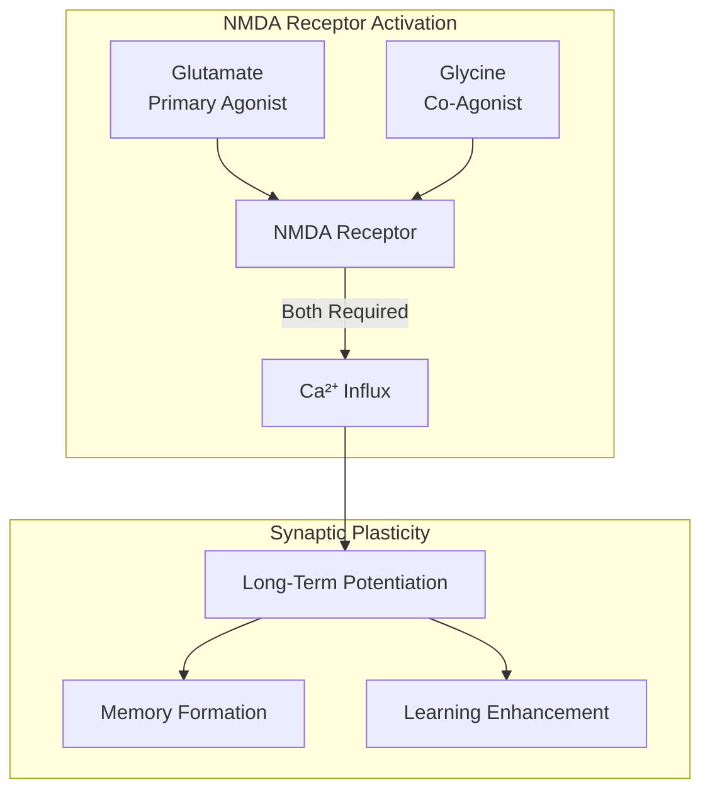

| NMDA Function | Glycine's Role | Cognitive Relevance |
|---------------|----------------|---------------------|
| **Receptor activation** | Required co-agonist | Enables NMDA function |
| **Calcium influx** | Modulates magnitude | Signal strength |
| **LTP induction** | Facilitates | *Memory consolidation* |
| **Synaptic plasticity** | Supports | *Learning capacity* |

**The dual role paradox:** How can glycine be both *inhibitory* (calming) and *excitatory* (NMDA co-agonist)? The answer lies in *location* and *receptor type*:
- **GlyR receptors** (inhibitory): Predominant in brainstem/spinal cord → calming
- **NMDA receptors** (excitatory): Predominant in cortex/hippocampus → cognition

This dual action allows glycine to *calm the body* while *supporting cognitive function*.

### Mechanism 4: Glutathione Precursor

Glycine is one of three amino acids required to synthesize glutathione:

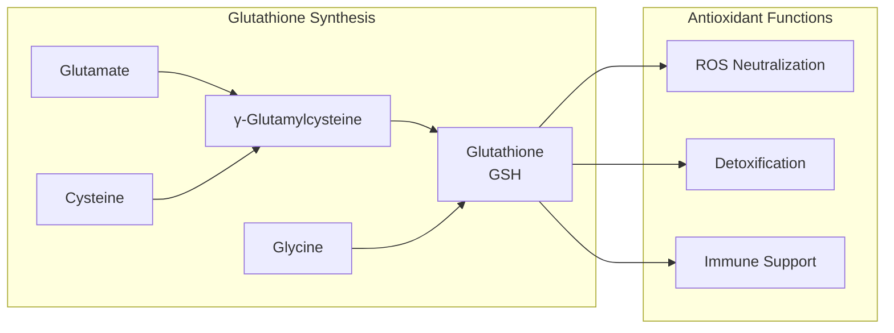

| GSH Component | Source | Limiting Factor |
|---------------|--------|-----------------|
| Glutamate | Abundant | Rarely limiting |
| Cysteine | Diet, NAC | Often limiting |
| **Glycine** | Diet, synthesis | *Can be limiting* |

Glycine availability can be rate-limiting for glutathione synthesis, especially in:
- Low-protein diets
- Elderly individuals
- High oxidative stress states

### Complete Mechanism Summary

| Mechanism | Receptor/Target | Effect | Timeline |
|-----------|-----------------|--------|----------|
| **Thermoregulation** | NMDA (SCN) | Core temp ↓ 0.3°C | 30-60 min |
| **Inhibitory NT** | GlyR | Neural calming | Acute |
| **NMDA co-agonism** | NMDA-R | LTP, plasticity | Acute + chronic |
| **GSH precursor** | Synthesis pathway | Antioxidant ↑ | Chronic |

</Accordion>

<Accordion title="The Thermoregulation Deep Dive" icon="temperature-low">

### Why Temperature Is the Master Sleep Switch

The relationship between body temperature and sleep is one of the most fundamental in chronobiology:

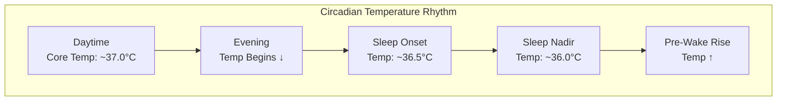

| Time | Core Temperature | Sleep State |
|------|------------------|-------------|
| Afternoon | ~37.0-37.2°C | Peak alertness |
| Evening | ~36.8°C | Winding down |
| **Sleep onset** | **~36.5°C** | *Sleep-permissive* |
| Sleep nadir | ~36.0°C | Deep sleep |
| Pre-wake | Rising | Preparation for waking |

**The 0.3°C threshold:** Research shows that a drop of approximately 0.3°C in core temperature is associated with sleep onset. Glycine *accelerates* this natural drop.

### The SCN Connection

The suprachiasmatic nucleus (SCN) is the brain's master circadian clock:

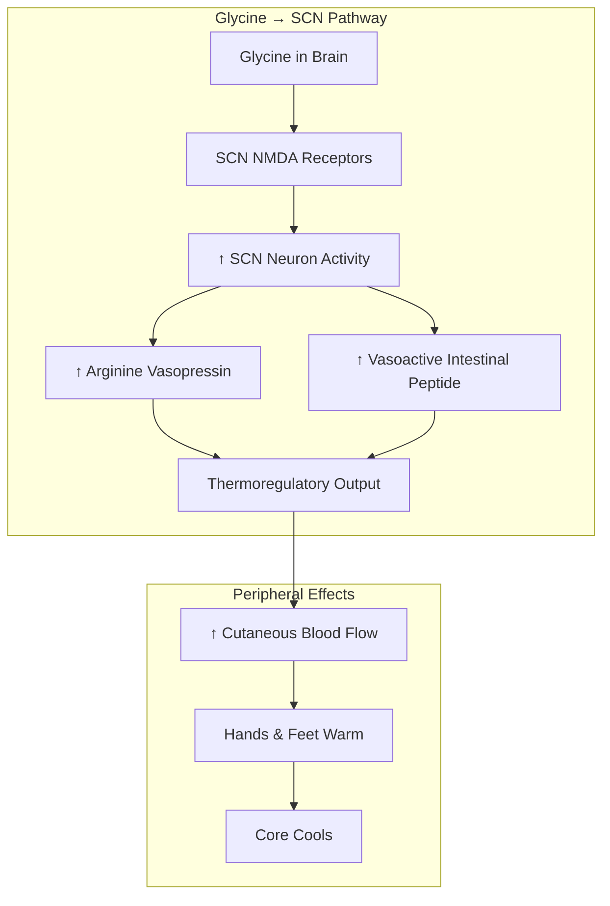

**Key research findings:**
- Glycine activates NMDA receptors in the SCN (Kawai et al., 2015)
- NMDA antagonists (AP5, CGP78608) *block* glycine's temperature effects
- Glycine receptor antagonists (strychnine) do *not* block the effect
- This confirms the *NMDA-mediated* thermoregulatory mechanism

### Cutaneous Blood Flow Evidence

| Measurement | Placebo | Glycine 3g | Change |
|-------------|---------|------------|--------|
| **Plantar blood flow** | Baseline | ↑ Significant | Dose-dependent |
| **Core temperature** | 36.8°C | 36.5°C | *−0.28°C* |
| **Sleep latency** | 13.5 min | 10.7 min | *−21%* |

### Why This Mechanism Is Superior

| Sleep Aid | Mechanism | Morning After |
|-----------|-----------|---------------|
| Benzodiazepines | GABA-A agonism | Grogginess, impairment |
| Z-drugs | GABA-A agonism | Potential hangover |
| Antihistamines | H1 blockade | Significant impairment |
| **Glycine** | *Natural thermoregulation* | **Enhanced cognition** |

Glycine works *with* the body's natural sleep architecture rather than *overriding* it. This explains why glycine improves next-day performance rather than impairing it.

</Accordion>

<Accordion title="Sleep Research Evidence" icon="moon">

### The Japanese Sleep Studies

The foundational research on glycine and sleep comes from Ajinomoto's research program in Japan:

```mermaid
flowchart TB
    subgraph STUDIES["Key Clinical Studies"]
        INAGAWA[Inagawa 2006<br>Subjective Sleep Quality]
        YAMADERA[Yamadera 2007<br>PSG + Cognition]
        BANNAI[Bannai 2012<br>Sleep Restriction]
        KAWAI[Kawai 2015<br>Mechanism (SCN)]
    end
    
    subgraph FINDINGS["Consistent Findings"]
        INAGAWA --> F1[↑ Subjective Quality]
        YAMADERA --> F2[↓ Sleep Latency<br>↓ SWS Latency<br>↑ Next-Day Cognition]
        BANNAI --> F3[↓ Daytime Fatigue<br>↑ Alertness]
        KAWAI --> F4[NMDA-SCN Mechanism<br>Confirmed]
    end
```

### Yamadera 2007 — The Landmark Study

| Parameter | Design |
|-----------|--------|
| **Population** | 11 adults with chronic sleep dissatisfaction |
| **Intervention** | 3g glycine vs placebo, before bedtime |
| **Measurements** | PSG, subjective sleep quality, daytime cognition |
| **Design** | Randomized, double-blind, placebo-controlled, crossover |

**Results:**

| Outcome | Placebo | Glycine | P-value |
|---------|---------|---------|---------|
| **Sleep latency** | 13.5 ± 3.2 min | 10.7 ± 2.8 min | *\<0.05* |
| **Latency to SWS** | 7.4 ± 2.5 min | 5.8 ± 2.2 min | *\<0.05* |
| **Sleep efficiency** | 89.2% | 92.1% | *\<0.05* |
| **Subjective quality** | — | Significantly improved | *\<0.05* |

**Crucially:** Sleep architecture (REM/NREM proportions) was *preserved* — glycine doesn't distort natural sleep stages.

### Bannai 2012 — Sleep Restriction Model

| Parameter | Design |
|-----------|--------|
| **Model** | 25% sleep restriction (6h instead of 8h) |
| **Intervention** | 3g glycine before restricted sleep |
| **Outcomes** | Next-day fatigue, sleepiness, performance |

**Results:**

| Outcome | Without Glycine | With Glycine | Improvement |
|---------|-----------------|--------------|-------------|
| **Daytime fatigue** | High | Reduced | *~15%* |
| **Sleepiness (SSS)** | Elevated | Reduced | *~29%* |
| **Alertness** | Impaired | Improved | Significant |

### Next-Day Cognitive Benefits

This is what makes glycine unique among sleep aids:

| Cognitive Domain | Effect | Study |
|------------------|--------|-------|
| **Memory recognition** | ↑ Improved | Yamadera 2007 |
| **Word recall** | ↑ Improved | Multiple |
| **Reaction time** | Maintained/improved | Bannai 2012 |
| **Subjective clarity** | "Clear-headedness" ↑ | Yamadera 2007 |
| **"Liveliness and peppiness"** | ↑ Reported | Yamadera 2007 |

### Effect Timeline

| Night | Sleep Effect | Next-Day Effect |
|-------|--------------|-----------------|
| Night 1 | Often noticeable | Subtle |
| Night 3-5 | Consistent improvement | Building |
| Night 7+ | *Full effect* | *Maximal cognitive benefit* |

<Note>
**The Glycine Paradox Resolved:** Unlike sedative sleep aids that impair next-day function, glycine *improves* it. This is because glycine works through natural thermoregulation rather than GABA-A sedation, preserving sleep architecture and cognitive function.
</Note>

</Accordion>

<Accordion title="Glutathione & Cellular Protection" icon="shield-halved">

### Glycine as a Glutathione Precursor

Glutathione (GSH) is the body's "master antioxidant" — and glycine is essential for its synthesis:

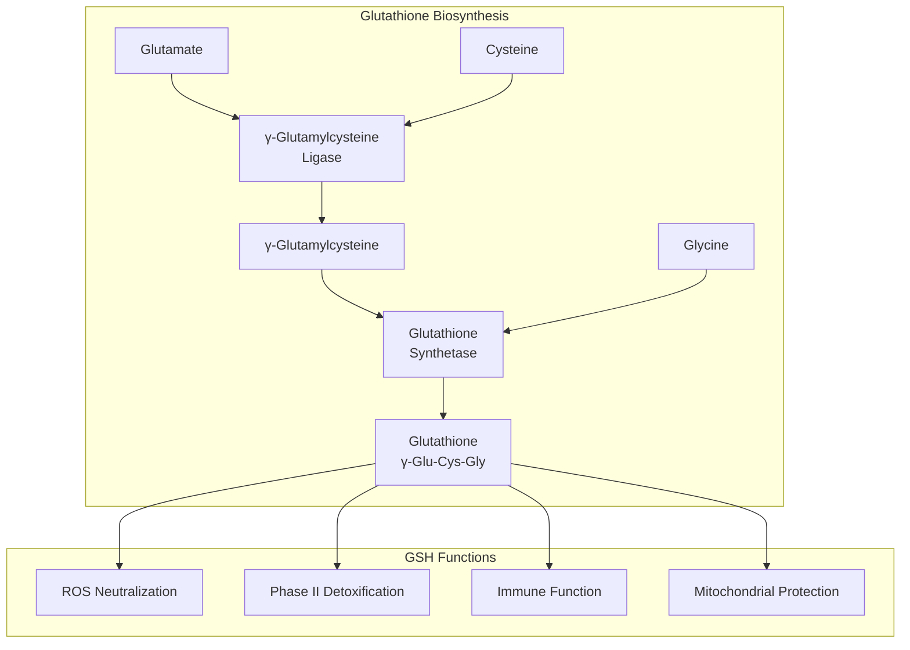

### Why Glycine Matters for GSH

| Factor | Implication |
|--------|-------------|
| **Rate-limiting** | Glycine can limit GSH synthesis |
| **Age-related decline** | Elderly have lower glycine and GSH |
| **Dietary insufficiency** | Modern diets often low in glycine |
| **High demand states** | Oxidative stress depletes GSH |

### The GlyNAC Research

Combining Glycine + N-Acetylcysteine (GlyNAC) has shown remarkable effects:

| Study (Kumar et al.) | Finding |
|---------------------|---------|
| **Population** | Older adults |
| **Intervention** | Glycine + NAC supplementation |
| **GSH levels** | *Restored to young adult levels* |
| **Oxidative stress** | Significantly reduced |
| **Mitochondrial function** | Improved |

### Antioxidant Cascade

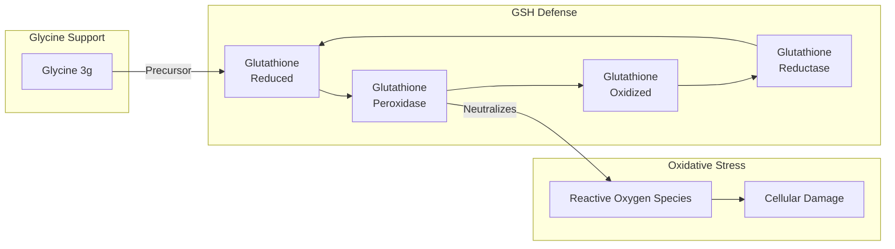

### Beyond Antioxidant: Glycine's Protective Roles

| Protective Function | Mechanism | Evidence |
|--------------------|-----------|----------|
| **Anti-inflammatory** | ↓ NF-κB, ↓ TNF-α, IL-6 | Multiple studies |
| **Hepatoprotective** | GSH support, direct effects | Animal + human data |
| **Cytoprotective** | Membrane stabilization | Established |
| **Neuroprotective** | GSH + NMDA modulation | Emerging |

### Metabolic Benefits

Glycine has additional metabolic effects beyond antioxidant support:

| Metabolic Effect | Mechanism | Relevance |
|------------------|-----------|-----------|
| **Insulin sensitivity** | ↑ Glucose uptake | Metabolic health |
| **Lipid metabolism** | Bile acid conjugation | Digestion, cholesterol |
| **One-carbon metabolism** | Serine-glycine interconversion | Methylation, DNA synthesis |

</Accordion>

<Accordion title="Beverage Formulation Advantages" icon="glass-water">

### Why Glycine Is Perfect for Neuraldrink

Glycine possesses ideal properties for functional beverage formulation:

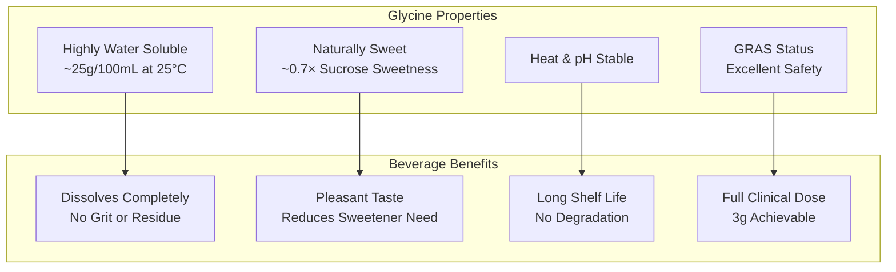

### Solubility Comparison

| Ingredient | Solubility (g/100mL) | Beverage Suitability |
|------------|---------------------|---------------------|
| **Glycine** | **~25** | ***Excellent*** |
| L-Theanine | ~5 | Good |
| Magnesium glycinate | ~10 | Good |
| L-Tyrosine | ~0.5 | Poor |
| Creatine | ~1.5 | Moderate |

### Taste Profile

| Property | Value | Beverage Implication |
|----------|-------|---------------------|
| **Sweetness** | ~0.7× sucrose | *Reduces added sweetener* |
| **Aftertaste** | None | *Clean finish* |
| **Bitterness** | None | *No masking needed* |
| **Umami** | Slight | *Depth of flavor* |

The name "glycine" derives from Greek *glykys* meaning "sweet" — discovered in 1820 when Henri Braconnot noted its sweet taste.

### Stability

| Condition | Stability | Notes |
|-----------|-----------|-------|
| **Heat** | Excellent | Survives pasteurization |
| **pH 3-8** | Excellent | Stable across beverage range |
| **Light** | Excellent | No photodegradation |
| **Oxidation** | Excellent | Not susceptible |
| **Shelf life** | 2+ years | As powder; extended in formulation |

### Clinical Dose Delivery

The 3g clinical dose is easily achieved in beverage format:

| Format | Typical Volume | Glycine Concentration | Palatability |
|--------|---------------|----------------------|--------------|
| **Neuraldrink** | 250-350 mL | ~1% w/v | *Excellent* |
| Shot | 60 mL | ~5% w/v | Good |
| Powder sachet | Reconstituted | Variable | Excellent |

### Synergy in Neuraldrink

Glycine complements other Neuraldrink ingredients:

| Ingredient | Glycine Synergy | Combined Benefit |
|------------|-----------------|------------------|
| **L-Theanine** | Both promote calm | *Enhanced relaxation* |
| **Magnesium** | Both support NMDA function | *Sleep + cognitive* |
| **Electrolytes** | Glycine aids absorption | *Hydration support* |

<Note>
**Formulation Excellence:** Glycine's exceptional solubility (~25g/100mL), natural sweetness, and complete stability make it one of the most beverage-compatible bioactives available. The clinical 3g dose dissolves instantly and contributes pleasant sweetness without any off-flavors.
</Note>

</Accordion>

<Accordion title="Pharmacokinetic Profile" icon="chart-line">

### ADME Parameters

| Parameter | Value | Notes |
|-----------|-------|-------|
| **Bioavailability** | High (oral) | Efficient intestinal absorption |
| **Tmax** | ~1-2 hours | Peak plasma levels |
| **BBB penetration** | Yes | Crosses via transporters |
| **CSF accumulation** | Yes | Distributes to brain |
| **Half-life** | ~3-4 hours | Moderate duration |
| **Metabolism** | Multiple pathways | Serine conversion, GSH, etc. |
| **Excretion** | Renal (minimal unchanged) | Extensively metabolized |

### Absorption and Distribution

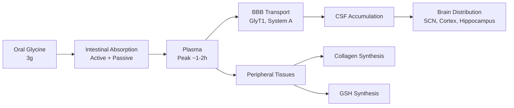

### Plasma and Effect Timeline

| Time After Dose | Plasma Level | CNS Level | Functional Effect |
|-----------------|--------------|-----------|-------------------|
| 0 min | Baseline | Baseline | None |
| 30 min | Rising | Rising | Minimal |
| 60 min | Near peak | Rising | Thermoregulation begins |
| 90 min | Peak | Peak | *Sleep-promoting effect* |
| 2-4 hours | Declining | Sustained | Sleep maintenance |
| Next morning | Low | Residual | *Cognitive enhancement* |

### Optimal Timing

| Scenario | Timing | Rationale |
|----------|--------|-----------|
| **Sleep optimization** | 30-60 min before bed | Peak effect at sleep onset |
| **Neuraldrink** | 1 hour before bed | Allows absorption time |
| **With meal** | Acceptable | Slightly delayed absorption |
| **Empty stomach** | Preferred | Faster absorption |

### Dose-Response

| Dose | Effect Level | Evidence |
|------|--------------|----------|
| 1 g | Mild | Limited clinical data |
| **3 g** | *Optimal* | **Clinical validation** |
| 5-9 g | Strong | Some studies |
| 30+ g | High-dose (psychiatric) | Schizophrenia research |

The 3g dose represents the sweet spot: clinically validated, achievable in beverages, and free of side effects.

</Accordion>

<Accordion title="Quality Specification" icon="certificate">

### GlyciWave Glycine Specification

| Attribute | Specification | Method |
|-----------|---------------|--------|
| **Identity** | Glycine (Aminoacetic acid) | HPLC, FTIR |
| **Assay** | **≥99.0%** | HPLC |
| **Appearance** | White crystalline powder | Visual |
| **Solubility** | Freely soluble in water | Functional |
| **pH (5% solution)** | 5.5-7.0 | Potentiometric |
| **Loss on drying** | ≤0.5% | Gravimetric |
| **Residue on ignition** | ≤0.1% | Gravimetric |
| **Chloride** | ≤0.02% | Limit test |
| **Sulfate** | ≤0.02% | Limit test |
| **Heavy metals (total)** | ≤10 ppm | ICP-MS |
| **Lead** | ≤1 ppm | ICP-MS |
| **Arsenic** | ≤1 ppm | ICP-MS |
| **Mercury** | ≤0.1 ppm | ICP-MS |
| **Microbial (TPC)** | ≤100 CFU/g | USP &lt;61&gt; |
| **Yeast & Mold** | ≤10 CFU/g | USP &lt;61&gt; |
| **E. coli** | Absent | USP &lt;62&gt; |
| **Salmonella** | Absent | USP &lt;62&gt; |

### Molecular Identity

| Property | Value |
|----------|-------|
| IUPAC Name | Aminoacetic acid |
| Synonyms | Glycine, Gly, G |
| Molecular Formula | C₂H₅NO₂ |
| Molecular Weight | 75.07 g/mol |
| CAS Number | 56-40-6 |
| Structure | NH₂-CH₂-COOH |

### Manufacturing

| Parameter | Specification |
|-----------|---------------|
| **Grade** | Pharmaceutical / USP-NF |
| **Synthesis** | Fermentation or chemical |
| **Purification** | Crystallization |
| **Testing** | Full CoA each batch |

### Why ≥99% Purity

| Purity Level | Application | NTRPX Standard |
|--------------|-------------|----------------|
| 98% | Food grade | Below standard |
| **≥99%** | *Pharmaceutical grade* | **NTRPX standard** |
| 99.5%+ | Ultra-pure | Premium |

### Stability

| Condition | Stability | Shelf Life |
|-----------|-----------|------------|
| Powder (sealed) | Excellent | 3+ years |
| Solution (pH 5-7) | Excellent | Stable |
| Heat (pasteurization) | Excellent | No degradation |
| Light | Excellent | No photosensitivity |

</Accordion>

<Accordion title="Dosing Rationale" icon="capsules">

### The 3 Gram Standard

Clinical research consistently uses 3g glycine for sleep benefits:

| Study | Dose | Outcome |
|-------|------|---------|
| Inagawa 2006 | 3g | ↑ Subjective sleep quality |
| Yamadera 2007 | 3g | ↓ Sleep latency, ↑ cognition |
| Bannai 2012 | 3g | ↓ Fatigue, ↑ alertness |
| Kawai 2015 | 3g equivalent | Mechanism confirmed |

### Neuraldrink Protocol

| Product | Glycine Content | Context | Timing |
|---------|-----------------|---------|--------|
| **Neuraldrink** | **3,000 mg (3g)** | Evening beverage | 30-60 min before bed |

### Dose-Response Analysis

| Dose | Sleep Effect | Cognitive Effect | Practicality |
|------|--------------|------------------|--------------|
| 1 g | Mild | Minimal | Easy |
| **3 g** | *Clinically validated* | *Enhanced next-day* | **Optimal for beverage** |
| 5-9 g | Strong | Unknown | Large volume needed |
| 30+ g | Psychiatric application | Different indication | Not for sleep |

### Why 3g Is the "Goldilocks Dose"

| Factor | Rationale |
|--------|-----------|
| **Clinical validation** | All positive sleep studies used 3g |
| **Thermoregulation threshold** | Sufficient for 0.3°C temperature drop |
| **Beverage compatibility** | Easily dissolved in 250-350 mL |
| **Safety** | No adverse events at this dose |
| **Taste** | Pleasant sweetness, not excessive |

### Timing Optimization

| Timing | Effect |
|--------|--------|
| **30 min before bed** | Optimal — peak effect at sleep onset |
| 60 min before bed | Good — allows full absorption |
| 2 hours before bed | Acceptable — peak may be early |
| With dinner | Delayed absorption; less optimal |

### Population Considerations

| Population | Dose | Notes |
|------------|------|-------|
| **Healthy adults** | 3g | Standard |
| **Sleep difficulties** | 3g | Primary indication |
| **Elderly** | 3g | Well-tolerated; GSH benefit |
| **Athletes (recovery)** | 3-5g | Additional collagen support |

</Accordion>

<Accordion title="Synergy Matrix" icon="link">

### Neuraldrink Stack Synergies

Glycine integrates with the Neuraldrink formula for comprehensive sleep and recovery support:

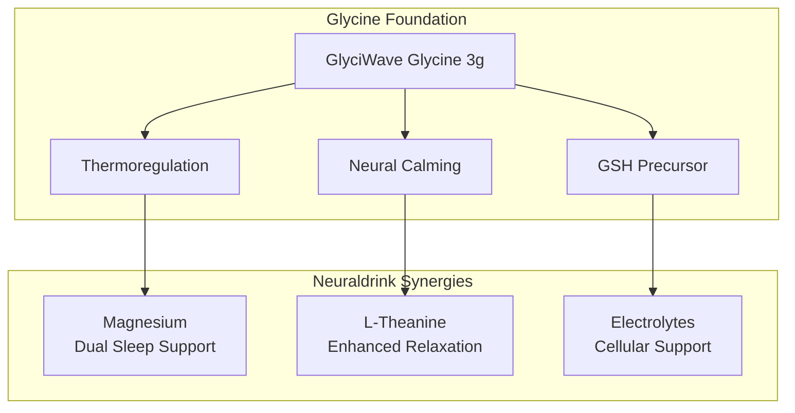

### Glycine + L-Theanine: The Calm Stack

Both amino acids promote relaxation through complementary mechanisms:

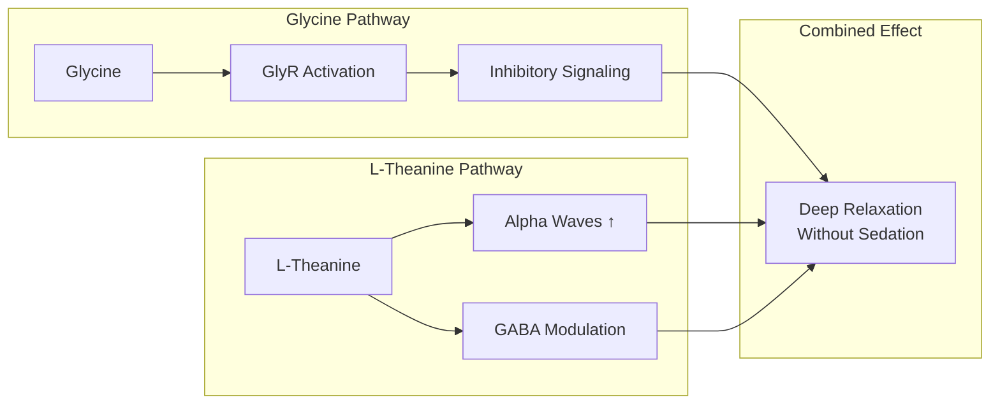

| Compound | Mechanism | Combined Benefit |
|----------|-----------|------------------|
| **Glycine** | GlyR inhibition, thermoregulation | Physical relaxation, sleep onset |
| **L-Theanine** | Alpha waves, GABA | Mental calm, anxiety reduction |
| **Together** | Complementary pathways | *Profound calm without sedation* |

### Glycine + Magnesium: The Sleep Foundation

| Magnesium Role | Glycine Role | Combined |
|----------------|--------------|----------|
| NMDA modulation | NMDA co-agonism | *Balanced NMDA function* |
| Muscle relaxation | Neural inhibition | *Physical relaxation* |
| HPA axis support | Cortisol modulation | *Stress buffer* |

### Glycine + Electrolytes

| Electrolyte | Glycine Synergy | Benefit |
|-------------|-----------------|---------|
| **Sodium** | Glycine enhances absorption | Hydration |
| **Potassium** | Cellular function | Muscle relaxation |
| **Magnesium** | See above | Sleep support |

### NTRPX Cross-Product Synergies

| NTRPX Product | Glycine Synergy | Application |
|---------------|-----------------|-------------|
| **Luna** | Glycine in both (if present) | Sleep stack completion |
| **Boost** | GSH support complements energy | Recovery support |
| **Recover** | Collagen synthesis, antioxidant | Physical recovery |

### Synergy Rating Summary

| Synergy | Context | Evidence | Rating |
|---------|---------|----------|--------|
| Glycine + L-Theanine | Neuraldrink | Logical (strong) | ★★★★★ |
| Glycine + Magnesium | Neuraldrink | Logical | ★★★★☆ |
| Glycine + Sleep context | Any | *Strong clinical* | ★★★★★ |
| Glycine + NAC (external) | GSH support | Clinical | ★★★★★ |
| Glycine + Collagen (external) | Structural support | Logical | ★★★★☆ |

</Accordion>

<Accordion title="Clinical Evidence" icon="book-open">

### Sleep Quality Trials

| Study | Design | N | Dose | Duration | Finding |
|-------|--------|---|------|----------|---------|
| **Inagawa 2006** | Crossover | 15 | 3g | Acute | *↑ Subjective sleep quality, ↓ fatigue* |
| **Yamadera 2007** | RCT, PSG | 11 | 3g | 2 nights | *↓ Sleep latency, ↓ SWS latency, ↑ cognition* |
| **Bannai 2012** | RCT | 10 | 3g | Restricted sleep | *↓ Daytime sleepiness, ↑ alertness* |

### Mechanism Studies

| Study | Model | Finding |
|-------|-------|---------|
| **Kawai 2015** | Rat, pharmacological | *NMDA receptors in SCN mediate thermoregulation* |
| **Bannai 2011** | Rat | *Glycine activates SCN neurons* |
| **Multiple** | Cutaneous blood flow | *Peripheral vasodilation confirmed* |

### Next-Day Cognition

| Outcome | Study | Finding |
|---------|-------|---------|
| **Memory recognition** | Yamadera 2007 | *Improved* |
| **Fatigue (VAS)** | Inagawa 2006 | *↓ 15%* |
| **Sleepiness (SSS)** | Bannai 2012 | *↓ 29%* |
| **"Clear-headedness"** | Yamadera 2007 | *Reported by subjects* |

### Safety Data

| Study | Dose | Adverse Events |
|-------|------|----------------|
| Inagawa 2006 (safety) | Up to 9g acute | None |
| Yamadera 2007 | 3g | None |
| High-dose studies | 31g+ | Minimal (mild GI) |

### Effect Size Summary

| Outcome | Effect Size | Evidence Level |
|---------|-------------|----------------|
| Sleep latency reduction | d = 0.4-0.6 | Moderate-High |
| Subjective sleep quality | d = 0.5-0.7 | High |
| Next-day fatigue | d = 0.4-0.5 | Moderate |
| Next-day cognition | d = 0.3-0.5 | Moderate |
| Thermoregulation | ~0.3°C drop | High (objective) |

### References

**Sleep Studies:**
- Yamadera W et al. Glycine ingestion improves subjective sleep quality in human volunteers, correlating with polysomnographic changes. *Sleep Biol Rhythms.* 2007;5:126-131. [DOI](https://doi.org/10.1111/j.1479-8425.2007.00262.x)
- Inagawa K et al. Subjective effects of glycine ingestion before bedtime on sleep quality. *Sleep Biol Rhythms.* 2006;4:75-77.
- Bannai M et al. The effects of glycine on subjective daytime performance in partially sleep-restricted healthy volunteers. *Front Neurol.* 2012;3:61. [PubMed](https://pubmed.ncbi.nlm.nih.gov/22529837/)

**Mechanism:**
- Kawai N et al. The sleep-promoting and hypothermic effects of glycine are mediated by NMDA receptors in the suprachiasmatic nucleus. *Neuropsychopharmacology.* 2015;40(6):1405-16. [PubMed](https://pubmed.ncbi.nlm.nih.gov/25533534/)

**Safety:**
- Inagawa K et al. Assessment of acute adverse events of glycine ingestion at high doses in human volunteers. *J Urban Life Health Assoc.* 2006;50:27-32.

</Accordion>

<Accordion title="Safety & Classification" icon="shield-check">

### Adverse Event Profile

| Event | Incidence | Severity | Notes |
|-------|-----------|----------|-------|
| **GI discomfort** | Rare | Mild | At very high doses |
| **Nausea** | Rare | Mild | Dose-dependent |
| **Soft stools** | Rare | Mild | High doses |

At the 3g clinical dose, *no adverse events* have been reported in controlled studies.

### Safety Data

| Parameter | Finding |
|-----------|---------|
| **3g dose safety** | *No adverse events* in all clinical studies |
| **9g acute dose** | Well-tolerated |
| **31g single dose** | Tolerated (some GI effects) |
| **0.8 g/kg body weight** | Tolerated in research |
| **GRAS status** | Generally Recognized as Safe |
| **LD50** | Very high; practically non-toxic |

### Regulatory Status

| Region | Status | Notes |
|--------|--------|-------|
| **United States** | GRAS; dietary supplement | Established safety |
| **European Union** | Food additive (E640) | Approved |
| **Japan** | Food additive | Long history |
| **Codex Alimentarius** | Permitted | International standard |

### Contraindications

| Category | Consideration | Severity |
|----------|---------------|----------|
| **Clozapine** | May interfere with efficacy | ★★★★☆ Avoid without supervision |
| **Severe kidney disease** | Amino acid metabolism | ★★★☆☆ Consult provider |
| **Pregnancy/Nursing** | Limited specific data | ★★☆☆☆ Consult provider |

### Drug Interactions

| Drug Class | Interaction | Severity | Notes |
|------------|-------------|----------|-------|
| **Clozapine** | May reduce efficacy | ★★★★☆ | Avoid combination |
| **Other antipsychotics** | Theoretical NMDA effects | ★★☆☆☆ | Monitor |
| **Sedatives** | Additive calming | ★★☆☆☆ | May enhance effect |

### Special Populations

| Population | Safety Status | Notes |
|------------|---------------|-------|
| **Healthy adults** | Excellent | Primary use |
| **Elderly** | Excellent | May benefit from GSH support |
| **Athletes** | Excellent | Recovery support |
| **Sleep difficulties** | Excellent | Primary indication |
| **Clozapine users** | Contraindicated | Specific interaction |
| **Pregnancy** | Caution | Consult provider |

---

### <Icon icon="star" color="#5A8FA8" /> Tier 1: Foundation

<CardGroup cols={3}>
<Card title="Efficacy" icon="check" color="#5A8FA8">High</Card>
<Card title="Validation" icon="check" color="#5A8FA8">Strong — Multiple RCTs; mechanism elucidated</Card>
<Card title="Safety" icon="check" color="#5A8FA8">Excellent — GRAS status; no adverse events at 3g</Card>
</CardGroup>

**Tier Rationale:** Tier 1 (Foundation) classification. Glycine is one of the most well-validated natural sleep aids, with multiple RCTs demonstrating benefits at the 3g dose for sleep onset, sleep quality, and next-day cognition. The mechanism is uniquely elegant: NMDA-mediated thermoregulation via the suprachiasmatic nucleus — working *with* natural sleep physiology rather than overriding it. This explains why glycine improves rather than impairs next-day function. Additional benefits as a glutathione precursor, NMDA co-agonist, and inhibitory neurotransmitter add multi-dimensional value. Safety is excellent with GRAS status and no adverse events at clinical doses. Exceptional beverage compatibility (solubility, sweetness, stability) makes glycine ideal for Neuraldrink's format.

</Accordion>

<Accordion title="Practical Considerations" icon="clipboard-list">

### When to Use Neuraldrink with Glycine

| Scenario | Expected Benefit | Protocol |
|----------|------------------|----------|
| Sleep optimization | *High* | 1 Neuraldrink (3g glycine), 30-60 min before bed |
| Sleep onset difficulties | *High* | Consistent evening use |
| Next-day performance | *High* | Evening dose improves morning cognition |
| Sleep restriction periods | *High* | Reduces fatigue, improves alertness |
| Travel/jet lag | Moderate | Supports sleep adjustment |
| Recovery (athletes) | Moderate | Collagen, GSH support |

### Realistic Expectations

| Timeframe | What to Expect |
|-----------|----------------|
| **Night 1** | Often noticeable — faster sleep onset |
| **Night 3-5** | Consistent improvement; reduced fatigue |
| **Night 7+** | *Full effect — optimized sleep + cognition* |
| **Ongoing** | Sustained benefits with continued use |

### Signs It's Working

| Indicator | Description |
|-----------|-------------|
| Faster sleep onset | Less time lying awake |
| Better sleep quality | More restful, deeper sleep |
| Easier wake-up | Less groggy in morning |
| Improved energy | Less daytime fatigue |
| Better focus | Enhanced morning cognition |
| "Clear-headedness" | Reported subjective quality |

### Optimizing Response

| Strategy | Rationale |
|----------|-----------|
| **30-60 min before bed** | Peak effect at sleep onset |
| **Consistent timing** | Reinforces sleep routine |
| **Cool environment** | Supports thermoregulation |
| **Dim lights** | Complements circadian signaling |
| **Avoid late caffeine** | Don't counteract calming effects |

### Frequently Asked Questions

<AccordionGroup>

<Accordion title="Why is glycine different from sleeping pills?">
Sleeping pills (benzodiazepines, Z-drugs) work by forcing GABA-A sedation, which disrupts natural sleep architecture and impairs next-day function. Glycine works through *natural thermoregulation* — lowering core temperature via the brain's circadian clock (SCN). This preserves normal sleep stages and actually *enhances* next-day cognition. It's the difference between being sedated and being *helped to fall asleep naturally*.
</Accordion>

<Accordion title="Will I feel groggy the next morning?">
No — the opposite is true. Clinical studies show glycine *improves* next-day cognition, reduces fatigue, and increases alertness. Subjects report feeling "clear-headed," "lively," and "peppy" the morning after glycine. This is unique among sleep aids.
</Accordion>

<Accordion title="Why 3 grams? Is more better?">
3 grams is the clinically-validated dose — all positive sleep studies used this amount. It's the threshold needed to trigger the 0.3°C temperature drop that initiates sleep. Higher doses (up to 9g) have been studied for safety but don't show additional sleep benefits. The 3g dose is the "Goldilocks" zone: effective, safe, and beverage-compatible.
</Accordion>

<Accordion title="How quickly does it work?">
Most people notice effects on the first or second night. Peak thermoregulatory effect occurs about 30-60 minutes after ingestion. Full benefits, especially for next-day cognition, build over the first week of consistent use.
</Accordion>

<Accordion title="Can I take glycine with other sleep supplements?">
Yes. Glycine works through thermoregulation (NMDA/SCN) while most other sleep supplements work through GABA pathways. They're complementary. In Neuraldrink, glycine synergizes well with L-Theanine and Magnesium. The calming effects may be additive, so start with recommended doses.
</Accordion>

<Accordion title="Why does glycine taste sweet?">
Glycine's name comes from Greek *glykys* meaning "sweet." Its molecular structure activates sweet taste receptors, providing about 70% the sweetness of sugar. This natural sweetness helps Neuraldrink taste pleasant without excessive added sweeteners.
</Accordion>

<Accordion title="Does glycine have benefits beyond sleep?">
Yes. Glycine is a precursor to glutathione (master antioxidant), essential for collagen synthesis (skin, joints, bones), and involved in creatine production (muscle energy). It also acts as an inhibitory neurotransmitter (calming) and NMDA co-agonist (learning, memory). The 3g dose in Neuraldrink supports all these pathways.
</Accordion>

</AccordionGroup>

</Accordion>

</AccordionGroup>

---

<Tip>
**GlyciWave Summary:** Glycine (3,000mg in Neuraldrink) is a clinically-validated sleep enhancer that works through a unique thermoregulatory mechanism — activating NMDA receptors in the brain's master clock (SCN) to lower core body temperature and trigger natural sleep onset. Unlike sedatives that impair next-day function, glycine *enhances* morning cognition, reduces fatigue, and improves alertness. Additional benefits as a glutathione precursor, NMDA co-agonist for learning, and inhibitory neurotransmitter make it multi-functional. Its exceptional water solubility and natural sweetness make glycine the ideal functional beverage ingredient. In Neuraldrink, GlyciWave delivers the full clinical dose for better sleep tonight and a sharper tomorrow.
</Tip>