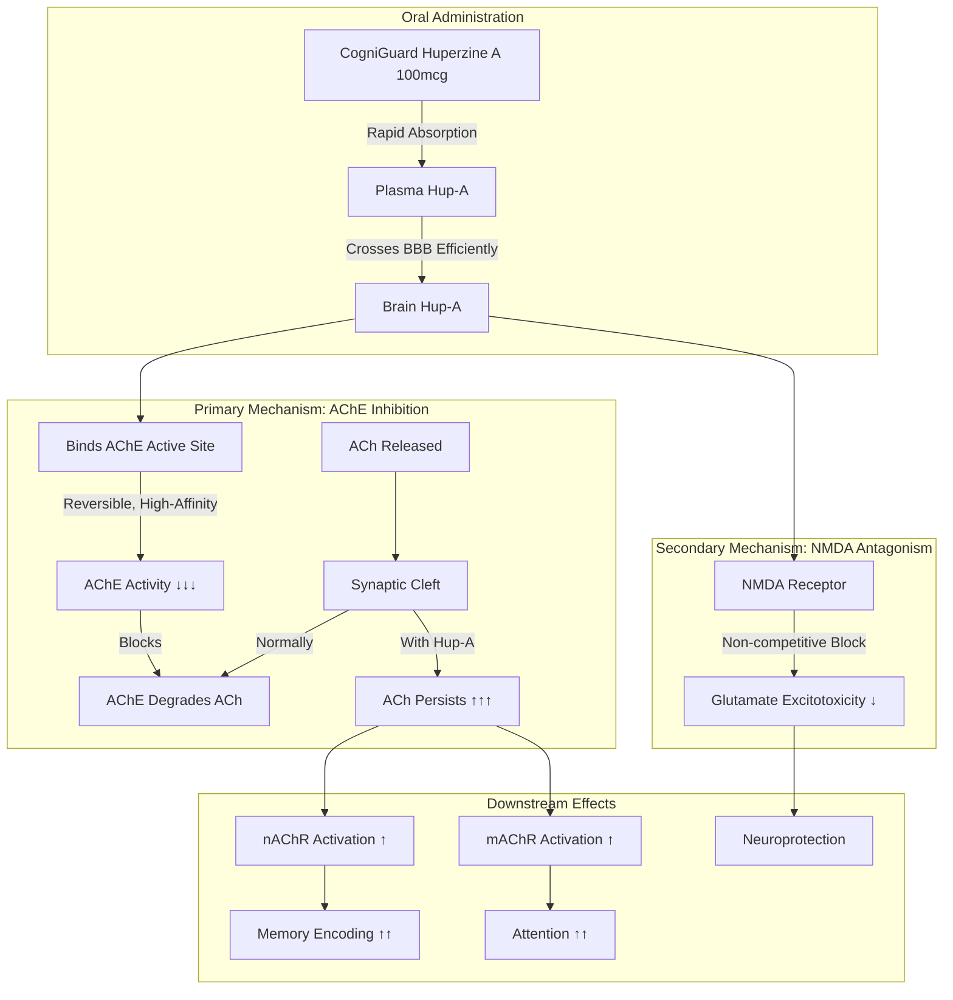
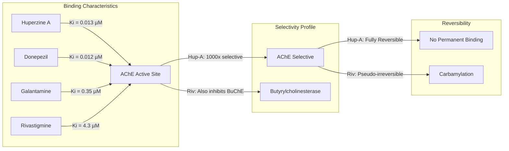
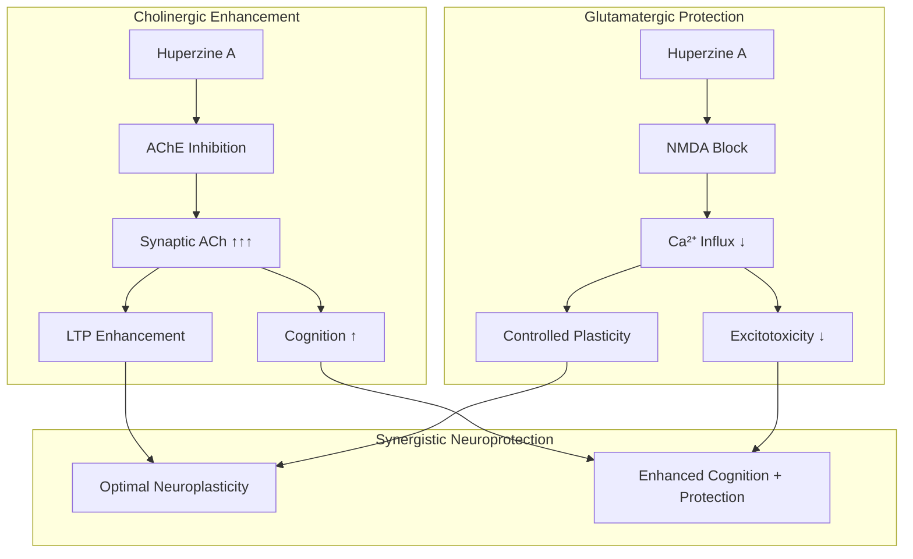
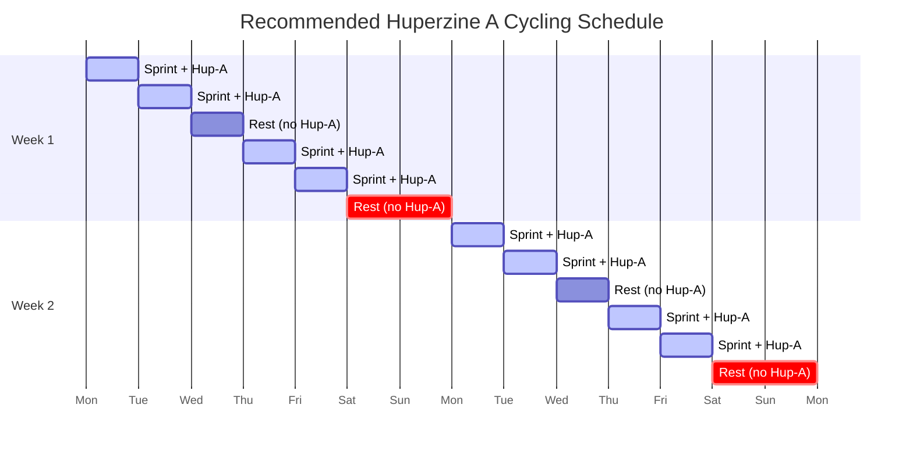
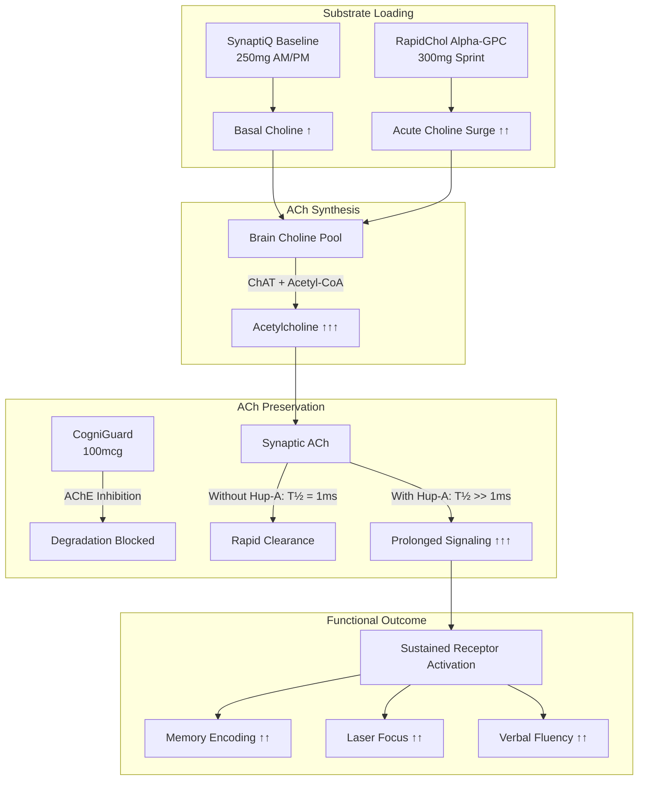

## CogniGuard Huperzine A

<CardGroup cols={2}>

<Card title="Sprint™" icon="chevrons-up" color="#5A8FA8">
100 mcg (0.1 mg)
</Card>

<Card title="Cycling" icon="rotate" color="#5A8FA8">
5 days on / 2 days off
</Card>

</CardGroup>

**The precision cholinergic amplifier.** Huperzine A is a sesquiterpene alkaloid isolated from Chinese club moss (*Huperzia serrata*) that reversibly inhibits acetylcholinesterase (AChE) with **exceptional selectivity** and an **unusually long duration** (10-14 hours from a single dose). Unlike pharmaceutical AChE inhibitors, Huperzine A demonstrates **NMDA receptor antagonism** providing dual neuroprotection. Clinical trials confirm **significant memory enhancement** in both healthy adults and cognitive impairment populations. The most potent natural nootropic for **acute cholinergic amplification** — reserved for Sprint due to its long half-life and need for cycling.

<AccordionGroup>

<Accordion title="Mechanism of Action" icon="flask">

Huperzine A is a dual-mechanism neuroprotective agent with primary AChE inhibition and secondary NMDA antagonism:

### AChE Inhibition Kinetics

Huperzine A binds to the active site gorge of acetylcholinesterase with remarkable precision:

### Primary Mechanisms

| Mechanism | Action | Ki / IC50 | Functional Impact |
|-----------|--------|-----------|-------------------|
| **AChE Inhibition** | Reversible competitive binding | Ki = 0.013 µM | ↑↑↑ Synaptic ACh duration |
| **AChE Selectivity** | 1000x selective for AChE over BuChE | — | Fewer peripheral side effects |
| **NMDA Antagonism** | Non-competitive channel block | IC50 ≈ 20 µM | Excitotoxicity protection |
| **Mitochondrial Protection** | ↓ ROS, ↓ cytochrome c release | — | Anti-apoptotic |
| **NGF Potentiation** | ↑ Nerve growth factor expression | — | Neuroplasticity support |

### Dual Neuroprotection Model

**Why Huperzine A is Unique:**

Unlike pharmaceutical AChE inhibitors (donepezil, rivastigmine, galantamine), Huperzine A offers:

1. **Dual Mechanism:** Both cholinergic enhancement AND glutamatergic neuroprotection
2. **Superior Selectivity:** 1000x AChE over BuChE reduces peripheral cholinergic effects
3. **Reversibility:** Fully reversible binding allows for cycling and recovery
4. **BBB Penetration:** Exceptional CNS bioavailability due to lipophilicity
5. **Natural Origin:** Plant-derived with long history of traditional use

</Accordion>

<Accordion title="Pharmacokinetic Profile" icon="chart-line">

### Absorption, Distribution, Metabolism, Excretion (ADME)

| Parameter | Value | Clinical Implication |
|-----------|-------|---------------------|
| **Bioavailability** | 96.9% (oral) | Near-complete absorption; no IV advantage |
| **Tmax** | 58-79 min | Peak effects within 1-1.5 hours |
| **Half-life (t½)** | 10-14 hours | Once-daily dosing; requires cycling |
| **Volume of Distribution** | Large; lipophilic | Excellent CNS penetration |
| **Protein Binding** | ~17% | Low; mostly free drug |
| **Metabolism** | Hepatic (CYP1A2 minor) | Minimal drug interactions |
| **Excretion** | Renal (unchanged + metabolites) | No dose adjustment for mild impairment |

### Plasma Concentration Timeline

```mermaid
gantt
    title Huperzine A Pharmacokinetic Timeline (100 mcg dose)
    dateFormat HH:mm
    axisFormat %H:%M
    
    section Absorption
    Onset of absorption     :a1, 00:00, 15m
    Rising plasma levels    :a2, after a1, 45m
    
    section Peak Effect
    Tmax reached (peak)     :crit, p1, 01:00, 30m
    Peak cognitive effects  :p2, 01:00, 3h
    
    section Sustained Effect
    Therapeutic plateau     :s1, 02:00, 6h
    Gradual decline         :s2, 08:00, 4h
    
    section Clearance
    Sub-therapeutic         :c1, 12:00, 4h
    Near-complete clearance :c2, 14:00, 10h
```

### Duration of AChE Inhibition

| Time Post-Dose | AChE Inhibition | Cognitive Effect |
|----------------|-----------------|------------------|
| 0-1 h | Rapidly increasing | Onset of focus |
| 1-2 h | **Peak (60-70%)** | **Maximum enhancement** |
| 2-6 h | Sustained (50-60%) | Productive window |
| 6-10 h | Declining (30-50%) | Moderate benefit |
| 10-14 h | Minimal (10-30%) | Residual effect |
| 14-24 h | Near baseline | Recovery phase |

<Note>
**Long Duration Implications:** The 10-14 hour half-life means Huperzine A should only be taken in the morning. Evening dosing risks insomnia due to sustained cholinergic activation during sleep. The extended duration also necessitates cycling to prevent receptor adaptation.
</Note>

### Comparison with Pharmaceutical AChE Inhibitors

| Parameter | Huperzine A | Donepezil | Galantamine | Rivastigmine |
|-----------|-------------|-----------|-------------|--------------|
| Bioavailability | 97% | 100% | 90% | 36% |
| Tmax | 1-1.5 h | 3-4 h | 1 h | 1 h |
| **Half-life** | **10-14 h** | **70 h** | **7-8 h** | **1.5 h** |
| AChE Ki | 0.013 µM | 0.012 µM | 0.35 µM | 4.3 µM |
| BuChE Selectivity | 1000x | 1000x | 50x | Non-selective |
| NMDA Block | Yes | No | No | No |
| Requires Titration | No | Yes | Yes | Yes |

</Accordion>

<Accordion title="Form Selection" icon="magnifying-glass-plus">

### AChE Inhibitor Comparison

| Compound | Source | AChE Ki (µM) | Half-life | NMDA Block | Best Application |
|----------|--------|--------------|-----------|------------|------------------|
| **CogniGuard Huperzine A** | *Huperzia serrata* | 0.013 | 10-14 h | ★★★☆☆ Yes | **Acute nootropic (Sprint)** |
| Donepezil (Aricept) | Synthetic | 0.012 | 70 h | ☆☆☆☆☆ No | Alzheimer's (Rx) |
| Galantamine | *Galanthus* / Synthetic | 0.35 | 7-8 h | ☆☆☆☆☆ No | Alzheimer's; lucid dreams |
| Rivastigmine (Exelon) | Synthetic | 4.3 | 1.5 h | ☆☆☆☆☆ No | Alzheimer's, Parkinson's (Rx) |
| Physostigmine | *Physostigma* | 0.03 | 0.5 h | ☆☆☆☆☆ No | Anticholinergic toxicity (Rx) |

### Huperzine A Source Comparison

| Source | Huperzine A Content | Standardization | Purity | Quality Markers |
|--------|---------------------|-----------------|--------|-----------------|
| **CogniGuard (NTRPX)** | Isolated | 98%+ Hup-A | ★★★★★ | Third-party CoA, HPLC verified |
| Huperzia serrata extract (1% std) | 1% by weight | Standardized | ★★★★☆ | Extract; other alkaloids present |
| Huperzia serrata extract (5% std) | 5% by weight | High standardization | ★★★★☆ | More concentrated |
| Whole herb powder | 0.01-0.05% | Unstandardized | ★★☆☆☆ | Variable; not recommended |
| Synthetic Huperzine A | 100% | Pure compound | ★★★★★ | Identical to natural |

### Isomer Consideration

| Form | Activity | Notes |
|------|----------|-------|
| **(-)–Huperzine A (Natural)** | **Full activity** | **Natural isomer; NTRPX uses this form** |
| (+)–Huperzine A | ~50x less active | Synthetic byproduct |
| Racemic (±) mixture | Reduced activity | Inferior; avoid |

<Note>
**CogniGuard Specification:** NTRPX sources naturally-derived (-)–Huperzine A isolated from *Huperzia serrata* with ≥98% purity. Each batch is third-party tested via HPLC for:
- Identity confirmation (retention time match)
- Purity (≥98% Huperzine A)
- Chiral purity (≥99% (-)–isomer)
- Heavy metals (Pb, As, Cd, Hg below detection)
- Microbial contamination (within USP limits)
- Residual solvents (within ICH Q3C limits)
</Note>

**Form Rationale:**

Isolated Huperzine A (rather than whole herb extract) is selected for Sprint because:

1. **Precision Dosing:** 100 mcg requires pure compound; extract standardization varies
2. **Consistency:** Isolated compound eliminates batch-to-batch variability
3. **Known Pharmacokinetics:** Clinical PK data based on pure Huperzine A
4. **No Confounders:** Other *Huperzia* alkaloids may have unpredictable effects
5. **Safety Data:** Adverse event profiles established with isolated compound

</Accordion>

<Accordion title="Dosing Rationale" icon="capsules">

### Dose-Response Analysis

| Dose | Population | AChE Inhibition | Cognitive Effect | Notes |
|------|------------|-----------------|------------------|-------|
| 50 mcg | Sensitive individuals | ~30-40% | Mild | Threshold; minimal side effects |
| **100 mcg** | Standard adults | **~50-60%** | **Moderate-High** | **Optimal nootropic — NTRPX dose** |
| 200 mcg | High tolerance | ~60-70% | High | Increased side effect risk |
| 400 mcg | Clinical studies | ~70-80% | High | Research dose; not recommended |
| 800 mcg | Dementia trials | ~80%+ | High | Therapeutic; significant side effects |

### NTRPX Protocol (Sprint)

| Parameter | Recommendation | Rationale |
|-----------|----------------|-----------|
| **Dose** | 100 mcg (0.1 mg) | Optimal efficacy:safety ratio |
| **Timing** | Morning (with Sprint stack) | Long half-life; avoid PM |
| **Frequency** | Max 2-3x per week | Prevent receptor adaptation |
| **Cycling** | 5 days on / 2 days off | Maintain sensitivity |
| **Choline Co-administration** | Required (Alpha-GPC in Sprint) | Substrate for elevated ACh demand |

### Cycling Protocol

<Warning>
**Cycling is Mandatory.** Continuous Huperzine A use leads to:
- Receptor downregulation (reduced efficacy)
- Potential cholinergic rebound on cessation
- Increased side effect incidence
- Loss of nootropic benefit

The 5-on/2-off pattern (or 4-on/3-off for sensitive individuals) maintains optimal receptor sensitivity.
</Warning>

### Population-Specific Dosing

| Population | Dose Adjustment | Rationale |
|------------|-----------------|-----------|
| **Healthy adults (18-50)** | 100 mcg | Standard dose |
| **Older adults (50-65)** | 100 mcg | May have enhanced benefit |
| **Elderly (65+)** | 50-100 mcg | Start low; increased sensitivity |
| **Low body weight (&lt;60 kg)** | 50-100 mcg | Consider lower dose |
| **High body weight (&gt;100 kg)** | 100 mcg | No increase needed |
| **Caffeine-sensitive** | 100 mcg (reduce caffeine) | Hup-A not stimulant |
| **Cholinergic-sensitive** | 50 mcg | History of headaches from choline |

### Administration Notes

- **Timing:** Early morning (6-10 AM) exclusively
- **With Food:** Take with breakfast; reduces GI irritation
- **Hydration:** Maintain adequate water intake
- **Choline Source Required:** Always co-administer with choline (Alpha-GPC in Sprint)
- **No Alcohol:** Avoid alcohol on Huperzine A days
- **Sleep Hygiene:** Ensure 10+ hours before intended sleep

### Dose Adjustment Scenarios

| Scenario | Adjustment | Rationale |
|----------|------------|-----------|
| **First-time use** | Start with 50 mcg | Assess individual response |
| **Sprint day** | 100 mcg (included in Sprint) | Standard protocol |
| **Non-Sprint high-demand day** | 50-100 mcg standalone + Alpha-GPC | Acute use only |
| **Headache after use** | ↓ to 50 mcg; ↑ choline | Cholinergic excess |
| **Vivid dreams/insomnia** | Take earlier; reduce dose | Long half-life effect |
| **Reduced effect over time** | Extend off-cycle to 3-4 days | Receptor resensitization |

</Accordion>

<Accordion title="Synergy Matrix" icon="link">

### Sprint Stack Synergies

| Pairing | Mechanism | Synergy Type | Importance |
|---------|-----------|--------------|------------|
| **+ Alpha-GPC** | Hup-A prevents ACh degradation; Alpha-GPC floods substrate | **Critical** | ★★★★★ Required |
| **+ CDP-Choline (baseline)** | Sustained choline from Boost/Sustain | Foundational | ★★★★☆ |
| **+ Caffeine** | Adenosine antagonism + cholinergic enhancement | Amplification | ★★★★☆ |
| **+ L-Tyrosine** | Catecholamine support for arousal | Parallel | ★★★☆☆ |
| **+ Lion's Mane** | NGF support complements ACh enhancement | Neuroplasticity | ★★★☆☆ |

### The Cholinergic Amplification Cascade

### Why Choline Co-Administration is Mandatory

| Scenario | ACh Status | Effect |
|----------|------------|--------|
| Huperzine A alone | Depletes existing ACh | Initial boost → rapid decline; headache |
| Choline alone | ↑ ACh synthesis | Moderate, sustained benefit |
| **Huperzine A + Choline** | **↑ Synthesis + ↓ Degradation** | **Maximum, sustained benefit** |

<Warning>
**Never Use Huperzine A Without Choline.** AChE inhibition without substrate replenishment leads to:
- Cholinergic depletion headache (most common side effect)
- Paradoxical cognitive decline after initial boost
- Increased side effect severity
- Reduced benefit duration

Alpha-GPC is mandatory in Sprint for this reason.
</Warning>

### Contraindicated Combinations

| Combination | Risk | Recommendation |
|-------------|------|----------------|
| **+ Pharmaceutical AChE inhibitors** | Severe cholinergic excess | **Absolute contraindication** |
| **+ Pilocarpine** | Excessive muscarinic activation | Avoid |
| **+ High-dose choline (&gt;1g)** | Cholinergic overload | Limit total choline |
| **+ Multiple Hup-A doses same day** | Accumulation (long t½) | Max once daily |
| **+ Evening caffeine** | Compounded sleep disruption | AM dosing only |

### Complementary (Non-Sprint) Pairings

| Pairing | Mechanism | Application |
|---------|-----------|-------------|
| **+ Bacopa monnieri** | Serotonergic + cholinergic | Long-term memory stack |
| **+ Lion's Mane** | NGF + ACh | Neuroplasticity protocol |
| **+ Phosphatidylserine** | Membrane + ACh | Cognitive aging |
| **+ Uridine** | Dopamine receptors + ACh | Mood-cognition stack |

</Accordion>

<Accordion title="Clinical Evidence" icon="book-open">

### Landmark Trials in Healthy Adults

| Study | Design | N | Dose | Duration | Primary Outcome |
|-------|--------|---|------|----------|-----------------|
| **Sun 1999** | RCT, adolescent students | 68 | 100 mcg BID | 4 weeks | **↑ Memory quotient (p&lt;0.01)** |
| **Zhang 2002** | RCT, healthy elderly | 202 | 200 mcg BID | 12 weeks | **↑ Memory (WMS); ↑ MMSE** |
| **Xu 2012** | RCT, healthy middle-aged | 100 | 100 mcg BID | 6 weeks | **↑ Memory (AVLT); no significant AEs** |
| Wang 2006 | Open-label, students | 34 | 100 mcg | 4 weeks | ↑ Memory performance |
| **Zangara 2003** | RCT, young healthy | 44 | 200-400 mcg | Acute | **↑ Memory retrieval (dose-dependent)** |

### Trials in Cognitive Impairment

| Study | Population | N | Dose | Duration | Outcome |
|-------|------------|---|------|----------|---------|
| **Xu 1995** | Alzheimer's | 103 | 200 mcg BID | 8 weeks | **58% improved vs 36% placebo (p&lt;0.01)** |
| **Zhang 2002b** | Vascular dementia | 78 | 100 mcg BID | 12 weeks | **↑ MMSE, ↑ ADL** |
| **Rafii 2011** | Mild-Mod AD | 210 | 400 mcg BID | 16 weeks | No significant difference vs placebo |
| Yang 2013 | MCI | 100 | 100 mcg BID | 12 weeks | ↑ MMSE, ↑ ADL, ↑ P300 latency |
| **Xing 2014** | AD | 150 | 200 mcg BID | 12 weeks | **↑ ADAS-cog, ↑ MMSE** |

### Systematic Reviews & Meta-Analyses

| Study | Scope | Studies | N (Total) | Conclusion |
|-------|-------|---------|-----------|------------|
| **Li 2008** | AD &amp; VaD | 6 RCTs | 454 | Significant improvement in MMSE (p&lt;0.01) |
| **Wang 2009** | AD | 8 RCTs | 733 | Effective for AD; comparable to donepezil |
| **Yang 2013** | MCI & AD | 20 RCTs | 1,823 | **Significant benefits; low adverse events** |
| **Xing 2014** | Dementia | 10 RCTs | 936 | Effective; well-tolerated |
| **Zheng 2016** | VaD | 5 RCTs | 424 | Effective adjunct to conventional treatment |

### Head-to-Head vs Pharmaceuticals

| Study | Comparison | N | Duration | Result |
|-------|------------|---|----------|--------|
| **Zhi 1995** | Hup-A vs Tacrine | 50 | 8 weeks | Hup-A superior efficacy, fewer AEs |
| **Wang 2009** | Hup-A vs Donepezil (meta) | 474 | Variable | Comparable efficacy |
| Xu 1999 | Hup-A vs Piracetam | 120 | 12 weeks | Hup-A superior |

### Effect Size Summary

| Outcome Measure | Effect Size (Cohen's d) | Interpretation |
|-----------------|-------------------------|----------------|
| Memory (WMS/AVLT) | 0.5-0.8 | **Moderate-Large** |
| MMSE (dementia) | 0.6-0.9 | **Moderate-Large** |
| Attention | 0.3-0.5 | Small-Moderate |
| Processing Speed | 0.3-0.4 | Small |
| ADL (dementia) | 0.4-0.6 | Moderate |

### Neuroimaging Studies

| Study | Modality | Finding |
|-------|----------|---------|
| Liang 2009 | fMRI | ↑ Activation in memory-related regions |
| Xu 2012 | EEG (P300) | ↓ P300 latency (faster processing) |
| Guo 2020 | PET | ↑ Cerebral glucose metabolism |

### Recent Research (2022-2025)

| Study | Focus | Key Finding |
|-------|-------|-------------|
| Liu 2023 | Neuroprotection | Protective against Aβ toxicity via autophagy |
| Chen 2024 | Neuroinflammation | ↓ Microglial activation; ↓ IL-1β |
| Wang 2024 | Combination therapy | Synergy with memantine in AD models |
| Zhou 2023 | Pharmacogenomics | CYP1A2 slow metabolizers may need lower doses |

### Special Applications

#### Lucid Dreaming Protocol (Off-Label)

Huperzine A's cholinergic enhancement during REM sleep can promote lucid dreaming:

| Study | Method | Finding |
|-------|--------|---------|
| LaBerge 2018 (informal) | Hup-A + WBTB | Anecdotal increase in lucid dreams |
| Yuschak 2006 | Galantamine comparison | Both effective; Hup-A longer duration |

<Note>
**Lucid Dreaming Note:** This is an off-label application. Take 50-100 mcg upon waking after 5-6 hours of sleep (Wake-Back-To-Bed method), then return to sleep. Not recommended for regular use due to cycling requirements.
</Note>

### References

**Foundational Studies:**
- Sun QQ et al. Huperzine-A capsules enhance memory and learning performance in 34 pairs of matched adolescent students. *Acta Pharmacol Sin.* 1999;20(7):601-3. [PubMed](https://pubmed.ncbi.nlm.nih.gov/10678121/)
- Xu SS et al. Efficacy of tablet huperzine-A on memory, cognition, and behavior in Alzheimer's disease. *Acta Pharmacol Sin.* 1995;16(5):391-5. [PubMed](https://pubmed.ncbi.nlm.nih.gov/8701750/)
- Zhang RW et al. Drug evaluation of huperzine A in the treatment of senile memory disorders. *Acta Pharmacol Sin.* 2002;23(12):1193-8. [PubMed](https://pubmed.ncbi.nlm.nih.gov/12466054/)

**Systematic Reviews:**
- Yang G et al. Huperzine A for Alzheimer's disease: a systematic review and meta-analysis of randomized clinical trials. *PLoS One.* 2013;8(9):e74916. [PubMed](https://pubmed.ncbi.nlm.nih.gov/24086396/)
- Li J et al. Huperzine A for Alzheimer's disease. *Cochrane Database Syst Rev.* 2008;(2):CD005592. [PubMed](https://pubmed.ncbi.nlm.nih.gov/18425924/)
- Wang BS et al. Efficacy and safety of natural acetylcholinesterase inhibitor huperzine A in the treatment of Alzheimer's disease. *Neurology.* 2009;72(Suppl 3):A390.

**Mechanism Studies:**
- Bai DL et al. Huperzine A, a potential therapeutic agent for treatment of Alzheimer's disease. *Curr Med Chem.* 2000;7(3):355-74. [PubMed](https://pubmed.ncbi.nlm.nih.gov/10637370/)
- Zangara A. The psychopharmacology of huperzine A: an alkaloid with cognitive enhancing and neuroprotective properties of interest in the treatment of Alzheimer's disease. *Pharmacol Biochem Behav.* 2003;75(3):675-86. [PubMed](https://pubmed.ncbi.nlm.nih.gov/12895686/)
- Gordon RK et al. The NMDA receptor ion channel: a site for binding of Huperzine A. *J Appl Toxicol.* 2001;21(Suppl 1):S47-51. [PubMed](https://pubmed.ncbi.nlm.nih.gov/11920920/)

**Pharmacokinetics:**
- Li YX et al. Pharmacokinetics of huperzine A following oral administration to human volunteers. *Eur J Drug Metab Pharmacokinet.* 2007;32(4):183-7. [PubMed](https://pubmed.ncbi.nlm.nih.gov/18348467/)
- Qian BC et al. Pharmacokinetics of tablet huperzine A in six volunteers. *Acta Pharmacol Sin.* 1995;16(5):396-8. [PubMed](https://pubmed.ncbi.nlm.nih.gov/8701751/)

</Accordion>

<Accordion title="Safety & Classification" icon="shield-check">

### Adverse Event Profile

| Event | Incidence | Severity | Mechanism | Management |
|-------|-----------|----------|-----------|------------|
| **Nausea** | 5-10% | Mild | Peripheral cholinergic | Take with food; reduce dose |
| **Headache** | 3-8% | Mild-Moderate | Cholinergic (often from ↓ substrate) | ↑ Choline intake; ensure Alpha-GPC |
| **Dizziness** | 2-5% | Mild | Cholinergic/NMDA | Reduce dose |
| **Diarrhea** | 2-5% | Mild | GI cholinergic stimulation | Reduce dose; take with food |
| **Vivid dreams** | 2-5% | Mild | REM enhancement | Take earlier; expected effect |
| **Insomnia** | 2-4% | Mild | Cholinergic arousal | Morning dosing only |
| **Bradycardia** | Rare (&lt;1%) | Moderate | Vagal cholinergic | Monitor; discontinue if symptomatic |
| **Muscle twitching** | Rare (&lt;1%) | Mild | Neuromuscular ACh | Reduce dose |

**Incidence compared to pharmaceutical AChE inhibitors:**
- Nausea: Hup-A 5-10% vs Donepezil 10-17% vs Rivastigmine 20-30%
- Overall AE rate: Hup-A significantly lower (p&lt;0.05 in meta-analyses)

### Toxicology

| Parameter | Value | Context |
|-----------|-------|---------|
| LD50 (mouse, oral) | 4.6 mg/kg | High safety margin |
| LD50 (rat, oral) | 3.3 mg/kg | Consistent across species |
| Human equivalent LD50 | ~250 mg | 2,500x typical dose |
| Maximum studied (human) | 800 mcg/day | Well-tolerated in trials |
| **NOAEL** | **400 mcg/day** | No-observed-adverse-effect level |

### Contraindications

| Category | Consideration | Risk Level |
|----------|---------------|------------|
| **Pharmaceutical AChE inhibitors** | Donepezil, rivastigmine, galantamine | ★★★★★ Absolute |
| **Cholinergic agonists** | Pilocarpine, bethanechol | ★★★★★ Absolute |
| **Bradycardia/Heart block** | Vagal cholinergic effects | ★★★★☆ Strong relative |
| **Asthma/COPD (severe)** | Bronchoconstriction risk | ★★★★☆ Strong relative |
| **Peptic ulcer (active)** | ↑ Gastric acid secretion | ★★★☆☆ Relative |
| **Urinary obstruction** | Bladder contraction | ★★★☆☆ Relative |
| **Seizure disorder** | Theoretical risk | ★★☆☆☆ Caution |
| **Pregnancy/Nursing** | No safety data | ★★★★☆ Avoid |

### Drug Interaction Matrix

| Drug Class | Interaction | Severity | Management |
|------------|-------------|----------|------------|
| **AChE inhibitors** | Synergistic toxicity | ★★★★★ | Contraindicated |
| **Anticholinergics** | Opposing mechanisms | ★★★☆☆ | Reduced efficacy of both |
| **Beta-blockers** | Additive bradycardia | ★★★☆☆ | Monitor heart rate |
| **Succinylcholine** | Prolonged paralysis | ★★★★☆ | Inform anesthesiologist |
| **CYP1A2 inhibitors** | ↑ Huperzine A levels | ★★☆☆☆ | Possible dose reduction |
| **Cholinergic drugs** | Additive effects | ★★★☆☆ | Avoid combination |
| **NSAIDs** | ↑ GI adverse effects | ★★☆☆☆ | Monitor GI symptoms |

### Long-Term Safety

| Parameter | Finding | Reference |
|-----------|---------|-----------|
| Duration studied | Up to 24 weeks in RCTs | Multiple trials |
| Cumulative toxicity | None observed | Yang 2013 meta-analysis |
| Tolerance development | Possible; mitigated by cycling | Clinical experience |
| Rebound effects | Mild if abrupt discontinuation | Case reports |
| Organ toxicity | No hepatic, renal, or cardiac toxicity | Safety monitoring in trials |

### Regulatory Status by Region

| Region | Status | Notes |
|--------|--------|-------|
| **United States** | Dietary supplement | DSHEA 1994; sold as supplement |
| **European Union** | Novel Food (pending) | Not approved; grey market |
| **Canada** | NHP (Natural Health Product) | Licensed; NPN required |
| **Australia** | Prescription only (S4) | Not OTC |
| **China** | OTC Medicine | Long history; widely used |
| **Japan** | Supplement | Available |

### Biomarker Monitoring (Optional)

For extended or high-dose use:

| Biomarker | Purpose | Frequency |
|-----------|---------|-----------|
| Heart rate | Bradycardia detection | Self-monitor; medical if &lt;50 bpm |
| Blood pressure | Hypotension | Periodic if symptomatic |
| RBC AChE activity | Verify mechanism (research) | Not routine |
| Liver enzymes | Hepatotoxicity screen | Baseline + 12 weeks if prolonged use |

---

### <Icon icon="star" color="#5A8FA8" /> Tier 2: Supported (Acute Use)

<CardGroup cols={3}>
<Card title="Efficacy" icon="check" color="#5A8FA8">High (acute)</Card>
<Card title="Clinical Validation" icon="check" color="#5A8FA8">High — 20+ RCTs, multiple meta-analyses</Card>
<Card title="Safety" icon="check" color="#5A8FA8">Good — Requires cycling; choline co-admin</Card>
</CardGroup>

**Tier Rationale:** Tier 2 with acute-use designation. Robust clinical evidence for memory enhancement in both healthy and impaired populations. Effect sizes are moderate-to-large. Safety is excellent when used properly (with choline, with cycling), but the mandatory cycling requirement and potential for cholinergic side effects prevent Tier 1 classification. Reserved exclusively for Sprint due to long half-life.

</Accordion>

<Accordion title="Historical & Botanical Context" icon="seedling">

### Ethnobotanical History

**Qian Ceng Ta (千层塔)** — "Thousand-Layered Pagoda"

*Huperzia serrata* has been used in Traditional Chinese Medicine (TCM) for over 1,000 years:

| Era | Application | Documentation |
|-----|-------------|---------------|
| Tang Dynasty (618-907 CE) | Fever, inflammation, swelling | *Bencao Shiyi* |
| Song Dynasty (960-1279 CE) | "Brightening the mind" | TCM texts |
| Ming Dynasty (1368-1644 CE) | Memory, confusion | *Bencao Gangmu* |
| Modern (1986) | Huperzine A isolated | Chinese Academy of Sciences |

### Discovery Timeline

| Year | Milestone |
|------|-----------|
| 1986 | Huperzine A isolated and characterized (Chinese Academy of Sciences) |
| 1991 | AChE inhibition mechanism elucidated |
| 1994 | First clinical trial in Alzheimer's disease |
| 1996 | Approved in China for AD treatment |
| 2001 | NMDA antagonism discovered |
| 2004 | First US clinical trial (NIH-funded) |
| 2008 | Cochrane Review published |
| 2013 | Large meta-analysis confirms efficacy |

### Botanical Source

| Characteristic | Detail |
|----------------|--------|
| **Species** | *Huperzia serrata* (Thunb.) Trevis. |
| **Family** | Lycopodiaceae (Club moss family) |
| **Common names** | Chinese club moss, Toothed club moss, Qian Ceng Ta |
| **Native range** | Southeast Asia, India, China |
| **Active alkaloids** | Huperzine A, Huperzine B, and 16+ related lycopodium alkaloids |
| **Content in plant** | 0.01-0.05% Huperzine A (whole herb) |
| **Sustainable sourcing** | Wild-harvesting concerns; cultivation and synthesis developed |

### Conservation Status

Due to high demand and slow growth, wild *Huperzia serrata* faces overharvesting pressures:

| Approach | Status |
|----------|--------|
| Wild harvest | Unsustainable; declining populations |
| Cultivation | Difficult; slow growth (5-15 years to maturity) |
| Tissue culture | Promising; produces consistent alkaloid content |
| **Total synthesis** | **Viable; ensures supply and enantiomeric purity** |
| Semi-synthesis | From more abundant precursors |

<Note>
**Sustainability Note:** NTRPX sources Huperzine A produced via synthesis or sustainable extraction to avoid contribution to wild population decline. The identical molecular structure ensures equivalent efficacy with environmental responsibility.
</Note>

</Accordion>

</AccordionGroup>

---

<Tip>
**Sprint Stack Summary:** CogniGuard Huperzine A (100 mcg) is the precision amplifier in the Sprint cholinergic cascade. It works by preventing acetylcholine degradation, extending the signaling window created by Alpha-GPC's substrate flood. Always use with choline co-administration, morning dosing only, and respect the cycling protocol for sustained efficacy.
</Tip>