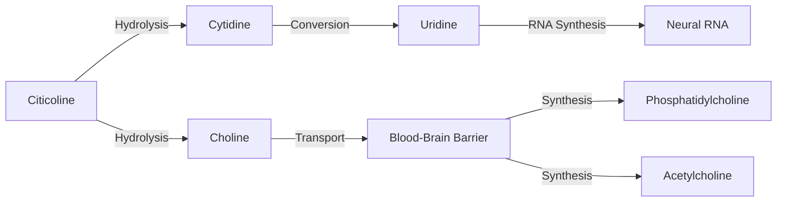
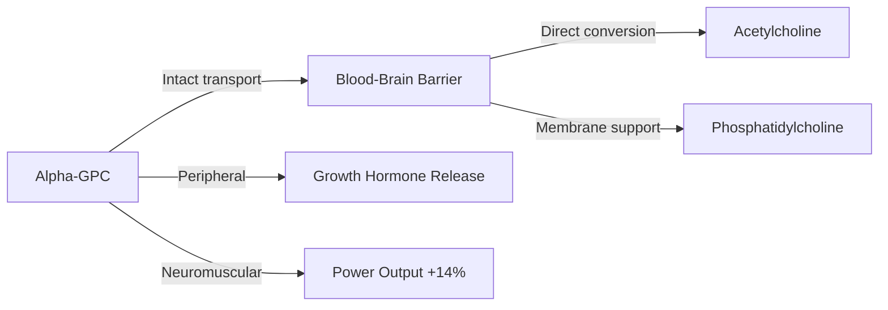
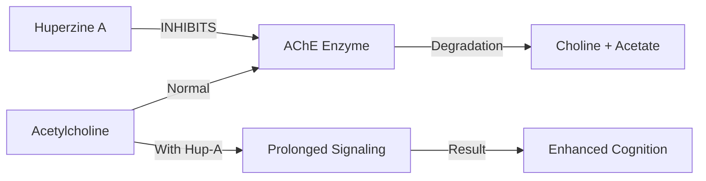

# Cholinergic Compounds

<Icon icon="brain" /> Acetylcholine drives memory encoding, sustained attention, neuromuscular signaling, and executive function. This stack addresses both synthesis (precursors) and degradation (enzyme inhibition).

---

## Cognizin Citicoline

<Card title="CDP-Choline Precursor" icon="brain" img="/images/ntrpx-placeholder.png">

**CDP-choline precursor that increases brain ATP by 14% and supports acetylcholine/dopamine synthesis.** Provides both cytidine (converted to uridine for RNA synthesis) and choline (for phosphatidylcholine membranes). The most clinically-validated nootropic choline source with robust human trial data for memory and attention.

<CardGroup cols={2}>
<Card title="Boost" icon="rocket" color="#5A8FA8">250 mg</Card>
<Card title="Sustain" icon="clock" color="#5A8FA8">250 mg</Card>
</CardGroup>

</Card>

<AccordionGroup>

<Accordion title="Mechanism of Action" icon="flask">

Citicoline (cytidine-5'-diphosphocholine) is hydrolyzed in the gut and resynthesized in the brain:

**Primary Actions:**
- Increases brain phosphatidylcholine synthesis for membrane integrity
- Provides choline substrate for acetylcholine production
- Upregulates dopamine receptor density (D2 receptors)
- Increases frontal lobe ATP by 14% and phosphocreatine by 8%

</Accordion>

<Accordion title="Form Selection" icon="search">

#### Choline Sources Comparison

| Form | Choline Content | BBB Crossing | Best For |
|------|-----------------|--------------|----------|
| **Cognizin (CDP-Choline)** | 18% by weight | ★★★★★ | **ACh + dopamine + membrane repair + uridine** |
| Alpha-GPC | 40% by weight | ★★★★★ | Direct ACh synthesis, rapid effects |
| Uridine Monophosphate | N/A (provides UTP) | ★★★★★ | Kennedy pathway, DA receptors |
| Phosphatidylcholine | 13% by weight | ★★★☆☆ | Membrane support, liver health |
| Choline Bitartrate | 41% by weight | ★★☆☆☆ | Peripheral choline, less nootropic |

<Note>
**Why Cognizin:** Branded CDP-choline from Kyowa Hakko with 99%+ purity via proprietary fermentation. Direct clinical validation in multiple RCTs. Self-affirmed GRAS status. Provides both choline AND cytidine (converted to uridine) for dual cognitive benefit.
</Note>

</Accordion>

<Accordion title="Dosing Rationale" icon="pills">

| Dose Range | Efficacy | Notes |
|------------|----------|-------|
| 250 mg/day | Baseline | Measurable attention improvements; suitable for stacking |
| **500 mg/day** | **Optimal** | **Most studied dose; consistent memory and ATP effects. NTRPX dose.** |
| 1000-2000 mg/day | Clinical | Used in cognitive impairment; diminishing returns in healthy adults |

**Protocol:** 500 mg/day split AM/PM (250 mg Boost + 250 mg Sustain). Take with meals for optimal absorption. Daily use; no cycling required.

</Accordion>

<Accordion title="Synergies" icon="link">

| Pairing | Mechanism | Product |
|---------|-----------|---------|
| **Alpha-GPC** | Different delivery: daily baseline vs acute elevation | Sprint |
| **Huperzine A** | Cognizin increases synthesis; Hup-A prevents breakdown | Sprint |
| **ALCAR** | Donates acetyl groups for ACh synthesis | Sustain |
| **Phosphatidylserine** | Complete membrane phospholipid support | Sustain |

</Accordion>

<Accordion title="Clinical Evidence" icon="book">

| Study | Design | Dose | Duration | Outcome |
|-------|--------|------|----------|---------|
| Silveri 2008 | RCT, healthy adults | 500 mg | 6 weeks | **14% increase in brain ATP** (31P-MRS) |
| Nakazaki 2021 | RCT, n=100, older adults | 500 mg | 12 weeks | **Significant improvement in episodic memory** |
| McGlade 2012 | RCT, healthy women | 250-500 mg | 28 days | Improved attention (CPT-II) |
| Spiers 1996 | RCT, elderly | 1000 mg | 3 months | Improved verbal memory |
| Bonvicini 2023 | Meta-analysis | Various | Various | Positive effects across 7 RCTs |
| EFSA 2024 | Regulatory review | 500 mg | 12 weeks | Supports memory function claim |
| Bermejo 2023 | Systematic review | Various | Various | Confirmed efficacy in MCI |
| Secades 2022 | Comprehensive review | Various | Various | 800+ studies reviewed |

**Effect Size:** Moderate (Cohen's d = 0.4-0.6 for memory outcomes)

**References:**
- Silveri MM et al. *NMR Biomed.* 2008;21(10):1066-75. [PubMed](https://pubmed.ncbi.nlm.nih.gov/18816480/)
- Nakazaki E et al. *J Nutr.* 2021;151(8):2153-60. [PubMed](https://pubmed.ncbi.nlm.nih.gov/33978188/)
- Bonvicini M et al. *Nutrients.* 2023;15(2):386. [PubMed](https://pubmed.ncbi.nlm.nih.gov/36678207/)
- Bermejo PE et al. *Neurosci Insights.* 2023;18:26331055231152496. [PubMed](https://pubmed.ncbi.nlm.nih.gov/36817562/)
- EFSA NDA Panel. *EFSA J.* 2024;22(7):e8861. [EFSA](https://efsa.onlinelibrary.wiley.com/doi/10.2903/j.efsa.2024.8861)
- Secades JJ. *Rev Neurol.* 2022. [PMC](https://pmc.ncbi.nlm.nih.gov/articles/PMC10548481/)

</Accordion>

<Accordion title="Safety & Classification" icon="shield">

**Adverse Events:** No serious adverse events in clinical trials up to 2000 mg/day. Mild GI discomfort in rare cases.

**Contraindications:** None established for healthy adults. Theoretical caution with cholinergic medications (additive effects).

**Drug Interactions:** None clinically significant at standard doses.

---

### <Icon icon="star-half" color="#5A8FA8" /> Tier 2: Supported

<Check>Efficacy: High</Check>
<Check>Clinical Validation: High (20+ RCTs)</Check>
<Check>Safety: Excellent</Check>

</Accordion>

</AccordionGroup>

---

## Alpha-GPC (AlphaSize)

<CardGroup cols={3}>

<Card img="/images/ntrpx-placeholder.png">
</Card>

<Card title="Cholinergic Amplifier" icon="bolt">

**The most bioavailable choline form for rapid brain delivery.** Crosses the blood-brain barrier intact to directly elevate acetylcholine. Clinical evidence supports 14% strength increase and enhanced power output. Reserved for **acute use only** in Sprint due to TMAO concerns with chronic high-dose choline.

</Card>

<Card title="Sprint™" icon="forward" color="#5A8FA8">
**600 mg** (as AlphaSize 50%)

<Warning>Acute use only — max 2x/week</Warning>
</Card>

</CardGroup>

<AccordionGroup>

<Accordion title="Mechanism of Action" icon="flask">

**Primary Actions:**
- Crosses BBB intact (unlike choline bitartrate)
- Rapidly elevates brain acetylcholine levels
- Stimulates growth hormone secretion acutely
- Enhances neuromuscular acetylcholine signaling

**Unique Property:** Alpha-GPC is approximately 40% choline by weight, delivering more choline per gram than any other supplemental form.

</Accordion>

<Accordion title="Form Selection" icon="search">

#### Alpha-GPC Form Comparison

| Form | Alpha-GPC Content | Stability | Handling | Best For |
|------|-------------------|-----------|----------|----------|
| **AlphaSize (50%)** | 50% | ★★★★☆ | Easy | **Industry standard; clinical validation** |
| Alpha-GPC 99% | 99% | ★★☆☆☆ | Difficult | Maximum potency; extremely hygroscopic |

<Note>
**Why AlphaSize:** Industry standard branded form with clinical validation. 50% concentration provides stability and easier manufacturing. 600 mg AlphaSize = 300 mg actual Alpha-GPC. More practical than pure 99% which absorbs moisture rapidly.
</Note>

</Accordion>

<Accordion title="Dosing Rationale" icon="pills">

| Dose Range | Efficacy | Notes |
|------------|----------|-------|
| 300 mg | Mild | Subtle cholinergic enhancement |
| **600 mg** | **Optimal** | **Clinically validated for strength and GH. NTRPX dose.** |
| 1200 mg | High | Some clinical studies; may not add acute benefit |

**Protocol:** 600 mg (as AlphaSize) 30-60 minutes before peak demand. **Acute use only** — maximum 2x/week. Do not use daily.

<Warning>Do not use daily — reserved for acute high-demand situations only</Warning>

</Accordion>

<Accordion title="Clinical Evidence" icon="book">

| Study | Design | Dose | Duration | Outcome |
|-------|--------|------|----------|---------|
| Bellar 2015 | RCT, trained men | 600 mg | 6 days | **14% increase in isometric strength** |
| Ziegenfuss 2008 | Crossover | 600 mg | Acute | Increased GH secretion post-exercise |
| Tamura 2021 | RCT | 400 mg | 2 weeks | Increased motivation scores |
| Parker 2015 | RCT, young adults | 250 mg | Acute | Improved vertical jump power |
| Marcus 2017 | Review | Various | Various | Confirmed cognitive enhancement |
| Kawamura 2012 | RCT, athletes | 1000 mg | Acute | Enhanced power output |

**References:**
- Bellar D et al. *J Int Soc Sports Nutr.* 2015;12:42. [PubMed](https://pubmed.ncbi.nlm.nih.gov/26582972/)
- Ziegenfuss T et al. *J Int Soc Sports Nutr.* 2008;5(Suppl 1):P15.
- Tamura Y et al. *Nutrients.* 2021;13:2091. [PubMed](https://pubmed.ncbi.nlm.nih.gov/34205336/)

</Accordion>

<Accordion title="Safety & Classification" icon="shield">

**Adverse Events:** Well-tolerated at standard doses. Mild headache possible (cholinergic side effect). Fishy odor in some preparations.

**Emerging Concerns:** Chronic high-dose choline may increase TMAO (cardiovascular biomarker). Long-term daily use not recommended. Acute/intermittent use preferred.

**Contraindications:** Caution with cholinesterase inhibitor medications. May exacerbate symptoms in Parkinson's disease (theoretical).

<Warning>Daily Use: Not Recommended</Warning>

---

### <Icon icon="star-half" color="#5A8FA8" /> Tier 2: Supported

<Check>Efficacy: High</Check>
<Check>Clinical Validation: High</Check>
<Note>Safety: Good (with cycling)</Note>

</Accordion>

</AccordionGroup>

---

## Huperzine A

<Card title="AChE Inhibitor" icon="shield" color="#5A8FA8" img="/images/ntrpx-placeholder.png">

**Reversible acetylcholinesterase inhibitor from *Huperzia serrata*.** Extends acetylcholine signaling duration. Creates maximum cholinergic elevation when combined with choline precursors. **Acute use only** — cycling required to prevent receptor adaptation.

<CardGroup cols={1}>
<Card title="Sprint™ Only" icon="forward" color="#5A8FA8">200 mcg</Card>
</CardGroup>

<Warning>Do not use daily; cycling required</Warning>
<Warning>Contraindicated with AChE inhibitor medications</Warning>

</Card>

<AccordionGroup>

<Accordion title="Mechanism of Action" icon="flask">

**Primary Actions:**
- Reversible, selective AChE inhibition
- Prolongs acetylcholine half-life at synapses (10-14 hour duration)
- Enhances cholinergic neurotransmission
- Neuroprotective properties (NMDA antagonism)

</Accordion>

<Accordion title="Form Selection" icon="search">

#### Huperzine A Form Comparison

| Form | Purity | Source | Best For |
|------|--------|--------|----------|
| **Huperzine A 1% Extract** | Standardized | *Huperzia serrata* | **Nootropic use; precise dosing** |
| Huperzine A 99% | Pure | Synthetic or extracted | Research; difficult to dose |
| Club Moss Powder | Variable | Whole herb | Traditional use; unpredictable |

<Note>
**Why 1% Extract:** Allows precise dosing of 200 mcg from manageable powder weight. Standardized extraction ensures consistent potency. Synthetic and extracted forms are bioequivalent.
</Note>

</Accordion>

<Accordion title="Dosing Rationale" icon="pills">

| Dose Range | Efficacy | Notes |
|------------|----------|-------|
| 50-100 mcg | Mild | Subtle AChE inhibition; sensitive users |
| **200 mcg** | **Optimal** | **Standard nootropic dose. NTRPX dose.** |
| 400 mcg | Clinical | Used in cognitive impairment; side effect risk |

**Protocol:** 200 mcg with Alpha-GPC, 30-60 minutes before demand. **Acute only** — maximum 2x/week. Long half-life (10-14 hours) requires spacing.

</Accordion>

<Accordion title="Clinical Evidence" icon="book">

| Study | Population | Dose | Duration | Outcome |
|-------|------------|------|----------|---------|
| Sun 1999 | Adolescent students | 100 mcg BID | 4 weeks | Improved memory quotient |
| Xu 1995 | Alzheimer's patients | 200 mcg BID | 8 weeks | Cognitive improvement |
| Wang 2006 | Systematic review | Various | Various | Confirmed efficacy |
| Zhang 2002 | Memory impairment | 200 mcg | 12 weeks | Improved MMSE scores |
| Rafii 2011 | Alzheimer's Phase II | Various | 16 weeks | Trend toward improvement |

**References:**
- Sun QQ et al. *Zhongguo Yao Li Xue Bao.* 1999;20(7):601-3. [PubMed](https://pubmed.ncbi.nlm.nih.gov/10678121/)
- Wang R et al. *Acta Pharmacol Sin.* 2006;27(1):1-26. [PubMed](https://pubmed.ncbi.nlm.nih.gov/16364206/)

</Accordion>

<Accordion title="Safety & Classification" icon="shield">

**Adverse Events:** Well-tolerated at recommended doses. Cholinergic side effects possible: nausea, sweating, salivation.

**Contraindications:**
- **Absolute:** Concurrent cholinesterase inhibitor medications (donepezil, rivastigmine)
- **Relative:** Bradycardia, asthma, GI ulcers, urinary obstruction

---

### <Icon icon="circle" color="#5A8FA8" /> Tier 3: Promising

<Note>Efficacy: Moderate-High</Note>
<Note>Clinical Validation: Moderate</Note>
<Check>Safety: Good (with cycling)</Check>

</Accordion>

</AccordionGroup>

---