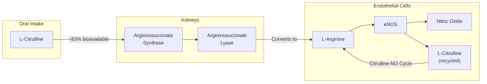
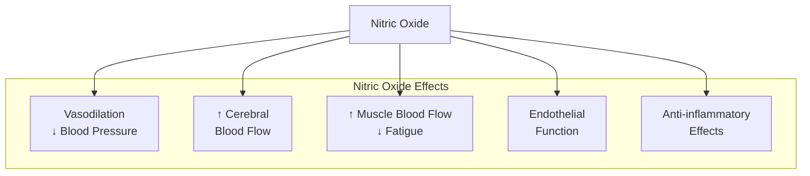
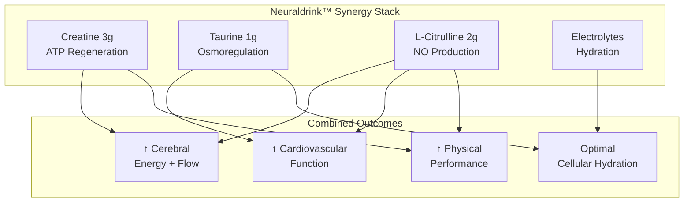

# L-Citrulline Evaluation for NTRPX

<Note>
**Executive Summary**: L-Citrulline is a strong candidate for Neuraldrink™ inclusion. It provides cerebrovascular support that complements the existing cognitive ingredients (creatine), synergizes with taurine, and delivers meaningful cardiovascular benefits at a dose achievable in a drink format. Not recommended for All Systems Go capsules due to bulk requirements.
</Note>

---

## 1. Ingredient Overview

### What Is L-Citrulline?

L-Citrulline is a non-essential amino acid first isolated from watermelon (*Citrullus lanatus*). It serves as the most efficient oral precursor for L-Arginine and, subsequently, nitric oxide (NO) production.

### Why Citrulline Over Arginine?

| Parameter | L-Citrulline | L-Arginine |
|-----------|-------------|------------|
| **Oral bioavailability** | ~83% | ~20% |
| **First-pass metabolism** | Minimal (bypasses gut/liver arginase) | Extensive (degraded by intestinal/hepatic arginase) |
| **Plasma arginine increase** | 227% (at 3.8g) | 90% (at equivalent dose) |
| **GI tolerance** | Excellent | Dose-dependent GI distress |
| **Duration of effect** | Sustained (slow conversion) | Acute spike (rapid clearance) |
| **Tmax for arginine** | 1-2 hours | 30-60 minutes |

**Citation:** Schwedhelm E, et al. Pharmacokinetic and pharmacodynamic properties of oral L-citrulline and L-arginine: impact on nitric oxide metabolism. *Br J Clin Pharmacol.* 2008;65(1):51-59.  
**Link:** [PMC2291275](https://pmc.ncbi.nlm.nih.gov/articles/PMC2291275/)

---

## 2. Mechanism of Action

### Primary Pathway: NO Synthesis

L-Citrulline's benefits derive from its role in the Nitric Oxide cycle:

1. **Absorption**: L-Citrulline is absorbed intact in the intestine (no degradation by arginase)
2. **Renal Conversion**: Kidneys convert L-Citrulline → L-Arginine via argininosuccinate synthase/lyase
3. **NO Production**: Endothelial NOS (eNOS) converts L-Arginine → Nitric Oxide + L-Citrulline
4. **Recycling**: The L-Citrulline byproduct is recycled back to L-Arginine (citrulline-NO cycle)

### Cerebrovascular Mechanism

L-Citrulline crosses the blood-brain barrier (BBB) via the LAT1 (Large Amino Acid Transporter 1) system:

- LAT1 expression is 187-fold higher than alternative transporters in brain capillaries
- Brain conversion to L-Arginine supports neuronal NOS (nNOS) activity
- Enhanced NO in brain → improved neurovascular coupling → better oxygen/nutrient delivery

**Citation:** Lee KE, Kang YS. Characteristics of L-citrulline transport through blood-brain barrier in the brain capillary endothelial cell line (TR-BBB cells). *J Biomed Sci.* 2017;24(1):28.  
**Link:** [PMC5424428](https://pmc.ncbi.nlm.nih.gov/articles/PMC5424428/)

---

## 3. Clinical Evidence

### Cerebral Blood Flow & Cognitive Function

| Study | Model | Dose | Duration | Key Findings |
|-------|-------|------|----------|--------------|
| **Yabuki 2013** | Mouse (ischemia) | 50-100 mg/kg | 10 days | Prevented neuronal death, restored eNOS, improved memory | 
| **Lee & Kang 2017** | In vitro BBB | — | — | LAT1-mediated transport confirmed |
| **Taekwondo athletes 2024** | Human RCT | 8.8g | 5 days | Improved cerebrovascular recovery (ΔBHI) post-exercise |
| **Shafqat 2016** | Human (n=16) | 1.5g | 4 weeks | ↑ NO levels, ↓ pulse wave velocity, trend for ↓ mood disturbance |

**Key Finding:** L-Citrulline administration improves cognitive deficits following brain ischemia through cerebrovascular protection and restoration of eNOS expression in the hippocampus.

**Citation:** Yabuki Y, et al. Oral L-citrulline administration improves memory deficits following transient brain ischemia through cerebrovascular protection. *Brain Res.* 2013;1520:157-167.  
**Link:** [PubMed 23685189](https://pubmed.ncbi.nlm.nih.gov/23685189/)

---

### Blood Pressure (Meta-Analyses)

| Meta-Analysis | Studies | N | SBP Change | DBP Change |
|---------------|---------|---|------------|------------|
| **Barkhidarian 2019** | 8 RCTs | ~200 | -4.1 mmHg (p=0.037) | -2.1 mmHg (≥6g/day: -2.75, p=0.04) |
| **2025 Meta (elderly)** | 15 RCTs | 415 | -4.0 mmHg (p=0.002) | -2.5 mmHg (p=0.004) |

**Subgroup Findings:**
- Effects more pronounced at ≥6 weeks duration
- Lower doses (≤4g/day) still showed significant SBP reduction
- Pre-hypertensive/hypertensive populations show greater benefit

**Citation:** Barkhidarian B, et al. Effects of L-citrulline supplementation on blood pressure: A systematic review and meta-analysis. *Avicenna J Phytomed.* 2019;9(1):10-20.  
**Link:** [PMC6369322](https://pmc.ncbi.nlm.nih.gov/articles/PMC6369322/)

---

### Exercise Performance

| Study | Design | Dose | Duration | Key Findings |
|-------|--------|------|----------|--------------|
| **Suzuki 2016** | RCT, crossover | 2.4g/day | 7 days | Improved 4-km cycling time trial; ↑ plasma NOx |
| **Bailey 2015** | RCT, crossover | 6g/day | 7 days | 12% ↑ severe exercise tolerance; faster VO2 kinetics |
| **Rhim 2020 (Meta)** | Meta-analysis | Various | Various | Significantly ↓ RPE and muscle soreness |

**Citation:** Suzuki T, et al. Oral L-citrulline supplementation enhances cycling time trial performance in healthy trained men. *J Int Soc Sports Nutr.* 2016;13:6.  
**Link:** [Springer](https://link.springer.com/article/10.1186/s12970-016-0117-z)

---

### NO Biomarkers (Pharmacodynamic Effects)

The Schwedhelm 2008 study demonstrated dose-dependent effects of L-Citrulline on NO signaling:

| Dose | L-Arginine/ADMA Ratio | Urinary Nitrate | Urinary cGMP |
|------|----------------------|-----------------|--------------|
| Placebo | 186 ± 8 (baseline) | 92 ± 10 | 38 ± 3.3 |
| L-Citrulline 3g BID | **278 ± 14** (p\<0.01) | **125 ± 15** (p=0.01) | **50 ± 6.7** (p=0.04) |

**Interpretation:** L-Citrulline at 6g/day significantly increased both NO production (urinary nitrate) and downstream signaling (cGMP).

---

## 4. Dose-Response Analysis

### Minimum Effective Doses by Application

| Application | Minimum Dose | Optimal Dose | Evidence Level |
|-------------|-------------|--------------|----------------|
| **Arginine elevation** | 0.18g | 3g | Strong (doubles plasma Arg) |
| **Vascular support (FMD)** | 0.8g/day | 3g/day | Moderate (angina study) |
| **Blood pressure (SBP)** | 3g/day | 6g/day | Strong (meta-analyses) |
| **Blood pressure (DBP)** | 6g/day | 6g/day | Strong |
| **Exercise performance** | 2.4g/day | 6-8g/day | Moderate-Strong |
| **Daily maintenance** | **2-3g/day** | **3g/day** | Supported |

### Key Pharmacokinetic Data

- **Tmax (plasma citrulline)**: 0.5-1 hour
- **Tmax (plasma arginine)**: 1-2 hours (delayed conversion)
- **Plasma arginine elevation duration**: 4-6 hours
- **Steady-state benefits**: Achieved within 7 days of daily dosing

---

## 5. Safety Profile

### Adverse Events

L-Citrulline has an excellent safety profile:

| Parameter | Finding |
|-----------|---------|
| **LD50** | Not determinable (extremely low toxicity) |
| **Maximum tested dose** | 15g/day (no adverse effects) |
| **GI tolerance** | Superior to L-Arginine (no osmotic diarrhea) |
| **Drug interactions** | Caution with PDE5 inhibitors (additive hypotension) |
| **Sleep effects** | Minimal; morning dosing recommended for sensitive individuals |

### Contraindications

- **Active herpes infection**: Theoretical concern (arginine may promote viral replication)
- **Hypotension**: May further lower blood pressure
- **PDE5 inhibitor use**: Additive vasodilation
- **Pre-surgery**: Discontinue 2 weeks prior (BP effects)

---

## 6. Synergy Analysis with NTRPX Ingredients

### Neuraldrink™ Synergies

| Existing Ingredient | Synergy with L-Citrulline | Mechanism |
|--------------------|-----------------------------|-----------|
| **Creatine** | **Strong** | Both support cellular energy; citrulline improves nutrient delivery via ↑ blood flow |
| **Taurine** | **Strong** | Both support cardiovascular function; taurine is antioxidant for NO |
| **Magnesium** | **Moderate** | Mg is cofactor for NOS; citrulline provides substrate |
| **Electrolytes (Na/K)** | **Supportive** | Hydration + vasodilation improves fluid dynamics |

### L-Citrulline + L-Arginine Synergy

Research shows combining citrulline with arginine produces greater effects than either alone:

| Treatment | Plasma Arginine at 1h |
|-----------|----------------------|
| Placebo | +5.4 μM |
| L-Citrulline 2g | +66.3 μM |
| L-Arginine 2g | +72.3 μM |
| **L-Citrulline 1g + L-Arginine 1g** | **+121.9 μM** |

**Mechanism:** L-Citrulline inhibits arginase, reducing L-Arginine degradation while simultaneously providing sustained arginine via renal conversion.

**Citation:** Morita M, et al. Effects on plasma L-arginine levels of combined oral L-citrulline and L-arginine supplementation in healthy males. *Biosci Biotechnol Biochem.* 2017;81(2):372-375.  
**Link:** [Oxford Academic](https://academic.oup.com/bbb/article/81/2/372/5955995)

**Consideration:** Could include small amount of L-Arginine (500mg-1g) in Neuraldrink to potentiate citrulline's effects.

---

## 7. Product Placement Recommendation

### Neuraldrink™ (RECOMMENDED)

**Proposed Addition:**
- **Dose:** 2,000 mg L-Citrulline per serving
- **Form:** L-Citrulline (not citrulline malate)
- **Position:** Add to "Metabolic Support" section

**Rationale:**
1. ✓ **Water-soluble**: Dissolves well in drink format
2. ✓ **Bulky**: 2g requires ~3-4 size 00 capsules (impractical for ASG)
3. ✓ **Timing-appropriate**: Morning/afternoon aligns with Neuraldrink use
4. ✓ **Synergistic**: Complements creatine, taurine, electrolytes
5. ✓ **Cognitive relevance**: Supports cerebral blood flow (fits "neural" positioning)
6. ✓ **Cardiovascular benefit**: Meaningful BP support at 2g/day
7. ✓ **Taste-neutral**: No significant flavor impact

### Updated Neuraldrink™ Formula (Proposed)

| Ingredient | Current | Proposed | Change |
|------------|---------|----------|--------|
| Creatine Monohydrate | 3,000 mg | 3,000 mg | — |
| Taurine | 1,000 mg | 1,000 mg | — |
| **L-Citrulline** | — | **2,000 mg** | **NEW** |
| Vitamin C | 100 mg | 100 mg | — |

**Total powder weight increase:** ~2g (from ~24g to ~26g per serving)

### All Systems Go™ (NOT RECOMMENDED)

**Why not include in ASG capsules:**
- 2,000 mg = 3-4 additional capsules (excessive burden)
- Would require >15 total capsules daily
- Defeats purpose of streamlined capsule system
- Morning drink timing is appropriate for citrulline anyway

---

## 8. Comparison to Alternatives

### L-Citrulline vs. Citrulline Malate

| Parameter | L-Citrulline | Citrulline Malate (2:1) |
|-----------|-------------|-------------------------|
| **Citrulline content** | 100% | ~56% (by weight) |
| **Additional component** | None | Malic acid (~44%) |
| **Dose equivalence** | 2g L-Citrulline | 3.5g Citrulline Malate |
| **Additional benefits** | None | Potential Krebs cycle support |
| **Taste** | Neutral | Slightly tart |
| **Research base** | Strong | Strong (often underdosed) |

**Recommendation:** Use pure L-Citrulline for:
1. More precise dosing (100% active)
2. Neutral taste (better for drink)
3. Avoids need for larger powder volume

### L-Citrulline vs. Beetroot/Nitrate

| Parameter | L-Citrulline | Beetroot Nitrate |
|-----------|-------------|------------------|
| **Pathway** | L-Arg → eNOS → NO | NO3⁻ → NO2⁻ → NO (bacteria) |
| **Oxygen independence** | No | Yes (works in hypoxia) |
| **Consistency** | High (standardized) | Variable (depends on oral bacteria) |
| **Taste** | Neutral | Earthy, strong |
| **Color** | None | Deep red (staining) |

**Conclusion:** L-Citrulline is more appropriate for Neuraldrink (taste, color, consistency).

---

## 9. Branded Ingredient Options

### Kyowa Quality® L-Citrulline

- **Manufacturer:** Kyowa Hakko Bio (Japan)
- **Form:** L-Citrulline (not malate)
- **Purity:** ≥99%
- **Production:** Fermentation-derived
- **Research:** Multiple clinical trials using Kyowa material
- **Status:** GRAS affirmed, Non-GMO

**Recommendation:** Kyowa Quality® L-Citrulline is the gold standard with the most clinical validation.

### Alternative: Citrulline HCl

Recent research (2025) suggests citrulline HCl may offer improved bioavailability:
- 2g citrulline HCl showed 226% relative arginine bioavailability vs. L-citrulline
- Faster Tmax (60 min vs. 120 min)
- Lower urinary excretion (better retention)

**Consideration:** Monitor citrulline HCl research; may become preferred form.

---

## 10. Summary Recommendation

### ✅ APPROVE for Neuraldrink™

| Criterion | Assessment |
|-----------|------------|
| **Efficacy evidence** | Strong (meta-analyses, RCTs) |
| **Mechanism relevance** | High (cerebral + cardiovascular) |
| **Safety profile** | Excellent |
| **Stack synergy** | Strong (creatine, taurine) |
| **Formulation fit** | Ideal (water-soluble, bulky) |
| **Cost-benefit** | Favorable |
| **Differentiation** | Adds vascular support dimension |

### Proposed Implementation

1. **Dose:** 2,000 mg L-Citrulline per Neuraldrink serving
2. **Form:** Kyowa Quality® L-Citrulline (fermentation-derived)
3. **Timing:** Morning/afternoon with Neuraldrink (avoid evening)
4. **Label claim:** "Supports healthy blood flow and cardiovascular function†"
5. **Marketing angle:** "Cerebral circulation support" (ties to "Neural" branding)

### Future Considerations

- Consider 2.5-3g dose if research supports greater benefits
- Monitor citrulline HCl bioavailability data
- Evaluate L-Citrulline + L-Arginine combination (1g + 1g) for enhanced acute effects
- Track emerging cognitive function RCTs for claim substantiation

---

## References

1. Schwedhelm E, et al. Pharmacokinetic and pharmacodynamic properties of oral L-citrulline and L-arginine. *Br J Clin Pharmacol.* 2008;65(1):51-59. [PMC2291275](https://pmc.ncbi.nlm.nih.gov/articles/PMC2291275/)

2. Yabuki Y, et al. Oral L-citrulline administration improves memory deficits following transient brain ischemia. *Brain Res.* 2013;1520:157-167. [PubMed 23685189](https://pubmed.ncbi.nlm.nih.gov/23685189/)

3. Lee KE, Kang YS. L-citrulline transport through blood-brain barrier. *J Biomed Sci.* 2017;24(1):28. [PMC5424428](https://pmc.ncbi.nlm.nih.gov/articles/PMC5424428/)

4. Barkhidarian B, et al. Effects of L-citrulline supplementation on blood pressure: Meta-analysis. *Avicenna J Phytomed.* 2019;9(1):10-20. [PMC6369322](https://pmc.ncbi.nlm.nih.gov/articles/PMC6369322/)

5. Bailey SJ, et al. L-Citrulline supplementation improves O2 uptake kinetics and high-intensity exercise performance. *J Appl Physiol.* 2015;119(4):385-395. [PubMed 26023227](https://pubmed.ncbi.nlm.nih.gov/26023227/)

6. Suzuki T, et al. Oral L-citrulline supplementation enhances cycling time trial performance. *J Int Soc Sports Nutr.* 2016;13:6. [Springer](https://link.springer.com/article/10.1186/s12970-016-0117-z)

7. Morita M, et al. Combined oral L-citrulline and L-arginine supplementation effects on plasma L-arginine. *Biosci Biotechnol Biochem.* 2017;81(2):372-375. [Oxford](https://academic.oup.com/bbb/article/81/2/372/5955995)

8. Rhim HC, et al. Effect of citrulline on post-exercise RPE, muscle soreness, and blood lactate: Meta-analysis. *J Sport Health Sci.* 2020;9(6):553-561. [PMC7749242](https://pmc.ncbi.nlm.nih.gov/articles/PMC7749242/)

---

**Document Status:** Under Review  
**Date:** January 23, 2026  
**Recommendation:** APPROVE for Neuraldrink™ at 2,000mg L-Citrulline