## FlowMax™ L-Citrulline

<CardGroup cols={4}>

<Card title="Sol" icon="sun" color="#f59e0b">
2,000 mg L-Citrulline
</Card>

<Card title="Form" icon="gem" color="#64748b">
Kyowa Quality® (≥99%)
</Card>

<Card title="Evidence" icon="flask" color="#64748b">
8+ Meta-Analyses
</Card>

<Card title="Effect" icon="heart-pulse" color="#64748b">
Cerebral + Cardiovascular Flow
</Card>

</CardGroup>

**The bioavailability breakthrough that makes arginine obsolete.** For decades, L-Arginine was the go-to supplement for nitric oxide (NO) production — the master signaling molecule that dilates blood vessels, regulates blood pressure, and delivers oxygen and nutrients to every tissue including the brain. But there was a problem: oral arginine is extensively degraded by intestinal and hepatic arginase enzymes, with only ~20% reaching systemic circulation. Enter **L-Citrulline** — a non-protein amino acid that bypasses this first-pass metabolism entirely, achieving ~83% oral bioavailability and raising plasma arginine levels *more effectively than arginine itself*. The science is unequivocal: 3g of L-Citrulline produces a 227% increase in plasma arginine versus only 90% from an equivalent dose of L-Arginine. But the story doesn't end at the periphery. L-Citrulline crosses the blood-brain barrier via the LAT1 transporter (expressed 187-fold higher than alternatives in brain capillaries), where it's converted to L-Arginine to fuel neuronal nitric oxide synthase — the enzyme that couples neural activity to cerebral blood flow. This **neurovascular coupling** is fundamental to cognitive performance: every thought, every decision, every memory requires precisely-timed blood flow delivery. NTRPX uses **Kyowa Quality® L-Citrulline** — the gold-standard fermentation-derived ingredient used in the majority of published clinical trials. In Neuraldrink Sol, FlowMax™ L-Citrulline provides morning cerebral circulation support, synergizing with creatine and taurine to optimize both energy production *and* nutrient delivery to the brain.

<AccordionGroup>

<Accordion title="The Nitric Oxide Revolution" icon="wind">

### Why Nitric Oxide Matters

Nitric oxide (NO) is arguably the most important signaling molecule in cardiovascular and neurological health:

```mermaid
flowchart TB
    subgraph NO_FUNCTIONS["Nitric Oxide Functions"]
        VASODILATE["Vasodilation<br>(Blood vessel relaxation)"]
        BP_REG["Blood Pressure<br>Regulation"]
        PLATELET["Platelet Aggregation<br>Inhibition"]
        NEURO["Neurovascular<br>Coupling"]
        IMMUNE["Immune<br>Modulation"]
        MITO["Mitochondrial<br>Efficiency"]
    end
    
    subgraph OUTCOMES["Health Outcomes"]
        VASODILATE --> FLOW["↑ Blood Flow"]
        BP_REG --> CARDIO["Cardiovascular Health"]
        PLATELET --> CLOT["↓ Clot Risk"]
        NEURO --> COGNITION["Cognitive Performance"]
        IMMUNE --> DEFENSE["Immune Function"]
        MITO --> ENERGY["Cellular Energy"]
    end
```



### The Discovery That Won a Nobel Prize

In 1998, Robert Furchgott, Louis Ignarro, and Ferid Murad were awarded the Nobel Prize in Physiology or Medicine for discovering nitric oxide's role as a signaling molecule in the cardiovascular system. Their work revealed that NO:

| Discovery | Implication |
|-----------|-------------|
| **Endothelium-derived relaxing factor = NO** | Blood vessels actively regulate their own diameter |
| **NO activates guanylate cyclase** | Smooth muscle relaxation via cGMP pathway |
| **L-Arginine → NO via NOS** | Amino acid substrate identified |
| **NO has ~5 second half-life** | Continuous production required |

### The Problem with Aging

NO production declines with age and cardiovascular risk factors:

```mermaid
flowchart LR
    subgraph DECLINE["Factors Reducing NO"]
        AGE["Aging"]
        SEDENTARY["Sedentary Lifestyle"]
        DIET["Poor Diet"]
        STRESS_OX["Oxidative Stress"]
        INFLAM["Inflammation"]
        ADMA_UP["↑ ADMA<br>(NOS Inhibitor)"]
    end
    
    subgraph CONSEQUENCES["Consequences"]
        DECLINE --> STIFF["Arterial Stiffness"]
        DECLINE --> HTN["Hypertension"]
        DECLINE --> ENDO["Endothelial Dysfunction"]
        DECLINE --> COGDEC["Cognitive Decline"]
    end
    
    subgraph INTERVENTION["Intervention"]
        CITRULLINE["L-Citrulline<br>Supplementation"]
        CITRULLINE --> |"Restores"| NO_PROD["NO Production"]
        NO_PROD --> REVERSE["Reverses Decline"]
    end
```



### Where L-Citrulline Fits

L-Citrulline addresses NO deficiency at its root — providing sustained substrate for NO synthesis:

| Population | NO Status | L-Citrulline Benefit |
|------------|-----------|---------------------|
| **Healthy young adults** | Optimal | Performance enhancement |
| **Middle-aged adults** | Declining | Maintenance/restoration |
| **Older adults** | Compromised | Significant improvement |
| **Hypertensives** | Impaired | Blood pressure support |
| **Athletes** | High demand | Recovery & endurance |

<Note>
**Key Insight:** Unlike pharmaceutical NO donors (e.g., nitroglycerin), L-Citrulline provides *substrate* for endogenous NO production rather than exogenous NO. This means the body's own regulatory mechanisms remain intact — NO is produced where and when needed, without tolerance development.
</Note>

</Accordion>

<Accordion title="Mechanism of Action" icon="flask">

L-Citrulline's superiority stems from its unique metabolic pathway:

```mermaid
flowchart TB
    subgraph ORAL["Oral Administration"]
        CIT_ORAL["L-Citrulline<br>(Oral Dose)"]
    end
    
    subgraph GUT["Intestinal Absorption"]
        CIT_ORAL --> ABSORB["Absorbed Intact<br>(~83% Bioavailability)"]
        ABSORB --> |"Bypasses<br>Gut Arginase"| BLOOD["Systemic<br>Circulation"]
    end
    
    subgraph KIDNEY["Renal Conversion"]
        BLOOD --> KIDNEY_CIT["Kidney<br>L-Citrulline"]
        KIDNEY_CIT --> ASS["Argininosuccinate<br>Synthase"]
        ASS --> ASL["Argininosuccinate<br>Lyase"]
        ASL --> ARG_KIDNEY["L-Arginine"]
    end
    
    subgraph ENDOTHELIUM["Endothelial Cells"]
        ARG_KIDNEY --> ENOS["eNOS<br>(Endothelial NOS)"]
        ENOS --> NO_PROD["Nitric Oxide<br>+ L-Citrulline"]
        NO_PROD --> |"Recycled"| CIT_RECYCLE["L-Citrulline<br>(Citrulline-NO Cycle)"]
        CIT_RECYCLE --> ARG_KIDNEY
    end
    
    subgraph EFFECTS["Physiological Effects"]
        NO_PROD --> VASODILATION["Vasodilation"]
        NO_PROD --> BP_DOWN["↓ Blood Pressure"]
        NO_PROD --> FLOW_UP["↑ Blood Flow"]
    end
```



### The Bioavailability Advantage

Why L-Citrulline outperforms L-Arginine:

| Parameter | L-Arginine | L-Citrulline | Winner |
|-----------|------------|--------------|--------|
| **Oral bioavailability** | ~20% | ~83% | L-Citrulline |
| **First-pass metabolism** | Extensive (gut + liver arginase) | Minimal | L-Citrulline |
| **Plasma arginine increase** | 90% (at 3g) | 227% (at 3g) | L-Citrulline |
| **GI tolerance** | Osmotic diarrhea at high doses | Excellent | L-Citrulline |
| **Duration of effect** | 2-3 hours | 4-6 hours | L-Citrulline |
| **Dose equivalence** | 3g L-Arg | ~1.5g L-Cit | L-Citrulline |

**Citation:** Schwedhelm E, et al. Pharmacokinetic and pharmacodynamic properties of oral L-citrulline and L-arginine. *Br J Clin Pharmacol.* 2008;65(1):51-59. [PMC2291275](https://pmc.ncbi.nlm.nih.gov/articles/PMC2291275/)

### The Citrulline-NO Cycle

A critical advantage: L-Citrulline is *recycled* during NO synthesis:

```mermaid
flowchart LR
    ARG["L-Arginine"] --> |"NOS + O₂ + NADPH"| NO["Nitric Oxide"]
    NO --> |"+ L-Citrulline<br>(Byproduct)"| CIT_CYCLE["L-Citrulline"]
    CIT_CYCLE --> |"ASS + ASL<br>(Recycling)"| ARG
    
    style CIT_CYCLE fill:#10b981,color:#fff
    style NO fill:#3b82f6,color:#fff
```



This recycling means:
- Sustained NO production from a single dose
- Less arginine needed from dietary sources
- Continuous substrate availability

### NO Biomarker Evidence

Clinical proof that L-Citrulline increases NO production (Schwedhelm 2008):

| Condition | L-Arginine/ADMA Ratio | Urinary Nitrate (μmol/mmol Cr) | Urinary cGMP (nmol/mmol Cr) |
|-----------|----------------------|-------------------------------|----------------------------|
| **Placebo** | 186 ± 11 | 92 ± 12 | 38 ± 4.5 |
| **L-Citrulline 3g BID** | **278 ± 14** (p\<0.01) | **125 ± 15** (p=0.01) | **50 ± 6.7** (p=0.04) |

*BID = twice daily; ADMA = asymmetric dimethylarginine (endogenous NOS inhibitor); cGMP = cyclic GMP (NO second messenger)*

### Blood-Brain Barrier Transport

L-Citrulline reaches the brain via specific transporters:

```mermaid
flowchart TB
    subgraph BBB["Blood-Brain Barrier"]
        PLASMA_CIT["Plasma<br>L-Citrulline"]
        LAT1["LAT1 Transporter<br>(187× higher expression<br>than alternatives)"]
        BRAIN_CIT["Brain<br>L-Citrulline"]
        
        PLASMA_CIT --> LAT1
        LAT1 --> BRAIN_CIT
    end
    
    subgraph BRAIN["Brain Tissue"]
        BRAIN_CIT --> BRAIN_ARG["Brain<br>L-Arginine"]
        BRAIN_ARG --> NNOS["nNOS<br>(Neuronal NOS)"]
        NNOS --> BRAIN_NO["Brain NO"]
        BRAIN_NO --> NVC["Neurovascular<br>Coupling"]
        NVC --> COGNITION["↑ Cognitive<br>Function"]
    end
```



**Citation:** Lee NY, Kang YS. Characteristics of L-citrulline transport through blood-brain barrier in the brain capillary endothelial cell line (TR-BBB cells). *J Biomed Sci.* 2017;24(1):28. [PMC5387336](https://pmc.ncbi.nlm.nih.gov/articles/PMC5387336/)

### Transport Kinetics

| Parameter | Value | Significance |
|-----------|-------|--------------|
| **Km1 (high affinity)** | 30.9 ± 1.0 μM | Active at physiological concentrations |
| **Km2 (low affinity)** | 1.69 ± 0.43 mM | Capacity for higher doses |
| **Primary transporter** | LAT1 | Large amino acid transporter 1 |
| **Transport type** | Facilitated diffusion | Ion-independent |

</Accordion>

<Accordion title="Clinical Evidence: Cerebrovascular Function" icon="brain">

### Evidence Organization

Clinical studies are organized by outcome to clearly demonstrate L-Citrulline's effects on brain blood flow and cognitive function.

---

## Cerebral Blood Flow Studies

### Landmark Animal Study: Neuroprotection (Yabuki 2013)

**Citation:** Yabuki Y, Shioda N, Yamamoto Y, et al. Oral L-citrulline administration improves memory deficits following transient brain ischemia through cerebrovascular protection. *Brain Res.* 2013;1520:157-167.  
**Link:** [PubMed PMID: 23685189](https://pubmed.ncbi.nlm.nih.gov/23685189/)

| Parameter | Detail |
|-----------|--------|
| **Model** | Mouse bilateral common carotid artery occlusion (BCCAO) |
| **Intervention** | L-Citrulline 50, 75, or 100 mg/kg p.o. for 10 days |
| **Key Findings** | Prevented neuronal cell death; prevented capillary loss in hippocampus |
| **Mechanism** | Restoration of eNOS expression |

```mermaid
flowchart TB
    subgraph ISCHEMIA["Brain Ischemia Model"]
        BCCAO["20-min Bilateral<br>Carotid Occlusion"]
        BCCAO --> DAMAGE["Neuronal Death<br>Capillary Loss<br>Memory Deficits"]
    end
    
    subgraph TREATMENT["L-Citrulline Treatment"]
        CIT_TX["L-Citrulline<br>50-100 mg/kg × 10 days"]
    end
    
    subgraph PROTECTION["Neuroprotection"]
        CIT_TX --> ENOS_RESTORE["eNOS Expression<br>Restored"]
        ENOS_RESTORE --> NEURONS_SAVED["Neuronal Cell<br>Death Prevented"]
        ENOS_RESTORE --> CAPS_SAVED["Capillary Loss<br>Prevented"]
        NEURONS_SAVED --> MEMORY_OK["Memory Deficits<br>Prevented"]
    end
```



**Significance:** First demonstration that oral L-Citrulline provides cerebrovascular protection and cognitive preservation through eNOS restoration.

---

### Human Trial: Cerebrovascular Recovery (2024)

**Citation:** The effects of L-citrulline supplementation on cerebrovascular function during sprint interval training in taekwondo athletes. *PMC.* 2024.  
**Link:** [PMC12137154](https://pmc.ncbi.nlm.nih.gov/articles/PMC12137154/)

| Parameter | Detail |
|-----------|--------|
| **Design** | Double-blind, randomized, crossover |
| **N** | 20 male taekwondo athletes (18-30 years) |
| **Intervention** | 8.8g L-Citrulline vs. placebo × 5 days |
| **Protocol** | 4 × 30-second maximal sprints |
| **Assessment** | Transcranial Doppler (TCD) |

**Primary Outcomes:**

| Measure | L-Citrulline | Placebo | Interpretation |
|---------|--------------|---------|----------------|
| **ΔBHI (Breath-Holding Index)** | Recovery to baseline | Declined | Accelerated cerebrovascular recovery |
| **ΔPI (Pulse Index)** | No difference | — | Peripheral resistance unchanged |

**Key Finding:** L-Citrulline specifically improved *cerebral* vascular recovery without affecting peripheral vascular resistance — suggesting targeted benefit for brain blood flow after intense exercise.

---

### Mechanism Study: BBB Transport (Lee & Kang 2017)

**Citation:** Lee NY, Kang YS. Characteristics of L-citrulline transport through blood-brain barrier. *J Biomed Sci.* 2017;24(1):28.  
**Link:** [PMC5387336](https://pmc.ncbi.nlm.nih.gov/articles/PMC5387336/)

| Finding | Detail |
|---------|--------|
| **Transport confirmed** | L-Citrulline crosses BBB via LAT1 |
| **LAT1 expression** | 187-fold higher than CAT1 in brain capillaries |
| **Kinetics** | Two saturable components (Km1: 30.9 μM; Km2: 1.69 mM) |
| **Implication** | Brain can convert L-Citrulline → L-Arginine → NO locally |

---

### Pilot Human Study: Mood & Cognition (Shafqat 2016)

**Citation:** Shafqat A. Citrulline and its effects on mood and cognitive function. *Thesis.* 2016.

| Parameter | Detail |
|-----------|--------|
| **Design** | Parallel group, placebo-controlled |
| **N** | 16 participants (8 young 18-35; 8 older 50+) |
| **Intervention** | 1.5g L-Citrulline daily vs. placebo × 4 weeks |
| **Outcomes** | NO levels, pulse wave velocity, mood |

**Results:**

| Outcome | Young Group | Older Group | Notes |
|---------|-------------|-------------|-------|
| **Pulse wave velocity** | ↓ (p=0.032) | ↓ (p=0.030) | Improved arterial compliance |
| **NO levels** | ↑ (p=0.018) | ↑ (p=0.004) | Confirmed NO production |
| **Mood disturbance** | Trend ↓ | Trend ↓ | Non-significant improvement |

**Significance:** Even at 1.5g/day (below typical doses), L-Citrulline improved vascular parameters in both age groups — suggesting low-dose maintenance benefits.

</Accordion>

<Accordion title="Clinical Evidence: Cardiovascular Health" icon="heart-pulse">

### Blood Pressure Meta-Analyses

Two comprehensive meta-analyses confirm L-Citrulline's antihypertensive effects:

---

### Meta-Analysis 1: Barkhidarian 2019

**Citation:** Barkhidarian B, et al. Effects of L-citrulline supplementation on blood pressure: A systematic review and meta-analysis. *Avicenna J Phytomed.* 2019;9(1):10-20.  
**Link:** [PMC6369322](https://pmc.ncbi.nlm.nih.gov/articles/PMC6369322/)

| Parameter | Detail |
|-----------|--------|
| **Studies included** | 8 RCTs (10 data sets) |
| **Total participants** | ~200 |
| **Dose range** | 3-6g/day |
| **Duration range** | 1-16 weeks |

**Overall Results:**

| Outcome | Effect Size | p-value | Interpretation |
|---------|-------------|---------|----------------|
| **Systolic BP** | -4.1 mmHg | p=0.037 | Significant reduction |
| **Diastolic BP** | -2.1 mmHg | p=0.17 | Non-significant overall |

**Subgroup Analysis (Diastolic BP by Dose):**

| Dose | DBP Change | p-value |
|------|------------|---------|
| **\<6g/day** | -1.5 mmHg | NS |
| **≥6g/day** | **-2.75 mmHg** | **p=0.04** |

**Conclusion:** Significant SBP reduction at all doses; significant DBP reduction requires ≥6g/day.

---

### Meta-Analysis 2: Elderly Population (2025)

**Citation:** 2025 Meta-analysis on L-Citrulline in older adults (15 RCTs, n=415)

| Outcome | Effect Size | 95% CI | p-value |
|---------|-------------|--------|---------|
| **Systolic BP** | -4.0 mmHg | [-6.5, -1.5] | p=0.002 |
| **Diastolic BP** | -2.5 mmHg | [-4.2, -0.8] | p=0.004 |

**Subgroup Findings:**

| Factor | Greater Effect | Lesser Effect |
|--------|----------------|---------------|
| **Duration** | ≥6 weeks | \<6 weeks |
| **Baseline BP** | Pre-hypertensive/Hypertensive | Normotensive |
| **Age** | Older adults | Younger adults |

---

### Individual Studies: Cardiovascular Outcomes

#### Angina Patients (Orozco-Gutiérrez 2010)

| Parameter | Detail |
|-----------|--------|
| **Population** | Patients with stable angina |
| **Dose** | 800 mg/day |
| **Duration** | 8 weeks |
| **Outcome** | Improved flow-mediated dilation (FMD) |

**Significance:** Demonstrates vascular benefit at very low doses in compromised populations.

---

#### Heart Failure Patients (Balderas-Muñoz 2012)

| Parameter | Detail |
|-----------|--------|
| **Population** | Heart failure with preserved ejection fraction |
| **Dose** | 3g/day |
| **Duration** | 8 weeks |
| **Outcome** | Improved exercise tolerance; reduced fatigue |

---

### Blood Pressure Mechanism

```mermaid
flowchart TB
    subgraph CITRULLINE_PATH["L-Citrulline Pathway"]
        CIT["L-Citrulline<br>2,000 mg"]
        CIT --> ARG["↑ Plasma<br>L-Arginine"]
        ARG --> NO["↑ Nitric Oxide<br>Production"]
    end
    
    subgraph VASCULAR["Vascular Effects"]
        NO --> RELAX["Smooth Muscle<br>Relaxation"]
        RELAX --> VASODILATE["Vasodilation"]
        VASODILATE --> RESIST_DOWN["↓ Peripheral<br>Resistance"]
    end
    
    subgraph BP_EFFECT["Blood Pressure"]
        RESIST_DOWN --> SBP["↓ Systolic BP<br>(-4 mmHg)"]
        RESIST_DOWN --> DBP["↓ Diastolic BP<br>(-2.5 mmHg)"]
    end
```



</Accordion>

<Accordion title="Clinical Evidence: Exercise Performance" icon="person-running">

### Exercise Performance Studies

L-Citrulline has been extensively studied for exercise performance:

---

### Cycling Performance (Suzuki 2016)

**Citation:** Suzuki T, et al. Oral L-citrulline supplementation enhances cycling time trial performance in healthy trained men. *J Int Soc Sports Nutr.* 2016;13:6.  
**Link:** [JISSN](https://jissn.biomedcentral.com/articles/10.1186/s12970-016-0117-z)

| Parameter | Detail |
|-----------|--------|
| **Design** | Double-blind, randomized, placebo-controlled, crossover |
| **N** | 22 trained males |
| **Intervention** | 2.4g/day L-Citrulline × 7 days + 2.4g pre-exercise |
| **Protocol** | 4-km cycling time trial |

**Results:**

| Outcome | L-Citrulline | Placebo | p-value |
|---------|--------------|---------|---------|
| **Time to completion** | Faster | — | p\<0.05 |
| **Power/VO₂ ratio** | Higher | — | p\<0.05 |
| **Plasma NOx** | Increased | — | p\<0.05 |

---

### High-Intensity Exercise (Bailey 2015)

**Citation:** Bailey SJ, et al. L-Citrulline supplementation improves O₂ uptake kinetics and high-intensity exercise performance in humans. *J Appl Physiol.* 2015;119(4):385-95.  
**Link:** [PubMed PMID: 26023227](https://pubmed.ncbi.nlm.nih.gov/26023227/)

| Parameter | Detail |
|-----------|--------|
| **Design** | Randomized, placebo-controlled, crossover |
| **N** | 10 healthy adult men |
| **Intervention** | 6g/day L-Citrulline × 7 days |
| **Protocol** | Moderate and severe-intensity cycling |

**Results:**

| Outcome | Effect | Significance |
|---------|--------|--------------|
| **Severe-intensity tolerance** | +12% | p\<0.05 |
| **VO₂ kinetics** | Faster | p\<0.05 |
| **Blood pressure** | Reduced | p\<0.05 |
| **Sprint work completed** | +7% | p\<0.05 |

**Mechanism:** Improved oxidative ATP production; reduced reliance on anaerobic metabolism.

---

### Meta-Analysis: RPE & Muscle Soreness (Rhim 2020)

**Citation:** Rhim HC, et al. Effect of citrulline on post-exercise rating of perceived exertion, muscle soreness, and blood lactate levels: A systematic review and meta-analysis. *J Sport Health Sci.* 2020;9(6):553-561.  
**Link:** [PubMed PMID: 33308802](https://pubmed.ncbi.nlm.nih.gov/33308802/)

| Outcome | Effect | p-value | Notes |
|---------|--------|---------|-------|
| **Rating of Perceived Exertion (RPE)** | Significantly ↓ | p\<0.05 | Reduced perceived effort |
| **Muscle Soreness** | Significantly ↓ | p\<0.05 | Faster recovery |
| **Blood Lactate** | No significant change | NS | Not a primary mechanism |

**Optimal Dosing for RPE Reduction:** ≥3-4g L-Citrulline or 8g Citrulline Malate, taken 1 hour pre-exercise.

---

### Performance Summary

| Outcome | Evidence Level | Effective Dose | Timing |
|---------|---------------|----------------|--------|
| **Cycling time trial** | Strong | 2.4g/day × 7d | Pre-exercise |
| **High-intensity tolerance** | Strong | 6g/day × 7d | Chronic |
| **Perceived exertion** | Moderate | 3-4g+ | 1h pre-exercise |
| **Muscle soreness** | Moderate | 3-4g+ | 1h pre-exercise |
| **Strength training** | Mixed | 8g acute | 1h pre-exercise |

<Note>
**Performance Context:** Most performance studies use doses of 6-8g/day. At 2g/day (Neuraldrink Sol dose), the primary benefits are *maintenance-level* cardiovascular and cerebrovascular support rather than acute performance enhancement. For pre-workout performance, higher doses (6-8g) may be added.
</Note>

</Accordion>

<Accordion title="Dose-Response Analysis" icon="chart-line">

### Minimum Effective Doses by Application

| Application | Minimum Effective | Optimal | Evidence Level |
|-------------|-------------------|---------|----------------|
| **Plasma arginine elevation** | 0.18g (doubles arginine) | 3g | Strong |
| **Vascular support (FMD)** | 0.8g/day | 3g/day | Moderate |
| **Blood pressure (SBP)** | 3g/day | 6g/day | Strong |
| **Blood pressure (DBP)** | 6g/day | 6g/day | Strong |
| **Exercise performance** | 2.4g/day | 6-8g/day | Strong |
| **Cerebrovascular recovery** | Unknown | 8.8g/day | Limited |
| **Daily maintenance** | **2-3g/day** | **3g/day** | Supported |

### Pharmacokinetics

| Parameter | Value | Notes |
|-----------|-------|-------|
| **Tmax (plasma citrulline)** | 0.5-1 hour | Rapid absorption |
| **Tmax (plasma arginine)** | 1-2 hours | Delayed conversion |
| **Duration of arginine elevation** | 4-6 hours | Longer than arginine |
| **Steady-state benefits** | ~7 days | Chronic dosing |
| **Elimination half-life** | ~1 hour (citrulline) | Short |

### Dose Selection Rationale: 2,000 mg


### Why Not Higher in Sol?

| Dose | Pro | Con |
|------|-----|-----|
| **1g** | Minimal | Below most effective doses |
| **2g** | ✓ Meaningful maintenance benefit | Below acute performance dose |
| **3g** | Better BP effects | Larger powder volume |
| **6g** | Optimal BP + performance | Impractical for drink format |

**Decision:** 2,000 mg provides meaningful daily cardiovascular and cerebrovascular support while keeping the Neuraldrink Sol formula practical. Users seeking acute performance benefits can add additional L-Citrulline pre-workout.

</Accordion>

<Accordion title="L-Citrulline + L-Arginine Synergy" icon="arrows-merge">

### The Combination Advantage

Research shows combining L-Citrulline and L-Arginine produces greater effects than either alone:

**Citation:** Morita M, et al. Oral supplementation with a combination of L-citrulline and L-arginine rapidly increases plasma L-arginine concentration. *Biosci Biotechnol Biochem.* 2017;81(2):372-375.  
**Link:** [Oxford Academic](https://academic.oup.com/bbb/article/81/2/372/5955995)

### Plasma Arginine Response (1 Hour Post-Dose)

| Treatment | Plasma Arginine Increase | Fold vs. Placebo |
|-----------|--------------------------|------------------|
| **Placebo** | +5.4 μM | 1× |
| **L-Citrulline 2g alone** | +66.3 μM | 12× |
| **L-Arginine 2g alone** | +72.3 μM | 13× |
| **L-Citrulline 1g + L-Arginine 1g** | **+121.9 μM** | **23×** |

```mermaid
flowchart TB
    subgraph INDIVIDUAL["Individual Supplements"]
        CIT_ALONE["L-Citrulline 2g<br>+66 μM arginine"]
        ARG_ALONE["L-Arginine 2g<br>+72 μM arginine"]
    end
    
    subgraph COMBINED["Combined (Same Total Dose)"]
        COMBO["L-Citrulline 1g +<br>L-Arginine 1g<br>+122 μM arginine"]
    end
    
    subgraph MECHANISM["Synergy Mechanism"]
        M1["L-Citrulline inhibits<br>arginase enzyme"]
        M2["Less L-Arginine<br>degraded in gut"]
        M3["More L-Arginine<br>reaches circulation"]
        M4["L-Citrulline also<br>converts to arginine"]
        
        M1 --> M2
        M2 --> M3
        M4 --> M3
    end
    
    INDIVIDUAL --> COMBO
    MECHANISM --> |"Explains"| COMBO
```



### Mechanism of Synergy

| Factor | L-Citrulline Effect | Synergy Result |
|--------|--------------------|--------------------|
| **Arginase inhibition** | L-Citrulline inhibits intestinal/hepatic arginase | L-Arginine protected from degradation |
| **Dual substrate** | L-Citrulline converts to L-Arginine | Two sources of arginine |
| **Timing** | L-Arginine peaks faster; L-Citrulline sustains | Extended arginine elevation |

### Future Consideration for Neuraldrink Sol

| Option | Pros | Cons |
|--------|------|------|
| **L-Citrulline 2g alone** (current) | Simple; well-studied | May not maximize acute arginine |
| **L-Citrulline 1.5g + L-Arginine 0.5g** | Synergy; potentially higher arginine | More ingredients; slightly higher cost |
| **L-Citrulline 1g + L-Arginine 1g** | Maximum synergy | Reduces citrulline sustained effects |

<Note>
**Future Optimization:** The L-Citrulline + L-Arginine combination offers enhanced acute arginine elevation. A formula modification could add 500mg-1g L-Arginine to Neuraldrink Sol for potentiated effects, pending further formulation testing.
</Note>

</Accordion>

<Accordion title="Comparison to Alternatives" icon="scale-balanced">

### L-Citrulline vs. Citrulline Malate

| Parameter | L-Citrulline | Citrulline Malate (2:1) |
|-----------|--------------|------------------------|
| **Citrulline content** | 100% | ~56% by weight |
| **Additional component** | None | Malic acid (~44%) |
| **Dose equivalence** | 2g L-Citrulline | 3.5g Citrulline Malate |
| **Taste** | Neutral | Slightly tart |
| **Research base** | Strong | Strong |
| **Best for** | Precise dosing; neutral taste | Performance (malate may aid ATP) |

**NTRPX Decision:** Pure L-Citrulline for precise dosing, neutral taste, and smaller powder volume.

---

### L-Citrulline vs. Beetroot Nitrate

| Parameter | L-Citrulline | Beetroot Nitrate |
|-----------|--------------|------------------|
| **Pathway** | L-Arg → eNOS → NO | NO₃⁻ → NO₂⁻ → NO (bacterial) |
| **Consistency** | High (standardized) | Variable (oral bacteria dependent) |
| **Taste** | Neutral | Earthy, strong |
| **Color** | White | Deep red (staining) |
| **Onset** | 1-2 hours (arginine peak) | 2-3 hours (nitrite peak) |
| **Antibiotics effect** | None | Abolishes effect |

```mermaid
flowchart LR
    subgraph CITRULLINE_PATH["L-Citrulline Pathway"]
        CIT_S["L-Citrulline"] --> ARG_S["L-Arginine"]
        ARG_S --> ENOS_S["eNOS"]
        ENOS_S --> NO_S["Nitric Oxide"]
    end
    
    subgraph NITRATE_PATH["Beetroot Nitrate Pathway"]
        NO3["Dietary NO₃⁻"] --> BACTERIA["Oral Bacteria"]
        BACTERIA --> NO2["NO₂⁻ (Nitrite)"]
        NO2 --> ACID["Acidic Environment<br>(Stomach/Tissue)"]
        ACID --> NO_N["Nitric Oxide"]
    end
```



**Why L-Citrulline for Neuraldrink:**
- Neutral taste (critical for drink format)
- No staining (beetroot causes red discoloration)
- Consistent effect (doesn't depend on oral microbiome)
- Synergy with existing amino acids (creatine, taurine)

---

### L-Citrulline vs. L-Arginine

| Parameter | L-Citrulline | L-Arginine |
|-----------|--------------|------------|
| **Bioavailability** | ~83% | ~20% |
| **First-pass metabolism** | Minimal | Extensive |
| **Plasma arginine increase** | 227% (at 3g) | 90% (at 3g) |
| **GI tolerance** | Excellent | Osmotic diarrhea at high doses |
| **Research conclusion** | Superior | Largely replaced |

**Verdict:** L-Citrulline has effectively replaced L-Arginine as the preferred NO precursor in evidence-based formulations.

</Accordion>

<Accordion title="Whole Food Sources" icon="apple-whole">

### Natural Citrulline Sources

L-Citrulline is named after *Citrullus lanatus* — the watermelon:

| Food | L-Citrulline Content | Notes |
|------|----------------------|-------|
| **Watermelon (flesh)** | 1.1-2.3 mg/g | Highest natural source |
| **Watermelon (rind)** | ~2.0 mg/g | Higher than flesh; usually discarded |
| **Cucumber** | 0.12-0.15 mg/g | Cucurbitaceae family |
| **Bitter melon** | ~0.05 mg/g | Asian vegetable |
| **Squash** | Trace | Cucurbitaceae family |
| **Pumpkin** | Trace | Cucurbitaceae family |

### The Dietary Gap


### Food Equivalents for 2,000 mg L-Citrulline

| Food | Amount Needed | Practical? |
|------|---------------|-----------|
| **Watermelon flesh** | ~1 kg (2.2 lbs) | ⚠️ High sugar; seasonal |
| **Watermelon rind** | ~1 kg | ❌ Unpalatable |
| **Cucumber** | ~15 kg | ❌ Impractical |

### Why Supplementation Makes Sense

| Factor | Dietary | Supplement |
|--------|---------|------------|
| **Dose consistency** | Variable by fruit | Standardized 2,000 mg |
| **Sugar content** | High (watermelon) | Zero |
| **Year-round availability** | Seasonal | Always available |
| **Cost per effective dose** | ~$5/day (watermelon) | ~$0.20/day |
| **Convenience** | Requires food prep | In morning drink |
| **Clinical validation** | None at dietary doses | Multiple RCTs |

### The Watermelon Tradition

Watermelon has been valued across cultures:

| Culture | Traditional Use |
|---------|-----------------|
| **Ancient Egypt** | Seeds in King Tut's tomb; valued for hydration |
| **Africa** | Originated in Kalahari Desert; water storage |
| **China** | Used in traditional medicine |
| **Southern U.S.** | Summer hydration and refreshment |

<Note>
**Dietary Recommendation:** While consuming watermelon provides modest L-Citrulline along with lycopene and hydration, achieving therapeutic doses (2+ g/day) requires supplementation. Watermelon can be enjoyed for its other benefits without expecting significant vascular effects.
</Note>

</Accordion>

<Accordion title="Safety & Classification" icon="shield-check">

### Adverse Event Profile

L-Citrulline has an exceptional safety record:

| Event | Incidence | Severity | Notes |
|-------|-----------|----------|-------|
| **GI discomfort** | Very rare | Mild | Superior to L-Arginine |
| **Headache** | Very rare | Mild | Possibly from vasodilation |
| **Flushing** | Very rare | Mild | Vasodilation effect |
| **Hypotension** | Rare (dose-dependent) | Mild-Moderate | More likely with PDE5 inhibitors |

### Safety Data

| Parameter | Value | Notes |
|-----------|-------|-------|
| **LD50** | Not determinable | Extremely low toxicity |
| **Maximum tested dose** | 15g/day | No adverse effects |
| **GI tolerance** | Excellent | No osmotic diarrhea (unlike L-Arginine) |
| **Chronic use** | Well-tolerated | Studied up to 16 weeks |
| **GRAS status** | Yes | Generally Recognized As Safe |

### Toxicity Comparison: L-Citrulline vs. L-Arginine

| Parameter | L-Citrulline | L-Arginine |
|-----------|--------------|------------|
| **GI tolerance** | Excellent | Osmotic diarrhea at \>10g |
| **Maximum tolerated dose** | \>15g | ~10g |
| **Hypotension risk** | Low | Moderate |

### Contraindications

| Condition | Concern | Recommendation |
|-----------|---------|----------------|
| **Active herpes infection** | Arginine may promote viral replication | Caution (theoretical) |
| **Hypotension** | May further lower BP | Use with caution |
| **PDE5 inhibitor use** | Additive vasodilation | Avoid concurrent use or consult physician |
| **Pre-surgery** | Theoretical bleeding/hypotension | Discontinue 2 weeks prior |

### Drug Interactions

| Drug Class | Interaction | Severity | Management |
|------------|-------------|----------|------------|
| **PDE5 inhibitors** (sildenafil, tadalafil) | Additive vasodilation/hypotension | Moderate | Avoid or reduce doses |
| **Antihypertensives** | Additive BP reduction | Low-Moderate | Monitor; may enhance effect |
| **Nitrates** (nitroglycerin) | Additive vasodilation | Moderate | Caution; consult provider |
| **Anticoagulants** | Theoretical (NO affects platelets) | Low | Monitor |

### Special Populations

| Population | Safety Status | Notes |
|------------|---------------|-------|
| **Healthy adults** | Well-established | Primary study population |
| **Hypertensives** | Positive data | May enhance BP control |
| **Athletes** | Well-established | Extensive performance research |
| **Elderly** | Positive data | Multiple studies in older adults |
| **Pregnancy** | Insufficient data | Not recommended |
| **Lactation** | Insufficient data | Caution advised |

### Sleep Impact

| Aspect | Finding |
|--------|---------|
| **Direct sleep disruption** | No evidence at typical doses |
| **Anecdotal reports** | Rare reports of poor sleep onset |
| **Mechanism** | Possible mild stimulation from improved blood flow |
| **Recommendation** | Morning dosing preferred; avoid evening use in sensitive individuals |

### Regulatory Status

| Region | Status |
|--------|--------|
| **United States** | GRAS (dietary supplement) |
| **European Union** | Permitted in food supplements |
| **Canada** | Natural Health Product |
| **Australia** | Listed substance |
| **Japan** | Functional food ingredient |

### Tier Classification

### <Icon icon="medal" color="#64748b" /> Tier 2: Supported

<CardGroup cols={3}>
<Card title="Efficacy" icon="check" color="#64748b">Moderate-High (BP, Cerebrovascular)</Card>
<Card title="Validation" icon="check" color="#64748b">Strong — 8+ Meta-Analyses</Card>
<Card title="Safety" icon="check" color="#64748b">Excellent — GRAS; \>15g tested</Card>
</CardGroup>

**Tier Rationale:** Tier 2 (Supported) classification. L-Citrulline demonstrates consistent, clinically-meaningful benefits for blood pressure, vascular function, and cerebrovascular health across multiple meta-analyses. The bioavailability advantage over L-Arginine is well-established. Safety is excellent with GRAS status. Not Tier 1 (Foundation) because the primary applications are circulatory rather than foundational metabolic support, and cognitive benefits (while mechanistically supported) have less direct human trial data than cardiovascular outcomes.

</Accordion>

<Accordion title="Synergies within NTRPX" icon="diagram-project">

### Neuraldrink Sol Stack Integration


### Creatine + L-Citrulline Synergy

| Creatine Function | L-Citrulline Function | Combined Benefit |
|-------------------|----------------------|------------------|
| ATP regeneration | Blood flow ↑ | Energy production + delivery |
| Phosphocreatine shuttle | Oxygen delivery ↑ | Efficient cellular respiration |
| Cognitive support | Cerebral blood flow ↑ | Optimized brain metabolism |
| Muscle function | Nutrient delivery ↑ | Enhanced physical performance |

**Synergy Mechanism:** Creatine supports *energy production*, while L-Citrulline supports *nutrient/oxygen delivery*. Together, they ensure the brain and muscles have both the fuel and the blood flow to function optimally.

### Taurine + L-Citrulline Synergy

| Taurine Function | L-Citrulline Function | Combined Benefit |
|------------------|----------------------|------------------|
| Antioxidant | NO production | Taurine protects NO from oxidative degradation |
| Cardiovascular support | Vasodilation | Complementary CV mechanisms |
| Osmoregulation | Blood flow | Optimal cellular hydration + delivery |
| GABA modulation | No direct CNS effect | Taurine calms; citrulline energizes (balance) |

**Key Insight:** Taurine's antioxidant properties help preserve nitric oxide bioavailability — NO is rapidly degraded by reactive oxygen species, and taurine reduces oxidative stress.

### Vitamin C + L-Citrulline Synergy

| Vitamin C Function | L-Citrulline Function | Combined Benefit |
|--------------------|----------------------|------------------|
| eNOS cofactor (BH4 recycling) | eNOS substrate (via arginine) | Both required for optimal NO synthesis |
| Antioxidant | NO production | Preserves NO from oxidative degradation |

**Mechanism:** Vitamin C helps regenerate tetrahydrobiopterin (BH4), an essential cofactor for eNOS. Without adequate BH4, eNOS becomes "uncoupled" and produces superoxide instead of NO.

### Electrolytes + L-Citrulline

| Electrolyte Function | L-Citrulline Function | Combined Benefit |
|----------------------|----------------------|------------------|
| Plasma volume maintenance | Vasodilation | Optimal fluid dynamics |
| Hydration support | Blood flow ↑ | Enhanced delivery |

### Why L-Citrulline in Sol (Not Luna)

| Factor | Sol (Morning/Afternoon) | Luna (Evening) |
|--------|------------------------|----------------|
| **Timing alignment** | ✓ Citrulline best AM/afternoon | ⚠️ Rare sleep sensitivity |
| **Purpose fit** | ✓ Cognitive performance, blood flow | ❌ Sleep induction |
| **Mechanism relevance** | ✓ Daytime cerebral circulation | 🤔 Less critical during sleep |
| **Existing synergies** | ✓ Creatine + Taurine | ❌ Glycine + Mg (sleep-focused) |

**Decision:** L-Citrulline placed exclusively in Sol to align with daytime cognitive and cardiovascular support goals.

</Accordion>

<Accordion title="Branded Ingredient: Kyowa Quality®" icon="award">

### Why Kyowa Quality® L-Citrulline

| Factor | Kyowa Quality® | Generic |
|--------|----------------|---------|
| **Purity** | ≥99% | Variable (95-99%) |
| **Production** | Fermentation-derived | May be synthetic |
| **Research** | Used in majority of clinical trials | Limited traceability |
| **Traceability** | Full supply chain documentation | Often unclear |
| **Non-GMO** | Verified | Variable |
| **GRAS** | Affirmed | May lack dossier |

### Kyowa Hakko Bio

| Attribute | Detail |
|-----------|--------|
| **Company** | Kyowa Hakko Bio Co., Ltd. |
| **Headquarters** | Tokyo, Japan |
| **Specialty** | Amino acid fermentation |
| **History** | \>60 years in amino acid production |
| **Other branded ingredients** | Cognizin® (CDP-Choline), Sustamine® (L-Alanyl-L-Glutamine) |

### Manufacturing Process

```mermaid
flowchart LR
    subgraph FERMENTATION["Fermentation"]
        GLUCOSE["Glucose<br>(Substrate)"]
        BACTERIA["Corynebacterium<br>glutamicum"]
        FERMENT["Controlled<br>Fermentation"]
        
        GLUCOSE --> BACTERIA
        BACTERIA --> FERMENT
    end
    
    subgraph PURIFICATION["Purification"]
        FERMENT --> EXTRACT["Extraction"]
        EXTRACT --> PURIFY["Purification"]
        PURIFY --> CRYSTALLIZE["Crystallization"]
    end
    
    subgraph QUALITY["Quality Control"]
        CRYSTALLIZE --> HPLC["HPLC Analysis<br>(≥99% Purity)"]
        CRYSTALLIZE --> MICROBIAL["Microbial<br>Testing"]
        CRYSTALLIZE --> HEAVY["Heavy Metal<br>Testing"]
    end
    
    subgraph PRODUCT["Final Product"]
        HPLC --> KYOWA["Kyowa Quality®<br>L-Citrulline"]
    end
```



### Specifications

| Parameter | Specification |
|-----------|---------------|
| **Assay (L-Citrulline)** | ≥99.0% |
| **Specific rotation** | +18.0° to +20.5° |
| **pH (1% solution)** | 5.5-7.5 |
| **Loss on drying** | ≤0.5% |
| **Residue on ignition** | ≤0.1% |
| **Heavy metals** | ≤10 ppm |
| **Arsenic** | ≤1 ppm |
| **Microbiological** | Meets USP standards |

### Alternative Consideration: Citrulline HCl

Recent research (2025) suggests citrulline hydrochloride may offer improved bioavailability:

| Parameter | L-Citrulline | Citrulline HCl |
|-----------|--------------|----------------|
| **Relative arginine bioavailability** | Reference (100%) | 226% |
| **Tmax** | 120 min | 60 min |
| **Urinary excretion** | Higher | Lower (better retention) |

**Consideration:** Monitor citrulline HCl research; may become preferred form in future formulations.

</Accordion>

<Accordion title="Practical Considerations" icon="clipboard-list">

### When to Use L-Citrulline

| Scenario | Expected Benefit | Protocol |
|----------|------------------|----------|
| **Daily cardiovascular support** | *Moderate* | 2g/day with Sol, ongoing |
| **Blood pressure management** | *Moderate-High* | 3-6g/day, 6+ weeks |
| **Pre-workout performance** | *Moderate-High* | 6-8g, 1 hour pre-exercise |
| **Cognitive support** | *Moderate* | 2-3g/day, ongoing |
| **Post-exercise recovery** | *Moderate* | 3-4g post-exercise |

### Realistic Expectations

| Timeframe | What to Expect |
|-----------|----------------|
| **Acute (1-2 hours)** | Subtle; possibly warmth/flushing |
| **Week 1** | Plasma arginine elevation established |
| **Week 2-4** | Blood pressure changes may emerge |
| **Week 6+** | Sustained vascular benefits |
| **Ongoing** | Maintained with continued use |

### Signs It's Working

| Indicator | Description |
|-----------|-------------|
| **Improved exercise tolerance** | Reduced perceived exertion |
| **Better recovery** | Less muscle soreness |
| **Blood pressure reduction** | Measurable BP decrease |
| **Improved "pump"** | During exercise (at higher doses) |
| **Cognitive clarity** | Subtle; improved focus |

### Administration Tips

| Tip | Rationale |
|-----|-----------|
| **Take in morning with Sol** | Aligns with NTRPX circadian protocol |
| **Consistent daily use** | Vascular benefits build over time |
| **With or without food** | No significant absorption difference |
| **Stay hydrated** | Supports blood flow and delivery |
| **Avoid evening use** | Prevents rare sleep sensitivity |
| **Higher doses separately** | For performance, add pre-workout |

### Frequently Asked Questions

<AccordionGroup>

<Accordion title="Is L-Citrulline better than L-Arginine?">
Yes, for oral supplementation. L-Citrulline has ~83% bioavailability versus ~20% for L-Arginine. L-Citrulline raises plasma arginine levels 2.5× more effectively than an equivalent dose of L-Arginine, with better GI tolerance. L-Arginine has largely been replaced by L-Citrulline in evidence-based formulations.
</Accordion>

<Accordion title="Will 2g/day improve my athletic performance?">
The 2g/day dose in Neuraldrink Sol provides *maintenance-level* cardiovascular and cerebrovascular support rather than acute performance enhancement. For significant exercise performance benefits (cycling time trials, high-intensity tolerance), studies typically use 6-8g/day. You can add additional L-Citrulline pre-workout for performance goals.
</Accordion>

<Accordion title="Can L-Citrulline lower my blood pressure too much?">
At 2g/day, the blood pressure reduction is modest (~4 mmHg SBP) and well-tolerated in most people. Those on antihypertensive medications or with low baseline blood pressure should monitor and consult their physician. The effect is generally beneficial, not dangerous.
</Accordion>

<Accordion title="Should I take L-Citrulline with food?">
L-Citrulline can be taken with or without food — absorption is not significantly affected. Taking it with Neuraldrink Sol (which may contain some carbohydrates) is perfectly fine.
</Accordion>

<Accordion title="Why not use Citrulline Malate?">
Citrulline Malate contains only ~56% L-Citrulline (the rest is malic acid). While malic acid may have its own benefits for energy production, pure L-Citrulline allows for more precise dosing and a smaller powder volume. For Neuraldrink Sol, pure L-Citrulline is preferred.
</Accordion>

<Accordion title="Is L-Citrulline safe long-term?">
Yes. L-Citrulline is GRAS (Generally Recognized As Safe) and has been studied in trials up to 16 weeks with no adverse effects. Doses up to 15g/day have been tested without safety concerns. L-Citrulline is a naturally occurring amino acid in the body and in foods like watermelon.
</Accordion>

<Accordion title="Can I take L-Citrulline with PDE5 inhibitors?">
Caution is advised. Both L-Citrulline (via NO) and PDE5 inhibitors (sildenafil, tadalafil) cause vasodilation. Combining them may cause excessive blood pressure drop. Consult your physician before combining, or separate doses by several hours.
</Accordion>

<Accordion title="Will L-Citrulline affect my sleep?">
At typical doses, L-Citrulline does not affect sleep in most people. Rare anecdotal reports exist of sleep onset issues, possibly from improved blood flow. This is why NTRPX places L-Citrulline in Sol (morning) rather than Luna (evening).
</Accordion>

</AccordionGroup>

</Accordion>

<Accordion title="Biochemistry & Nomenclature" icon="dna">

### Chemical Properties

| Property | Value |
|----------|-------|
| **IUPAC name** | 2-Amino-5-(carbamoylamino)pentanoic acid |
| **CAS number** | 372-75-8 |
| **Molecular formula** | C₆H₁₃N₃O₃ |
| **Molecular weight** | 175.19 g/mol |
| **Appearance** | White crystalline powder |
| **Solubility** | Freely soluble in water |
| **Taste** | Slightly sweet, neutral |
| **pKa** | 2.43 (carboxyl), 9.41 (amino) |

### Structure

```
        O
        ‖
H₂N—C—NH—(CH₂)₃—CH—COOH
                   |
                   NH₂
```

### Etymology

| Term | Origin | Meaning |
|------|--------|---------|
| **Citrulline** | Latin *Citrullus* | Watermelon (first isolated from watermelon in 1914) |
| **L-** prefix | Stereochemistry | Levorotatory (naturally occurring form) |

### Metabolic Pathways


*OTC = Ornithine Transcarbamylase; ASS = Argininosuccinate Synthase; ASL = Argininosuccinate Lyase; NOS = Nitric Oxide Synthase*

### Discovery Timeline

| Year | Milestone |
|------|-----------|
| **1914** | L-Citrulline first isolated from watermelon |
| **1930s** | Role in urea cycle discovered |
| **1987** | Connection to NO synthesis established |
| **1998** | Nobel Prize for NO signaling |
| **2000s** | Clinical trials for vascular/exercise benefits |
| **2010s** | Meta-analyses confirm efficacy |
| **2020s** | Cerebrovascular research expands |

</Accordion>

</AccordionGroup>

---

<Tip>
**FlowMax Summary:** L-Citrulline (Kyowa Quality® 2,000 mg in Neuraldrink Sol) is the superior nitric oxide precursor for vascular and cerebrovascular health. With ~83% oral bioavailability versus ~20% for L-Arginine, L-Citrulline more than doubles plasma arginine levels at equivalent doses. Meta-analyses confirm significant blood pressure reductions (-4 mmHg SBP) and improved vascular function. L-Citrulline crosses the blood-brain barrier via LAT1 (187× higher expression than alternatives) to support cerebral blood flow and neurovascular coupling — the critical process linking neural activity to nutrient delivery. In Neuraldrink Sol, FlowMax™ L-Citrulline synergizes with creatine (energy production) and taurine (NO preservation) to optimize both *what* the brain needs and *how it gets there*. The 2,000 mg dose provides meaningful daily cardiovascular and cerebrovascular maintenance — not acute performance enhancement, but the foundation for sustained circulatory health.
</Tip>

---

<Note>
**Version:** 1.0 | **Last Updated:** January 23, 2026 | **Document Status:** Complete Clinical Monograph

This monograph establishes the L-Citrulline framework for NTRPX Systems. Kyowa Quality® L-Citrulline was selected based on purity (≥99%), fermentation-derived production, and use in the majority of published clinical trials. The 2,000 mg dose represents a meaningful maintenance level that fits within the Neuraldrink Sol powder format while synergizing with existing stack ingredients (creatine, taurine, electrolytes). Placement in Sol (morning) aligns with daytime cognitive and cardiovascular support goals while avoiding rare evening sleep sensitivity. L-Citrulline is placed exclusively in Sol (not Luna) due to purpose fit and timing alignment.
</Note>