## GlyciRest Glycine

<CardGroup cols={4}>

<Card title="Luna" icon="moon" color="#5A8FA8">
3,000 mg (3g)
</Card>

<Card title="Effect" icon="chevron-down" color="#5A8FA8">
Sleep-Promoting
</Card>

<Card title="Core Temp" icon="temperature-low" color="#5A8FA8">
↓ 0.5°C
</Card>

<Card title="Sweet Taste" icon="candy" color="#5A8FA8">
Naturally Sweet
</Card>

</CardGroup>

**The body's thermostat for sleep.** Glycine is the simplest amino acid — just two carbons — yet it orchestrates one of the most powerful natural sleep mechanisms: **core body temperature reduction**. When you take 3 grams before bed, glycine activates NMDA receptors in the suprachiasmatic nucleus (your master circadian clock), triggering **peripheral vasodilation** that radiates heat from your core to your extremities. Your core temperature drops ~0.5°C — the same physiological signal that naturally initiates sleep. Clinical trials demonstrate **faster sleep onset**, **improved sleep quality**, **enhanced slow-wave sleep**, and remarkably, **better next-day cognitive performance** despite no sedation. Beyond sleep, glycine serves as a **collagen precursor** (33% of collagen is glycine), a **glutathione building block**, an **inhibitory neurotransmitter**, and an **NMDA receptor co-agonist**. This is the most versatile amino acid in the human body, and at 3 grams nightly, it becomes a cornerstone of restorative sleep.

<AccordionGroup>

<Accordion title="Mechanism of Action" icon="flask">

Glycine produces its sleep effects through a unique thermoregulatory mechanism distinct from sedative compounds:


### The Thermoregulation Mechanism

This is glycine's unique and most powerful sleep mechanism:


### Why Temperature Drop Induces Sleep


### Multiple Mechanisms Summary

| Mechanism | Receptor/Target | Effect | Sleep Relevance |
|-----------|-----------------|--------|-----------------|
| **Thermoregulation** | NMDA in SCN | ↓ Core temp 0.5°C | ★★★★★ Primary |
| **Inhibitory neurotransmission** | GlyR (glycine receptor) | ↓ Neural excitability | ★★★★☆ |
| **NMDA co-agonism** | NMDA glycine site | Modulates glutamate signaling | ★★★☆☆ |
| **GABA potentiation** | Indirect | Enhanced inhibition | ★★★☆☆ |
| **Cortisol modulation** | HPA axis | ↓ Stress response | ★★☆☆☆ |

### Glycine Receptor (GlyR) Pharmacology


### NMDA Receptor Co-Agonism

Glycine is an obligate co-agonist at NMDA receptors — glutamate alone cannot activate them:


### Why Glycine Doesn't Cause Sedation


**Key Distinction:** Glycine promotes sleep by *mimicking the body's natural thermoregulatory sleep signal*, not by forcing CNS depression. This preserves normal sleep architecture and explains why glycine users wake feeling *more* alert, not less.

</Accordion>

<Accordion title="Thermoregulation Deep Dive" icon="temperature-low">

### The Science of Sleep Temperature

Core body temperature and sleep are intimately linked:


### Distal-Proximal Temperature Gradient

The key to sleep initiation is the **distal-proximal skin temperature gradient (DPG)**:

| Term | Definition | Sleep Implication |
|------|------------|-------------------|
| **Distal** | Extremities (hands, feet) | Heat dissipation surfaces |
| **Proximal** | Core/trunk | Heat source |
| **DPG** | Distal temp − Proximal temp | Higher DPG = faster sleep onset |


### Clinical Temperature Data

| Study | Dose | Temperature Finding |
|-------|------|---------------------|
| **Bannai 2012** | 3g | ↓ Core temp; ↑ peripheral temp |
| **Kawai 2015** | 3g | ↓ Core temp during early sleep |
| **Inagawa 2006** | 3g | ↑ Cutaneous blood flow (vasodilation) |

### The SCN-Thermoregulation Connection


### Practical Implications

| Factor | Effect on Sleep Temperature | Recommendation |
|--------|---------------------------|----------------|
| **Glycine 3g** | ↓ Core temp ~0.5°C | Take 30-60 min before bed |
| **Hot bath before bed** | Paradoxical: initial ↑ then rapid ↓ | 1-2 hours before bed |
| **Cool bedroom** | Facilitates core cooling | 65-68°F (18-20°C) |
| **Warm socks** | ↑ Foot vasodilation | Can help if cold feet |
| **Heavy blankets** | May trap heat | Light, breathable preferred |
| **Exercise (late)** | ↑ Core temp (delays sleep) | Avoid within 2-3 hours |

<Note>
**The Temperature Connection:** Many effective sleep interventions work through temperature:
- **Glycine:** Pharmacological vasodilation → core cooling
- **Hot bath:** Post-bath vasodilation → rapid cooling
- **Cool room:** Environmental heat sink → easier cooling
- **Melatonin:** Also promotes peripheral vasodilation

Glycine is unique in providing a *pharmacological* trigger for the body's natural temperature-based sleep initiation.
</Note>

### Temperature Timeline with Glycine

```mermaid
gantt
    title Core Temperature with Glycine (3g at 9 PM)
    dateFormat HH:mm
    axisFormat %H:%M
    
    section Baseline
    Normal temp (37°C)     :b1, 20:00, 60m
    
    section Glycine Action
    Take glycine           :milestone, m1, 21:00, 0m
    Vasodilation begins    :g1, 21:15, 30m
    Core cooling           :crit, g2, 21:30, 90m
    
    section Sleep
    Sleep onset            :crit, s1, 22:00, 30m
    Deep sleep (low temp)  :crit, s2, 22:30, 4h
    Temp nadir (~36°C)     :s3, 02:00, 2h
    
    section Morning
    Temp rising            :m1, 04:00, 2h
    Wake refreshed         :m2, 06:00, 1h
```



</Accordion>

<Accordion title="Sleep Architecture Effects" icon="bed">

### Impact on Sleep Stages

Glycine doesn't just help you fall asleep — it improves sleep *quality*:


### Sleep Stage Data from Trials

| Study | Measure | Finding |
|-------|---------|---------|
| **Yamadera 2007** | Sleep onset latency | ↓ Significant reduction |
| **Yamadera 2007** | Time to SWS | ↓ Reached faster |
| **Bannai 2012** | Sleep efficiency | ↑ Improved |
| **Inagawa 2006** | Subjective sleep quality | ↑ "Slept well" |
| **Kawai 2015** | PSG architecture | ↑ SWS proportion |

### Slow-Wave Sleep Enhancement


### The Next-Day Paradox

Remarkably, glycine improves *next-day* cognitive performance:

| Study | N | Dose | Next-Day Finding |
|-------|---|------|------------------|
| **Bannai 2012** | 11 | 3g | ↓ Fatigue; ↑ "clear-headedness" |
| **Yamadera 2007** | 19 | 3g | ↓ Daytime sleepiness |
| **Inagawa 2006** | 15 | 3g | ↑ Psychomotor vigilance |


### Sleep Quality Metrics

| Metric | Without Glycine | With Glycine 3g | Change |
|--------|-----------------|-----------------|--------|
| Sleep onset latency | Baseline | ↓ Reduced | Faster |
| Sleep efficiency | Baseline | ↑ Improved | Better |
| Time in SWS | Baseline | ↑ Increased | More deep |
| Night awakenings | Baseline | ↓ Fewer | Less disrupted |
| Morning fatigue | Baseline | ↓ Reduced | More refreshed |
| Daytime alertness | Baseline | ↑ Improved | More alert |

</Accordion>

<Accordion title="Pharmacokinetic Profile" icon="chart-line">

### ADME Parameters

| Parameter | Value | Clinical Implication |
|-----------|-------|---------------------|
| **Bioavailability** | High (amino acid transporters) | Excellent oral absorption |
| **Tmax** | 30-60 min | Relatively rapid |
| **Half-life** | ~3-4 hours (plasma) | CNS effects longer |
| **Volume of Distribution** | ~0.5 L/kg | Distributes to tissues |
| **Protein Binding** | Minimal | Mostly free |
| **Metabolism** | Multiple pathways | See below |
| **Excretion** | Renal + metabolic | No accumulation |

### Plasma Glycine Kinetics

```mermaid
gantt
    title Glycine PK Timeline (3g dose)
    dateFormat HH:mm
    axisFormat %H:%M
    
    section Absorption
    Oral intake            :a1, 00:00, 5m
    Intestinal absorption  :a2, 00:05, 25m
    
    section Plasma
    Rising levels          :p1, 00:10, 30m
    Peak (Tmax ~45min)     :crit, p2, 00:40, 20m
    Plateau                :p3, 00:50, 60m
    Decline phase          :p4, 01:50, 2h
    
    section CNS Effects
    BBB transport          :c1, 00:20, 30m
    CNS accumulation       :crit, c2, 00:40, 3h
    Thermoregulation       :crit, c3, 00:45, 3h
    
    section Sleep
    Sleep promotion        :crit, s1, 01:00, 6h
```



### Metabolic Pathways

Glycine is metabolized through several important pathways:


### Dose-Plasma Relationship

| Dose | Peak Plasma Increase | Thermoregulatory Effect | Sleep Benefit |
|------|---------------------|------------------------|---------------|
| 1g | Modest | Minimal | Minimal |
| 2g | Moderate | Mild | Mild |
| **3g** | **High** | **Significant** | **Optimal** |
| 5g | Very High | Strong | Similar to 3g |
| 9g | Maximum | Strong | No additional benefit |

### Why 3 Grams?


<Note>
**Why Such a High Dose?** Unlike many supplements effective at milligrams, glycine requires *grams* because:

1. **Amino acid transport competition:** Must compete with other amino acids for transport
2. **High endogenous production:** Body makes ~3g/day; supplemental 3g doubles this
3. **Rapid metabolism:** Multiple pathways consume glycine quickly
4. **Receptor saturation:** Need sufficient CNS levels for NMDA/GlyR effects
5. **Clinical validation:** All positive sleep trials used 3g

The 3g dose is remarkably consistent across all successful glycine sleep research.
</Note>

</Accordion>

<Accordion title="Form Selection" icon="magnifying-glass-plus">

### Glycine Form Comparison

| Form | Purity | Taste | Application | Notes |
|------|--------|-------|-------------|-------|
| **GlyciRest (NTRPX)** | ≥99% | Sweet | **Sleep, Recovery** | Pharmaceutical-grade |
| USP Glycine | ≥98.5% | Sweet | General | Standard pharmaceutical |
| Food-grade Glycine | ≥99% | Sweet | Supplements | Common, quality varies |
| Glycine from gelatin | N/A | Neutral | Dietary | ~33% of collagen |
| Magnesium Glycinate | ~14% glycine | Neutral | Mg delivery + glycine | Dual benefit |

### Glycine's Unique Taste Profile

Glycine is the only amino acid that tastes distinctly **sweet**:

| Amino Acid | Taste | Notes |
|------------|-------|-------|
| **Glycine** | **Sweet** | 60-70% as sweet as sucrose |
| Alanine | Mildly sweet | Weaker |
| Serine | Slightly sweet | Weak |
| Most others | Bitter/Neutral | Unpleasant |


### Quality Specification (GlyciRest)

| Attribute | Specification | Method |
|-----------|---------------|--------|
| Identity | Glycine | HPLC, IR |
| Assay | ≥99.0% | HPLC |
| pH (5% solution) | 5.5-7.0 | pH meter |
| Loss on drying | &lt;0.5% | Gravimetric |
| Residue on ignition | &lt;0.1% | Gravimetric |
| Heavy metals (total) | &lt;10 ppm | ICP-MS |
| Lead | &lt;1 ppm | ICP-MS |
| Arsenic | &lt;1 ppm | ICP-MS |
| Chloride | &lt;0.007% | Titration |
| Sulfate | &lt;0.02% | Turbidimetric |
| Microbial (TPC) | &lt;1000 CFU/g | USP &lt;61&gt; |

### Delivery Form Options

| Format | Dose Flexibility | Taste Experience | Practicality |
|--------|------------------|------------------|--------------|
| **Powder (loose)** | ★★★★★ Excellent | Sweet, pleasant | Requires measuring |
| **Powder (sachets)** | ★★★★☆ Pre-measured | Sweet, pleasant | Convenient |
| **Capsules** | ★★☆☆☆ Limited | None | Requires 3-6 capsules for 3g |
| **In Luna formula** | ★★★☆☆ Fixed | Mixed (formula) | **NTRPX choice** |

### Manufacturing Methods

| Method | Purity | Cost | Notes |
|--------|--------|------|-------|
| **Fermentation** | Highest | Higher | Preferred for supplements |
| Chemical synthesis | High | Lower | Strecker synthesis |
| Hydrolysis (gelatin) | Variable | Low | By-product; less pure |

<Note>
**GlyciRest Specification:** NTRPX sources pharmaceutical-grade glycine (USP/EP compliant) produced via fermentation. Each batch is tested for identity, purity (≥99%), heavy metals, and microbial contamination. The naturally sweet taste allows for pleasant powder administration or formula inclusion.
</Note>

</Accordion>

<Accordion title="Dosing Rationale" icon="capsules">

### Dose-Response for Sleep

| Dose | Sleep Onset | Sleep Quality | Next-Day Cognition | GI Tolerance |
|------|-------------|---------------|--------------------| -------------|
| 1g | Minimal | Minimal | No change | Excellent |
| 2g | Mild | Mild | Slight improvement | Excellent |
| **3g** | **Significant** | **Significant** | **Improved** | **Excellent** |
| 5g | Significant | Significant | Improved | Good |
| 9g+ | Significant | Significant | Similar | Variable |

### NTRPX Protocol (Luna)

| Parameter | Recommendation | Rationale |
|-----------|----------------|-----------|
| **Dose** | 3,000 mg (3g) | Clinical trial standard |
| **Timing** | 30-60 min before bed | Allow thermoregulation |
| **Form** | In Luna formula | Synergistic stack |
| **Frequency** | Nightly | No tolerance; safe chronic |

### Optimal Timing Window


### Population-Specific Dosing

| Population | Dose | Timing | Notes |
|------------|------|--------|-------|
| **Standard adults** | 3g | 30-60 min pre-bed | Clinical standard |
| **Elderly (65+)** | 3g | 60 min pre-bed | May benefit more |
| **Sleep onset insomnia** | 3g | 45-60 min pre-bed | Allow full onset |
| **Sleep maintenance insomnia** | 3g | 30 min pre-bed | Also effective |
| **Children** | 1-2g | 30 min pre-bed | Limited data; safe amino acid |
| **Athletes (recovery)** | 3-5g | Post-training + bedtime | Collagen support bonus |

### Administration Notes

- **With or without food:** Absorption good either way; empty stomach slightly faster
- **Water:** Mix in water (pleasant sweet taste) or any beverage
- **Consistency:** Nightly use optimal; no tolerance development
- **Combination:** Synergistic with L-theanine, magnesium, apigenin
- **No dependency:** Can stop anytime without rebound insomnia

### Dose Adjustment Scenarios

| Scenario | Adjustment | Rationale |
|----------|------------|-----------|
| **First-time use** | Full 3g | Well-tolerated; established dose |
| **No effect perceived** | Ensure 60 min pre-bed; add cool room | Optimize conditions |
| **GI sensitivity (rare)** | Split: 1.5g + 1.5g over 30 min | Reduce bolus |
| **Taking with protein** | Separate by 30 min | Reduce amino acid competition |
| **Shift work** | 3g before target sleep time | Same protocol, shifted |
| **Jet lag** | 3g at destination bedtime | Helps reset |

### Split Dosing Option

For collagen synthesis AND sleep (athletes, connective tissue focus):

| Timing | Dose | Purpose |
|--------|------|---------|
| Post-workout | 5g | Collagen synthesis peak |
| Bedtime | 3g | Sleep optimization |
| **Total** | **8g** | Combined benefits |

</Accordion>

<Accordion title="Beyond Sleep: Collagen & Glutathione" icon="dna">

### Glycine as Collagen Precursor

Glycine comprises **33% of collagen** — every third amino acid in the collagen triple helix is glycine:


### Collagen Type Distribution

| Collagen Type | Primary Location | Glycine Need |
|---------------|------------------|--------------|
| **Type I** | Skin, tendons, bone, ligaments | High (most abundant) |
| **Type II** | Cartilage | High |
| **Type III** | Skin, blood vessels | High |
| **Type IV** | Basement membranes | Moderate |

### Glycine for Glutathione Synthesis

Glycine is one of three amino acids required for glutathione (GSH):


### Age-Related Glycine Deficiency

Emerging research suggests glycine may become limiting with age:

| Finding | Implication |
|---------|-------------|
| GSH levels decline with age | Glycine supplementation can restore |
| Collagen synthesis slows | Glycine + Vitamin C may help |
| Endogenous glycine synthesis may be insufficient | Supplementation beneficial |

```mermaid
flowchart TB
    subgraph AGING["Age-Related Changes"]
        AGE["Aging"] --> LOW_GSH["↓ Glutathione"]
        AGE --> LOW_COLLAGEN["↓ Collagen Synthesis"]
        AGE --> LOW_GLY["Potentially ↓ Glycine<br>Availability"]
    end
    
    subgraph SUPPLEMENTATION["Glycine Supplementation"]
        GLY_SUPP["Glycine 3-5g/day"]
        GLY_SUPP --> RESTORE_GSH["↑ GSH Levels"]
        GLY_SUPP --> SUPPORT_COLL["↑ Collagen Substrate"]
        GLY_SUPP --> SLEEP_BONUS["+ Sleep Benefits"]
    end
```

### GlyNAC: Glycine + N-Acetyl Cysteine

Combining glycine with NAC may optimize glutathione synthesis:

| Component | Role | Typical Dose |
|-----------|------|--------------|
| **Glycine** | GSH substrate; often limiting in elderly | 3-5g |
| **NAC** | Cysteine donor (rate-limiting) | 1-2g |
| **Combined** | Full GSH precursor support | Synergistic |

<Note>
**Dual Application:** GlyciRest glycine serves both sleep (via thermoregulation) and structural/antioxidant functions (via collagen and glutathione). The 3g nightly dose for sleep also provides meaningful substrate for these anabolic and protective pathways — particularly valuable in aging populations.
</Note>

</Accordion>

<Accordion title="Luna Sleep Stack Synergies" icon="link">

### Luna Stack Composition

```mermaid
flowchart TB
    subgraph LUNA["Luna Sleep Stack"]
        GLY_L["GlyciRest Glycine 3g"]
        THEA_L["TranquilX L-Theanine 200mg"]
        MAG_L["Magnesium Glycinate"]
        APIG_L["Apigenin"]
    end
    
    subgraph MECHANISMS["Distinct Mechanisms"]
        GLY_L --> THERMO_L["Thermoregulation<br>Core temp ↓"]
        THEA_L --> ALPHA_L["Alpha waves ↑<br>Mental calm"]
        MAG_L --> NMDA_MAG["NMDA modulation<br>Muscle relaxation"]
        APIG_L --> GABA_APIG["GABA-A binding<br>Non-sedating calm"]
    end
    
    subgraph CONVERGENCE["Convergent Sleep Promotion"]
        THERMO_L --> READY["Sleep-Ready<br>State"]
        ALPHA_L --> READY
        NMDA_MAG --> READY
        GABA_APIG --> READY
    end
    
    subgraph OUTCOME["Sleep Outcome"]
        READY --> FAST["Fast Onset"]
        READY --> DEEP["Deep Sleep"]
        READY --> QUALITY["High Quality"]
        READY --> REFRESH["Refreshed Morning"]
    end
```

### Synergy Matrix

| Pairing | Mechanism | Synergy Type |
|---------|-----------|--------------|
| **Glycine + L-Theanine** | Thermoregulation + Alpha waves | Complementary |
| **Glycine + Magnesium** | Both modulate NMDA; Mg aids relaxation | Amplifying |
| **Glycine + Apigenin** | Thermoregulation + GABA-A | Complementary |
| **Glycine + Melatonin** | Both promote vasodilation | Reinforcing |
| **L-Theanine + Magnesium** | Glutamate modulation | Overlapping |

### Why Magnesium Glycinate in Luna

```mermaid
flowchart TB
    subgraph MG_GLYCINATE["Magnesium Glycinate"]
        MG_GLY["Magnesium Glycinate"] --> MG["Magnesium (Mg²⁺)"]
        MG_GLY --> GLY_BONUS["Glycine (~14%)"]
    end
    
    subgraph MG_EFFECTS["Magnesium Effects"]
        MG --> NMDA_BLOCK["NMDA Voltage Block"]
        MG --> MUSCLE_REL["Muscle Relaxation"]
        MG --> GABA_MG["GABA Enhancement"]
        NMDA_BLOCK --> CALM_MG["Neural Calming"]
    end
    
    subgraph GLY_EFFECTS["Glycine Bonus Effects"]
        GLY_BONUS --> THERMO_BONUS["Thermoregulation<br>(adds to GlyciRest)"]
        GLY_BONUS --> GLYR_BONUS["GlyR Activation"]
    end
    
    subgraph TOTAL["Total Glycine in Luna"]
        GLYCIREST["GlyciRest: 3,000mg"]
        GLY_BONUS --> MG_GLY_CONTRIB["From Mg Glycinate:<br>~200-400mg"]
        GLYCIREST --> TOTAL_GLY["Total: ~3,200-3,400mg"]
        MG_GLY_CONTRIB --> TOTAL_GLY
    end
```

### Timing Protocol: Luna Stack

```mermaid
gantt
    title Luna Stack Timing
    dateFormat HH:mm
    axisFormat %H:%M
    
    section Evening
    Dinner complete       :dinner, 19:00, 60m
    Screen reduction      :screen, 20:00, 60m
    
    section Luna Stack
    Take Luna (all)       :crit, luna, 21:00, 5m
    
    section Effects
    L-Theanine onset      :thea, 21:15, 15m
    Alpha wave promotion  :crit, alpha, 21:30, 3h
    Glycine vasodilation  :gly, 21:20, 25m
    Core temp dropping    :crit, temp, 21:30, 1h
    Mg relaxation         :mg, 21:20, 2h
    
    section Sleep
    Sleep-ready           :crit, ready, 21:45, 15m
    Target sleep          :crit, sleep, 22:00, 8h
```

### What NOT to Combine

| Combination | Issue | Recommendation |
|-------------|-------|----------------|
| **+ Sedative sleep aids** | Excessive sedation | Avoid (Luna sufficient) |
| **+ Alcohol** | Disrupts sleep architecture | Avoid |
| **+ Large protein meal** | Amino acid competition | Separate by 2 hours |
| **+ Stimulants (late)** | Opposes sleep promotion | No caffeine after 2 PM |

</Accordion>

<Accordion title="Clinical Evidence" icon="book-open">

### Sleep Trials

| Study | Design | N | Dose | Duration | Key Finding |
|-------|--------|---|------|----------|-------------|
| **Yamadera 2007** | RCT, crossover | 19 | 3g | Acute | ↓ Sleep latency; ↑ sleep satisfaction |
| **Bannai 2012** | RCT, crossover | 11 | 3g | Acute | ↓ Fatigue; ↑ alertness next-day |
| **Inagawa 2006** | RCT, crossover | 15 | 3g | Acute | ↑ Sleep quality; ↑ morning vigilance |
| **Kawai 2015** | RCT | 10 | 3g | 4 nights | ↓ Core temp; ↑ sleep efficiency |

### Mechanism Studies

| Study | Focus | Finding |
|-------|-------|---------|
| **Bannai 2012** | Thermoregulation | ↓ Core temp; ↑ peripheral temp |
| **Kawai 2015** | Temperature + Sleep | Confirmed SCN-mediated mechanism |
| **Kawai 2014** | NMDA in SCN | Glycine acts via NMDA receptors |

### Cognition Studies

| Study | Population | N | Dose | Finding |
|-------|------------|---|------|---------|
| **File 1999** | Healthy volunteers | 20 | 3g | ↑ Memory retrieval |
| **Ota 2016** | Schizophrenia | Meta | Various | ↑ Cognition as adjunct |

### Metabolic/Glutathione Studies

| Study | Population | Dose | Finding |
|-------|------------|------|---------|
| **Sekhar 2011** | Elderly | 3.6g (+ NAC) | ↑ GSH; ↑ mitochondrial function |
| **Kumar 2021** | Elderly | 3g (+ NAC) | Reversal of age-related GSH decline |

### Schizophrenia Adjunct (Research Context)

| Study | Design | N | Dose | Finding |
|-------|--------|---|------|---------|
| **Heresco-Levy 1999** | RCT | 22 | 0.8g/kg | ↓ Negative symptoms |
| **Javitt 2001** | Open-label | 11 | 0.4g/kg | ↓ PANSS scores |
| **Ota 2016** | Meta-analysis | Multiple | Various | Consistent NMDA-based benefit |

### Effect Size Summary

| Outcome | Effect Size | Confidence |
|---------|-------------|------------|
| Sleep onset improvement | Moderate (d=0.4-0.6) | Moderate-High |
| Sleep quality | Moderate (d=0.4-0.6) | Moderate-High |
| Next-day fatigue | Moderate (d=0.5-0.7) | Moderate |
| Core temp reduction | Significant (~0.5°C) | High |
| GSH restoration (elderly) | Large | Moderate |

### References

**Sleep Studies:**
- Yamadera W et al. Glycine ingestion improves subjective sleep quality in human volunteers, correlating with polysomnographic changes. *Sleep Biol Rhythms.* 2007;5:126-31.
- Bannai M et al. The effects of glycine on subjective daytime performance in partially sleep-restricted healthy volunteers. *Front Neurol.* 2012;3:61. [PubMed](https://pubmed.ncbi.nlm.nih.gov/22529837/)
- Inagawa K et al. Subjective effects of glycine ingestion before bedtime on sleep quality. *Sleep Biol Rhythms.* 2006;4:75-7.
- Kawai N et al. The sleep-promoting and hypothermic effects of glycine are mediated by NMDA receptors in the suprachiasmatic nucleus. *Neuropsychopharmacology.* 2015;40(6):1405-16. [PubMed](https://pubmed.ncbi.nlm.nih.gov/25533534/)

**Mechanism:**
- Bannai M, Kawai N. New therapeutic strategy for amino acid medicine: glycine improves the quality of sleep. *J Pharmacol Sci.* 2012;118(2):145-8. [PubMed](https://pubmed.ncbi.nlm.nih.gov/22293292/)

**Glutathione:**
- Sekhar RV et al. Glutathione synthesis is diminished in patients with uncontrolled diabetes and restored by dietary supplementation with cysteine and glycine. *Diabetes Care.* 2011;34(1):162-7. [PubMed](https://pubmed.ncbi.nlm.nih.gov/20929994/)
- Kumar P et al. Supplementing glycine and N-acetylcysteine (GlyNAC) in older adults improves glutathione deficiency. *J Gerontol A.* 2021;76(1):1-13. [PubMed](https://pubmed.ncbi.nlm.nih.gov/33027505/)

**Cognition/Schizophrenia:**
- Heresco-Levy U et al. Efficacy of high-dose glycine in the treatment of enduring negative symptoms of schizophrenia. *Arch Gen Psychiatry.* 1999;56(1):29-36. [PubMed](https://pubmed.ncbi.nlm.nih.gov/9892253/)
- Ota M et al. NMDA receptor and antipsychotic-resistant schizophrenia. *CNS Drugs.* 2016;30(3):271-86.

</Accordion>

<Accordion title="Safety & Classification" icon="shield-check">

### Adverse Event Profile

| Event | Incidence | Severity | Notes |
|-------|-----------|----------|-------|
| **None significant** | — | — | **Glycine is extremely safe** |
| Mild GI discomfort | Rare (&lt;2%) | Mild | Usually with &gt;5g |
| Soft stools | Rare | Mild | Usually transient |
| Morning drowsiness | Very rare | Mild | Only reported occasionally |

### Safety Data

| Parameter | Finding |
|-----------|---------|
| **LD50 (rat, oral)** | 7.9 g/kg (very low toxicity) |
| **NOAEL** | High; not clearly defined (safe at all studied doses) |
| **Maximum human studied** | 60g/day (schizophrenia research) |
| **Typical sleep dose** | 3g (highly safe) |
| **Endogenous production** | ~3g/day (body makes it) |
| **Genotoxicity** | Negative |
| **Carcinogenicity** | No evidence |

### Regulatory Status

| Region | Status | Notes |
|--------|--------|-------|
| **United States** | GRAS | Generally Recognized as Safe |
| **European Union** | Food additive (E640) | Approved |
| **Japan** | Approved food additive | Long history |
| **Codex Alimentarius** | No ADI specified | Considered very safe |
| **FDA** | No upper limit set | No safety concerns identified |

### Contraindications

| Category | Consideration | Severity |
|----------|---------------|----------|
| **Clozapine users** | Theoretical interaction (both NMDA-active) | ★★★☆☆ Consult prescriber |
| **Pregnancy/Nursing** | Limited specific data; likely safe (endogenous) | ★★☆☆☆ Consult provider |
| **Kidney disease (severe)** | High-dose amino acids may stress kidneys | ★★☆☆☆ Consult provider |

### Drug Interactions

| Drug Class | Interaction | Severity | Notes |
|------------|-------------|----------|-------|
| **Clozapine** | Both affect NMDA system | ★★★☆☆ | Consult prescriber |
| **Other antipsychotics** | Possible additive benefit | ★★☆☆☆ | May be synergistic |
| **Sedatives** | Possible additive relaxation | ★★☆☆☆ | Usually not problematic |
| **NMDA antagonists** | Theoretical opposition | ★★☆☆☆ | Memantine, ketamine |

### Long-Term Safety

| Parameter | Finding |
|-----------|---------|
| **Chronic use (weeks-months)** | Well-tolerated in trials |
| **Daily use** | No tolerance, no dependence |
| **Stopping** | No withdrawal or rebound insomnia |
| **Accumulation** | None (efficiently metabolized) |
| **Organ toxicity** | None observed |

### Special Populations

| Population | Safety Status | Notes |
|------------|---------------|-------|
| **Healthy adults** | Excellent | Extensive safety data |
| **Elderly** | Excellent; may benefit GSH | Sekhar/Kumar studies |
| **Children** | Likely safe; limited data | Amino acid; endogenous |
| **Pregnancy** | Probably safe; consult provider | Endogenous compound |
| **Schizophrenia (adjunct)** | Studied at high doses | Under medical supervision |

---

### <Icon icon="star" color="#5A8FA8" /> Tier 1: Foundation

<CardGroup cols={3}>
<Card title="Efficacy" icon="check" color="#5A8FA8">High (Sleep)</Card>
<Card title="Validation" icon="check" color="#5A8FA8">Strong — Multiple RCTs; clear mechanism</Card>
<Card title="Safety" icon="check" color="#5A8FA8">Excellent — GRAS; endogenous compound</Card>
</CardGroup>

**Tier Rationale:** Tier 1 (Foundation) classification. Glycine demonstrates consistent sleep benefits in randomized controlled trials with a well-elucidated mechanism (thermoregulation via SCN NMDA receptors). Effect sizes are moderate for sleep outcomes with the remarkable bonus of *improved* next-day cognition. Safety is exceptional — glycine is an endogenous compound the body produces daily. The 3g dose is well-established across multiple trials. Additional benefits for collagen synthesis and glutathione production add value. Foundational component of any evidence-based sleep stack.

</Accordion>

<Accordion title="Historical & Biochemical Context" icon="flask">

### Discovery and Naming

| Year | Milestone |
|------|-----------|
| 1820 | Isolated from gelatin by Henri Braconnot |
| 1848 | Named "glycine" (Greek *glykys* = sweet) |
| 1858 | Structure determined |
| 1900s | Role in metabolism elucidated |
| 2000s | Sleep mechanism discovered (Kawai et al.) |

### Glycine: The Simplest Amino Acid

```mermaid
flowchart TB
    subgraph STRUCTURE["Molecular Structure"]
        GLY_MOL["Glycine: NH₂-CH₂-COOH"]
        GLY_MOL --> FEATURES["Features:"]
        FEATURES --> SIMPLE["Simplest amino acid"]
        FEATURES --> NO_CHIRAL["No chiral center<br>(not L or D)"]
        FEATURES --> SMALL["Smallest R-group<br>(just H)"]
    end
    
    subgraph PROPERTIES["Unique Properties"]
        SMALL --> COLLAGEN_FIT["Fits in collagen<br>helix core"]
        SMALL --> FLEXIBLE["High conformational<br>flexibility"]
        NO_CHIRAL --> ACHIRAL["Achiral<br>(no L/D forms)"]
    end
```

### Endogenous Glycine Metabolism

| Pathway | Direction | Significance |
|---------|-----------|--------------|
| **De novo synthesis** | Serine → Glycine | Primary endogenous source |
| **Threonine catabolism** | Threonine → Glycine | Minor source |
| **Dietary intake** | Collagen/gelatin → Glycine | ~2g/day typical diet |
| **Glycine cleavage** | Glycine → CO₂ + NH₃ + one-carbon | Primary catabolism |

### Glycine in the Body

| Function | Location | Significance |
|----------|----------|--------------|
| **Collagen synthesis** | Connective tissue | 33% of collagen is glycine |
| **Neurotransmitter** | CNS (brainstem, spinal cord) | Inhibitory |
| **NMDA co-agonist** | Throughout CNS | Enables glutamate signaling |
| **Glutathione synthesis** | All cells | Antioxidant defense |
| **Creatine synthesis** | Liver, kidney, pancreas | Energy metabolism |
| **Heme synthesis** | Bone marrow | Oxygen transport |
| **Bile acid conjugation** | Liver | Fat digestion |
| **One-carbon metabolism** | Liver | Methylation |

### Daily Glycine Flux

```mermaid
flowchart TB
    subgraph INTAKE["Daily Glycine Input"]
        DIET["Dietary: ~2g"]
        SYNTH["De novo synthesis: ~3g"]
        SUPP["Supplemental: 0-3g"]
        DIET --> POOL["Body Glycine Pool"]
        SYNTH --> POOL
        SUPP --> POOL
    end
    
    subgraph OUTPUT["Daily Glycine Output"]
        POOL --> COLLAGEN_USE["Collagen synthesis"]
        POOL --> GSH_USE["Glutathione synthesis"]
        POOL --> CREAT_USE["Creatine synthesis"]
        POOL --> NEURO_USE["Neurotransmission"]
        POOL --> CLEAVE["Glycine cleavage"]
    end
    
    subgraph BALANCE["Balance Consideration"]
        QUESTION["Is endogenous synthesis<br>sufficient?"]
        QUESTION --> MAYBE["Possibly insufficient,<br>especially with aging"]
        MAYBE --> BENEFIT["Supplementation<br>may benefit"]
    end
```

<Note>
**Conditionally Essential?** While glycine is classified as "non-essential" (body can synthesize it), emerging evidence suggests endogenous synthesis may not meet all metabolic demands — especially for collagen turnover, glutathione production, and optimal sleep signaling. This makes glycine a candidate for "conditionally essential" status, particularly in aging populations. The 3g supplemental dose meaningfully augments the body's glycine pool.
</Note>

### Why Glycine Tastes Sweet

Glycine is uniquely sweet among amino acids because its small, simple structure interacts with sweet taste receptors (T1R2/T1R3):

| Property | Glycine | Most Amino Acids |
|----------|---------|------------------|
| Size | Smallest | Larger |
| Side chain | Just -H | Bulky/complex |
| Charge | Zwitterionic | Variable |
| Taste receptor fit | Good | Poor |
| Taste | **Sweet** | Bitter/neutral |

This natural sweetness makes glycine pleasant to consume as powder — a practical advantage for the 3g dose required for sleep benefits.

</Accordion>

</AccordionGroup>

---

<Tip>
**GlyciRest Summary:** Glycine (3g) promotes sleep through a unique thermoregulatory mechanism — activating NMDA receptors in the brain's master clock (SCN) to trigger peripheral vasodilation and core body temperature reduction. This mimics the natural sleep signal rather than forcing sedation, resulting in faster onset, better quality sleep, and remarkably *improved* next-day cognition. As a foundational amino acid also required for collagen and glutathione synthesis, glycine serves both restorative sleep and structural/antioxidant functions.
</Tip>