## TranquilX L-Theanine

<CardGroup cols={4}>

<Card title="Luna" icon="moon" color="#5A8FA8">
200 mg
</Card>

<Card title="Effect" icon="chevron-down" color="#5A8FA8">
Calming
</Card>

<Card title="Alpha Waves" icon="wave-square" color="#5A8FA8">
↑ 8-12 Hz
</Card>

<Card title="No Sedation" icon="check" color="#5A8FA8">
Alert Relaxation
</Card>

</CardGroup>

**The rare compound that calms without sedating.** L-Theanine is a non-proteinogenic amino acid found almost exclusively in *Camellia sinensis* (tea) that crosses the blood-brain barrier within 30 minutes to produce a unique neurophysiological state: **alert relaxation**. EEG studies consistently demonstrate **increased alpha wave activity (8-12 Hz)** — the signature of wakeful, meditative calm. Unlike GABAergic sedatives, L-theanine achieves anxiolysis through **glutamate modulation** and **GABA enhancement** without cognitive impairment or drowsiness. The result is focus without tension, calm without fog. When paired with caffeine or paraxanthine, L-theanine creates the legendary **"smooth energy" stack** — amplifying cognitive benefits while eliminating jitters. At higher doses or evening timing, the same compound promotes **sleep onset and quality**. This is the rare adaptogenic amino acid that serves both peak performance and deep recovery.

<AccordionGroup>

<Accordion title="Mechanism of Action" icon="flask">

L-Theanine produces its effects through multiple converging mechanisms that collectively shift the brain toward alpha-dominant, relaxed alertness:

```mermaid
flowchart TB
    subgraph ADMINISTRATION["Oral Administration"]
        THEA[TranquilX L-Theanine 200mg] --> |"Rapid Absorption<br>Tmax ~50min"| PLASMA[Plasma L-Theanine]
        PLASMA --> |"Crosses BBB via<br>Large Neutral Amino Acid Transporter"| BRAIN[Brain L-Theanine]
    end
    
    subgraph PRIMARY["Primary Mechanisms"]
        BRAIN --> GLUT_MOD[Glutamate Modulation]
        BRAIN --> GABA_ENH[GABA Enhancement]
        BRAIN --> DA_5HT[DA/5-HT Modulation]
        BRAIN --> GLYCINE[Glycine Receptor Binding]
    end
    
    subgraph GLUTAMATE["Glutamate System"]
        GLUT_MOD --> AMPA_BLOCK[AMPA Receptor Modulation]
        GLUT_MOD --> NMDA_MOD[NMDA Receptor Modulation]
        GLUT_MOD --> GLUT_RELEASE[↓ Excessive Glutamate Release]
        AMPA_BLOCK --> EXCITE_DOWN[Excitatory Tone ↓]
        NMDA_MOD --> EXCITE_DOWN
        GLUT_RELEASE --> EXCITE_DOWN
    end
    
    subgraph GABA_SYSTEM["GABA System"]
        GABA_ENH --> GABA_SYNTH[↑ GABA Synthesis]
        GABA_ENH --> GABA_RELEASE[↑ GABA Release]
        GABA_SYNTH --> INHIB_UP[Inhibitory Tone ↑]
        GABA_RELEASE --> INHIB_UP
    end
    
    subgraph MONOAMINES["Monoamine Modulation"]
        DA_5HT --> DA_UP[Dopamine ↑ (Selective Regions)]
        DA_5HT --> SERO_UP[Serotonin ↑]
        DA_UP --> MOOD[Mood ↑]
        SERO_UP --> CALM[Calm ↑]
    end
    
    subgraph OUTCOME["Net Neurophysiological State"]
        EXCITE_DOWN --> BALANCE[Excitation/Inhibition Balance]
        INHIB_UP --> BALANCE
        BALANCE --> ALPHA[Alpha Waves ↑↑]
        MOOD --> ALPHA
        CALM --> ALPHA
        ALPHA --> ALERT_RELAX[Alert Relaxation]
    end
```

### The Glutamate-GABA Balance

L-Theanine's primary mechanism involves rebalancing the brain's two major neurotransmitter systems:


### Structural Similarity to Glutamate

L-Theanine's structure is remarkably similar to glutamate, explaining its receptor interactions:

```mermaid
flowchart TB
    subgraph STRUCTURES["Molecular Structures"]
        GLUT_STRUCT[Glutamate<br>HO₂C-CH₂-CH₂-CH(NH₂)-CO₂H]
        THEA_STRUCT[L-Theanine<br>HO₂C-CH₂-CH₂-CH(NH₂)-CO-NH-C₂H₅]
        GLUT_STRUCT --> |"Similar backbone"| THEA_STRUCT
    end
    
    subgraph BINDING["Receptor Interactions"]
        THEA_STRUCT --> AMPA_BIND[Binds AMPA Receptor<br>Weak antagonist/modulator]
        THEA_STRUCT --> NMDA_BIND[Binds NMDA Receptor<br>Glycine site modulation]
        THEA_STRUCT --> GLUT_TRANS[Affects Glutamate Transporters]
    end
    
    subgraph FUNCTIONAL["Functional Outcome"]
        AMPA_BIND --> PARTIAL[Partial antagonism → Reduced excitation]
        NMDA_BIND --> MOD[Modulation without full block]
        GLUT_TRANS --> CLEAR[Enhanced glutamate clearance]
        PARTIAL --> ANXIOLYSIS[Anxiolysis without sedation]
        MOD --> ANXIOLYSIS
        CLEAR --> ANXIOLYSIS
    end
```

### Primary Mechanisms Summary

| Mechanism | Action | Magnitude | Functional Impact |
|-----------|--------|-----------|-------------------|
| **Glutamate Modulation** | AMPA/NMDA receptor modulation; ↓ release | ★★★★★ Primary | Reduced excitatory tone |
| **GABA Enhancement** | ↑ Synthesis; ↑ release | ★★★★☆ | Increased inhibitory tone |
| **Alpha Wave Induction** | Shifts EEG toward 8-12 Hz | ★★★★★ Primary | Relaxed alertness |
| **Dopamine (selective)** | ↑ In striatum, hippocampus | ★★★☆☆ | Mood, motivation preservation |
| **Serotonin** | ↑ Synthesis and release | ★★★☆☆ | Calm, well-being |
| **Glycine Receptor** | Partial agonism | ★★☆☆☆ | Additional calming |
| **Cortisol Modulation** | ↓ Stress-induced cortisol | ★★★☆☆ | Stress resilience |
| **BDNF** | ↑ In hippocampus | ★★☆☆☆ | Neuroprotection |

### Why L-Theanine Calms WITHOUT Sedating

```mermaid
flowchart TB
    subgraph GABA_DRUGS["GABAergic Sedatives (Benzos, Z-drugs)"]
        BENZO[Benzodiazepine] --> GABA_A[GABA-A Receptor<br>Direct Allosteric Modulation]
        GABA_A --> CHLORIDE[Chloride Influx ↑↑↑]
        CHLORIDE --> HYPER_INHIB[Hyperpolarization ↑↑↑]
        HYPER_INHIB --> SEDATION[Sedation, Amnesia,<br>Cognitive Impairment]
    end
    
    subgraph THEANINE_PATH["L-Theanine Pathway"]
        THEA_PATH[L-Theanine] --> GLUT_PATH[Glutamate Modulation]
        THEA_PATH --> GABA_PATH[GABA Enhancement<br>(Indirect)]
        GLUT_PATH --> GENTLE_BAL[Gentle Rebalancing]
        GABA_PATH --> GENTLE_BAL
        GENTLE_BAL --> ALPHA_PATH[Alpha Waves ↑]
        ALPHA_PATH --> ALERT_CALM[Alert Calm<br>No Cognitive Impairment]
    end
    
    subgraph KEY_DIFFERENCE["Key Difference"]
        SEDATION --> |"Excessive inhibition"| FOG[Mental Fog, Drowsiness]
        ALERT_CALM --> |"Balanced modulation"| CLEAR[Mental Clarity Preserved]
    end
```

**The Critical Distinction:**
- **GABAergic sedatives** force inhibition via direct GABA-A modulation → cognitive impairment
- **L-Theanine** restores balance via glutamate modulation + gentle GABA enhancement → preserved cognition

This is why L-theanine produces the rare state of **relaxation without sedation** — it doesn't override the brain's excitatory systems, it *rebalances* them.

</Accordion>

<Accordion title="Alpha Wave Neurophysiology" icon="wave-square">

### The Alpha Wave Signature

Alpha waves (8-12 Hz) are the brain's signature of relaxed, wakeful awareness. L-Theanine consistently increases alpha power:


### EEG Study Data

| Study | N | Dose | Finding | Onset |
|-------|---|------|---------|-------|
| **Nobre 2008** | 16 | 50 mg | ↑ Alpha in occipital/parietal at 45-90 min | 45 min |
| **Juneja 1999** | 8 | 50-200 mg | Dose-dependent ↑ alpha | 40 min |
| **Gomez-Ramirez 2007** | 20 | 250 mg | ↑ Alpha during attention tasks | 45-60 min |
| **Kobayashi 1998** | 50 | 200 mg | ↑ Alpha; ↓ anxiety | 40 min |
| **Song 2003** | 20 | 200 mg | ↑ Alpha; ↑ GABA | 30-40 min |
| **White 2016** | 34 | 200 mg | ↑ Alpha during cognitive task | 60 min |

### Alpha Waves: Functional Significance

| Alpha State | Cognitive Correlate | L-Theanine Relevance |
|-------------|---------------------|----------------------|
| **Eyes-closed alpha** | Relaxed wakefulness | Enhanced by L-theanine |
| **Task-related alpha** | Attention filtering | Enhanced during focus |
| **Alpha desynchronization** | Active processing | Preserved (not blocked) |
| **Alpha synchronization** | Inhibition of irrelevant | Enhanced (reduces distraction) |
| **Posterior alpha** | Visual cortex "idling" | Increased at rest |
| **Frontal alpha asymmetry** | Approach motivation | Improved (L &gt; R) |

### Topographical Distribution


### Dose-Response for Alpha Activity

| Dose | Alpha Increase | Onset | Duration | Best Application |
|------|----------------|-------|----------|------------------|
| 50 mg | Mild (detectable) | 45-60 min | 1-2 hours | Threshold/sensitive |
| 100 mg | Moderate | 40-50 min | 2-3 hours | Light relaxation |
| **200 mg** | **Significant** | **30-45 min** | **3-4 hours** | **Standard — NTRPX dose** |
| 400 mg | Strong | 30 min | 4-5 hours | High-demand relaxation |

### Alpha Waves vs Other Interventions

| Intervention | Alpha Increase | Onset | Side Effects | Sustainability |
|--------------|----------------|-------|--------------|----------------|
| **L-Theanine 200mg** | **Moderate-High** | **30-45 min** | **None** | **Daily OK** |
| Meditation (trained) | High | 15-30 min | None | Requires practice |
| Alcohol (1-2 drinks) | Moderate | 15-30 min | Cognitive impairment | Problematic |
| Benzodiazepines | Variable | 30-60 min | Sedation, dependence | Not sustainable |
| Biofeedback | Variable | Session-dependent | None | Equipment needed |

<Note>
**The Meditation Molecule:** L-Theanine produces alpha-wave patterns similar to experienced meditators — without requiring years of practice. This has led researchers to call it the "meditation molecule." Unlike meditation, which requires training and consistent practice, L-theanine provides reliable alpha enhancement within 30-45 minutes of ingestion.
</Note>

### Alpha-Theta Crossover (Higher Doses / Pre-Sleep)

At higher doses or in the evening, L-theanine can promote the alpha-theta transition important for sleep onset:


</Accordion>

<Accordion title="The Caffeine-Theanine Synergy" icon="link">

### The Legendary Stack

The L-theanine + caffeine combination is one of the most well-researched and validated nootropic stacks:


### Clinical Evidence for the Stack

| Study | N | Doses | Key Finding |
|-------|---|-------|-------------|
| **Haskell 2008** | 48 | 50mg theanine + 50mg caffeine | ↑ Accuracy; ↑ alertness; ↓ fatigue |
| **Owen 2008** | 44 | 100mg theanine + 50mg caffeine | ↑ Attention switching; ↓ susceptibility to distraction |
| **Einöther 2010** | 44 | 100mg theanine + 50mg caffeine | ↑ Accuracy on demanding tasks |
| **Giesbrecht 2010** | 44 | 97mg theanine + 40mg caffeine | ↑ Attention; ↓ tiredness |
| **Foxe 2012** | 20 | 100mg theanine + 50mg caffeine | ↑ Target discrimination (alpha oscillations) |
| **Camfield 2014** | 24 | 200mg theanine + caffeine | ↑ Attention and mood |

### Mechanism of Synergy


### Synergy Comparison Table

| Parameter | Caffeine Alone | L-Theanine Alone | Caffeine + L-Theanine |
|-----------|----------------|------------------|----------------------|
| Alertness | ↑↑↑ | — | ↑↑↑ |
| Focus | ↑↑ | ↑ | **↑↑↑↑** |
| Calm | ↓ | ↑↑↑ | **↑↑** |
| Jitteriness | ↑↑ | — | **↓↓** |
| Anxiety | ↑ | ↓↓ | **↓** |
| Accuracy | ↑ | ↑ | **↑↑** |
| Crash | Yes | No | **Reduced** |
| Sustainability | Limited | Excellent | **Excellent** |

### Optimal Ratios

| Ratio (Theanine:Caffeine) | Character | Best Application |
|---------------------------|-----------|------------------|
| 1:1 (100:100 mg) | Balanced | General cognitive enhancement |
| **2:1 (200:100 mg)** | **Calm-dominant** | **Anxiety-prone individuals — NTRPX** |
| 1:2 (100:200 mg) | Energy-dominant | High-demand, caffeine-tolerant |
| 4:1 (200:50 mg) | Very calm | Caffeine-sensitive |

### Application to Paraxanthine

The same synergy applies to paraxanthine (often better):


<Tip>
**NTRPX Application:** While L-theanine isn't in ParaCaffeine (which contains pure paraxanthine for consistency testing), users can stack TranquilX with ParaCaffeine for the ultimate clean focus. The paraxanthine + L-theanine combination is theoretically superior to caffeine + L-theanine because paraxanthine produces zero anxiogenic theophylline.
</Tip>

### Effect Timeline: Combined Stack

```mermaid
gantt
    title L-Theanine + Caffeine/Paraxanthine Timeline
    dateFormat HH:mm
    axisFormat %H:%M
    
    section L-Theanine (200mg)
    Absorption               :thea1, 00:00, 30m
    Alpha rising             :thea2, 00:30, 30m
    Peak alpha effect        :crit, thea3, 01:00, 3h
    Gradual decline          :thea4, 04:00, 2h
    
    section Caffeine/Paraxanthine (100-200mg)
    Absorption               :caf1, 00:00, 30m
    Rising alertness         :caf2, 00:30, 30m
    Peak stimulation         :crit, caf3, 01:00, 3h
    Decline                  :caf4, 04:00, 2h
    
    section Combined Effect
    Synergistic window       :crit, syn, 00:45, 3h30m
    Smooth offset            :syn2, 04:15, 2h
```



</Accordion>

<Accordion title="Pharmacokinetic Profile" icon="chart-line">

### ADME Parameters

| Parameter | Value | Clinical Implication |
|-----------|-------|---------------------|
| **Bioavailability** | ~100% (amino acid transport) | Excellent oral absorption |
| **Tmax** | 50 min (range 30-90) | Effects within 30-60 min |
| **Half-life** | ~1.2 hours (plasma) | Short plasma; longer CNS effect |
| **Brain Tmax** | ~5 hours | Peak brain levels lag plasma |
| **CNS Duration** | 3-5 hours | Functional effects outlast plasma |
| **Volume of Distribution** | ~0.4 L/kg | Moderate tissue distribution |
| **Protein Binding** | Low | Mostly free drug |
| **Metabolism** | Minimal; some hydrolysis | Largely excreted unchanged |
| **Excretion** | Renal (unchanged + metabolites) | No accumulation |

### Plasma vs Brain Kinetics


### Blood-Brain Barrier Transport

L-Theanine crosses the BBB via the Large Neutral Amino Acid Transporter (LAT1):

```mermaid
flowchart LR
    subgraph TRANSPORT["BBB Transport Mechanism"]
        PLASMA_THEA[Plasma L-Theanine] --> LAT1[LAT1 Transporter]
        LAT1 --> |"Competitive with BCAAs"| BRAIN_THEA[Brain L-Theanine]
    end
    
    subgraph COMPETITION["Transport Competition"]
        BCAA[BCAAs (Leucine, etc.)] --> |"Same transporter"| LAT1
        LARGE_MEAL[Large Protein Meal] --> BCAA
        BCAA --> |"May reduce"| THEA_UPTAKE[L-Theanine Uptake]
    end
    
    subgraph OPTIMIZATION["Optimization"]
        EMPTY[Empty Stomach or<br>Light Carb Meal] --> OPTIMAL[Optimal Absorption]
    end
```

### Effect Timeline (200 mg)


### Food Interaction

| Condition | Absorption | Tmax | Recommendation |
|-----------|------------|------|----------------|
| **Fasted** | Optimal | ~50 min | Best for acute effects |
| **Light meal (carb)** | Good | ~60 min | Acceptable |
| **High-protein meal** | Reduced | Delayed | Avoid for acute use |
| **With caffeine** | Unaffected | ~50 min | Standard protocol |

<Note>
**Timing Tip:** For acute anxiolytic or focus effects, take L-theanine on an empty stomach or with a light carbohydrate snack. High-protein meals may compete for the LAT1 transporter and reduce brain uptake. For sleep applications, timing relative to food is less critical as the longer window accommodates variability.
</Note>

</Accordion>

<Accordion title="Form Selection" icon="magnifying-glass-plus">

### L-Theanine Source Comparison

| Source | Purity | Isomer | Clinical Validation | Recommendation |
|--------|--------|--------|---------------------|----------------|
| **Suntheanine (Taiyo)** | ≥99% | 100% L-isomer | Extensive (50+ studies) | **Gold standard** |
| **TranquilX (NTRPX)** | ≥99% | 100% L-isomer | Equivalent to Suntheanine | **NTRPX choice** |
| AlphaWave (Naturex) | ≥98% | L-isomer | Limited | Quality option |
| Generic L-Theanine | 95-99% | Variable | Limited | Variable quality |
| D,L-Theanine (racemic) | Variable | 50% L, 50% D | **None** | **Avoid** |
| Green Tea Extract | 1-4% | L-isomer | Indirect | Requires large doses |

### L-Isomer vs D-Isomer


### Quality Specification (TranquilX)

| Attribute | Specification | Method |
|-----------|---------------|--------|
| Identity | L-Theanine | HPLC, IR |
| Assay | ≥99.0% | HPLC |
| **Chiral purity** | **≥99% L-isomer** | Chiral HPLC |
| Water content | &lt;0.5% | Karl Fischer |
| Heavy metals (total) | &lt;10 ppm | ICP-MS |
| Lead | &lt;1 ppm | ICP-MS |
| Arsenic | &lt;1 ppm | ICP-MS |
| Microbial (TPC) | &lt;1000 CFU/g | USP &lt;61&gt; |
| Residual solvents | Within ICH Q3C | GC |

### Green Tea vs Isolated L-Theanine

| Parameter | Green Tea (1 cup) | L-Theanine 200mg |
|-----------|-------------------|------------------|
| L-Theanine content | 20-50 mg | 200 mg |
| Caffeine | 25-50 mg | 0 mg |
| Catechins | 100-200 mg | 0 mg |
| Alpha wave effect | Mild | Significant |
| Precision dosing | Poor | Exact |
| Caffeine control | No | Yes |

### Natural vs Synthetic

| Production Method | Quality | Cost | Recommendation |
|-------------------|---------|------|----------------|
| **Fermentation (Suntheanine method)** | Highest; 100% L | Higher | **Preferred** |
| Chemical synthesis | Variable; may be racemic | Lower | Check chirality |
| Green tea extraction | L-isomer; lower purity | Moderate | Acceptable |

<Note>
**TranquilX Specification:** NTRPX sources pharmaceutical-grade L-theanine produced via enzymatic fermentation, ensuring 100% L-isomer (the bioactive form). This is the same production method as Suntheanine, the most clinically validated form. Third-party chiral HPLC testing confirms ≥99% L-isomer content. Each batch is tested for identity, purity, heavy metals, and microbial contamination.
</Note>

</Accordion>

<Accordion title="Dosing Rationale" icon="capsules">

### Dose-Response Analysis

| Dose | Effect Profile | Onset | Duration | Best Application |
|------|----------------|-------|----------|------------------|
| 50 mg | Mild relaxation; detectable alpha | 45-60 min | 1-2 h | Threshold; sensitive individuals |
| 100 mg | Moderate relaxation; clear alpha | 40-50 min | 2-3 h | Light stress relief |
| **200 mg** | **Significant relaxation; strong alpha** | **30-45 min** | **3-5 h** | **Standard — NTRPX dose** |
| 400 mg | Strong relaxation; pre-sleep | 30 min | 4-6 h | High anxiety; sleep support |
| 600-800 mg | Very strong; sedation possible | 30 min | 5-8 h | Acute panic; severe insomnia |

### Dose-Dependent Bidirectional Effects

```mermaid
flowchart TB
    subgraph LOW_DOSE["Lower Doses (50-200 mg)"]
        LOW[50-200 mg] --> ALERT_RELAX[Alert Relaxation]
        ALERT_RELAX --> FOCUS_USE[Best for Focus + Calm]
        ALERT_RELAX --> DAYTIME[Daytime Use]
    end
    
    subgraph HIGH_DOSE["Higher Doses (400-800 mg)"]
        HIGH[400-800 mg] --> DEEP_RELAX[Deep Relaxation]
        DEEP_RELAX --> SEDATION_POSSIBLE[Mild Sedation Possible]
        SEDATION_POSSIBLE --> SLEEP_USE[Sleep Support]
        SEDATION_POSSIBLE --> EVENING[Evening Use]
    end
    
    subgraph NTRPX_APPS["NTRPX Applications"]
        FOCUS_USE --> SOLAR[Solar: Daytime (with stimulant)]
        SLEEP_USE --> LUNA[Luna: Nighttime (for sleep)]
    end
```

### NTRPX Protocols

#### Luna (Sleep Support)
| Parameter | Recommendation | Rationale |
|-----------|----------------|-----------|
| **Dose** | 200 mg | Effective for sleep onset |
| **Timing** | 30-60 min before bed | Allow alpha-theta transition |
| **Combination** | With Glycine, Magnesium, Apigenin | Synergistic sleep stack |

#### With Stimulants (Optional User Stack)
| Parameter | Recommendation | Rationale |
|-----------|----------------|-----------|
| **Dose** | 200 mg | 2:1 ratio with 100mg caffeine/paraxanthine |
| **Timing** | Same time as stimulant | Concurrent onset |
| **Purpose** | Smooth energy without jitters | Legendary stack |

### Population-Specific Dosing

| Population | Dose | Rationale |
|------------|------|-----------|
| **Standard adults** | 200 mg | Clinical trial standard |
| **Caffeine-sensitive** | 200-400 mg | Higher to counteract sensitivity |
| **Anxiety-prone** | 200-400 mg | May benefit from higher doses |
| **Sleep difficulty** | 200-400 mg | Evening; higher end for insomnia |
| **Children (with supervision)** | 100-200 mg | Limited data; safe amino acid |
| **Elderly** | 200 mg | Well-tolerated |
| **ADHD (adjunct)** | 200-400 mg | Emerging evidence |

### Administration Notes

- **Flexibility:** Can be taken with or without food (fasted slightly faster)
- **No Tolerance:** No tolerance development observed with daily use
- **No Dependence:** Can be stopped without withdrawal
- **Timing:** Daytime for focus; 30-60 min before bed for sleep
- **Stackable:** Safe to combine with caffeine, paraxanthine, or other nootropics
- **Twice Daily OK:** Can split 100 mg AM + 100-200 mg PM if desired

### Dose Adjustment Scenarios

| Scenario | Adjustment | Rationale |
|----------|------------|-----------|
| **First-time use** | 100-200 mg | Assess response |
| **Pairing with caffeine** | 200 mg per 100 mg caffeine | 2:1 ratio |
| **Anxiety relief (acute)** | 200-400 mg | Higher for acute stress |
| **Sleep onset** | 200-400 mg, 30-60 min pre-bed | Allow transition time |
| **Severe anxiety/panic** | 400-600 mg | Acute high-dose protocol |
| **Caffeine-sensitive with stimulant** | 400 mg | Extra buffering |
| **No perceived effect** | Try 400 mg | May need higher dose |

</Accordion>

<Accordion title="Anxiolytic Comparison" icon="scale-balanced">

### L-Theanine vs Pharmaceutical Anxiolytics

```mermaid
flowchart TB
    subgraph BENZOS["Benzodiazepines"]
        BZ[Alprazolam, Lorazepam, etc.] --> BZ_MECH[GABA-A PAM]
        BZ_MECH --> BZ_EFF[Strong Anxiolysis]
        BZ_EFF --> BZ_SIDE[Sedation, Cognitive Impairment,<br>Tolerance, Dependence,<br>Withdrawal Risk]
    end
    
    subgraph SSRI["SSRIs/SNRIs"]
        SSRI_DRUG[Sertraline, Escitalopram, etc.] --> SSRI_MECH[Serotonin Reuptake Inhibition]
        SSRI_MECH --> SSRI_EFF[Anxiolysis (weeks)]
        SSRI_EFF --> SSRI_SIDE[Delayed onset, Sexual dysfunction,<br>Weight changes, Discontinuation syndrome]
    end
    
    subgraph BUSPIRONE["Buspirone"]
        BUS[Buspirone] --> BUS_MECH[5-HT1A Partial Agonist]
        BUS_MECH --> BUS_EFF[Moderate Anxiolysis (weeks)]
        BUS_EFF --> BUS_SIDE[Dizziness, Delayed onset]
    end
    
    subgraph THEANINE["L-Theanine"]
        THEA_DRUG[L-Theanine] --> THEA_MECH[Glutamate/GABA Modulation]
        THEA_MECH --> THEA_EFF[Moderate Anxiolysis (30-60 min)]
        THEA_EFF --> THEA_SIDE[No significant side effects]
    end
```

### Head-to-Head Comparison

| Parameter | L-Theanine | Benzodiazepines | SSRIs | Buspirone |
|-----------|------------|-----------------|-------|-----------|
| **Onset** | **30-60 min** | 30-60 min | 2-6 weeks | 2-4 weeks |
| **Anxiolysis strength** | Mild-Moderate | Strong | Moderate | Moderate |
| **Sedation** | **None** | Yes | Variable | Mild |
| **Cognitive impairment** | **None** | Yes | Possible | Mild |
| **Tolerance** | **None** | Yes (significant) | None | None |
| **Dependence** | **None** | High risk | Low | None |
| **Withdrawal** | **None** | Severe possible | Discontinuation syndrome | Mild |
| **Prescription required** | **No** | Yes | Yes | Yes |
| **Drug interactions** | **Minimal** | Extensive | Moderate | Moderate |

### Natural Anxiolytic Comparison

| Compound | Mechanism | Onset | Strength | Sedation | Safety |
|----------|-----------|-------|----------|----------|--------|
| **L-Theanine** | Glutamate/GABA | 30-60 min | ★★★☆☆ | **None** | ★★★★★ |
| Ashwagandha | HPA axis | Days-weeks | ★★★☆☆ | Mild | ★★★★☆ |
| Kava | GABA-A | 30-60 min | ★★★★☆ | Moderate | ★★★☆☆ |
| Valerian | GABA-A | 30-60 min | ★★☆☆☆ | Yes | ★★★★☆ |
| Passionflower | GABA-A | 30-60 min | ★★☆☆☆ | Mild | ★★★★☆ |
| Lemon Balm | GABA-T inhibition | 30-60 min | ★★☆☆☆ | Mild | ★★★★★ |
| Magnolia | GABA-A | 30-60 min | ★★★☆☆ | Mild | ★★★★☆ |

### L-Theanine's Unique Position


### Clinical Trial Evidence for Anxiety

| Study | Population | N | Dose | Finding |
|-------|------------|---|------|---------|
| **Kimura 2007** | Healthy + anxiety task | 12 | 200 mg | ↓ Heart rate; ↓ salivary IgA (stress marker) |
| **Lu 2004** | Healthy | 16 | 200 mg | ↓ Anxiety; ↑ alpha waves |
| **Higashiyama 2011** | High-anxiety trait | 20 | 200 mg | ↓ Anxiety (STAI); ↓ heart rate |
| **Ritsner 2011** | Schizophrenia (adjunct) | 60 | 400 mg | ↓ Anxiety; improved symptoms |
| **Sarris 2019** | GAD | 46 | 450 mg | ↓ Anxiety (non-significant trend) |
| **Williams 2020** | Healthy under stress | 34 | 200 mg | ↓ Cortisol; ↓ subjective stress |

### Appropriate Use Cases

| Anxiety Type | L-Theanine Appropriateness | Notes |
|--------------|---------------------------|-------|
| **Situational anxiety** | ★★★★★ Excellent | Ideal use case |
| **Caffeine-induced jitters** | ★★★★★ Excellent | Stack application |
| **Mild-moderate GAD** | ★★★★☆ Good | May help; not replacement for treatment |
| **Severe GAD** | ★★☆☆☆ Adjunct only | Not sufficient alone |
| **Panic disorder** | ★★☆☆☆ Adjunct/acute | May help acute; not primary treatment |
| **Social anxiety** | ★★★☆☆ Moderate | Can help; limited evidence |
| **PTSD** | ★★☆☆☆ Adjunct only | Limited evidence |

<Warning>
**Not a Replacement for Professional Treatment.** L-Theanine is excellent for situational stress, caffeine jitters, and mild anxiety. It is not a replacement for evidence-based treatments (therapy, medication) for diagnosed anxiety disorders. Those with significant anxiety should consult a healthcare provider. L-Theanine may be used as an adjunct to professional treatment.
</Warning>

</Accordion>

<Accordion title="Sleep Applications" icon="moon">

### Sleep Mechanism

L-Theanine supports sleep through multiple pathways:


### Sleep Study Evidence

| Study | Population | N | Dose | Duration | Finding |
|-------|------------|---|------|----------|---------|
| **Lyon 2011** | Boys with ADHD | 98 | 400 mg | 6 weeks | ↑ Sleep efficiency; ↑ sleep percentage |
| **Rao 2015** | Healthy | 30 | 200 mg | 3 weeks | ↑ Sleep quality (PSQI) |
| **Hidese 2019** | Healthy + MDD | 30 | 200 mg | 8 weeks | ↓ Sleep latency; ↓ sleep disturbance |
| **Kim 2019** | Healthy | 42 | 200 mg | 4 weeks | ↓ PSQI scores; subjective improvement |
| **Dasdelen 2022** | GAD | 50 | 200 mg | 8 weeks | ↑ Sleep quality |

### Sleep Quality Improvements

| Parameter | Effect | Evidence Level |
|-----------|--------|----------------|
| **Sleep latency** | ↓ (falls asleep faster) | Moderate |
| **Sleep efficiency** | ↑ (more time asleep vs in bed) | Moderate |
| **Sleep quality (subjective)** | ↑ (better ratings) | Moderate-High |
| **Night awakenings** | ↓ (fewer) | Emerging |
| **Sleep architecture** | Preserved/improved | Limited |
| **Morning alertness** | ↑ (less grogginess) | Emerging |

### L-Theanine in Luna Stack


### Sleep Dosing Protocol

| Context | Dose | Timing | Notes |
|---------|------|--------|-------|
| **Mild sleep difficulty** | 200 mg | 30-60 min before bed | Standard |
| **Moderate insomnia** | 400 mg | 30-60 min before bed | Higher dose |
| **Racing thoughts** | 200-400 mg | 60 min before bed | Focus on mental calm |
| **Caffeine-affected sleep** | 200-400 mg | Evening | Counteract residual caffeine |
| **With Luna stack** | 200 mg | 30-60 min before bed | Synergistic |

### Comparison with Sleep Aids

| Parameter | L-Theanine | Melatonin | Diphenhydramine | Z-Drugs |
|-----------|------------|-----------|-----------------|---------|
| Sleep onset | ↓ Modest | ↓ Moderate | ↓ Strong | ↓↓ Strong |
| Sleep quality | ↑ | Variable | ↓ (poor quality) | Variable |
| Morning grogginess | **None** | Possible | Common | Common |
| Dependence | **None** | None | Possible | Yes |
| Cognitive impairment | **None** | None | Yes | Yes |
| Tolerance | **None** | Minimal | Yes | Yes |
| Next-day function | **Normal** | Normal | Impaired | Often impaired |

<Tip>
**Sleep Application Note:** L-Theanine promotes sleep through relaxation and alpha-theta brainwave transition — it does not "knock you out." This makes it ideal for those who struggle with racing thoughts or anxiety at bedtime. It's not a sedative and won't force sleep if other factors (environment, timing, stimulants) are not addressed. Works best as part of a complete sleep hygiene protocol.
</Tip>

</Accordion>

<Accordion title="Clinical Evidence" icon="book-open">

### Cognitive Enhancement Trials

| Study | Design | N | Dose | Finding |
|-------|--------|---|------|---------|
| **Nobre 2008** | RCT | 16 | 50 mg | ↑ Alpha activity (occipital/parietal) |
| **Gomez-Ramirez 2009** | RCT | 17 | 250 mg | ↑ Alpha during visual attention |
| **Park 2011** | RCT | 20 | 200 mg | ↑ Attention; ↓ errors |
| **Camfield 2014** | RCT | 24 | 200 mg | ↑ Attention and mood |
| **Kahathuduwa 2017** | RCT | 20 | 200 mg | ↑ Attention (MMN); ↓ mind-wandering |

### Caffeine + L-Theanine Combination Trials

| Study | Design | N | Doses | Finding |
|-------|--------|---|-------|---------|
| **Haskell 2008** | RCT | 48 | 50 + 50 mg | ↑ Accuracy; ↑ alertness; ↓ fatigue |
| **Owen 2008** | RCT | 44 | 100 + 50 mg | ↑ Attention switching; ↓ distraction |
| **Einöther 2010** | RCT | 44 | 100 + 50 mg | ↑ Accuracy on demanding tasks |
| **Giesbrecht 2010** | RCT | 44 | 97 + 40 mg | ↑ Attention; ↓ tiredness |
| **Foxe 2012** | RCT | 20 | 100 + 50 mg | ↑ Alpha oscillations; ↑ target discrimination |

### Anxiolytic/Stress Trials

| Study | Population | N | Dose | Finding |
|-------|------------|---|------|---------|
| **Kimura 2007** | Healthy + stress task | 12 | 200 mg | ↓ Heart rate; ↓ stress markers |
| **Lu 2004** | Healthy | 16 | 200 mg | ↓ Anxiety; ↑ alpha waves |
| **Higashiyama 2011** | High-anxiety trait | 20 | 200 mg | ↓ STAI anxiety scores |
| **White 2016** | Healthy | 34 | 200 mg | ↓ Subjective stress; ↓ cortisol |
| **Williams 2020** | Healthy under stress | 34 | 200 mg | ↓ Salivary cortisol response |

### Sleep Trials

| Study | Population | N | Dose | Duration | Finding |
|-------|------------|---|------|----------|---------|
| **Lyon 2011** | ADHD boys | 98 | 400 mg | 6 weeks | ↑ Sleep efficiency |
| **Hidese 2019** | Healthy + MDD | 30 | 200 mg | 8 weeks | ↓ Sleep latency |
| **Kim 2019** | Healthy | 42 | 200 mg | 4 weeks | ↓ PSQI (better sleep quality) |

### Special Populations

| Study | Population | N | Dose | Finding |
|-------|------------|---|------|---------|
| **Ritsner 2011** | Schizophrenia | 60 | 400 mg | ↓ Anxiety; improved symptoms |
| **Lyon 2011** | ADHD (children) | 98 | 400 mg | ↑ Sleep; no adverse effects |
| **Mancini 2017** | High-stress adults | 40 | 200 mg | ↑ Cognitive performance under stress |

### Meta-Analyses and Reviews

| Review | Scope | Conclusion |
|--------|-------|------------|
| **Williams 2020** | Stress/Anxiety | L-Theanine promotes relaxation without drowsiness |
| **Hidese 2019** | Multiple outcomes | Benefits for stress, anxiety, cognition, sleep |
| **Türközü 2017** | Cognition | Consistent improvements with caffeine combination |
| **Lopes Sakamoto 2019** | Sleep | Modest but consistent sleep benefits |

### Effect Size Summary

| Outcome | Effect Size (d) | Confidence |
|---------|-----------------|------------|
| Alpha wave increase | 0.4-0.8 | High |
| Anxiety reduction | 0.3-0.6 | Moderate |
| Attention (with caffeine) | 0.3-0.5 | Moderate-High |
| Sleep quality | 0.3-0.5 | Moderate |
| Stress reduction | 0.4-0.6 | Moderate |

### References

**Alpha Waves/Cognition:**
- Nobre AC et al. L-theanine, a natural constituent in tea, and its effect on mental state. *Asia Pac J Clin Nutr.* 2008;17(Suppl 1):167-8. [PubMed](https://pubmed.ncbi.nlm.nih.gov/18296328/)
- Gomez-Ramirez M et al. The effects of L-theanine on alpha-band oscillatory brain activity during a visuo-spatial attention task. *Brain Topogr.* 2009;22(1):44-51. [PubMed](https://pubmed.ncbi.nlm.nih.gov/18937012/)

**Caffeine + L-Theanine:**
- Haskell CF et al. The effects of L-theanine, caffeine and their combination on cognition and mood. *Biol Psychol.* 2008;77(2):113-22. [PubMed](https://pubmed.ncbi.nlm.nih.gov/18006208/)
- Owen GN et al. The combined effects of L-theanine and caffeine on cognitive performance and mood. *Nutr Neurosci.* 2008;11(4):193-8. [PubMed](https://pubmed.ncbi.nlm.nih.gov/18681988/)
- Giesbrecht T et al. The combination of L-theanine and caffeine improves cognitive performance and increases subjective alertness. *Nutr Neurosci.* 2010;13(6):283-90. [PubMed](https://pubmed.ncbi.nlm.nih.gov/21040626/)

**Anxiety/Stress:**
- Kimura K et al. L-Theanine reduces psychological and physiological stress responses. *Biol Psychol.* 2007;74(1):39-45. [PubMed](https://pubmed.ncbi.nlm.nih.gov/16930802/)
- White DJ et al. Anti-stress, behavioural and magnetoencephalography effects of an L-theanine-based nutrient drink. *Nutrients.* 2016;8(1):53. [PubMed](https://pubmed.ncbi.nlm.nih.gov/26797633/)
- Williams JL et al. The effects of green tea amino acid L-theanine consumption on the ability to manage stress and anxiety levels. *Plant Foods Hum Nutr.* 2020;75(1):12-23. [PubMed](https://pubmed.ncbi.nlm.nih.gov/31758714/)

**Sleep:**
- Lyon MR et al. The effects of L-theanine on objective sleep quality in boys with attention deficit hyperactivity disorder. *Altern Med Rev.* 2011;16(4):348-54. [PubMed](https://pubmed.ncbi.nlm.nih.gov/22214254/)
- Hidese S et al. Effects of L-theanine administration on stress-related symptoms and cognitive functions in healthy adults. *Nutrients.* 2019;11(10):2362. [PubMed](https://pubmed.ncbi.nlm.nih.gov/31623400/)

</Accordion>

<Accordion title="Safety & Classification" icon="shield-check">

### Adverse Event Profile

| Event | Incidence | Severity | Notes |
|-------|-----------|----------|-------|
| **None significant** | — | — | **L-Theanine is extremely well-tolerated** |
| Headache | &lt;1% | Mild | Rare; possibly unrelated |
| GI discomfort | &lt;1% | Mild | Very rare |
| Drowsiness | Rare at standard doses | Mild | Possible at high doses (400+ mg) |

### Safety Data

| Parameter | Finding |
|-----------|---------|
| **LD50 (rat, oral)** | &gt;5000 mg/kg (very low toxicity) |
| **NOAEL** | 2000 mg/kg/day (rat, 13 weeks) |
| **Maximum human studied** | 900 mg single dose; 400 mg daily (chronic) |
| **Genotoxicity** | Negative (Ames, chromosomal) |
| **Carcinogenicity** | No evidence |
| **Teratogenicity** | No evidence (animal) |

### Regulatory Status

| Region | Status | Notes |
|--------|--------|-------|
| **United States** | GRAS | Generally Recognized as Safe |
| **Japan** | Approved food additive | Long history of use |
| **European Union** | Novel Food approved | Authorized |
| **Canada** | NHP | Licensed products |
| **Australia** | Complementary medicine | Listed |
| **Codex Alimentarius** | No restrictions | International standard |

### Contraindications

| Category | Consideration | Severity |
|----------|---------------|----------|
| **Hypotension (severe)** | May mildly reduce BP | ★★☆☆☆ Caution |
| **Pregnancy/Nursing** | Limited data; likely safe | ★★☆☆☆ Consult provider |
| **Children** | Limited data; studied in ADHD | ★★☆☆☆ Supervision |
| **Pre-surgery** | Theoretical BP effect | ★★☆☆☆ Disclose to surgeon |

### Drug Interactions

| Drug Class | Interaction | Severity | Notes |
|------------|-------------|----------|-------|
| **Antihypertensives** | Possible additive BP reduction | ★★☆☆☆ | Monitor |
| **Sedatives** | Possible additive relaxation | ★★☆☆☆ | Usually beneficial |
| **Stimulants** | **Beneficial interaction** | ★☆☆☆☆ | **Recommended combo** |
| **Chemotherapy** | Possible enhanced efficacy (green tea research) | ★☆☆☆☆ | Consult oncologist |

### Long-Term Safety

| Parameter | Finding |
|-----------|---------|
| **Chronic use (6-8 weeks)** | Well-tolerated in trials |
| **Daily use** | No tolerance, no dependence |
| **Stopping** | No withdrawal effects |
| **Accumulation** | None (short half-life, rapid clearance) |
| **Organ toxicity** | None observed |

### Special Populations

| Population | Safety Status | Evidence |
|------------|---------------|----------|
| **Healthy adults** | Excellent | Extensive |
| **Elderly** | Excellent | Limited but positive |
| **Children (ADHD)** | Good | Lyon 2011 (N=98) |
| **Schizophrenia (adjunct)** | Good | Ritsner 2011 |
| **Pregnancy** | Unknown but likely safe | Limited data |

---

### <Icon icon="star" color="#5A8FA8" /> Tier 1: Foundation

<CardGroup cols={3}>
<Card title="Efficacy" icon="check" color="#5A8FA8">Moderate-High</Card>
<Card title="Clinical Validation" icon="check" color="#5A8FA8">Very High — 100+ studies</Card>
<Card title="Safety" icon="check" color="#5A8FA8">Excellent — GRAS; no significant AEs</Card>
</CardGroup>

**Tier Rationale:** Tier 1 (Foundation) classification. L-Theanine is one of the most well-validated and safest nootropic compounds available. Consistent evidence for alpha-wave induction, stress reduction, cognitive enhancement (especially with caffeine), and sleep quality improvement. Effect sizes are moderate but highly reliable. The combination of efficacy, safety, and versatility (daytime focus + nighttime sleep) makes L-theanine a foundational compound in any nootropic or wellness stack.

</Accordion>

<Accordion title="Natural Occurrence & Tea Chemistry" icon="leaf">

### L-Theanine in Tea

L-Theanine was discovered in 1949 in *Camellia sinensis* (tea plant) and remains its primary natural source:

| Tea Type | L-Theanine Content | Caffeine Content | L-Theanine:Caffeine |
|----------|-------------------|------------------|---------------------|
| **Matcha (shade-grown)** | 30-50 mg/cup | 35-70 mg | ~1:1 |
| **Gyokuro (shade-grown)** | 25-40 mg/cup | 30-50 mg | ~1:1 |
| **Green tea (standard)** | 20-30 mg/cup | 25-50 mg | ~1:1.5 |
| **Black tea** | 15-25 mg/cup | 40-70 mg | ~1:2.5 |
| **White tea** | 15-20 mg/cup | 15-30 mg | ~1:1 |
| **Oolong tea** | 10-20 mg/cup | 30-50 mg | ~1:2 |

### Shade-Growing Effect

```mermaid
flowchart TB
    subgraph SUNLIGHT["Sun-Grown Tea"]
        SUN[Sunlight] --> CONVERT[L-Theanine → Catechins]
        CONVERT --> LOW_THEA[Lower L-Theanine]
        CONVERT --> HIGH_CAT[Higher Catechins]
        LOW_THEA --> ASTRIN[More Astringent]
    end
    
    subgraph SHADE["Shade-Grown Tea (Matcha, Gyokuro)"]
        SHADE_COVER[Shade Cover<br>3-4 weeks before harvest] --> PRESERVE[L-Theanine Preserved]
        PRESERVE --> HIGH_THEA[Higher L-Theanine]
        PRESERVE --> UMAMI[More Umami Flavor]
        HIGH_THEA --> CALM_ALERT[Calmer, More Alert Feel]
    end
```

### Why Tea Feels Different from Coffee

| Beverage | Caffeine | L-Theanine | Experience |
|----------|----------|------------|------------|
| **Coffee** | 80-120 mg | 0 mg | Alert, possibly jittery |
| **Green Tea** | 25-50 mg | 20-30 mg | Alert and calm |
| **Matcha** | 35-70 mg | 30-50 mg | Focused serenity |
| **Pure Caffeine** | Variable | 0 mg | Stimulation only |
| **Pure L-Theanine** | 0 mg | Variable | Relaxation only |

### Biosynthesis in Tea Plant

```mermaid
flowchart LR
    subgraph ROOTS["Root Synthesis"]
        GLUT_ROOT[Glutamic Acid] --> |"Theanine Synthetase"| THEA_ROOT[L-Theanine]
        ETHYL[Ethylamine] --> THEA_ROOT
    end
    
    subgraph TRANSPORT["Plant Transport"]
        THEA_ROOT --> |"Xylem transport"| LEAVES[Young Leaves]
    end
    
    subgraph FATE["Metabolic Fate in Leaves"]
        LEAVES --> |"Sunlight exposure"| CATECHINS[Catechins]
        LEAVES --> |"Shade protection"| STORED[Stored L-Theanine]
    end
```

### Other Natural Sources

| Source | L-Theanine Content | Notes |
|--------|-------------------|-------|
| **Camellia sinensis (tea)** | Primary source | Significant amounts |
| **Camellia japonica** | Trace | Ornamental; not used |
| **Xerocomus badius (mushroom)** | Trace | Bay bolete; minor |
| **Guayusa (Ilex guayusa)** | Trace | Amazonian tea relative |

<Note>
**Supplementation vs Tea:** To achieve the clinical effects documented in studies (200 mg), you would need to drink 6-10 cups of green tea or 4-6 cups of matcha. Supplementation provides reliable, precise dosing without the caffeine and tannins that accompany tea consumption. The isolated compound allows for flexible use — combining with stimulants during the day or using caffeine-free for sleep support.
</Note>

</Accordion>

</AccordionGroup>

---

<Tip>
**TranquilX Summary:** L-Theanine (200 mg) produces the rare state of alert relaxation — calm without sedation, focus without tension. Its alpha-wave promoting effects make it the ideal companion for stimulants (smoothing caffeine/paraxanthine) and the foundation of the Luna sleep stack. With over 100 clinical studies confirming its safety and efficacy, L-theanine is the most versatile foundational compound: serving both peak cognitive performance and restorative sleep.
</Tip>