## StressShield L-Tyrosine

<CardGroup cols={4}>

<Card title="Sprint™" icon="bolt" color="#5A8FA8">
500 mg
</Card>

<Card title="Boost" icon="rocket-launch" color="#5A8FA8">
250 mg
</Card>

<Card title="Precursor" icon="arrow-up" color="#5A8FA8">
Dopamine & Norepinephrine
</Card>

<Card title="Stress Buffer" icon="shield" color="#5A8FA8">
Catecholamine Reserve
</Card>

</CardGroup>

**The amino acid that shines when you're depleted.** L-Tyrosine is the direct precursor to dopamine, norepinephrine, and epinephrine — the catecholamine neurotransmitters that drive motivation, focus, and stress response. Under normal conditions, tyrosine supplementation has modest effects because the rate-limiting enzyme (tyrosine hydroxylase) is already saturated. But when catecholamines become *depleted* — through acute stress, sleep deprivation, cold exposure, or intense cognitive demand — supplemental tyrosine provides the raw material to *rapidly replenish* these critical neurotransmitters. This is why tyrosine has been studied extensively by military researchers: it maintains cognitive performance when soldiers face multi-stressor environments that would otherwise cause significant impairment. In NTRPX Sprint and Boost, StressShield L-Tyrosine ensures your brain has the substrate it needs when demands exceed normal capacity.

<AccordionGroup>

<Accordion title="Mechanism of Action" icon="flask">

L-Tyrosine works by serving as the precursor for catecholamine synthesis:

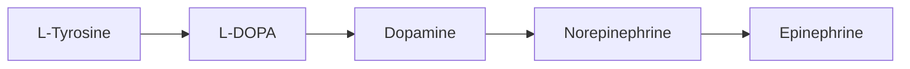

### The Catecholamine Synthesis Pathway

This is one of the most important biosynthetic pathways in neuroscience:

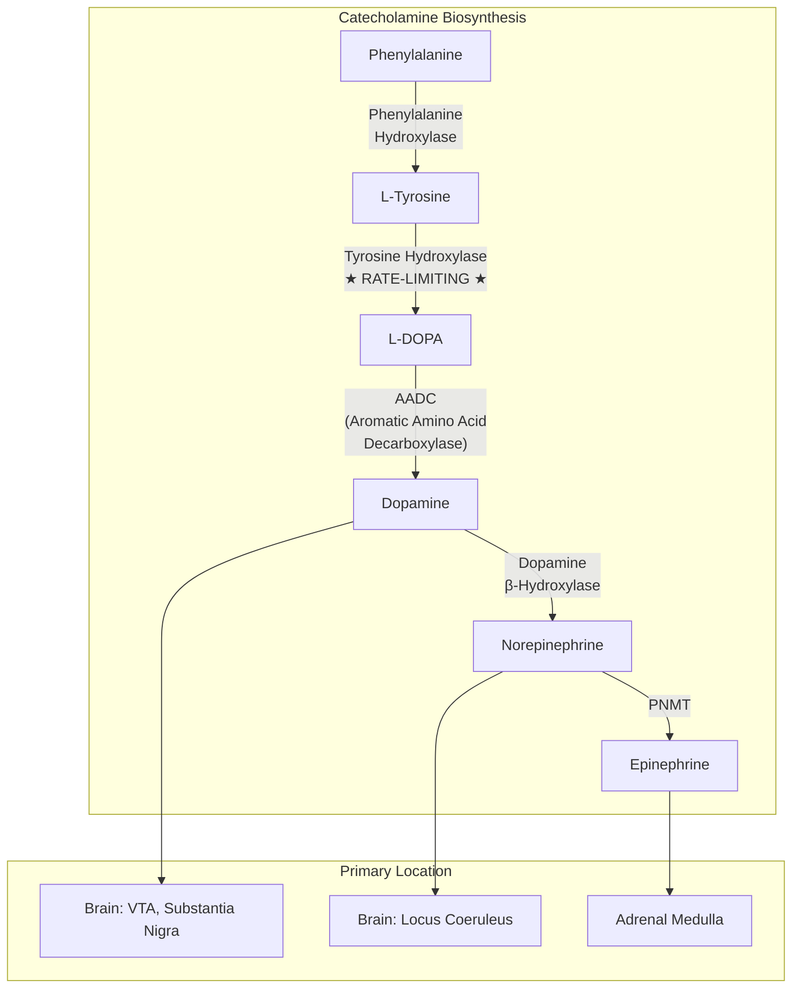

### The Rate-Limiting Step: Tyrosine Hydroxylase

This enzyme is the key to understanding when tyrosine supplementation works:

| Condition | Tyrosine Hydroxylase Status | Effect of Tyrosine Supplementation |
|-----------|----------------------------|-----------------------------------|
| Normal/rested | Saturated with substrate | *Minimal effect* |
| Acute stress | Increased activity, depleting tyrosine | *Significant benefit* |
| Sleep deprivation | Catecholamine depletion | *Significant benefit* |
| Cold exposure | High NE demand | *Significant benefit* |
| Intense cognitive load | Increased DA turnover | *Moderate benefit* |

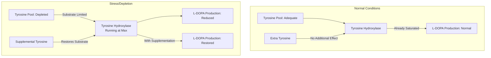

### Why Tyrosine Works Best Under Stress

The "depleted state" principle explains tyrosine's unique efficacy pattern:

| State | Catecholamine Status | Tyrosine Response | Analogy |
|-------|---------------------|-------------------|---------|
| Well-rested, unstressed | Full reserves | Minimal | Full gas tank — adding more overflows |
| Acute stress | Depleting rapidly | *Strong* | Tank draining — refueling helps |
| Sleep-deprived | Significantly depleted | *Strong* | Near empty — refueling critical |
| Multi-stressor | Severely depleted | *Very strong* | Running on fumes — tyrosine rescues |

### Catecholamine Functions

| Neurotransmitter | Primary Functions | Depletion Symptoms |
|------------------|-------------------|-------------------|
| **Dopamine** | Motivation, reward, working memory, motor control | Apathy, poor focus, anhedonia |
| **Norepinephrine** | Alertness, attention, stress response, arousal | Fatigue, poor concentration, brain fog |
| **Epinephrine** | Fight-or-flight, energy mobilization | Reduced stress capacity |

### Complete Mechanism Summary

| Mechanism | Target | Condition | Magnitude |
|-----------|--------|-----------|-----------|
| **DA precursor** | Dopaminergic neurons | Stress/depletion | High |
| **NE precursor** | Noradrenergic neurons | Stress/depletion | High |
| **Thyroid hormone precursor** | Thyroid | Chronic | Low |
| **Melanin precursor** | Melanocytes | Chronic | Minimal |

</Accordion>

<Accordion title="Stress Resilience Research" icon="shield">

### The Military Research Program

L-Tyrosine has been extensively studied by military researchers investigating cognitive performance under operational stress:

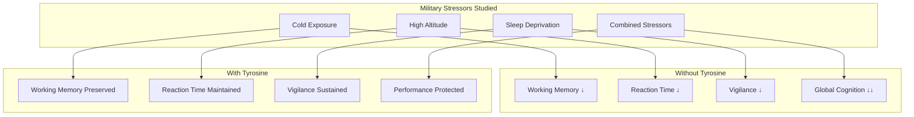

### Key Military/Stress Studies

| Study | Stressor | Dose | N | Finding |
|-------|----------|------|---|---------|
| **Banderet 1989** | Cold + altitude | 100 mg/kg | 23 | *Protected mood, cognitive performance* |
| **Shurtleff 1994** | Cold water immersion | 150 mg/kg | 8 | *Maintained working memory, vigilance* |
| **Neri 1995** | Sleep deprivation (night work) | 150 mg/kg | 20 | *Sustained performance for ~3 hours* |
| **Mahoney 2007** | Multi-stressor military exercise | 300 mg total | 19 | *Improved memory, tracking* |
| **O'Brien 2007** | Combat training stress | 2×150 mg/kg | 21 | *Attenuated stress-induced impairment* |

### Cold Exposure Studies

Cold is a potent catecholamine stressor — the body rapidly depletes norepinephrine:

| Study | Protocol | Tyrosine Dose | Result |
|-------|----------|---------------|--------|
| Banderet 1989 | 4.5 hours at 15°C + altitude | 100 mg/kg | *↓ Cognitive impairment* |
| Shurtleff 1994 | Cold water immersion | 150 mg/kg | *↑ Working memory, vigilance* |

### Sleep Deprivation Studies

Sleep deprivation causes significant catecholamine depletion:

| Study | Protocol | Tyrosine Dose | Duration of Benefit |
|-------|----------|---------------|---------------------|
| Neri 1995 | One night without sleep | 150 mg/kg | *~3 hours protection* |
| Magill 2003 | 24h sleep deprivation | 150 mg/kg | *Significant vigilance maintenance* |

### The Multi-Stressor Advantage

Tyrosine's benefits *increase* as stressor severity increases:

| Stressor Load | Tyrosine Benefit | Explanation |
|---------------|------------------|-------------|
| Single, mild | Small | Some catecholamine reserve remains |
| Single, severe | Moderate | Reserve depleting |
| Multiple, severe | *Large* | Reserves exhausted — tyrosine critical |

### Real-World Stress Applications

| Scenario | Catecholamine Demand | Tyrosine Relevance |
|----------|---------------------|-------------------|
| Exam week + poor sleep | High | *Strong benefit expected* |
| High-pressure deadline | High | *Moderate-strong benefit* |
| International travel + jet lag | Moderate-High | *Moderate benefit* |
| Intense athletic training | High | *Moderate benefit* |
| Normal day, well-rested | Low | *Minimal benefit* |

<Note>
**The Key Insight:** Tyrosine is not a stimulant that enhances normal performance. It's a *buffer* that prevents stress-induced cognitive decline by ensuring catecholamine precursor availability when demands are high. Think of it as insurance for your neurotransmitter reserves.
</Note>

</Accordion>

<Accordion title="Dopamine System Deep Dive" icon="brain">

### Dopamine Pathways

Dopamine operates through four major pathways in the brain:

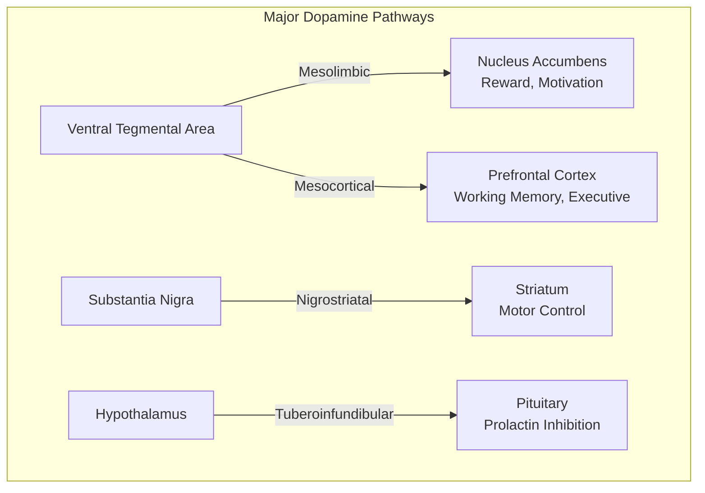

### Dopamine Functions by Pathway

| Pathway | Origin → Target | Function | Tyrosine Relevance |
|---------|-----------------|----------|-------------------|
| **Mesolimbic** | VTA → NAc | Reward, motivation, pleasure | *High* — motivation under stress |
| **Mesocortical** | VTA → PFC | Working memory, attention, planning | *High* — cognitive performance |
| **Nigrostriatal** | SN → Striatum | Motor control, habit formation | Moderate |
| **Tuberoinfundibular** | Hypothalamus → Pituitary | Prolactin regulation | Low |

### Dopamine and Working Memory

The prefrontal cortex requires optimal dopamine for working memory function:

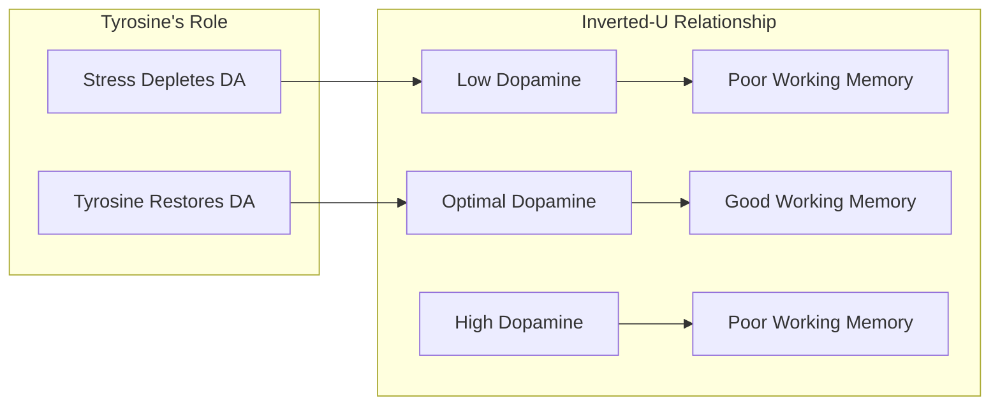

The *inverted-U* relationship means:
- Too little dopamine → poor performance
- Optimal dopamine → peak performance  
- Too much dopamine → poor performance (overstimulation)

Tyrosine helps *restore* depleted dopamine toward optimal, not push beyond it.

### Dopamine Receptor Subtypes

| Receptor | Type | Location | Function |
|----------|------|----------|----------|
| **D1** | Excitatory (Gs) | Cortex, striatum | Working memory, reward |
| **D2** | Inhibitory (Gi) | Striatum, limbic | Motor control, reward |
| D3 | Inhibitory (Gi) | Limbic | Emotion, reward |
| D4 | Inhibitory (Gi) | Cortex, limbic | Attention, cognition |
| D5 | Excitatory (Gs) | Hippocampus | Memory |

### Norepinephrine System

Norepinephrine complements dopamine for attention and arousal:

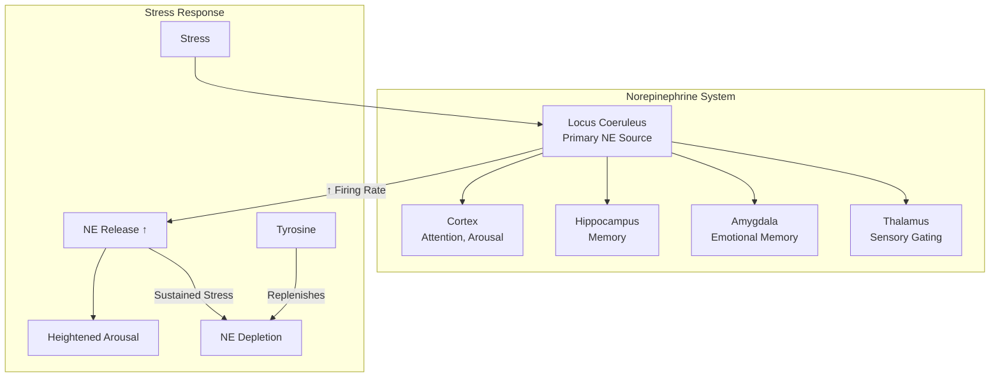

### Catecholamine Turnover Under Stress

| Condition | DA Turnover | NE Turnover | Tyrosine Demand |
|-----------|-------------|-------------|-----------------|
| Rest | Baseline | Baseline | Low |
| Mild stress | ↑ 20-50% | ↑ 30-60% | Moderate |
| Severe stress | ↑ 100-200% | ↑ 150-300% | *High* |
| Multi-stressor | ↑ 200%+ | ↑ 300%+ | *Very high* |

</Accordion>

<Accordion title="Pharmacokinetic Profile" icon="chart-line">

### ADME Parameters

| Parameter | Value | Notes |
|-----------|-------|-------|
| **Bioavailability** | ~90% | Excellent oral absorption |
| **Tmax** | 1-2 hours | Peak plasma levels |
| **Half-life** | ~2-3 hours | Relatively short |
| **Transport** | Large neutral amino acid transporter (LAT1) | Competes with BCAAs |
| **BBB penetration** | Good (via LAT1) | Readily enters brain |
| **Metabolism** | Multiple pathways | See below |

### Absorption and Transport

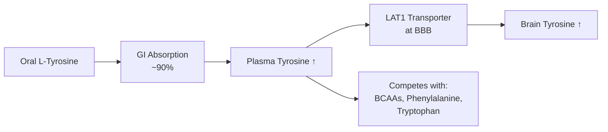

### Plasma and Brain Timeline

| Time After Dose | Plasma Level | Brain Level | Catecholamine Effect |
|-----------------|--------------|-------------|---------------------|
| 0 min | Baseline | Baseline | None |
| 30 min | Rising rapidly | Beginning to rise | Minimal |
| 60 min | Near peak | Rising | Emerging |
| 90-120 min | *Peak* | *Peak* | *Maximal* |
| 3 hours | Declining | Declining | Waning |
| 4-5 hours | Near baseline | Declining | Minimal |

### The BCAA Competition Factor

L-Tyrosine shares the LAT1 transporter with other large neutral amino acids:

| Amino Acid | Transporter | Competition Effect |
|------------|-------------|-------------------|
| **L-Tyrosine** | LAT1 | Target |
| Leucine (BCAA) | LAT1 | Competes |
| Isoleucine (BCAA) | LAT1 | Competes |
| Valine (BCAA) | LAT1 | Competes |
| Phenylalanine | LAT1 | Competes |
| Tryptophan | LAT1 | Competes |

**Practical implication:** For optimal brain uptake, take tyrosine:
- *Away from* high-protein meals
- *Away from* BCAA supplements
- On an empty stomach or with carbohydrates (insulin helps clear competing amino acids)

### Metabolic Fate

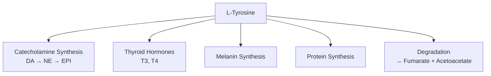

### Duration of Action

| Parameter | Duration | Notes |
|-----------|----------|-------|
| Plasma elevation | 3-4 hours | After single dose |
| Brain elevation | 3-4 hours | Follows plasma |
| Cognitive benefit | *2-4 hours* | Under stress conditions |
| Optimal redosing | Every 3-4 hours | If sustained effect needed |

</Accordion>

<Accordion title="Form Selection" icon="magnifying-glass-plus">

### L-Tyrosine vs N-Acetyl L-Tyrosine (NALT)

This is a common point of confusion:

| Parameter | L-Tyrosine | N-Acetyl L-Tyrosine (NALT) |
|-----------|------------|---------------------------|
| Bioavailability | *~90%* | *~20%* (requires deacetylation) |
| Plasma tyrosine increase | Large | Small |
| Research base | Extensive | Very limited |
| Solubility | Lower | Higher |
| Effective dose | 500-2000 mg | Would need much higher |
| Recommendation | *Preferred* | Not recommended |

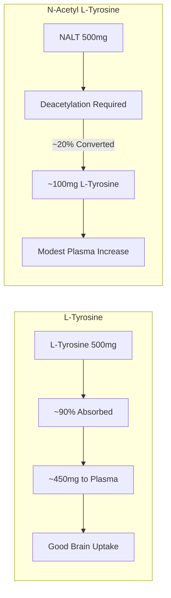

**Bottom line:** Despite better solubility, NALT is *less effective* than plain L-Tyrosine because most is excreted unchanged.

### Quality Specification (StressShield)

| Attribute | Specification | Method |
|-----------|---------------|--------|
| Identity | L-Tyrosine | HPLC, chiral analysis |
| Assay | ≥99.0% | HPLC |
| Specific rotation | -10.0° to -12.0° | Polarimetry |
| pH (1% solution) | 5.0-6.5 | pH meter |
| Heavy metals (total) | ≤10 ppm | ICP-MS |
| Lead | ≤1 ppm | ICP-MS |
| Arsenic | ≤1 ppm | ICP-MS |
| Loss on drying | ≤0.5% | Gravimetric |
| Microbial (TPC) | ≤1000 CFU/g | USP &lt;61&gt; |

### Chirality Matters

| Form | Biological Activity | Notes |
|------|---------------------|-------|
| **L-Tyrosine** | *Active* | Natural form; used by enzymes |
| D-Tyrosine | Inactive | Not recognized by tyrosine hydroxylase |
| DL-Tyrosine (racemic) | 50% active | Avoid; half is wasted |

<Note>
**StressShield Specification:** NTRPX uses pure L-Tyrosine (not NALT or racemic mixtures). Chiral analysis confirms the correct stereochemistry for biological activity. The 500mg dose in Sprint and 250mg in Boost provide effective catecholamine precursor support based on clinical research.
</Note>

</Accordion>

<Accordion title="Dosing Rationale" icon="capsules">

### Dose-Response Analysis

| Dose | Acute Stress Effect | Research Context | Notes |
|------|---------------------|------------------|-------|
| 100 mg/kg | Strong | Military studies | ~7g for 70kg person |
| 150 mg/kg | Strong | Sleep deprivation studies | ~10.5g for 70kg person |
| 500-2000 mg | Moderate | Practical supplementation | *NTRPX range* |
| &lt;500 mg | Minimal | — | Below threshold |

**Note on military doses:** Research doses (100-150 mg/kg) are very high. Practical supplementation uses lower doses that still provide meaningful benefit, especially when combined with other compounds.

### NTRPX Protocol

| Product | L-Tyrosine Dose | Context | Timing |
|---------|-----------------|---------|--------|
| **Sprint** | 500 mg | Acute cognitive demand | 30-60 min before |
| **Boost** | 250 mg | Daily baseline support | Morning |

### Timing Optimization

| Scenario | Timing | Dose | Rationale |
|----------|--------|------|-----------|
| Before demanding task | 30-60 min prior | 500-1000 mg | Peak levels at task |
| During prolonged stress | Every 3-4 hours | 500 mg | Maintain levels |
| Morning routine | With Boost | 250 mg | Baseline support |
| Sleep-deprived day | Every 3-4 hours | 500 mg | Sustain catecholamines |

### Population-Specific Considerations

| Population | Dose | Notes |
|------------|------|-------|
| **Healthy adults (stressed)** | 500-2000 mg | Research-supported |
| **Daily maintenance** | 250-500 mg | With Boost |
| **Acute performance need** | 500-1000 mg | With Sprint |
| **Extended cognitive demand** | 500 mg every 3-4h | Redose as needed |
| **PKU patients** | *Contraindicated* | Cannot metabolize phenylalanine/tyrosine |

### Practical Dosing Table

| Body Weight | Research Dose (100mg/kg) | Practical Dose |
|-------------|--------------------------|----------------|
| 60 kg (132 lb) | 6,000 mg | 500-1500 mg |
| 70 kg (154 lb) | 7,000 mg | 500-2000 mg |
| 80 kg (176 lb) | 8,000 mg | 500-2000 mg |
| 90 kg (198 lb) | 9,000 mg | 750-2000 mg |

### Maximizing Absorption

| Strategy | Rationale | Recommendation |
|----------|-----------|----------------|
| Empty stomach | Reduces amino acid competition | *Preferred* |
| With carbohydrates | Insulin clears competing AAs | Good alternative |
| Away from protein | Less LAT1 competition | Important |
| Away from BCAAs | Direct competition | Important |

</Accordion>

<Accordion title="Synergy Matrix" icon="link">

### NTRPX System Synergies

L-Tyrosine integrates with the NTRPX system as the catecholamine foundation:

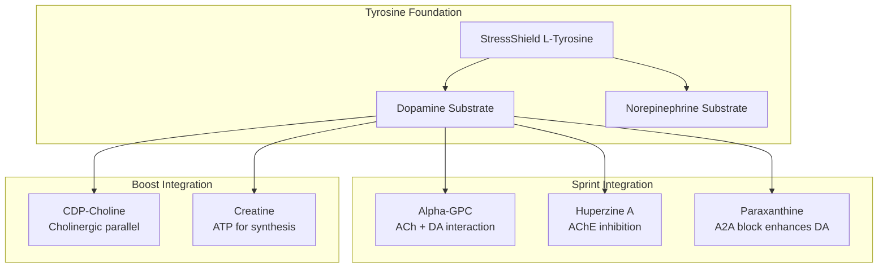

### Tyrosine + Paraxanthine Synergy

This is a particularly powerful combination for cognitive performance:

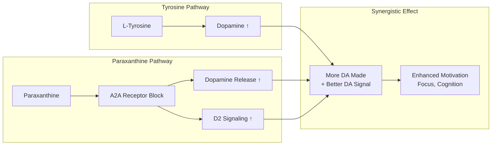

**Why this works:** Paraxanthine blocks A2A receptors which normally *inhibit* dopamine signaling. Tyrosine provides the substrate. Together: more dopamine made AND more dopamine signaling.

### Tyrosine + CDP-Choline

Parallel enhancement of two major neurotransmitter systems:

| System | Compound | Effect |
|--------|----------|--------|
| **Catecholaminergic** | L-Tyrosine | DA/NE precursor support |
| **Cholinergic** | CDP-Choline | ACh precursor support |
| **Combined** | Both | *Broader cognitive enhancement* |

### Tyrosine + Creatine

Both support neuronal energy and synthesis:

| Creatine Contribution | Tyrosine Contribution | Combined Benefit |
|-----------------------|----------------------|------------------|
| ATP regeneration | Catecholamine substrate | DA synthesis needs ATP |
| Brain energy buffer | Stress resilience | *Dual protection under demand* |

### Clinically-Demonstrated Synergies

| Combination | Evidence | Mechanism | Application |
|-------------|----------|-----------|-------------|
| **Tyrosine + Caffeine** | Moderate | Caffeine ↑ catecholamine release; tyrosine ↑ synthesis | Stimulant stack |
| **Tyrosine + B6 (P5P)** | Moderate | B6 is cofactor for AADC | Synthesis support |
| **Tyrosine + Stress** | *Strong* | Stress depletes; tyrosine restores | Core mechanism |

### B-Vitamin Cofactor Support

The catecholamine synthesis enzymes require cofactors:

| Enzyme | Cofactor | Notes |
|--------|----------|-------|
| Tyrosine Hydroxylase | BH4 (tetrahydrobiopterin), Fe²⁺ | Rate-limiting |
| AADC | PLP (B6) | Converts L-DOPA to dopamine |
| Dopamine β-Hydroxylase | Vitamin C, Cu²⁺ | Converts DA to NE |

### Synergies with External Compounds

| External Compound | Synergy Type | Mechanism |
|-------------------|--------------|-----------|
| **Mucuna pruriens** | Caution — additive | Contains L-DOPA directly |
| **Caffeine** | Synergistic | ↑ Catecholamine release |
| **Rhodiola** | Complementary | MAO inhibition may preserve catecholamines |
| **Phenylalanine** | Upstream | Converts to tyrosine |
| **Vitamin B6 (P5P)** | Cofactor support | Essential for AADC |
| **Vitamin C** | Cofactor support | Essential for DBH |

### Contraindicated Combinations

| Combination | Concern | Recommendation |
|-------------|---------|----------------|
| **Tyrosine + MAOIs** | Hypertensive crisis risk | *Absolute contraindication* |
| **Tyrosine + High-dose Mucuna** | Excessive DA | Caution; medical supervision |
| **Tyrosine + Levodopa** | Interaction potential | Medical supervision |

### Synergy Rating Summary

| Synergy | Products | Evidence | Rating |
|---------|----------|----------|--------|
| Tyrosine + Paraxanthine | Sprint/ParaCaffeine | Logical (strong) | ★★★★★ |
| Tyrosine + CDP-Choline | Sprint/Boost | Logical | ★★★★☆ |
| Tyrosine + Alpha-GPC | Sprint | Logical | ★★★★☆ |
| Tyrosine + Creatine | Sprint/Boost | Logical | ★★★★☆ |
| Tyrosine + Caffeine | External | Moderate | ★★★★☆ |
| Tyrosine + B6 (P5P) | External | Moderate | ★★★☆☆ |
| Tyrosine + Acute Stress | Context | *Strong* | ★★★★★ |

</Accordion>

<Accordion title="Clinical Evidence" icon="book-open">

### Stress and Depletion Studies

| Study | Stressor | Design | N | Dose | Finding |
|-------|----------|--------|---|------|---------|
| **Banderet 1989** | Cold + altitude | RCT | 23 | 100 mg/kg | *↓ Cognitive impairment, ↑ mood* |
| **Shurtleff 1994** | Cold water | RCT | 8 | 150 mg/kg | *↑ Working memory, vigilance* |
| **Neri 1995** | Sleep deprivation | RCT | 20 | 150 mg/kg | *↑ Performance ~3 hours* |
| **Deijen 1999** | Memory demand | RCT | 16 | 150 mg/kg | *↑ Working memory (demand-dependent)* |
| **Mahoney 2007** | Military stress | RCT | 19 | 300 mg | *↑ Memory, tracking* |
| **O'Brien 2007** | Combat training | RCT | 21 | 2×150 mg/kg | *↓ Stress-induced impairment* |

### Normal Condition Studies (Less Robust)

| Study | Condition | N | Dose | Finding |
|-------|-----------|---|------|---------|
| **Colzato 2013** | Normal, rested | 22 | 2g | ↑ Cognitive flexibility (moderate) |
| **Steenbergen 2015** | Normal | 32 | 2g | ↑ Deep thinking (specific conditions) |
| **Jongkees 2015** | Meta-analysis | Multiple | Various | *Effects strongest under demanding conditions* |

### Meta-Analysis Conclusions (Jongkees et al., 2015)

Key findings from systematic review:

| Condition | Tyrosine Effect | Confidence |
|-----------|-----------------|------------|
| Stress/depletion | *Significant benefit* | High |
| Demanding cognitive tasks | Moderate benefit | Moderate |
| Normal/rested | Minimal benefit | High |

**The meta-analysis confirmed:** Tyrosine's cognitive benefits are *demand-dependent* — greatest when catecholamines are depleted.

### Mechanism Studies

| Study | Focus | Finding |
|-------|-------|---------|
| **Fernstrom 2007** | Brain tyrosine | Plasma tyrosine → brain tyrosine → catecholamine synthesis |
| **Lehnert 1984** | Stress response | Stress ↑ catecholamine turnover, depleting substrate |
| **Gibson 2007** | Review | Tyrosine's effects depend on synthesis rate demands |

### Effect Size Summary

| Condition | Effect Size | Confidence |
|-----------|-------------|------------|
| Working memory (stressed) | d = 0.5-0.8 | Moderate-High |
| Vigilance (sleep-deprived) | d = 0.6-1.0 | Moderate |
| Cognition (normal) | d = 0.1-0.3 | Moderate (minimal effect) |
| Mood (stressed) | d = 0.3-0.5 | Moderate |

### References

**Military/Stress Studies:**
- Banderet LE, Lieberman HR. Treatment with tyrosine, a neurotransmitter precursor, reduces environmental stress in humans. *Brain Res Bull.* 1989;22(4):759-62. [PubMed](https://pubmed.ncbi.nlm.nih.gov/2736402/)
- Shurtleff D et al. Tyrosine reverses a cold-induced working memory deficit in humans. *Pharmacol Biochem Behav.* 1994;47(4):935-41. [PubMed](https://pubmed.ncbi.nlm.nih.gov/8029265/)
- Neri DF et al. The effects of tyrosine on cognitive performance during extended wakefulness. *Aviat Space Environ Med.* 1995;66(4):313-9. [PubMed](https://pubmed.ncbi.nlm.nih.gov/7794222/)

**Reviews and Meta-Analyses:**
- Jongkees BJ et al. Effect of tyrosine supplementation on clinical and healthy populations under stress or cognitive demands. *J Psychiatr Res.* 2015;70:50-7. [PubMed](https://pubmed.ncbi.nlm.nih.gov/26424423/)
- Hase A et al. Behavioral and cognitive effects of tyrosine intake in healthy human adults. *Pharmacol Biochem Behav.* 2015;133:1-6. [PubMed](https://pubmed.ncbi.nlm.nih.gov/25797188/)

**Mechanism:**
- Fernstrom JD, Fernstrom MH. Tyrosine, phenylalanine, and catecholamine synthesis and function in the brain. *J Nutr.* 2007;137(6):1539S-47S. [PubMed](https://pubmed.ncbi.nlm.nih.gov/17513421/)

</Accordion>

<Accordion title="Safety & Classification" icon="shield-check">

### Adverse Event Profile

| Event | Incidence | Severity | Notes |
|-------|-----------|----------|-------|
| **GI discomfort** | Uncommon | Mild | Usually with high doses |
| **Headache** | Rare | Mild | Dose-dependent |
| **Insomnia** | Rare | Mild | If taken late in day |
| **Overstimulation** | Rare | Mild | Sensitive individuals |

### Safety Data

| Parameter | Finding |
|-----------|---------|
| **LD50 (rat)** | &gt;4000 mg/kg |
| **NOAEL** | Not clearly defined (very safe) |
| **Research doses** | Up to 150 mg/kg safely used |
| **Long-term safety** | Limited data but no concerns |
| **Genotoxicity** | No evidence |
| **Teratogenicity** | Insufficient data |

### Regulatory Status

| Region | Status | Notes |
|--------|--------|-------|
| **United States** | GRAS; Dietary supplement | Amino acid |
| **European Union** | Permitted in supplements | Food supplement |
| **Australia** | Permitted | Listed substance |
| **Japan** | Permitted | Amino acid supplement |

### Contraindications

| Category | Consideration | Severity |
|----------|---------------|----------|
| **PKU (Phenylketonuria)** | Cannot metabolize Phe/Tyr | ★★★★★ *Absolute contraindication* |
| **MAOI medications** | Hypertensive crisis risk | ★★★★★ *Absolute contraindication* |
| **Hyperthyroidism** | Tyrosine → thyroid hormones | ★★★☆☆ Caution; consult |
| **Graves' disease** | Thyroid consideration | ★★★☆☆ Caution; consult |
| **Melanoma history** | Tyrosine → melanin | ★★☆☆☆ Theoretical; consult |

### Drug Interactions

| Drug Class | Interaction | Severity | Notes |
|------------|-------------|----------|-------|
| **MAOIs** | *Hypertensive crisis* | ★★★★★ | *Absolute contraindication* |
| **Levodopa** | Competition, interaction | ★★★★☆ | Medical supervision required |
| **Thyroid medications** | May affect levels | ★★★☆☆ | Monitor thyroid function |
| **Stimulants** | Additive catecholamine effect | ★★☆☆☆ | Caution; usually manageable |

### The PKU Warning

Phenylketonuria (PKU) is an absolute contraindication:

| Condition | Issue | Action |
|-----------|-------|--------|
| **PKU** | Cannot metabolize phenylalanine (→ tyrosine) | *Do not use* |
| **Carrier status** | Usually no issue | Standard dosing OK |
| **Unknown status** | Most people are not affected | Standard dosing OK |

### Special Populations

| Population | Safety Status | Notes |
|------------|---------------|-------|
| **Healthy adults** | Excellent | Primary use |
| **Athletes** | Excellent | Common use |
| **Stressed individuals** | Excellent | Primary benefit population |
| **PKU patients** | *Contraindicated* | — |
| **MAOI users** | *Contraindicated* | — |
| **Thyroid conditions** | Caution | Consult provider |
| **Pregnancy** | Insufficient data | Consult provider |

---

### <Icon icon="star" color="#5A8FA8" /> Tier 1: Foundation

<CardGroup cols={3}>
<Card title="Efficacy" icon="check" color="#5A8FA8">Moderate-High (Stress-Dependent)</Card>
<Card title="Validation" icon="check" color="#5A8FA8">Strong — Military research; meta-analysis support</Card>
<Card title="Safety" icon="check" color="#5A8FA8">Excellent — GRAS amino acid; well-tolerated</Card>
</CardGroup>

**Tier Rationale:** Tier 1 (Foundation) classification. L-Tyrosine has strong evidence for cognitive protection under stress, sleep deprivation, and demanding conditions. The military research program provides robust data from controlled multi-stressor studies. Effect sizes are meaningful (d = 0.5-0.8) under depleted conditions. Benefits are *demand-dependent* — greatest when catecholamines are challenged. Safety is excellent as an endogenous amino acid with GRAS status. The clear mechanistic rationale (catecholamine precursor) supports the observed effects. A true foundational compound for stress resilience.

</Accordion>

<Accordion title="Practical Considerations" icon="clipboard-list">

### When to Use L-Tyrosine

| Scenario | Expected Benefit | Recommended Dose |
|----------|------------------|------------------|
| Exam/deadline stress | *High* | 500-1000 mg, 30-60 min before |
| Sleep deprivation | *High* | 500-1000 mg every 3-4 hours |
| Intense workday | *Moderate-High* | 500 mg morning + afternoon |
| Normal, rested day | Minimal | 250 mg (Boost) is sufficient |
| Cold exposure | *High* | 500-1000 mg before exposure |
| Travel fatigue/jet lag | Moderate | 500 mg as needed |

### Realistic Expectations

| Condition | What to Expect |
|-----------|----------------|
| **Under stress** | *Maintained focus and working memory that would otherwise decline* |
| **Sleep-deprived** | *~3 hours of sustained alertness/performance* |
| **Normal state** | Subtle at best; not a nootropic in the traditional sense |

**Key understanding:** Tyrosine *prevents decline* rather than *enhances beyond baseline*. It's a buffer, not a stimulant.

### Optimizing Response

| Strategy | Rationale |
|----------|-----------|
| Take on empty stomach | Maximizes brain uptake |
| Avoid taking with protein | Reduces amino acid competition |
| Time 30-60 min before demand | Peak levels at task |
| Redose every 3-4 hours if needed | Short half-life |
| Combine with Sprint stack | Synergistic effects |

### Signs It's Working

| Indicator | Description |
|-----------|-------------|
| Sustained focus under pressure | Working memory doesn't decline |
| Maintained motivation | Drive persists despite fatigue |
| Resilience to stress | Less cognitive impairment |
| Extended productive work | Longer effective work periods |

### Signs It May Not Be Optimal

| Sign | Possible Cause | Solution |
|------|----------------|----------|
| No effect felt | Not in depleted state | Use only when stressed/fatigued |
| Overstimulation | Sensitive individual or too much | Reduce dose |
| GI discomfort | High dose or sensitivity | Take with light carbs |

### Common Questions

**Q: Will tyrosine give me energy like caffeine?**
A: No. Tyrosine isn't a stimulant — it prevents decline under stress rather than boosting above baseline. It works best when you're depleted.

**Q: Should I take tyrosine every day?**
A: The 250mg in Boost provides baseline support. Higher doses (Sprint) are best reserved for demanding situations.

**Q: Can I take tyrosine with coffee?**
A: Yes. Caffeine and tyrosine have complementary mechanisms and are often combined effectively.

**Q: Why didn't I feel anything?**
A: If you're well-rested and unstressed, tyrosine may have minimal effect. Its benefits emerge under demanding conditions.

**Q: How long do the effects last?**
A: About 2-4 hours. Redose if sustained benefit is needed.

</Accordion>

</AccordionGroup>

---

<Tip>
**StressShield Summary:** L-Tyrosine (500mg in Sprint, 250mg in Boost) is the catecholamine precursor that maintains cognitive performance when stress, sleep deprivation, or intense demand would otherwise cause decline. Unlike stimulants that push performance above baseline, tyrosine *prevents the drop* — it's a buffer for your dopamine and norepinephrine reserves. Military research confirms its ability to protect working memory, vigilance, and mood under multi-stressor conditions. Use it strategically when demands exceed normal capacity.
</Tip>