## NeuroMag™ Magnesium L-Threonate

<CardGroup cols={4}>

<Card title="Recover" icon="moon" color="#6366f1">
2,000 mg (144 mg Mg)
</Card>

<Card title="Form" icon="atom" color="#64748b">
Magnesium L-Threonate
</Card>

<Card title="Purity" icon="gem" color="#64748b">
Magtein® Grade
</Card>

<Card title="Target" icon="brain" color="#64748b">
Brain Bioavailable
</Card>

</CardGroup>

**The only magnesium that actually reaches your brain.** Here is an uncomfortable truth: despite magnesium being involved in over 600 enzymatic reactions and being critical for NMDA receptor function, GABA signaling, and synaptic plasticity — *standard magnesium supplements barely cross the blood-brain barrier*. Magnesium oxide, citrate, glycinate, and other popular forms raise serum magnesium effectively, but CSF (cerebrospinal fluid) magnesium? Minimally affected. This is why MIT neuroscientists developed Magnesium L-Threonate (Magtein®): a novel compound where L-threonate — a metabolite of vitamin C — serves as a carrier that *dramatically enhances brain magnesium uptake* via GLUT transporters. The result: the only magnesium form clinically proven to increase brain magnesium levels, enhance synaptic density, improve learning and memory, and — critically for NTRPX Recover — **significantly improve sleep quality, deep sleep duration, and next-day cognitive performance**. In 2024 RCTs with Oura Ring validation, Magtein® improved Insomnia Severity Index scores, increased deep and REM sleep, enhanced HRV during sleep, and reduced resting heart rate. This isn't just another magnesium supplement. This is *magnesium that works where it matters most*.

<AccordionGroup>

<Accordion title="The Brain Magnesium Problem" icon="triangle-exclamation">

### Why Brain Magnesium Deficiency Is Epidemic

Magnesium deficiency is remarkably common — estimated at 50-90% of the population — but *brain* magnesium deficiency is even more problematic because:

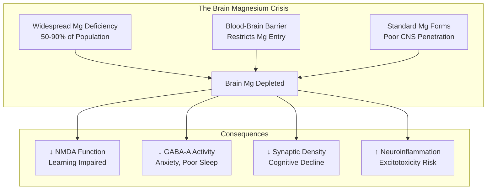

### Brain Magnesium: The Numbers

| Metric | Value | Significance |
|--------|-------|--------------|
| **CSF Mg concentration** | 1.0-1.2 mM | Tightly regulated by BBB |
| **Brain Mg as % of body Mg** | ~0.3% | Tiny fraction of total stores |
| **Serum-CSF Mg correlation** | *Weak* | Blood Mg ≠ Brain Mg |
| **Age-related brain Mg decline** | ~20-30% | Correlates with cognitive decline |
| **Mg needed for ATP function** | Every ATP molecule | Mg-ATP is the active form |

### Why the Brain Guards Its Magnesium

The blood-brain barrier (BBB) tightly controls magnesium entry:

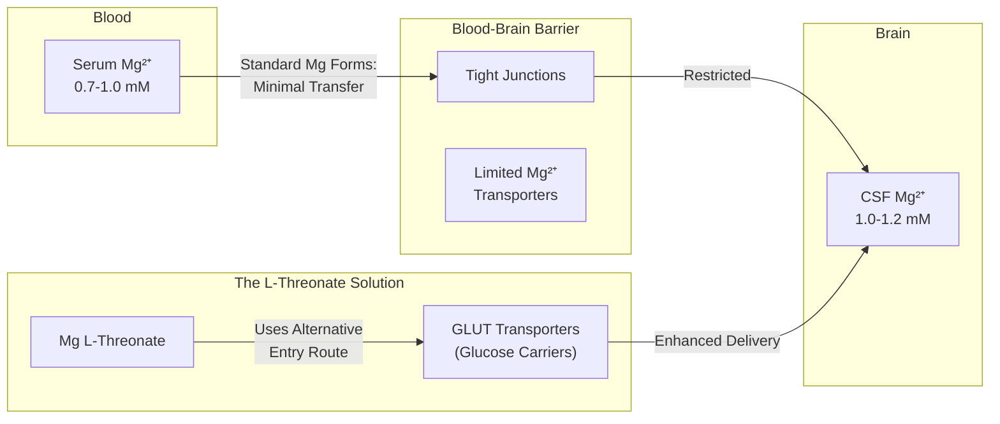

### Why This Matters for Sleep

Brain magnesium is critical for sleep through multiple mechanisms:

| Sleep Mechanism | Mg Role | Deficiency Consequence |
|-----------------|---------|------------------------|
| **GABA-A receptor function** | Positive allosteric modulator | ↓ Inhibition, ↑ Anxiety |
| **NMDA receptor regulation** | Voltage-dependent block | Excitotoxicity, poor memory consolidation |
| **Melatonin synthesis** | Cofactor for AANAT | ↓ Melatonin production |
| **HPA axis regulation** | Modulates cortisol | ↑ Night cortisol, ↑ Awakenings |
| **Muscle relaxation** | Ca²⁺ antagonist | Restlessness, cramps |
| **Parasympathetic tone** | Vagal nerve function | ↓ HRV, ↑ Sympathetic dominance |

<Note>
**The Core Problem:** You can take 400mg of magnesium citrate, oxide, or even glycinate daily — your serum magnesium will improve, your muscles may relax, but your *brain* magnesium levels will barely budge. This is why people report "magnesium helps my muscles but doesn't help my sleep or anxiety." The magnesium isn't reaching the brain where these effects are mediated.
</Note>

</Accordion>

<Accordion title="Mechanism of Action" icon="flask">

### How Magnesium L-Threonate Crosses the Blood-Brain Barrier

The breakthrough of Mg L-Threonate lies in its unique transport mechanism:

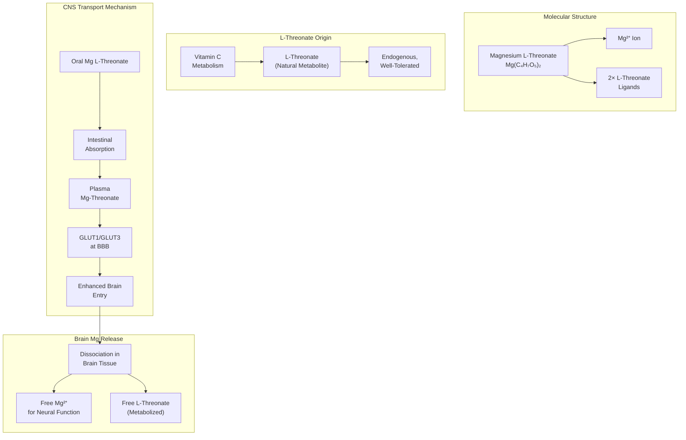

### The L-Threonate Carrier Advantage

| Property | L-Threonate | Standard Mg²⁺ |
|----------|-------------|---------------|
| **BBB permeability** | *High* (uses GLUT transporters) | Low (limited Mg channels) |
| **Brain Mg increase** | +15-25% (demonstrated) | Minimal (\<5%) |
| **CSF penetration** | Efficient | Poor |
| **Mechanism** | Hitchhikes on glucose transport | Passive diffusion only |
| **Origin** | Vitamin C metabolite | N/A |

### Unique GLUT Transporter Utilization

L-Threonate's structure allows it to utilize glucose transporters:

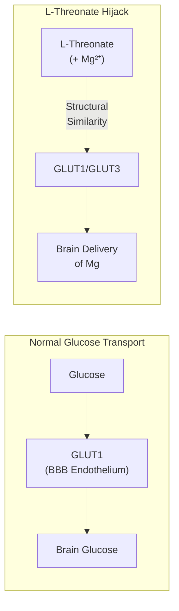

**Key Insight:** L-Threonate has structural features that allow recognition by GLUT transporters — the same highly efficient transporters that deliver glucose to the energy-hungry brain. This "Trojan horse" mechanism bypasses the normal limitations on magnesium BBB penetration.

### Once in the Brain: Magnesium's Neural Actions

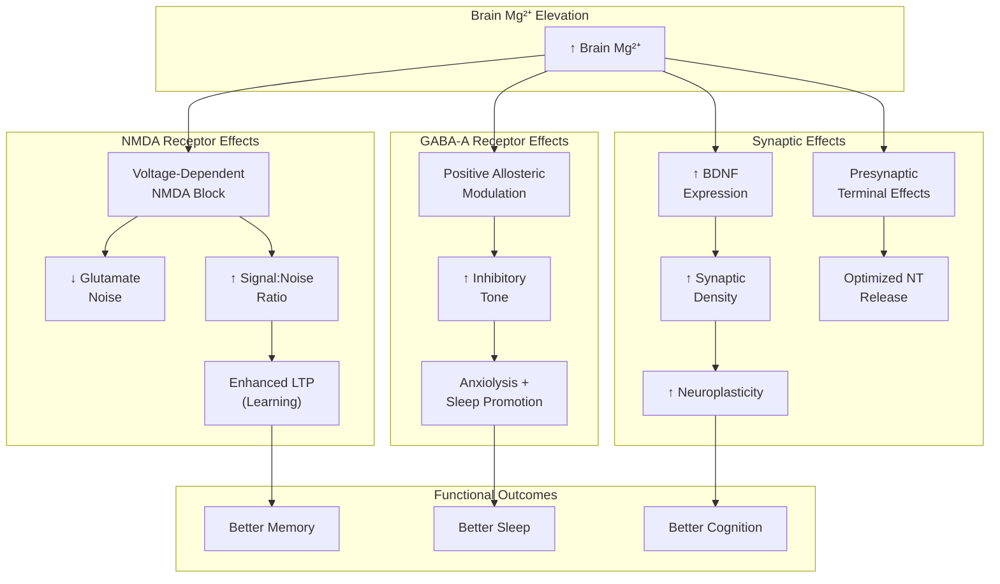

### Mechanism Summary Table

| Receptor/Target | Mg²⁺ Action | Functional Effect |
|-----------------|-------------|-------------------|
| **NMDA Receptor** | Voltage-dependent pore block | Reduces excitotoxicity; enhances signal:noise |
| **GABA-A Receptor** | Positive allosteric modulator | Anxiolysis; sleep promotion |
| **BDNF** | Upregulates expression | Neuroplasticity; synaptic density |
| **Na⁺/K⁺-ATPase** | Essential cofactor | Maintains neuronal membrane potential |
| **ATP** | Forms Mg-ATP complex | All energy-dependent processes |
| **Adenylate Cyclase** | Cofactor | cAMP signaling |
| **Presynaptic Ca²⁺ channels** | Modulates | Neurotransmitter release |

</Accordion>

<Accordion title="Why Standard Magnesium Forms Fail" icon="circle-xmark">

### The Bioavailability Illusion

Many magnesium forms have good *systemic* bioavailability but poor *CNS* delivery:

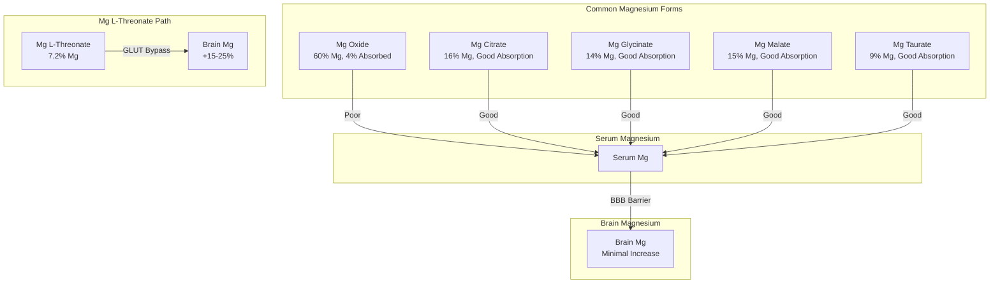

### Head-to-Head Comparison

| Form | Elemental Mg (%) | GI Absorption | Serum ↑ | **Brain ↑** | Sleep Evidence |
|------|------------------|---------------|---------|-------------|----------------|
| **Mg Oxide** | 60% | Poor (4%) | Low | **Minimal** | Weak |
| **Mg Citrate** | 16% | Good | Good | **Minimal** | Limited |
| **Mg Glycinate** | 14% | Good | Good | **Minimal** | Moderate (muscle) |
| **Mg Malate** | 15% | Good | Good | **Minimal** | Weak |
| **Mg Taurate** | 9% | Good | Good | **Minimal** | Weak |
| **Mg Chloride** | 12% | Good | Good | **Minimal** | Weak |
| **Mg L-Threonate** | 7.2% | Good | Moderate | **+15-25%** | **Strong (RCT)** |

### The Elemental Magnesium Paradox

Mg L-Threonate appears to have *less* elemental magnesium — but this is misleading:

| Comparison | Mg Citrate (500mg) | Mg L-Threonate (2,000mg) |
|------------|-------------------|--------------------------|
| **Elemental Mg** | 80mg | 144mg |
| **Serum Mg increase** | Higher | Lower |
| **Brain Mg increase** | ~0-5% | **~15-25%** |
| **Sleep quality RCTs** | None specific | **Multiple positive** |
| **Cognitive RCTs** | None specific | **Multiple positive** |

**The Point:** It's not about how much magnesium reaches your blood. It's about how much reaches your brain.

### Why Glycinate Isn't the Answer (For Sleep)

Magnesium glycinate is often recommended for sleep, but the evidence is indirect:

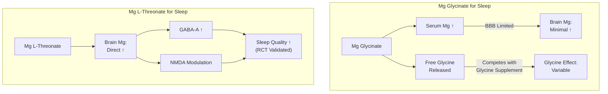

**Glycinate's Sleep Effects:**
- Partially from glycine release (better addressed by dedicated glycine supplementation)
- Partially from peripheral muscle relaxation (real but limited)
- Minimal direct CNS effects (doesn't cross BBB efficiently)

**L-Threonate's Sleep Effects:**
- Direct brain Mg elevation (proven in animal/human studies)
- Enhanced GABA-A receptor function in brain
- Improved deep sleep architecture (Oura Ring validated)
- Better HRV during sleep (parasympathetic shift)

<Note>
**NTRPX Strategy:** We use *both* forms strategically:
- **Mg L-Threonate in Recover** — For direct brain effects (sleep quality, anxiety, cognition)
- **Mg Citrate in Luna drink** — For peripheral effects (muscle relaxation) + the glycine in Luna provides the amino acid benefits

This dual approach provides comprehensive coverage: brain magnesium via L-Threonate, peripheral muscle relaxation via citrate, and the separate glycine pathway via dedicated supplementation.
</Note>

</Accordion>

<Accordion title="Clinical Evidence: Sleep" icon="moon">

### Landmark 2024 RCT: Oura Ring Validation

**Study:** Hausenblas et al., 2024  
**Design:** Randomized, double-blind, placebo-controlled  
**Population:** 80 adults (35-55 years) with self-reported sleep difficulties  
**Intervention:** 1g Mg L-Threonate (Magtein®) vs placebo × 21 days  
**Validation:** Oura Ring objective sleep tracking + validated questionnaires

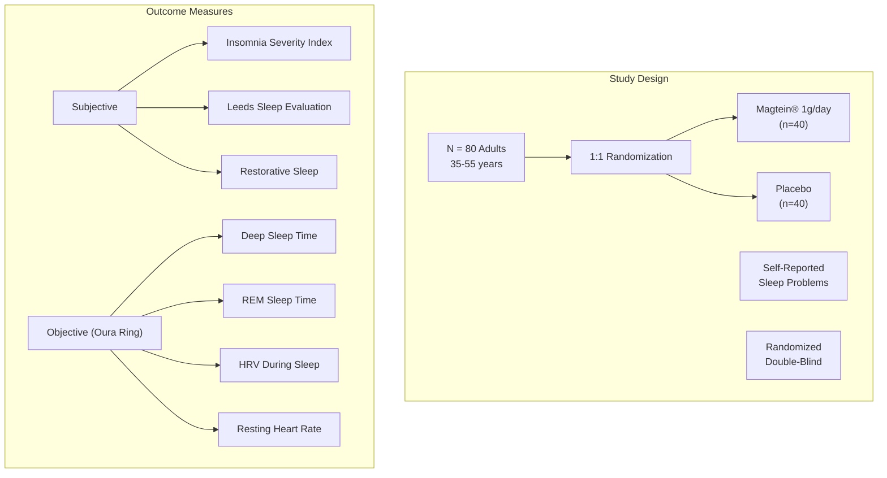

### Primary Outcomes

| Measure | Magtein® Change | Placebo Change | Significance |
|---------|-----------------|----------------|--------------|
| **Insomnia Severity Index** | ↓ Significant | No change | p < 0.05 |
| **Leeds Sleep Evaluation** | ↑ Significant | Minimal | p < 0.05 |
| **Restorative Sleep Questionnaire** | ↑ Significant | No change | p < 0.05 |

### Oura Ring Objective Data

| Sleep Metric | Magtein® Effect | Interpretation |
|--------------|-----------------|----------------|
| **Deep Sleep Duration** | ↑ Significant | More restorative N3 sleep |
| **REM Sleep Duration** | ↑ Significant | Better memory consolidation |
| **HRV (During Sleep)** | ↑ Significant | Enhanced parasympathetic tone |
| **Resting Heart Rate** | ↓ Significant | Reduced sympathetic activation |

### Timeline of Effects

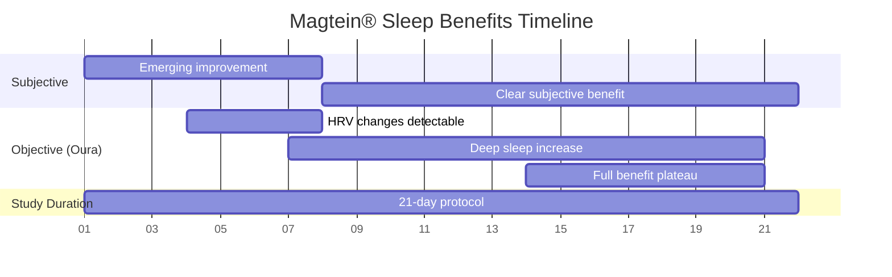

### Additional Sleep Outcomes

| Secondary Measure | Finding |
|-------------------|---------|
| **Mood upon waking** | Improved |
| **Daytime energy** | Increased |
| **Daytime alertness** | Enhanced |
| **Daily activity/productivity** | Improved |

### 2025 RCT: Extended Cognitive + Sleep Study

**Study:** Magtein® clinical trial, 2025  
**Design:** RCT, 6 weeks  
**Population:** Adults 25-45 years  
**Outcomes:** Cognitive performance + sleep quality

| Outcome Domain | Result |
|----------------|--------|
| **Cognitive performance** | ↑ Significant improvement |
| **Hand-eye coordination** | ↑ Significant improvement |
| **Reaction time** | ↑ Significant improvement |
| **PROMIS Sleep measure** | ↑ Significant improvement |
| **Resting heart rate** | ↓ Decreased |
| **Sleep HRV** | ↑ Increased |

### Mechanism Validation: Sleep Architecture

The objective Oura Ring data validates the proposed mechanism:

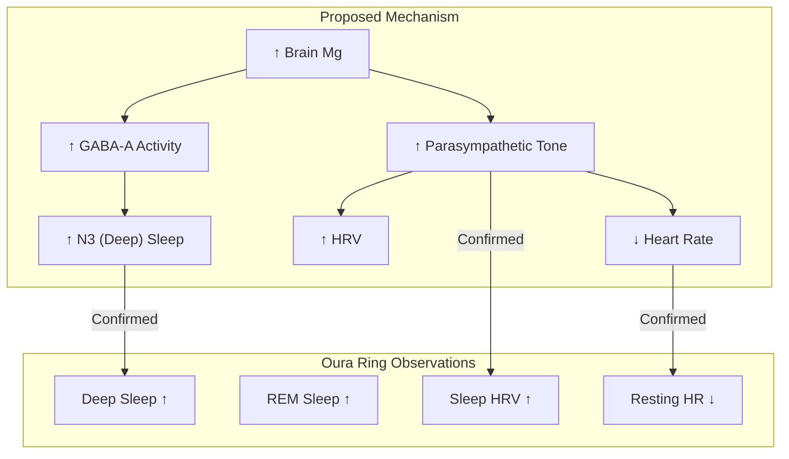

<Note>
**Why This Matters:** This is rare — a magnesium supplement with *objective wearable device validation* of sleep improvement. Most magnesium sleep claims rely on subjective questionnaires or extrapolation from muscle relaxation studies. The Oura Ring data showing increased deep sleep, REM, and HRV provides hard evidence that Magtein® affects sleep architecture at the physiological level.
</Note>

</Accordion>

<Accordion title="Clinical Evidence: Cognition" icon="brain">

### Foundational Research: MIT Discovery

Magtein® originated from research at MIT by Dr. Guosong Liu's laboratory:

**Key Finding (Slutsky et al., 2010, Neuron):**
- Magnesium L-threonate increases brain magnesium by ~15% in rodents
- Enhanced synaptic plasticity in hippocampus
- Improved short-term and long-term memory
- Increased synapse density in prefrontal cortex and hippocampus

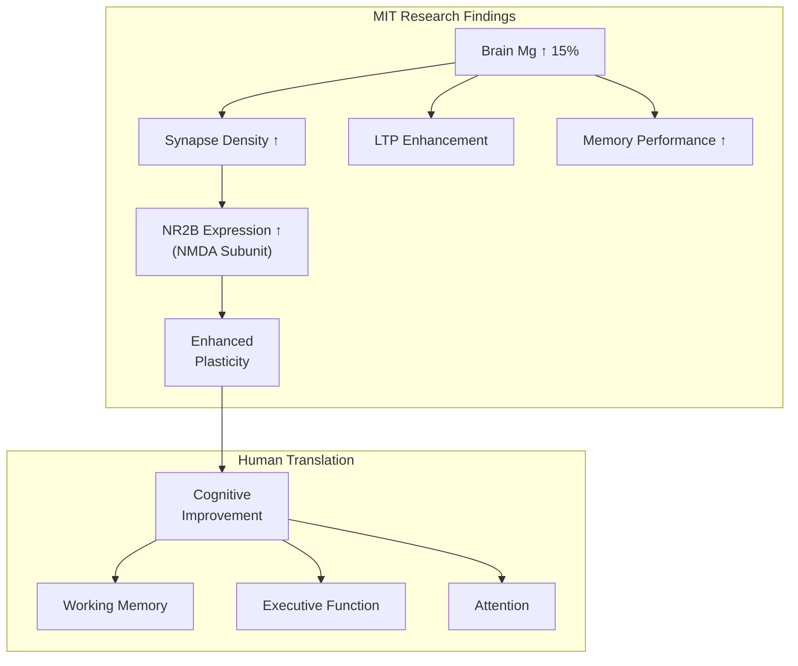

### Human Cognitive Trials

**Study 1: Liu et al., 2016**
- Population: Adults 50-70 years with cognitive complaints
- Intervention: Magtein® 1.5-2g/day × 12 weeks
- Outcomes: 
  - ↑ Executive function (TMT-B)
  - ↑ Working memory
  - Brain age reversal: ~9 years younger (cognitive testing)

**Study 2: 2025 Young-Middle Aged Adults**
- Population: Adults 25-45 years
- Intervention: Magtein® × 6 weeks
- Outcomes:
  - ↑ Cognitive performance
  - ↑ Hand-eye coordination
  - ↑ Reaction time

### Cognitive Outcome Summary

| Cognitive Domain | Evidence | Mechanism |
|------------------|----------|-----------|
| **Working memory** | Strong | ↑ Prefrontal Mg; ↑ DLPFC function |
| **Executive function** | Strong | ↑ Prefrontal synaptic density |
| **Learning** | Moderate | ↑ Hippocampal LTP |
| **Attention** | Moderate | ↑ Thalamo-cortical Mg |
| **Processing speed** | Moderate | ↑ Overall neural efficiency |

### Brain Age Reversal Concept

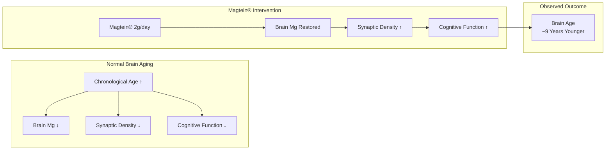

</Accordion>

<Accordion title="Whole Foods Sources" icon="leaf">

### Magnesium Content of Common Foods

| Food Source | Serving | Mg (mg) | % DV (420mg) |
|-------------|---------|---------|--------------|
| **Pumpkin seeds** | 1 oz (28g) | 156 | 37% |
| **Chia seeds** | 1 oz (28g) | 111 | 26% |
| **Almonds** | 1 oz (28g) | 80 | 19% |
| **Spinach (cooked)** | 1 cup | 157 | 37% |
| **Cashews** | 1 oz (28g) | 74 | 18% |
| **Black beans** | 1 cup | 120 | 29% |
| **Edamame** | 1 cup | 100 | 24% |
| **Dark chocolate (70%+)** | 1 oz (28g) | 65 | 15% |
| **Avocado** | 1 medium | 58 | 14% |
| **Salmon** | 3 oz (85g) | 26 | 6% |
| **Brown rice** | 1 cup cooked | 84 | 20% |
| **Banana** | 1 medium | 32 | 8% |

### The Food-Brain Gap Problem

Even with an excellent diet rich in magnesium, *brain* magnesium remains limited:

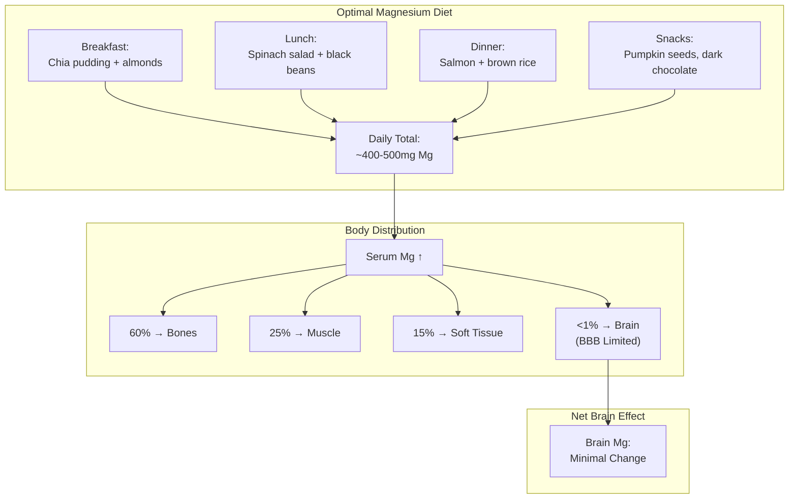

### Why L-Threonate Isn't in Food

L-Threonate is a metabolite of vitamin C, not a dietary mineral:

| Compound | Natural Source | Dietary Availability |
|----------|----------------|---------------------|
| **Magnesium** | Seeds, nuts, greens, beans | Abundant |
| **L-Threonate** | Vitamin C metabolism | Not dietary |
| **Mg L-Threonate** | Synthetic combination | Supplement only |

**Reality:** You cannot obtain Magnesium L-Threonate from any food source. The compound is a novel synthetic combination developed specifically to enhance brain magnesium delivery.

### Food + Supplement Strategy

For optimal magnesium status:

| Strategy | Target | Rationale |
|----------|--------|-----------|
| **Magnesium-rich diet** | ~400-500mg/day | Foundation; whole-body Mg |
| **Mg L-Threonate (Recover)** | 2,000mg (144mg Mg) | Brain-specific delivery |
| **Mg Citrate (Luna)** | 100-150mg Mg | Peripheral muscle relaxation |

<Note>
**Practical Recommendation:** A magnesium-rich diet provides the foundation for systemic magnesium status — supporting muscle function, energy production, and bone health. However, for *brain-specific* benefits (sleep quality, cognitive function, anxiety), Mg L-Threonate supplementation is necessary because dietary magnesium simply doesn't cross the BBB efficiently enough to meaningfully elevate brain levels.
</Note>

### Signs of Magnesium Deficiency

| Symptom Category | Signs | Brain vs Peripheral |
|------------------|-------|---------------------|
| **Muscle** | Cramps, twitches, restless legs | Peripheral |
| **Energy** | Fatigue, weakness | Both |
| **Sleep** | Difficulty falling/staying asleep | Brain |
| **Mood** | Anxiety, irritability | Brain |
| **Cognitive** | Poor concentration, brain fog | Brain |
| **Cardiovascular** | Irregular heartbeat, palpitations | Both |

**Key Insight:** If you have primarily *muscle* symptoms (cramps, twitches), standard magnesium forms may suffice. If you have primarily *brain* symptoms (sleep, anxiety, cognition), Mg L-Threonate is the targeted solution.

</Accordion>

<Accordion title="Dosing & Form Selection" icon="pills">

### Magtein® Dose Selection

| Clinical Context | Dose | Elemental Mg | Evidence Base |
|------------------|------|--------------|---------------|
| **Sleep optimization** | 2,000 mg | 144 mg | 2024 RCT (Hausenblas) |
| **Cognitive enhancement** | 1,500-2,000 mg | 108-144 mg | Liu 2016, MIT research |
| **Anxiety support** | 1,500-2,000 mg | 108-144 mg | Mechanistic |
| **NTRPX Recover dose** | 2,000 mg | 144 mg | Clinical dose alignment |

### Why 2,000mg (Not Lower)?

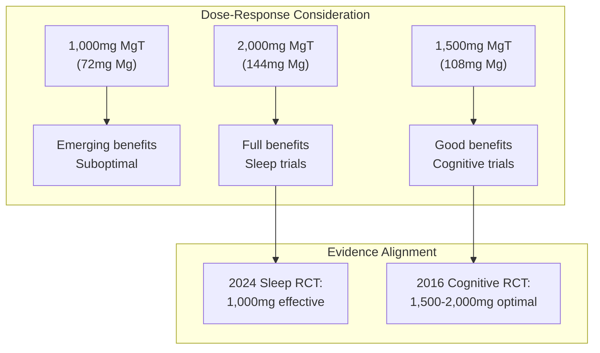

**Note:** The 2024 sleep RCT used 1,000mg, but cognitive trials suggest 1,500-2,000mg for full effect. NTRPX uses 2,000mg to ensure optimal coverage for both sleep and cognitive benefits.

### Timing Protocol

| Timing | Rationale | Protocol |
|--------|-----------|----------|
| **Evening (60-90 min before bed)** | Peak effect aligns with sleep | Recover capsules |
| **Split dosing option** | Maintain stable levels | 1,000mg AM + 1,000mg PM |
| **With or without food** | Absorption not significantly affected | Flexible |

### Form Comparison: Magtein® vs Generic

| Parameter | Magtein® (MGC) | Generic MgT |
|-----------|----------------|-------------|
| **Manufacturer** | Mitsubishi Gas Chemical | Various |
| **Research backing** | All published studies | None |
| **Purity specification** | Defined, consistent | Variable |
| **Quality assurance** | Rigorous | Unknown |
| **Patent status** | Patented process | May infringe |
| **Cost** | Premium | Lower |

<Warning>
**Quality Matters:** All published clinical trials on Magnesium L-Threonate used Magtein® manufactured by Mitsubishi Gas Chemical. Generic forms may vary in purity, composition, or efficacy. NTRPX uses only Magtein®-grade material to ensure the clinical evidence applies to our product.
</Warning>

### Capsule Requirements

| Dose Target | Capsule Strategy | Count |
|-------------|------------------|-------|
| **2,000mg Magtein®** | 2 × 1,000mg (size 00) | 2 capsules |
| **Split with other ingredients** | Varies | 2-3 capsules |

</Accordion>

<Accordion title="Safety & Classification" icon="shield-check">

### Adverse Event Profile

| Event | Incidence | Severity | Notes |
|-------|-----------|----------|-------|
| **Headache** | Occasional (~5%) | Mild | Usually transient, first week |
| **Drowsiness** | Occasional | Mild | Expected for sleep product; take PM |
| **GI discomfort** | Rare (\<3%) | Mild | Less than other Mg forms |
| **Dizziness** | Rare | Mild | Usually with high doses |

### Safety Data

| Parameter | Finding |
|-----------|---------|
| **Acute toxicity** | Very low (Mg is tightly regulated) |
| **Chronic safety** | Well-tolerated in 12-week trials |
| **Genotoxicity** | Negative (L-threonate is endogenous) |
| **Drug interactions** | Minimal (see below) |
| **Pregnancy/lactation** | Insufficient data; consult provider |
| **Pediatric** | Not studied; adult formulation |

### Regulatory Status

| Region | Status |
|--------|--------|
| **United States** | GRAS (Generally Recognized as Safe) |
| **FDA** | New Dietary Ingredient notification filed |
| **European Union** | Novel food application pending |
| **Canada** | Licensed as NHP |
| **Australia** | Listed medicine eligible |

### Drug Interactions

| Drug Class | Interaction | Severity | Management |
|------------|-------------|----------|------------|
| **Bisphosphonates** | ↓ Absorption | Moderate | Separate by 2+ hours |
| **Antibiotics (quinolones, tetracyclines)** | Chelation | Moderate | Separate by 2+ hours |
| **Diuretics (loop, thiazide)** | ↑ Mg excretion | Low | Monitor Mg status |
| **Muscle relaxants** | Additive | Low | Usually beneficial |
| **CNS depressants** | Additive sedation | Low | Monitor; usually fine |

### Contraindications

| Condition | Concern | Recommendation |
|-----------|---------|----------------|
| **Severe renal impairment** | ↓ Mg excretion | Avoid or consult nephrologist |
| **Myasthenia gravis** | Mg may worsen weakness | Avoid |
| **Heart block** | Mg may exacerbate | Consult cardiologist |
| **Hypermagnesemia** | Additive | Avoid |

### Special Populations

| Population | Safety Status | Notes |
|------------|---------------|-------|
| **Healthy adults** | Well-established | Primary study population |
| **Elderly (50-70)** | Well-established | Cognitive trials in this group |
| **Sleep-disturbed** | Well-established | 2024 RCT |
| **Pregnancy** | Insufficient data | Consult provider |
| **Lactation** | Insufficient data | Consult provider |
| **Children** | Not studied | Not recommended |
| **Renal impairment** | Caution | Consult nephrologist |

### Tier Classification

### <Icon icon="star" color="#64748b" /> Tier 2: Supported

<CardGroup cols={3}>
<Card title="Efficacy" icon="check" color="#64748b">High (Sleep, Cognition)</Card>
<Card title="Validation" icon="check" color="#64748b">Strong — Multiple RCTs, objective measures</Card>
<Card title="Safety" icon="check" color="#64748b">Excellent — GRAS; well-tolerated</Card>
</CardGroup>

**Tier Rationale:** Tier 2 (Supported) classification. Magnesium L-Threonate demonstrates consistent benefits in randomized controlled trials for both sleep quality (with objective Oura Ring validation) and cognitive function. The mechanism — enhanced brain Mg delivery via L-threonate carrier — is well-elucidated with supporting animal data and human translation. Safety is excellent; L-threonate is an endogenous vitamin C metabolite, and the compound has GRAS status. Not Tier 1 (Foundation) because the research base, while strong, is narrower than compounds like creatine or magnesium glycinate, and cost is higher.

</Accordion>

<Accordion title="Synergies within NTRPX" icon="diagram-project">

### Recover Stack Synergies

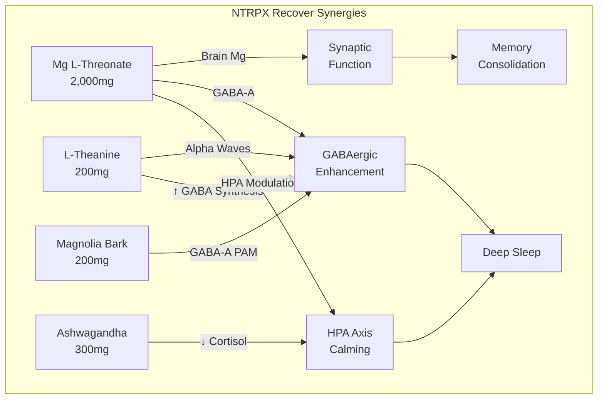

### Specific Synergy Pairs

| Combination | Mechanism | Expected Benefit |
|-------------|-----------|------------------|
| **MgT + L-Theanine** | Dual GABA support | Enhanced relaxation without sedation |
| **MgT + Magnolia Bark** | GABA-A enhancement | Deeper anxiolysis |
| **MgT + Ashwagandha** | HPA axis + neural Mg | Comprehensive stress buffering |
| **MgT + Glycine (Luna)** | Different mechanisms (GABA vs thermoregulation) | Complementary sleep onset |
| **MgT + Melatonin** | Neural preparation + circadian signal | Optimized sleep architecture |

### Why Dual Magnesium Strategy (L-Threonate + Citrate)

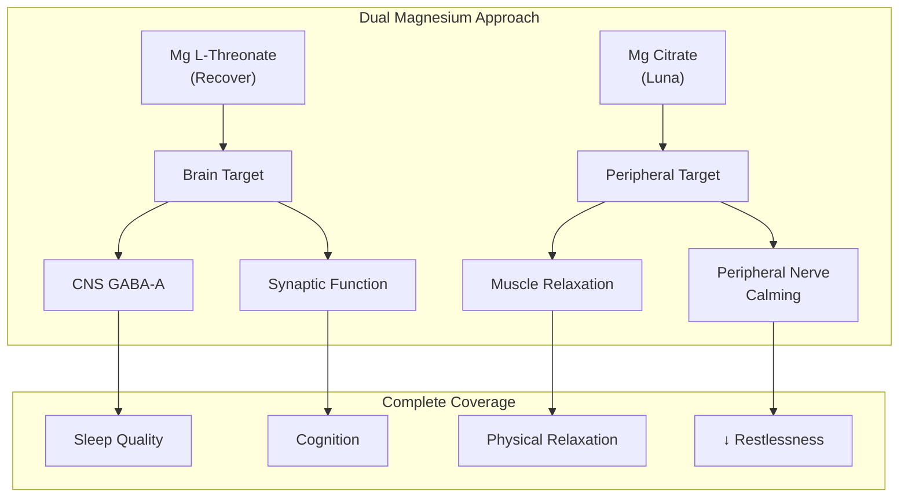

### Cross-Product Integration

| Product | Mg Form | Dose | Rationale |
|---------|---------|------|-----------|
| **Recover (capsules)** | L-Threonate | 2,000mg (144mg Mg) | Brain-specific |
| **Luna (drink)** | Citrate | 100-150mg Mg | Peripheral muscle |
| **Boost** | None | — | Morning; Mg not needed |
| **Sustain** | None | — | Afternoon; Mg not needed |

### Circadian Integration

```mermaid
gantt
    title Magnesium in NTRPX Circadian System
    dateFormat HH:mm
    axisFormat %H:%M
    
    section Morning (Boost)
    No Mg needed           :a1, 07:00, 4h
    
    section Afternoon (Sustain)
    No Mg needed           :b1, 12:00, 5h
    
    section Evening (Luna)
    Mg Citrate (peripheral) :c1, 20:00, 1h
    
    section Pre-Sleep (Recover)
    Mg L-Threonate (brain) :crit, d1, 21:00, 1h
    
    section Sleep
    Brain Mg effects       :crit, e1, 22:00, 8h
```

</Accordion>

<Accordion title="Historical & Biochemical Context" icon="book">

### Discovery Timeline

| Year | Milestone |
|------|-----------|
| **2004** | Dr. Guosong Liu (MIT) begins research on brain magnesium |
| **2010** | Slutsky et al. publish landmark Neuron paper on MgT |
| **2010** | Mitsubishi Gas Chemical licenses Magtein® |
| **2012** | First human cognitive trial initiated |
| **2016** | Liu et al. publish human cognitive trial results |
| **2020** | FDA GRAS notification for Magtein® |
| **2024** | Hausenblas et al. publish Oura Ring sleep validation RCT |
| **2025** | Extended cognitive + sleep trial results |

### The MIT Discovery Story

Dr. Guosong Liu, a neuroscientist at MIT's Picower Institute for Learning and Memory, observed that:

1. Brain magnesium deficiency correlates with cognitive decline
2. Standard magnesium supplements don't meaningfully raise brain Mg
3. A new delivery mechanism was needed

His laboratory screened numerous magnesium compounds for BBB penetration and identified L-threonate as an ideal carrier due to:
- Its small molecular size
- Structural similarity to glucose (GLUT recognition)
- Endogenous origin (vitamin C metabolite)
- Safety profile

### Magnesium L-Threonate Structure

```
Mg(C₄H₇O₅)₂

Magnesium ion (Mg²⁺) chelated by two L-threonate molecules

L-Threonate: HO-CH₂-CH(OH)-CH(OH)-COO⁻
             (2,3,4-trihydroxybutanoate)
```

| Property | Value |
|----------|-------|
| **Molecular formula** | C₈H₁₄MgO₁₀ |
| **Molecular weight** | 294.5 g/mol |
| **Elemental Mg** | 7.2% by weight |
| **Solubility** | Freely soluble in water |
| **pKa** | ~3.5 (carboxylic acid) |
| **Stability** | Stable at room temperature |

### L-Threonate: A Vitamin C Metabolite

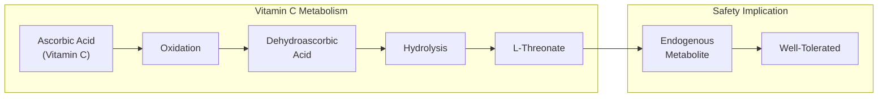

This endogenous origin contributes to Magtein®'s excellent safety profile — L-threonate is a compound the body naturally produces and metabolizes.

### Why Magnesium Is Essential for Neural Function

| Function | Mechanism | Consequence of Deficiency |
|----------|-----------|---------------------------|
| **ATP binding** | Mg-ATP is active form | ↓ Energy availability |
| **NMDA regulation** | Voltage-dependent block | Excitotoxicity, ↓ learning |
| **GABA-A modulation** | PAM activity | ↓ Inhibition, ↑ anxiety |
| **300+ enzymes** | Cofactor | Widespread metabolic dysfunction |
| **DNA/RNA synthesis** | Polymerase cofactor | ↓ Cellular repair |
| **Protein synthesis** | Ribosome function | ↓ Neurotransmitter production |

</Accordion>

<Accordion title="Practical Considerations" icon="clipboard-list">

### When to Use Mg L-Threonate

| Scenario | Expected Benefit | Protocol |
|----------|------------------|----------|
| **Sleep quality issues** | *High* | 2,000mg, 60-90 min before bed |
| **Cognitive optimization** | *High* | 2,000mg daily, 8-12 weeks |
| **Anxiety with poor sleep** | *High* | 2,000mg evening |
| **Age-related cognitive decline** | *High* | 2,000mg daily, ongoing |
| **General Mg supplementation** | Moderate | Consider if brain symptoms present |

### Realistic Expectations

| Timeframe | What to Expect |
|-----------|----------------|
| **Day 1-3** | Subtle relaxation; possible mild drowsiness |
| **Week 1** | Emerging sleep quality improvement |
| **Week 2-3** | Clear sleep benefits; early cognitive effects |
| **Week 4-8** | Full sleep + cognitive benefits established |
| **Week 12+** | Optimal neuroplasticity effects (cognitive) |

### Signs It's Working

| Indicator | Description |
|-----------|-------------|
| **Faster sleep onset** | Less time lying awake |
| **Fewer awakenings** | More consolidated sleep |
| **More refreshed mornings** | Better sleep quality |
| **Improved focus** | Better sustained attention |
| **Reduced anxiety** | Calmer baseline state |
| **Better memory** | Easier recall (over time) |

### Administration Tips

| Tip | Rationale |
|-----|-----------|
| **Take in evening** | Sleep benefits align with bedtime |
| **Consistent daily use** | Brain Mg elevation is gradual |
| **Can take with or without food** | Minimal absorption difference |
| **Be patient** | Full cognitive benefits take 8-12 weeks |
| **Combine with Recover stack** | Synergistic with other sleep compounds |

### Frequently Asked Questions

<AccordionGroup>

<Accordion title="Why is the elemental magnesium so low compared to other forms?">
Mg L-Threonate is 7.2% elemental magnesium by weight, versus 16% for citrate or 14% for glycinate. However, the *brain delivery* is what matters. Standard forms provide higher elemental Mg but minimal brain penetration. MgT provides lower elemental Mg but dramatically higher brain uptake. You're not taking it for total body Mg — you're taking it for brain Mg.
</Accordion>

<Accordion title="Can I take Mg L-Threonate with other magnesium supplements?">
Yes. In fact, this is the NTRPX approach: MgT in Recover for brain effects + Mg Citrate in Luna for peripheral effects. Total daily elemental magnesium (~250-300mg) remains well within safe limits.
</Accordion>

<Accordion title="Why not just take more regular magnesium?">
Taking 1,000mg of magnesium citrate won't meaningfully raise brain Mg levels any more than 400mg — the BBB is the bottleneck, not the dose. You'd just get more GI side effects. L-threonate solves the *delivery* problem, not the *dose* problem.
</Accordion>

<Accordion title="Is Magtein® worth the premium over generic Mg L-Threonate?">
Yes. All clinical research was conducted using Magtein® from Mitsubishi Gas Chemical. Generic forms may vary in purity, synthesis method, or composition. When clinical evidence is your basis for supplementation, using the clinically-validated form ensures the evidence applies to your product.
</Accordion>

<Accordion title="Will Mg L-Threonate help my muscle cramps?">
Possibly, but standard magnesium forms (citrate, glycinate) are more cost-effective for peripheral muscle effects. MgT is specifically for brain-related benefits (sleep, cognition, anxiety). If you have both muscle cramps and brain symptoms, using both forms (as NTRPX does) provides comprehensive coverage.
</Accordion>

<Accordion title="How long do I need to take it?">
For sleep: benefits emerge in 1-3 weeks and are maintained with continued use. For cognition: 8-12 weeks for full effect, with ongoing use recommended to maintain brain Mg elevation. Stopping will gradually reduce brain Mg levels over weeks to months.
</Accordion>

<Accordion title="Can I take it in the morning instead of evening?">
You can, but sleep benefits are maximized with evening dosing. If using primarily for cognitive enhancement, some people split the dose (1,000mg AM + 1,000mg PM) or take it all in the morning. Mild drowsiness is possible, so evening dosing is generally preferred.
</Accordion>

</AccordionGroup>

</Accordion>

</AccordionGroup>

---

<Tip>
**NeuroMag Summary:** Magnesium L-Threonate (2,000mg Magtein® in Recover) is the *only* magnesium compound clinically proven to elevate brain magnesium levels — solving the fundamental problem that standard magnesium forms (citrate, glycinate, oxide) barely cross the blood-brain barrier. Developed at MIT and validated in multiple RCTs including 2024 Oura Ring-tracked sleep studies, Magtein® significantly improves sleep quality (↑ deep sleep, ↑ REM, ↑ HRV, ↓ resting HR), enhances cognitive function (working memory, executive function, "brain age" reversal), and supports anxiolysis through direct GABA-A receptor modulation in the CNS. The L-threonate carrier — a natural vitamin C metabolite — enables GLUT transporter-mediated brain delivery, making this compound uniquely effective for the neural benefits of magnesium. In NTRPX Recover, NeuroMag™ delivers *magnesium where it matters most: your brain*.
</Tip>

---

<Note>
**Version:** 1.0 | **Last Updated:** January 23, 2026 | **Document Status:** Complete Clinical Monograph

This monograph establishes the Magnesium L-Threonate framework for NTRPX Systems. Magtein® (Mitsubishi Gas Chemical) has been selected as the gold-standard material based on clinical validation in all published human trials. The 2,000mg dose aligns with cognitive trial protocols and exceeds the sleep trial dose (1,000mg) to ensure comprehensive benefits. NTRPX employs a dual-magnesium strategy: Mg L-Threonate in Recover for brain-specific effects + Mg Citrate in Luna for peripheral muscle relaxation, providing complete coverage without redundancy.
</Note>