## SereniMag Magnesium Glycinate

<CardGroup cols={4}>

<Card title="Luna" icon="moon" color="#5A8FA8">
200 mg elemental
</Card>

<Card title="Boost" icon="rocket-launch" color="#5A8FA8">
150 mg elemental
</Card>

<Card title="Bioavailability" icon="arrow-up-right" color="#5A8FA8">
High (Chelated)
</Card>

<Card title="Dual Benefit" icon="link" color="#5A8FA8">
Mg²⁺ + Glycine
</Card>

</CardGroup>

**The relaxation mineral in its most elegant form.** Magnesium is required for over 600 enzymatic reactions, yet an estimated **50-60% of adults are deficient**. This silent deficiency manifests as muscle tension, poor sleep, anxiety, and impaired cognitive function. SereniMag delivers magnesium as a **chelated glycinate complex** — magnesium bound to two glycine molecules — providing **superior bioavailability**, **excellent GI tolerance**, and **dual calming effects** from both the magnesium ion and its glycine carrier. The magnesium acts as nature's **NMDA receptor modulator**, providing voltage-dependent calcium channel blockade that calms neural excitability without sedation. The glycine contributes its own **inhibitory neurotransmission** and **thermoregulatory sleep benefits**. This is precision mineral delivery for relaxation, sleep, and foundational health.

<AccordionGroup>

<Accordion title="Mechanism of Action" icon="flask">

Magnesium glycinate delivers two active components with complementary mechanisms:

### The NMDA Voltage-Dependent Block

Magnesium's most important CNS mechanism is its unique voltage-dependent NMDA receptor blockade:

**Why This Matters:**

| State | Mg²⁺ Position | NMDA Activity | Result |
|-------|---------------|---------------|--------|
| **Resting** | Blocks channel | Inactive | Prevents excitotoxicity |
| **Signal arrives** | Expelled by depolarization | Active | Allows learning/plasticity |
| **Low Mg²⁺** | Insufficient block | Overactive | Anxiety, hyperexcitability |

### Magnesium Deficiency = Neural Hyperexcitability

### Complete Mechanism Summary

| Mechanism | Target | Effect | Clinical Outcome |
|-----------|--------|--------|------------------|
| **NMDA block** | NMDA receptor | ↓ Excitatory transmission | Calm, reduced anxiety |
| **GABA enhancement** | GABA system | ↑ Inhibitory tone | Relaxation |
| **Ca²⁺ channel modulation** | VGCCs | ↓ Calcium influx | Muscle relaxation |
| **ATP stabilization** | Mg-ATP complex | Proper energy metabolism | Cellular function |
| **Glycine (from carrier)** | GlyR, NMDA glycine site | Inhibition + co-agonism | Sleep, calm |

### Magnesium in Enzymatic Reactions

**Magnesium is required for:**
- **ATP function:** Mg-ATP is the actual substrate for kinases (not ATP alone)
- **DNA/RNA synthesis:** Polymerases require Mg²⁺
- **Protein synthesis:** Ribosomal function is Mg-dependent
- **Neuromuscular:** Action potential propagation, muscle contraction
- **600+ enzymatic reactions total**

</Accordion>

<Accordion title="The Deficiency Epidemic" icon="chart-line-down">

### Population Magnesium Status

Magnesium deficiency is widespread but underdiagnosed:

| Population | Estimated Deficiency | Notes |
|------------|---------------------|-------|
| **US Adults** | 50-60% | Below RDA intake |
| **Elderly (65+)** | 70-80% | Higher needs, lower intake |
| **Athletes** | 60-70% | Increased losses via sweat |
| **Type 2 Diabetics** | 75-85% | Urinary losses, insulin resistance |
| **Alcoholics** | 80-90% | Malabsorption, urinary loss |
| **Chronic Stress** | Elevated risk | Stress depletes Mg |

### Why Deficiency Is So Common

### Symptoms of Deficiency

| System | Symptoms | Mechanism |
|--------|----------|-----------|
| **Neuromuscular** | Cramps, twitches, tremor | ↓ Muscle relaxation |
| **Cardiovascular** | Arrhythmias, hypertension | ↓ Vascular relaxation |
| **Neurological** | Anxiety, irritability, insomnia | ↓ NMDA block |
| **Metabolic** | Fatigue, weakness | ↓ ATP function |
| **Psychiatric** | Depression, brain fog | Multiple pathways |

### Serum Mg: A Poor Marker

| Compartment | % of Body Mg | Measured? |
|-------------|--------------|-----------|
| **Bone** | 60% | No |
| **Muscle/Soft Tissue** | 39% | No |
| **Serum** | &lt;1% | Yes (standard test) |
| **RBC** | ~0.5% | Yes (better marker) |

<Warning>
**Testing Limitation:** Standard serum magnesium only measures &lt;1% of total body magnesium. You can be significantly deficient with "normal" serum levels. RBC magnesium is a better (though imperfect) marker. Many clinicians now recommend empirical supplementation given the safety profile and prevalence of deficiency.
</Warning>

### Dietary Magnesium Sources

| Food | Mg per Serving | % DV (400mg) |
|------|----------------|--------------|
| Pumpkin seeds (1 oz) | 156 mg | 39% |
| Spinach (1 cup cooked) | 157 mg | 39% |
| Dark chocolate (1 oz) | 64 mg | 16% |
| Almonds (1 oz) | 80 mg | 20% |
| Avocado (1 medium) | 58 mg | 15% |
| Black beans (1 cup) | 120 mg | 30% |

**The Problem:** Even with "good" sources, getting 400mg/day from diet alone is challenging, especially with modern processed diets.

</Accordion>

<Accordion title="Form Comparison" icon="scale-balanced">

### Magnesium Form Analysis

This is critical — different forms have vastly different absorption and effects:

| Form | Bioavailability | GI Tolerance | Special Properties | Best For |
|------|-----------------|--------------|-------------------|----------|
| **Glycinate** | ★★★★★ High | ★★★★★ Excellent | Dual Mg + Glycine benefit | **Sleep, Calm** |
| **Threonate** | ★★★★☆ High | ★★★★☆ Good | Crosses BBB; ↑ brain Mg | Cognition |
| **Taurate** | ★★★★☆ High | ★★★★☆ Good | Cardiovascular benefit | Heart health |
| **Citrate** | ★★★★☆ Good | ★★★☆☆ Moderate | Mild laxative | Constipation + Mg |
| **Malate** | ★★★★☆ Good | ★★★★☆ Good | Krebs cycle support | Energy, fibromyalgia |
| **Oxide** | ★★☆☆☆ Low | ★★☆☆☆ Poor | Laxative effect | **Avoid for repletion** |
| **Sulfate** | ★★☆☆☆ Low | ★★☆☆☆ Poor | Epsom salt (topical/bath) | Topical only |
| **Chloride** | ★★★☆☆ Moderate | ★★★☆☆ Moderate | Topical sprays | Topical |

### Why Glycinate Is Superior

### Elemental Magnesium Content

| Form | Molecular Weight | % Elemental Mg | Mg per 1000mg |
|------|------------------|----------------|---------------|
| **Magnesium Glycinate** | 172.4* | **14.1%** | **141 mg** |
| Magnesium Oxide | 40.3 | 60.3% | 603 mg |
| Magnesium Citrate | 214.4 | 16.2% | 162 mg |
| Magnesium Threonate | 294.5 | 8.1% | 81 mg |
| Magnesium Taurate | 272.6 | 8.9% | 89 mg |

*Per magnesium atom (Mg bound to 2 glycine molecules)

<Note>
**Don't Be Fooled by "% Magnesium":** Magnesium oxide is 60% elemental magnesium by weight, but only ~4% is absorbed. Glycinate is 14% magnesium but ~80% absorbed. **Absorbed dose matters, not label dose.**

| Form | Label Dose | Elemental Mg | Absorbed (~%) | Actual Mg Delivered |
|------|------------|--------------|---------------|---------------------|
| Oxide 500mg | 500mg | 300mg | 4% | **12mg** |
| Glycinate 500mg | 500mg | 70mg | 80% | **56mg** |
</Note>

### Head-to-Head: Glycinate vs Common Forms

| Parameter | Glycinate | Citrate | Oxide | Threonate |
|-----------|-----------|---------|-------|-----------|
| **Absorption** | ~80% | ~30% | ~4% | ~80% |
| **GI Tolerance** | Excellent | Moderate | Poor | Good |
| **Laxative Effect** | None | Mild | Strong | None |
| **Calming Effect** | Strong | Mild | None | Moderate |
| **Sleep Benefit** | Strong | Mild | None | Moderate |
| **Cost per absorbed mg** | Moderate | Low | Very Low | High |
| **Research Base** | Strong | Moderate | Limited (for repletion) | Emerging |

### The Glycine Bonus

With magnesium glycinate, you get **two active compounds**:

| Component | Amount per 1000mg MgG | Benefit |
|-----------|----------------------|---------|
| **Magnesium** | ~141 mg | NMDA block, muscle relaxation, enzymes |
| **Glycine** | ~859 mg | Inhibitory neurotransmitter, sleep, collagen |

</Accordion>

<Accordion title="Pharmacokinetic Profile" icon="chart-line">

### ADME Parameters

| Parameter | Value | Notes |
|-----------|-------|-------|
| **Bioavailability** | ~80% (chelated) | Far exceeds oxide (~4%) |
| **Tmax** | 1-2 hours | Relatively rapid |
| **Half-life** | Variable | Tissue-dependent storage |
| **Distribution** | 60% bone, 39% soft tissue, 1% serum | Slowly equilibrates |
| **Excretion** | Renal (primary), fecal | Kidney regulates levels |

### Absorption Pathway

### Why Chelation Improves Absorption

| Mechanism | Ionic Mg (Oxide) | Chelated Mg (Glycinate) |
|-----------|------------------|-------------------------|
| Stomach acid needed | Yes (to ionize) | No (already stable) |
| Competes with minerals | Yes (Ca, Zn) | No (amino acid pathway) |
| GI osmotic effect | Yes (draws water) | No |
| Absorption route | Mineral transporters only | Mineral + amino acid transporters |
| Typical absorption | 4-10% | 70-80% |

### Plasma Magnesium Timeline

### Time to Repletion

| Deficiency Severity | Time to Normalize | Notes |
|---------------------|-------------------|-------|
| Mild | 2-4 weeks | Daily supplementation |
| Moderate | 4-8 weeks | Consistent dosing needed |
| Severe | 8-12+ weeks | May need higher doses initially |

<Note>
**Patience Required:** Unlike many supplements with immediate effects, magnesium repletion takes weeks. The body stores magnesium in bone and muscle, slowly equilibrating. Continue supplementation for at least 4-8 weeks before assessing full benefit. Acute relaxation effects (from glycine component and immediate Mg availability) occur faster.
</Note>

</Accordion>

<Accordion title="Dosing Rationale" icon="capsules">

### Recommended Daily Intakes

| Population | RDA (Elemental Mg) | Common Therapeutic Range |
|------------|-------------------|-------------------------|
| Adult Men | 400-420 mg | 200-400 mg supplemental |
| Adult Women | 310-320 mg | 200-400 mg supplemental |
| Pregnancy | 350-360 mg | Per provider guidance |
| Athletes | +10-20% above RDA | Often 300-500 mg total |
| Elderly | Same as adult | Often need supplementation |

### NTRPX Protocols

| Product | Elemental Mg | Form | Purpose |
|---------|--------------|------|---------|
| **Luna** | 200 mg | Glycinate | Sleep, relaxation |
| **Boost** | 150 mg | Glycinate | Foundational support |
| **Combined** | 350 mg | Glycinate | Comprehensive coverage |

### Optimal Dosing Strategy

```mermaid
gantt
    title Daily Magnesium Protocol
    dateFormat HH:mm
    axisFormat %H:%M
    
    section Morning
    Boost (150mg)    :crit, m1, 07:00, 30m
    
    section Evening
    Luna (200mg)     :crit, e1, 21:00, 30m
    
    section Total
    Daily Total      :t1, 07:00, 14h
```

**Split Dosing Rationale:**
- **Morning (Boost):** Foundational support, daytime enzyme function
- **Evening (Luna):** Relaxation, sleep preparation, muscle recovery
- **Split absorption:** Better GI tolerance, improved absorption efficiency

### Dose-Response for Sleep/Relaxation

| Elemental Mg | Sleep Effect | Relaxation | Muscle | Notes |
|--------------|--------------|------------|--------|-------|
| 100 mg | Mild | Mild | Mild | Subtherapeutic |
| 200 mg | Moderate | Moderate | Moderate | **Luna dose** |
| 300-400 mg | Good | Good | Good | Therapeutic range |
| 400-600 mg | Strong | Strong | Strong | Upper range |
| &gt;600 mg | Diminishing returns | Strong | Strong | May cause loose stools |

### Population-Specific Dosing

| Population | Dose | Timing | Notes |
|------------|------|--------|-------|
| **Standard adults** | 200-400 mg | Split or evening | Standard therapeutic |
| **Sleep focus** | 200-300 mg | 30-60 min pre-bed | Luna protocol |
| **Athletes** | 300-500 mg | Post-workout + evening | Higher needs |
| **Elderly** | 300-400 mg | Split dosing | Often more deficient |
| **Muscle cramps** | 300-400 mg | Evening | Nocturnal cramp prevention |
| **Anxiety support** | 200-400 mg | Split or PRN | Calming effect |
| **Migraine prevention** | 400-600 mg | Split | Studied dose range |

### Administration Notes

- **With or without food:** Either acceptable; food may enhance tolerance
- **Split vs single dose:** Split improves absorption and tolerance
- **Consistency:** Daily use optimal for repletion and maintenance
- **Duration:** Continue long-term; deficiency recurs without ongoing intake
- **Upper limit (UL):** 350 mg from supplements (set conservatively for GI; glycinate rarely causes issues)

### Dose Adjustment Scenarios

| Scenario | Adjustment | Rationale |
|----------|------------|-----------|
| **GI sensitivity** | Reduce dose; split further | Rare with glycinate |
| **Not feeling effect** | Ensure 4-6 weeks; consider ↑ dose | Repletion takes time |
| **Loose stools** | Reduce dose (unlikely with glycinate) | Exceed tolerance |
| **Taking with Rx** | Check interactions | Some Rx affect Mg |
| **Renal impairment** | Consult provider; may need reduction | Kidneys regulate Mg |

</Accordion>

<Accordion title="Sleep & Relaxation Effects" icon="moon">

### Magnesium's Sleep Mechanisms

### Clinical Evidence for Sleep

| Study | Population | Dose | Duration | Finding |
|-------|------------|------|----------|---------|
| **Abbasi 2012** | Elderly insomnia | 500 mg | 8 weeks | ↑ Sleep time, efficiency; ↓ cortisol |
| **Held 2002** | Healthy elderly | 320 mg | 7 days | ↑ Slow-wave sleep on EEG |
| **Nielsen 2010** | Postmenopausal | 320 mg | 7 weeks | ↓ Insomnia symptoms |
| **Rondanelli 2011** | Elderly | Mg + Mel + Zn | 8 weeks | ↑ Sleep quality (Pittsburgh) |

### Magnesium-GABA Connection

### Comparison with Sleep Aids

| Parameter | Mg Glycinate | Melatonin | Benzos | Z-Drugs |
|-----------|--------------|-----------|--------|---------|
| Sleep onset | ↓ Moderate | ↓ Good | ↓↓ Strong | ↓↓ Strong |
| Sleep quality | ↑ | Variable | ↓ (poor architecture) | Variable |
| Morning grogginess | None | Possible | Common | Common |
| Dependence | None | None | Yes | Yes |
| Long-term use | Safe | Safe | Problematic | Problematic |
| Addresses deficiency | Yes | No | No | No |

### Luna Stack Integration

In Luna, magnesium glycinate synergizes with other sleep compounds:

| Component | Mechanism | Interaction with Mg |
|-----------|-----------|-------------------|
| **Glycine (GlyciRest)** | Thermoregulation | Mg provides additional glycine |
| **L-Theanine** | Alpha waves, GABA | Complementary calming |
| **Apigenin** | GABA-A, CD38 inhibition | Parallel pathways |
| **Magnesium Glycinate** | NMDA block, muscle relax | **Central to stack** |

### Muscle Relaxation for Sleep

| Muscle Issue | Mg Mechanism | Outcome |
|--------------|--------------|---------|
| **Restless legs** | ↓ Neural excitability | Calmer legs |
| **Nocturnal cramps** | Proper Ca/Mg balance | Fewer cramps |
| **General tension** | Muscle fiber relaxation | Physical ease |
| **Jaw clenching (bruxism)** | ↓ Muscle hypertonicity | Reduced grinding |

</Accordion>

<Accordion title="Cognitive & Mood Effects" icon="brain">

### Magnesium and Brain Function

### Evidence for Anxiety/Depression

| Study | Population | Dose | Finding |
|-------|------------|------|---------|
| **Boyle 2017** | Mild-moderate depression | 248 mg | ↓ Depression and anxiety scores |
| **Tarleton 2017** | Depression | 248 mg | Significant improvement in PHQ-9 |
| **Sartori 2012** | Review | Various | Mg deficiency linked to anxiety |
| **Eby 2006** | Case series | 125-300 mg | Rapid recovery from depression |

### Proposed Mood Mechanisms

| Mechanism | Pathway | Outcome |
|-----------|---------|---------|
| **NMDA modulation** | Prevents hyperexcitability | ↓ Anxiety |
| **HPA axis** | ↓ Cortisol response | ↓ Stress reactivity |
| **Serotonin** | Cofactor for synthesis | ↑ 5-HT availability |
| **BDNF** | ↑ Expression (some evidence) | Neuroplasticity |
| **Inflammation** | ↓ Pro-inflammatory markers | Reduced neuroinflammation |

### Magnesium and Stress

**The Stress-Magnesium Vicious Cycle:**
1. Stress increases urinary magnesium excretion
2. Lower magnesium increases neural excitability
3. Increased excitability amplifies stress response
4. Amplified stress causes more magnesium loss
5. **Supplementation breaks this cycle**

### Cognitive Performance

| Domain | Mg Role | Evidence |
|--------|---------|----------|
| **Working memory** | NMDA-dependent | Improved with repletion |
| **Learning** | Synaptic plasticity | Enhanced LTP |
| **Attention** | Neural signal:noise | Better focus |
| **Processing speed** | Neuronal ATP | Maintained function |

</Accordion>

<Accordion title="Additional Health Benefits" icon="heart-pulse">

### Cardiovascular Effects

### Metabolic Effects

| Parameter | Magnesium Effect | Mechanism |
|-----------|------------------|-----------|
| **Insulin sensitivity** | ↑ Improved | Enzyme cofactor |
| **Glucose metabolism** | ↑ Better control | GLUT4 translocation |
| **Type 2 diabetes risk** | ↓ Reduced | Multiple pathways |
| **Metabolic syndrome** | ↓ Risk markers | Broad metabolic support |

### Musculoskeletal

| Condition | Mg Role | Evidence |
|-----------|---------|----------|
| **Muscle cramps** | Ca/Mg balance | Strong for nocturnal cramps |
| **Exercise performance** | ATP, muscle function | Modest improvements |
| **Recovery** | Inflammation, repair | Supported |
| **Bone health** | 60% stored in bone | Essential for bone matrix |

### Migraine Prevention

| Study | Population | Dose | Finding |
|-------|------------|------|---------|
| **Peikert 1996** | Migraine | 600 mg | ↓ Attack frequency 41.6% |
| **Facchinetti 1991** | Menstrual migraine | 360 mg | ↓ Severity and duration |
| **Mauskop 1998** | Various migraine | 400-600 mg | Recommended as prophylaxis |

### PMS/Menstrual Symptoms

| Symptom | Effect | Mechanism |
|---------|--------|-----------|
| **Cramps** | ↓ | Muscle relaxation |
| **Mood changes** | ↓ | Neurotransmitter support |
| **Water retention** | ↓ | Aldosterone modulation |
| **Headaches** | ↓ | Vascular effect |

</Accordion>

<Accordion title="Clinical Evidence" icon="book-open">

### Sleep Studies

| Study | Design | N | Dose | Duration | Outcome |
|-------|--------|---|------|----------|---------|
| **Abbasi 2012** | RCT | 46 | 500 mg | 8 weeks | ↑ Sleep time, efficiency, melatonin; ↓ cortisol |
| **Held 2002** | Crossover | 12 | 320 mg | 7 days | ↑ Slow-wave sleep (EEG) |
| **Nielsen 2010** | Observational | 100 | 320 mg | 7 weeks | ↓ Insomnia symptoms |

### Anxiety/Depression Studies

| Study | Design | N | Dose | Finding |
|-------|--------|---|------|---------|
| **Boyle 2017** | RCT | 126 | 248 mg | ↓ Depression (PHQ-9), ↓ anxiety (GAD-7) |
| **Tarleton 2017** | RCT | 112 | 248 mg | Significant ↓ depression |
| **Lakhan 2008** | Review | Multiple | Various | Consistent anxiolytic effect |

### Metabolic Studies

| Study | Population | Dose | Finding |
|-------|------------|------|---------|
| **Guerrero-Romero 2004** | Pre-diabetics | 300 mg | ↑ Insulin sensitivity |
| **Rodriguez-Moran 2003** | Type 2 DM | 450 mg | ↓ Fasting glucose |
| **Song 2006** | Meta-analysis | Various | ↓ T2DM risk with higher intake |

### Cardiovascular Studies

| Study | Population | Finding |
|-------|------------|---------|
| **Kass 2012** | Meta-analysis | ↓ BP 2-4 mmHg systolic |
| **Del Gobbo 2013** | Prospective | ↓ CV risk with higher Mg |
| **Zhang 2012** | Meta-analysis | ↓ Stroke risk with higher Mg |

### Migraine Studies

| Study | Design | N | Dose | Finding |
|-------|--------|---|------|---------|
| **Peikert 1996** | RCT | 81 | 600 mg | ↓ Attack frequency 41.6% |
| **Köseoglu 2008** | RCT | 40 | 600 mg | ↓ Frequency and severity |
| **Facchinetti 1991** | RCT | 20 | 360 mg | ↓ Menstrual migraine |

### References

**Sleep:**
- Abbasi B et al. The effect of magnesium supplementation on primary insomnia in elderly. *J Res Med Sci.* 2012;17(12):1161-9. [PubMed](https://pubmed.ncbi.nlm.nih.gov/23853635/)
- Held K et al. Oral Mg supplementation reverses age-related neuroendocrine and sleep EEG changes. *Pharmacopsychiatry.* 2002;35(4):135-43. [PubMed](https://pubmed.ncbi.nlm.nih.gov/12163983/)

**Mood:**
- Boyle NB et al. The effects of magnesium supplementation on subjective anxiety and stress. *Nutrients.* 2017;9(5):429. [PubMed](https://pubmed.ncbi.nlm.nih.gov/28445426/)
- Tarleton EK et al. Role of magnesium supplementation in the treatment of depression. *PLoS One.* 2017;12(6):e0180067. [PubMed](https://pubmed.ncbi.nlm.nih.gov/28654669/)

**Cardiovascular:**
- Kass L et al. Effect of magnesium supplementation on blood pressure. *Eur J Clin Nutr.* 2012;66(4):411-8. [PubMed](https://pubmed.ncbi.nlm.nih.gov/22318649/)

**Migraine:**
- Peikert A et al. Prophylaxis of migraine with oral magnesium. *Cephalalgia.* 1996;16(4):257-63. [PubMed](https://pubmed.ncbi.nlm.nih.gov/8792038/)

**Metabolic:**
- Guerrero-Romero F et al. Oral magnesium supplementation improves insulin sensitivity. *Diabetes Obes Metab.* 2004;6(3):188-94. [PubMed](https://pubmed.ncbi.nlm.nih.gov/15056126/)

</Accordion>

<Accordion title="Safety & Classification" icon="shield-check">

### Adverse Event Profile

| Event | Glycinate Incidence | Oxide Incidence | Notes |
|-------|---------------------|-----------------|-------|
| **Diarrhea** | Rare (&lt;2%) | Common (20-30%) | Glycinate advantage |
| **GI discomfort** | Rare | Common | Chelation prevents |
| **Nausea** | Very rare | Occasional | Take with food if needed |
| **Drowsiness** | Mild (intended) | Not from Mg | From relaxation effect |

### Safety Data

| Parameter | Value |
|-----------|-------|
| **Tolerable Upper Intake (UL)** | 350 mg from supplements* |
| **Studied doses** | Up to 600+ mg in trials |
| **Acute toxicity** | Very rare (requires extreme doses) |
| **Chronic safety** | Excellent with normal kidney function |

*UL set conservatively based on diarrhea threshold for oxide; glycinate rarely causes issues at therapeutic doses.

### Contraindications

| Category | Consideration | Severity |
|----------|---------------|----------|
| **Renal failure** | Kidneys excrete Mg; can accumulate | ★★★★☆ Consult provider |
| **Heart block** | Mg can worsen conduction issues | ★★★★☆ Consult provider |
| **Myasthenia gravis** | Mg affects neuromuscular junction | ★★★☆☆ Caution |
| **Hypotension (severe)** | Further BP lowering possible | ★★☆☆☆ Monitor |

### Drug Interactions

| Drug Class | Interaction | Management |
|------------|-------------|------------|
| **Bisphosphonates** | ↓ Bisphosphonate absorption | Separate by 2+ hours |
| **Antibiotics (quinolones, tetracyclines)** | ↓ Antibiotic absorption | Separate by 2+ hours |
| **Diuretics (loop, thiazide)** | ↑ Mg excretion | May need higher Mg |
| **PPIs** | ↓ Mg absorption long-term | Monitor Mg status |
| **Digoxin** | Mg affects digoxin action | Monitor carefully |
| **Muscle relaxants** | Additive effect | Usually beneficial; monitor |

### Long-Term Safety

| Parameter | Finding |
|-----------|---------|
| **Chronic use** | Safe and often necessary |
| **Accumulation** | Not with normal kidney function |
| **Tolerance** | None (not a drug) |
| **Dependence** | None |
| **Withdrawal** | None (but deficiency may recur) |

### Toxicity Signs (Rare, Requires Extreme Doses)

| Serum Mg | Symptoms |
|----------|----------|
| Normal: 1.7-2.2 mg/dL | None |
| 4-6 mg/dL | Nausea, flushing, weakness |
| 6-12 mg/dL | ↓ Reflexes, drowsiness, hypotension |
| &gt;12 mg/dL | Respiratory depression, cardiac arrest |

**Note:** These levels essentially only occur with IV magnesium in renal failure. Oral supplementation at normal doses does not cause hypermagnesemia in those with functioning kidneys.

---

### <Icon icon="star" color="#5A8FA8" /> Tier 1: Foundation

<CardGroup cols={3}>
<Card title="Efficacy" icon="check" color="#5A8FA8">High (Deficiency-Dependent)</Card>
<Card title="Validation" icon="check" color="#5A8FA8">Very High — Essential nutrient; extensive research</Card>
<Card title="Safety" icon="check" color="#5A8FA8">Excellent — Essential mineral; well-tolerated</Card>
</CardGroup>

**Tier Rationale:** Tier 1 (Foundation) classification. Magnesium is an essential mineral required for 600+ enzymatic reactions. Given that 50-60% of adults are deficient, supplementation has a high likelihood of benefit. Clinical evidence supports effects on sleep, anxiety, depression, cardiovascular health, and metabolic function. The glycinate form offers superior bioavailability and GI tolerance with the bonus of glycine's own calming effects. This is a true foundational supplement that addresses a widespread deficiency while providing specific benefits for sleep and relaxation.

</Accordion>

<Accordion title="Practical Considerations" icon="clipboard-list">

### When to Take Magnesium Glycinate

| Goal | Timing | Dose | Notes |
|------|--------|------|-------|
| **Sleep** | 30-60 min before bed | 200-300 mg | Luna protocol |
| **General health** | Morning or split | 200-400 mg | With or without food |
| **Muscle recovery** | Post-workout + evening | 150-200 mg × 2 | Split dosing |
| **Stress/Anxiety** | Morning + evening | 150-200 mg × 2 | Consistent levels |
| **Migraine prevention** | Split throughout day | 400-600 mg | Higher dose needed |

### Realistic Expectations

| Outcome | Timeline | Notes |
|---------|----------|-------|
| **Acute relaxation** | Same day | Glycine component + some Mg effect |
| **Sleep improvement** | 1-2 weeks | Earlier effects possible |
| **Full repletion** | 4-8 weeks | Tissue stores take time |
| **Anxiety reduction** | 2-6 weeks | Requires repletion |
| **Muscle cramp reduction** | 1-4 weeks | Often faster |

### Signs It's Working

| System | Positive Signs |
|--------|----------------|
| **Sleep** | Easier onset, fewer awakenings, refreshed morning |
| **Muscles** | Fewer cramps, less tension, better relaxation |
| **Mood** | Calmer, less reactive, improved stress tolerance |
| **Energy** | More stable (not stimulant energy) |
| **Digestion** | Regular (not loose) stools |

### Stacking Considerations

| Combine With | Synergy | Notes |
|--------------|---------|-------|
| **Glycine** | ✓ Additive calming | Luna stack |
| **L-Theanine** | ✓ Complementary | Both promote calm |
| **Vitamin D** | ✓ Mg needed for D metabolism | Common co-deficiency |
| **Vitamin B6** | ✓ Both support GABA | Synergistic |
| **Zinc** | ✓ Complementary minerals | Take together |
| **Calcium** | ✓ But balance | Don't overdo Ca relative to Mg |

### Common Questions

**Q: Can I take too much?**
A: With glycinate form and normal kidney function, difficult to overdo at reasonable doses (≤600 mg elemental). Loose stools are the first sign of excess.

**Q: Why glycinate instead of cheaper oxide?**
A: Oxide is ~4% absorbed vs glycinate ~80%. You'd need ~20× more oxide to match glycinate — and would get diarrhea.

**Q: Will it make me drowsy during the day?**
A: No. Magnesium promotes *relaxation*, not sedation. Morning doses support calm focus, not drowsiness.

**Q: How do I know if I'm deficient?**
A: Given 50-60% prevalence and poor testing, empirical trial is reasonable. Look for: muscle cramps, poor sleep, anxiety, stress sensitivity.

</Accordion>

</AccordionGroup>

---

<Tip>
**SereniMag Summary:** Magnesium glycinate (200mg elemental in Luna, 150mg in Boost) delivers the essential relaxation mineral in its most bioavailable, GI-friendly form. The chelated glycine carrier provides dual benefits — magnesium for NMDA receptor modulation, muscle relaxation, and 600+ enzymatic reactions, plus glycine for additional inhibitory neurotransmission and sleep support. With 50-60% of adults deficient, this addresses a widespread gap while specifically supporting sleep quality, stress resilience, and overall calm.
</Tip>