## EnfinX Paraxanthine

<CardGroup cols={4}>

<Card title="ParaCaffeine" icon="angle-up" color="#5A8FA8">
200 mg
</Card>

<Card title="Half-Life" icon="clock" color="#5A8FA8">
3.1 hours
</Card>

<Card title="A2A Affinity" icon="bullseye" color="#5A8FA8">
2.2x Caffeine
</Card>

<Card title="Safety Margin" icon="shield-check" color="#5A8FA8">
4-5x Caffeine
</Card>

</CardGroup>

**Caffeine's secret was never caffeine — it was paraxanthine.** When you drink coffee, your liver converts ~84% of caffeine into paraxanthine via CYP1A2. This metabolite is responsible for the focus, energy, and cognitive enhancement you attribute to caffeine. But caffeine metabolism varies **40-fold between individuals** based on genetics — creating the "caffeine lottery" where some people thrive and others get jittery anxiety. EnfinX Paraxanthine delivers the active compound directly, **bypassing genetic variability entirely**. The result: **2.2x higher adenosine A2A receptor affinity**, **zero anxiogenic theophylline**, **shorter half-life for sleep protection**, and a **4-5x higher safety margin**. This is caffeine, optimized.

<AccordionGroup>

<Accordion title="Mechanism of Action" icon="flask">

Paraxanthine is not a caffeine alternative — it's what caffeine becomes to work:

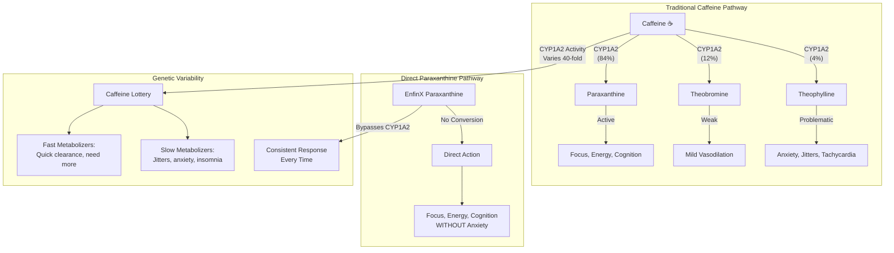

### Adenosine Receptor Pharmacology

Paraxanthine and caffeine both work by blocking adenosine receptors, but with different affinities:

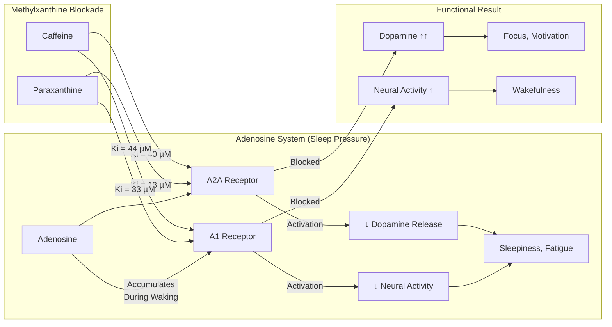

### Receptor Binding Kinetics

| Receptor | Paraxanthine Ki | Caffeine Ki | Ratio | Functional Impact |
|----------|-----------------|-------------|-------|-------------------|
| **Adenosine A2A** | **18 µM** | 40 µM | **2.2x stronger** | **Focus, motivation, reward** |
| Adenosine A1 | 33 µM | 44 µM | 1.3x stronger | Wakefulness, alertness |
| Adenosine A2B | Weak | Weak | Similar | Minimal CNS role |
| Adenosine A3 | Weak | Weak | Similar | Minimal CNS role |

### Why A2A Selectivity Matters

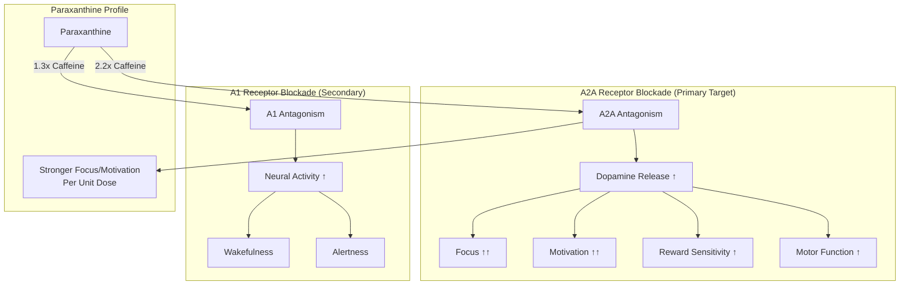

### Additional Mechanisms

| Mechanism | Paraxanthine | Caffeine | Significance |
|-----------|--------------|----------|--------------|
| **Phosphodiesterase Inhibition** | Yes | Yes | ↑ cAMP → enhanced signaling |
| **GABA-A Antagonism** | Minimal | Minimal | Not primary mechanism |
| **Ryanodine Receptor** | Yes | Yes | Ca²⁺ release (muscle) |
| **Nitric Oxide Potentiation** | **Yes (stronger)** | Weak | Vasodilation, blood flow |
| **BDNF Increase** | **Yes (documented)** | Yes (less studied) | Neuroplasticity |
| **Fat Oxidation** | Yes | Yes | Thermogenesis, metabolism |

### The Complete Mechanism Model

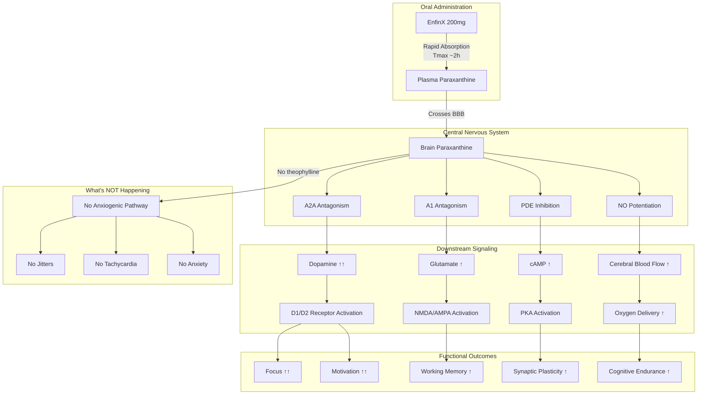

</Accordion>

<Accordion title="Pharmacogenomics & CYP1A2" icon="dna">

### The Caffeine Metabolism Problem

Caffeine must be metabolized by CYP1A2 to become active. This enzyme varies dramatically between individuals:

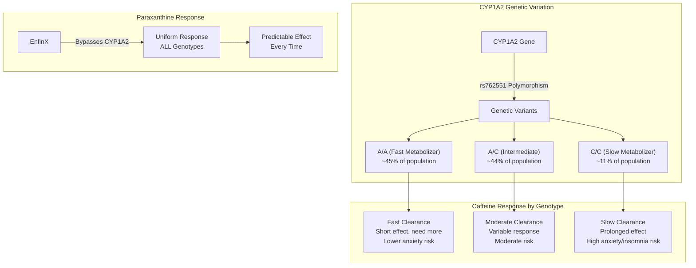

### CYP1A2 Activity Variation

| Factor | Effect on CYP1A2 | Caffeine Impact | Paraxanthine Impact |
|--------|------------------|-----------------|---------------------|
| **AA genotype** | High activity | Fast metabolism, short effect | **None — bypassed** |
| **CC genotype** | Low activity | Slow metabolism, anxiety | **None — bypassed** |
| **Smoking** | ↑ 1.5-2x induction | Faster clearance | **None** |
| **Oral contraceptives** | ↓ 50% inhibition | Slower clearance | **None** |
| **Pregnancy** | ↓ 65% inhibition | Much slower clearance | **None** |
| **Cruciferous vegetables** | ↑ Induction | Faster clearance | **None** |
| **Grapefruit juice** | ↓ Inhibition | Slower clearance | **None** |
| **Fluvoxamine** | ↓ 90%+ inhibition | Dangerous accumulation | **None** |

### Population Genetics of CYP1A2

| Genotype | Frequency | Caffeine Half-Life | Response Pattern |
|----------|-----------|-------------------|------------------|
| **A/A (Fast)** | ~45% | 2.5-4 hours | Need more caffeine, less anxiety |
| **A/C (Intermediate)** | ~44% | 4-6 hours | Variable, moderate risk |
| **C/C (Slow)** | ~11% | 6-10+ hours | Anxiety-prone, insomnia risk |

### The 40-Fold Variation Problem

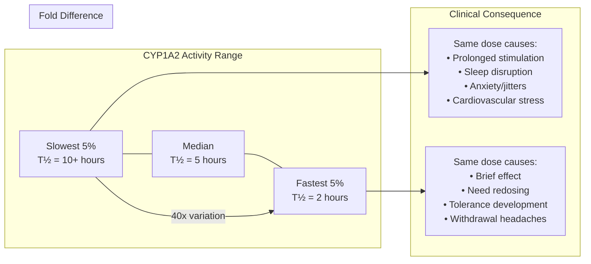

### Why Paraxanthine Solves This

| Problem | Caffeine | Paraxanthine |
|---------|----------|--------------|
| CYP1A2 dependence | **100% dependent** | **0% dependent** |
| Genetic variability | 40-fold | None |
| Drug interactions | Extensive | Minimal |
| Pregnancy safety | Reduced clearance | Consistent |
| Smoker dosing | Increased clearance | Consistent |
| Predictability | Low | **High** |

<Note>
**The Genetic Lottery Ends Here.** With caffeine, your experience depends on which CYP1A2 variants you inherited. Paraxanthine delivers the same compound to everyone — the one that actually works — eliminating the genetic lottery entirely. This is precision supplementation.
</Note>

### Metabolite Production Comparison

| Starting Compound | Paraxanthine Produced | Theobromine Produced | Theophylline Produced |
|-------------------|----------------------|----------------------|----------------------|
| **Caffeine** | 84% | 12% | **4% (anxiogenic)** |
| **Paraxanthine** | — | Trace | **0% (none)** |

</Accordion>

<Accordion title="The Theophylline Problem" icon="triangle-exclamation">

### Why Caffeine Causes Anxiety

Theophylline — the 4% metabolite of caffeine — is responsible for most caffeine-induced anxiety:

```mermaid
flowchart TB
    subgraph CAFFEINE_METAB["Caffeine Metabolism"]
        CAF[Caffeine] --> |"CYP1A2 (84%)"| PX[Paraxanthine<br>Clean stimulation]
        CAF --> |"CYP1A2 (12%)"| TB[Theobromine<br>Weak, long-lasting]
        CAF --> |"CYP1A2 (4%)"| TP[Theophylline<br>PROBLEMATIC]
    end
    
    subgraph THEOPHYLLINE["Theophylline Effects"]
        TP --> BRONCHO[Bronchodilation<br>(Medical use)]
        TP --> TACHY[Tachycardia ↑↑]
        TP --> ANXIETY[Anxiety ↑↑]
        TP --> TREMOR[Tremor]
        TP --> ARRHYTH[Arrhythmia Risk]
        TP --> SEIZURE[Seizure Risk<br>(High doses)]
    end
    
    subgraph MECHANISM["Theophylline Mechanisms"]
        TP --> A1_STRONG[Strong A1 Antagonism]
        TP --> PDE_STRONG[Strong PDE Inhibition]
        TP --> EP_RELEASE[Epinephrine Release ↑]
        A1_STRONG --> CARDIO[Cardiac Effects]
        PDE_STRONG --> CAMP_HIGH[cAMP Excessive ↑]
        EP_RELEASE --> FIGHT_FLIGHT[Fight-or-Flight]
    end
```

### Theophylline vs Paraxanthine Receptor Profile

| Receptor/Target | Theophylline | Paraxanthine | Clinical Difference |
|-----------------|--------------|--------------|---------------------|
| Adenosine A1 Ki | **14 µM (strong)** | 33 µM (moderate) | Theophylline more cardiac |
| Adenosine A2A Ki | 22 µM | 18 µM | Similar |
| PDE inhibition | **Strong** | Moderate | Theophylline more cAMP |
| Therapeutic index | **Narrow** | Wide | Theophylline more toxic |
| Anxiogenesis | **High** | Low | Key differentiator |

### The Anxiety Pathway

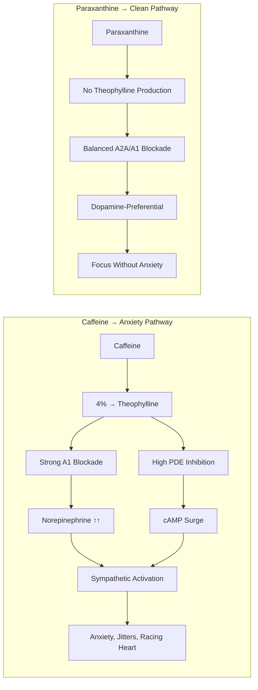

### Individual Variation in Theophylline Sensitivity

| Factor | Theophylline Sensitivity | Caffeine Anxiety Risk |
|--------|-------------------------|----------------------|
| Anxiety disorders | ↑↑ High | Very High |
| Panic disorder history | ↑↑↑ Very High | Extremely High |
| COMT Val/Val genotype | ↑ Higher | Elevated |
| Low adenosine tone | ↑ Higher | Elevated |
| Sleep deprivation | ↑ Higher | Elevated |
| **Paraxanthine user** | **N/A — No theophylline** | **Minimal** |

### Half-Life Comparison

| Compound | Half-Life | Duration | Sleep Impact |
|----------|-----------|----------|--------------|
| **Paraxanthine** | **3.1 hours** | 4-5 hours | **Low (if AM dosing)** |
| Caffeine | 5-6 hours* | 6-8 hours | Moderate-High |
| Theobromine | 6-10 hours | 8-12 hours | Low (weak) |
| **Theophylline** | **8-9 hours** | **10-12 hours** | **High (persistent)** |

*Highly variable based on CYP1A2 genetics

<Warning>
**Theophylline Is a Pharmaceutical Drug.** At higher concentrations, theophylline requires therapeutic drug monitoring due to its narrow therapeutic index. The "4%" from caffeine metabolism may seem small, but in caffeine-sensitive individuals or slow CYP1A2 metabolizers, theophylline accumulation contributes significantly to adverse effects. Paraxanthine produces **zero** theophylline.
</Warning>

### Why Some People "Can't Tolerate Caffeine"

| "Caffeine Sensitive" Pattern | Likely Cause | Paraxanthine Solution |
|------------------------------|--------------|----------------------|
| Anxiety with small amounts | Theophylline sensitivity + slow CYP1A2 | ✓ No theophylline |
| Jitters but no focus | High theophylline:paraxanthine ratio | ✓ Pure paraxanthine |
| Insomnia from morning coffee | Slow metabolism + theophylline persistence | ✓ 3.1h half-life |
| Heart palpitations | Theophylline cardiac effects | ✓ No theophylline |
| Crashes and headaches | Rebound + withdrawal | ✓ Smoother offset |

</Accordion>

<Accordion title="Pharmacokinetic Profile" icon="chart-line">

### ADME Parameters

| Parameter | Paraxanthine | Caffeine | Clinical Implication |
|-----------|--------------|----------|---------------------|
| **Bioavailability** | ~99% | ~99% | Both excellent |
| **Tmax** | 2.0 ± 0.5 hours | 0.5-2 hours | Paraxanthine slightly slower |
| **Half-life** | **3.1 hours** | **5-6 hours*** | **Paraxanthine clears faster** |
| **Volume of Distribution** | 0.5-0.7 L/kg | 0.5-0.7 L/kg | Similar tissue distribution |
| **Protein Binding** | ~15% | ~35% | Paraxanthine more free drug |
| **Metabolism** | CYP2A6 (minor) | CYP1A2 (major) | Different primary enzyme |
| **Renal Excretion** | ~2% unchanged | ~2% unchanged | Similar |

*Highly variable; can range from 2-10+ hours based on genetics

### Plasma Concentration Timeline

```mermaid
gantt
    title Paraxanthine Pharmacokinetic Timeline (200 mg dose)
    dateFormat HH:mm
    axisFormat %H:%M
    
    section Absorption
    Rapid absorption begins      :a1, 00:00, 30m
    Rising plasma levels         :a2, 00:30, 90m
    
    section Peak Phase
    Approaching Tmax             :crit, p1, 01:30, 30m
    Peak plasma concentration    :crit, p2, 02:00, 1h
    Peak cognitive effects       :crit, p3, 02:00, 2h
    
    section Sustained Effect
    Therapeutic plateau          :s1, 02:00, 2h
    Gradual decline begins       :s2, 04:00, 1h
    
    section Clearance
    Below peak, still active     :c1, 05:00, 1h
    Approaching half-life        :c2, 05:00, 30m
    One half-life (50%)          :milestone, m1, 05:06, 0m
    
    section Resolution
    Sub-threshold effects        :r1, 06:00, 2h
    Minimal residual             :r2, 08:00, 2h
    Near-complete clearance      :r3, 10:00, 4h
```

### Comparative Clearance Timeline

```mermaid
gantt
    title Methylxanthine Clearance Comparison (Equal Doses)
    dateFormat HH:mm
    axisFormat %H:%M
    
    section Paraxanthine (T½ = 3.1h)
    Active period           :active, px1, 00:00, 5h
    50% remaining           :px2, 05:06, 0m
    Sub-threshold           :px3, 08:00, 4h
    
    section Caffeine (T½ = 5h avg)
    Active period           :crit, caf1, 00:00, 8h
    50% remaining           :caf2, 08:00, 0m
    Sub-threshold           :caf3, 12:00, 4h
    
    section Caffeine (Slow Metabolizer, T½ = 9h)
    Active period           :crit, cafs1, 00:00, 12h
    50% remaining           :cafs2, 12:00, 0m
    Still active at bedtime :cafs3, 16:00, 8h
```

### Sleep Protection Analysis

| Dosing Time | Paraxanthine (T½ = 3.1h) | Caffeine Fast (T½ = 4h) | Caffeine Slow (T½ = 9h) |
|-------------|--------------------------|-------------------------|-------------------------|
| 7:00 AM | &lt;3% at 11 PM ✓ | ~6% at 11 PM ✓ | ~25% at 11 PM ✗ |
| 10:00 AM | ~6% at 11 PM ✓ | ~12% at 11 PM ⚠ | ~35% at 11 PM ✗ |
| 1:00 PM | ~12% at 11 PM ✓ | ~25% at 11 PM ✗ | ~50% at 11 PM ✗ |
| 4:00 PM | ~25% at 11 PM ⚠ | ~44% at 11 PM ✗ | ~65% at 11 PM ✗ |

### Metabolism Pathway

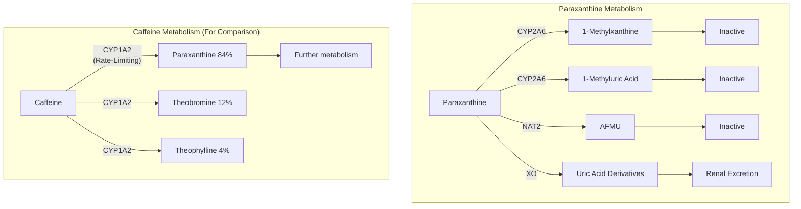

### CYP2A6 vs CYP1A2 Implications

| Characteristic | CYP2A6 (Paraxanthine) | CYP1A2 (Caffeine) |
|----------------|----------------------|-------------------|
| Role | Minor metabolism | Rate-limiting |
| Genetic variation | Moderate | **Extreme (40-fold)** |
| Common inhibitors | Few | Many |
| Common inducers | Few | Many (smoking, crucifers) |
| Drug interactions | Minimal | Extensive |
| Clinical relevance | Low | **High** |

<Note>
**Key Insight:** Paraxanthine's metabolism by CYP2A6 (rather than CYP1A2) means its clearance is much more consistent across individuals. While CYP1A2 shows 40-fold variation, CYP2A6 variation is modest and clinically less significant. This contributes to paraxanthine's predictable pharmacokinetics.
</Note>

</Accordion>

<Accordion title="Form Selection" icon="magnifying-glass-plus">

### Methylxanthine Comparison

| Compound | A1 Ki (µM) | A2A Ki (µM) | Half-Life | Anxiety | Best Application |
|----------|------------|-------------|-----------|---------|------------------|
| **EnfinX Paraxanthine** | 33 | **18** | **3.1 h** | ★☆☆☆☆ | **Daily nootropic** |
| Caffeine | 44 | 40 | 5-6 h* | ★★★☆☆ | Acute when tolerance acceptable |
| Theobromine | 80+ | 80+ | 6-10 h | ★☆☆☆☆ | Mild, long-duration |
| Theacrine (TeaCrine) | Indirect | Indirect | 20+ h | ★★☆☆☆ | No-tolerance protocols |
| Dynamine (Methylliberine) | Indirect | Indirect | 1-2 h | ★☆☆☆☆ | Rapid onset stacking |
| Theophylline | **14** | 22 | 8-9 h | ★★★★★ | **Avoid** (medical only) |

*Highly variable

### Paraxanthine Source Comparison

| Source | Purity | GRAS Status | Clinical Data | Recommendation |
|--------|--------|-------------|---------------|----------------|
| **EnfinX (NTRPX)** | ≥99% | Self-affirmed | 8+ clinical studies | **Standard** |
| enfinity (Ingenious Ingredients) | ≥99% | Self-affirmed | Original clinical program | Equivalent quality |
| Generic paraxanthine | Variable | None | None | Not recommended |
| Caffeine → paraxanthine (endogenous) | N/A | N/A | Extensive | Genetic lottery |

### Quality Specification

| Attribute | Specification | Method |
|-----------|---------------|--------|
| Identity | Paraxanthine (1,7-dimethylxanthine) | HPLC, MS |
| Purity | ≥99.0% | HPLC |
| Water content | &lt;0.5% | Karl Fischer |
| Residue on ignition | &lt;0.1% | Gravimetric |
| Heavy metals (total) | &lt;10 ppm | ICP-MS |
| Lead | &lt;1 ppm | ICP-MS |
| Arsenic | &lt;1 ppm | ICP-MS |
| Microbial (TPC) | &lt;100 CFU/g | USP &lt;61&gt; |

### Why Not Just Use Caffeine?

| Factor | Caffeine | Paraxanthine | Winner |
|--------|----------|--------------|--------|
| **Consistency** | 40-fold genetic variation | Uniform response | **Paraxanthine** |
| **Anxiety risk** | Theophylline production | No theophylline | **Paraxanthine** |
| **Sleep disruption** | 5-6h+ half-life | 3.1h half-life | **Paraxanthine** |
| **A2A affinity** | 40 µM Ki | 18 µM Ki (2.2x) | **Paraxanthine** |
| **Safety margin** | LD50: 127-367 mg/kg | LD50: 829-1601 mg/kg | **Paraxanthine** |
| **Cost** | Very cheap | More expensive | Caffeine |
| **Availability** | Ubiquitous | Specialized | Caffeine |
| **Tradition** | Millennia of use | Novel | Caffeine |

<Note>
**EnfinX Specification:** NTRPX sources pharmaceutical-grade paraxanthine (1,7-dimethylxanthine) with ≥99% purity. This is the same compound produced endogenously from caffeine metabolism, but delivered directly without requiring CYP1A2 conversion. Self-affirmed GRAS status. Third-party tested for identity, purity, heavy metals, and microbial contamination.
</Note>

</Accordion>

<Accordion title="Dosing Rationale" icon="capsules">

### Dose-Response Analysis

| Dose | Cognitive Effect | Energy/Alertness | Side Effects | Notes |
|------|------------------|------------------|--------------|-------|
| 50 mg | Mild | Mild | Minimal | Threshold dose |
| 100 mg | Moderate | Moderate | Low | Conservative effective |
| **200 mg** | **High** | **High** | **Low** | **Optimal — NTRPX dose** |
| 300 mg | High | Very High | Moderate | Upper range; individual variation |
| 400 mg | High (ceiling) | Very High | Moderate-High | Research/acute max |

### Clinical Trial Dosing Data

| Study | Dose Tested | Key Finding |
|-------|-------------|-------------|
| Yoo 2024 | 200 mg | 35.8% fewer errors on cognitive tasks |
| Purpura 2024 | 200 mg | Increased BDNF expression |
| Xing 2021 | 50, 100, 200 mg | All effective; 100-200 mg optimal cognitive |
| Yoo 2021 | 200 mg | Sustained attention improvement |
| Metabolic studies | 300 mg | Thermogenic effects (~100 kcal/3h) |

### NTRPX Protocol

| Parameter | Recommendation | Rationale |
|-----------|----------------|-----------|
| **Dose** | 200 mg | Optimal efficacy in clinical trials |
| **Timing** | Morning (with or after breakfast) | Align with circadian activation |
| **Latest dose** | 10-11 AM | Ensures clearance by sleep (3.1h T½) |
| **Frequency** | Daily acceptable | No significant tolerance observed |
| **Food** | Optional | No major absorption impact |

### Timing Protocol

```mermaid
gantt
    title Optimal Paraxanthine Daily Protocol
    dateFormat HH:mm
    axisFormat %H:%M
    
    section Morning Routine
    Wake up                     :wake, 06:00, 30m
    Boost stack (baseline)      :boost, 06:30, 15m
    
    section ParaCaffeine
    Take ParaCaffeine 200mg     :crit, dose, 07:00, 10m
    Absorption phase            :abs, 07:10, 110m
    
    section Peak Performance
    Peak cognitive effects      :crit, peak, 09:00, 3h
    High-demand work window     :work, 09:00, 4h
    
    section Clearance
    Effects waning              :wane, 13:00, 2h
    Half-life reached           :hl, 12:06, 0m
    Sub-threshold               :sub, 15:00, 3h
    
    section Evening
    Near-complete clearance     :clear, 18:00, 3h
    Unimpaired sleep            :sleep, 22:00, 8h
```

### Population-Specific Dosing

| Population | Dose | Rationale |
|------------|------|-----------|
| **Standard adults** | 200 mg | Clinical trial dose |
| **Caffeine-naive** | 100-150 mg | Assess sensitivity |
| **Caffeine-sensitive ("can't tolerate coffee")** | 200 mg | Often tolerate paraxanthine well |
| **Former heavy caffeine users** | 200 mg | May feel "cleaner" |
| **Elderly (65+)** | 100-200 mg | Start lower; assess |
| **Athletes (pre-competition)** | 200-300 mg | Upper range if needed |
| **Night shift workers** | 200 mg (shift start) | Short T½ protects day sleep |

### Caffeine Transition Protocol

For users transitioning from caffeine to paraxanthine:

| Week | Morning Caffeine | Paraxanthine | Notes |
|------|------------------|--------------|-------|
| 1 | 75% of usual | 100 mg | Begin transition |
| 2 | 50% of usual | 150 mg | Reduce caffeine |
| 3 | 25% of usual | 200 mg | Nearly complete |
| 4+ | 0 mg | 200 mg | Full paraxanthine protocol |

### Dose Adjustment Scenarios

| Scenario | Adjustment | Rationale |
|----------|------------|-----------|
| **First-time use** | Start with 100-150 mg | Assess individual response |
| **Sprint day** | Skip ParaCaffeine | Caffeine in Sprint provides stimulation |
| **Afternoon slump (before 2 PM)** | Second 100 mg dose acceptable | T½ still allows evening clearance |
| **Afternoon need (after 2 PM)** | Use Dynamine only | Paraxanthine T½ too long |
| **Sensitive to stimulants** | 100-150 mg | Lower dose often sufficient |
| **No perceived effect** | Confirm timing; try 250 mg | May need upper range |

</Accordion>

<Accordion title="Safety & Toxicology" icon="shield-check">

### Acute Toxicity Comparison

| Compound | Oral LD50 (mg/kg, rat) | Human Equivalent* | Therapeutic Margin |
|----------|------------------------|-------------------|-------------------|
| **Paraxanthine** | **829-1601** | **~8-16 g** | **40-80x typical dose** |
| Caffeine | 127-367 | ~1.3-3.7 g | 6-18x typical dose |
| Theophylline | 206-225 | ~2.1-2.3 g | Narrow (requires monitoring) |
| Theobromine | 950 | ~9.5 g | Wide (but weak) |

*Rough estimate using allometric scaling; not for clinical use

### Safety Margin Visualization

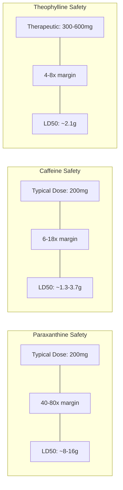

### Adverse Event Profile

| Event | Incidence | Severity | Management |
|-------|-----------|----------|------------|
| Headache | &lt;5% | Mild | Usually dehydration; hydrate |
| Jitteriness | **&lt;2%** | Mild | **Much lower than caffeine** |
| Insomnia | &lt;3% | Mild | Ensure AM dosing |
| GI discomfort | &lt;3% | Mild | Take with food |
| Tachycardia | **Rare** | Mild | **Much lower than caffeine** |
| Anxiety | **Rare** | Mild | **Much lower than caffeine** |

### Comparative Adverse Event Rates

| Adverse Event | Paraxanthine | Caffeine | Difference |
|---------------|--------------|----------|------------|
| **Anxiety/Nervousness** | **&lt;2%** | 10-15% | **5-7x lower** |
| **Jitteriness** | **&lt;2%** | 8-12% | **4-6x lower** |
| **Tachycardia** | **Rare** | 5-10% | **Significantly lower** |
| **Insomnia** | &lt;3% | 15-25% | **5-8x lower** |
| Headache | &lt;5% | 5-10% | Similar |
| GI upset | &lt;3% | 5-8% | Slightly lower |

### Clinical Trial Safety Data

| Study | N | Dose | Duration | Serious AEs | Notable Findings |
|-------|---|------|----------|-------------|------------------|
| Yoo 2024 | 30 | 200 mg | Acute | 0 | No significant AEs vs placebo |
| Xing 2021 | 12 | 50-200 mg | 7 days | 0 | Well-tolerated at all doses |
| Purpura 2024 | 24 | 200 mg | 2 weeks | 0 | No clinical chemistry changes |
| Metabolic studies | Multiple | 300 mg | Acute | 0 | Thermogenic but tolerated |

### Contraindications

| Category | Consideration | Severity |
|----------|---------------|----------|
| **Cardiac arrhythmias (uncontrolled)** | Stimulant effects | ★★★☆☆ Relative |
| **Severe hypertension** | Potential BP elevation | ★★★☆☆ Relative |
| **Anxiety disorders (severe)** | Lower risk than caffeine but still stimulant | ★★☆☆☆ Caution |
| **Pregnancy/Nursing** | Limited data; apply caffeine cautions | ★★★☆☆ Caution |
| **Children** | Not studied | ★★★☆☆ Avoid |
| **Seizure disorders** | Theoretical concern | ★★☆☆☆ Caution |

### Drug Interactions

| Drug Class | Interaction | Severity | Notes |
|------------|-------------|----------|-------|
| **MAOIs** | Theoretical potentiation | ★★★★☆ | Avoid combination |
| **Other stimulants** | Additive effects | ★★★☆☆ | Monitor; reduce doses |
| **Adenosine (IV)** | Antagonism | ★★★☆☆ | Inform medical staff |
| **Lithium** | May affect clearance | ★★☆☆☆ | Monitor levels |
| **CYP1A2 substrates** | **Minimal interaction** | ★☆☆☆☆ | **Unlike caffeine** |
| **CYP2A6 inhibitors** | Theoretical ↑ paraxanthine | ★★☆☆☆ | Minor pathway |

<Note>
**Drug Interaction Advantage:** Because paraxanthine doesn't require CYP1A2 for activation or clearance, it avoids the extensive drug interaction profile of caffeine. Compounds that inhibit or induce CYP1A2 (oral contraceptives, smoking, fluvoxamine, etc.) have minimal impact on paraxanthine pharmacokinetics.
</Note>

### Long-Term Safety

| Parameter | Status | Evidence |
|-----------|--------|----------|
| Subchronic (7-14 days) | Well-established | Multiple studies |
| Chronic (&gt;30 days) | Limited data | Emerging |
| Tolerance development | Minimal observed | Clinical experience |
| Dependence/Withdrawal | Lower than caffeine expected | Theoretical |
| Organ toxicity | None observed | Standard doses |

### Regulatory Status

| Region | Status | Notes |
|--------|--------|-------|
| **United States** | GRAS (self-affirmed) | Dietary supplement |
| **Canada** | NHP eligible | Registration pathway |
| **EU** | Novel Food (pending) | Regulatory review |
| **Australia** | Under evaluation | Not yet approved |
| **WADA** | Not prohibited | Legal for sport |

---

### <Icon icon="star" color="#5A8FA8" /> Tier 1: Foundation

<CardGroup cols={3}>
<Card title="Efficacy" icon="check" color="#5A8FA8">High</Card>
<Card title="Clinical Validation" icon="check" color="#5A8FA8">Moderate-High — 8+ RCTs; active research</Card>
<Card title="Safety" icon="check" color="#5A8FA8">Excellent — 4-5x wider margin than caffeine</Card>
</CardGroup>

**Tier Rationale:** Tier 1 (Foundation) classification. Paraxanthine is caffeine's primary active metabolite with superior receptor affinity, safety margin, and predictability. Effect sizes for cognitive enhancement are moderate-to-large with excellent tolerability. The elimination of genetic variability, theophylline production, and extended half-life issues makes paraxanthine the rational choice for daily stimulant support. While clinical data is still emerging compared to caffeine's millennia of use, the mechanistic and safety advantages are compelling.

</Accordion>

<Accordion title="Neuroplasticity & BDNF" icon="brain">

### Emerging Neuroplasticity Research

Recent research suggests paraxanthine may have unique effects on brain-derived neurotrophic factor (BDNF):

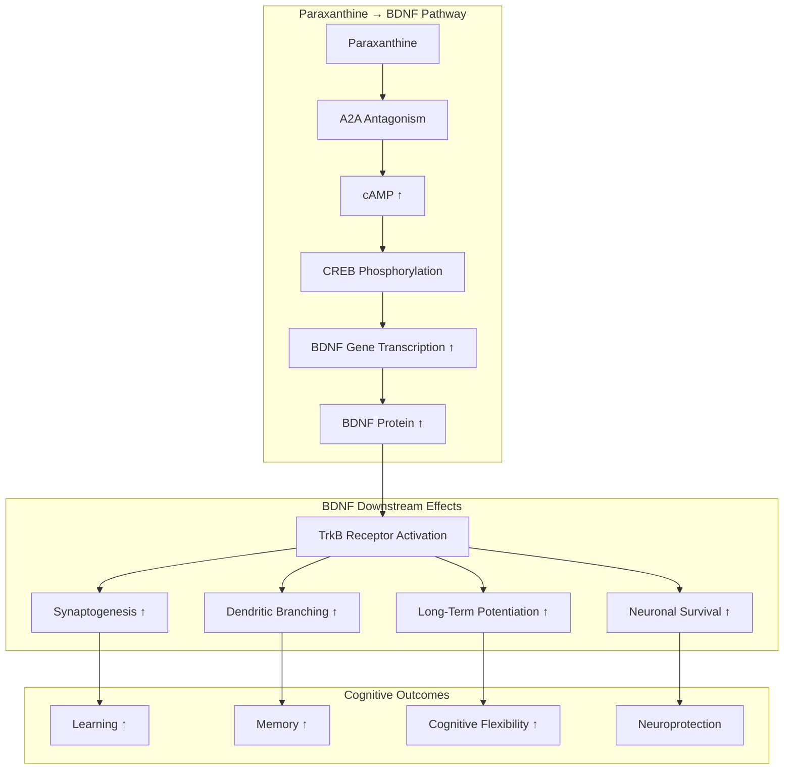

### BDNF Research Findings

| Study | Model | Dose | Finding |
|-------|-------|------|---------|
| **Purpura 2024** | Human | 200 mg | ↑ BDNF expression vs placebo |
| **Xing 2021** | Rat | Equivalent | ↑ BDNF greater than caffeine |
| Aguiar 2021 | Rat | Various | Paraxanthine ↑ hippocampal BDNF |
| Xing 2024 | Rat (aged) | Equivalent | ↑ BDNF in young and old animals |

### Paraxanthine vs Caffeine: Neuroplasticity

| Parameter | Paraxanthine | Caffeine | Evidence |
|-----------|--------------|----------|----------|
| BDNF increase | **Higher** | Present | Xing 2024 (head-to-head) |
| A2A-mediated CREB | **Stronger** (2.2x A2A) | Present | Mechanistic |
| Neuroprotection | Documented | Documented | Multiple studies |
| Memory enhancement | **Greater effect** | Present | Xing 2024 |
| Cognitive flexibility | ↑ (fewer errors) | ↑ | Yoo 2024 |

### Proposed Long-Term Benefits

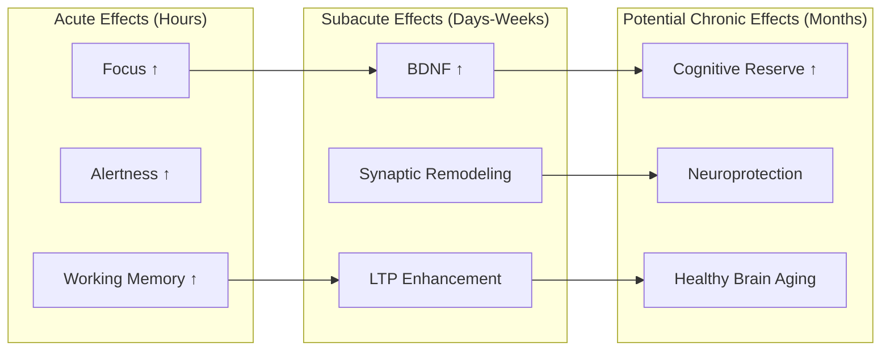

<Note>
**Emerging Research.** BDNF findings are promising but based on limited studies. More research is needed to confirm long-term neuroplasticity benefits. Current evidence supports acute cognitive enhancement; neuroplasticity effects are a potential additional benefit requiring further validation.
</Note>

</Accordion>

<Accordion title="Athletic Performance" icon="dumbbell">

### Performance Enhancement Mechanisms

```mermaid
flowchart TB
    subgraph CNS["Central Nervous System Effects"]
        PX[Paraxanthine] --> ADEN[Adenosine Blockade]
        ADEN --> FATIGUE_DOWN[Central Fatigue ↓]
        ADEN --> PAIN_DOWN[Pain Perception ↓]
        ADEN --> RPE_DOWN[RPE ↓]
    end
    
    subgraph METABOLIC["Metabolic Effects"]
        PX --> LIPO[Lipolysis ↑]
        LIPO --> FFA[Free Fatty Acids ↑]
        FFA --> FAT_OX[Fat Oxidation ↑]
        FAT_OX --> GLYCOGEN_SPARE[Glycogen Sparing]
        
        PX --> THERMO[Thermogenesis ↑]
        THERMO --> EE[Energy Expenditure ↑]
    end
    
    subgraph MUSCLE["Muscular Effects"]
        PX --> CA[Ca²⁺ Release (RyR)]
        CA --> CONTRACT[Muscle Contraction ↑]
        CONTRACT --> POWER[Power Output ↑]
        
        PX --> NO[Nitric Oxide ↑]
        NO --> FLOW[Blood Flow ↑]
        FLOW --> O2[Oxygen Delivery ↑]
    end
    
    subgraph OUTCOME["Performance Outcomes"]
        FATIGUE_DOWN --> ENDURANCE[Endurance ↑]
        GLYCOGEN_SPARE --> ENDURANCE
        POWER --> STRENGTH[Strength ↑]
        RPE_DOWN --> VOLUME[Training Volume ↑]
    end
```

### Metabolic/Thermogenic Effects

| Study | Dose | Finding |
|-------|------|---------|
| Purpura 2021 | 300 mg | ↑ Resting energy expenditure (~100 kcal/3h) |
| Xing 2021 | 200 mg | ↑ Fat oxidation |
| Multiple | Various | Lipolytic effects consistent |

### Performance Study Data

| Study | N | Dose | Protocol | Outcome |
|-------|---|------|----------|---------|
| Xing 2021 | 12 | 200 mg | Cognitive + physical | ↑ Attention; well-tolerated |
| Purpura 2021 | 24 | 300 mg | Metabolic chamber | ↑ EE, ↑ fat oxidation |
| Ongoing trials | — | Various | Endurance, strength | Data emerging |

### Comparison with Caffeine for Athletic Use

| Parameter | Paraxanthine | Caffeine | Implication |
|-----------|--------------|----------|-------------|
| Ergogenic effect | Present | Well-established | Both effective |
| Research volume | Limited | Extensive | Caffeine more validated |
| Side effect profile | Better | More side effects | Paraxanthine cleaner |
| Pre-competition anxiety | Lower risk | Higher risk | Paraxanthine advantage |
| Half-life (recovery) | Shorter | Longer | Paraxanthine clears faster |
| WADA status | Permitted | Permitted | Both legal |

### Athletic Protocol

| Application | Protocol | Timing |
|-------------|----------|--------|
| **Cognitive sports (esports, chess)** | 200 mg | 60-90 min pre |
| **Endurance training** | 200 mg | 60 min pre |
| **Strength training** | 200-300 mg | 45-60 min pre |
| **Competition (general)** | 200 mg | 60 min pre |
| **Fat loss support** | 200-300 mg AM | Fasted or with breakfast |

<Tip>
**Athletic Note:** While paraxanthine shows promise for athletic performance, caffeine has a larger evidence base for ergogenic effects. Paraxanthine's advantages (lower anxiety, shorter half-life, better tolerability) may make it preferable for athletes sensitive to caffeine's side effects or competing in events where anxiety impairs performance.
</Tip>

</Accordion>

<Accordion title="Synergy Matrix" icon="link">

### ParaCaffeine Standalone Synergies

| Pairing | Mechanism | Synergy Type | Recommendation |
|---------|-----------|--------------|----------------|
| **+ L-Tyrosine** | Paraxanthine ↑ DA release; Tyrosine ↑ DA synthesis | Biosynthetic | ★★★★★ |
| **+ L-Theanine** | Alert relaxation; smooths any edge | Modulatory | ★★★★☆ |
| **+ Dynamine** | Rapid onset (Dyn) + sustained (PX) | Temporal | ★★★★☆ |
| **+ Rhodiola** | Adaptogenic + stimulant | Complementary | ★★★☆☆ |
| **+ Alpha-GPC** | Cholinergic + adenosinergic | Parallel pathways | ★★★☆☆ |

### The Dopamine Optimization Stack

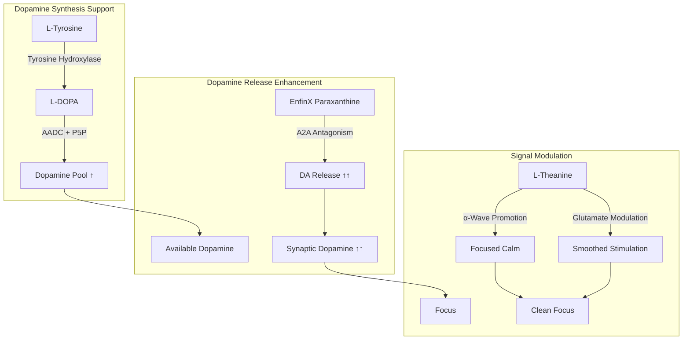

### Temporal Stacking

```mermaid
gantt
    title Methylxanthine Temporal Stacking Strategy
    dateFormat HH:mm
    axisFormat %H:%M
    
    section Paraxanthine Only (Standard)
    ParaCaffeine 200mg           :active, px, 07:00, 5h
    
    section With Dynamine (Rapid Onset)
    Dynamine 100mg              :dyn, 07:00, 2h
    ParaCaffeine 200mg          :active, px2, 07:00, 5h
    Combined peak               :crit, peak, 07:30, 1h30m
    
    section With Theacrine (Extended)
    ParaCaffeine 200mg          :active, px3, 07:00, 5h
    Theacrine 100mg             :tea, 07:00, 10h
    Extended coverage           :ext, 12:00, 5h
```

### Contraindicated Combinations

| Combination | Risk | Severity |
|-------------|------|----------|
| **+ High-dose caffeine** | Excessive stimulation; negates benefits | ★★★☆☆ |
| **+ MAOIs** | Theoretical potentiation | ★★★★☆ |
| **+ Other high-dose stimulants** | Cardiovascular stress | ★★★☆☆ |
| **+ Sprint (same day)** | Redundant stimulation | ★★☆☆☆ |

### Integration with NTRPX Stack

| Time | Product | Paraxanthine Role |
|------|---------|-------------------|
| Morning | Boost | Baseline (no stimulant in Boost) |
| Morning | **ParaCaffeine** | **Primary stimulation** |
| Afternoon | Sustain | Maintenance (no stimulant) |
| As needed | Sprint | **Skip ParaCaffeine** — Sprint has caffeine |

<Note>
**Sprint Day Protocol:** On days using Sprint, skip ParaCaffeine. Sprint contains caffeine for maximum acute stimulation combined with the cholinergic amplification stack (Alpha-GPC + Huperzine A). Paraxanthine + caffeine together provides no additional benefit and increases side effect risk.
</Note>

</Accordion>

<Accordion title="Clinical Evidence" icon="book-open">

### Cognitive Enhancement Trials

| Study | Design | N | Dose | Duration | Primary Outcome |
|-------|--------|---|------|----------|-----------------|
| **Yoo 2024** | RCT, healthy adults | 30 | 200 mg | Acute | **↓ 35.8% errors on cognitive tasks** |
| **Xing 2021** | RCT, crossover | 12 | 50-200 mg | 7 days | **↑ Attention, memory at 100-200 mg** |
| **Yoo 2021** | RCT | 24 | 200 mg | Acute | **↑ Sustained attention** |
| Purpura 2024 | RCT | 24 | 200 mg | 2 weeks | ↑ BDNF; cognitive measures |
| Controlled studies | Multiple | Various | 100-200 mg | Acute-7d | Consistent cognitive benefits |

### Head-to-Head vs Caffeine

| Study | Model | Finding |
|-------|-------|---------|
| **Xing 2024** | Rat (young + aged) | **Paraxanthine &gt; Caffeine for memory** |
| Xing 2024 | Rat | **Paraxanthine ↑ BDNF &gt; Caffeine** |
| Mechanistic | In vitro | Paraxanthine 2.2x A2A affinity |
| PK studies | Human | Paraxanthine more consistent response |

### Safety Trials

| Study | N | Dose | Duration | Safety Finding |
|-------|---|------|----------|----------------|
| Xing 2021 | 12 | 50-200 mg | 7 days | No significant AEs; no clinical chemistry changes |
| Yoo 2024 | 30 | 200 mg | Acute | Well-tolerated; AE rate similar to placebo |
| Purpura 2024 | 24 | 200 mg | 2 weeks | No serious AEs |
| Metabolic | 24+ | 300 mg | Acute | Tolerated; mild effects |

### Metabolic/Thermogenic Studies

| Study | N | Dose | Finding |
|-------|---|------|---------|
| Purpura 2021 | 24 | 300 mg | ↑ EE ~100 kcal/3h; ↑ fat oxidation |
| Multiple | Various | 200-300 mg | Consistent lipolytic/thermogenic effects |

### Effect Size Summary

| Outcome | Effect Size (d) | Confidence |
|---------|-----------------|------------|
| Cognitive errors | 0.5-0.8 | Moderate-High |
| Attention/Focus | 0.4-0.7 | Moderate |
| Memory | 0.4-0.6 | Moderate |
| Reaction time | 0.3-0.5 | Moderate |
| BDNF increase | Significant | Emerging |
| Thermogenesis | ~100 kcal/3h | Moderate |

### Ongoing Research

| Area | Status | Expected Data |
|------|--------|---------------|
| Long-term cognitive effects | Active trials | 2025-2026 |
| Athletic performance | Active trials | 2025 |
| Sleep quality impact | Planned | 2025-2026 |
| Neuroimaging (fMRI) | Planned | 2026 |
| Elderly cognition | Proposed | TBD |

### References

**Cognitive Studies:**
- Yoo C et al. Paraxanthine improves cognitive function via reduction of mental errors. *J Int Soc Sports Nutr.* 2024;21(1):2301391. [PubMed](https://pubmed.ncbi.nlm.nih.gov/38189781/)
- Xing D et al. Dose-response of paraxanthine on cognitive function: A double-blind, placebo-controlled, crossover trial. *Nutrients.* 2021;13(12):4478. [PubMed](https://pubmed.ncbi.nlm.nih.gov/34960030/)
- Yoo C et al. Acute paraxanthine ingestion improves cognition and short-term memory. *Nutrients.* 2021;13(11):3980. [PubMed](https://pubmed.ncbi.nlm.nih.gov/34836242/)

**BDNF/Neuroplasticity:**
- Purpura M et al. Paraxanthine supplementation increases BDNF levels. *Proceedings ISSN.* 2024.
- Xing D et al. Paraxanthine enhances memory and neuroplasticity more than caffeine in rats. *Nutrients.* 2024;16(22):3822. [PMC](https://pmc.ncbi.nlm.nih.gov/articles/PMC11609120/)

**Pharmacology/Safety:**
- Lelo A et al. Comparative pharmacokinetics of caffeine and its primary demethylated metabolites paraxanthine, theobromine and theophylline in man. *Br J Clin Pharmacol.* 1986;22(2):177-82. [PubMed](https://pubmed.ncbi.nlm.nih.gov/3756065/)
- Purpura M et al. Analysis of different innovative formulations of paraxanthine. *Proceedings.* 2021.

**Metabolic:**
- Purpura M et al. Paraxanthine increases resting energy expenditure. *J Int Soc Sports Nutr.* 2021;18(Suppl 1):A23.

</Accordion>

<Accordion title="Comparison Summary" icon="scale-balanced">

### Paraxanthine vs Caffeine: Complete Comparison

| Parameter | Paraxanthine | Caffeine | Winner |
|-----------|--------------|----------|--------|
| **A2A Receptor Affinity** | 18 µM Ki | 40 µM Ki | **Paraxanthine (2.2x)** |
| **A1 Receptor Affinity** | 33 µM Ki | 44 µM Ki | **Paraxanthine (1.3x)** |
| **Half-life** | 3.1 hours | 5-6 hours* | **Paraxanthine (shorter)** |
| **Genetic variability** | Minimal | 40-fold | **Paraxanthine** |
| **Theophylline production** | 0% | 4% | **Paraxanthine** |
| **Anxiety/Jitters** | &lt;2% | 10-15% | **Paraxanthine** |
| **Insomnia risk** | &lt;3% | 15-25% | **Paraxanthine** |
| **Safety margin** | 4-5x wider | Baseline | **Paraxanthine** |
| **Drug interactions** | Minimal | Extensive | **Paraxanthine** |
| **BDNF increase** | Higher | Present | **Paraxanthine** |
| **Cost** | Higher | Very low | Caffeine |
| **Availability** | Specialized | Ubiquitous | Caffeine |
| **Research volume** | Emerging | Millennia | Caffeine |

*Highly variable based on genetics

### Visual Comparison

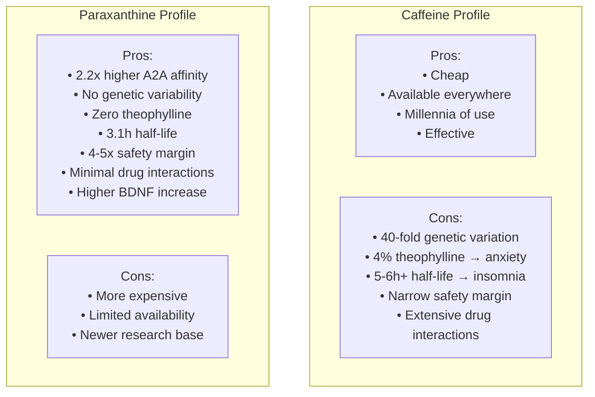

### Who Should Choose Paraxanthine Over Caffeine?

| Profile | Recommendation | Reason |
|---------|----------------|--------|
| **Caffeine-sensitive individuals** | ✓ Paraxanthine | No theophylline anxiety |
| **Slow CYP1A2 metabolizers** | ✓ Paraxanthine | Bypasses genetic issue |
| **Sleep-conscious users** | ✓ Paraxanthine | 3.1h vs 5-6h+ half-life |
| **Those with anxiety history** | ✓ Paraxanthine | Lower anxiogenic potential |
| **Seeking consistency** | ✓ Paraxanthine | No genetic lottery |
| **On CYP1A2-interacting drugs** | ✓ Paraxanthine | No interaction |
| **Budget-conscious** | Consider caffeine | Cost difference |
| **Caffeine works well for them** | Either | If ain't broke... |

### The Bottom Line

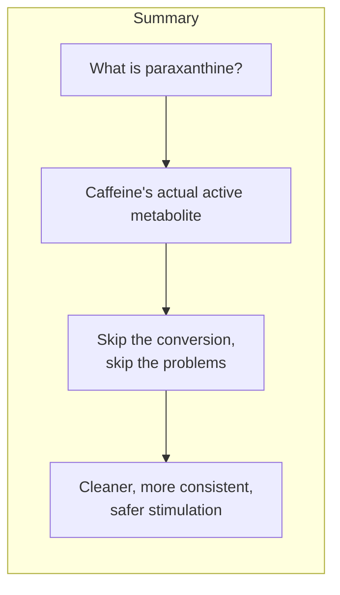

</Accordion>

</AccordionGroup>

---

<Tip>
**ParaCaffeine Summary:** EnfinX Paraxanthine (200 mg) delivers caffeine's primary active metabolite directly — bypassing CYP1A2 genetic variability, eliminating anxiogenic theophylline production, and providing a shorter half-life for sleep protection. The result is clean, consistent, predictable cognitive enhancement with a 4-5x wider safety margin than caffeine. This is stimulation, optimized.
</Tip>