## MembraneMax Phosphatidylserine

<CardGroup cols={4}>

<Card title="Boost" icon="rocket-launch" color="#5A8FA8">
100 mg (≥50% PS)
</Card>

<Card title="Sprint™" icon="bolt" color="#5A8FA8">
100 mg (≥50% PS)
</Card>

<Card title="Source" icon="seedling" color="#5A8FA8">
Sunflower Lecithin
</Card>

<Card title="FDA Claim" icon="badge-check" color="#5A8FA8">
Qualified Health Claim
</Card>

</CardGroup>

**The brain's own membrane molecule, now from sustainable sunflowers.** Phosphatidylserine (PS) is a phospholipid found in *every cell membrane* in the human body, but is especially concentrated in the brain — where it comprises 15% of the total phospholipid pool. PS is not merely structural; it's *functional*, playing critical roles in neurotransmitter release, synaptic plasticity, cell signaling, and glucose metabolism. As we age, brain PS levels decline, correlating with cognitive changes. Clinical research spanning 50+ studies has demonstrated that PS supplementation supports memory, attention, and cognitive function — earning it the *only FDA-qualified health claim* for cognitive decline risk reduction among nootropic ingredients. NTRPX sources PS from non-GMO European sunflower lecithin (≥50% active PS), providing an allergen-free, soy-free alternative that is chemically identical to traditional sources. In Boost and Sprint, MembraneMax Phosphatidylserine delivers the membrane support that keeps neurons communicating optimally.

<AccordionGroup>

<Accordion title="Mechanism of Action" icon="flask">

Phosphatidylserine works through multiple mechanisms rooted in its fundamental role as a membrane phospholipid:

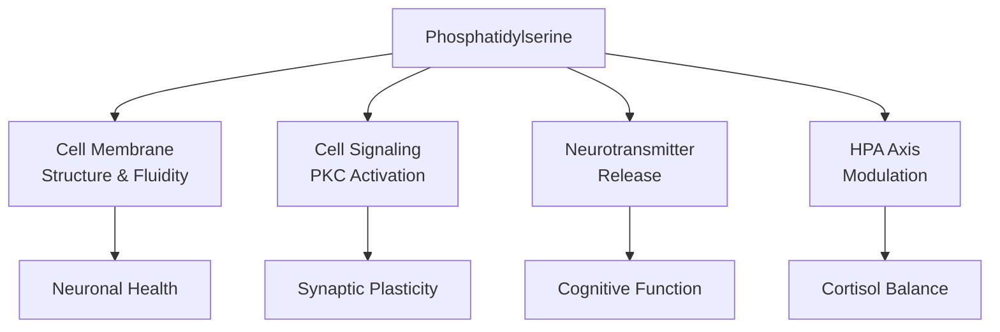

### Mechanism 1: Membrane Structure and Fluidity

PS is a structural component of the cell membrane's inner leaflet:

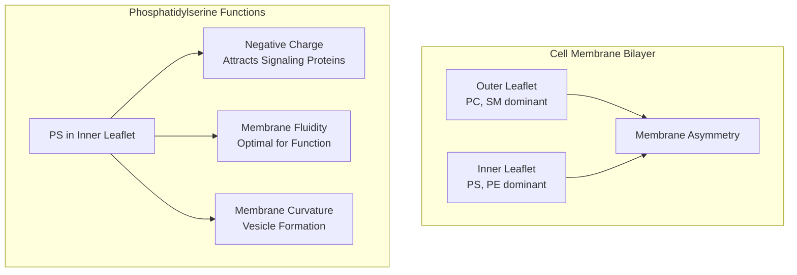

| Membrane Property | PS Contribution | Functional Outcome |
|-------------------|-----------------|-------------------|
| **Asymmetry** | Concentrated in inner leaflet | Proper membrane organization |
| **Negative charge** | Attracts cationic proteins | Cell signaling activation |
| **Fluidity** | Maintains optimal viscosity | Receptor function, transport |
| **Curvature** | Enables vesicle formation | Neurotransmitter release |

### Mechanism 2: Neurotransmitter Release

PS directly facilitates the release of neurotransmitters from synaptic vesicles:

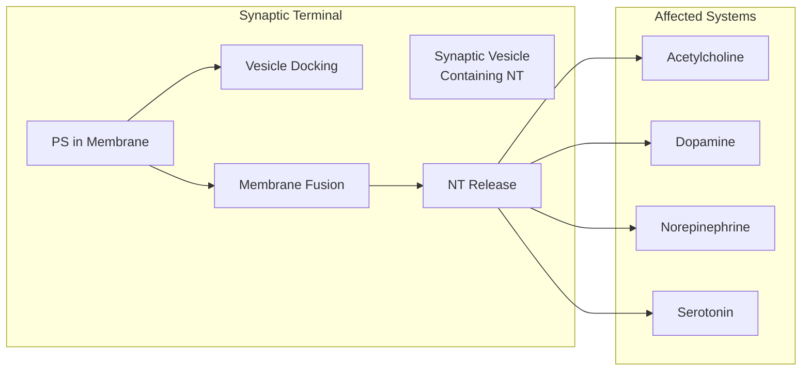

| Neurotransmitter System | PS Contribution | Cognitive Relevance |
|-------------------------|-----------------|---------------------|
| **Acetylcholine** | ↑ Release efficiency | Memory, learning |
| **Dopamine** | ↑ Release, receptor function | Motivation, focus |
| **Norepinephrine** | ↑ Release | Attention, arousal |
| **Serotonin** | ↑ Release | Mood stability |

### Mechanism 3: Cell Signaling (PKC Activation)

PS activates protein kinase C (PKC), a critical signaling enzyme:

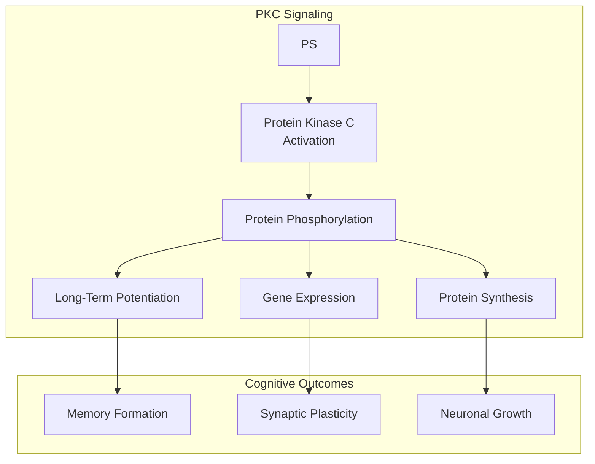

### Mechanism 4: HPA Axis and Cortisol Modulation

PS modulates the stress response by blunting excessive cortisol release:

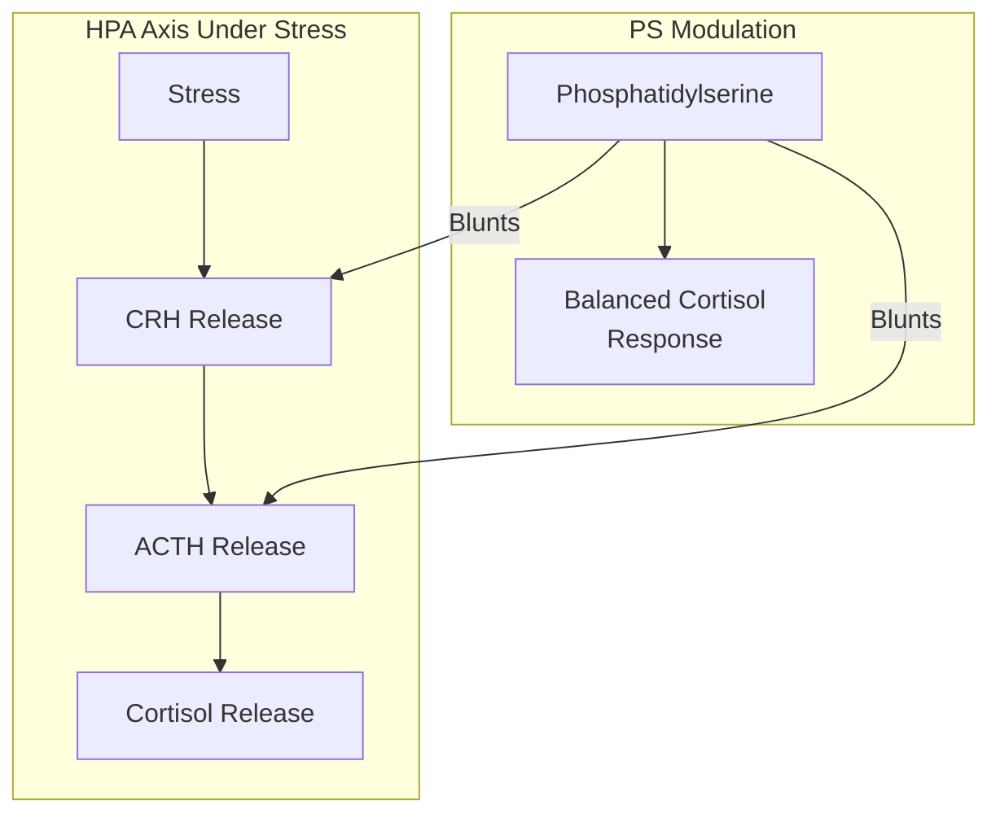

Clinical studies show PS (300-800 mg) significantly blunts stress-induced cortisol and ACTH elevations.

### Mechanism 5: Glucose Metabolism in the Brain

PS supports efficient glucose utilization in neurons:

| Pathway | PS Effect | Outcome |
|---------|-----------|---------|
| **Glucose uptake** | Enhanced | More fuel for neurons |
| **Glucose metabolism** | Optimized | Efficient ATP production |
| **Brain energy** | Sustained | Cognitive endurance |

### Complete Mechanism Summary

| Mechanism | Target | Effect | Timeline |
|-----------|--------|--------|----------|
| **Membrane structure** | Cell membranes | Fluidity, organization | Chronic (weeks) |
| **NT release** | Synaptic terminals | ↑ ACh, DA, NE, 5-HT release | Acute + chronic |
| **PKC activation** | Cell signaling | ↑ LTP, plasticity | Acute + chronic |
| **HPA modulation** | Stress axis | ↓ Excessive cortisol | Acute (within days) |
| **Glucose metabolism** | Brain energy | ↑ Efficiency | Chronic |

</Accordion>

<Accordion title="The Brain's Phospholipid" icon="brain">

### PS Distribution in the Body

Phosphatidylserine is found throughout the body but is especially concentrated in the brain:

| Tissue | PS Content | Significance |
|--------|------------|--------------|
| **Brain** | *~15% of total phospholipids* | Highest concentration |
| **Heart** | Moderate | Membrane function |
| **Liver** | Moderate | Metabolic function |
| **Skeletal muscle** | Moderate | Cell signaling |
| **Lungs** | Moderate | Surfactant function |

### Brain PS Distribution

Within the brain, PS is particularly enriched in:

| Brain Region | PS Enrichment | Function |
|--------------|---------------|----------|
| **Cerebral cortex** | High | Higher cognition, memory |
| **Hippocampus** | High | Memory formation |
| **Synaptic membranes** | *Very high* | Neurotransmission |
| **Myelin** | Moderate | Signal conduction |

### Age-Related PS Decline

Brain PS levels decline with age, correlating with cognitive changes:

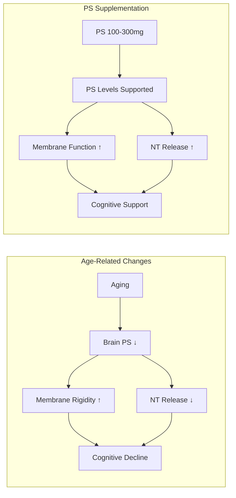

### Dietary PS Decline

Modern diets provide less PS than historical diets:

| Factor | Historical | Modern |
|--------|------------|--------|
| **Organ meat consumption** | High | *Low* |
| **PS intake** | ~200 mg/day | *~100 mg/day* |
| **Brain PS support** | Adequate | Often insufficient |

This dietary shift is one rationale for PS supplementation.

### The Phospholipid Family

PS is one of several important phospholipids:

| Phospholipid | Abbreviation | Primary Location | Key Function |
|--------------|--------------|------------------|--------------|
| **Phosphatidylserine** | PS | Inner leaflet | *Signaling, NT release* |
| Phosphatidylcholine | PC | Outer leaflet | Membrane structure, choline source |
| Phosphatidylethanolamine | PE | Inner leaflet | Membrane fusion |
| Phosphatidylinositol | PI | Inner leaflet | Signal transduction |

PS is unique in carrying a *negative charge* that attracts signaling proteins to the membrane surface.

<Note>
**Why PS Matters:** Unlike other nootropics that modulate neurotransmitter levels or receptor activity, PS works at the *fundamental structural level* — maintaining the membrane environment where all neural signaling occurs. This foundational role explains why PS benefits appear across multiple cognitive domains rather than targeting a single pathway.
</Note>

</Accordion>

<Accordion title="Cognitive Function Research" icon="lightbulb">

### The FDA Qualified Health Claim

Phosphatidylserine is the *only* cognitive ingredient with an FDA-qualified health claim:

> *"Phosphatidylserine may reduce the risk of cognitive dysfunction in the elderly. Very limited and preliminary scientific research suggests that phosphatidylserine may reduce the risk of cognitive dysfunction in the elderly. FDA concludes that there is little scientific evidence supporting this claim."*

While the FDA language is cautious, the existence of *any* qualified health claim for a nootropic ingredient is significant — PS has cleared a regulatory bar that no other cognitive supplement has.

### Clinical Evidence Summary

PS has been studied in 50+ clinical trials:

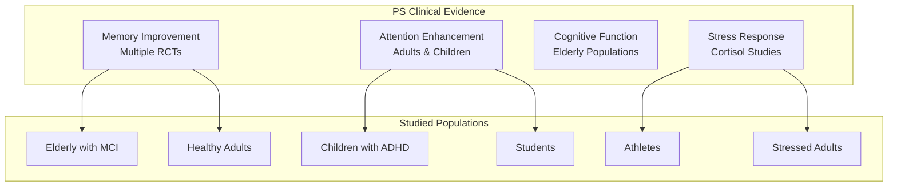

### Key Clinical Trials: Memory and Cognition

| Study | Design | N | Dose | Duration | Finding |
|-------|--------|---|------|----------|---------|
| **Crook 1991** | RCT | 149 | 300 mg | 12 weeks | *↑ Memory, learning (elderly)* |
| **Kato-Kataoka 2010** | RCT | 78 | 100-300 mg | 6 months | *↑ Verbal recall (elderly with MCI)* |
| **Vakhapova 2010** | RCT | 157 | 300 mg PS-DHA | 15 weeks | *↑ Memory (elderly)* |
| **Richter 2013** | RCT | 72 | 300 mg PS-DHA | 15 weeks | *↑ Memory, processing speed* |
| **Gindin 1995** | RCT | 72 | 300 mg | 12 weeks | *↑ Memory, mood (elderly)* |

### Key Clinical Trials: ADHD and Attention

| Study | Design | N | Dose | Duration | Finding |
|-------|--------|---|------|----------|---------|
| **Hirayama 2014** | RCT | 36 | 200 mg | 2 months | *↓ ADHD symptoms, ↑ attention (children)* |
| **Manor 2012** | RCT | 200 | PS-omega-3 | 30 weeks | *↑ Attention (children with ADHD)* |

### Key Clinical Trials: Stress and Cortisol

| Study | Design | N | Dose | Duration | Finding |
|-------|--------|---|------|----------|---------|
| **Monteleone 1992** | RCT | 9 | 800 mg | 10 days | *↓ ACTH, ↓ cortisol (exercise stress)* |
| **Benton 2001** | RCT | 40 | 300 mg | 1 month | *↓ Stress perception (exam stress)* |
| **Starks 2008** | RCT | 10 | 600 mg | 10 days | *↓ Cortisol response to exercise* |
| **Hellhammer 2014** | RCT | 60 | PS-omega-3 | 12 weeks | *↓ Chronic stress symptoms* |

### Cognitive Domains Improved

| Domain | Evidence Level | Typical Improvement |
|--------|----------------|---------------------|
| **Verbal memory** | *Strong* | Word recall, list learning |
| **Working memory** | Moderate-Strong | Short-term retention |
| **Processing speed** | Moderate | Faster cognitive operations |
| **Attention/Focus** | Moderate | Sustained concentration |
| **Executive function** | Moderate | Planning, decision-making |
| **Mood** | Moderate | Especially under stress |

### Effect Timeline

| Duration | Expected Effect |
|----------|-----------------|
| 2-4 weeks | Subtle improvements emerging |
| 6-12 weeks | *Noticeable cognitive benefits* |
| 3-6 months | *Full effects; continued improvement* |
| Long-term | Maintained with continued use |

PS benefits build over time as membrane composition improves — this is not an acute-effect supplement.

</Accordion>

<Accordion title="Cortisol Modulation Deep Dive" icon="shield-halved">

### PS and the Stress Response

One of PS's most clinically-validated effects is its ability to modulate the HPA axis and blunt excessive cortisol release:

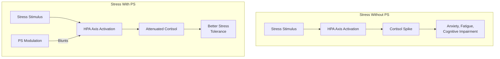

### Clinical Cortisol Evidence

| Study | Stress Type | Dose | Finding |
|-------|-------------|------|---------|
| **Monteleone 1990** | Physical exercise | 800 mg | *↓ Cortisol 30%* |
| **Monteleone 1992** | Physical exercise | 800 mg | *↓ ACTH, ↓ cortisol* |
| **Starks 2008** | Exercise | 600 mg | *↓ Cortisol response* |
| **Benton 2001** | Exam stress | 300 mg | *↓ Perceived stress* |
| **Hellhammer 2014** | Chronic stress | PS-omega-3 | *↓ Stress symptoms* |

### Why Cortisol Modulation Matters

Chronically elevated cortisol has numerous negative effects:

| System | High Cortisol Effect | PS Benefit |
|--------|---------------------|------------|
| **Hippocampus** | Neuronal damage, memory impairment | *Protected by cortisol blunting* |
| **Prefrontal cortex** | Executive function impairment | *Preserved function* |
| **Sleep** | Disrupted architecture | *Better sleep quality* |
| **Mood** | Anxiety, depression risk | *Improved mood stability* |
| **Metabolism** | Increased fat storage | *Metabolic support* |
| **Immune function** | Suppression | *Balanced immunity* |

### The Athletic Application

PS has been studied specifically for exercise-induced cortisol:

| Outcome | Effect | Relevance |
|---------|--------|-----------|
| ↓ Exercise cortisol | 20-30% reduction | *Better recovery* |
| ↓ Muscle breakdown | Via cortisol reduction | *Preserved muscle* |
| ↓ Perceived exertion | Mental component | *Enhanced performance* |
| ↓ Overtraining risk | Stress buffer | *Training resilience* |

### Dose-Response for Cortisol Effects

| Dose | Cortisol Effect | Notes |
|------|-----------------|-------|
| 100-200 mg | Mild modulation | General support |
| 300 mg | Moderate modulation | Standard therapeutic |
| 600 mg | *Significant blunting* | Athletic/stress research |
| 800 mg | *Strong blunting* | Maximum studied |

NTRPX provides 100 mg per product (200 mg combined) — supporting cortisol balance as part of a comprehensive nootropic stack.

<Note>
**Stress Resilience Context:** PS's cortisol-modulating effects complement other NTRPX ingredients: L-Tyrosine preserves catecholamines under stress, Salidroside modulates HPA axis, and now PS blunts excessive cortisol. Together, they create a comprehensive stress-resilience system.
</Note>

</Accordion>

<Accordion title="Sunflower Source Advantage" icon="seedling">

### Why Sunflower Lecithin?

NTRPX sources PS from sunflower lecithin rather than soy for multiple reasons:

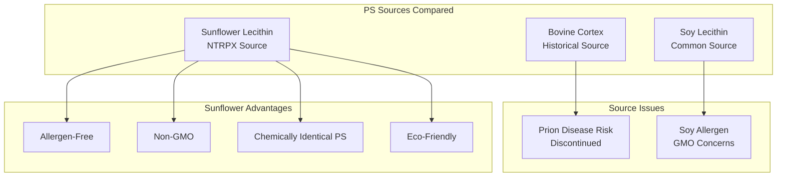

### Source Comparison

| Parameter | Bovine Cortex | Soy Lecithin | Sunflower Lecithin |
|-----------|---------------|--------------|-------------------|
| **PS source** | Brain tissue | Bean processing | Seed processing |
| **Allergen status** | N/A | *Soy allergen* | **Allergen-free** |
| **GMO status** | N/A | Often GMO | **Non-GMO** |
| **Safety concerns** | *Prion disease risk* | Generally safe | **Excellent safety** |
| **Availability** | *Discontinued* | Common | Available |
| **PS structure** | PS-DHA enriched | Standard PS | Standard PS |
| **Clinical research** | Historical studies | Extensive | Growing |
| **NTRPX choice** | No | No | **Yes** |

### Chemical Identity

Sunflower-derived PS is *chemically identical* to soy-derived or bovine-derived PS:

| Property | Soy PS | Sunflower PS |
|----------|--------|--------------|
| Molecular formula | C₄₂H₈₂NO₁₀P | C₄₂H₈₂NO₁₀P |
| Structure | Identical | Identical |
| Biological activity | Active | *Equally active* |
| Clinical applicability | Validated | *Equivalent* |

### Why ≥50% PS?

Sunflower lecithin naturally contains a mixture of phospholipids:

| Phospholipid | Typical Content | Role |
|--------------|-----------------|------|
| **Phosphatidylserine (PS)** | **≥50%** | Primary active |
| Phosphatidylcholine (PC) | ~20-30% | Membrane support, choline |
| Phosphatidylethanolamine (PE) | ~10-15% | Membrane function |
| Other phospholipids | ~5-10% | Various |

The ≥50% PS specification ensures therapeutic levels of the primary active while retaining beneficial co-factors.

### Sustainability

| Factor | Sunflower Advantage |
|--------|---------------------|
| **Source** | European controlled farms |
| **Environmental impact** | Lower than animal sources |
| **Supply stability** | Abundant, renewable |
| **Processing** | Mechanical extraction (no harsh solvents) |

<Note>
**MembraneMax Specification:** NTRPX's sunflower-derived PS (≥50% active) delivers therapeutic phosphatidylserine in an allergen-free, non-GMO, sustainable format. This matches the quality of market-leading Sharp-PS® GREEN while ensuring accessibility for those with soy allergies or GMO concerns.
</Note>

</Accordion>

<Accordion title="Pharmacokinetic Profile" icon="chart-line">

### ADME Parameters

| Parameter | Value | Notes |
|-----------|-------|-------|
| **Bioavailability** | Good (oral) | Phospholipid absorption efficient |
| **Tmax** | ~1-4 hours | Peak plasma levels |
| **Distribution** | Crosses BBB | Reaches brain tissue |
| **Incorporation** | Cell membranes | Becomes part of membrane structure |
| **Half-life** | Long (membrane-bound) | Slow turnover |

### Absorption and Distribution

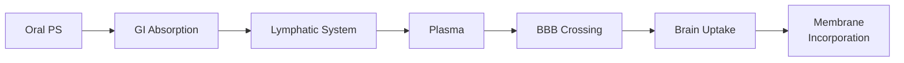

### Unique PK Considerations

PS has *atypical pharmacokinetics* compared to water-soluble compounds:

| Factor | Implication |
|--------|-------------|
| **Lipophilic** | Absorbs with dietary fat |
| **Membrane incorporation** | Becomes part of cell structure |
| **Slow turnover** | Effects build over weeks |
| **Cumulative** | Benefits increase with duration |
| **No acute "peak"** | Not a rapid-onset compound |

### Effect Timeline

| Duration | Expected Change |
|----------|-----------------|
| Single dose | Minimal — PS incorporates slowly |
| 2-4 weeks | Beginning membrane incorporation |
| 6-12 weeks | *Measurable cognitive benefits* |
| 3-6 months | *Optimal effects* |
| Ongoing | Maintained with continued use |

### Optimizing Absorption

| Strategy | Rationale |
|----------|-----------|
| **Take with fat/meal** | ↑ Phospholipid absorption |
| **Consistent daily dosing** | ↑ Membrane accumulation |
| **Long-term use** | ↑ Full benefit realization |

</Accordion>

<Accordion title="Quality Specification" icon="certificate">

### MembraneMax Phosphatidylserine Specification

| Attribute | Specification | Method |
|-----------|---------------|--------|
| **Identity** | Phosphatidylserine from sunflower lecithin | HPLC, TLC |
| **PS Content** | **≥50%** | HPLC |
| **Source** | Non-GMO sunflower (*Helianthus annuus*) | Certificate |
| **Appearance** | Light yellow to brown powder/oil | Visual |
| **Solubility** | Dispersible in water, soluble in organic | Functional |
| **Peroxide value** | ≤5 meq/kg | Titration |
| **Heavy metals (total)** | ≤10 ppm | ICP-MS |
| **Lead** | ≤1 ppm | ICP-MS |
| **Arsenic** | ≤1 ppm | ICP-MS |
| **Microbial (TPC)** | ≤1000 CFU/g | USP &lt;61&gt; |
| **Yeast & Mold** | ≤100 CFU/g | USP &lt;61&gt; |
| **E. coli** | Absent | USP &lt;62&gt; |
| **Salmonella** | Absent | USP &lt;62&gt; |

### Allergen Status

| Allergen | Status |
|----------|--------|
| **Soy** | *Free* |
| **Gluten** | *Free* |
| **Dairy** | *Free* |
| **Egg** | *Free* |
| **Tree nuts** | *Free* |
| **Peanuts** | *Free* |
| **Fish/Shellfish** | *Free* |

### Quality Markers

| Parameter | NTRPX Standard |
|-----------|----------------|
| **PS content** | ≥50% (verified by HPLC) |
| **Oxidation** | Low peroxide value |
| **Purity** | Free of adulterants |
| **Stability** | Protected formulation |
| **GMO status** | Non-GMO |

### Stability Considerations

PS is a phospholipid that can oxidize over time:

| Protection Measure | Purpose |
|--------------------|---------|
| Nitrogen flushing | Prevents oxidation |
| Antioxidant protection | Extends shelf life |
| Cool storage | Slows degradation |
| Airtight packaging | Moisture/oxygen barrier |

</Accordion>

<Accordion title="Dosing Rationale" icon="capsules">

### Evidence-Based Dosing

Clinical research establishes the effective dose range:

| Dose | Application | Evidence |
|------|-------------|----------|
| **100 mg/day** | Maintenance, general support | Multiple studies |
| **200 mg/day** | Enhanced support, ADHD | Hirayama 2014 (children) |
| **300 mg/day** | *Standard therapeutic* | Most clinical trials |
| **600 mg/day** | Athletic cortisol modulation | Starks 2008 |
| **800 mg/day** | Maximum studied | Monteleone studies |

### NTRPX Protocol

| Product | PS Content | Context | Timing |
|---------|------------|---------|--------|
| **Boost** | 100 mg | Daily cognitive foundation | Morning |
| **Sprint** | 100 mg | Acute cognitive support | Pre-demand |
| **Combined** | 200 mg | Enhanced protocol | As needed |

### Rationale for 100 mg Per Product

| Factor | Consideration |
|--------|---------------|
| **Stacking** | PS is part of a comprehensive formula |
| **Synergy** | Combines with CDP-Choline, other phospholipids |
| **Maintenance** | 100 mg supports baseline membrane health |
| **Flexibility** | 200 mg combined for higher needs |
| **Evidence** | 100 mg shown effective in multiple studies |

### Population-Specific Considerations

| Population | Recommended Dose | Notes |
|------------|------------------|-------|
| **Healthy adults** | 100-200 mg | NTRPX standard |
| **Cognitive support (elderly)** | 200-300 mg | May need higher |
| **High stress** | 200-300 mg | Cortisol modulation |
| **Athletes** | 300-600 mg | Recovery support |
| **Children (ADHD)** | 200 mg | Under supervision |

### Timing Considerations

| Timing | Rationale |
|--------|-----------|
| **With meals** | ↑ Absorption (fat-soluble) |
| **Morning** | Cognitive support during day |
| **Consistent daily** | Membrane incorporation |
| **Long-term** | Full benefits require weeks-months |

### Effect Building

Unlike acute nootropics, PS benefits accumulate:

| Timeframe | Expected Progress |
|-----------|-------------------|
| Week 1-2 | Minimal noticeable effect |
| Week 4-6 | Subtle improvements emerging |
| Week 8-12 | *Noticeable cognitive benefits* |
| 3-6 months | *Full therapeutic effect* |

</Accordion>

<Accordion title="Synergy Matrix" icon="link">

### NTRPX System Synergies

PS integrates with the NTRPX stack at the fundamental membrane level:

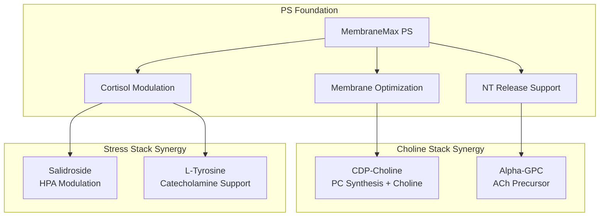

### PS + Choline Sources: The Membrane-Neurotransmitter Axis

PS and choline compounds work synergistically:

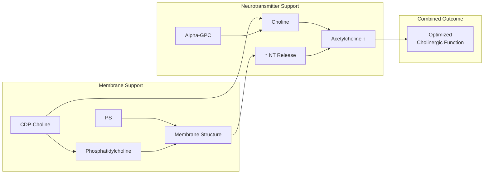

| Compound | Contribution | Synergy with PS |
|----------|--------------|-----------------|
| **CDP-Choline** | Choline + cytidine, PC synthesis | *Dual membrane support* |
| **Alpha-GPC** | Highly bioavailable choline | *NT synthesis + release* |
| **PS** | Membrane structure, NT release | *Foundation for both* |

### PS + Cortisol-Modulating Ingredients

| Compound | Mechanism | Combined with PS |
|----------|-----------|------------------|
| **Salidroside** | HPA axis modulation, MAO inhibition | *Comprehensive stress buffer* |
| **L-Tyrosine** | Catecholamine precursor | *NT support + release* |
| **L-Theanine** | Alpha waves, calm focus | *Relaxed cognition* |

### PS + Creatine

| Creatine Mechanism | PS Mechanism | Combined |
|--------------------|--------------|----------|
| ATP regeneration | Membrane energy function | *Cellular energy optimization* |
| Brain energy buffer | Glucose metabolism support | *Sustained cognitive energy* |

### Synergies with DHA

PS works particularly well with DHA omega-3:

| Factor | Benefit |
|--------|---------|
| **PS-DHA complexes** | Enhanced brain delivery |
| **Membrane optimization** | Both support fluidity |
| **Clinical evidence** | Multiple PS-DHA studies |

### Synergy Rating Summary

| Synergy | Products | Evidence | Rating |
|---------|----------|----------|--------|
| PS + CDP-Choline | Boost | Logical (strong) | ★★★★★ |
| PS + Alpha-GPC | Sprint | Logical | ★★★★☆ |
| PS + Salidroside | Boost/Sprint | Logical | ★★★★☆ |
| PS + L-Tyrosine | Boost/Sprint | Logical | ★★★☆☆ |
| PS + DHA (external) | External | Clinical | ★★★★★ |
| PS + Long-term use | Any | Strong | ★★★★★ |

</Accordion>

<Accordion title="Clinical Evidence" icon="book-open">

### Memory and Cognition Trials

| Study | Design | N | Dose | Duration | Finding |
|-------|--------|---|------|----------|---------|
| **Crook 1991** | RCT | 149 | 300 mg | 12 weeks | *↑ Name/face recall, telephone recall* |
| **Kato-Kataoka 2010** | RCT | 78 | 100-300 mg | 6 months | *↑ Verbal recall, delayed recall* |
| **Richter 2013** | RCT | 72 | 300 mg PS-DHA | 15 weeks | *↑ Immediate recall, processing speed* |
| **Gindin 1995** | RCT | 72 | 300 mg | 12 weeks | *↑ Memory, daily functioning* |
| **Amaducci 1988** | RCT | 142 | 300 mg | 3 months | *↑ Cognition (Alzheimer's)* |

### Attention and ADHD Trials

| Study | Design | N | Dose | Duration | Finding |
|-------|--------|---|------|----------|---------|
| **Hirayama 2014** | RCT | 36 | 200 mg | 2 months | *↓ ADHD symptoms, ↑ short-term memory* |
| **Manor 2012** | RCT | 200 | PS-omega-3 | 30 weeks | *↑ Attention, visual perception* |

### Stress and Cortisol Trials

| Study | Design | N | Dose | Duration | Finding |
|-------|--------|---|------|----------|---------|
| **Monteleone 1990** | Controlled | — | 800 mg | 10 days | *↓ Cortisol response to stress* |
| **Monteleone 1992** | RCT | 9 | 800 mg | 10 days | *↓ ACTH, ↓ cortisol (exercise)* |
| **Benton 2001** | RCT | 40 | 300 mg | 1 month | *↓ Perceived stress (young adults)* |
| **Starks 2008** | RCT | 10 | 600 mg | 10 days | *↓ Cortisol, improved recovery* |

### Effect Size Summary

| Outcome | Effect Size | Evidence Level |
|---------|-------------|----------------|
| Verbal memory | d = 0.3-0.5 | High |
| Name/face recall | d = 0.4-0.6 | Moderate-High |
| Attention (ADHD) | d = 0.3-0.5 | Moderate |
| Cortisol reduction | d = 0.5-0.8 | Moderate |
| Stress perception | d = 0.3-0.5 | Moderate |

### Meta-Analysis Findings

A 2022 meta-analysis of PS clinical trials concluded:

| Finding | Implication |
|---------|-------------|
| Consistent memory benefits | Validated across studies |
| Dose-response evident | Higher doses, larger effects |
| Well-tolerated | Minimal adverse events |
| Elderly benefit most | Target population confirmed |

### References

**Memory/Cognition:**
- Crook TH et al. Effects of phosphatidylserine in age-associated memory impairment. *Neurology.* 1991;41(5):644-9. [PubMed](https://pubmed.ncbi.nlm.nih.gov/2027477/)
- Kato-Kataoka A et al. Soybean-derived phosphatidylserine improves memory function. *J Clin Biochem Nutr.* 2010;47(3):246-55. [PubMed](https://pubmed.ncbi.nlm.nih.gov/21103034/)

**Stress/Cortisol:**
- Monteleone P et al. Blunting by chronic phosphatidylserine administration of the stress-induced activation of the HPA axis. *Eur J Clin Pharmacol.* 1992;42(4):385-8. [PubMed](https://pubmed.ncbi.nlm.nih.gov/1325348/)
- Benton D et al. The influence of phosphatidylserine supplementation on mood and heart rate when faced with an acute stressor. *Nutr Neurosci.* 2001;4(3):169-78. [PubMed](https://pubmed.ncbi.nlm.nih.gov/11842880/)

**ADHD:**
- Hirayama S et al. The effect of phosphatidylserine administration on memory and symptoms of ADHD. *J Hum Nutr Diet.* 2014;27(Suppl 2):284-91. [PubMed](https://pubmed.ncbi.nlm.nih.gov/23495677/)

</Accordion>

<Accordion title="Safety & Classification" icon="shield-check">

### Adverse Event Profile

| Event | Incidence | Severity | Notes |
|-------|-----------|----------|-------|
| **GI discomfort** | Uncommon | Mild | Usually transient |
| **Insomnia** | Rare | Mild | If taken late |
| **Nausea** | Rare | Mild | Take with food |

### Safety Data

| Parameter | Finding |
|-----------|---------|
| **Clinical trial safety** | Excellent across 50+ studies |
| **GRAS status** | Generally Recognized as Safe |
| **Long-term safety** | Well-tolerated in studies up to 6 months |
| **FDA health claim** | Qualified health claim granted |
| **Elderly safety** | Primary studied population; excellent |

### Regulatory Status

| Region | Status | Notes |
|--------|--------|-------|
| **United States** | GRAS; dietary supplement | FDA qualified health claim |
| **European Union** | Novel food approved | Various member states |
| **Japan** | FOSHU eligible | Functional food |
| **Australia** | Listed medicine | TGA approved |

### Contraindications

| Category | Consideration | Severity |
|----------|---------------|----------|
| **Blood thinners** | Theoretical interaction | ★★☆☆☆ Monitor |
| **Surgery** | May affect clotting | ★★☆☆☆ Discontinue 2 weeks prior |
| **Pregnancy** | Insufficient data | ★★☆☆☆ Consult provider |

### Drug Interactions

| Drug Class | Interaction | Severity | Notes |
|------------|-------------|----------|-------|
| **Anticoagulants** | Theoretical potentiation | ★★☆☆☆ | Monitor INR |
| **Anticholinergics** | Opposing mechanisms | ★★☆☆☆ | May reduce PS benefit |
| **Cholinesterase inhibitors** | Theoretical synergy | ★☆☆☆☆ | May enhance effect |

### Special Populations

| Population | Safety Status | Notes |
|------------|---------------|-------|
| **Healthy adults** | Excellent | Primary use |
| **Elderly** | Excellent | Most studied population |
| **Children (ADHD)** | Good | Under supervision; 200mg studied |
| **Athletes** | Excellent | Cortisol modulation research |
| **Pregnancy** | Caution | Insufficient data |

---

### <Icon icon="star" color="#5A8FA8" /> Tier 1: Foundation

<CardGroup cols={3}>
<Card title="Efficacy" icon="check" color="#5A8FA8">Moderate-High</Card>
<Card title="Validation" icon="check" color="#5A8FA8">Strong — 50+ clinical trials; FDA qualified health claim</Card>
<Card title="Safety" icon="check" color="#5A8FA8">Excellent — GRAS; well-tolerated long-term</Card>
</CardGroup>

**Tier Rationale:** Tier 1 (Foundation) classification. Phosphatidylserine is one of the most extensively researched nootropic ingredients, with 50+ clinical trials demonstrating benefits for memory, attention, and stress response. It holds the *only FDA-qualified health claim* for cognitive decline risk reduction among nootropic supplements. Mechanisms are well-understood (membrane structure, NT release, PKC activation, cortisol modulation). Sunflower-sourced PS (≥50%) provides an allergen-free, non-GMO format chemically identical to traditional sources. Safety is excellent with GRAS status and good tolerability across all studied populations. A true foundational compound for cognitive health.

</Accordion>

<Accordion title="Practical Considerations" icon="clipboard-list">

### When to Use Phosphatidylserine

| Scenario | Expected Benefit | Recommended Protocol |
|----------|------------------|---------------------|
| Daily cognitive support | *High* | 100 mg with Boost daily |
| Memory enhancement | *High* | 100-200 mg daily |
| Stress/cortisol management | Moderate-High | 200-300 mg daily |
| Athletic recovery | Moderate | 300-600 mg daily |
| Exam/study periods | Moderate | 100-200 mg daily |

### Realistic Expectations

| Timeframe | What to Expect |
|-----------|----------------|
| **Week 1-2** | Minimal — PS incorporates slowly |
| **Week 4-6** | Subtle improvements may emerge |
| **Week 8-12** | *Noticeable memory, focus benefits* |
| **3-6 months** | *Full therapeutic effect* |
| **Long-term** | Maintained with continued use |

**Key understanding:** PS is a *building compound*, not an acute booster. Benefits come from membrane incorporation over time, not immediate receptor effects.

### Signs It's Working

| Indicator | Description |
|-----------|-------------|
| Better recall | Names, numbers, facts come easier |
| Improved focus | Sustained attention |
| Calmer stress response | Less reactive to daily stressors |
| Mental clarity | Less "fog," clearer thinking |
| Word retrieval | Easier access to vocabulary |

### Optimizing Response

| Strategy | Rationale |
|----------|-----------|
| Take with food | ↑ Phospholipid absorption |
| Consistent daily use | Membrane incorporation takes weeks |
| Combine with DHA | Synergistic membrane effects |
| Long-term commitment | Full benefits at 3-6 months |
| Stack with cholinergics | CDP-Choline, Alpha-GPC synergy |

### Frequently Asked Questions

<AccordionGroup>

<Accordion title="Why don't I feel anything immediately?">
PS doesn't work like stimulants or acute nootropics. It becomes part of your cell membranes over weeks to months, gradually improving neuronal function. Think of it like improving the hardware, not running a software boost. Most people notice benefits after 6-12 weeks of consistent use.
</Accordion>

<Accordion title="Why sunflower instead of soy?">
Sunflower-derived PS is *chemically identical* to soy PS, but offers advantages: it's soy-free (important for allergies), non-GMO, and sustainably sourced from European sunflowers. Clinical effects are equivalent — it's about accessibility and quality, not efficacy differences.
</Accordion>

<Accordion title="Should I take higher doses for better effects?">
Research shows dose-response benefits up to 300 mg/day for most purposes, with higher doses (600-800 mg) used specifically for cortisol modulation in athletes. The 100-200 mg in NTRPX products is effective for general cognitive support, especially combined with other synergistic ingredients.
</Accordion>

<Accordion title="Can PS help with stress and anxiety?">
PS modulates cortisol response, which can improve stress resilience. Studies show reduced perceived stress and blunted cortisol spikes. While not a primary anxiolytic, PS contributes to a calmer, more resilient stress response over time.
</Accordion>

<Accordion title="Is PS safe long-term?">
Yes. PS has GRAS (Generally Recognized as Safe) status, has been studied in trials up to 6 months, and has a long history of safe use. As a natural component of cell membranes, it's well-tolerated. The main caution is for those on blood thinners.
</Accordion>

<Accordion title="How does PS differ from other nootropics?">
Most nootropics target neurotransmitter systems (cholinergics, dopaminergics) or receptor activity. PS works at the *structural level* — optimizing the membranes where all signaling occurs. This foundational approach explains why PS benefits appear across multiple cognitive domains rather than targeting a single pathway.
</Accordion>

<Accordion title="Can I take PS with my other supplements?">
PS combines well with most supplements. It's particularly synergistic with DHA omega-3, choline sources (CDP-Choline, Alpha-GPC), and other nootropics. The only notable caution is with blood thinners — consult your healthcare provider if applicable.
</Accordion>

</AccordionGroup>

</Accordion>

</AccordionGroup>

---

<Tip>
**MembraneMax Summary:** Phosphatidylserine (≥50% from sunflower lecithin, 100mg in Boost and Sprint) is a phospholipid that supports cognitive function at the *foundational membrane level*. With 50+ clinical trials and the only FDA-qualified health claim for cognitive decline risk reduction, PS is one of the most validated nootropic ingredients available. Benefits include improved memory, better attention, and blunted cortisol response — all developing over weeks to months of consistent use. Sourced from non-GMO European sunflowers, MembraneMax PS delivers allergen-free, soy-free membrane support as part of the comprehensive NTRPX cognitive stack.
</Tip>