## MitoSpark PQQ

<CardGroup cols={4}>

<Card title="Sprint™" icon="bolt" color="#5A8FA8">
20 mg PQQ
</Card>

<Card title="Boost" icon="rocket-launch" color="#5A8FA8">
10 mg PQQ
</Card>

<Card title="Form" icon="atom" color="#5A8FA8">
PQQ Disodium Salt
</Card>

<Card title="Source" icon="flask-vial" color="#5A8FA8">
Natural Fermentation
</Card>

</CardGroup>

**The molecule that makes new mitochondria — the only known nutrient to activate mitochondrial biogenesis through the PGC-1α pathway.** Pyrroloquinoline quinone (PQQ) was discovered as the third bacterial redox cofactor after NAD and FAD, but its true significance for human health lies in a remarkable property: PQQ directly stimulates the *creation of new mitochondria* via CREB phosphorylation and PGC-1α activation. This makes PQQ unique among nutritional compounds — it doesn't just support existing mitochondria, it triggers the birth of new ones. Combined with extraordinary antioxidant potency (5,000× more redox cycles than vitamin C) and the ability to stimulate nerve growth factor (NGF) production, PQQ emerges as a foundational ingredient for cognitive performance, cellular energy, and healthy aging. NTRPX uses BioPQQ®-grade PQQ disodium salt — the original, most-researched form manufactured by Mitsubishi Gas Chemical through proprietary fermentation — at the clinically-validated 20mg dose. In NTRPX Sprint and Boost, MitoSpark PQQ delivers *the power to build new cellular powerhouses*.

<AccordionGroup>

<Accordion title="Mechanism of Action" icon="flask">

PQQ (4,5-dihydro-4,5-dioxo-1H-pyrrolo[2,3-f]quinoline-2,7,9-tricarboxylic acid) operates through four distinct mechanisms:

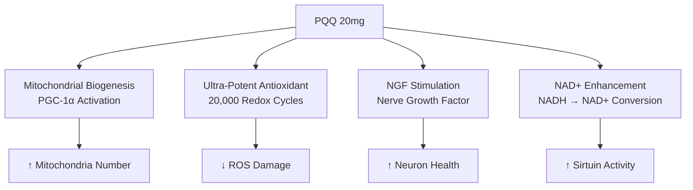

### Mechanism 1: Mitochondrial Biogenesis (Primary Mechanism)

PQQ's most significant action is stimulating the *creation of new mitochondria* — a process called mitochondrial biogenesis:

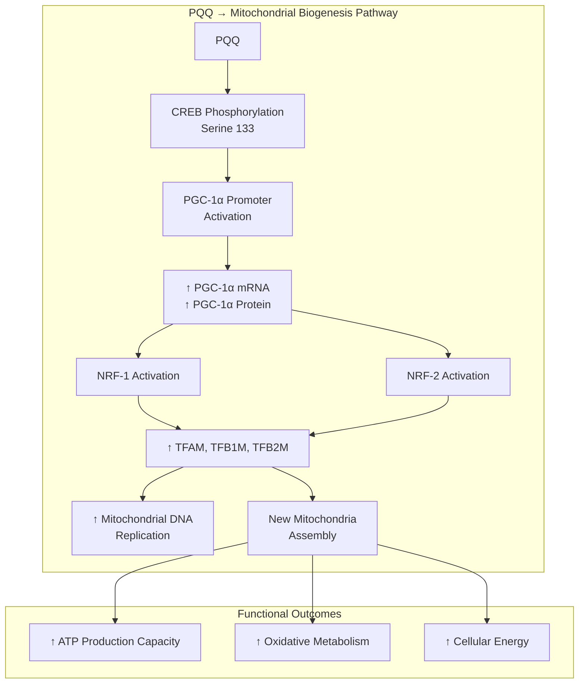

| Signaling Step | Target | Effect | Evidence |
|----------------|--------|--------|----------|
| **CREB phosphorylation** | Serine 133 | Transcription factor activation | Chowanadisai 2010 |
| **PGC-1α induction** | Promoter + expression | Master regulator of biogenesis | Chowanadisai 2010 |
| **NRF-1/NRF-2 activation** | Nuclear respiratory factors | Mitochondrial gene transcription | UC Davis |
| **TFAM upregulation** | Transcription factor A | mtDNA replication/transcription | Multiple |

**Key Finding (Chowanadisai et al., 2010):** PQQ exposure (10-30 μM) increased citrate synthase activity, cytochrome c oxidase activity, Mitotracker staining, mitochondrial DNA content, and cellular oxygen respiration. siRNA knockdown of PGC-1α or CREB abolished these effects, confirming the pathway.

### Mechanism 2: Ultra-Potent Antioxidant

PQQ is one of the most efficient redox-cycling antioxidants known:

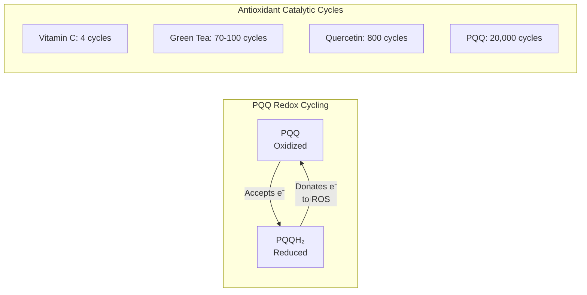

| Antioxidant | Catalytic Cycles | Relative Potency |
|-------------|------------------|------------------|
| Vitamin C | ~4 | 1× |
| Green tea extract | 70-100 | ~20× |
| Quercetin | ~800 | ~200× |
| **PQQ** | **~20,000** | ***5,000×*** |

**Why 5,000× more potent:** PQQ can undergo ~20,000 oxidation-reduction cycles before degradation, compared to ~4 for vitamin C. This makes PQQ extraordinarily efficient at neutralizing reactive oxygen species.

### Mechanism 3: Nerve Growth Factor (NGF) Stimulation

PQQ enhances NGF production, supporting neuronal health:

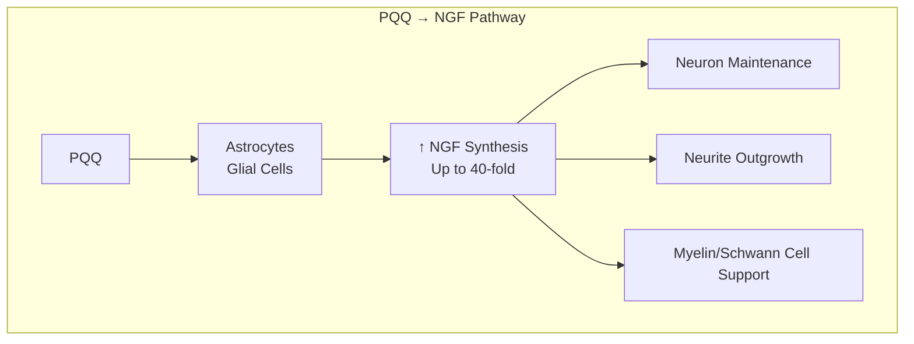

| NGF Function | PQQ Effect | Relevance |
|--------------|------------|-----------|
| **Neuron survival** | Supports | Neuroprotection |
| **Neurite outgrowth** | Promotes | Neural connectivity |
| **Schwann cell growth** | Supports | Myelin integrity |
| **Neuroplasticity** | Enhances | Learning, memory |

### Mechanism 4: NAD+ Metabolism Enhancement

PQQ serves as a cofactor for lactate dehydrogenase, enhancing NAD+ availability:

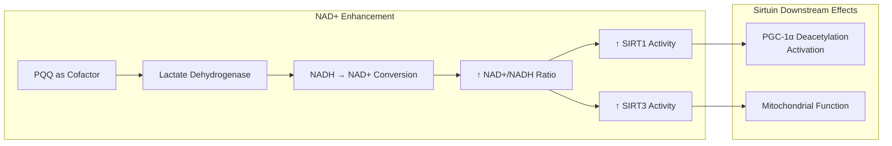

| NAD+ Effect | Downstream Target | Functional Outcome |
|-------------|-------------------|-------------------|
| **↑ NAD+/NADH ratio** | Sirtuins | Longevity pathway activation |
| **SIRT1 activation** | PGC-1α | Enhanced mitochondrial biogenesis |
| **SIRT3 activation** | Mitochondrial enzymes | Improved oxidative metabolism |

### Molecular Identity

| Property | Value |
|----------|-------|
| IUPAC Name | 4,5-Dihydro-4,5-dioxo-1H-pyrrolo[2,3-f]quinoline-2,7,9-tricarboxylic acid, disodium salt |
| Synonyms | Methoxatin, PQQ disodium salt, BioPQQ® |
| Molecular Formula (acid) | C₁₄H₆N₂O₈ |
| Molecular Formula (disodium) | C₁₄H₄N₂Na₂O₈ |
| Molecular Weight (disodium) | 374.17 g/mol (anhydrous) |
| CAS Number | 122628-50-6 (disodium) |
| Appearance | Red-orange crystalline powder |
| Solubility | Water soluble |
| NTRPX Grade | BioPQQ®-equivalent (≥99%) |

### Complete Mechanism Summary

| Mechanism | Target | Effect | Timeline |
|-----------|--------|--------|----------|
| **Mitochondrial biogenesis** | PGC-1α pathway | ↑ New mitochondria | Chronic (weeks) |
| **Antioxidant** | ROS | ↓ Oxidative damage | Acute + chronic |
| **NGF stimulation** | Astrocytes | ↑ Neuron support | Chronic (weeks) |
| **NAD+ enhancement** | Sirtuins | ↑ Metabolic efficiency | Acute + chronic |

</Accordion>

<Accordion title="Why BioPQQ®-Grade PQQ" icon="gem">

### The Market-Leading Standard

BioPQQ® by Mitsubishi Gas Chemical (MGC) is the original, most-researched PQQ ingredient:

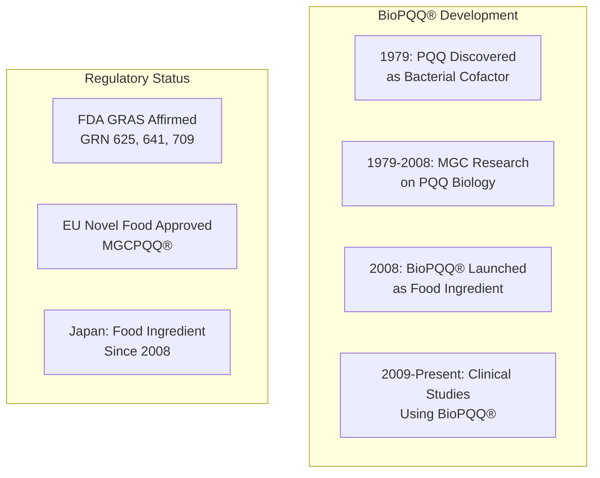

| BioPQQ® Attribute | Significance |
|-------------------|--------------|
| **Original developer** | Mitsubishi Gas Chemical (pioneer since 1984) |
| **Manufacturing** | Proprietary fermentation process |
| **Purity** | ≥99% (food grade) |
| **Research** | Used in all major clinical studies |
| **Brand names** | BioPQQ® (USA, Japan), MGCPQQ® (EU) |

### The Manufacturing Difference

PQQ is produced through bacterial fermentation, but quality varies:

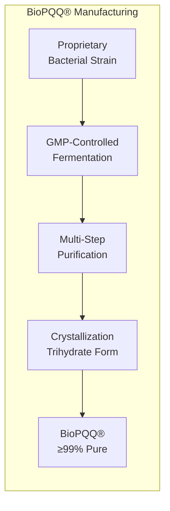

| Parameter | BioPQQ®-Grade | Generic PQQ |
|-----------|---------------|-------------|
| **Purity** | ≥99% | Variable (95-99%) |
| **Consistency** | Batch-to-batch controlled | Variable |
| **Research validation** | Extensive clinical data | Limited |
| **Heavy metals** | Tightly controlled | Variable |
| **Form** | Disodium trihydrate crystal | Variable |

### Regulatory Confidence

BioPQQ® has the most comprehensive regulatory acceptance:

| Regulatory Body | Status | Reference |
|-----------------|--------|-----------|
| **FDA (USA)** | GRAS - No questions | GRN 625, 641, 709 |
| **EFSA (EU)** | Novel Food approved | 2017 Opinion |
| **Japan** | Food ingredient | Since 2008 |
| **Health Canada** | NPN eligible | Licensed products |

### Clinical Studies Use BioPQQ®

All major PQQ human studies have used BioPQQ®:

| Study | Form Used | Finding |
|-------|-----------|---------|
| Nakano 2012 | BioPQQ® 20mg | ↑ Sleep, ↓ fatigue |
| Itoh 2016 | BioPQQ® 20mg | ↑ Cognitive function |
| Shiojima 2021 | BioPQQ® 20mg | ↑ Memory (young + old) |
| Hwang 2019 | BioPQQ® 20mg | ↑ Mitochondrial biogenesis markers |

### The "Potential 14th Vitamin"

In 2003, RIKEN researchers reported evidence suggesting PQQ may be the 14th vitamin for mammals. While this classification remains debated, it underscores PQQ's fundamental importance:

| Vitamin-Like Property | Evidence |
|----------------------|----------|
| **Essential for growth** | PQQ-deficient diets impair reproduction in rodents |
| **Not synthesized** | Humans cannot synthesize PQQ |
| **Present in diet** | Found in breast milk, vegetables, fermented foods |
| **Cofactor function** | Works with dehydrogenase enzymes |

<Note>
**The NTRPX Standard:** We specify BioPQQ®-grade PQQ because all human clinical research — cognitive function, sleep, energy, mitochondrial biogenesis — used this form. Using BioPQQ®-grade ensures you receive the *exact same material* validated in published studies.
</Note>

</Accordion>

<Accordion title="Mitochondrial Biogenesis Deep Dive" icon="atom">

### Why New Mitochondria Matter

Mitochondrial biogenesis — the creation of new mitochondria — is fundamental to health:

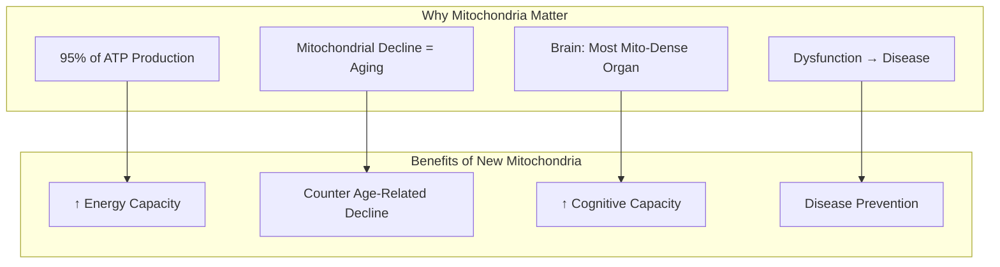

| Organ | Mitochondrial Density | Biogenesis Relevance |
|-------|----------------------|---------------------|
| **Heart** | Very high | Cardiac function |
| **Brain** | Very high | Cognitive function |
| **Skeletal muscle** | High | Physical performance |
| **Liver** | High | Metabolic function |
| **Kidneys** | High | Filtration capacity |

### The PGC-1α Master Switch

PGC-1α (peroxisome proliferator-activated receptor gamma coactivator 1-alpha) is the master regulator of mitochondrial biogenesis:

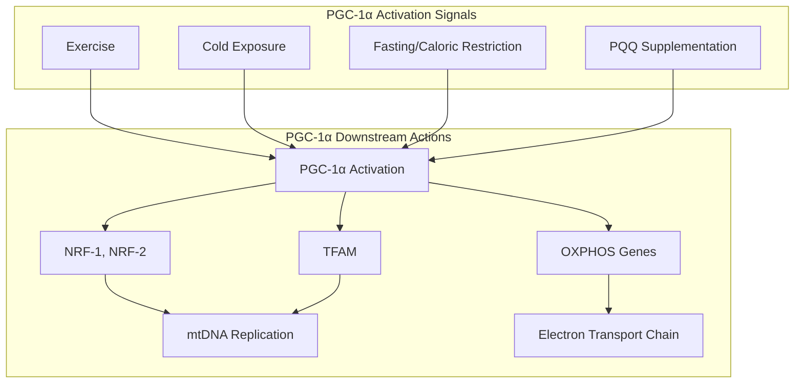

**PQQ's Unique Action:** Unlike exercise or fasting (which require significant effort/restriction), PQQ activates PGC-1α through *direct CREB phosphorylation* — a biochemical shortcut to the same master switch.

### The Chowanadisai Landmark Study (2010)

This UC Davis study established PQQ's mechanism of mitochondrial biogenesis:

| Parameter | Control | PQQ (30 μM) | Change |
|-----------|---------|-------------|--------|
| **Citrate synthase activity** | 1.0 | 1.6 | *+60%* |
| **Cytochrome c oxidase activity** | 1.0 | 1.4 | *+40%* |
| **Mitotracker staining** | 1.0 | 1.5 | *+50%* |
| **Mitochondrial DNA content** | 1.0 | 1.4 | *+40%* |
| **Oxygen respiration** | 1.0 | 1.3 | *+30%* |

**siRNA Confirmation:**
- Knockdown of CREB → *abolished* PQQ effect
- Knockdown of PGC-1α → *abolished* PQQ effect

This confirms PQQ works specifically through the CREB → PGC-1α pathway.

### Human Evidence for Mitochondrial Effects

| Study | Design | Dose | Marker | Finding |
|-------|--------|------|--------|---------|
| **Hwang 2019** | RCT, 6 weeks | 20mg | PGC-1α protein | *↑ in exercising subjects* |
| **Harris 2013** | RCT, 4 weeks | 20mg | Metabolic markers | *↓ CRP, ↓ Inflammation* |

### PQQ vs Other "Mitochondrial Supplements"

| Supplement | Primary Action | Creates New Mito? | Evidence Level |
|------------|----------------|-------------------|----------------|
| **CoQ10** | Electron carrier | No — supports existing | High |
| **B vitamins** | Cofactors | No — supports existing | High |
| **L-Carnitine** | Fatty acid transport | No — supports existing | Moderate |
| **Alpha-lipoic acid** | Antioxidant | No — supports existing | Moderate |
| **PQQ** | *PGC-1α activation* | ***Yes*** | High |

### Mitochondrial Decline with Age

| Age | Mitochondrial Changes | PQQ Relevance |
|-----|----------------------|---------------|
| 20-30 | Peak function | Optimization |
| 40-50 | ~30% reduction in biogenesis | Prevention |
| 60+ | Significant dysfunction | Compensation |

<Note>
**The Unique Value Proposition:** PQQ is the *only* nutritional compound with demonstrated ability to stimulate the creation of new mitochondria through the PGC-1α pathway. This isn't just supporting existing mitochondria — it's building new cellular powerhouses.
</Note>

</Accordion>

<Accordion title="Cognitive Function Research" icon="brain">

### Clinical Evidence Summary

PQQ demonstrates consistent benefits for cognitive function in human trials:

```mermaid
flowchart TB
    subgraph COGNITIVE_BENEFITS["Demonstrated Cognitive Benefits"]
        MEMORY[Memory Function]
        ATTENTION[Attention & Focus]
        PROCESSING[Processing Speed]
        FLEXIBILITY[Cognitive Flexibility]
    end
    
    subgraph POPULATIONS["Effective Populations"]
        MEMORY --> ELDERLY[Elderly (40-65+)]
        ATTENTION --> YOUNG[Young Adults (20-40)]
        PROCESSING --> YOUNG
        FLEXIBILITY --> YOUNG
    end
```

### Key Human Clinical Trials (All Used BioPQQ® 20mg)

| Study | Design | N | Age | Duration | Key Findings |
|-------|--------|---|-----|----------|--------------|
| **Itoh 2016** | RCT, DB, PC | 41 | 50-70 | 12 weeks | *↑ Attention (Stroop test)* |
| **Shiojima 2021** | RCT, DB, PC | 60 | 20-65 | 8-12 weeks | *↑ Memory, processing speed* |
| **Nakano 2016** | RCT | 17 | Adults | 8 weeks | *↑ Cerebral blood flow* |

### Itoh 2016 — Elderly Cognitive Function

| Outcome | Placebo | BioPQQ® 20mg | Result |
|---------|---------|--------------|--------|
| **Stroop test (attention)** | No change | Improved | *p < 0.05* |
| **Reverse Stroop** | No change | Improved | *p < 0.05* |
| **Touch M (visuospatial)** | No change | Improved | *p < 0.05* |

### Shiojima 2021 — Younger AND Older Adults

| Population | Age | Duration | Improvements |
|------------|-----|----------|--------------|
| **Younger** (20-40) | 8 weeks | *Cognitive flexibility, processing speed, execution speed* |
| **Older** (41-65) | 12 weeks | *Complex memory, verbal memory* |

**Notable:** This is one of few nootropics showing benefits in *both* young and older populations.

### Cerebral Blood Flow Enhancement

Nakano et al. (2016) demonstrated PQQ increases prefrontal cortex activity:

| Measure | Change | Significance |
|---------|--------|--------------|
| **rCBF (regional cerebral blood flow)** | ↑ | Right prefrontal cortex |
| **Oxygen metabolism** | ↑ | Increased neural activity |

### Mechanism of Cognitive Benefits

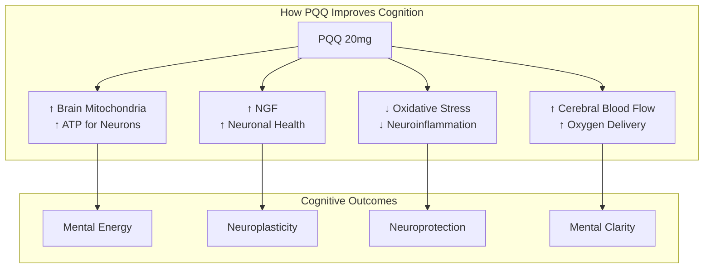

### Effect Sizes

| Cognitive Domain | Effect Size | Evidence Level |
|------------------|-------------|----------------|
| **Attention** | d = 0.4-0.6 | High (RCT) |
| **Memory** | d = 0.3-0.5 | Moderate-High |
| **Processing speed** | d = 0.3-0.5 | Moderate |
| **Executive function** | d = 0.3-0.4 | Moderate |

### Timeline to Cognitive Benefits

| Timeframe | Effect | Notes |
|-----------|--------|-------|
| **4 weeks** | Initial changes | Metabolic markers improve |
| **8 weeks** | *Measurable improvement* | Young adults show effects |
| **12 weeks** | *Full effect* | Older adults show effects |

### PQQ + CoQ10 Combination

| Study (Koikeda 2011) | Finding |
|---------------------|---------|
| PQQ 20mg + CoQ10 300mg | *↑ Word recall vs placebo* |
| PQQ alone | Effective |
| CoQ10 alone | Effective |
| **Combination** | ***Potentially synergistic*** |

<Note>
**Age-Spanning Benefits:** PQQ is unusual in showing cognitive benefits for both younger (20-40) and older (40-65+) adults. Younger users see improvements in flexibility and processing speed; older users see improvements in memory. This suggests PQQ works through fundamental mechanisms relevant at any age.
</Note>

</Accordion>

<Accordion title="NGF & Neuroprotection" icon="shield-halved">

### Nerve Growth Factor Stimulation

PQQ is a potent enhancer of nerve growth factor (NGF) production:

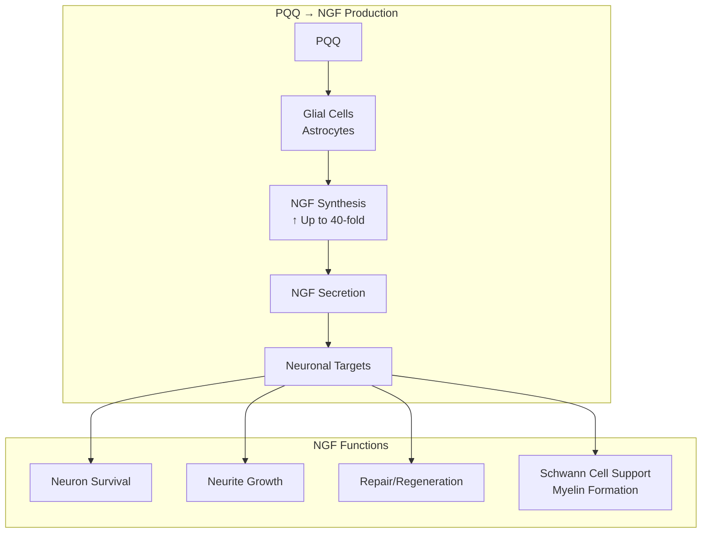

### Research Evidence for NGF Effects

| Study | Model | Finding |
|-------|-------|---------|
| **Yamaguchi 1993** | In vitro (astrocytes) | *40-fold increase in NGF* |
| **Murase 1993** | Mouse astrocytes | *Stimulation of NGF synthesis/secretion* |
| **Urakami 1995** | PQQ esters | *Potential for neural therapies* |

### Neuroprotective Mechanisms

PQQ provides multi-pathway neuroprotection:

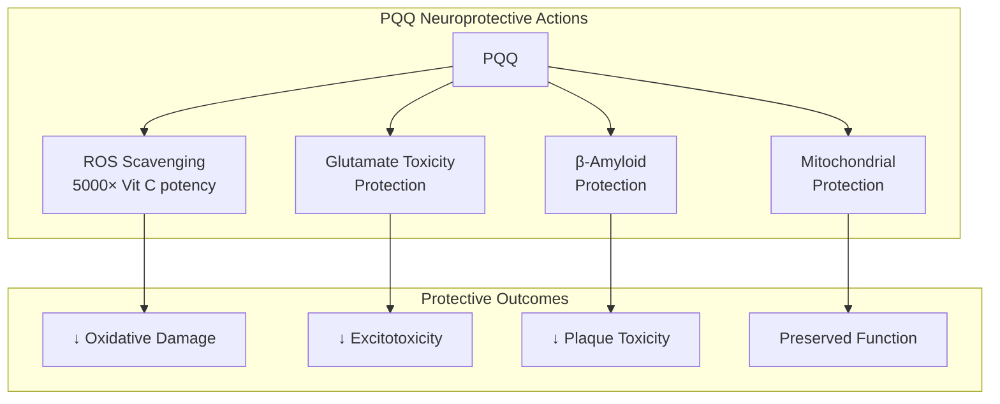

### Protection Against Specific Insults

| Neurotoxin/Stressor | PQQ Effect | Mechanism |
|---------------------|------------|-----------|
| **Rotenone** (pesticide) | Protected | Mitochondrial preservation |
| **6-OHDA** (dopaminergic toxin) | Protected | Antioxidant |
| **β-Amyloid** | Protected | Plaque interaction inhibition |
| **Hypoxia** | Protected | HIF pathway support |
| **Glutamate excess** | Protected | NMDA modulation |

### Research on Neurodegenerative Models

| Model | Finding | Reference |
|-------|---------|-----------|
| **Parkinson's model** (6-OHDA) | Protected dopaminergic neurons | Hara 2007 |
| **Stroke model** (ischemia) | ↓ Infarct size | Preclinical |
| **Aging model** | Preserved cognitive function | Multiple |

### Comparison to Other Neuroprotectants

| Compound | ROS Scavenging | NGF Stimulation | Mito Biogenesis | Overall |
|----------|----------------|-----------------|-----------------|---------|
| Vitamin E | Moderate | None | None | Single mechanism |
| Curcumin | Moderate | Minimal | None | Single mechanism |
| CoQ10 | Good | None | None | Single mechanism |
| **PQQ** | *Excellent* | ***Yes*** | ***Yes*** | ***Multi-mechanism*** |

<Note>
**Triple Neuroprotection:** PQQ is unique in providing neuroprotection through three mechanisms: (1) direct antioxidant activity, (2) NGF stimulation for neuronal support, and (3) mitochondrial biogenesis for energy supply. This multi-pathway approach makes PQQ one of the most comprehensive neuroprotective nutrients available.
</Note>

</Accordion>

<Accordion title="Pharmacokinetic Profile" icon="chart-line">

### ADME Parameters

| Parameter | Value | Notes |
|-----------|-------|-------|
| **Bioavailability** | ~62% (oral) | Good absorption |
| **Tmax** | 2-3 hours | Peak plasma levels |
| **Half-life** | 3-5 hours | Moderate duration |
| **Distribution** | Widely distributed | Crosses BBB |
| **Metabolism** | Limited hepatic | Primarily unchanged |
| **Excretion** | Renal | Unchanged in urine |

### Plasma Kinetics

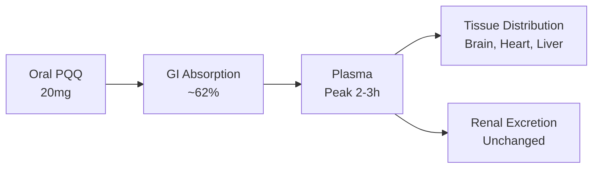

### Tissue Distribution

| Tissue | Distribution | Functional Relevance |
|--------|--------------|---------------------|
| **Brain** | Yes (crosses BBB) | Cognitive effects |
| **Heart** | High | Cardiac energy |
| **Liver** | High | Metabolic effects |
| **Skeletal muscle** | Moderate | Performance |
| **Kidneys** | High | Filtration |

### Dosing Timeline

| Time After Dose | Plasma Level | Cellular Effect |
|-----------------|--------------|-----------------|
| 0-1 h | Rising | Minimal |
| 2-3 h | *Peak* | Antioxidant active |
| 4-8 h | Declining | Effects continue |
| Chronic (weeks) | Steady state | *Biogenesis effects* |

### Food Interaction

| Condition | Absorption | Recommendation |
|-----------|------------|----------------|
| With food | Slightly enhanced | *Recommended* |
| Empty stomach | Good | Acceptable |
| With fat | Enhanced | Optimal |

### Steady State Considerations

| Parameter | Acute | Chronic (4+ weeks) |
|-----------|-------|--------------------|
| **Antioxidant effects** | Immediate | Sustained |
| **Mitochondrial effects** | Minimal | *Primary benefit* |
| **NGF effects** | Minimal | *Builds over time* |

<Note>
**Chronic Dosing is Key:** While PQQ's antioxidant effects are acute, the primary benefits (mitochondrial biogenesis, NGF stimulation) require weeks of consistent dosing. Clinical trials showing cognitive and energy benefits used 8-12 weeks of supplementation.
</Note>

</Accordion>

<Accordion title="Quality Specification" icon="certificate">

### MitoSpark PQQ Specification (BioPQQ®-Grade)

| Attribute | Specification | Method |
|-----------|---------------|--------|
| **Identity** | PQQ Disodium Salt | HPLC, FTIR |
| **Assay** | **≥99.0%** | HPLC |
| **Appearance** | Red-orange crystalline powder | Visual |
| **Water content** | 10-15% (trihydrate) | Karl Fischer |
| **pH (1% solution)** | 8.0-10.0 | Potentiometric |
| **Heavy metals (total)** | ≤10 ppm | ICP-MS |
| **Lead** | ≤1 ppm | ICP-MS |
| **Arsenic** | ≤1 ppm | ICP-MS |
| **Mercury** | ≤0.1 ppm | ICP-MS |
| **Cadmium** | ≤0.5 ppm | ICP-MS |
| **Microbial (TPC)** | ≤1000 CFU/g | USP &lt;61&gt; |
| **Yeast & Mold** | ≤100 CFU/g | USP &lt;61&gt; |
| **E. coli** | Absent | USP &lt;62&gt; |
| **Salmonella** | Absent | USP &lt;62&gt; |

### Molecular Specifications

| Property | Value |
|----------|-------|
| Molecular Formula | C₁₄H₄N₂Na₂O₈ • 3H₂O |
| Molecular Weight | 428.22 g/mol (trihydrate) |
| CAS Number | 122628-50-6 |
| Crystal Form | Trihydrate |
| Color | Red-orange (characteristic) |

### Manufacturing

| Parameter | Specification |
|-----------|---------------|
| **Method** | Natural fermentation |
| **Organism** | Non-GMO bacterial strain |
| **Facility** | GMP-certified |
| **Testing** | Full CoA each batch |
| **Grade** | Food grade (BioPQQ®-equivalent) |

### Why ≥99% Purity Matters

| Purity Level | Typical Source | NTRPX Standard |
|--------------|----------------|----------------|
| 95-98% | Generic suppliers | Below standard |
| **≥99%** | *BioPQQ®-grade* | **NTRPX standard** |

### Stability

| Condition | Stability | Notes |
|-----------|-----------|-------|
| Solid (sealed) | Excellent (3+ years) | Store cool, dry |
| Light | Protect from direct light | Red-orange color sensitive |
| Heat | Stable up to 100°C | Short-term |
| Humidity | Hygroscopic | Keep sealed |

</Accordion>

<Accordion title="Dosing Rationale" icon="capsules">

### The 20mg Clinical Standard

Human clinical research consistently uses 20mg PQQ for cognitive and energy benefits:

| Study | Dose | Duration | Outcome |
|-------|------|----------|---------|
| Nakano 2012 | 20mg | 8 weeks | ↑ Sleep, ↓ fatigue |
| Itoh 2016 | 20mg | 12 weeks | ↑ Attention |
| Shiojima 2021 | 20mg | 8-12 weeks | ↑ Memory, processing |
| Hwang 2019 | 20mg | 6 weeks | ↑ PGC-1α |

### NTRPX Dosing Protocol

| Product | PQQ Content | Context | Timing |
|---------|-------------|---------|--------|
| **Sprint** | **20 mg** | Full clinical dose | Morning |
| **Boost** | **10 mg** | Maintenance dose | Any time |
| Combined | 30 mg | Enhanced protocol | Split AM/PM |

### Dose-Response Analysis

| Dose | Effect Level | Evidence | Notes |
|------|--------------|----------|-------|
| 5-10 mg | Baseline support | Limited | Below clinical threshold |
| **20 mg** | *Clinical efficacy* | **Strong** | *Standard clinical dose* |
| 40 mg | Enhanced | Theoretical | Not well-studied |

### Why 20mg is Optimal

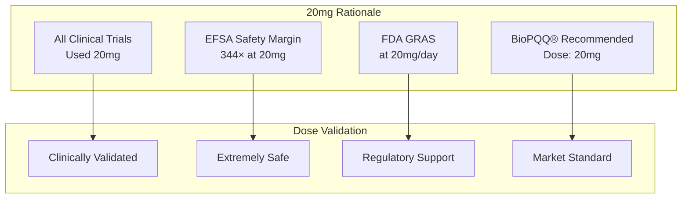

### Population Considerations

| Population | Dose | Duration for Effect | Notes |
|------------|------|---------------------|-------|
| **Healthy adults** | 20 mg | 8 weeks | Standard |
| **Elderly (cognitive)** | 20 mg | 12 weeks | May need longer |
| **Athletes** | 20 mg | 6 weeks | With exercise |
| **Younger adults** | 10-20 mg | 8 weeks | Cognitive flexibility |

### Timing Optimization

| Timing | Rationale | Recommendation |
|--------|-----------|----------------|
| **Morning** | Supports daytime energy | *Optimal* |
| **With food** | Enhanced absorption | *Recommended* |
| **Consistent daily** | Builds chronic effects | *Essential* |

</Accordion>

<Accordion title="Synergy Matrix" icon="link">

### PQQ + CoQ10: The Classic Mitochondrial Stack

This is one of the most well-validated supplement combinations:

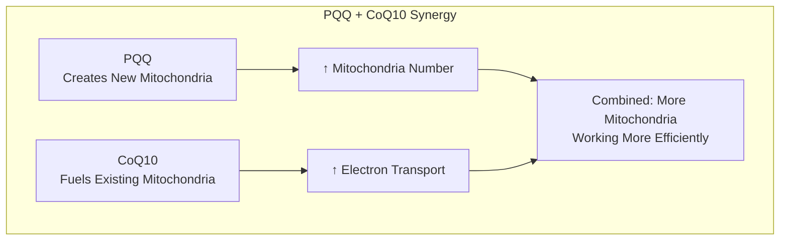

| Compound | Primary Action | Combined Benefit |
|----------|----------------|------------------|
| **PQQ** | *Creates new mitochondria* | Expanded capacity |
| **CoQ10** | *Supports electron transport* | Better function |
| **Together** | Synergistic | ***Optimized mitochondrial performance*** |

**Clinical Evidence:** Koikeda 2011 showed PQQ + CoQ10 improved word recall more than either alone.

### PQQ + Creatine: The Energy Foundation

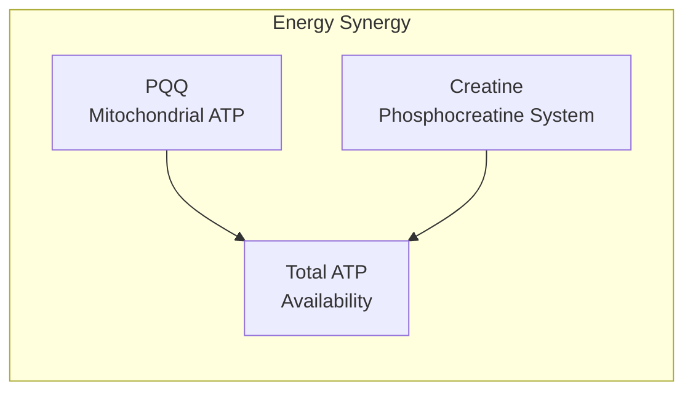

| Synergy | Mechanism | Rating |
|---------|-----------|--------|
| PQQ + Creatine | Dual energy systems | ★★★★☆ |

### PQQ + NAD+ Precursors: The Longevity Stack

| Compound | Pathway | Combined with PQQ |
|----------|---------|-------------------|
| **NMN** | NAD+ precursor | Enhanced sirtuin activation |
| **NR** | NAD+ precursor | Enhanced sirtuin activation |

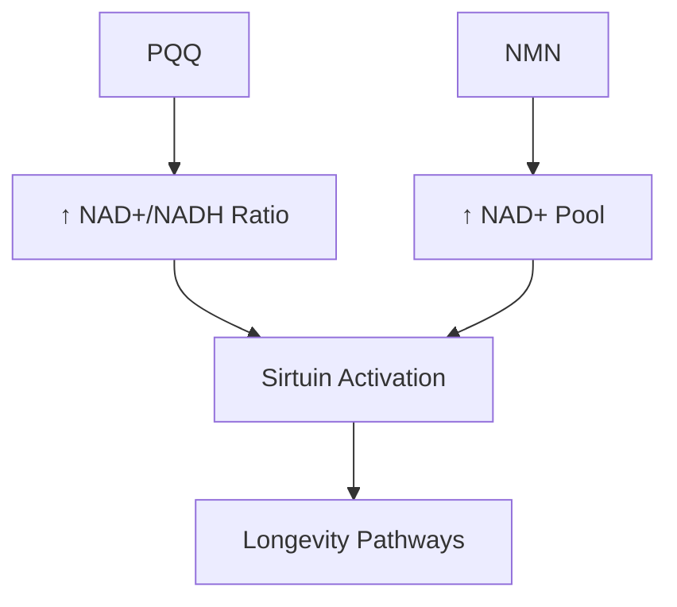

### NTRPX Stack Synergies

| NTRPX Compound | PQQ Synergy | Mechanism | Rating |
|----------------|-------------|-----------|--------|
| **CDP-Choline** | Complementary | Membrane + energy | ★★★★☆ |
| **Creatine** | Synergistic | Dual energy systems | ★★★★☆ |
| **Alpha-GPC** | Complementary | Neurotransmission + energy | ★★★★☆ |
| **Salidroside** | Synergistic | Both activate AMPK/PGC-1α | ★★★★★ |

### Synergy Rating Summary

| Stack | Evidence | Rating |
|-------|----------|--------|
| PQQ + CoQ10 | *Clinical* | ★★★★★ |
| PQQ + Creatine | Logical | ★★★★☆ |
| PQQ + Salidroside | Pathway overlap | ★★★★★ |
| PQQ + NAD+ precursors | Mechanistic | ★★★★☆ |

</Accordion>

<Accordion title="Clinical Evidence" icon="book-open">

### Human Clinical Trials

| Study | Design | N | Dose | Duration | Primary Finding |
|-------|--------|---|------|----------|-----------------|
| **Nakano 2012** | Open-label | 17 | 20mg | 8 weeks | *↓ Fatigue, ↑ sleep, ↓ stress* |
| **Itoh 2016** | RCT, DB, PC | 41 | 20mg | 12 weeks | *↑ Attention (Stroop test)* |
| **Shiojima 2021** | RCT, DB, PC | 60 | 20mg | 8-12 weeks | *↑ Memory, processing speed* |
| **Hwang 2019** | RCT | 23 | 20mg | 6 weeks | *↑ PGC-1α (with exercise)* |
| **Harris 2013** | RCT | 10 | 20mg | 4 weeks | *↓ CRP, ↓ LDL, ↓ inflammation* |

### Nakano 2012 — Stress, Fatigue, Sleep

| Outcome | Before PQQ | After 8 Weeks | Change |
|---------|------------|---------------|--------|
| **Vigor** | Baseline | ↑ Improved | *Significant* |
| **Fatigue** | Baseline | ↓ Reduced | *Significant* |
| **Tension-anxiety** | Baseline | ↓ Reduced | *Significant* |
| **Sleep quality** | Baseline | ↑ Improved | *Significant* |
| **Cortisol awakening response** | Elevated | ↓ Normalized | *Significant* |

### Shiojima 2021 — Cognitive Function by Age

| Age Group | Improved Domains | Duration |
|-----------|------------------|----------|
| **Young (20-40)** | Cognitive flexibility, processing speed, execution speed | 8 weeks |
| **Older (41-65)** | Complex memory, verbal memory | 12 weeks |

### Mechanistic Human Studies

| Study | Marker | Finding |
|-------|--------|---------|
| **Hwang 2019** | PGC-1α protein | *↑ with exercise + PQQ* |
| **Harris 2013** | CRP (inflammation) | *↓ 45%* |
| **Harris 2013** | Urinary metabolites | *Altered mitochondrial metabolism* |

### Effect Size Summary

| Domain | Effect Size (d) | Evidence Level |
|--------|-----------------|----------------|
| **Fatigue reduction** | 0.5-0.7 | Moderate |
| **Cognitive function** | 0.4-0.6 | High (RCT) |
| **Sleep quality** | 0.4-0.6 | Moderate |
| **Mitochondrial markers** | 0.3-0.5 | Moderate |

### References

**Primary Human Studies:**
- Nakano M et al. Effects of oral supplementation with pyrroloquinoline quinone on stress, fatigue, and sleep. *Funct Foods Health Dis.* 2012;2(8):307-324.
- Itoh Y et al. Effect of the antioxidant supplement pyrroloquinoline quinone disodium salt (BioPQQ™) on cognitive functions. *Adv Exp Med Biol.* 2016;876:319-25.
- Shiojima Y et al. Effect of dietary pyrroloquinoline quinone disodium salt on cognitive function in healthy volunteers. *J Am Coll Nutr.* 2021.
- Hwang PS et al. Effects of pyrroloquinoline quinone (PQQ) supplementation on aerobic exercise performance and indices of mitochondrial biogenesis. *J Am Coll Nutr.* 2019;39:547-556.
- Harris CB et al. Dietary pyrroloquinoline quinone (PQQ) alters indicators of inflammation and mitochondrial-related metabolism in human subjects. *J Nutr Biochem.* 2013;24:2076-84.

**Mechanistic Studies:**
- Chowanadisai W et al. Pyrroloquinoline quinone stimulates mitochondrial biogenesis through cAMP response element-binding protein phosphorylation and increased PGC-1α expression. *J Biol Chem.* 2010;285:142-152.

</Accordion>

<Accordion title="Safety & Classification" icon="shield-check">

### Adverse Event Profile

| Event | Incidence | Severity | Notes |
|-------|-----------|----------|-------|
| **Headache** | Rare | Mild | Usually transient |
| **GI discomfort** | Rare | Mild | Take with food |
| **Insomnia** | Rare | Mild | If taken late |

At 20mg clinical doses, adverse events are *uncommon and mild*.

### Safety Data

| Parameter | Finding | Source |
|-----------|---------|--------|
| **Human clinical (20mg)** | No adverse events | Multiple studies |
| **NOAEL (rat)** | 100 mg/kg bw/day | EFSA 2017 |
| **Margin of exposure** | 344× at 20mg/day | EFSA 2017 |
| **GRAS status** | Affirmed | FDA GRN 625, 641, 709 |
| **EU Novel Food** | Approved | EFSA 2017 |
| **Mutagenicity** | Negative | Ames test, chromosomal aberration |
| **Genotoxicity** | Negative | BioPQQ® testing |

### Regulatory Status

| Region | Status | Reference |
|--------|--------|-----------|
| **United States** | GRAS; dietary supplement | FDA GRN 625, 641, 709 |
| **European Union** | Novel Food approved | EFSA 2017 |
| **Japan** | Food ingredient | Since 2008 |
| **Canada** | NPN eligible | Licensed products |

### EFSA Safety Assessment (2017)

| Assessment | Finding |
|------------|---------|
| **NOAEL** | 100 mg/kg bw/day |
| **Human equivalent (70kg)** | 7,000 mg/day |
| **Proposed use** | 20 mg/day |
| **Margin of exposure** | ***344×*** |
| **Conclusion** | *"Safe under the intended conditions of use"* |

### Contraindications

| Category | Consideration | Severity |
|----------|---------------|----------|
| **Pregnancy/Nursing** | Limited data | ★★★☆☆ Avoid or consult |
| **Blood thinners** | Theoretical interaction | ★★☆☆☆ Monitor |

### Drug Interactions

| Drug Class | Interaction | Severity |
|------------|-------------|----------|
| **Anticoagulants** | Theoretical (antioxidant) | ★★☆☆☆ Monitor |
| **Chemotherapy** | Unknown | ★★★☆☆ Consult oncologist |

### Special Populations

| Population | Safety Status | Notes |
|------------|---------------|-------|
| **Healthy adults** | Excellent | 20mg well-tolerated |
| **Elderly** | Excellent | Clinical trial population |
| **Athletes** | Excellent | Performance studies |
| **Pregnancy** | Insufficient data | Avoid |

---

### <Icon icon="star" color="#5A8FA8" /> Tier 1: Foundation

<CardGroup cols={3}>
<Card title="Efficacy" icon="check" color="#5A8FA8">High — Unique mechanism</Card>
<Card title="Validation" icon="check" color="#5A8FA8">Strong — Multiple RCTs, mechanism elucidated</Card>
<Card title="Safety" icon="check" color="#5A8FA8">Excellent — GRAS, Novel Food approved; MOE 344×</Card>
</CardGroup>

**Tier Rationale:** Tier 1 (Foundation) classification. PQQ is the *only* nutritional compound with demonstrated ability to stimulate mitochondrial biogenesis through the PGC-1α pathway — this is a unique and fundamental benefit. Human clinical trials at 20mg demonstrate improvements in cognitive function, fatigue, sleep, and inflammatory markers. The mechanism is well-elucidated (CREB → PGC-1α → NRF → TFAM → new mitochondria). Additional benefits as an ultra-potent antioxidant (5,000× vitamin C cycling capacity) and NGF stimulator provide multi-dimensional value. Safety is excellent with FDA GRAS status, EU Novel Food approval, and a margin of exposure of 344× at clinical doses. BioPQQ®-grade ensures consistency with clinical research.

</Accordion>

<Accordion title="Practical Considerations" icon="clipboard-list">

### When to Use PQQ

| Scenario | Expected Benefit | Protocol |
|----------|------------------|----------|
| **Cognitive optimization** | *High* | 20mg daily, 8-12 weeks |
| **Energy/fatigue** | *High* | 20mg daily, 8 weeks |
| **Healthy aging** | *High* | 20mg daily, ongoing |
| **Athletic performance** | Moderate | 20mg daily, with exercise |
| **Post-illness recovery** | Moderate | 20mg daily, 4-8 weeks |

### Realistic Expectations

| Timeframe | What to Expect |
|-----------|----------------|
| **Week 1-2** | Subtle — antioxidant effects active |
| **Week 4** | Metabolic changes (measurable markers) |
| **Week 8** | *Noticeable* — cognitive, energy improvements |
| **Week 12+** | *Full effect* — especially memory in older adults |

### Signs It's Working

| Indicator | Description |
|-----------|-------------|
| ↑ Mental energy | Less cognitive fatigue |
| ↑ Focus | Better sustained attention |
| ↓ Fatigue | More physical energy |
| ↑ Sleep quality | More restorative rest |
| ↑ Recovery | Faster bounce-back from exertion |

### Optimizing Response

| Strategy | Rationale |
|----------|-----------|
| **Take with food** | Enhanced absorption |
| **Morning dosing** | Supports daytime energy |
| **Combine with CoQ10** | Synergistic mitochondrial support |
| **Consistent daily use** | Biogenesis requires chronic dosing |
| **Exercise** | Amplifies PGC-1α activation |

### Frequently Asked Questions

<AccordionGroup>

<Accordion title="How is PQQ different from CoQ10?">
CoQ10 supports *existing* mitochondria by serving as an electron carrier in the respiratory chain. PQQ creates *new* mitochondria by activating the PGC-1α biogenesis pathway. They're complementary: PQQ builds new powerhouses, CoQ10 helps them run efficiently. This is why the combination is more effective than either alone.
</Accordion>

<Accordion title="Why does it take weeks to feel effects?">
PQQ's primary benefit — mitochondrial biogenesis — is a slow biological process. Creating new mitochondria takes time: gene transcription → protein synthesis → organelle assembly → functional integration. Antioxidant effects are immediate, but the transformative energy benefits require 8-12 weeks of consistent dosing.
</Accordion>

<Accordion title="Is 20mg necessary, or will 10mg work?">
All clinical trials showing cognitive and energy benefits used 20mg. Lower doses (10mg) may provide baseline support, but 20mg is the validated clinical dose. NTRPX Sprint delivers the full 20mg; Boost provides 10mg for maintenance or stacking scenarios.
</Accordion>

<Accordion title="Why BioPQQ®-grade specifically?">
BioPQQ® by Mitsubishi Gas Chemical is the form used in *all* published human clinical trials. Using BioPQQ®-grade ensures you receive the exact material that has been validated for efficacy and safety. Generic PQQ may vary in purity and quality.
</Accordion>

<Accordion title="Can I take PQQ with other supplements?">
Yes — PQQ is highly compatible with other supplements. The PQQ + CoQ10 combination is particularly well-validated. PQQ also synergizes with creatine (dual energy systems) and salidroside (both activate PGC-1α). No significant interactions with common supplements.
</Accordion>

<Accordion title="Is PQQ a vitamin?">
In 2003, researchers proposed PQQ might be the "14th vitamin" based on its essential role in development. While this classification is debated, it underscores PQQ's fundamental importance. Humans cannot synthesize PQQ, must obtain it from diet, and it serves critical cofactor functions — all hallmarks of vitamins.
</Accordion>

<Accordion title="What about the _5000× vitamin C_ claim?">
This refers to PQQ's *catalytic cycling capacity* — it can undergo ~20,000 redox cycles before degradation, compared to ~4 for vitamin C. This makes PQQ extraordinarily efficient at neutralizing reactive oxygen species. It doesn't mean PQQ replaces vitamin C, which has many other functions.
</Accordion>

</AccordionGroup>

</Accordion>

</AccordionGroup>

---

<Tip>
**MitoSpark Summary:** PQQ (Pyrroloquinoline Quinone) at 20mg BioPQQ®-grade is the *only* nutritional compound proven to stimulate mitochondrial biogenesis through the PGC-1α pathway — literally creating new cellular powerhouses. Combined with 5,000× the antioxidant cycling capacity of vitamin C and potent NGF stimulation, PQQ provides multi-dimensional support for cognitive function, cellular energy, and healthy aging. Human clinical trials demonstrate improvements in attention, memory, fatigue, and sleep quality at the 20mg dose. In NTRPX Sprint and Boost, MitoSpark PQQ delivers the power to build a more energized brain and body.
</Tip>
