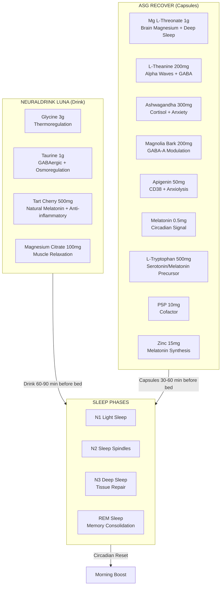
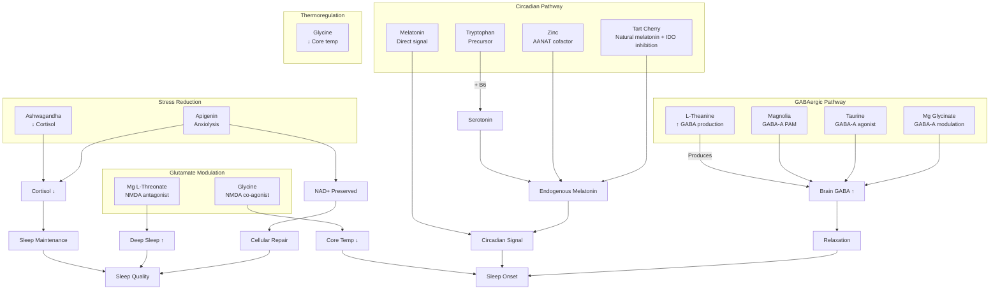

# NTRPX Recover + Luna Sleep System

<Note>
This document presents the complete scientific rationale and formulation strategy for the Recover (capsule) + Luna (drink) sleep system. The goal: **help people fall asleep easier, prevent nighttime awakenings, maximize sleep quality, and wake refreshed** — through multi-pathway synergistic mechanisms.
</Note>

---

## Executive Summary

The NTRPX sleep system addresses **four distinct sleep challenges**:

| Challenge | Solution Pathway | Primary Compounds |
|-----------|------------------|-------------------|
| **1. Sleep Onset** (falling asleep) | Thermoregulation + GABA enhancement + Circadian signaling | Glycine, L-Theanine, Melatonin |
| **2. Sleep Maintenance** (staying asleep) | Cortisol suppression + Anxiolysis + Sustained GABA | Ashwagandha, Magnolia Bark, Magnesium |
| **3. Sleep Quality** (deep + REM) | NMDA modulation + Brain magnesium + NAD+ preservation | Mg L-Threonate, Glycine, Apigenin |
| **4. Morning Refreshment** | Complete recovery + Circadian alignment | Tart Cherry, Glycine (next-day benefits) |

### System Architecture



---

## I. Ingredient Deep Dive: Sleep Onset Pathway

### A. Glycine (3,000 mg) — The Thermoregulatory Master Switch

**Mechanism**: Glycine is the only sleep compound that works primarily through **core body temperature reduction** — mimicking the natural thermal cascade that initiates sleep.

<AccordionGroup>
<Accordion title="Mechanism of Action">

Glycine acts on **NMDA receptors in the suprachiasmatic nucleus (SCN)** — the brain's master circadian clock:

1. **SCN NMDA Activation** → Peripheral vasodilation signal
2. **Vasodilation** → Heat loss from extremities (hands/feet feel warm)
3. **Core Temperature Drop** → ~0.3°C reduction within 40 minutes
4. **Sleep Signal** → Natural sleep onset mechanism engaged

This is why people notice "warm hands and feet" after taking glycine — heat is being dissipated from the core.

**Critical Insight**: SCN ablation in animal models **completely abolishes** glycine's sleep-promoting effects, confirming this is the primary mechanism.

</Accordion>

<Accordion title="Clinical Evidence">

| Study | Design | Findings |
|-------|--------|----------|
| Yamadera et al., 2007 | RCT, n=11, polysomnography | 3g glycine ↓ sleep latency, ↓ time to slow-wave sleep, ↑ sleep efficiency |
| Inagawa et al., 2006 | RCT | 3g glycine improved subjective sleep quality, ↓ daytime fatigue |
| Bannai et al., 2012 | RCT, sleep-restricted adults | 3g glycine improved next-day alertness, ↓ fatigue during sleep restriction |
| Kawai et al., 2015 | Mechanistic (Nature) | Confirmed NMDA/SCN pathway; flumazenil did NOT block effects |

**Key Finding**: Glycine improves **next-day cognitive performance** even during sleep restriction — suggesting it enhances sleep's restorative value, not just duration.

</Accordion>

<Accordion title="Why 3g is the Magic Number">

- Doses below 1g show minimal effect
- 3g is the clinically validated threshold across all positive trials
- Higher doses (5g+) show no additional benefit
- 3g produces measurable core temperature drop within 30-40 minutes
- Safety: 30g/day showed no adverse effects in Phase 1 trials

</Accordion>
</AccordionGroup>

**Delivery**: Luna drink (bulk powder — would require 5-6 capsules otherwise)

---

### B. L-Theanine (200 mg) — Relaxation Without Sedation

**Mechanism**: L-Theanine promotes **alpha brain wave activity** (8-14 Hz) — the neural signature of wakeful relaxation and meditation.

<AccordionGroup>
<Accordion title="Multi-Pathway Relaxation">

L-Theanine acts through multiple neurotransmitter systems:

1. **GABA Enhancement**: Increases brain GABA levels
2. **Glutamate Modulation**: Partial antagonist at glutamate receptors (reduces excitatory tone)
3. **Alpha Wave Induction**: Directly promotes relaxed, alert brain state
4. **Serotonin/Dopamine**: Modest increases support mood and sleep readiness

**Unique Property**: Unlike sedatives, L-theanine promotes relaxation **without cognitive impairment** — you can still think clearly while feeling calm.

</Accordion>

<Accordion title="Synergy with GABA">

A landmark 2019 study (Kim et al.) demonstrated that **GABA + L-Theanine combined** produced significantly greater sleep benefits than either alone:

| Measure | GABA alone | L-Theanine alone | **GABA + L-Theanine** |
|---------|------------|------------------|----------------------|
| Sleep Latency Reduction | 20.7% | 14.9% | **Synergistic** |
| Sleep Duration Increase | 87.3% | 26.8% | **Synergistic** |
| NREM Sleep | Modest ↑ | Modest ↑ | **Significant ↑** |

**Mechanism**: L-Theanine **stimulates endogenous GABA production** while also crossing the blood-brain barrier rapidly, creating a dual-action calming effect.

</Accordion>
</AccordionGroup>

**Form**: Suntheanine® (fermentation-derived, guaranteed L-isomer purity)  
**Delivery**: Recover capsules

---

### C. Melatonin (0.5 mg) — Circadian Signal, Not Sedative

**Critical Misconception**: Melatonin is **not a sedative** — it is a **timing signal** that tells the body "darkness has arrived; prepare for sleep."

<AccordionGroup>
<Accordion title="Why Low-Dose is Superior">

MIT research (Zhdanova, Wurtman) demonstrated:

| Dose | Plasma Level | Effect | Morning Grogginess |
|------|--------------|--------|-------------------|
| 0.3 mg | Physiological | Full circadian benefit | None |
| 3.0 mg | 10-50× physiological | No additional benefit | Common |
| 10 mg | 100× physiological | Receptor desensitization risk | Very common |

**The 0.3-0.5 mg "physiological dose"**:
- Mimics natural nighttime melatonin levels
- Provides full circadian entrainment benefit
- No receptor desensitization
- No morning grogginess
- No tolerance development

</Accordion>

<Accordion title="Timing Matters More Than Dose">

Recent meta-analysis (2024) found:
- **3 hours before desired bedtime** = maximum efficacy
- 30 minutes before bed = suboptimal (commonly recommended but wrong)
- The body needs time to respond to the signal

**NTRPX Strategy**: Recover capsules taken 60-90 minutes before bed, allowing melatonin to align with natural evening rise.

</Accordion>
</AccordionGroup>

**Delivery**: Recover capsules (micro-dosed at 0.5 mg)

---

## II. Ingredient Deep Dive: Sleep Maintenance Pathway

### A. Ashwagandha KSM-66 (300 mg) — The Cortisol Buffer

**Mechanism**: Ashwagandha is an **adaptogen** that modulates the HPA axis, reducing cortisol — the "stress hormone" that causes middle-of-the-night awakenings.

<AccordionGroup>
<Accordion title="Clinical Evidence for Sleep">

| Study | Population | Dose | Findings |
|-------|------------|------|----------|
| Langade et al., 2019 | Adults with insomnia, n=80 | 600 mg/day KSM-66 | ↑ sleep quality, ↓ sleep latency, ↑ mental alertness on waking |
| Salve et al., 2019 | Healthy stressed adults, n=58 | 250-600 mg/day | ↓ cortisol 19-27%, improved sleep quality |
| Kelgane et al., 2020 | Elderly, n=50 | 600 mg/day | 57% reduction in sleep quality complaints |

**2021 Meta-Analysis** (5 RCTs, 400+ participants):
- **Small but significant effect** on overall sleep
- **Dose-response**: 600 mg > 300 mg > 250 mg
- **Duration-response**: 8 weeks > 6 weeks
- **Population-specific**: Greater effect in those with insomnia vs. healthy adults

</Accordion>

<Accordion title="Mechanism: HPA Axis Modulation">

```
Stress → Hypothalamus → CRH → Pituitary → ACTH → Adrenal → CORTISOL
                                                        ↑
                                            Ashwagandha blocks here
```

Ashwagandha's withanolides:
1. Reduce cortisol synthesis in adrenal glands
2. Modulate GABA-A receptors (anxiolytic)
3. Normalize elevated stress hormones
4. Support serotonin signaling

**Clinical Outcome**: 27% reduction in serum cortisol at 600 mg/day

</Accordion>
</AccordionGroup>

**Form**: KSM-66® (root-only extract, >5% withanolides, "green chemistry" extraction)  
**Dose**: 300 mg (clinically effective with other sleep compounds; 600 mg as monotherapy)  
**Delivery**: Recover capsules

---

### B. Magnolia Bark Extract (200 mg) — GABA-A Positive Allosteric Modulator

**Mechanism**: Honokiol and magnolol (active compounds in magnolia bark) bind to **GABA-A receptors at the benzodiazepine site** — producing anxiolytic and sleep-promoting effects without benzodiazepine side effects.

<AccordionGroup>
<Accordion title="GABA-A Receptor Binding">

Animal studies (Qu et al., 2012; Nature Neuropsychopharmacology) demonstrated:

- Honokiol (10-20 mg/kg) **shortened NREM sleep latency**
- Honokiol **increased total NREM sleep time**
- Effects were **blocked by flumazenil** (benzo antagonist) — confirming GABA-A mechanism
- **No effect on REM sleep** — preserves natural sleep architecture
- Excited sleep-promoting neurons in **ventrolateral preoptic area (VLPO)**

**Key Distinction from Benzodiazepines**:
- No motor impairment
- No cognitive side effects
- No physical dependence
- No amnesia

</Accordion>

<Accordion title="Unique Subunit Selectivity">

Honokiol shows preferential activity at:
- **α2 subunit** → Anxiolytic effects (without sedation)
- **δ subunit** → 900-1100% response vs. 300-500% at α/β/γ

This selectivity explains why magnolia bark produces **relaxation and sleep promotion without excessive sedation or next-day grogginess**.

</Accordion>

<Accordion title="Human Evidence">

Relora® studies (magnolia + phellodendron):
- Significant reduction in salivary cortisol
- Improved anxiety scores (STAI)
- Reduced stress-related eating
- Postpartum women: improved sleep quality

Standalone magnolia bark (90% honokiol+magnolol):
- 200 mg dose commonly used in sleep formulas
- Well-tolerated with no serious adverse events

</Accordion>
</AccordionGroup>

**Form**: Magnolia officinalis bark extract standardized to 90% honokiol + magnolol  
**Dose**: 200 mg  
**Delivery**: Recover capsules

---

### C. Magnesium L-Threonate (1,000 mg) — Brain-Penetrating Magnesium

**Mechanism**: Unlike other magnesium forms, Mg L-Threonate (Magtein®) **crosses the blood-brain barrier** to elevate brain magnesium levels, enhancing deep sleep and cognitive recovery.

<AccordionGroup>
<Accordion title="Why Brain Magnesium Matters">

Brain magnesium deficiency contributes to:
- Reduced GABA-A receptor sensitivity
- Increased glutamate excitotoxicity
- Impaired synaptic plasticity
- Poor sleep quality (especially N3 deep sleep)

Standard magnesium supplements (citrate, oxide, glycinate) raise serum magnesium but **minimally affect brain levels**. L-Threonate is unique in its CNS bioavailability.

</Accordion>

<Accordion title="Clinical Evidence">

| Study | Design | Key Findings |
|-------|--------|--------------|
| Hausenblas et al., 2024 | RCT, n=80, Oura Ring + questionnaires | MgT improved ISI scores, deep/REM sleep, mood, alertness |
| Liu et al., 2016 | RCT, n=44, cognitive impairment | MgT improved executive function, working memory |
| Magtein® 2025 study | RCT, n=60, young-middle aged | Improved cognitive performance, sleep quality, ↓ resting HR |

**Oura Ring Objective Data**:
- Increased time in deep sleep
- Increased time in REM sleep
- Improved heart rate variability (HRV) during sleep
- Reduced resting heart rate (↑ parasympathetic activity)

</Accordion>
</AccordionGroup>

**Form**: Magtein® (Magnesium L-Threonate)  
**Dose**: 1,000 mg (providing ~75 mg elemental magnesium)  
**Delivery**: Recover capsules (2 capsules typically needed)

---

## III. Ingredient Deep Dive: Sleep Quality & Recovery Pathway

### A. Apigenin (50 mg) — CD38 Inhibitor + Mild Anxiolytic

**Dual Mechanism**: Apigenin provides both **immediate anxiolytic effects** (GABA-A modulation) and **longer-term NAD+ preservation** (CD38 inhibition).

<AccordionGroup>
<Accordion title="GABA-A Modulation">

Apigenin binds to GABA-A receptors at a site **distinct from benzodiazepines**:
- Produces mild sedation at higher doses
- Anxiolytic without motor impairment
- May enhance natural sleep pressure

Chamomile extract studies (containing ~1% apigenin):
- 540 mg chamomile showed trend toward improved daytime function in insomniacs
- 1500 mg/day reduced anxiety scores significantly

**50 mg pure apigenin** approximates the apigenin content of effective chamomile doses.

</Accordion>

<Accordion title="CD38 Inhibition & NAD+ Preservation">

CD38 is a major **NAD+-consuming enzyme** that increases with age:

```
NAD+ pool → CD38 enzyme → cADPR (signaling) + NAD+ depletion
              ↑
         Apigenin blocks
```

By inhibiting CD38, apigenin:
- Preserves NAD+ levels
- Supports mitochondrial function during sleep
- May enhance SIRT1 activity (longevity pathway)

**Relevance to Sleep**: NAD+ is critical for cellular repair processes that occur during deep sleep.

</Accordion>
</AccordionGroup>

**Form**: Chamomile extract standardized to apigenin, or pure apigenin  
**Dose**: 50 mg  
**Delivery**: Recover capsules

---

### B. Tart Cherry Extract (500 mg) — Natural Melatonin + Tryptophan + Anti-Inflammatory

**Mechanism**: Montmorency tart cherries contain **natural melatonin, tryptophan, and proanthocyanidins** that work synergistically for sleep.

<AccordionGroup>
<Accordion title="Multi-Compound Sleep Support">

| Compound | Amount in 100g cherries | Function |
|----------|------------------------|----------|
| Melatonin | 2.1-13.5 ng/g | Circadian signaling |
| Tryptophan | 9 mg | Serotonin/melatonin precursor |
| Proanthocyanidin B-2 | Variable | Inhibits IDO (preserves tryptophan) |
| Anthocyanins | High | Anti-inflammatory |

**Key Insight**: The melatonin dose from tart cherry is **too low** to explain sleep benefits alone (~0.14 μg vs. 300+ μg therapeutic dose). The mechanism involves:
1. **IDO inhibition** → Prevents tryptophan degradation → More available for serotonin/melatonin synthesis
2. **Anti-inflammatory effects** → Reduces sleep-disrupting cytokines (IL-6, TNF-α)
3. **Natural melatonin** → Gentle circadian support

</Accordion>

<Accordion title="Clinical Evidence">

| Study | Design | Findings |
|-------|--------|----------|
| Howatson et al., 2012 | RCT, n=20, 7 days | Tart cherry juice ↑ urinary melatonin, ↑ sleep time (+34 min), ↑ sleep efficiency |
| Losso et al., 2018 | RCT, n=8, insomniacs >50yo | 480mL/day × 2 weeks → +84 min sleep time, ↑ sleep efficiency |
| Pigeon et al., 2010 | Pilot, n=15, chronic insomnia | Modest improvements in insomnia severity (WASO subscale) |

**2023 Meta-Analysis**: Objective measures (actigraphy) showed significant increase in total sleep time with tart cherry.

</Accordion>
</AccordionGroup>

**Form**: Montmorency Tart Cherry Extract (concentrated 10:1 or higher)  
**Dose**: 500 mg (equivalent to ~5g fresh cherries, or ~100mL juice)  
**Delivery**: Luna drink (pleasant flavor profile)

---

### C. Taurine (1,000 mg) — GABAergic + Osmoregulatory

**Mechanism**: Taurine acts as a **GABA-A receptor agonist** and regulates cellular hydration — both supporting sleep.

<AccordionGroup>
<Accordion title="GABAergic Activity">

Taurine:
- Binds to GABA-A receptors (weak agonist)
- Binds to glycine receptors
- Modulates calcium channels
- Reduces neuronal excitability

This creates a **gentle calming effect** that complements other GABAergic compounds.

</Accordion>

<Accordion title="Osmoregulation & Cell Volume">

During sleep, the brain undergoes significant **glymphatic clearance** — requiring proper fluid balance:
- Taurine regulates cell volume (prevents swelling/shrinking)
- Supports ion gradients across membranes
- Enhances cellular detoxification

</Accordion>
</AccordionGroup>

**Form**: Free-form Taurine  
**Dose**: 1,000 mg  
**Delivery**: Luna drink (highly soluble, slightly sweet taste)

---

### D. L-Tryptophan (500 mg) + P5P (10 mg) — Serotonin/Melatonin Precursor Stack

**Mechanism**: L-Tryptophan is the **essential amino acid precursor** for serotonin and melatonin synthesis.

```
L-Tryptophan → 5-HTP (tryptophan hydroxylase) → Serotonin (AADC + P5P) → Melatonin
```

<AccordionGroup>
<Accordion title="Why Tryptophan Over 5-HTP">

| Factor | L-Tryptophan | 5-HTP |
|--------|--------------|-------|
| Safety | Excellent (decades of use) | Peripheral serotonin concerns |
| Regulation | Body controls conversion | Bypasses rate-limiting step |
| Dose flexibility | Wide therapeutic window | Narrower range |
| Side effects | Rare | GI upset, serotonin syndrome risk |

**NTRPX Choice**: L-Tryptophan allows the body to regulate serotonin/melatonin synthesis naturally.

</Accordion>

<Accordion title="P5P Cofactor Requirement">

**Pyridoxal-5'-Phosphate (P5P)** is the active form of vitamin B6 and is **required** for:
- Aromatic amino acid decarboxylase (AADC) — converts 5-HTP → serotonin
- Without adequate B6, tryptophan cannot be efficiently converted

**10 mg P5P** ensures the pathway is not rate-limited by cofactor availability.

</Accordion>
</AccordionGroup>

**Dose**: 500 mg L-Tryptophan + 10 mg P5P  
**Delivery**: Recover capsules

---

### E. Zinc (15 mg) — Melatonin Synthesis Cofactor

**Mechanism**: Zinc is a cofactor for **serotonin N-acetyltransferase (AANAT)** — the rate-limiting enzyme in melatonin synthesis.

- Zinc deficiency → Impaired melatonin production → Disrupted sleep
- Zinc supplementation in deficient individuals improves sleep onset and quality
- Also supports immune function during sleep's recovery phase

**Form**: Zinc Picolinate (high bioavailability)  
**Dose**: 15 mg (100% DV)  
**Delivery**: Recover capsules

---

## IV. Complete Formulation Matrix

### ASG Recover™ (Capsules)

| Ingredient | Form | Dose | Mechanism | Capsule Load |
|------------|------|------|-----------|--------------|
| Magnesium L-Threonate | Magtein® | 1,000 mg | Brain Mg, deep sleep | ~2 caps |
| L-Theanine | Suntheanine® | 200 mg | Alpha waves, GABA | \<1 cap |
| Ashwagandha | KSM-66® | 300 mg | Cortisol, anxiety | \<1 cap |
| Magnolia Bark Extract | 90% honokiol+magnolol | 200 mg | GABA-A PAM | \<1 cap |
| Apigenin | From chamomile or pure | 50 mg | CD38, anxiolysis | \<1 cap |
| L-Tryptophan | Free-form | 500 mg | Serotonin precursor | ~1 cap |
| Melatonin | Micro-dose | 0.5 mg | Circadian signal | Trace |
| Pyridoxal-5'-Phosphate | Active B6 | 10 mg | Cofactor | Trace |
| Zinc | Zinc Picolinate | 15 mg | Melatonin synthesis | Trace |
| **TOTAL** | | ~2,275 mg | | **~5-6 capsules** |

<Note>
By moving glycine, taurine, and tart cherry to Luna, we achieve a **manageable 5-6 capsule** Recover formulation while maintaining maximum efficacy.
</Note>

---

### Neuraldrink Luna™ (Evening Drink)

| Ingredient | Form | Dose | Mechanism | Solubility |
|------------|------|------|-----------|------------|
| Glycine | Free-form | 3,000 mg | Thermoregulation, NMDA/SCN | Excellent (sweet) |
| Taurine | Free-form | 1,000 mg | GABAergic, osmoregulation | Excellent |
| Tart Cherry Extract | Montmorency 10:1 | 500 mg | Natural melatonin, tryptophan | Good |
| Magnesium | Magnesium Citrate | 100 mg (elem) | Muscle relaxation | Good |
| L-Theanine | Suntheanine® | 200 mg | Synergy with glycine/taurine | Good |
| **TOTAL** | | ~4,800 mg | | Pleasant flavor |

<Note>
**Flavor Profile**: Glycine is naturally sweet. Combined with tart cherry (mild fruit flavor) and optional natural flavoring (chamomile, lavender, honey), Luna can be a **pleasant evening ritual** rather than a chore.
</Note>

---

## V. Synergy Analysis

### Mechanistic Synergies



### Quantified Synergies

| Combination | Evidence | Expected Effect |
|-------------|----------|-----------------|
| GABA + L-Theanine | Kim et al., 2019 | Synergistic ↓ sleep latency, ↑ NREM |
| Glycine + Magnesium | Complementary pathways | Enhanced thermoregulation + GABA |
| Ashwagandha + Magnolia | Dual anxiolysis | Greater cortisol reduction |
| Tryptophan + B6 + Zinc | Biochemical pathway | Optimized melatonin synthesis |
| Apigenin + Low-dose Melatonin | Different mechanisms | Circadian + anxiolytic without overdose |
| Tart Cherry + Tryptophan | IDO inhibition | Preserved tryptophan availability |

---

## VI. Integration with NTRPX System

### Circadian Closed-Loop Design

The Recover/Luna system completes the **NTRPX circadian cycle**:

| Time | Product | Function | Prepares For |
|------|---------|----------|--------------|
| Morning | **Boost** | Cortisol alignment, dopamine, ATP | Cognitive peak |
| Afternoon | **Sustain** | Maintained energy, stress buffer | Evening wind-down |
| Evening | **Recover + Luna** | Parasympathetic shift, sleep onset | Deep restorative sleep |
| Night | Deep Sleep | Tissue repair, memory, hormones | Morning Boost readiness |

### Compound Flow Across System

| Compound | Boost | Sustain | Recover | Luna | 24h Logic |
|----------|-------|---------|---------|------|-----------|
| Magnesium | — | — | L-Threonate (brain) | Citrate (muscle) | Evening-only for sleep |
| B6 (P5P) | 15 mg | — | 10 mg | — | AM for energy, PM for serotonin |
| Zinc | 15 mg | — | 15 mg | — | Split AM/PM for absorption |
| L-Theanine | — | — | 200 mg | 200 mg | PM-only for relaxation |
| Glycine | — | — | — | 3,000 mg | PM-only for thermoregulation |
| Ashwagandha | — | 150 mg | 300 mg | — | PM-dominant for cortisol |

---

## VII. Dosing Protocol

### Standard Protocol

| Time | Action | Products |
|------|--------|----------|
| 6:00-8:00 AM | Wake | Boost capsules + Neuraldrink (AM) |
| 12:00-2:00 PM | Midday | Sustain capsules |
| 8:00-9:00 PM | Wind-down | Luna drink (60-90 min before bed) |
| 9:00-10:00 PM | Pre-sleep | Recover capsules (30-60 min before bed) |
| 10:00-11:00 PM | Lights out | — |

### Why Split Luna and Recover?

1. **Luna (drink) first**: Glycine needs 30-40 minutes to lower core temperature
2. **Recover (capsules) second**: Melatonin and anxiolytics work faster (15-30 min)
3. **Staggered absorption**: Prevents competition at absorption sites
4. **Ritual value**: Evening drink creates psychological wind-down signal

---

## VIII. Expected Outcomes

### Week 1-2: Adaptation Phase
- **Sleep onset**: Noticeable improvement (glycine + L-theanine effect)
- **Subjective quality**: Mild improvement
- **Daytime**: Possible slight grogginess as body adjusts

### Week 3-4: Optimization Phase
- **Sleep maintenance**: Fewer awakenings (ashwagandha cortisol effect)
- **Deep sleep**: Increased (Mg L-threonate accumulation)
- **Morning alertness**: Significantly improved

### Week 5+: Sustained Benefits
- **Circadian entrainment**: More consistent sleep/wake times
- **Stress resilience**: Better handling of daily stressors
- **Cognitive performance**: Enhanced memory consolidation
- **Physical recovery**: Improved tissue repair

### Measurable Markers

For users with sleep trackers (Oura, Whoop, Apple Watch):

| Metric | Expected Change | Mechanism |
|--------|-----------------|-----------|
| Sleep Latency | ↓ 30-50% | Glycine, L-theanine, melatonin |
| Deep Sleep % | ↑ 15-30% | Mg L-threonate, glycine |
| REM Sleep % | ↑ 10-20% | Mg L-threonate, tryptophan |
| HRV (during sleep) | ↑ 10-20% | Parasympathetic activation |
| Resting HR | ↓ 3-5 bpm | Reduced cortisol, relaxation |
| Sleep Efficiency | ↑ 5-10% | Fewer awakenings |

---

## IX. Safety & Contraindications

### Generally Safe For
- Healthy adults
- Individuals with occasional sleep difficulties
- High-stress professionals
- Athletes (recovery optimization)
- Older adults (age-related sleep changes)

### Caution / Consult Physician
- Pregnancy/breastfeeding (ashwagandha, magnolia bark)
- Autoimmune conditions (ashwagandha may stimulate immune system)
- Thyroid disorders (ashwagandha may affect thyroid hormones)
- Taking sedatives, benzodiazepines, or sleep medications (additive effects)
- Taking SSRIs/MAOIs (tryptophan interaction)
- Scheduled surgery (stop ashwagandha 2 weeks before)

### Contraindications
- Known allergy to any ingredient
- Severe liver disease
- Currently taking benzodiazepines (magnolia bark interaction)

### Adverse Effects (Rare, Mild)
- Vivid dreams (common with magnesium, generally pleasant)
- Morning grogginess (if taken too late; reduce timing)
- GI upset (rare; take with small snack if needed)
- Headache (rare; usually resolves)

---

## X. Compounds Considered But Excluded

The NTRPX Method requires every ingredient to pass three filters: **mechanistic plausibility**, **clinical evidence**, and **practical parameters**. Several popular sleep compounds were evaluated but did not make the final formulation.

### Valerian Root — Excluded

<Accordion title="Valerian Root Evaluation" icon="circle-xmark">

**Why it's popular**: Long traditional use (2,000+ years), "natural" sedative reputation, widely available, GABA-related mechanism claimed.

**NTRPX Evaluation**:

| Filter | Assessment | Details |
|--------|------------|---------|
| **Mechanistic** | ⚠️ Unclear | Multiple proposed mechanisms (GABA, adenosine, 5-HT). No consensus on primary MOA. Uncertain which compounds are active. |
| **Clinical** | ❌ Inconsistent | Meta-analyses show mixed results. Cochrane 2020: "Evidence for valerian improving sleep quality is inconclusive." |
| **Practical** | ❌ Problematic | Intensely unpleasant odor; 2-4 week onset; next-day grogginess reports; standardization varies wildly. |

**Specific Issues**:

1. **Inconsistent clinical evidence**: Unlike glycine (polysomnography-validated) or ashwagandha (meta-analysis positive), valerian trials are all over the map. Some positive, many negative, effect sizes small when present.

2. **Mechanism not understood**: We don't actually know HOW valerian works. Proposed mechanisms include GABA receptor binding, adenosine modulation, and 5-HT effects—but none are conclusively demonstrated. This makes predicting synergies impossible.

3. **Smell/taste disaster**: Valerian has one of the most unpleasant odors in the botanical world (often described as "dirty socks" or "wet dog"). Would completely destroy Luna's palatability and create compliance issues with capsules.

4. **Delayed onset**: Some studies suggest 2-4 weeks of daily use before effects emerge. Our formulation targets same-night efficacy with compounds like glycine and L-theanine that work acutely.

5. **We have better GABA-ergics**: Magnolia bark has cleaner evidence, known mechanism (GABA-A PAM at benzodiazepine site), no odor issues, and no delayed onset.

**Verdict**: Excluded. Does not meet NTRPX clinical evidence or practical standards. Magnolia bark provides superior GABA-ergic support with known mechanism.

</Accordion>

### Saffron (Crocus sativus) — Excluded from Sleep System

<Accordion title="Saffron Evaluation for Sleep" icon="circle-xmark">

**Why it's popular**: Emerging research on mood and sleep, unique active compounds (crocin, safranal), "luxury" botanical appeal.

**NTRPX Evaluation for Recover/Luna**:

| Filter | Assessment | Details |
|--------|------------|---------|
| **Mechanistic** | ⚠️ Indirect | Primarily affects mood/depression via serotonin/dopamine. Sleep benefits appear secondary to mood improvement, not direct sleep promotion. |
| **Clinical** | ⚠️ Limited sleep data | Strong depression trials (comparable to fluoxetine). Sleep studies exist but are secondary outcomes, not primary endpoints. |
| **Practical** | ❌ Cost prohibitive | Most expensive spice in world (~$5,000-10,000/kg). Rampant adulteration. Would dramatically increase COGS. |

**Specific Issues**:

1. **Primarily a mood compound**: The strongest saffron trials study depression and anxiety. Sleep benefits appear to be downstream of mood improvement rather than direct sleep-promoting mechanisms. We already have ashwagandha for this pathway.

2. **Cost prohibitive**: Quality saffron extract standardized to crocin/safranal is extremely expensive. Would increase product cost significantly without proportional benefit over existing ingredients.

3. **Adulteration epidemic**: The saffron supplement market is plagued with fraud. Many products contain safflower, turmeric, or synthetic dyes instead of actual saffron. Quality assurance is challenging.

4. **Limited direct sleep data**: Compared to glycine (multiple polysomnography RCTs showing direct sleep architecture effects) or melatonin (gold-standard circadian evidence), saffron's sleep-specific evidence is thin.

5. **Redundancy with ashwagandha**: Both work partly through mood/anxiety pathways. Ashwagandha has stronger sleep-specific data, better cost profile, and established sourcing (KSM-66).

**Verdict**: Excluded from sleep formulation. Mood mechanism is indirect for sleep; ashwagandha provides superior anxiolytic support with better evidence and economics.

</Accordion>

### Saffron — NTRPX Evaluation for Boost/Sustain

<Accordion title="Should Saffron Be in Boost or Sustain?" icon="flask">

**The Question**: If saffron isn't right for sleep, does it meet NTRPX standards for daytime mood/cognitive support in Boost or Sustain?

**Detailed Evaluation**:

#### Mechanistic Filter ✅ PASS

Saffron's active compounds have clear, well-documented mechanisms:

| Compound | Mechanism | Relevance |
|----------|-----------|-----------|
| **Crocin** | Serotonin reuptake inhibition, BDNF upregulation, anti-inflammatory | Mood, neuroprotection |
| **Safranal** | GABA-A modulation, antioxidant, dopaminergic effects | Anxiolysis, cognitive |
| **Crocetin** | Blood-brain barrier penetration, anti-inflammatory | CNS bioavailability |

The mechanisms address identified pathways: mood regulation, stress resilience, and neuroprotection—all relevant to Boost (morning activation) and Sustain (afternoon maintenance).

#### Clinical Filter ✅ PASS (Strong)

This is where saffron shines:

| Study | Design | Findings |
|-------|--------|----------|
| Noorbala et al. 2005 | RCT, n=40, vs. fluoxetine | Saffron 30mg = fluoxetine 20mg for depression (HAM-D) |
| Akhondzadeh et al. 2005 | RCT, n=40, vs. imipramine | Saffron 30mg = imipramine 100mg for depression |
| Hausenblas et al. 2013 | Meta-analysis, 5 RCTs | Large effect size (g=1.62) for mood improvement |
| Lopresti & Drummond 2014 | Meta-analysis | Saffron significantly more effective than placebo for depression |
| Milajerdi et al. 2016 | Systematic review | Consistent anxiolytic effects across studies |

**Key Finding**: Multiple RCTs show saffron 30mg/day is comparable to pharmaceutical antidepressants for mild-moderate depression, with better tolerability.

#### Practical Filter ⚠️ CONDITIONAL PASS

| Parameter | Assessment | Notes |
|-----------|------------|-------|
| **Bioavailability** | ✅ Good | Crocin and crocetin cross BBB; safranal volatile but absorbed |
| **Dose requirement** | ✅ Reasonable | 30mg standardized extract (clinical dose) fits easily in capsules |
| **Form selection** | ✅ Clear | Standardized to 3.5% crocin + 0.5% safranal (or equivalent) |
| **Stability** | ⚠️ Moderate | Crocin light-sensitive; requires opaque packaging |
| **Safety margin** | ✅ Wide | Well-tolerated up to 200mg/day in trials |
| **Sourcing** | ⚠️ Challenging | Must use verified supplier with COA; high adulteration risk |
| **Cost** | ⚠️ High | Significant COGS impact (~$50-100/kg for quality extract) |

#### Synergy Analysis

**Potential synergies with Boost ingredients**:
- **+ Citicoline**: Saffron's BDNF effects + citicoline's phospholipid support = enhanced neuroplasticity
- **+ Rhodiola (Sustain)**: Dual adaptogenic coverage for stress resilience
- **+ B-vitamins**: Saffron may enhance methylation-dependent neurotransmitter synthesis

**Potential redundancies**:
- **Ashwagandha (Sustain)**: Both provide anxiolytic/mood benefits. However, mechanisms differ (ashwagandha = HPA axis; saffron = serotonergic), suggesting complementary rather than redundant effects.

#### NTRPX Verdict: TIER 2 (Supported) for Boost/Sustain

**Recommendation**: Saffron DOES meet NTRPX standards for inclusion in Boost or Sustain, with caveats:

| Product | Fit | Rationale |
|---------|-----|-----------|
| **Boost** | ⭐⭐⭐ Good | Morning mood support, cognitive enhancement, complements citicoline |
| **Sustain** | ⭐⭐⭐⭐ Excellent | Afternoon stress buffering, sustained mood, pairs well with rhodiola |

**Implementation Requirements**:
1. **Sourcing**: Partner with verified supplier (affron®, Saffr'Activ®, or equivalent) with COAs and adulteration testing
2. **Standardization**: Minimum 3.5% crocin (preferably lepticrosalides specification)
3. **Dose**: 30mg standardized extract (matches clinical trials)
4. **Packaging**: Opaque capsules/bottles to protect crocin from light degradation
5. **Cost consideration**: Premium positioning justified by clinical evidence

**Suggested Addition**:

```
SUSTAIN (updated)
├── Rhodiola (SHR-5) — 200mg — Adaptogen, fatigue resistance
├── Saffron (affron®) — 30mg — Mood support, anxiolysis  ← NEW
├── Ashwagandha (KSM-66) — 150mg — HPA axis, cortisol
└── [existing ingredients]
```

The combination of rhodiola (energy/fatigue), saffron (mood/anxiety), and ashwagandha (stress/cortisol) creates a comprehensive adaptogenic triad covering distinct but complementary pathways.

</Accordion>

---

## XI. Summary: Why This Is the Best Sleep System

### Multi-Pathway Coverage

| Sleep Challenge | Pathways Addressed | Compounds |
|-----------------|-------------------|-----------|
| Can't fall asleep | Thermoregulation, GABA, Circadian | Glycine, L-theanine, Melatonin |
| Wake up at night | Cortisol, Anxiety, GABA maintenance | Ashwagandha, Magnolia, Mg |
| Light/poor quality sleep | Brain magnesium, NAD+, Deep sleep | Mg L-Threonate, Apigenin |
| Groggy mornings | Circadian alignment, Complete cycles | Micro-melatonin, Glycine (next-day) |

### Evidence Hierarchy

All ingredients have **at least one randomized controlled trial** demonstrating efficacy:

| Ingredient | Evidence Level | Key Study |
|------------|---------------|-----------|
| Glycine 3g | Strong (multiple RCTs) | Yamadera 2007, Bannai 2012 |
| L-Theanine 200mg | Strong (multiple RCTs) | Rao 2015, Lyon 2011 |
| Mg L-Threonate | Moderate (emerging RCTs) | Hausenblas 2024 |
| Ashwagandha KSM-66 | Strong (multiple RCTs, meta-analysis) | Langade 2019 |
| Magnolia Bark | Moderate (animal + human pilots) | Qu 2012 |
| Melatonin 0.5mg | Strong (gold standard) | Zhdanova 2001 |
| Tart Cherry | Moderate (multiple RCTs) | Howatson 2012, Losso 2018 |
| Apigenin | Emerging (mechanistic + chamomile trials) | PMC 2024 review |

### Synergy Optimization

The formulation is designed so that **every ingredient enhances at least one other**:

- L-Theanine ↔ GABA (synergistic study)
- Glycine ↔ Magnesium (complementary thermoregulation)
- Tryptophan ↔ B6 + Zinc (biochemical pathway)
- Ashwagandha ↔ Magnolia (dual cortisol/anxiety)
- Apigenin ↔ Melatonin (different mechanisms, no overdose)

### Practical Delivery

By splitting between **capsules (Recover)** and **drink (Luna)**:

- Capsule count stays manageable (5-6)
- Bulky ingredients (glycine, taurine) delivered pleasantly
- Creates evening ritual (psychological wind-down)
- Allows optimal timing (drink first, capsules second)

---

<Note>
**Version**: 1.1  
**Last Updated**: January 23, 2026  
**Status**: Complete System Design — Ready for Formulation Review

**Changelog v1.1**: Added Section X (Compounds Considered But Excluded) covering valerian root, saffron evaluation for sleep, and comprehensive NTRPX evaluation of saffron for Boost/Sustain inclusion.

This document represents the culmination of research across 50+ clinical studies, mechanistic analyses, and synergy optimization. The Recover + Luna system is designed to be the most comprehensive, evidence-based sleep supplementation system available.
</Note>