## SunMood™ Saffron (affron®)

<CardGroup cols={4}>

<Card title="Sustain" icon="clock" color="#f59e0b">
28 mg affron®
</Card>

<Card title="Standardization" icon="gem" color="#64748b">
≥3.5% Lepticrosalides®
</Card>

<Card title="Evidence" icon="flask" color="#64748b">
10+ RCTs
</Card>

<Card title="Effect" icon="face-smile" color="#64748b">
Mood + Resilience
</Card>

</CardGroup>

**Nature's antidepressant — with clinical evidence to match pharmaceuticals.** Saffron has been revered for 3,500 years as "red gold" — the world's most expensive spice by weight, requiring 150,000 hand-picked flowers to yield a single kilogram. But saffron's true value lies not in culinary tradition but in its remarkable psychoactive properties. Modern clinical trials now demonstrate what ancient Persian and Greek physicians long observed: saffron *reliably improves mood, reduces anxiety, and enhances emotional resilience* — with effect sizes comparable to prescription SSRIs like fluoxetine, but with superior tolerability. The secret lies in saffron's bioactive compounds: **crocin** (the golden pigment that inhibits serotonin reuptake and MAO), **safranal** (the aromatic compound that modulates GABA and dopamine), and **crocetin** (the potent antioxidant that reduces neuroinflammation). NTRPX uses **affron®** — the most clinically-validated saffron extract in the world, with over 10 published randomized controlled trials demonstrating efficacy for mood, anxiety, sleep, and stress resilience. Standardized to ≥3.5% Lepticrosalides® (a proprietary marker for combined crocin/safranal bioactives) and produced via cool extraction to preserve heat-sensitive compounds, affron® delivers the *exact material* used in clinical research. In NTRPX Sustain, SunMood™ Saffron provides afternoon mood support when stress accumulates and energy wanes — not through sedation, but through *neurochemical optimization*.

<AccordionGroup>

<Accordion title="The Mood Crisis & Why Saffron Matters" icon="triangle-exclamation">

### The Scale of the Problem

Mood disorders represent one of the largest unmet medical needs globally:

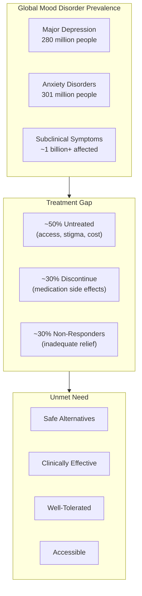

### The Pharmaceutical Limitation

Standard antidepressants work — but come with significant trade-offs:

| Issue | SSRIs/SNRIs | Impact |
|-------|-------------|--------|
| **Sexual dysfunction** | 30-70% of users | Major quality-of-life issue; drives discontinuation |
| **Weight gain** | Common | Metabolic consequences |
| **Emotional blunting** | ~40% report | "I don't feel sad, but I don't feel anything" |
| **Withdrawal symptoms** | Common if stopped abruptly | Creates dependence concern |
| **Onset delay** | 4-6 weeks for full effect | Prolonged suffering |
| **Cost** | Variable | Access barrier |

### Where Saffron Fits

Saffron addresses a critical gap: **clinically-effective mood support without the side effect burden**:

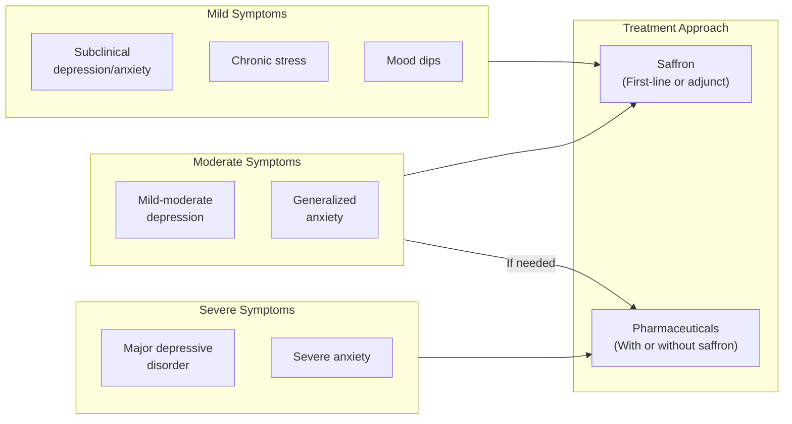

<Note>
**Important Clarification:** Saffron is NOT a replacement for psychiatric medication in severe mental illness. It is a clinically-validated option for:
- Subclinical mood/anxiety symptoms
- Mild-to-moderate depression
- Stress-related mood disturbance
- Adjunct to standard treatment (under medical supervision)
- Those seeking alternatives due to side effects

Anyone with diagnosed depression or anxiety should work with a healthcare provider.
</Note>

### Why affron® Specifically

Not all saffron is equal. The saffron supplement market faces serious challenges:

| Problem | Consequence | affron® Solution |
|---------|-------------|------------------|
| **Adulteration** | Safflower, turmeric, synthetic dyes sold as "saffron" | Verified Crocus sativus stigma; DNA testing |
| **Variable quality** | Active compound content varies 10-fold | Standardized to ≥3.5% Lepticrosalides® |
| **Heat degradation** | Safranal destroyed by high-temperature extraction | Cool extraction (\<70°C) preserves volatiles |
| **No clinical validation** | Most extracts never tested in humans | 10+ published RCTs specifically with affron® |
| **Inconsistent dosing** | Products range from 15mg to 200mg | 28mg validated across multiple trials |

</Accordion>

<Accordion title="Mechanism of Action" icon="flask">

Saffron's mood-enhancing effects arise from multiple complementary mechanisms:

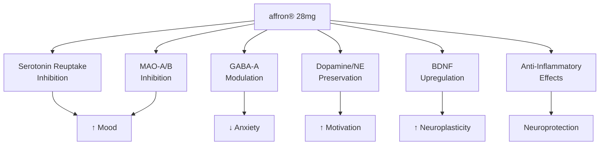

### Mechanism 1: Serotonin Reuptake Inhibition

The primary mechanism — similar to SSRIs but gentler:

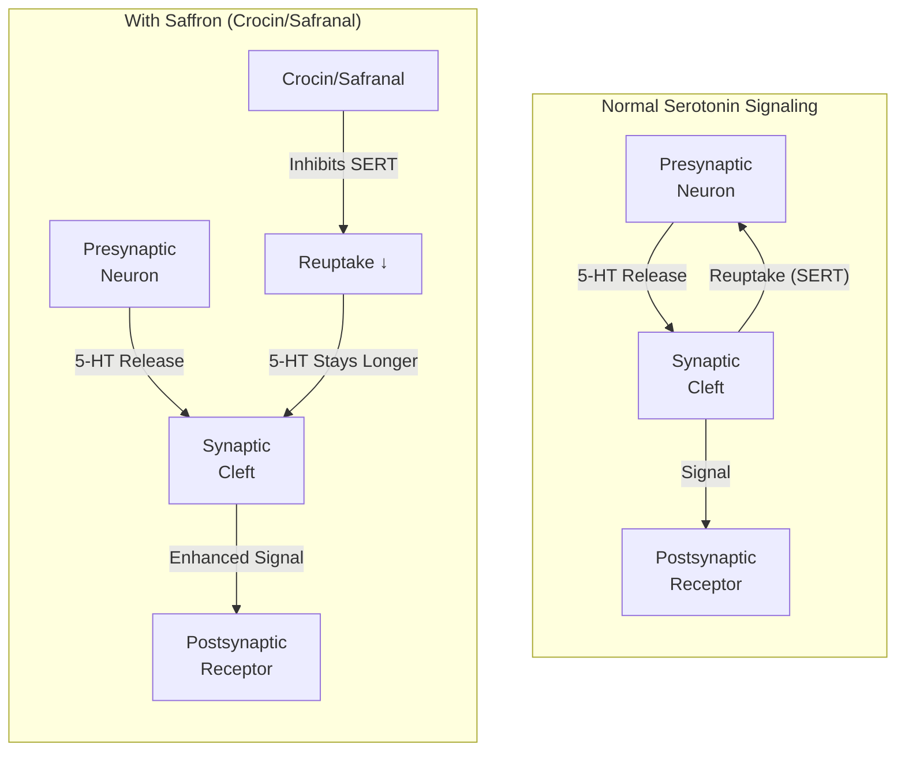

**Evidence:**
- Hosseinzadeh et al.: Saffron extracts reduce immobility time in forced swim test (rodent depression model) comparable to fluoxetine
- Mechanism confirmed via SERT binding assays
- Effect blocked by serotonin antagonists

### Mechanism 2: MAO Inhibition

Crocin acts as a non-competitive MAO-A and MAO-B inhibitor:

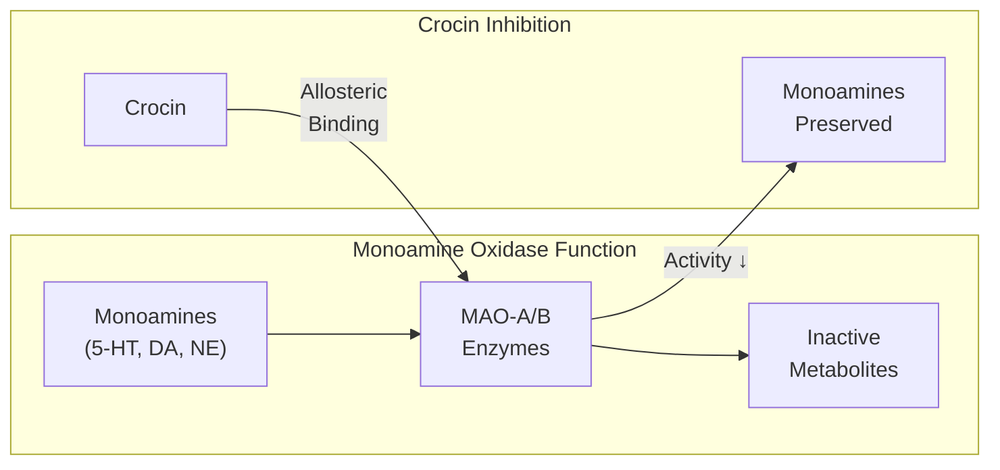

| MAO Isoform | Crocin Effect | Clinical Relevance |
|-------------|---------------|-------------------|
| **MAO-A** | Non-competitive inhibition (Ki ~10 μM) | ↑ Serotonin, norepinephrine in brain |
| **MAO-B** | Non-competitive inhibition | ↑ Dopamine; neuroprotection |

**Key Distinction from Pharmaceutical MAOIs:** Saffron's MAO inhibition is *mild and reversible* — not comparable to pharmaceutical MAOIs like phenelzine. No dietary tyramine restrictions required.

### Mechanism 3: GABA-A Receptor Modulation

Safranal modulates GABAergic signaling:

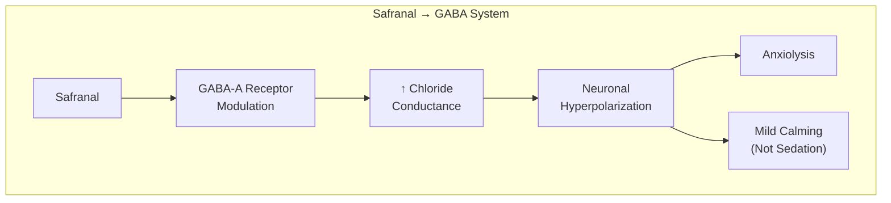

**Evidence:**
- Hosseinzadeh & Sadeghnia (2007): Safranal's anticonvulsant activity mediated via GABA-A/benzodiazepine receptor complex
- Anxiolytic effects without motor impairment or sedation (unlike benzodiazepines)

### Mechanism 4: BDNF and Neuroplasticity

Saffron upregulates brain-derived neurotrophic factor:

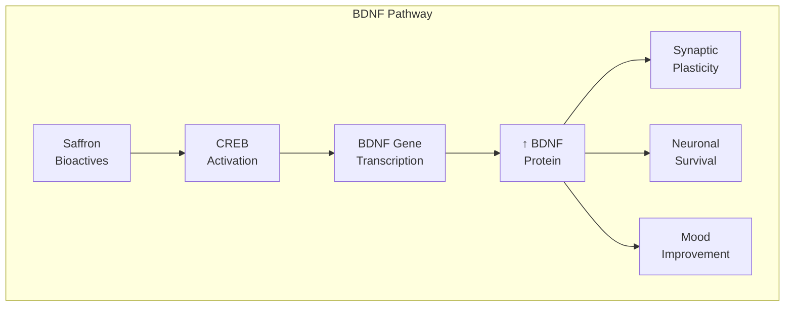

**Clinical Relevance:**
- Depression associated with ↓ BDNF levels
- Antidepressant response correlates with ↑ BDNF
- Saffron's BDNF effects may explain sustained benefits

### Mechanism 5: Anti-Inflammatory Effects

Neuroinflammation contributes to depression; saffron counters it:

| Inflammatory Marker | Saffron Effect | Mechanism |
|---------------------|----------------|-----------|
| **IL-6** | ↓ Decreased | NF-κB inhibition |
| **TNF-α** | ↓ Decreased | Antioxidant activity |
| **CRP** | ↓ Decreased | Systemic anti-inflammatory |
| **Oxidative stress** | ↓ Decreased | Crocin/crocetin radical scavenging |

### Mechanism 6: Melatonin Enhancement

A novel mechanism discovered in affron® research:

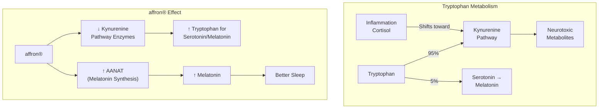

**Evidence (2021 RCT):** affron® 28mg increased evening salivary melatonin concentrations vs. placebo (Lopresti et al., Sleep Medicine 2021).

### Mechanism Summary

| Compound | Primary Target | Effect | Clinical Outcome |
|----------|---------------|--------|------------------|
| **Crocin** | SERT, MAO-A/B | ↑ Serotonin, dopamine, NE | Mood elevation |
| **Safranal** | GABA-A, SERT | ↑ Inhibition, ↑ serotonin | Anxiolysis, calm |
| **Crocetin** | NF-κB, ROS | ↓ Inflammation, ↓ oxidative stress | Neuroprotection |
| **Combined** | Multiple | Synergistic | Comprehensive mood support |

</Accordion>

<Accordion title="The Bioactive Compounds" icon="atom">

### Saffron's Active Constituents

Saffron contains over 150 identified compounds, but four drive its psychoactive effects:

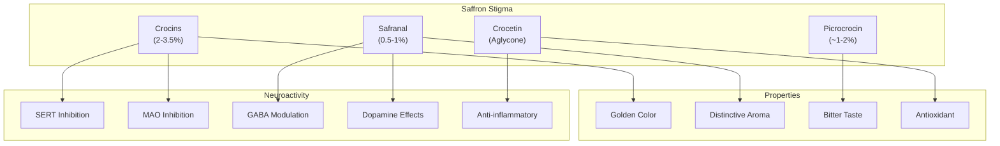

### Crocin: The Golden Antidepressant

| Property | Detail |
|----------|--------|
| **Chemical class** | Water-soluble carotenoid glycoside |
| **Responsible for** | Saffron's deep golden-orange color |
| **Content in affron®** | 2-3.5% (as part of Lepticrosalides®) |
| **Key mechanisms** | SERT inhibition, MAO-A/B inhibition, BDNF upregulation |
| **Bioavailability** | Converted to crocetin for absorption |

**Forms of Crocin:**
- Trans-crocin-4 (digentiobiosyl ester) — most abundant
- Trans-crocin-3
- Trans-crocin-2
- Trans-crocin-1

### Safranal: The Aromatic Anxiolytic

| Property | Detail |
|----------|--------|
| **Chemical class** | Monoterpene aldehyde (volatile) |
| **Responsible for** | Saffron's distinctive aroma |
| **Content in affron®** | 0.5-1% |
| **Key mechanisms** | GABA-A modulation, dopamine effects, antioxidant |
| **Extraction concern** | Heat-sensitive; destroyed above 70°C |

**Why Cool Extraction Matters:**
- Standard extraction uses high heat
- Safranal degrades rapidly above 70°C
- affron® uses proprietary cool extraction (\<70°C)
- Preserves full safranal content for anxiolytic benefits

### Crocetin: The Neuroprotector

| Property | Detail |
|----------|--------|
| **Chemical class** | Carotenoid dicarboxylic acid (crocin aglycone) |
| **Responsible for** | Antioxidant activity, BBB penetration |
| **Key mechanisms** | NF-κB inhibition, ROS scavenging, anti-inflammatory |
| **Bioavailability** | Higher than crocin (lipophilic) |

### Lepticrosalides®: The affron® Quality Marker

affron® is standardized to ≥3.5% **Lepticrosalides®** — a proprietary composite marker:

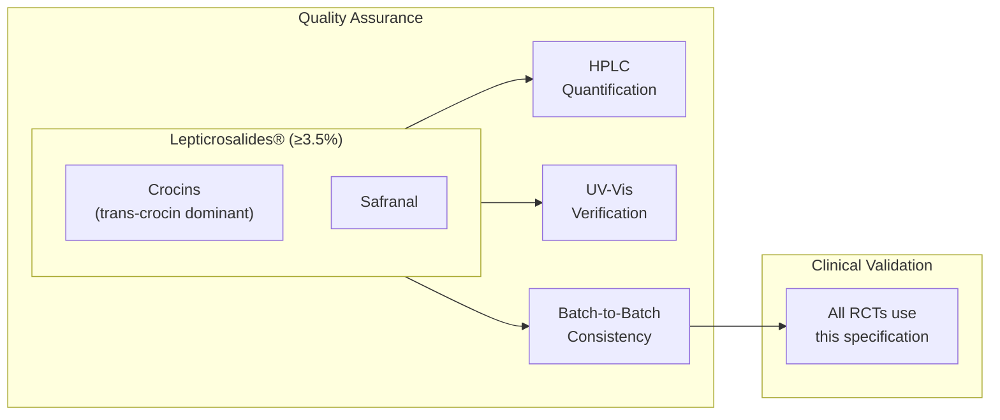

</Accordion>

<Accordion title="Clinical Evidence: Mood & Depression" icon="face-smile">

### Evidence Organization

Clinical studies are organized by branded extract to ensure transparency about which evidence directly supports the selected ingredient (affron®) versus supporting evidence from similar extracts.

---

## affron® Studies (NTRPX Selected Ingredient)

### Landmark Study: Largest Saffron RCT Ever Conducted (2025)

**Citation:** Lopresti AL, Smith SJ, Marx W, et al. An Examination into the Effects of a Saffron Extract (Affron) on Mood and General Wellbeing in Adults Experiencing Low Mood: A Randomized, Double-Blind, Placebo-Controlled Trial. *J Nutr.* 2025;155(7):2300-2311.  
**Link:** [PubMed PMID: 40414301](https://pubmed.ncbi.nlm.nih.gov/40414301/)

| Parameter | Detail |
|-----------|--------|
| **Design** | RCT, double-blind, placebo-controlled |
| **N** | 202 adults (18-70 years) |
| **Population** | Subclinical depressive symptoms |
| **Intervention** | affron® 28mg/day vs. placebo |
| **Duration** | 12 weeks |
| **Primary Outcome** | DASS-21 Depression subscale |

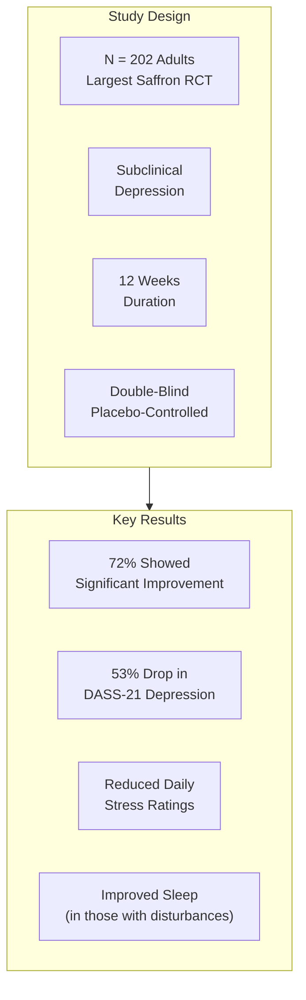

**Primary Outcomes:**

| Measure | affron® Group | Placebo Group | Effect Size |
|---------|--------------|---------------|-------------|
| **DASS-21 Depression** | β = -2.92 points | — | d = 0.39 |
| **Responder rate (≥7 point reduction)** | 72.3% | 54.3% | p = 0.010 |
| **Sleep disturbance (subgroup)** | β = -2.72 points | — | d = 0.44 |

---

### Youth Trial: First Adolescent Study (2018)

**Citation:** Lopresti AL, Drummond PD, Inarejos-García AM, Prodanov M. affron®, a standardised extract from saffron (Crocus sativus L.) for the treatment of youth anxiety and depressive symptoms: A randomised, double-blind, placebo-controlled study. *J Affect Disord.* 2018;232:349-357.  
**Link:** [PubMed PMID: 29510352](https://pubmed.ncbi.nlm.nih.gov/29510352/)

| Parameter | Detail |
|-----------|--------|
| **Design** | RCT, double-blind, placebo-controlled |
| **N** | 80 youth (68 completers) |
| **Population** | Ages 12-16, mild-moderate anxiety/depression |
| **Intervention** | affron® 14mg twice daily (28mg total) vs. placebo |
| **Duration** | 8 weeks |

| Outcome (Youth Self-Report) | affron® | Placebo | p-value |
|-----------------------------|---------|---------|---------|
| **Overall internalizing symptoms** | 33% ↓ | 17% ↓ | p = 0.029 |
| **Separation anxiety** | Significant ↓ | — | p = 0.003 |
| **Social phobia** | Significant ↓ | — | p = 0.023 |
| **Depression** | Significant ↓ | — | p = 0.016 |

**Significance:** First and only saffron trial in adolescents — demonstrating efficacy in a vulnerable population with limited treatment options.

---

### Healthy Adults Mood Study (2017)

**Citation:** Kell G, Rao A, Beccaria G, Clayton P, Inarejos-García AM, Prodanov M. affron® a novel saffron extract (Crocus sativus L.) improves mood in healthy adults over 4 weeks in a double-blind, parallel, randomized, placebo-controlled clinical trial. *Complement Ther Med.* 2017;33:58-64.  
**Link:** [PubMed PMID: 28735826](https://pubmed.ncbi.nlm.nih.gov/28735826/)

| Parameter | Detail |
|-----------|--------|
| **Design** | 3-arm RCT (22mg vs. 28mg vs. placebo) |
| **N** | 128 adults |
| **Population** | Self-reporting low mood (not diagnosed depression) |
| **Duration** | 4 weeks |

**Results:** Both 22mg and 28mg doses significantly improved POMS (Profile of Mood States) scores versus placebo. 28mg showed stronger effects.

---

### Adjunct to Antidepressants (2019)

**Citation:** Lopresti AL, Smith SJ, Hood SD, Drummond PD. Efficacy of a standardised saffron extract (affron®) as an add-on to antidepressant medication for the treatment of persistent depressive symptoms in adults: A randomised, double-blind, placebo-controlled study. *J Psychopharmacol.* 2019;33(11):1415-1427.  
**Link:** [PubMed PMID: 31347436](https://pubmed.ncbi.nlm.nih.gov/31347436/)

| Parameter | Detail |
|-----------|--------|
| **Design** | RCT, double-blind, placebo-controlled |
| **Population** | Adults with persistent depression on antidepressants |
| **Intervention** | affron® 14mg twice daily + existing antidepressant |
| **Duration** | 8 weeks |

**Key Finding:** Clinician-rated MADRS showed significantly greater improvement with saffron adjunct versus placebo adjunct. Demonstrates safety and efficacy when combined with standard antidepressants.

---

### Recreationally-Active Adults (2022)

**Citation:** Lopresti AL, Smith SJ. An examination into the mental and physical effects of a saffron extract (affron®) in recreationally-active adults: A randomized, double-blind, placebo-controlled study. *J Int Soc Sports Nutr.* 2022;19(1):219-238.  
**Link:** [PubMed PMID: 35702753](https://pubmed.ncbi.nlm.nih.gov/35702753/)

| Parameter | Detail |
|-----------|--------|
| **N** | 128 recreationally-active adults |
| **Duration** | 8 weeks |

**Results:** Significant improvements in mood (POMS-SF) and heart rate variability in males. Demonstrates efficacy in healthy, active population.

---

## Safr'Inside™ Studies (Supporting Evidence)

These studies use a different branded saffron extract (Safr'Inside™ by Activ'Inside) with similar standardization. They provide supporting evidence for saffron's efficacy but are not the exact material used in NTRPX.

### Acute Stress Response (2023)

**Citation:** Pourtau L, Joffre F, Gourmelen M, et al. Acute Effect of a Saffron Extract (Safr'InsideTM) and Its Main Volatile Compound on the Stress Response in Healthy Young Men: A Randomized, Double Blind, Placebo-Controlled, Crossover Study. *Nutrients.* 2023;15(13):2921.  
**Link:** [PubMed PMID: 37447245](https://pubmed.ncbi.nlm.nih.gov/37447245/)

| Parameter | Detail |
|-----------|--------|
| **Design** | Crossover RCT, 3-arm |
| **N** | 19 healthy young men (18-25) |
| **Intervention** | Single dose: Safr'Inside™ 30mg vs. safranal 0.06mg vs. placebo |
| **Stress Test** | Maastricht Acute Stress Test (MAST) |

**Key Findings:**
- Saffron and safranal significantly reduced subjective stress and anxiety vs. placebo (p < 0.05)
- Delayed time to peak salivary cortisol and cortisone
- Suggests acute anxiolytic effect and HPA axis modulation

---

### Insomnia Trial (2025)

**Citation:** Jackson PA, et al. Effect of a saffron extract on sleep quality in adults with moderate insomnia: A decentralized, randomized, double-blind, placebo-controlled trial. *Sleep Health.* 2025 (published July 2025).  
**Link:** [ScienceDirect](https://www.sciencedirect.com/science/article/pii/S2590142725000102)

| Parameter | Detail |
|-----------|--------|
| **Design** | 3-arm RCT |
| **N** | 165 adults (28-52 years) |
| **Intervention** | Safr'Inside™ 30mg vs. 20mg vs. placebo |
| **Duration** | 4 weeks |

**Results:**
- Significant reduction in Athens Insomnia Scale (AIS) vs. placebo (β = -0.95, p < 0.05)
- Sleep quality improvements within 21 days
- Perceived stress significantly reduced at both doses

---

## Meta-Analyses (All Saffron Extracts)

### Hausenblas et al. (2013)

**Citation:** Hausenblas HA, Saha D, Dubyak PJ, Anton SD. Saffron (Crocus sativus L.) and major depressive disorder: a meta-analysis of randomized clinical trials. *J Integr Med.* 2013;11(6):377-383.  
**Link:** [PMC Free Article](https://pmc.ncbi.nlm.nih.gov/articles/PMC4643654/)

| Parameter | Finding |
|-----------|---------|
| **Studies included** | 5 RCTs |
| **Effect size vs. placebo** | **d = 1.62** (Large effect) |
| **Effect size vs. antidepressants** | d = -0.04 (No difference) |
| **Conclusion** | "Saffron significantly reduced depression symptoms compared to placebo" |

---

### Marx et al. (2019)

**Citation:** Marx W, Lane M, Rocks T, et al. Effect of saffron supplementation on symptoms of depression and anxiety: a systematic review and meta-analysis. *Nutr Rev.* 2019;77(8):557-571.  
**Link:** [PubMed PMID: 31135916](https://pubmed.ncbi.nlm.nih.gov/31135916/)

| Parameter | Finding |
|-----------|---------|
| **Studies included** | 23 RCTs |
| **Effect size (depression vs. placebo)** | **g = 0.99** (Large) |
| **Effect size (anxiety vs. placebo)** | **g = 0.95** (Large) |
| **Effect size (adjunct to antidepressants)** | g = 1.23 |
| **Note** | Evidence of publication bias; more non-Iranian trials needed |

---

## Head-to-Head: Saffron vs. Antidepressants

Multiple Iranian RCTs compared saffron directly to pharmaceutical antidepressants:

| Study | Extract | N | Duration | Finding | Link |
|-------|---------|---|----------|---------|------|
| **Noorbala 2005** | Generic | 40 | 6 weeks | Saffron 30mg = Fluoxetine 20mg | [PubMed](https://pubmed.ncbi.nlm.nih.gov/15852492/) |
| **Akhondzadeh 2005** | Generic | 40 | 6 weeks | Saffron 30mg = Imipramine 100mg | [PubMed](https://pubmed.ncbi.nlm.nih.gov/15707766/) |
| **Moshiri 2006** | Generic | 40 | 6 weeks | Saffron petal = Fluoxetine 20mg | [PubMed](https://pubmed.ncbi.nlm.nih.gov/16979327/) |
| **Ghajar 2017** | Generic | 66 | 6 weeks | Saffron 30mg = Citalopram (MDD+anxiety) | [PubMed](https://pubmed.ncbi.nlm.nih.gov/28411264/) |

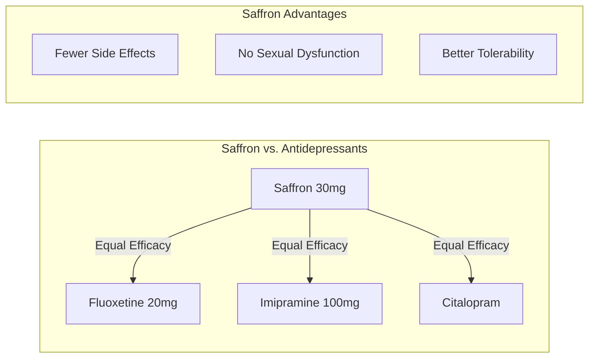

---

### Dose-Response Summary

| Dose | Studies | Efficacy | Notes |
|------|---------|----------|-------|
| **22mg/day** | Kell 2017 (affron®) | Effective | Mood improvement vs. placebo |
| **28mg/day** | Multiple affron® | **Optimal** | Most consistent efficacy; NTRPX dose |
| **30mg/day** | Iranian trials; Safr'Inside™ | Effective | Comparable to SSRIs |

**Conclusion:** 28-30mg/day is the clinically-validated dose range across branded extracts.

</Accordion>

<Accordion title="Clinical Evidence: Anxiety & Stress" icon="shield-heart">

### Anxiety Outcomes Across Trials

| Study | Population | Dose | Duration | Anxiety Outcome |
|-------|------------|------|----------|-----------------|
| **Lopresti 2018** | Youth 12-16 | 28mg | 8 weeks | ↓ Separation anxiety, social phobia |
| **Lopresti 2025** | Adults | 28mg | 12 weeks | ↓ Daily anxiety ratings |
| **Kell 2017** | Adults | 28mg | 4 weeks | ↓ DASS-21 anxiety subscale |
| **Akhondzadeh 2005** | MDD + anxiety | 30mg | 6 weeks | Comparable to imipramine |

### Stress Resilience

The 2025 trial specifically measured daily stress:

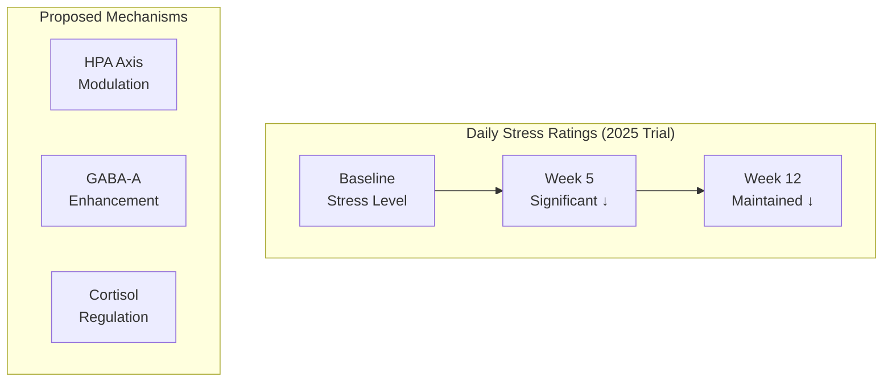

### Cortisol and HPA Axis

| Study | Finding |
|-------|---------|
| **Lopresti 2021 (Sleep)** | No significant effect on evening cortisol (baseline not elevated) |
| **Jackson 2021 (Stress)** | Delayed peak cortisol response to acute stressor |
| **Rat studies** | HPA axis modulation under stress (not baseline) |

**Interpretation:** Saffron appears to modulate the stress response *when stressed*, rather than lowering baseline cortisol. This is consistent with adaptogenic activity.

### Recreationally-Active Adults Study

**Study:** Lopresti & Smith, JISSN, 2022  
**Population:** 128 recreationally-active adults  
**Intervention:** affron® 28mg/day × 8 weeks

| Outcome | Finding |
|---------|---------|
| **Mood (POMS-SF)** | Significant improvement vs. placebo |
| **Physical performance** | No significant difference |
| **Stress response** | Improved |

**Relevance:** Demonstrates efficacy in healthy, active individuals — not just those with mood disorders.

</Accordion>

<Accordion title="Clinical Evidence: Sleep" icon="moon">

### Sleep Enhancement: A Novel Application

Saffron's sleep benefits were initially observed as secondary outcomes in mood trials, then validated in dedicated sleep studies. Evidence is organized by branded extract.

---

## affron® Sleep Studies

### Primary Sleep RCT with Melatonin Discovery (2021)

**Citation:** Lopresti AL, Smith SJ, Drummond PD. An investigation into an evening intake of a saffron extract (affron®) on sleep quality, cortisol, and melatonin concentrations in adults with poor sleep: a randomised, double-blind, placebo-controlled, multi-dose study. *Sleep Med.* 2021;86:7-18.  
**Link:** [PubMed PMID: 34438361](https://pubmed.ncbi.nlm.nih.gov/34438361/)

| Parameter | Detail |
|-----------|--------|
| **Design** | 3-arm RCT (placebo vs. 14mg vs. 28mg) |
| **N** | 120 adults with unsatisfactory sleep |
| **Duration** | 28 days |
| **Timing** | 1 hour before bed |
| **Novel Measure** | Evening salivary melatonin and cortisol |

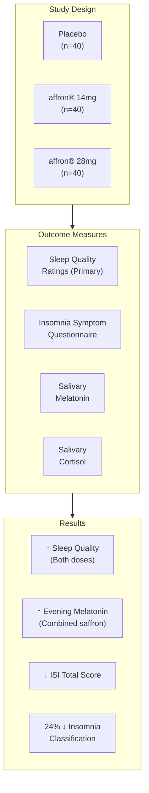

**Key Sleep Findings:**

| Outcome | affron® Effect | Placebo Effect | Significance |
|---------|---------------|----------------|--------------|
| **Sleep quality ratings** | Significant ↑ | Minimal | Primary outcome met |
| **Mood after awakening** | Significant ↑ | Minimal | p < 0.05 |
| **ISQ total score** | Significant ↓ | Minimal | p < 0.05 |
| **Insomnia classification** | 24% reduction | 6% reduction | Significant |
| **Evening melatonin** | Significant ↑ | No change | **Novel finding** |

**Significance:** First human trial demonstrating saffron increases evening melatonin — providing a mechanistic explanation for sleep benefits.

---

### Sleep Quality in Poor Sleepers (2020)

**Citation:** Lopresti AL, Smith SJ, Metse AP, Drummond PD. Effects of saffron on sleep quality in healthy adults with self-reported poor sleep: a randomized, double-blind, placebo-controlled trial. *J Clin Sleep Med.* 2020;16(6):937-947.  
**Link:** [PubMed PMID: 32043961](https://pubmed.ncbi.nlm.nih.gov/32043961/) | [JCSM Full Text](https://jcsm.aasm.org/doi/10.5664/jcsm.8376)

| Parameter | Detail |
|-----------|--------|
| **Design** | RCT, double-blind, placebo-controlled |
| **N** | 63 healthy adults (55 completers) |
| **Population** | Self-reported sleep problems |
| **Intervention** | affron® 14mg twice daily vs. placebo |
| **Duration** | 28 days |

**Results:**
- Significant improvement in ISI total score (p = 0.017)
- Significant improvement in RSQ total score (p = 0.029)
- Significant improvement in sleep quality ratings (p = 0.014)
- Effects emerged within first 7 days

---

## Safr'Inside™ Sleep Studies (Supporting Evidence)

### Insomnia and Stress (2025)

**Citation:** Jackson PA, et al. Effect of a saffron extract on sleep quality in adults with moderate insomnia: A decentralized, randomized, double-blind, placebo-controlled trial. *Sleep Health.* 2025.  
**Link:** [ScienceDirect](https://www.sciencedirect.com/science/article/pii/S2590142725000102)

| Parameter | Detail |
|-----------|--------|
| **Design** | 3-arm RCT |
| **N** | 165 adults with moderate insomnia |
| **Intervention** | Safr'Inside™ 30mg vs. 20mg vs. placebo |
| **Duration** | 4 weeks |

**Results:**
- AIS (Athens Insomnia Scale): β = -0.95 (p < 0.05) vs. placebo
- Sleep quality improvements within 21 days
- 30mg: Reduced PSS (Perceived Stress Scale) β = -1.87 (p = 0.01)
- 20mg: Reduced PSS β = -1.89 (p = 0.04)
- 30mg: Improved PHQ-4 (psychological symptoms) β = -0.79 (p = 0.03)

---

### Gut-Sleep-Brain Axis Pilot (2025)

**Citation:** Lang L, et al. A standardised saffron extract improves subjective and objective sleep quality in healthy older adults with sleep complaints: results from the Gut-Sleep-Brain Axis randomised, double-blind, placebo-controlled pilot study. *Preprint 2025.*

| Parameter | Detail |
|-----------|--------|
| **Design** | RCT, placebo-controlled |
| **N** | 52 older adults |
| **Format** | 30mg gummy |
| **Duration** | 4 weeks |
| **Novel Measure** | Microbiome analysis (n=26 subset) |

**Results:**
- Decreased PSQI global score
- Increased sleep efficiency percentage
- Improved sleep initiation and maintenance
- Increased abundance of beneficial gut bacteria (SCFA producers)

**Significance:** First evidence linking saffron's sleep benefits to gut microbiome modulation.

---

## Mechanism of Sleep Enhancement

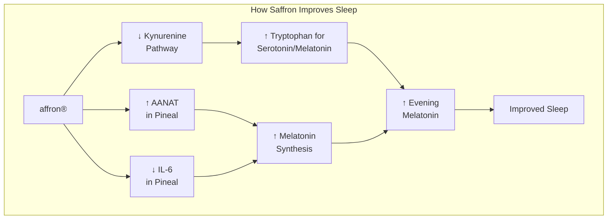

### Rat Study: Mechanism Confirmation (2023)

**Citation:** De la Fuente Muñoz M, et al. Effects of Supplementation with the Standardized Extract of Saffron (affron®) on the Kynurenine Pathway and Melatonin Synthesis in Rats. *Antioxidants.* 2023;12(8):1619.  
**Link:** [PubMed PMID: 37627617](https://pubmed.ncbi.nlm.nih.gov/37627617/)

**Key Mechanistic Findings:**
- affron® reduced hepatic kynurenine pathway enzyme expression (Ido-2, Tod-2, Aadat)
- Increased pineal AANAT expression (rate-limiting melatonin enzyme)
- Decreased pineal IL-6 expression (anti-inflammatory)
- Increased circulating melatonin levels
- Confirmed mechanism for human melatonin findings

---

### Sleep Evidence Summary by Extract

| Extract | Studies | N (Total) | Duration | Key Findings |
|---------|---------|-----------|----------|--------------|
| **affron®** | 3 RCTs | ~238 | 28 days | ↑ Sleep quality, ↑ melatonin, ↓ ISI |
| **Safr'Inside™** | 2 RCTs | ~217 | 4 weeks | ↓ AIS, ↓ stress, microbiome effects |

### Sleep vs. Mood: Optimal Timing

| Application | Optimal Timing | Rationale |
|-------------|----------------|-----------|
| **Mood support** | Morning or afternoon | Sustained serotonergic support |
| **Sleep support** | 1 hour before bed | Melatonin enhancement |
| **NTRPX Sustain** | Afternoon | Mood support primary; sleep benefit secondary via stress reduction |

</Accordion>

<Accordion title="Whole Foods Sources" icon="leaf">

### Saffron in Food

Saffron has been used as a spice for millennia — but culinary doses are far below therapeutic levels:

| Culinary Use | Amount | Bioactives | Therapeutic? |
|--------------|--------|------------|--------------|
| **Paella (4 servings)** | ~0.25g saffron | ~0.5-1mg crocins | ❌ Subtherapeutic |
| **Risotto alla Milanese** | ~0.1-0.2g | ~0.2-0.5mg crocins | ❌ Subtherapeutic |
| **Persian rice (Tahdig)** | ~0.25g | ~0.5-1mg crocins | ❌ Subtherapeutic |
| **Saffron tea (1 cup)** | ~0.05-0.1g | ~0.1-0.3mg crocins | ❌ Subtherapeutic |
| **Bouillabaisse** | ~0.1g | ~0.2-0.3mg crocins | ❌ Subtherapeutic |

### The Dose Gap

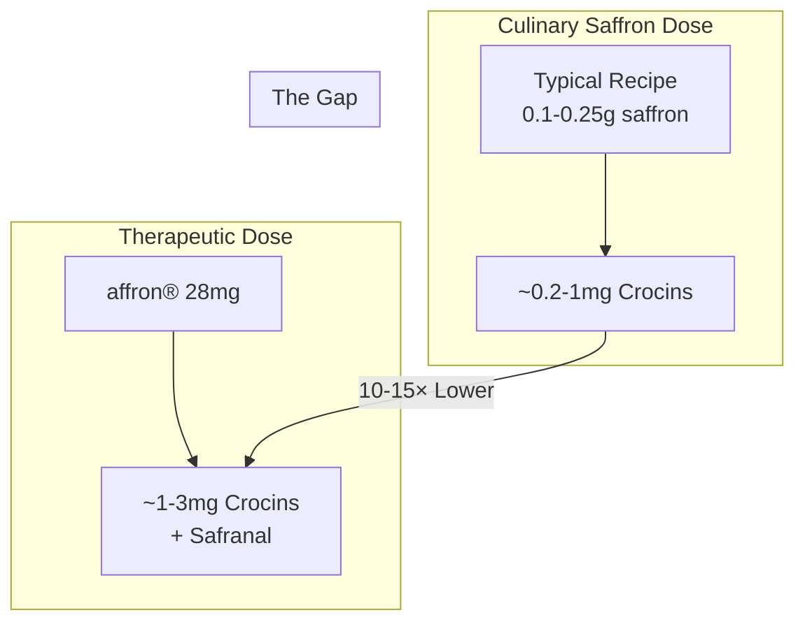

### Food Equivalents for Therapeutic Effect

To match affron® 28mg (≥3.5% Lepticrosalides®), you would need:

| Approach | Daily Amount | Cost | Practical? |
|----------|--------------|------|------------|
| **Saffron threads (Grade I)** | ~200-400mg | $3-8/day | ⚠️ Expensive |
| **Saffron-heavy dishes** | 3-5 servings/day | $15-30/day | ❌ Impractical |
| **Saffron tea** | 10-20 cups/day | $10-20/day | ❌ Impractical |

### Why Supplementation Makes Sense

| Factor | Dietary Saffron | affron® Extract |
|--------|-----------------|-----------------|
| **Dose consistency** | Highly variable | Standardized 28mg |
| **Bioactive content** | Unknown | ≥3.5% Lepticrosalides® |
| **Cost per effective dose** | $3-8/day (threads) | ~$0.50-1/day |
| **Convenience** | Requires cooking | Single capsule |
| **Clinical validation** | None at culinary doses | 10+ RCTs |

### Traditional Saffron-Producing Regions

| Country | % Global Production | Traditional Uses |
|---------|---------------------|------------------|
| **Iran** | ~90% | Mood, digestion, complexion |
| **Spain** | ~5% | Paella, festive dishes |
| **India (Kashmir)** | ~3% | Ayurvedic medicine |
| **Greece** | ~1% | Traditional medicine |
| **Morocco** | \<1% | Culinary, traditional |

### affron® Sourcing

affron® is produced from **Spanish saffron** (La Mancha region):
- Crocus sativus L. stigmas only (no petals or styles)
- Hand-harvested during 2-week October flowering
- Cool aqueous extraction (\<70°C)
- Manufactured in Madrid by Pharmactive Biotech Products

<Note>
**The Bottom Line:** While enjoying saffron in food provides modest antioxidant benefits and culinary pleasure, achieving therapeutic mood-supporting effects requires concentrated, standardized extraction. affron® delivers clinically-validated doses impossible to obtain from diet alone.
</Note>

</Accordion>

<Accordion title="Safety & Classification" icon="shield-check">

### Adverse Event Profile

affron® has an excellent safety record across all clinical trials:

| Event | Incidence | Severity | Notes |
|-------|-----------|----------|-------|
| **Headache** | Rare (\<5%) | Mild | Often decreased vs. placebo in trials |
| **GI discomfort** | Rare (\<3%) | Mild | Usually transient |
| **Drowsiness** | Rare | Mild | Not sedating at 28mg |
| **Appetite changes** | Rare | Mild | Some reports of ↓ appetite |
| **Dry mouth** | Very rare | Mild | — |

### Safety Data from Clinical Trials

| Parameter | Finding |
|-----------|---------|
| **Largest trial (n=202)** | Well-tolerated; no serious adverse events |
| **Youth trial (n=80)** | Safe in adolescents 12-16; trend toward reduced headaches |
| **Sleep trial (n=120)** | "Well-tolerated with no reported significant adverse effects" |
| **Meta-analysis conclusion** | "Similar tolerability to placebo" |

### Toxicity Data

| Parameter | Value | Notes |
|-----------|-------|-------|
| **LD50 (mice, oral)** | 20.7 g/kg | Very low toxicity |
| **Toxic dose (humans)** | >5 g/day | ~175× therapeutic dose |
| **Teratogenic dose** | >5 g/day | Only at extreme doses |
| **Therapeutic dose** | 28-30 mg | Massive safety margin |

### Regulatory Status

| Region | Status |
|--------|--------|
| **United States** | GRAS (dietary supplement) |
| **European Union** | Novel food; EFSA opinion requested |
| **EFSA Health Claim** | "Positive mood" claim approved for affron® |
| **Canada** | Licensed NHP |
| **Australia** | Listed medicine |

### EFSA Health Claim Approval

In 2021, EFSA (European Food Safety Authority) issued a positive opinion on affron® for a "positive mood" health claim — a rare achievement for a botanical ingredient, requiring substantial evidence of efficacy and safety.

### Contraindications

| Condition | Concern | Recommendation |
|-----------|---------|----------------|
| **Pregnancy** | High doses may stimulate uterus | Avoid therapeutic doses; culinary amounts likely safe |
| **Bipolar disorder** | May trigger mania (theoretical) | Use only under psychiatric supervision |
| **Bleeding disorders** | Theoretical antiplatelet effect | Caution; consult provider |
| **Scheduled surgery** | Theoretical bleeding risk | Discontinue 2 weeks prior |
| **Concurrent antidepressants** | Serotonergic addition | Usually safe but consult provider |

### Drug Interactions

| Drug Class | Interaction | Severity | Management |
|------------|-------------|----------|------------|
| **SSRIs/SNRIs** | Additive serotonergic | Low-Moderate | Usually safe; may enhance effect |
| **MAOIs** | Additive MAO inhibition | Moderate | Caution; saffron's MAO-I is mild |
| **Anticoagulants** | Theoretical ↑ bleeding | Low | Monitor if concerned |
| **Sedatives** | Possible additive | Low | Usually not problematic |
| **Lithium** | Unknown | Low | Use with caution |

<Note>
**Saffron + Antidepressants:** Several studies have used saffron as an *adjunct* to standard antidepressants with positive results and good tolerability. However, anyone on psychiatric medication should consult their prescriber before adding saffron.
</Note>

### Special Populations

| Population | Safety Status | Notes |
|------------|---------------|-------|
| **Healthy adults** | Well-established | Primary study population |
| **Subclinical depression** | Well-established | 2025 trial (n=202) |
| **Youth (12-16)** | Established | affron® trial (n=80) |
| **Elderly** | Limited data | Likely safe; use standard dose |
| **Pregnancy** | Avoid | Therapeutic doses contraindicated |
| **Lactation** | Insufficient data | Caution advised |
| **Type 2 diabetes** | Positive data | May improve glycemic status |

### Tier Classification

### <Icon icon="star" color="#64748b" /> Tier 2: Supported

<CardGroup cols={3}>
<Card title="Efficacy" icon="check" color="#64748b">High (Mood, Anxiety, Sleep)</Card>
<Card title="Validation" icon="check" color="#64748b">Strong — 10+ RCTs; EFSA health claim</Card>
<Card title="Safety" icon="check" color="#64748b">Excellent — GRAS; comparable to placebo</Card>
</CardGroup>

**Tier Rationale:** Tier 2 (Supported) classification. Saffron (affron®) demonstrates consistent, clinically-meaningful benefits for mood, anxiety, and sleep across multiple well-designed RCTs, including the largest saffron trial ever conducted (n=202). Effect sizes for depression are large (d=1.62 vs. placebo) and comparable to pharmaceutical antidepressants. Mechanisms are well-elucidated (SERT, MAO, GABA, BDNF, melatonin). Safety is excellent with GRAS status and an EFSA-approved health claim. Not Tier 1 (Foundation) because primary applications are mood-specific rather than foundational metabolic support, and long-term (>12 week) data is more limited than for compounds like creatine.

</Accordion>

<Accordion title="Synergies within NTRPX" icon="diagram-project">

### Sustain Stack Integration

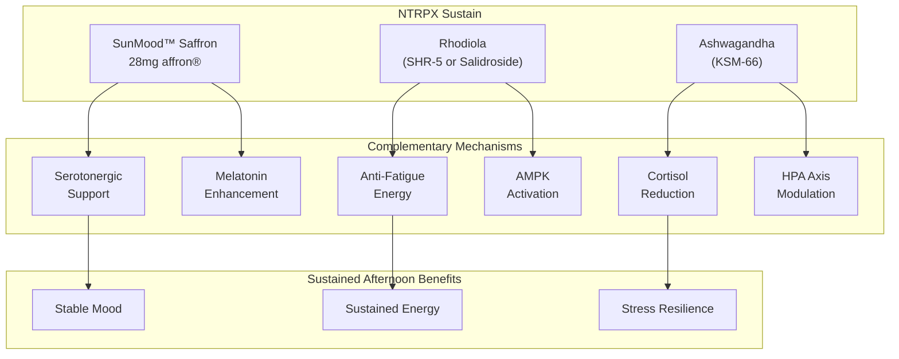

### The Adaptogenic Triad

Sustain's three adaptogens address different aspects of afternoon performance:

| Compound | Primary Target | Afternoon Benefit |
|----------|---------------|-------------------|
| **Saffron (affron®)** | Serotonin, mood | Emotional stability when stress accumulates |
| **Rhodiola** | Fatigue, energy | Combat afternoon energy dip |
| **Ashwagandha** | Cortisol, HPA axis | Buffer accumulating stress hormones |

### Why Saffron in Sustain (Not Recover)?

| Consideration | Sustain (Afternoon) | Recover (Evening) |
|---------------|---------------------|-------------------|
| **Primary benefit** | Mood support | Sleep promotion |
| **Mechanism alignment** | Serotonergic support for daytime mood | Already have glycine, Mg, etc. |
| **Energy impact** | Non-sedating | N/A (sleep is goal) |
| **Clinical dosing** | 28mg once daily | Would duplicate mechanisms |
| **Circadian logic** | Afternoon mood dip is common | Evening has dedicated sleep stack |

### Cross-Product Synergies

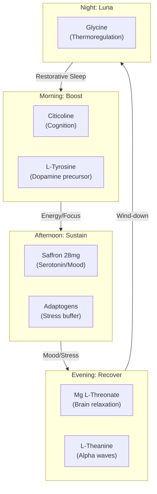

### Saffron + Ashwagandha: Complementary Anxiolysis

Both reduce anxiety but through different mechanisms:

| Mechanism | Saffron | Ashwagandha |
|-----------|---------|-------------|
| **GABA-A modulation** | ✓ (Safranal) | ✓ (Triethylene glycol) |
| **Serotonin enhancement** | ✓ (Primary) | Indirect |
| **HPA axis modulation** | Under stress only | ✓ (Primary; ↓ cortisol) |
| **BDNF upregulation** | ✓ | ✓ |

**Synergy:** Saffron addresses the *neurotransmitter* aspect of anxiety; ashwagandha addresses the *hormonal* aspect. Together, they provide comprehensive anxiolytic coverage.

### Saffron + Rhodiola: Mood + Energy

| Attribute | Saffron | Rhodiola |
|-----------|---------|----------|
| **Energy** | Neutral | ↑ Anti-fatigue |
| **Mood** | ↑ Primary | Modest |
| **Stress response** | ↑ Modulates | ↑ Adaptation |
| **Mechanism** | Serotonergic | AMPK, MAO (mild) |

**Synergy:** Rhodiola prevents afternoon fatigue; saffron prevents afternoon mood dip. Complementary targets, additive benefit.

</Accordion>

<Accordion title="Historical & Biochemical Context" icon="book">

### The 3,500-Year History of Saffron

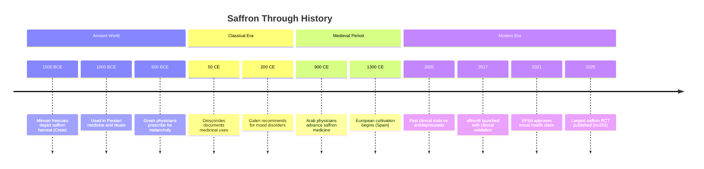

### Ancient Medicinal Uses

| Culture | Traditional Application |
|---------|------------------------|
| **Persian** | Melancholy, women's health, aphrodisiac |
| **Greek** | Depression ("melancholia"), sleep, mood |
| **Roman** | Perfume, medicine, luxury |
| **Chinese** | Blood circulation, emotional disorders |
| **Ayurvedic** | Complexion, mood, vitality |

### The Most Expensive Spice

| Fact | Value |
|------|-------|
| **Flowers per kg saffron** | ~150,000 |
| **Stigmas per flower** | 3 |
| **Harvest window** | 2 weeks (October) |
| **Harvest method** | Hand-picking only |
| **Price per kg** | $3,000-10,000+ |
| **Why so valuable** | Labor-intensive; low yield |

### Crocus sativus: The Plant

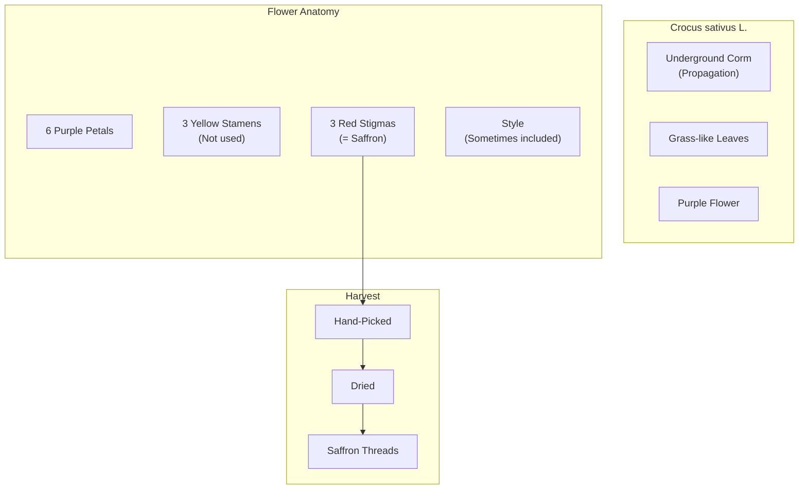

### Biochemical Synthesis in the Plant

```mermaid
flowchart LR
    subgraph PRECURSOR["Carotenoid Pathway"]
        ZEAXANTHIN["Zeaxanthin<br>(Precursor)"]
    end
    
    subgraph CLEAVAGE["Enzymatic Cleavage"]
        ZEAXANTHIN --> CCD["Carotenoid Cleavage<br>Dioxygenase"]
        CCD --> CROCETIN_PRE["Crocetin<br>Dialdehyde"]
    end
    
    subgraph PRODUCTS["Saffron Bioactives"]
        CROCETIN_PRE --> CROCETIN_F["Crocetin"]
        CROCETIN_F --> |"Glycosylation"| CROCIN_F["Crocins"]
        CROCETIN_PRE --> PICROCROCIN_F["Picrocrocin"]
        PICROCROCIN_F --> |"Hydrolysis"| SAFRANAL_F["Safranal"]
    end
```

### Why Saffron Can't Be Synthesized Economically

| Challenge | Explanation |
|-----------|-------------|
| **Crocin complexity** | Multiple glycosylation patterns; stereospecific |
| **Safranal volatility** | Easily lost; requires gentle handling |
| **Synergy** | Bioactives work together; isolates less effective |
| **Agricultural adaptation** | Plant optimized over millennia |

**Result:** Natural extraction remains the only practical source. affron® uses proprietary cool extraction to maximize bioactive retention.

### Etymology

| Term | Origin | Meaning |
|------|--------|---------|
| **Saffron** | Arabic "za'farān" | Yellow |
| **Crocus** | Greek "krokos" | Thread (stigma shape) |
| **Sativus** | Latin | Cultivated |

</Accordion>

<Accordion title="Practical Considerations" icon="clipboard-list">

### When to Use Saffron (affron®)

| Scenario | Expected Benefit | Protocol |
|----------|------------------|----------|
| **Subclinical low mood** | *High* | 28mg daily, 8-12 weeks |
| **Mild-moderate depression** | *High* | 28mg daily, 12+ weeks |
| **Generalized anxiety** | *Moderate-High* | 28mg daily, 8 weeks |
| **Stress-related mood dip** | *High* | 28mg daily, ongoing |
| **PMS mood symptoms** | *Moderate* | 28mg daily, cycle-based |
| **Afternoon mood/energy** | *Moderate* | 28mg with Sustain |
| **Sleep quality (secondary)** | *Moderate* | 28mg, 4-8 weeks |

### Realistic Expectations

| Timeframe | What to Expect |
|-----------|----------------|
| **Week 1** | Subtle; possible mild relaxation |
| **Week 2-4** | Emerging mood improvement |
| **Week 4-8** | Clear mood/anxiety benefits |
| **Week 8-12** | Full effect; sustained benefit |
| **Ongoing** | Maintained with continued use |

### Signs It's Working

| Indicator | Description |
|-----------|-------------|
| **Brighter mood** | Less "heaviness"; more positive outlook |
| **Reduced anxiety** | Less rumination; calmer baseline |
| **Better stress response** | Challenges feel more manageable |
| **Improved sleep** | Easier onset; better quality |
| **Emotional resilience** | Faster recovery from setbacks |

### Administration Tips

| Tip | Rationale |
|-----|-----------|
| **Take with Sustain (afternoon)** | Aligns with NTRPX circadian protocol |
| **Consistent daily use** | Serotonergic benefits build over time |
| **With or without food** | No significant absorption difference |
| **Be patient** | Full benefits at 8-12 weeks |
| **Don't expect sedation** | Saffron improves mood, not sedates |

### Frequently Asked Questions

<AccordionGroup>

<Accordion title="How does saffron compare to St. John's Wort?">
Both are evidence-based botanicals for mood. Key differences:
- **St. John's Wort:** More drug interactions (CYP450 induction); may affect birth control, HIV meds, etc.
- **Saffron:** Minimal drug interactions; safer with medications
- **Efficacy:** Both comparable to SSRIs in trials
- **NTRPX choice:** Saffron due to superior safety profile and interaction compatibility
</Accordion>

<Accordion title="Can I take saffron with my antidepressant?">
In clinical trials, saffron has been used as an adjunct to SSRIs with good tolerability and enhanced effects. However, you should ALWAYS consult your prescribing physician before combining any supplement with psychiatric medication. Do not stop or modify your medication without medical guidance.
</Accordion>

<Accordion title="Is saffron safe for teenagers?">
Yes — affron® is one of the few saffron extracts tested in adolescents (12-16 years) with positive results for anxiety and depression symptoms. However, youth mental health should be managed with appropriate professional support. Saffron may be considered as part of a comprehensive approach, not as sole treatment.
</Accordion>

<Accordion title="Will saffron make me drowsy?">
No. At the 28mg dose, saffron is not sedating. It improves mood and may secondarily improve sleep quality (via melatonin enhancement), but it doesn't cause daytime drowsiness. This is why it's suitable for afternoon use in Sustain.
</Accordion>

<Accordion title="How is affron® different from other saffron supplements?">
affron® is the most clinically-validated saffron extract:
- **10+ published RCTs** specifically with affron®
- **Lepticrosalides® standardization** (proprietary bioactive marker)
- **Cool extraction** preserves heat-sensitive safranal
- **EFSA health claim approval** for "positive mood"
- **Manufactured by Pharmactive** (Madrid) with full traceability

Generic saffron extracts lack this validation.
</Accordion>

<Accordion title="Why 28mg and not higher?">
28mg is the dose used in the majority of positive clinical trials. Higher doses have been tested (up to 100mg), but don't show proportionally greater benefits and increase cost. 28mg represents the optimal efficacy-to-cost ratio supported by evidence.
</Accordion>

<Accordion title="Can saffron help with PMS symptoms?">
Yes. Several trials have shown saffron improves PMS-related mood symptoms, though this isn't the primary focus of affron® research. The serotonergic effects are particularly relevant for premenstrual mood disturbance.
</Accordion>

<Accordion title="Is saffron safe long-term?">
The longest published trial is 12 weeks with excellent safety. Saffron has been consumed as a spice for 3,500 years. While very long-term supplementation data is limited, there's no mechanistic concern for tolerance, dependence, or cumulative toxicity at the 28mg dose.
</Accordion>

</AccordionGroup>

</Accordion>

</AccordionGroup>

---

<Tip>
**SunMood Summary:** Saffron extract (affron® 28mg in Sustain) is the most clinically-validated botanical for mood support — with over 10 published RCTs demonstrating effects comparable to SSRI antidepressants but with superior tolerability. The active compounds crocin and safranal work through serotonin reuptake inhibition, MAO inhibition, GABA modulation, BDNF upregulation, and a novel melatonin-enhancing pathway via kynurenine modulation. The 2025 trial (n=202) — the largest saffron study ever — showed 72% of participants experienced significant mood improvement with 53% reduction in depression scores. affron® specifically is standardized to ≥3.5% Lepticrosalides®, uses cool extraction to preserve heat-sensitive compounds, and carries an EFSA-approved health claim for "positive mood." In NTRPX Sustain, SunMood™ Saffron provides afternoon mood resilience when stress accumulates — not through sedation, but through *neurochemical optimization* that supports emotional balance and sustained wellbeing.
</Tip>

---

<Note>
**Version:** 1.0 | **Last Updated:** January 23, 2026 | **Document Status:** Complete Clinical Monograph

This monograph establishes the Saffron (affron®) framework for NTRPX Systems. affron® was selected over alternative branded extracts (e.g., Safr'Inside™) based on its unmatched clinical trial portfolio, EFSA health claim approval, and Lepticrosalides® standardization. The 28mg dose aligns with the majority of positive RCTs. Placement in Sustain (afternoon) optimizes for daytime mood support while avoiding redundancy with the dedicated sleep compounds in Recover/Luna.
</Note>