## PureRosea Salidroside

<CardGroup cols={4}>

<Card title="Sprint™" icon="bolt" color="#5A8FA8">
30 mg (≥98% pure)
</Card>

<Card title="Boost" icon="rocket-launch" color="#5A8FA8">
15 mg (≥98% pure)
</Card>

<Card title="Purity" icon="gem" color="#5A8FA8">
≥98% Salidroside
</Card>

<Card title="Source" icon="leaf" color="#5A8FA8">
Precision Fermentation
</Card>

</CardGroup>

**The golden root's most powerful molecule — purified, sustainable, and precisely dosed.** Salidroside is the primary bioactive compound responsible for Rhodiola rosea's legendary adaptogenic effects. But wild Rhodiola is now an *endangered species*, making traditional sourcing both ecologically harmful and supply-limited. NTRPX solves this with precision fermentation: biosynthetic salidroside that is *molecularly identical* to the plant-derived compound, produced sustainably at pharmaceutical-grade purity (≥98%). This isn't a crude extract with 1-3% active content — it's the *pure molecule itself*, delivering exact therapeutic doses of 15-30 mg that match or exceed clinical trial efficacy. Salidroside activates AMPK for cellular energy, mildly inhibits MAO to preserve dopamine and serotonin, modulates the HPA axis for stress resilience, and provides direct neuroprotection. In NTRPX Sprint and Boost, PureRosea Salidroside represents the convergence of *traditional wisdom*, *modern biotechnology*, and *environmental responsibility*.

<AccordionGroup>

<Accordion title="Mechanism of Action" icon="flask">

Salidroside (C₁₄H₂₀O₇) is a phenylpropanoid glycoside — specifically, a tyrosol glycoside — with multiple complementary mechanisms:

### Mechanism 1: AMPK Activation

AMPK (AMP-activated protein kinase) is the master cellular energy sensor. Salidroside is a potent AMPK activator:

| AMPK Downstream Effect | Mechanism | Benefit |
|------------------------|-----------|---------|
| **Mitochondrial biogenesis** | PGC-1α activation | *More cellular powerhouses* |
| **Glucose uptake** | GLUT4 translocation | *Better brain fuel delivery* |
| **Fatty acid oxidation** | ACC inhibition | *Alternative energy pathway* |
| **Autophagy** | mTOR modulation | *Cellular cleanup and renewal* |

### Mechanism 2: MAO Inhibition

Salidroside mildly inhibits monoamine oxidase, preserving key neurotransmitters:

| Parameter | Salidroside | Pharmaceutical MAOIs |
|-----------|-------------|---------------------|
| Inhibition strength | *Mild* | Strong |
| Reversibility | *Reversible* | Often irreversible |
| Selectivity | Non-selective (A & B) | Often selective |
| Dietary restrictions | *None required* | Tyramine avoidance |
| Safety profile | *Excellent* | Significant concerns |

### Mechanism 3: HPA Axis Modulation

Salidroside modulates the hypothalamic-pituitary-adrenal stress response:

| HPA Component | Salidroside Effect | Outcome |
|---------------|-------------------|---------|
| Hypothalamus (CRH) | Modulates release | Appropriate stress signaling |
| Pituitary (ACTH) | Buffers response | Balanced activation |
| Adrenal (Cortisol) | *Prevents overproduction* | Stress resilience without excess |

The adaptogenic effect involves regulation of key stress mediators including *TNF-α, IL-2, IL-6, Bcl-2, and COX-2* — allowing appropriate stress response without overactivation.

### Mechanism 4: Hypoxia Adaptation

Salidroside supports cellular function under low-oxygen conditions:

| Pathway | Effect | Application |
|---------|--------|-------------|
| **HIF-1α stabilization** | ↑ Hypoxia tolerance | High altitude, intense exercise |
| **Oxygen uptake** | ↑ Efficiency | Endurance performance |
| **Mitochondrial protection** | ↓ Hypoxic damage | Neuroprotection |

### Molecular Identity

| Property | Value |
|----------|-------|
| IUPAC Name | 4-Hydroxyphenethyl β-D-glucopyranoside |
| Synonyms | Rhodioloside, Rhodosin |
| Molecular Formula | C₁₄H₂₀O₇ |
| Molecular Weight | 300.31 g/mol |
| CAS Number | 10338-51-9 |
| Appearance | White crystalline powder |
| Solubility | Water soluble |
| Taste | Characteristically bitter |
| NTRPX Purity | **≥98%** |

### Complete Mechanism Summary

| Mechanism | Target | Effect | Timeline |
|-----------|--------|--------|----------|
| **AMPK activation** | Cellular energy | ↑ ATP, mitochondria | Acute + chronic |
| **MAO inhibition** | Monoamines | ↑ DA, 5-HT, NE | Acute (hours) |
| **HPA modulation** | Stress axis | Balanced cortisol | Develops over days-weeks |
| **HIF-1α support** | Hypoxia response | ↑ Oxygen adaptation | Acute + chronic |
| **Neuroprotection** | Neurons | ↓ Damage, ↑ BDNF | Chronic |

</Accordion>

<Accordion title="Why Pure Salidroside" icon="gem">

### The Problem with Traditional Rhodiola

Two critical issues make standardized Rhodiola extracts problematic:

**The Sustainability Crisis:**
Rhodiola rosea is now classified as an *endangered species* in many regions. Collection and trade are severely limited. Traditional harvesting is:
- Ecologically destructive
- Supply-constrained
- Increasingly regulated

### The Precision Fermentation Solution

NTRPX uses salidroside produced via *precision fermentation* — a biotechnology process that creates the exact same molecule without harvesting endangered plants:

| Parameter | Traditional Extract | Precision Fermentation |
|-----------|--------------------|-----------------------|
| **Source** | Endangered plant | Sustainable bioprocess |
| **Environmental impact** | *High* (habitat destruction) | *Minimal* |
| **Supply stability** | Variable, threatened | *Unlimited, consistent* |
| **Purity** | 1-3% salidroside | *≥98% salidroside* |
| **Batch consistency** | Variable | *Highly consistent* |
| **GMO status** | N/A | *GMO-free final product* |

### Molecular Identity: Plant vs Fermented

The salidroside from precision fermentation is a *biosynthetic replica* — molecularly identical to plant-derived salidroside:

| Property | Plant-Derived | Fermentation-Derived |
|----------|---------------|---------------------|
| Molecular structure | C₁₄H₂₀O₇ | C₁₄H₂₀O₇ |
| CAS number | 10338-51-9 | 10338-51-9 |
| Biological activity | Active | *Identical activity* |
| Purity achievable | Limited by matrix | *≥98% readily achieved* |

### Dose Comparison: Extract vs Pure

| Product Type | Typical Dose | Salidroside Content | Precision |
|--------------|--------------|---------------------|-----------|
| Root powder | 1-3 g | ~3-10 mg | Low |
| Standard extract (1% sal) | 200-600 mg | 2-6 mg | Moderate |
| High-sal extract (3% sal) | 100-300 mg | 3-9 mg | Moderate |
| **Pure salidroside (≥98%)** | **15-30 mg** | **15-30 mg** | ***Exact*** |

**Clinical equivalence:** Research shows that Rhodiola extract clinical benefits correspond to approximately *10-20 mg salidroside*. With pure salidroside at 15-30 mg, you deliver this amount — or more — without hundreds of milligrams of plant matrix.

<Note>
**The NTRPX Principle:** We don't compromise between efficacy and sustainability. Precision-fermented salidroside delivers the *exact molecule* responsible for Rhodiola's benefits, at pharmaceutical purity, without environmental harm. This is the future of botanical supplementation.
</Note>

</Accordion>

<Accordion title="Anti-Fatigue & Performance Research" icon="battery-full">

### Clinical Evidence Summary

Salidroside/Rhodiola research demonstrates consistent benefits for fatigue reduction and performance:

### Clinical Trials (Rhodiola Extracts — Salidroside as Primary Active)

These trials used Rhodiola extracts; benefits correlate to salidroside content (~10-20 mg equivalent):

| Study | Design | N | Extract Dose | Est. Salidroside | Finding |
|-------|--------|---|--------------|------------------|---------|
| **Spasov 2000** | RCT | 60 | 100 mg SHR-5 | ~10 mg | *↑ Mental performance, ↓ fatigue (students)* |
| **Shevtsov 2003** | RCT | 56 | 170 mg | ~10-17 mg | *↑ Cognitive function (night-shift physicians)* |
| **Darbinyan 2000** | RCT | 40 | 100 mg | ~10 mg | *↑ Mental work capacity* |
| **Olsson 2009** | RCT | 60 | 576 mg | ~15-20 mg | *↓ Burnout, ↓ fatigue, ↑ attention* |
| **Cropley 2015** | RCT | 80 | 200 mg | ~10-15 mg | *↓ Stress, ↓ anxiety, ↓ fatigue* |
| **De Bock 2004** | RCT | 24 | 200 mg | ~10-15 mg | *↑ Endurance exercise capacity* |

### Pure Salidroside Study

| Study | Design | Dose | Finding |
|-------|--------|------|---------|
| **Clinical (salidroside)** | Clinical | 60 mg salidroside | *↑ Oxygen uptake, ↑ mood* |

### NTRPX Dosing vs Clinical Evidence

| NTRPX Product | Salidroside Dose | Clinical Comparison |
|---------------|------------------|---------------------|
| **Boost** | 15 mg | Matches clinical range (10-20 mg) |
| **Sprint** | 30 mg | Exceeds clinical range; approaches enhanced-effect |
| Combined | 45 mg | High therapeutic dose |

### Mechanism of Anti-Fatigue Effects

| Pathway | Contribution |
|---------|--------------|
| **AMPK activation** | ↑ Cellular ATP production |
| **Mitochondrial biogenesis** | ↑ Energy capacity long-term |
| **MAO inhibition** | ↑ Dopamine (motivation), NE (alertness) |
| **HPA modulation** | ↓ Energy drain from cortisol excess |
| **Glucose uptake** | ↑ Brain fuel availability |

### Physical Performance Evidence

| Outcome | Evidence Level | Mechanism |
|---------|----------------|-----------|
| ↑ Endurance capacity | Moderate-High | AMPK, mitochondria |
| ↓ Perceived exertion | Moderate | Central fatigue reduction |
| ↑ Oxygen efficiency | Moderate | HIF-1α pathway |
| ↓ Lactate accumulation | Preclinical | Enhanced oxidative metabolism |

### Effect Timeline

| Timeframe | Anti-Fatigue Effect | Notes |
|-----------|---------------------|-------|
| Single dose | *Noticeable* — acute AMPK, MAO effects | Onset within 1-2 hours |
| 1-2 weeks | Building — HPA modulation developing | Chronic adaptogenic effects |
| 4+ weeks | *Full effect* — complete adaptation | Sustained with continued use |

<Note>
**Dose Validation:** The typical 15-30 mg dose range for pure salidroside is based on: (1) clinical Rhodiola studies showing benefits at ~10-20 mg salidroside equivalent, (2) pure salidroside study showing enhanced effects at 60 mg, and (3) market-leading pure salidroside products recommending 15-30 mg. NTRPX Sprint at 30 mg delivers a clinically-meaningful dose at the upper therapeutic range.
</Note>

</Accordion>

<Accordion title="Neuroprotection Deep Dive" icon="brain">

### Salidroside's Neuroprotective Mechanisms

Salidroside provides multi-pathway neuroprotection:

### Key Neuroprotective Pathways

| Pathway | Salidroside Action | Downstream Effect |
|---------|-------------------|-------------------|
| **PI3K/Akt** | Activation | ↑ Cell survival, ↓ apoptosis |
| **Nrf2/ARE** | Nuclear translocation | ↑ Antioxidant enzymes (SOD, CAT, GPx) |
| **NF-κB** | Inhibition | ↓ TNF-α, IL-1β, IL-6 |
| **BDNF/TrkB** | Upregulation | ↑ Neuroplasticity, ↑ neurogenesis |
| **HIF-1α** | Stabilization | ↑ Hypoxia tolerance |

### Antioxidant Defense Enhancement

| Mechanism | Evidence |
|-----------|----------|
| ↑ SOD (superoxide dismutase) | Multiple preclinical studies |
| ↑ Catalase | Consistent finding |
| ↑ Glutathione peroxidase | Established |
| ↓ MDA (lipid peroxidation) | Consistent marker reduction |
| Direct ROS scavenging | Moderate intrinsic activity |

### Anti-Inflammatory Actions

Salidroside inhibits the NF-κB inflammatory cascade:

| Inflammatory Marker | Effect | Relevance |
|---------------------|--------|-----------|
| TNF-α | ↓ | Major inflammatory cytokine |
| IL-1β | ↓ | Neuroinflammation driver |
| IL-6 | ↓ | Systemic inflammation |
| COX-2 | ↓ | Prostaglandin synthesis |

### BDNF Upregulation

BDNF (brain-derived neurotrophic factor) supports:

| BDNF Function | Cognitive Relevance |
|---------------|---------------------|
| Neuronal survival | Long-term brain health |
| Synaptogenesis | Learning, memory formation |
| Neuroplasticity | Adaptation, cognitive flexibility |
| Hippocampal neurogenesis | Memory consolidation |

### Preclinical Neuroprotection Studies

| Study | Model | Finding |
|-------|-------|---------|
| **Chen 2012** | PC12 cells, oxidative stress | *↓ Apoptosis, ↑ cell survival* |
| **Zhang 2013** | Rats, cognitive function | *↑ BDNF, ↑ memory* |
| **Li 2017** | Mice, chronic fatigue | *↓ Neuroinflammation, ↑ mitochondria* |
| **Mao 2010** | Rats, hypoxia | *↑ HIF-1α, ↑ survival* |

</Accordion>

<Accordion title="Pharmacokinetic Profile" icon="chart-line">

### ADME Parameters (Pure Salidroside)

| Parameter | Value | Notes |
|-----------|-------|-------|
| **Bioavailability** | ~32% (oral) | Well-characterized |
| **Tmax** | 0.5-1 hour | Rapid absorption |
| **Half-life** | ~3-4 hours | Moderate duration |
| **Distribution** | Crosses BBB | CNS penetration confirmed |
| **Metabolism** | Glucuronidation, sulfation | Phase II conjugation |
| **Excretion** | Renal (as conjugates) | Primary route |

### Absorption and Distribution

### Plasma and Effect Timeline

| Time After Dose | Plasma Level | Brain Level | Functional Effect |
|-----------------|--------------|-------------|-------------------|
| 0 min | Baseline | Baseline | None |
| 15-30 min | Rising rapidly | Rising | Emerging |
| 30-60 min | *Peak* | *Peak* | *Maximal acute effect* |
| 2 hours | Moderate | Moderate | Sustained |
| 4 hours | Low | Low | Waning |
| 6 hours | Minimal | Minimal | Residual |

### Advantage of Pure Salidroside PK

| Parameter | Crude Extract | Pure Salidroside |
|-----------|---------------|------------------|
| **Absorption** | Matrix effects, variable | *Clean, predictable* |
| **Tmax** | Variable (matrix interference) | *Consistent (~30-60 min)* |
| **Dose-response** | Confounded by other compounds | *Clear linear relationship* |
| **Interaction potential** | Multiple compounds | *Single molecule* |

### Optimal Dosing Frequency

| Approach | Schedule | Rationale |
|----------|----------|-----------|
| **Once daily (AM)** | Morning with Boost | Baseline adaptogenic support |
| **Twice daily** | AM (Boost) + pre-demand (Sprint) | Sustained + acute coverage |
| **Pre-demand** | 30-60 min before | Acute cognitive/physical support |

</Accordion>

<Accordion title="Quality Specification" icon="certificate">

### PureRosea Salidroside Specification

| Attribute | Specification | Method |
|-----------|---------------|--------|
| **Identity** | Salidroside (4-Hydroxyphenethyl β-D-glucopyranoside) | HPLC, MS, NMR |
| **Purity** | **≥98.0%** | HPLC (area normalization) |
| **Source** | Precision fermentation | Certificate of origin |
| **Appearance** | White to off-white crystalline powder | Visual |
| **Solubility** | Water soluble | Functional test |
| **Water content** | ≤1.0% | Karl Fischer |
| **Heavy metals (total)** | ≤10 ppm | ICP-MS |
| **Lead** | ≤0.5 ppm | ICP-MS |
| **Arsenic** | ≤0.5 ppm | ICP-MS |
| **Mercury** | ≤0.1 ppm | ICP-MS |
| **Cadmium** | ≤0.5 ppm | ICP-MS |
| **Residual solvents** | Per ICH Q3C | GC-HS |
| **Microbial (TPC)** | ≤100 CFU/g | USP &lt;61&gt; |
| **Yeast & Mold** | ≤10 CFU/g | USP &lt;61&gt; |
| **E. coli** | Absent | USP &lt;62&gt; |
| **Salmonella** | Absent | USP &lt;62&gt; |
| **GMO status** | *GMO-free final product* | Certificate |

### Precision Fermentation Process

| Step | Description |
|------|-------------|
| **1. Fermentation** | Engineered microorganism produces salidroside |
| **2. Harvest** | Salidroside extracted from fermentation broth |
| **3. Purification** | Multi-step purification to ≥98% |
| **4. Testing** | Identity, purity, safety verification |
| **5. Final product** | Pure salidroside, GMO-free |

**Note:** While the production organism is genetically modified, the final salidroside product contains *no GMO material* — it is the pure, isolated molecule.

### Safety Data

| Parameter | Finding |
|-----------|---------|
| **Genotoxicity** | Negative (multiple assays) |
| **Acute toxicity** | No adverse events in animal studies |
| **NOAEL (rats)** | **&gt;2000 mg/kg bw/day** |
| **Human equivalent** | ~1,400 mg/day (with 100× safety factor) |
| **Therapeutic index** | *Extremely high* |

The NOAEL of &gt;2000 mg/kg in rats corresponds to over 1,400 mg/day for humans with a 100× safety factor — the 15-30 mg typical dose is *~50-100× below* even this conservative limit.

### Identification Methods

| Method | Purpose |
|--------|---------|
| **HPLC** | Purity quantification, retention time matching |
| **Mass Spectrometry** | Molecular weight confirmation (300.31 g/mol) |
| **NMR** | Structural confirmation |
| **Optical Rotation** | Stereochemistry verification |

</Accordion>

<Accordion title="Dosing Rationale" icon="capsules">

### Evidence-Based Dosing

Clinical research and market-leading products establish the 15-30 mg range:

| Source | Dose | Context |
|--------|------|---------|
| **Rhodiola clinical trials** | ~10-20 mg salidroside equivalent | Multiple RCTs |
| **Pure salidroside study** | 60 mg | Enhanced oxygen uptake, mood |
| **Market-leading products** | 15-30 mg | Typical recommended dose |
| **NTRPX Sprint** | **30 mg** | Upper therapeutic range |
| **NTRPX Boost** | **15 mg** | Standard therapeutic dose |

### Dose-Response Analysis

| Dose | Effect Level | Application |
|------|--------------|-------------|
| 10-15 mg | Moderate | Basic adaptogenic support |
| **15-30 mg** | *Optimal* | **Standard therapeutic range** |
| 30-45 mg | Strong | High-demand situations |
| 60 mg | Enhanced | Maximum studied; oxygen uptake focus |

### NTRPX Protocol

| Product | Pure Salidroside | Context | Timing |
|---------|------------------|---------|--------|
| **Boost** | 15 mg | Daily adaptogenic foundation | Morning |
| **Sprint** | 30 mg | Acute cognitive/physical demand | Pre-demand or morning |
| **Combined** | 45 mg | Maximum daily intake | As needed |

### Timing Optimization

| Scenario | Timing | Dose |
|----------|--------|------|
| Daily adaptogenic support | Morning with Boost | 15 mg |
| Demanding day | Morning with Sprint | 30 mg |
| Pre-workout/competition | 30-60 min before | 30 mg |
| Extended stressful period | Daily for 2-4 weeks | 15-30 mg |
| High-altitude exposure | Before and during | 30 mg |

### Population-Specific Considerations

| Population | Dose | Notes |
|------------|------|-------|
| **Healthy adults** | 15-30 mg | Standard range |
| **High stress/fatigue** | 30 mg | Upper range |
| **Athletes (endurance)** | 30-60 mg | Performance focus |
| **High-altitude travel** | 30 mg | Oxygen adaptation |
| **Sensitive individuals** | 15 mg | Start at lower range |

### Why This Dose Range Works

| Factor | Explanation |
|--------|-------------|
| **Clinical equivalence** | 15-30 mg matches or exceeds extract trial salidroside content |
| **Pure compound** | 100% of dose is active molecule |
| **Consistent bioavailability** | ~32% reliably delivered |
| **No matrix interference** | Clean absorption kinetics |
| **Established safety** | Well below NOAEL |
| **Market validation** | Matches leading pure salidroside products |

</Accordion>

<Accordion title="Synergy Matrix" icon="link">

### NTRPX System Synergies

Salidroside integrates as the precision adaptogenic component:

```mermaid
flowchart TB
    subgraph SAL_BASE["Salidroside Foundation"]
        SAL_SYN[PureRosea Salidroside]
        SAL_SYN --> AMPK_SYN[AMPK Activation]
        SAL_SYN --> MAO_SYN[MAO Inhibition]
        SAL_SYN --> HPA_SYN[HPA Modulation]
    end
    
    subgraph SPRINT_SYNERGY["Sprint Stack"]
        MAO_SYN --> TYR_SYN[L-Tyrosine<br>DA Synthesis + Preservation]
        AMPK_SYN --> AGPC_SYN[Alpha-GPC<br>Energy for ACh]
        MAO_SYN --> PX_SYN[Paraxanthine<br>DA Release + Preservation]
    end
    
    subgraph BOOST_SYNERGY["Boost Stack"]
        AMPK_SYN --> CR_SYN[Creatine<br>Dual ATP Support]
        HPA_SYN --> MG_SYN[Magnesium<br>Dual Stress Buffer]
    end
```

### Salidroside + L-Tyrosine: The Precision Stress Stack

This pairing is particularly powerful:

| Compound | Mechanism | Combined Benefit |
|----------|-----------|------------------|
| **L-Tyrosine** | ↑ Catecholamine synthesis | More DA/NE made |
| **Salidroside** | ↓ Catecholamine breakdown | More DA/NE preserved |
| **Together** | Synthesis + preservation | *Maximized catecholamine support* |

### Salidroside + Creatine: Dual Energy Systems

| Creatine Mechanism | Salidroside Mechanism | Combined |
|--------------------|----------------------|----------|
| PCr → ATP regeneration | AMPK → mitochondrial biogenesis | *Comprehensive cellular energy* |
| Immediate ATP buffer | Long-term energy capacity | *Acute + chronic support* |

### Salidroside + Paraxanthine

| Paraxanthine | Salidroside | Combined |
|--------------|-------------|----------|
| A2A block → DA release | MAO inhibition → DA preserved | *Enhanced dopamine signaling* |
| Adenosine antagonism | AMPK energy support | *Dual alertness pathways* |

### Synergy Rating Summary

| Synergy | Products | Evidence | Rating |
|---------|----------|----------|--------|
| Salidroside + L-Tyrosine | Sprint/Boost | Logical (strong) | ★★★★★ |
| Salidroside + Creatine | Boost | Logical | ★★★★☆ |
| Salidroside + Paraxanthine | Sprint | Logical | ★★★★☆ |
| Salidroside + Magnesium | Boost/Luna | Logical | ★★★★☆ |
| Salidroside + CDP-Choline | Sprint/Boost | Logical | ★★★☆☆ |
| Salidroside + Stress context | Any | *Strong* | ★★★★★ |

</Accordion>

<Accordion title="Clinical Evidence" icon="book-open">

### Salidroside-Specific Studies

| Study | Model | Design | Dose | Finding |
|-------|-------|--------|------|---------|
| **Li 2017** | Mice | Controlled | 25-100 mg/kg | *↓ Fatigue, ↑ mitochondrial function* |
| **Chen 2012** | Neurons | In vitro | Various | *↓ Oxidative damage, ↑ survival* |
| **Zhu 2015** | Mice | Controlled | 50-200 mg/kg | *↑ Endurance, ↓ lactate* |
| **Zhang 2013** | Rats | Controlled | 12-48 mg/kg | *↑ BDNF, ↑ cognitive function* |
| **Mao 2010** | Rats | Hypoxia model | 12-48 mg/kg | *↑ HIF-1α, ↑ survival* |
| **Clinical Study** | Humans | Clinical | 60 mg | *↑ Oxygen uptake, ↑ mood* |

### Extract Studies (Salidroside as Primary Active)

| Study | Design | N | Extract Dose | Est. Salidroside | Finding |
|-------|--------|---|--------------|------------------|---------|
| **Spasov 2000** | RCT | 60 | 100 mg SHR-5 | ~10 mg | *↑ Mental performance, ↓ fatigue* |
| **Shevtsov 2003** | RCT | 56 | 170 mg | ~10-17 mg | *↑ Cognitive function* |
| **Darbinyan 2000** | RCT | 40 | 100 mg | ~10 mg | *↑ Mental work capacity* |
| **Olsson 2009** | RCT | 60 | 576 mg | ~15-20 mg | *↓ Burnout, ↓ fatigue* |
| **Cropley 2015** | RCT | 80 | 200 mg | ~10-15 mg | *↓ Stress, ↓ anxiety* |
| **De Bock 2004** | RCT | 24 | 200 mg | ~10-15 mg | *↑ Endurance capacity* |
| **Darbinyan 2007** | RCT | 89 | 340-680 mg | ~15-30 mg | *↓ Depression (mild-moderate)* |

### Effect Size Summary

| Outcome | Effect Size | Evidence Level |
|---------|-------------|----------------|
| Mental fatigue | d = 0.4-0.7 | High |
| Cognitive performance (stress) | d = 0.3-0.6 | High |
| Physical endurance | d = 0.3-0.5 | Moderate |
| Stress/burnout | d = 0.5-0.8 | Moderate-High |
| Mood | d = 0.4-0.6 | Moderate |

### References

**Salidroside-Specific:**
- Li Y et al. Salidroside protects against chronic fatigue. *Phytomedicine.* 2017;35:47-56.
- Chen X et al. Salidroside protects against oxidative stress. *Life Sci.* 2012;91:429-36.
- Zhu L et al. Salidroside attenuates exercise-induced fatigue. *J Agric Food Chem.* 2015;63:3049-57.

**Extract Studies:**
- Spasov AA et al. *Phytomedicine.* 2000;7(2):85-9. [PubMed](https://pubmed.ncbi.nlm.nih.gov/10839209/)
- Olsson EM et al. *Planta Med.* 2009;75(2):105-12. [PubMed](https://pubmed.ncbi.nlm.nih.gov/19016404/)
- Panossian A, Wikman G. *Pharmaceuticals.* 2010;3(1):188-224. [PubMed](https://pubmed.ncbi.nlm.nih.gov/27713248/)

</Accordion>

<Accordion title="Safety & Classification" icon="shield-check">

### Adverse Event Profile

| Event | Incidence | Severity | Notes |
|-------|-----------|----------|-------|
| **Dizziness** | Rare | Mild | Usually transient |
| **Dry mouth** | Rare | Mild | Dose-related |
| **Insomnia** | Rare | Mild | If taken late |
| **GI discomfort** | Rare | Mild | Take with food if sensitive |

### Safety Data

| Parameter | Finding |
|-----------|---------|
| **Genotoxicity** | Negative (multiple assays) |
| **Acute toxicity** | No adverse events in animal studies |
| **NOAEL (rats)** | **&gt;2000 mg/kg bw/day** |
| **Human equivalent** | ~1,400 mg/day (with 100× safety factor) |
| **Typical dose** | 15-30 mg (~50-100× below safety limit) |
| **Therapeutic index** | *Extremely high* |

### Regulatory Status

| Region | Status | Notes |
|--------|--------|-------|
| **United States** | Dietary supplement ingredient | GRAS pathway available |
| **Precision fermentation** | Established technology | Multiple FDA-accepted precedents |
| **Research use** | Established compound | CAS 10338-51-9 |

### Contraindications

| Category | Consideration | Severity |
|----------|---------------|----------|
| **Pharmaceutical MAOIs** | Theoretical additive MAO effect | ★★★★☆ Avoid |
| **Bipolar disorder** | Theoretical activation risk | ★★★☆☆ Caution |
| **Pregnancy/Nursing** | Insufficient data | ★★★☆☆ Avoid or consult |

### Drug Interactions

| Drug Class | Interaction | Severity | Notes |
|------------|-------------|----------|-------|
| **MAOIs** | Additive MAO inhibition | ★★★★☆ | Avoid combination |
| **SSRIs/SNRIs** | Theoretical serotonin | ★★☆☆☆ | Generally considered safe |
| **Stimulants** | Additive activation | ★★☆☆☆ | Use moderate doses |
| **Antihypertensives** | Theoretical BP effects | ★★☆☆☆ | Monitor |

### Special Populations

| Population | Safety Status | Notes |
|------------|---------------|-------|
| **Healthy adults** | Excellent | Primary use |
| **Athletes** | Excellent | Not prohibited (WADA) |
| **Stressed individuals** | Excellent | Core application |
| **Bipolar disorder** | Caution | Activation risk |
| **Pregnancy** | Avoid | Insufficient data |

---

### <Icon icon="star" color="#5A8FA8" /> Tier 1: Foundation

<CardGroup cols={3}>
<Card title="Efficacy" icon="check" color="#5A8FA8">Moderate-High</Card>
<Card title="Validation" icon="check" color="#5A8FA8">Strong — Well-characterized mechanism; clinical support</Card>
<Card title="Safety" icon="check" color="#5A8FA8">Excellent — NOAEL &gt;2000 mg/kg; extremely high therapeutic index</Card>
</CardGroup>

**Tier Rationale:** Tier 1 (Foundation) classification. Salidroside is the identified primary bioactive responsible for Rhodiola rosea's adaptogenic effects. Mechanisms are well-characterized (AMPK activation, MAO inhibition, HPA modulation, neuroprotection). Clinical evidence from extract studies consistently supports anti-fatigue and cognitive benefits at 10-20 mg salidroside equivalent doses. Pure salidroside at ≥98% purity enables precise, consistent dosing at the validated 15-30 mg range. The precision fermentation source provides sustainability without compromising molecular identity. Safety profile is excellent with an extremely high therapeutic index. This represents the evolution from endangered botanical harvesting to sustainable precision molecular nutrition.

</Accordion>

<Accordion title="Practical Considerations" icon="clipboard-list">

### When to Use Salidroside

| Scenario | Expected Benefit | Recommended Protocol |
|----------|------------------|---------------------|
| Daily adaptogenic support | *High* | 15 mg with Boost daily |
| Demanding day/project | *High* | 30 mg with Sprint |
| Exam/deadline period | *High* | 15-30 mg daily for 2-4 weeks |
| Pre-workout/competition | *High* | 30 mg, 30-60 min before |
| High-altitude travel | *High* | 30 mg before and during |
| Burnout recovery | *High* | 30 mg daily for 4-8 weeks |

### Realistic Expectations

| Timeframe | What to Expect |
|-----------|----------------|
| **Single dose** | Subtle anti-fatigue, mild mood lift (1-2 hours) |
| **1 week** | Clearer energy, focus improvement |
| **2-4 weeks** | *Full adaptogenic benefits established* |
| **Ongoing** | Sustained stress resilience |

### Signs It's Working

| Indicator | Description |
|-----------|-------------|
| Less mental fatigue | Demanding tasks feel less draining |
| Sustained energy | More consistent throughout the day |
| Better stress response | Challenges feel more manageable |
| Improved focus | Concentration maintained under pressure |
| Enhanced endurance | Physical and mental stamina improved |

### Optimizing Response

| Strategy | Rationale |
|----------|-----------|
| Take in the morning | Mild energizing effect |
| Consistent daily use | Chronic adaptogenic effects build |
| Combine with L-Tyrosine | Synergistic catecholamine support |
| Use during high-demand periods | Benefits most evident under stress |

### Frequently Asked Questions

<AccordionGroup>

<Accordion title="Why precision fermentation instead of plant extract?">
Wild Rhodiola is now an *endangered species* — traditional harvesting is ecologically destructive and supply-limited. Precision fermentation produces *molecularly identical* salidroside sustainably, at higher purity (≥98% vs 1-3%), with perfect batch consistency. It's better for the planet and better for you.
</Accordion>

<Accordion title="Is fermentation-derived salidroside the same as plant-derived?">
Yes — *molecularly identical*. Same structure (C₁₄H₂₀O₇), same CAS number (10338-51-9), same biological activity. The final product contains only pure salidroside with no GMO material, regardless of the production method.
</Accordion>

<Accordion title="How does 15-30 mg compare to Rhodiola extract doses?">
Rhodiola extract clinical trials used 100-600 mg of extract containing 1-3% salidroside — equivalent to approximately 10-20 mg of salidroside. Pure salidroside at 15-30 mg delivers *equal or greater* amounts of the active compound without the 97% plant matrix filler. This matches market-leading pure salidroside product recommendations.
</Accordion>

<Accordion title="Is salidroside safe with antidepressants?">
Salidroside's MAO inhibition is *mild and reversible* — not comparable to pharmaceutical MAOIs. Most evidence suggests compatibility with SSRIs/SNRIs, but consult your healthcare provider for personalized guidance.
</Accordion>

<Accordion title="Will salidroside keep me awake if taken in the evening?">
Salidroside has mild energizing effects. For most people, morning dosing is optimal. If taken in the afternoon, early timing (before 2-3 PM) is recommended to avoid potential sleep interference.
</Accordion>

<Accordion title="How is this different from a stimulant?">
Stimulants force output by blocking adenosine (caffeine) or releasing catecholamines (amphetamines). Salidroside *supports natural adaptation* — preserving neurotransmitters via mild MAO inhibition, enhancing cellular energy via AMPK, and buffering the stress response via HPA modulation. It helps you sustain, not just push.
</Accordion>

<Accordion title="Is this legal for competitive athletes?">
Yes. Salidroside and Rhodiola are not on the WADA prohibited list. Always verify current status before major competitions.
</Accordion>

</AccordionGroup>

</Accordion>

</AccordionGroup>

---

<Tip>
**PureRosea Summary:** Salidroside (≥98% pure, 30mg in Sprint, 15mg in Boost) is the primary bioactive compound responsible for Rhodiola rosea's legendary adaptogenic effects — now produced sustainably via precision fermentation. This approach solves both the ecological crisis (Rhodiola is endangered) and the efficacy problem (crude extracts contain only 1-3% salidroside). PureRosea delivers the exact molecule at pharmaceutical purity, at the clinically-validated 15-30 mg dose range, with perfect batch consistency. AMPK activation for energy, MAO inhibition for monoamine preservation, HPA modulation for stress resilience — all from a single, precisely-dosed compound. This is the future of adaptogenic supplementation: sustainable, pure, and effective.
</Tip>