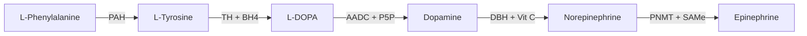

# NTRPX Ingredient Taxonomy

<Note>
**Mechanism-First Classification.** This taxonomy organizes compounds by *how they work* rather than traditional categories. A compound's primary biological mechanism determines its placement — enabling intelligent stacking decisions and avoiding redundancy.
</Note>

---

## Quick Navigation

<CardGroup cols={3}>

<Card title="Neurotransmitter Systems" icon="brain" href="#1-neurotransmitter-systems" color="#5A8FA8">
Cholinergic, Dopaminergic, Serotonergic, GABAergic, Glutamatergic, Adenosinergic
</Card>

<Card title="Bioenergetics" icon="bolt" href="#2-bioenergetics--metabolism" color="#5A8FA8">
Mitochondria, ATP, Creatine, Carnitine, NAD+, B-Vitamins
</Card>

<Card title="Endocrine & Hormonal" icon="dna" href="#3-endocrine--hormonal" color="#5A8FA8">
HPA Axis, Testosterone, Thyroid, Growth Hormone, Melatonin
</Card>

<Card title="Adaptogens & Herbs" icon="leaf" href="#4-adaptogens--herbal-modulators" color="#5A8FA8">
Classic Adaptogens, Nootropic Herbs, Nervines, Mushrooms
</Card>

<Card title="Sleep & Circadian" icon="moon" href="#5-sleep--circadian" color="#5A8FA8">
Sleep Onset, Architecture, Circadian Rhythm
</Card>

<Card title="Structural & Cellular" icon="hexagon" href="#6-structural--cellular-integrity" color="#5A8FA8">
Phospholipids, Collagen, Connective Tissue, Bone
</Card>

<Card title="Antioxidant & Detox" icon="shield" href="#7-antioxidant--detoxification" color="#5A8FA8">
Direct Antioxidants, Glutathione, Nrf2, Methylation
</Card>

<Card title="Cardiovascular" icon="heart" href="#8-cardiovascular" color="#5A8FA8">
Nitric Oxide, Blood Pressure, Lipids, Cardiac Function
</Card>

<Card title="Immune System" icon="virus" href="#9-immune-system" color="#5A8FA8">
Immunostimulants, Anti-Inflammatory, Cytokine Modulators
</Card>

<Card title="Gastrointestinal" icon="stomach" href="#10-gastrointestinal" color="#5A8FA8">
Digestive Enzymes, Gut Barrier, Microbiome
</Card>

<Card title="Musculoskeletal" icon="dumbbell" href="#11-musculoskeletal--performance" color="#5A8FA8">
Muscle Protein Synthesis, Strength, Endurance, Recovery
</Card>

<Card title="Longevity & Aging" icon="hourglass" href="#12-longevity--cellular-aging" color="#5A8FA8">
NAD+, Senolytics, Autophagy, Telomeres, Epigenetics
</Card>

</CardGroup>

---

## Classification Hierarchy

**Taxonomy Structure**
- Domain → Category → Subcategory → Mechanism Class → Compounds

**Example Path**
- 1. Neurotransmitter Systems → 1.2 Catecholaminergic → 1.2.3 Reuptake Modulators → DAT Inhibitors → Sabroxy, Methylphenidate

---

# 1. Neurotransmitter Systems

<Icon icon="brain" color="#5A8FA8" /> Compounds that directly modulate neurotransmitter synthesis, release, receptor binding, reuptake, or degradation.

<Tabs>

<Tab title="Cholinergic">

## 1.1 Cholinergic System

*Acetylcholine synthesis, release, and signaling*

<AccordionGroup>

<Accordion title="1.1.1 Choline Donors" icon="droplet">

Provide choline substrate for acetylcholine synthesis

| Compound | Choline Yield | BBB | Unique Features |
|----------|---------------|-----|-----------------|
| **CDP-Choline (Citicoline)** | 18% | ★★★★★ | +Uridine → dopamine receptors |
| **Alpha-GPC** | 40% | ★★★★★ | Highest yield; GH release |
| Phosphatidylcholine | 13% | ★★★☆☆ | Membrane source |
| Choline Bitartrate | 41% | ★★☆☆☆ | Poor CNS delivery |
| DMAE | Indirect | ★★★☆☆ | Controversial efficacy |

<Tip>
**NTRPX Application:** CDP-Choline (SynaptiQ) for daily use in Boost/Sustain; Alpha-GPC (RapidChol) reserved for Sprint acute use to limit TMAO.
</Tip>

</Accordion>

<Accordion title="1.1.2 Acetylcholinesterase Inhibitors" icon="ban">

Prevent ACh degradation, prolonging signaling

| Compound | Potency | Selectivity | Duration | Notes |
|----------|---------|-------------|----------|-------|
| **Huperzine A** | High | AChE selective | 10-14 h | Chinese club moss |
| Galantamine | Moderate | AChE + nAChR PAM | 6-8 h | Dual mechanism |
| Rivastigmine | Moderate | AChE + BuChE | 8-10 h | Pharmaceutical |
| Donepezil | High | AChE selective | 70 h | Pharmaceutical |

<Warning>
AChE inhibitors potentiate cholinergic signaling. Combine with choline donors cautiously — excessive cholinergic load can cause headaches, GI distress, and bradycardia.
</Warning>

</Accordion>

<Accordion title="1.1.3 Nicotinic Receptor Modulators" icon="circle-nodes">

Modulate nicotinic acetylcholine receptors (nAChRs)

| Compound | Receptor Subtype | Action | Application |
|----------|------------------|--------|-------------|
| Nicotine | α4β2, α7 | Agonist | Research (addictive) |
| Galantamine | α7 | PAM | Cognitive; lucid dreaming |
| Cytisine | α4β2 | Partial agonist | Smoking cessation |
| Varenicline | α4β2 | Partial agonist | Pharmaceutical (Chantix) |

</Accordion>

<Accordion title="1.1.4 Muscarinic Receptor Modulators" icon="wave-square">

Modulate muscarinic acetylcholine receptors (mAChRs)

| Compound | Mechanism | Notes |
|----------|-----------|-------|
| Coluracetam | HACU enhancer | High-affinity choline uptake |
| Oxiracetam | Indirect mAChR | Via ACh system modulation |
| Arecoline | mAChR agonist | Betel nut; research context |

</Accordion>

</AccordionGroup>

</Tab>

<Tab title="Catecholaminergic">

## 1.2 Catecholaminergic System

*Dopamine, Norepinephrine, Epinephrine synthesis and signaling*

<AccordionGroup>

<Accordion title="1.2.1 Precursors" icon="arrow-up-from-bracket">

Substrates for catecholamine biosynthesis

| Compound | Pathway Position | Notes |
|----------|------------------|-------|
| **L-Tyrosine** | Tyrosine → L-DOPA | Rate may be TH-limited |
| L-Phenylalanine | Phenylalanine → Tyrosine | Essential amino acid |
| N-Acetyl-L-Tyrosine (NALT) | Same as tyrosine | Better solubility; debated efficacy |
| Mucuna pruriens (L-DOPA) | L-DOPA → Dopamine | Bypasses TH; peripheral conversion |

</Accordion>

<Accordion title="1.2.2 Enzyme Cofactors" icon="gear">

Required for catecholamine synthesis enzymes

| Cofactor | Enzyme | Role |
|----------|--------|------|
| **P5P (Vitamin B6)** | AADC | DOPA → Dopamine |
| **BH4 (Tetrahydrobiopterin)** | TH, TPH | Rate-limiting cofactor |
| Iron | TH | Hydroxylation cofactor |
| Vitamin C | DBH | DA → Norepinephrine |
| SAMe | PNMT, COMT | Methylation reactions |
| Copper | DBH | Cofactor |

</Accordion>

<Accordion title="1.2.3 Reuptake Modulators" icon="recycle">

Affect dopamine transporter (DAT) and norepinephrine transporter (NET)

| Compound | Target | Potency | Notes |
|----------|--------|---------|-------|
| **Sabroxy (Oroxylin A)** | DAT | Moderate | Natural; Oroxylum indicum |
| Methylphenidate | DAT/NET | High | Pharmaceutical (Ritalin) |
| Modafinil | DAT (weak) | Low | +Histamine, orexin |
| Phenylpiracetam | DAT modulation | Low | Banned in sport |
| Bupropion | DAT/NET | Moderate | Pharmaceutical (Wellbutrin) |

</Accordion>

<Accordion title="1.2.4 MAO Modulators" icon="block-brick">

Affect monoamine oxidase (degradation enzyme)

| Compound | Selectivity | Reversibility | Notes |
|----------|-------------|---------------|-------|
| Selegiline | MAO-B (low dose) | Irreversible | Pharmaceutical |
| Hordenine | MAO-B | Reversible | Short-acting; barley |
| Rhodiola rosea | MAO-A/B (mild) | Reversible | Adaptogen |
| β-Carbolines | MAO-A | Reversible | Serotonin syndrome risk |

<Warning>
MAO inhibitors have significant drug and food interactions. Combining MAOIs with serotonergic compounds or tyramine-rich foods can cause hypertensive crisis or serotonin syndrome.
</Warning>

</Accordion>

<Accordion title="1.2.5 COMT Modulators" icon="block-brick">

Affect catechol-O-methyltransferase (degradation)

| Compound | Mechanism | Potency | Notes |
|----------|-----------|---------|-------|
| Quercetin | COMT inhibition | Mild | Dietary flavonoid |
| EGCG | COMT inhibition | Mild | Green tea |
| Luteolin | COMT inhibition | Mild | Dietary flavonoid |
| Tolcapone | COMT inhibition | High | Pharmaceutical |

<Note>
COMT Val158Met polymorphism affects baseline COMT activity. "Warrior" (Val/Val) genotypes have higher COMT activity and may benefit more from COMT inhibition.
</Note>

</Accordion>

<Accordion title="1.2.6 Receptor Modulators" icon="podcast">

Direct dopamine receptor interaction

| Compound | Receptor | Effect | Mechanism |
|----------|----------|--------|-----------|
| Uridine | D1/D2 | Density ↑ | Membrane synthesis |
| CDP-Choline | D2 | Density ↑ | Via uridine pathway |
| Sulbutiamine | D1 | Density ↑ | Thiamine derivative |
| Bromantane | D2 | Sensitization | Atypical stimulant |

</Accordion>

</AccordionGroup>

</Tab>

<Tab title="Serotonergic">

## 1.3 Serotonergic System

*Serotonin (5-HT) synthesis and signaling*

<AccordionGroup>

<Accordion title="1.3.1 Precursors" icon="arrow-up-from-bracket">

| Compound | Pathway Position | Notes |
|----------|------------------|-------|
| **L-Tryptophan** | Tryptophan → 5-HTP | Essential AA; competes for transport |
| **5-HTP** | 5-HTP → Serotonin | Bypasses TPH; peripheral conversion |

<Warning>
5-HTP should not be combined with SSRIs, MAOIs, or other serotonergic compounds due to serotonin syndrome risk. Always use with peripheral decarboxylase inhibitor (green tea EGCG) if chronic use.
</Warning>

</Accordion>

<Accordion title="1.3.2 Reuptake Modulators" icon="recycle">

| Compound | Mechanism | Potency | Notes |
|----------|-----------|---------|-------|
| St. John's Wort | SERT inhibition | Moderate | Drug interactions |
| SSRIs | SERT inhibition | High | Pharmaceutical class |
| Tianeptine | SERT modulation | Atypical | Enhances reuptake |

</Accordion>

<Accordion title="1.3.3 Receptor Modulators" icon="podcast">

| Compound | Receptor | Action | Context |
|----------|----------|--------|---------|
| Buspirone | 5-HT1A | Partial agonist | Anxiolytic |
| Psilocybin | 5-HT2A | Agonist | Research/therapy |
| CBD | 5-HT1A | Partial agonist | Anxiolytic component |

</Accordion>

</AccordionGroup>

</Tab>

<Tab title="GABAergic">

## 1.4 GABAergic System

*GABA synthesis and signaling*

<AccordionGroup>

<Accordion title="1.4.1 GABA & Precursors" icon="droplet">

| Compound | Mechanism | BBB | Notes |
|----------|-----------|-----|-------|
| GABA (oral) | Direct | Controversial | Efficacy debated |
| Picamilon | GABA + Niacin prodrug | Good | Crosses BBB |
| Glutamate | GAD substrate | N/A | Endogenous |

</Accordion>

<Accordion title="1.4.2 GABA-A Positive Modulators" icon="plus">

Positive allosteric modulators (PAMs) at GABA-A receptor

| Compound | Binding Site | Potency | Notes |
|----------|--------------|---------|-------|
| **Apigenin** | Benzodiazepine | Mild | Chamomile; non-sedating |
| Magnolol/Honokiol | Benzodiazepine | Moderate | Magnolia bark |
| Baicalin | Benzodiazepine | Moderate | Skullcap |
| Valerian | β3 subunit | Mild | Valerenic acid |
| Lemon Balm | GABA-T inhibition | Mild | Rosmarinic acid |
| Kava | Multiple | Moderate | Hepatotoxicity concern |
| Alcohol | Multiple | High | Not a supplement |
| Benzodiazepines | Benzodiazepine | High | Pharmaceutical |

<Tip>
**NTRPX Application:** Apigenin in Luna provides mild GABA-A modulation without sedation or dependence risk — ideal for sleep support alongside glycine and magnesium.
</Tip>

</Accordion>

<Accordion title="1.4.3 GABA-B Modulators" icon="b">

| Compound | Action | Risk | Notes |
|----------|--------|------|-------|
| Phenibut | Agonist | High dependence | Not recommended |
| Baclofen | Agonist | Moderate | Pharmaceutical |
| GHB | Agonist | High | Controlled substance |

<Warning>
GABA-B agonists (Phenibut, GHB, Baclofen) carry significant dependence and withdrawal risks. Phenibut withdrawal can be life-threatening. These are NOT recommended for supplementation.
</Warning>

</Accordion>

<Accordion title="1.4.4 GAD Enzyme Support" icon="gear">

Support glutamate → GABA conversion

| Compound | Role | Notes |
|----------|------|-------|
| **P5P (B6)** | GAD cofactor | Essential |
| **Magnesium** | GAD cofactor | Often deficient |
| Zinc | GAD modulator | Support |

</Accordion>

</AccordionGroup>

</Tab>

<Tab title="Glutamatergic">

## 1.5 Glutamatergic System

*Glutamate and NMDA/AMPA signaling*

<AccordionGroup>

<Accordion title="1.5.1 NMDA Receptor Modulators" icon="wave-square">

| Compound | Site | Action | Notes |
|----------|------|--------|-------|
| **Magnesium** | Channel | Voltage-dependent block | Prevents excitotoxicity |
| **Glycine** | Co-agonist | Required for activation | Also inhibitory GlyR |
| D-Serine | Co-agonist | Required for activation | Endogenous |
| Zinc | Modulatory | Inhibitory | Trace mineral |
| Memantine | Channel | Antagonist | Pharmaceutical |

</Accordion>

<Accordion title="1.5.2 AMPA Modulators (Ampakines)" icon="bolt">

| Compound | Mechanism | Notes |
|----------|-----------|-------|
| Aniracetam | PAM | Racetam class |
| Sunifiram | PAM | Research compound |
| IDRA-21 | PAM | Research compound |

</Accordion>

<Accordion title="1.5.3 Racetam Class" icon="capsules">

Multiple glutamatergic and cholinergic targets

| Compound | Primary | Secondary | Character |
|----------|---------|-----------|-----------|
| Piracetam | AMPA modulation | Membrane fluidity | Original; mild |
| Aniracetam | AMPA PAM | Anxiolytic | Fat-soluble |
| Oxiracetam | AMPA/Cholinergic | Mild stimulant | Water-soluble |
| Pramiracetam | HACU enhancement | — | Most potent cholinergic |
| Phenylpiracetam | Dopaminergic | Stimulant | Banned in sport |
| Coluracetam | HACU enhancement | — | Choline uptake |
| Fasoracetam | mGluR modulation | GABA-B upregulation | Research |

</Accordion>

</AccordionGroup>

</Tab>

<Tab title="Adenosinergic">

## 1.6 Adenosinergic System

*Adenosine receptor modulation*

### Adenosine Receptor Antagonists

Block adenosine-induced drowsiness and dopamine suppression

| Compound | A1 Ki (µM) | A2A Ki (µM) | Half-life | Character |
|----------|------------|-------------|-----------|-----------|
| **Paraxanthine** | 33 | **18** | 3.1 h | Clean; no jitters |
| Caffeine | 44 | 40 | 5-6 h | Most common |
| Theobromine | 80+ | 80+ | 6-10 h | Mild; chocolate |
| Theophylline | 14 | 22 | 8-9 h | Anxiogenic; avoid |
| Theacrine | Indirect | Indirect | 20+ h | No tolerance |
| Dynamine | Indirect | Indirect | 1-2 h | Rapid onset/offset |

<Tip>
**NTRPX Application:** Paraxanthine (EnfinX) in ParaCaffeine provides 2.2x higher A2A affinity than caffeine with shorter half-life and no anxiogenic theophylline pathway.
</Tip>

</Tab>

<Tab title="Other NT Systems">

## 1.7-1.9 Additional Systems

<AccordionGroup>

<Accordion title="1.7 Histaminergic" icon="h">

*Histamine modulation (wakefulness, cognition)*

| Compound | Mechanism | Notes |
|----------|-----------|-------|
| Pitolisant | H3 inverse agonist | Narcolepsy (Wakix) |
| L-Histidine | Histamine precursor | Essential amino acid |

</Accordion>

<Accordion title="1.8 Glycinergic" icon="wave-square">

*Glycine receptor signaling (inhibitory)*

| Compound | Mechanism | Notes |
|----------|-----------|-------|
| **Glycine** | GlyR agonist + NMDA co-agonist | Sleep; 3g |
| Taurine | GlyR modulator | Also GABAergic |
| β-Alanine | GlyR partial agonist | Also carnosine precursor |

</Accordion>

<Accordion title="1.9 Endocannabinoid" icon="cannabis">

*CB1/CB2 receptor and endocannabinoid modulation*

| Compound | CB1 | CB2 | Notes |
|----------|-----|-----|-------|
| THC | Agonist | Agonist | Controlled |
| CBD | NAM | Inverse agonist | Legal (varies) |
| PEA | — | PPARα | Anti-inflammatory |
| β-Caryophyllene | — | Agonist | Terpene |

</Accordion>

</AccordionGroup>

</Tab>

</Tabs>

---

# 2. Bioenergetics & Metabolism

<Icon icon="bolt" color="#5A8FA8" /> Compounds supporting cellular energy production, substrate utilization, and metabolic efficiency.

<Tabs>

<Tab title="Mitochondrial">

## 2.1 Mitochondrial Support

<AccordionGroup>

<Accordion title="2.1.1 Electron Transport Chain" icon="link">

| Compound | ETC Role | Notes |
|----------|----------|-------|
| **CoQ10 (Ubiquinol)** | Complex I→III carrier | Ubiquinol > Ubiquinone |
| **PQQ** | Biogenesis + redox | Synergy with CoQ10 |
| NADH | Complex I donor | Reduced NAD+ |
| Riboflavin (B2) | FAD → Complex II | Cofactor |
| Iron | Cytochromes | Heme center |
| Copper | Complex IV | Cytochrome c oxidase |

</Accordion>

<Accordion title="2.1.2 Mitochondrial Biogenesis" icon="plus">

Increase mitochondrial number/mass via PGC-1α

| Compound | Mechanism | Notes |
|----------|-----------|-------|
| **PQQ** | PGC-1α activation | Primary |
| Resveratrol | SIRT1 → PGC-1α | Longevity overlap |
| Quercetin | PGC-1α activation | Flavonoid |
| Exercise | AMPK → PGC-1α | Most validated |

</Accordion>

</AccordionGroup>

</Tab>

<Tab title="ATP & Creatine">

## 2.2 ATP & Phosphagen System

<AccordionGroup>

<Accordion title="2.2.1 Creatine System" icon="battery-full">

Phosphocreatine shuttle for rapid ATP regeneration

| Form | Purity | Solubility | Evidence |
|------|--------|------------|----------|
| **Creatine Monohydrate** | 99.9% | ★★★☆☆ | ★★★★★ Gold standard |
| Creatine HCl | 99%+ | ★★★★★ | ★★★☆☆ Limited |
| Buffered (Kre-Alkalyn) | Variable | ★★★★☆ | ★★☆☆☆ No advantage |

<Tip>
**NTRPX Application:** NeuroCreatine (3g) in Solar supports brain ATP buffering — cognitive benefits are most pronounced under stress, sleep deprivation, or in vegetarians.
</Tip>

</Accordion>

<Accordion title="2.2.2 AMPK Activators" icon="gauge-high">

Cellular energy sensor activation

| Compound | Mechanism | Notes |
|----------|-----------|-------|
| Berberine | Direct AMPK | Metformin-like |
| Metformin | AMPK activation | Pharmaceutical |
| Gynostemma | AMPK activation | Adaptogen |
| Quercetin | AMPK activation | Flavonoid |

</Accordion>

</AccordionGroup>

</Tab>

<Tab title="Carnitine & NAD+">

## 2.3 Carnitine System

Fatty acid transport into mitochondria

| Form | Primary Use | Unique Benefit |
|------|-------------|----------------|
| **ALCAR** | Cognitive | Crosses BBB; acetyl donor |
| L-Carnitine | Muscle/cardiac | Base form |
| LCLT | Athletic recovery | Fast absorption |
| GPLC | Exercise | +Nitric oxide |

---

## 2.4 NAD+ System

| Compound | Pathway | Notes |
|----------|---------|-------|
| **NMN** | Direct NAD+ precursor | Longevity research |
| **NR (Niagen)** | NAD+ precursor | Patented |
| Niacin (B3) | NAD+ precursor | Flushing |
| Niacinamide | NAD+ precursor | No flush; may inhibit sirtuins |
| **Apigenin** | CD38 inhibition | Preserves NAD+ |

</Tab>

<Tab title="B-Vitamins">

## 2.5 Metabolic Cofactors

| Vitamin | Active Form | Metabolic Role |
|---------|-------------|----------------|
| B1 | TPP | Pyruvate DH; α-ketoglutarate DH |
| B2 | FAD, FMN | ETC Complex II; fatty acid oxidation |
| B3 | NAD+, NADP+ | Redox; energy metabolism |
| B5 | Coenzyme A | Acetyl-CoA synthesis |
| **B6** | **P5P** | Amino acid metabolism; NT synthesis |
| B7 | Biotin | Carboxylation; gluconeogenesis |
| **B9** | **5-MTHF** | One-carbon; methylation |
| **B12** | Methylcobalamin | Methylation; nerve function |

<Note>
Active forms (P5P, 5-MTHF, Methylcobalamin) bypass genetic polymorphisms (MTHFR, etc.) and are preferred for supplementation.
</Note>

</Tab>

</Tabs>

---

# 3. Endocrine & Hormonal

<Icon icon="dna" color="#5A8FA8" /> Compounds modulating hormonal axes, receptor sensitivity, or hormone synthesis/metabolism.

<Tabs>

<Tab title="HPA Axis">

## 3.1 Hypothalamic-Pituitary-Adrenal Axis

*Stress response and cortisol modulation*

### Cortisol Modulators

| Compound | Mechanism | Effect | Notes |
|----------|-----------|--------|-------|
| **Ashwagandha (KSM-66)** | 11β-HSD1 inhibition | ↓ 27% cortisol | Adaptogen |
| Phosphatidylserine | HPA modulation | ↓ Cortisol | Post-exercise |
| Rhodiola rosea | HPA modulation | Balancing | Adaptogen |
| Holy Basil | Cortisol modulation | ↓ Cortisol | Adaptogen |
| Magnolia Bark | Cortisol modulation | ↓ Cortisol | Anxiolytic |

</Tab>

<Tab title="HPG Axis">

## 3.2 Hypothalamic-Pituitary-Gonadal Axis

*Testosterone and sex hormone modulation*

<AccordionGroup>

<Accordion title="3.2.1 Testosterone Support" icon="mars">

**LH Stimulation:**
| Compound | Mechanism | Evidence |
|----------|-----------|----------|
| Tongkat Ali | HPG axis support | Moderate |
| Fadogia agrestis | LH stimulation | Limited |
| D-Aspartic Acid | GnRH/LH | Acute; attenuates |

**Aromatase Inhibitors:**
| Compound | Potency | Notes |
|----------|---------|-------|
| DIM | Mild | Estrogen metabolism |
| Grape Seed Extract | Mild | Procyanidins |
| Zinc | Mild | Cofactor |

**SHBG Modulators:**
| Compound | Effect | Notes |
|----------|--------|-------|
| Boron | ↓ SHBG | 10mg; free T ↑ |
| Magnesium | ↓ SHBG | If deficient |
| Nettle Root | SHBG competition | Prostate |

</Accordion>

<Accordion title="3.2.2 TRT & Analogs (Medical)" icon="syringe">

| Compound | Type | Notes |
|----------|------|-------|
| Testosterone Cypionate | Esterified | IM; long-acting |
| Testosterone Enanthate | Esterified | IM; long-acting |
| Testosterone Cream/Gel | Transdermal | Daily |
| hCG | LH analog | Testicular maintenance |
| Clomiphene | SERM | Off-label hypogonadism |
| Enclomiphene | SERM (isomer) | Selective |

</Accordion>

<Accordion title="3.2.3 SARMs (Research)" icon="flask">

| Compound | Selectivity | Notes |
|----------|-------------|-------|
| Ostarine (MK-2866) | Muscle/bone | Most studied |
| LGD-4033 | Muscle | More potent |
| RAD-140 | Muscle | CNS penetrant |

<Warning>
SARMs are not approved supplements. They suppress natural testosterone, have unknown long-term risks, and are banned in sport. Research context only.
</Warning>

</Accordion>

</AccordionGroup>

</Tab>

<Tab title="Thyroid & GH">

## 3.3 Thyroid Axis

| Component | Compound | Role |
|-----------|----------|------|
| Synthesis | Iodine | T4/T3 production |
| Synthesis | L-Tyrosine | Thyroglobulin |
| T4→T3 Conversion | **Selenium** | Deiodinase cofactor |
| T4→T3 Conversion | Zinc | Support |

---

## 3.4 Growth Hormone Axis

**Natural GH Support:**
| Compound | Mechanism | Notes |
|----------|-----------|-------|
| Deep Sleep | Endogenous trigger | Most important |
| GABA | GH release | Acute spike |
| Alpha-GPC | GH release | Exercise-dependent |
| Arginine + Ornithine | ↓ Somatostatin | Modest |

**GH Peptides (Research/Medical):**
| Compound | Mechanism | Notes |
|----------|-----------|-------|
| Ipamorelin | Ghrelin receptor | Minimal hunger |
| CJC-1295 | GHRH receptor | Pulsatile |
| MK-677 | Ghrelin receptor (oral) | Long half-life |

</Tab>

<Tab title="Melatonin">

## 3.5 Melatonin & Circadian

| Compound | Mechanism | Dose Range |
|----------|-----------|------------|
| **Melatonin** | MT1/MT2 agonist | 0.3-1mg (timing) / 3-10mg (sleep) |
| Ramelteon | MT1/MT2 agonist | Pharmaceutical |

**Circadian Support:**
| Factor | Mechanism |
|--------|-----------|
| Morning light | SCN entrainment |
| Evening light avoidance | Melatonin preservation |
| Consistent sleep timing | Rhythm stability |

</Tab>

</Tabs>

---

# 4. Adaptogens & Herbal Modulators

<Icon icon="leaf" color="#5A8FA8" /> Plant-derived compounds with non-specific stress resistance and tonic properties.

## 4.1 Classic Adaptogens

Must meet Brekhman criteria: non-toxic, non-specific resistance, normalizing

<CardGroup cols={2}>

<Card title="Ashwagandha (KSM-66)" icon="chevron-down" color="#5A8FA8">
**Calming Adaptogen**

↓ Cortisol 27% · ↓ Anxiety · ↑ Testosterone

*Withanolides*
</Card>

<Card title="Rhodiola rosea" icon="angle-up" color="#5A8FA8">
**Stimulating Adaptogen**

↑ Energy · ↓ Fatigue · ↑ Cognition

*Rosavins, Salidroside*
</Card>

<Card title="Panax Ginseng" icon="angle-up" color="#5A8FA8">
**Warming/Energizing**

↑ Energy · ↑ Cognition · ↑ Libido

*Ginsenosides*
</Card>

<Card title="Cordyceps" icon="angle-up" color="#5A8FA8">
**Energizing Mushroom**

↑ ATP · ↑ Oxygen utilization

*Cordycepin, β-glucans*
</Card>

<Card title="Reishi" icon="chevron-down" color="#5A8FA8">
**Calming Mushroom**

Immune · Sleep · Stress

*Triterpenes, β-glucans*
</Card>

<Card title="Holy Basil (Tulsi)" icon="chevron-down" color="#5A8FA8">
**Calming Adaptogen**

↓ Stress · ↓ Inflammation

*Eugenol, Ursolic acid*
</Card>

</CardGroup>

---

## 4.2 Nootropic Herbs & Mushrooms

| Compound | Primary Mechanism | Key Actives |
|----------|-------------------|-------------|
| **Lion's Mane** | NGF synthesis ↑ | Erinacines, Hericenones |
| Bacopa monnieri | Serotonergic + antioxidant | Bacosides |
| Gotu Kola | BDNF; collagen | Asiaticoside |
| Ginkgo biloba | Cerebral blood flow | EGb 761 |

---

## 4.3 Nervines

<Tabs>

<Tab title="Relaxing">

| Compound | Mechanism | Notes |
|----------|-----------|-------|
| Chamomile | Apigenin → GABA-A | Mild anxiolytic |
| Lemon Balm | GABA-T inhibition | Rosmarinic acid |
| Passionflower | GABA modulation | Chrysin |
| Valerian | GABA-A (β3) | Sleep |
| Lavender | Ca²⁺ channels | Silexan (oral) |
| Magnolia | GABA-A | Honokiol |

</Tab>

<Tab title="Stimulating">

| Compound | Mechanism | Notes |
|----------|-----------|-------|
| Green Tea | L-Theanine + Caffeine | Balanced |
| Yerba Mate | Caffeine + Theobromine | Sustained |
| Guarana | Caffeine + Tannins | Slow release |

</Tab>

</Tabs>

---

# 5. Sleep & Circadian

<Icon icon="moon" color="#5A8FA8" /> Compounds specifically targeting sleep onset, architecture, and circadian rhythm.

## 5.1 Sleep Onset Mechanisms

<CardGroup cols={2}>

<Card title="Thermoregulation" icon="temperature-low" color="#5A8FA8">
**Glycine (3g)** — Peripheral vasodilation → Core temp ↓ 0.5°C → Sleep onset triggered
</Card>

<Card title="GABAergic" icon="wave-square" color="#5A8FA8">
**L-Theanine, Apigenin, Magnolia** — GABA-A modulation without dependence
</Card>

<Card title="Magnesium" icon="atom" color="#5A8FA8">
**Mg Glycinate** — NMDA block + GABA potentiation + bonus glycine
</Card>

<Card title="Melatonin" icon="moon" color="#5A8FA8">
**Low-dose (0.3-1mg)** — Circadian timing signal
</Card>

</CardGroup>

---

## 5.2 Sleep Architecture

| Target | Compound | Mechanism |
|--------|----------|-----------|
| Slow-Wave Sleep | Magnesium, Glycine | NMDA/GABA modulation |
| REM Enhancement | Galantamine, Huperzine A | Cholinergic |
| REM Suppression | THC, Alcohol | Not recommended |

---

# 6. Structural & Cellular Integrity

<Icon icon="hexagon" color="#5A8FA8" /> Compounds supporting cell membranes, connective tissue, and tissue structure.

## 6.1 Phospholipids

| Compound | Primary Membrane | Notes |
|----------|------------------|-------|
| **Phosphatidylcholine** | All cells | Most abundant |
| **Phosphatidylserine** | Neurons | Cortisol; cognition |
| **DHA (Omega-3)** | Neurons | 30%+ of brain lipids |
| Sphingomyelin | Myelin | Neurological |

---

## 6.2 Connective Tissue

| Compound | Target | Notes |
|----------|--------|-------|
| Collagen Peptides (I/III) | Skin, tendons | Hydrolyzed |
| Collagen Type II | Cartilage | Joint-specific |
| UC-II | Immune modulation | 40mg; different MOA |
| Vitamin C | Procollagen hydroxylation | Essential cofactor |
| Glucosamine + Chondroitin | Cartilage matrix | Classic joint stack |

---

# 7. Antioxidant & Detoxification

<Icon icon="shield" color="#5A8FA8" /> Compounds neutralizing reactive species and supporting biotransformation.

<Tabs>

<Tab title="Direct Antioxidants">

## 7.1 Direct Antioxidants

| Class | Examples | Target |
|-------|----------|--------|
| **Vitamins** | C, E, A | Aqueous/Lipid |
| **Carotenoids** | Astaxanthin, Lutein, Lycopene | Lipid; specific tissues |
| **Polyphenols** | Quercetin, EGCG, Resveratrol, Curcumin | Multiple |
| **Mitochondrial** | CoQ10, ALA, PQQ, Melatonin | Mitochondria |

</Tab>

<Tab title="Glutathione System">

## 7.2 Glutathione System

| Compound | Role | Notes |
|----------|------|-------|
| **NAC** | Cysteine donor | Rate-limiting |
| **Glycine** | GSH synthesis | Often limiting in elderly |
| Glutamine | GSH synthesis | Conditionally essential |
| Liposomal Glutathione | Direct | Improved bioavailability |
| Selenium | GPx cofactor | Glutathione peroxidase |
| ALA | GSH regeneration | Recycles oxidized GSH |
| Milk Thistle | ↑ GSH synthesis | Hepatoprotective |

</Tab>

<Tab title="Nrf2 Activation">

## 7.3 Nrf2 Pathway

Master antioxidant transcription factor

| Compound | Potency | Source |
|----------|---------|--------|
| **Sulforaphane** | ★★★★★ | Broccoli sprouts |
| Curcumin | ★★★☆☆ | Turmeric |
| Resveratrol | ★★★☆☆ | Grapes |
| EGCG | ★★★☆☆ | Green tea |
| ALA | ★★★☆☆ | Mitochondrial |

</Tab>

<Tab title="Methylation">

## 7.4 Methylation Support

| Compound | Role | Notes |
|----------|------|-------|
| **5-MTHF** | Methyl donor | Active folate |
| **Methylcobalamin** | Methyl donor | Active B12 |
| Betaine (TMG) | Methyl donor | BHMT pathway |
| SAMe | Universal methyl donor | Expensive |
| Choline | Betaine precursor | Also cholinergic |
| Riboflavin | MTHFR cofactor | Supports folate cycle |

</Tab>

</Tabs>

---

# 8. Cardiovascular

<Icon icon="heart" color="#5A8FA8" /> Compounds supporting heart, vessels, blood pressure, and lipid profiles.

## 8.1 Nitric Oxide System

| Compound | Mechanism | Notes |
|----------|-----------|-------|
| **L-Citrulline** | Arginine precursor | More effective than arginine |
| L-Arginine | NOS substrate | First-pass metabolism |
| Beetroot (Nitrate) | Nitrate → NO | Dietary pathway |
| Pycnogenol | eNOS activation | Pine bark |

---

## 8.2 Lipid Management

| Compound | Primary Effect | Notes |
|----------|----------------|-------|
| **Omega-3 (EPA/DHA)** | ↓ Triglycerides | 2-4g for effect |
| Berberine | ↓ LDL, ↓ TG | PCSK9 pathway |
| Red Yeast Rice | ↓ LDL | Contains monacolin K |
| Plant Sterols | ↓ Cholesterol absorption | 2g/day |
| Niacin | ↓ LDL, ↑ HDL, ↓ Lp(a) | Flushing |

---

# 9-11. Additional Systems

<Tabs>

<Tab title="Immune">

## 9. Immune System

| Category | Compounds |
|----------|-----------|
| **Immunostimulants** | Vitamin C, D, Zinc, Elderberry, Echinacea, Beta-Glucans |
| **Anti-Inflammatory** | Curcumin, Boswellia, Omega-3, Ginger |

</Tab>

<Tab title="Gastrointestinal">

## 10. Gastrointestinal

| Category | Compounds |
|----------|-----------|
| **Gut Barrier** | L-Glutamine, Zinc Carnosine, Colostrum, Butyrate |
| **Microbiome** | Probiotics (Lactobacillus, Bifidobacterium), Prebiotics (Inulin, FOS) |
| **Digestive Enzymes** | Amylase, Protease, Lipase, Betaine HCl |

</Tab>

<Tab title="Musculoskeletal">

## 11. Musculoskeletal & Performance

| Category | Compounds |
|----------|-----------|
| **MPS Activation** | Leucine, EAAs, HMB |
| **Strength** | **Creatine**, Betaine |
| **Endurance** | Beetroot (Nitrate), Beta-Alanine, Cordyceps |
| **Recovery** | Tart Cherry, Omega-3, Collagen |

</Tab>

</Tabs>

---

# 12. Longevity & Cellular Aging

<Icon icon="hourglass" color="#5A8FA8" /> Compounds targeting hallmarks of aging.

<CardGroup cols={2}>

<Card title="NAD+ & Sirtuins" icon="dna" color="#5A8FA8">
**NMN, NR, Apigenin (CD38 inhibition), Resveratrol**

Restore declining NAD+ levels; activate sirtuins
</Card>

<Card title="Senolytics" icon="trash" color="#5A8FA8">
**Fisetin, Quercetin + Dasatinib**

Clear senescent "zombie" cells
</Card>

<Card title="Autophagy" icon="recycle" color="#5A8FA8">
**Spermidine, Fasting, Resveratrol, Rapamycin**

Cellular cleanup and renewal
</Card>

<Card title="Telomeres" icon="dna" color="#5A8FA8">
**TA-65, Astragalus, Vitamin D, Omega-3**

Telomere maintenance
</Card>

</CardGroup>

---

## 12.1 Senolytics & Senomorphics

| Type | Compound | Mechanism |
|------|----------|-----------|
| **Senolytic** | Fisetin | BCL-2 inhibition → apoptosis |
| **Senolytic** | Quercetin + Dasatinib | Research protocol |
| **Senomorphic** | Rapamycin | mTOR → SASP suppression |
| **Senomorphic** | Metformin | AMPK activation |

---

## 12.2 Epigenetic Modulators

| Compound | Mechanism | Notes |
|----------|-----------|-------|
| Sulforaphane | HDAC inhibition | Broccoli |
| Butyrate | HDAC inhibition | Gut metabolite |
| Resveratrol | Sirtuin activation | Deacetylation |
| Alpha-Ketoglutarate | TET cofactor | DNA demethylation |

---

# 13-14. Peptides & Nutrients

<Tabs>

<Tab title="Peptides">

## 13. Peptides & Growth Factors

<Warning>
Peptides are research compounds or prescription medications. This section is for educational classification only.
</Warning>

| Category | Examples |
|----------|----------|
| **Neurological** | Semax, Selank, Dihexa |
| **Tissue Repair** | BPC-157, TB-500, GHK-Cu |
| **Metabolic** | GLP-1 analogs, MOTS-c |
| **GH Secretagogues** | Ipamorelin, CJC-1295, MK-677 |

</Tab>

<Tab title="Essential Nutrients">

## 14. Essential Nutrients

### Minerals

| Type | Key Minerals |
|------|--------------|
| **Macro** | Calcium, Magnesium, Potassium, Sodium, Phosphorus |
| **Trace** | Zinc, Iron, Copper, Selenium, Iodine, Manganese, Chromium, Boron |

### Essential Fatty Acids

| Type | Key Fatty Acids |
|------|-----------------|
| **Omega-3** | EPA, DHA, ALA |
| **Omega-6** | LA, GLA, AA |

</Tab>

</Tabs>

---

# NTRPX Product Mapping

<Note>
This table shows which taxonomy sections are most relevant to each NTRPX product.
</Note>

| Product | Primary Sections | Key Mechanisms |
|---------|------------------|----------------|
| **ASG Boost** | 1.1, 1.2, 2.1-2.5 | Cholinergic, Catecholamine support, Bioenergetics |
| **ASG Sustain** | 1.1, 2.1, 2.3 | Cholinergic, Mitochondrial, Carnitine |
| **ASG Recover** | 1.4, 1.8, 5.1, 14 | GABAergic, Glycinergic, Sleep, Minerals |
| **Neuraldrink Solar** | 1.6, 2.2, 4.1 | Adenosinergic, Creatine, Adaptogens |
| **Neuraldrink Luna** | 1.4, 1.5, 1.8, 5.1 | GABAergic, NMDA, Glycinergic, Sleep onset |
| **ParaCaffeine** | 1.6, 1.2 | Adenosine antagonism, Catecholamine support |
| **Sprint** | 1.1, 1.6, 1.2 | Cholinergic max, Stimulants |

---

## Icon Reference

<CardGroup cols={4}>

<Card title="Calming" icon="chevron-down" color="#5A8FA8">
Sleep, GABA, Glycine
</Card>

<Card title="Moderate Stim" icon="angle-up" color="#5A8FA8">
Paraxanthine, Rhodiola
</Card>

<Card title="High Stim" icon="chevrons-up" color="#5A8FA8">
Caffeine, Sprint
</Card>

<Card title="Structural" icon="hexagon" color="#5A8FA8">
Membranes, Collagen
</Card>

</CardGroup>

---

<Tip>
**Using This Taxonomy:** When evaluating a new compound, first identify its primary biological mechanism, then locate it within the appropriate domain and category. This reveals potential synergies, redundancies, and contraindications with existing formulations.
</Tip>