## MindFuel™ Acetyl-L-Carnitine

<CardGroup cols={4}>

<Card title="Sol" icon="sun" color="#f59e0b">
500–750 mg ALCAR
</Card>

<Card title="Form" icon="gem" color="#10b981">
Carnipure® ALC (≥99%)
</Card>

<Card title="Evidence" icon="flask" color="#8b5cf6">
Meta-Analysis: SMD -1.10
</Card>

<Card title="Effect" icon="brain" color="#3b82f6">
Mood • Energy • Cognition
</Card>

</CardGroup>

**The only carnitine that truly fuels your brain.** L-Carnitine has been a metabolic workhorse for decades — shuttling fatty acids into mitochondria for β-oxidation, powering everything from heart muscle to skeletal tissue. But here's what most people don't realize: **standard L-Carnitine barely touches your brain**. It can't efficiently cross the blood-brain barrier. Enter **Acetyl-L-Carnitine (ALCAR)** — the acetylated form that changes everything. By adding a single acetyl group, we transform a peripheral metabolic support compound into a *bona fide* nootropic and neurotherapeutic agent. ALCAR crosses the BBB via the OCTN2 transporter expressed on both neurons and astrocytes, delivering a powerful dual payload: **carnitine** for neuronal mitochondrial function, and **acetyl groups** that directly fuel acetylcholine synthesis — the neurotransmitter of memory, attention, and learning.

The clinical evidence is extraordinary. A 2018 meta-analysis found ALCAR produces a **large effect size (SMD = -1.10)** for depression — *equivalent to prescription antidepressants but with significantly fewer side effects*. PNAS research revealed that patients with major depression have measurably lower ALCAR levels, positioning it as both biomarker and targeted therapeutic. Meanwhile, the legendary Bruce Ames laboratory demonstrated that ALCAR + alpha-lipoic acid can essentially **reverse age-related mitochondrial decay**, restoring function in old animals to near-youthful levels.

NTRPX uses **Carnipure® ALC** from Lonza — the gold-standard fermentation-derived ALCAR backed by 40+ years of research. In MindFuel™, ALCAR provides the acetyl-powered brain fuel that optimizes both energy metabolism *and* neurotransmitter synthesis — supporting mood stability, mental clarity, and cognitive resilience.

---

<AccordionGroup>

<Accordion title="The Brain Energy Crisis" icon="bolt">

### Why Your Brain Needs ALCAR

Your brain is an energy monster. Despite comprising only 2% of body weight, it consumes **20% of your total metabolic energy**. This voracious demand creates a fundamental problem: how do you reliably fuel 86 billion neurons that can't store significant energy reserves?

```mermaid
flowchart TB
    subgraph BRAIN_ENERGY["Brain Energy Demands"]
        NEURONS["86 Billion Neurons"]
        SYNAPSES["100+ Trillion Synapses"]
        SIGNALS["Billions of Signals/sec"]
    end
    
    subgraph ENERGY_SOURCES["Energy Sources"]
        GLUCOSE["Glucose<br/>(Primary ~60-70%)"]
        KETONES["Ketones<br/>(Fasting/Keto)"]
        LACTATE["Lactate<br/>(From Astrocytes)"]
        FATTY_ACIDS["Fatty Acids<br/>(via β-oxidation)"]
    end
    
    subgraph MITOCHONDRIA["Mitochondrial Processing"]
        GLUCOSE --> PYRUVATE["Pyruvate"]
        PYRUVATE --> ACETYL_COA["Acetyl-CoA"]
        FATTY_ACIDS --> |"ALCAR Required"| ACETYL_COA
        KETONES --> ACETYL_COA
        LACTATE --> PYRUVATE
        ACETYL_COA --> TCA["TCA Cycle"]
        TCA --> ETC["Electron Transport"]
        ETC --> ATP["ATP Production"]
    end
    
    subgraph FUNCTIONS["Brain Functions Powered"]
        ATP --> ION["Ion Gradient<br/>Maintenance"]
        ATP --> NEURO_TX["Neurotransmitter<br/>Synthesis"]
        ATP --> SYNAPTIC["Synaptic<br/>Transmission"]
        ATP --> MEMORY["Memory<br/>Consolidation"]
    end
```

### The Mitochondrial Decline Problem

Here's the challenge: **mitochondrial function declines with age**. This isn't speculation — it's measurable:

| Age-Related Change | Consequence | ALCAR Intervention |
|-------------------|-------------|-------------------|
| ↓ Cardiolipin content | Impaired ETC efficiency | Restores cardiolipin levels |
| ↓ CAT activity | Reduced acetyl-CoA buffering | Provides exogenous substrate |
| ↑ Oxidative damage | mtDNA mutations accumulate | Antioxidant protection |
| ↓ Complex I-IV activity | Less ATP production | Supports ETC function |
| ↓ Membrane potential | Inefficient proton gradient | Improves ΔΨm |

**Citation:** Liu J, et al. Memory loss in old rats is associated with brain mitochondrial decay and RNA/DNA oxidation: Partial reversal by feeding acetyl-L-carnitine and/or R-α-lipoic acid. *PNAS.* 2002;99(4):2356-2361. [PMC122369](https://pmc.ncbi.nlm.nih.gov/articles/PMC122369/)

### ALCAR: The Dual-Function Solution

Unlike standard L-Carnitine, ALCAR solves both the **energy problem** AND the **neurotransmitter problem**:

```mermaid
flowchart LR
    subgraph ALCAR_MOLECULE["ALCAR Molecule"]
        CARNITINE["L-Carnitine<br/>Backbone"]
        ACETYL["Acetyl<br/>Group"]
    end
    
    subgraph BRAIN_ENTRY["Brain Entry"]
        BBB["Blood-Brain<br/>Barrier"]
        OCTN2["OCTN2<br/>Transporter"]
    end
    
    subgraph DUAL_FUNCTION["Dual Function in Brain"]
        MITO_FUNC["Mitochondrial<br/>Function"]
        ACH_FUNC["Acetylcholine<br/>Synthesis"]
    end
    
    subgraph OUTCOMES["Outcomes"]
        ENERGY_OUT["↑ Brain Energy"]
        MOOD_OUT["↑ Mood"]
        COG_OUT["↑ Cognition"]
        NEURO_OUT["Neuroprotection"]
    end
    
    ALCAR_MOLECULE --> |"Crosses"| BBB
    BBB --> OCTN2
    OCTN2 --> |"Carnitine"| MITO_FUNC
    OCTN2 --> |"Acetyl"| ACH_FUNC
    MITO_FUNC --> ENERGY_OUT
    MITO_FUNC --> NEURO_OUT
    ACH_FUNC --> MOOD_OUT
    ACH_FUNC --> COG_OUT
```

<Note>
**Key Insight:** ALCAR is not just "L-Carnitine for the brain." The acetyl group transforms it into an acetyl-CoA donor that directly participates in neurotransmitter synthesis — something L-Carnitine simply cannot do.
</Note>

</Accordion>

<Accordion title="Mechanism of Action" icon="gears">

### The Complete ALCAR Pathway

ALCAR's mechanisms span from molecular transport to neurotransmitter synthesis:

### Mechanism 1: Mitochondrial Energy Support

ALCAR's carnitine backbone enables critical mitochondrial functions:

| Function | Mechanism | Outcome |
|----------|-----------|---------|
| **Fatty acid transport** | CPT-I/CPT-II shuttle system | Long-chain FA → mitochondria for β-oxidation |
| **Acetyl-CoA buffering** | CAT equilibrium regulation | Prevents acetyl-CoA accumulation; maintains CoA availability |
| **Cardiolipin maintenance** | Membrane lipid support | Preserves ETC efficiency and membrane potential |
| **Metabolic flexibility** | Facilitates substrate switching | Brain can utilize diverse fuel sources |

### Mechanism 2: Acetylcholine Synthesis

The acetyl group makes ALCAR a direct ACh precursor:

**Citation:** White HL, Scates PW. Acetyl-L-carnitine as a precursor of acetylcholine. *Neurochem Res.* 1990;15(6):597-601. [PMID: 2215852](https://pubmed.ncbi.nlm.nih.gov/2215852/)

### Mechanism 3: Neurotransmitter Modulation

Beyond acetylcholine, ALCAR influences multiple neurotransmitter systems:

| Neurotransmitter | ALCAR Effect | Evidence Level |
|------------------|--------------|----------------|
| **Acetylcholine** | ↑ Synthesis via acetyl donation | Strong (in vitro + clinical) |
| **Norepinephrine** | ↑ Hippocampal/cortical levels | Moderate (animal, NMR) |
| **Serotonin** | ↑ Levels with chronic use | Moderate (animal studies) |
| **Dopamine** | Modulates turnover | Preliminary |
| **Glutamate** | Acetyl incorporation | Strong (¹³C-NMR) |
| **GABA** | Acetyl incorporation | Strong (¹³C-NMR) |

**Citation:** Smeland OB, et al. Chronic acetyl-L-carnitine alters brain energy metabolism and increases noradrenaline and serotonin content in healthy mice. *Neurochem Int.* 2012;61(1):100-107.

### Mechanism 4: Neuroprotection

ALCAR provides multi-layered neuroprotection:

<CardGroup cols={3}>

<Card title="Antioxidant" icon="shield" color="#10b981">
↓ MDA, 8-oxo-dG, nitrotyrosine in brain tissue
</Card>

<Card title="Anti-Apoptotic" icon="heart" color="#ef4444">
Inhibits caspase activation; preserves mitochondrial integrity
</Card>

<Card title="Neurotrophic" icon="seedling" color="#22c55e">
↑ NGF, BDNF expression; supports neuroplasticity
</Card>

</CardGroup>

<Warning>
**Critical Distinction:** Standard L-Carnitine does NOT provide these brain-specific antioxidant effects. In direct comparison studies, only ALCAR reduced oxidative damage markers (MDA, oxidized nucleotides, nitrotyrosine) in aged rat brains — L-Carnitine showed no effect despite equivalent plasma carnitine elevation.
</Warning>

</Accordion>

<Accordion title="Carnitine Forms Comparison" icon="scale-balanced">

### Why Form Selection Matters

Not all carnitines are created equal. Choosing the wrong form means missing your therapeutic target entirely:

```mermaid
flowchart TB
    subgraph FORMS["Carnitine Forms"]
        LC["L-Carnitine<br/>(Base Form)"]
        ALCAR_FORM["ALCAR<br/>(Acetyl-L-Carnitine)"]
        LCLT["LCLT<br/>(L-Carnitine L-Tartrate)"]
        PLCAR["PLCAR<br/>(Propionyl-L-Carnitine)"]
        GPLC["GPLC<br/>(Glycine Propionyl-LC)"]
        DCAR["D-Carnitine<br/>⚠️ TOXIC"]
    end
    
    subgraph TARGETS["Primary Targets"]
        LC --> PERIPHERAL["Peripheral<br/>Tissues"]
        ALCAR_FORM --> |"★ BBB Crosses"| BRAIN["Brain/CNS"]
        ALCAR_FORM --> PERIPHERAL
        LCLT --> MUSCLE["Skeletal<br/>Muscle"]
        PLCAR --> HEART["Heart/<br/>Vasculature"]
        GPLC --> ENDOTHELIUM["Endothelium<br/>(NO Production)"]
        DCAR --> |"BLOCKS"| BLOCKED["L-Carnitine<br/>Uptake"]
    end
    
    subgraph BBB_STATUS["BBB Penetration"]
        PERIPHERAL --> |"Poor"| BBB_POOR["❌"]
        BRAIN --> |"Excellent"| BBB_GOOD["✓✓✓"]
        MUSCLE --> |"Moderate"| BBB_MOD["~"]
        HEART --> |"Moderate"| BBB_MOD2["~"]
    end
```

### Head-to-Head Comparison

| Parameter | L-Carnitine | ALCAR | LCLT | PLCAR | GPLC |
|-----------|-------------|-------|------|-------|------|
| **BBB Penetration** | Poor | **Excellent** | Moderate | Moderate | Moderate |
| **Oral Bioavailability** | 14-18% | ~43%* | Higher | Similar | Similar |
| **Primary Target** | Peripheral | **CNS + Peripheral** | Muscle | Cardiovascular | CV + Performance |
| **Acetyl Donor** | No | **Yes** | No | No | No |
| **ACh Support** | Indirect | **Direct** | No | No | No |
| **Brain Antioxidant** | No | **Yes** | Limited | Limited | Limited |
| **Clinical Strength** | Deficiency | **Mood, Cognition** | Exercise | PAD, CHF | NO Boost |

*Enhanced bioavailability attributed to increased lipophilicity from acetyl group.

### Direct Comparison Study: ALCAR vs L-Carnitine

Liu et al. (2004) directly compared L-Carnitine and ALCAR in aged rats at identical doses:

| Outcome | L-Carnitine | ALCAR | Significance |
|---------|-------------|-------|--------------|
| **Plasma carnitine** | ↑↑ | ↑↑ | Equivalent |
| **Brain carnitine** | ↑↑ | ↑↑ | Equivalent |
| **Ambulatory activity** | ↑ | ↑ | Equivalent |
| **Brain MDA (lipid peroxidation)** | No change | **↓↓** | ALCAR superior |
| **Brain oxo8dG (DNA oxidation)** | No change | **↓↓** | ALCAR superior |
| **Brain nitrotyrosine** | No change | **↓↓** | ALCAR superior |

**Citation:** Liu J, et al. Comparison of the effects of L-carnitine and acetyl-L-carnitine on carnitine levels, ambulatory activity, and oxidative stress biomarkers in the brain of old rats. *Ann NY Acad Sci.* 2004;1033:117-131. [PMID: 15591009](https://pubmed.ncbi.nlm.nih.gov/15591009/)

<Tip>
**Bottom Line:** For peripheral metabolic support (general deficiency, dialysis), L-Carnitine is adequate. For exercise recovery, LCLT excels. For cardiovascular applications, PLCAR is indicated. **For anything involving the brain — mood, cognition, neuroprotection — ALCAR is the only rational choice.**
</Tip>

### Form Selection Decision Tree

<Warning>
**⚠️ CRITICAL: Never Use D-Carnitine**

D-Carnitine (the non-physiological stereoisomer) is biologically inactive and **competitively inhibits L-carnitine uptake**. It can cause:
- Reduced endogenous carnitine levels
- Impaired fatty acid oxidation
- Muscle weakness

**Always verify:** Certificate of Analysis confirming ≥99% L-form and absence of D-carnitine contamination.
</Warning>

</Accordion>

<Accordion title="Clinical Evidence: Depression & Mood" icon="face-smile">

### The Strongest Evidence Domain

Depression is where ALCAR truly shines. The evidence isn't just "promising" — it's meta-analytically confirmed with large effect sizes.

<CardGroup cols={2}>

<Card title="Meta-Analysis Effect Size" icon="chart-line" color="#8b5cf6">
**SMD = -1.10** (Large Effect)

95% CI: -1.65 to -0.56, p&lt;0.001
</Card>

<Card title="vs Antidepressants" icon="pills" color="#10b981">
**Equivalent Efficacy**

SMD = 0.06 (NS) with fewer side effects
</Card>

</CardGroup>

### Landmark Meta-Analysis: Veronese et al. (2018)

This definitive analysis pooled 12 RCTs examining ALCAR for depressive symptoms:

| Analysis | Comparator | SMD | 95% CI | p-value | Interpretation |
|----------|------------|-----|--------|---------|----------------|
| ALCAR vs Placebo | Placebo/No Tx | **-1.10** | -1.65 to -0.56 | &lt;0.001 | Large effect favoring ALCAR |
| ALCAR vs Antidepressants | Fluoxetine, Amisulpride | +0.06 | -0.22 to +0.34 | NS | Equivalent efficacy |
| Subgroup: Older Adults | Placebo | **-1.25** | — | &lt;0.001 | Even larger effect in elderly |

**Citation:** Veronese N, et al. Acetyl-L-carnitine supplementation and the treatment of depressive symptoms: A systematic review and meta-analysis. *Psychosom Med.* 2018;80(2):154-159. [PMID: 29274319](https://pubmed.ncbi.nlm.nih.gov/29274319/)

<Note>
**Effect Size Context:** An SMD of -1.10 is considered a LARGE effect. For comparison:
- Small effect: SMD = 0.2
- Medium effect: SMD = 0.5
- Large effect: SMD ≥ 0.8

ALCAR's effect size exceeds the threshold for clinical significance and rivals that of prescription antidepressants.
</Note>

### Biomarker Discovery: ALCAR Deficiency in Depression

A groundbreaking 2018 PNAS study discovered that **MDD patients have measurably lower plasma ALCAR levels**:

| Finding | Detail | Clinical Implication |
|---------|--------|---------------------|
| **Lower ALCAR in MDD** | Significant deficit vs healthy controls | ALCAR as biomarker |
| **Severity correlation** | Lower ALCAR = more severe symptoms | Dose-response relationship |
| **Treatment resistance** | Lowest in treatment-resistant depression | Identifies high-need patients |
| **Childhood trauma** | Associated with greater ALCAR deficit | Developmental mechanism |
| **Age of onset** | Earlier onset = lower ALCAR | Identifies at-risk populations |

**Citation:** Nasca C, et al. Acetyl-L-carnitine deficiency in patients with major depressive disorder. *PNAS.* 2018;115(34):8627-8632. [PMID: 30061399](https://pubmed.ncbi.nlm.nih.gov/30061399/)

```mermaid
flowchart TB
    subgraph DISCOVERY["Biomarker Discovery"]
        MDD["Major Depressive<br/>Disorder"]
        HEALTHY["Healthy<br/>Controls"]
    end
    
    subgraph MEASUREMENT["Plasma ALCAR Levels"]
        MDD --> LOW_ALCAR["Significantly<br/>Lower ALCAR"]
        HEALTHY --> NORMAL_ALCAR["Normal<br/>ALCAR"]
    end
    
    subgraph CORRELATES["Clinical Correlates"]
        LOW_ALCAR --> SEVERE["↑ Symptom<br/>Severity"]
        LOW_ALCAR --> RESISTANT["Treatment<br/>Resistance"]
        LOW_ALCAR --> TRAUMA["Childhood<br/>Trauma History"]
        LOW_ALCAR --> EARLY["Earlier<br/>Age of Onset"]
    end
    
    subgraph IMPLICATION["Therapeutic Implication"]
        SEVERE --> SUPPLEMENT["ALCAR<br/>Supplementation"]
        RESISTANT --> SUPPLEMENT
        SUPPLEMENT --> TARGETED["Targeted<br/>Intervention"]
    end
```

### Mechanistic Rationale for Antidepressant Effects

| Mechanism | Pathway | Depression Relevance |
|-----------|---------|---------------------|
| **Mitochondrial support** | ↑ ATP in neurons | Energy deficits linked to MDD; "brain fog" |
| **Acetylcholine** | ↑ Cholinergic transmission | Mood regulation, reward circuitry |
| **Norepinephrine** | ↑ Hippocampal NE | Classic antidepressant target |
| **Serotonin** | ↑ Brain 5-HT levels | SSRI-like mechanism |
| **Neuroplasticity** | ↑ BDNF, NGF | Structural changes in MDD |
| **HPA axis** | Modulates stress response | Cortisol dysregulation in MDD |
| **Neuroinflammation** | ↓ Oxidative stress | Inflammatory hypothesis of depression |

### Individual Trial Highlights

| Study | Population | Dose | Duration | Outcome |
|-------|------------|------|----------|---------|
| Bella et al. 2011 | Hepatic encephalopathy | 2g BID | 90 days | ↓ Depression, ↑ QoL |
| Zanardi & Smeraldi 2006 | Dysthymia | 1g TID | 7 weeks | Superior to placebo |
| Bersani et al. 2013 | Dysthymia | 1g BID | 12 weeks | Equivalent to fluoxetine |
| Malaguarnera 2007 | Centenarians | 2g/day | 6 months | ↓ Mental fatigue, ↑ MMSE |

<Tip>
**Clinical Translation:** ALCAR appears most beneficial for:
1. **Older adults** with depression (larger effect sizes)
2. **Treatment-resistant** cases (lowest endogenous levels)
3. **Fatigue-predominant** depression (energy mechanism)
4. **Dysthymia** (chronic low-grade depression)
</Tip>

</Accordion>

<Accordion title="Clinical Evidence: Cognition & Memory" icon="lightbulb">

### Cognitive Benefits Overview

While depression shows the strongest effect sizes, ALCAR also demonstrates meaningful cognitive benefits, particularly in mild cognitive impairment (MCI) and early Alzheimer's disease.

### Meta-Analysis: Montgomery et al. (2003)

21 double-blind RCTs in MCI/mild AD, treatment ≥3 months:

| Outcome Measure | Effect Size | 95% CI | Significance |
|-----------------|-------------|--------|--------------|
| **Clinical Global Impression** | 0.32 | 0.18 – 0.47 | p &lt; 0.001 |
| **Psychometric Composite** | 0.20 | 0.11 – 0.30 | p &lt; 0.001 |
| **Memory Tasks** | 0.19 | 0.05 – 0.34 | p &lt; 0.01 |
| **Attention Tasks** | 0.24 | 0.09 – 0.39 | p &lt; 0.01 |

**Interpretation:** Small but statistically significant effects (~0.2-0.3 SMD). Comparable to cholinesterase inhibitors for mild dementia.

**Citation:** Montgomery SA, et al. Meta-analysis of double blind randomized controlled clinical trials of acetyl-L-carnitine versus placebo in the treatment of mild cognitive impairment and mild Alzheimer's disease. *Int Clin Psychopharmacol.* 2003;18(2):61-71. [PMID: 12598816](https://pubmed.ncbi.nlm.nih.gov/12598816/)

### Age-Dependent Response

<CardGroup cols={2}>

<Card title="Younger AD Patients" icon="arrow-up" color="#10b981">
**Greater Benefit**

Patients &lt;61 years show significantly larger response to ALCAR
</Card>

<Card title="Age × Drug Interaction" icon="chart-line" color="#3b82f6">
**Significant Interaction**

Benefit decreases with advancing age/disease progression
</Card>

</CardGroup>

**Implication:** ALCAR is most effective for **prevention and early intervention**, not late-stage dementia treatment.

### Vascular Cognitive Impairment Study

| Parameter | Details |
|-----------|---------|
| **Population** | Vascular dementia (n=56) |
| **Dose** | 500mg TID (1,500mg/day) |
| **Duration** | 28 weeks |
| **Primary Outcome** | MoCA-K significantly improved |
| **Best Responding Domains** | Attention, Language |

**Citation:** Bae JB, et al. A multicenter, randomized, double-blind, placebo-controlled clinical trial for efficacy of acetyl-L-carnitine in patients with dementia associated with cerebrovascular disease. *Dement Neurocogn Disord.* 2019;18(1):1-10. [PMC6427993](https://pmc.ncbi.nlm.nih.gov/articles/PMC6427993/)

### Centenarian Cognition Study (Malaguarnera 2007)

A landmark study in the oldest-old (age 100+):

| Outcome | Carnitine | Placebo | p-value |
|---------|-----------|---------|---------|
| **MMSE (cognition)** | +4.1 | +0.6 | &lt;0.001 |
| **Mental fatigue** | -2.7 | +0.3 | &lt;0.001 |
| **Physical fatigue** | -4.1 | -1.1 | &lt;0.01 |
| **Fatigue severity** | -23.6 | +1.9 | &lt;0.001 |
| **Total fat mass** | -1.8 kg | +0.6 kg | &lt;0.01 |
| **Muscle mass** | +3.8 kg | +0.8 kg | &lt;0.01 |

**Citation:** Malaguarnera M, et al. L-Carnitine treatment reduces severity of physical and mental fatigue and increases cognitive functions in centenarians: a randomized and controlled clinical trial. *Am J Clin Nutr.* 2007;86(6):1738-1744. [PMID: 18065594](https://pubmed.ncbi.nlm.nih.gov/18065594/)

<Note>
**Key Takeaway:** Even in centenarians — the population with the most advanced age-related decline — carnitine supplementation produced dramatic improvements in cognitive function, fatigue, and body composition. The +4.1 point MMSE improvement is clinically meaningful.
</Note>

### NTRPX Positioning for Cognition

| Application | ALCAR Role | Evidence Level |
|-------------|-----------|----------------|
| **Cognitive optimization** | Daily mitochondrial/cholinergic support | Moderate |
| **Mental fatigue** | Energy production + neurotransmitter support | Strong |
| **Healthy aging** | Neuroprotection + function maintenance | Moderate-Strong |
| **Early cognitive decline** | Therapeutic intervention | Moderate |
| **Advanced dementia** | Limited benefit expected | Weak |

</Accordion>

<Accordion title="Synergy: ALCAR + Alpha-Lipoic Acid" icon="atom">

### The Ames Mitochondrial Rejuvenation Protocol

The combination of ALCAR with alpha-lipoic acid (ALA) represents one of the most compelling synergies in nutritional science, pioneered by Nobel-caliber researcher **Bruce Ames** at UC Berkeley.

```mermaid
flowchart TB
    subgraph ALCAR_MECH["ALCAR Mechanisms"]
        ALCAR_FA["Fatty Acid<br/>Transport"]
        ALCAR_ACETYL["Acetyl-CoA<br/>Buffering"]
        ALCAR_CARDIO["Cardiolipin<br/>Maintenance"]
        ALCAR_CARN["Carnitine<br/>Replenishment"]
    end
    
    subgraph ALA_MECH["Alpha-Lipoic Acid Mechanisms"]
        ALA_COFACTOR["PDH/α-KGDH<br/>Cofactor"]
        ALA_ANTOX["Universal<br/>Antioxidant"]
        ALA_RECYCLE["Recycles<br/>Vitamins C & E"]
        ALA_HNE["Blocks 4-HNE<br/>Adduction"]
    end
    
    subgraph SYNERGY["Synergistic Effects"]
        ALCAR_FA --> MITO_ENERGY["Mitochondrial<br/>Energy Production"]
        ALCAR_ACETYL --> MITO_ENERGY
        ALA_COFACTOR --> MITO_ENERGY
        
        ALCAR_CARDIO --> MITO_PROTECT["Mitochondrial<br/>Protection"]
        ALA_ANTOX --> MITO_PROTECT
        ALA_RECYCLE --> MITO_PROTECT
        ALA_HNE --> MITO_PROTECT
    end
    
    subgraph OUTCOME["Combined Outcome"]
        MITO_ENERGY --> REJUVENATE["Mitochondrial<br/>Rejuvenation"]
        MITO_PROTECT --> REJUVENATE
    end
```

### Complementary Mechanisms

<CardGroup cols={2}>

<Card title="ALCAR Functions" icon="bolt" color="#3b82f6">
- Fatty acid transport → β-oxidation
- Acetyl-CoA buffering
- Cardiolipin maintenance
- Carnitine shuttle optimization
</Card>

<Card title="Alpha-Lipoic Acid Functions" icon="shield" color="#10b981">
- PDH/α-KGDH cofactor (TCA cycle)
- Amphipathic antioxidant (lipid + aqueous)
- Regenerates vitamins C, E, glutathione
- Blocks 4-HNE enzyme inactivation
</Card>

</CardGroup>

### Landmark Preclinical Study (PNAS 2002)

Old rats fed ALCAR (0.2% in water) + R-α-lipoic acid (0.1% in chow) for 7 weeks:

| Parameter | Old Control | Old + ALCAR/ALA | Young Reference | % Restoration |
|-----------|-------------|-----------------|-----------------|---------------|
| **Ambulatory activity** | ↓↓ | ↑↑ (p=0.03) | Reference | &gt;80% |
| **Hepatocyte O₂ consumption** | ↓ | ↑ (p=0.02) | Reference | Significant |
| **Mitochondrial membrane potential** | Declined | Restored | Reference | ~Complete |
| **Lipid peroxidation** | ↑↑ | ↓↓ | Reference | Normalized |
| **CAT binding affinity** | Impaired | Restored | Reference | Complete |
| **Oxidative DNA damage** | ↑↑ | ↓↓ | Reference | Significant |

**Citation:** Liu J, et al. Memory loss in old rats is associated with brain mitochondrial decay and RNA/DNA oxidation: Partial reversal by feeding acetyl-L-carnitine and/or R-α-lipoic acid. *PNAS.* 2002;99(4):2356-2361. [PMC122369](https://pmc.ncbi.nlm.nih.gov/articles/PMC122369/)

<Tip>
**The "Tuned Up" Mitochondria:** Ames described the combination as essentially "tuning up" aged mitochondria — restoring function to near-youthful levels. The old rats not only had better biochemistry, they actually *moved around more* and showed improved memory.
</Tip>

### Human Clinical Evidence

**McMackin et al. (2007)** — 36 CAD patients, double-blind crossover:

| Intervention | ALCAR + ALA |
|--------------|-------------|
| **Dose** | 2g ALCAR + 600mg ALA daily |
| **Duration** | 8 weeks |

| Outcome | Result | p-value |
|---------|--------|---------|
| **Brachial artery diameter** | +2.3% (reduced arterial tone) | 0.008 |
| **Blood pressure (overall)** | Trend toward reduction | 0.07 |
| **SBP (high BP subgroup)** | 151 → 142 mmHg | 0.03 |
| **SBP (metabolic syndrome)** | 139 → 130 mmHg | 0.03 |

**Citation:** McMackin CJ, et al. Effect of combined treatment with alpha-lipoic acid and acetyl-L-carnitine on vascular function and blood pressure in patients with coronary artery disease. *J Hypertens.* 2007;25(10):2041-2048. [PMID: 17885546](https://pubmed.ncbi.nlm.nih.gov/17885546/)

### Why the Synergy Works

```mermaid
flowchart LR
    subgraph PROBLEM["Age-Related Problem"]
        AGE["Aging"]
        AGE --> HNE["↑ 4-HNE<br/>(Lipid Peroxide)"]
        HNE --> CAT_INHIB["CAT Enzyme<br/>Inhibition"]
        CAT_INHIB --> LESS_ACETYL["↓ Acetyl-CoA<br/>Transfer"]
        LESS_ACETYL --> MITO_DYS["Mitochondrial<br/>Dysfunction"]
    end
    
    subgraph SOLUTION["ALCAR + ALA Solution"]
        ALA_BLOCK["ALA Blocks<br/>4-HNE Formation"]
        ALCAR_RESTORE["ALCAR Restores<br/>CAT Substrate"]
    end
    
    subgraph OUTCOME["Combined Effect"]
        ALA_BLOCK --> PROTECTED["Protected<br/>Enzymes"]
        ALCAR_RESTORE --> OPTIMAL["Optimal<br/>Substrate"]
        PROTECTED --> FUNCTION["Restored<br/>Mitochondrial<br/>Function"]
        OPTIMAL --> FUNCTION
    end
```

<Note>
**Mechanistic Insight:** 4-hydroxynonenal (4-HNE) is a toxic lipid peroxidation product that inactivates carnitine acetyltransferase (CAT) — the enzyme ALCAR depends on. Alpha-lipoic acid neutralizes 4-HNE, protecting CAT and allowing ALCAR to work optimally. This is why the combination outperforms either alone.
</Note>

### NTRPX Formulation Implications

| Consideration | Recommendation |
|---------------|----------------|
| **Co-formulation** | Include ALA in comprehensive mitochondrial support |
| **Ratio** | ~3:1 ALCAR:ALA (based on human studies) |
| **R-form ALA** | Preferred (biologically active stereoisomer) |
| **Timing** | Same dose; morning preferred |

</Accordion>

<Accordion title="Safety & TMAO Considerations" icon="shield-check">

### Overall Safety Profile

ALCAR has an excellent safety record across decades of clinical use:

<CardGroup cols={3}>

<Card title="Meta-Analysis Safety" icon="check-circle" color="#10b981">
**Fewer AEs than Antidepressants**

Significantly better tolerated in head-to-head comparisons
</Card>

<Card title="Dose Tolerance" icon="flask" color="#3b82f6">
**Up to 3g/day**

Well-tolerated at clinical doses; even higher in some trials
</Card>

<Card title="Duration" icon="clock" color="#8b5cf6">
**Long-term Safe**

Studies up to 12 months with good safety profiles
</Card>

</CardGroup>

### Adverse Event Profile

| Adverse Event | Frequency | Severity | Management |
|---------------|-----------|----------|------------|
| Mild GI symptoms | Occasional | Mild | Take with food; usually transient |
| Nausea | Uncommon | Mild | Reduce dose; split dosing |
| Restlessness | Rare | Mild | Avoid evening dosing |
| Fishy body odor | Rare (&gt;3g/day) | Nuisance | Reduce to ≤2g/day |
| Increased agitation | Rare | Mild-Moderate | Monitor; reduce dose |

### The TMAO Question

L-Carnitine can be converted by gut bacteria to trimethylamine (TMA), then oxidized in the liver to TMAO — a metabolite associated with cardiovascular disease in some observational studies.

### Critical Context on TMAO

| Factor | Evidence | Implication |
|--------|----------|-------------|
| **Causality unclear** | Observational association; mechanism debated | May be marker, not cause |
| **Microbiome dependent** | Vegetarians produce much less TMAO | Diet composition matters |
| **Dose dependent** | Modest at &lt;2g/day; significant at high doses | Stay within normal range |
| **Carnitine meta-analyses** | Show net CV **benefit** despite TMAO | Benefits outweigh theoretical risk |
| **Dietary mitigation** | Fiber, polyphenols, garlic reduce TMAO | Can be managed |

**Citation:** Koeth RA, et al. Intestinal microbiota metabolism of L-carnitine, a nutrient in red meat, promotes atherosclerosis. *Nat Med.* 2013;19(5):576-585. [PMC3650111](https://pmc.ncbi.nlm.nih.gov/articles/PMC3650111/)

<Warning>
**Balanced Perspective:** While TMAO concerns warrant monitoring, they should not preclude ALCAR use:

1. Meta-analyses of carnitine in heart disease show **net cardiovascular benefit**
2. ALCAR doses in NTRPX (500-750mg) are modest
3. TMAO production is **highly individual** based on microbiome
4. Dietary factors can mitigate TMAO production
5. The robust mood/cognitive benefits have strong evidence

**Recommendation:** Use ALCAR within recommended doses; maintain healthy fiber intake; consider probiotics.
</Warning>

### Contraindications & Precautions

| Population | Concern | Recommendation |
|------------|---------|----------------|
| **Hypothyroidism** | Carnitine may inhibit thyroid hormone uptake | Monitor thyroid function |
| **Seizure disorders** | Historical concern (weak evidence) | Use with caution |
| **Pregnancy/Lactation** | Limited human data | Consult healthcare provider |
| **Warfarin users** | Possible potentiation | Monitor INR |
| **Kidney disease** | Reduced clearance | Lower doses; monitor |

### Drug Interactions

| Drug Class | Interaction | Severity | Management |
|------------|-------------|----------|------------|
| **Acenocoumarol/Warfarin** | May potentiate anticoagulation | Moderate | Monitor INR closely |
| **Thyroid hormones** | Theoretical competition | Low | Monitor in hypothyroid patients |
| **Valproate** | Often co-supplemented to prevent deficiency | Beneficial | Standard practice |
| **AChE inhibitors** | Additive cholinergic effects | Low | Monitor for cholinergic symptoms |

</Accordion>

<Accordion title="Dosing & Administration" icon="prescription">

### Dose-Response Overview

### Evidence-Based Dosing

| Indication | Dose Range | Duration | Evidence Grade |
|------------|------------|----------|----------------|
| **Daily cognitive support** | 500–1,000 mg/day | Ongoing | Moderate |
| **Mood support** | 1,000–2,000 mg/day | 8–12 weeks | Strong |
| **Depression (clinical)** | 1,500–3,000 mg/day | 12+ weeks | Strong (meta-analysis) |
| **Cognitive decline (MCI/AD)** | 1,500–3,000 mg/day | 3–12 months | Moderate |
| **Fatigue (elderly)** | 1,500–2,000 mg/day | 3–6 months | Strong |
| **Neuropathy** | 2,000–3,000 mg/day | 8+ weeks | Moderate |

### NTRPX MindFuel™ Protocol

<CardGroup cols={2}>

<Card title="Sol Formulation" icon="sun" color="#f59e0b">
**500–750 mg ALCAR**

Morning administration
Aligns with circadian energy demands
</Card>

<Card title="Administration" icon="clock" color="#3b82f6">
**With or Without Food**

No significant absorption difference
Morning preferred (energy/alertness)
</Card>

</CardGroup>

### Titration Protocol

For individuals new to ALCAR:

| Week | Dose | Purpose |
|------|------|---------|
| 1-2 | 250-500 mg/day | Assess tolerance |
| 3-4 | 500-750 mg/day | Reach maintenance dose |
| 5+ | Maintain or adjust | Based on response |

### Time to Effect

| Effect Domain | Initial Response | Full Effect | Notes |
|---------------|------------------|-------------|-------|
| **Subjective energy** | Days to 1 week | 2-4 weeks | Often first noticed |
| **Mental clarity** | 1-2 weeks | 4-8 weeks | Gradual improvement |
| **Mood improvement** | 2-4 weeks | 8-12 weeks | Aligns with clinical trials |
| **Cognitive measures** | 4-8 weeks | 3-6 months | Requires sustained use |

<Tip>
**Patience Required:** Unlike stimulants, ALCAR works through metabolic optimization. Most users notice subtle improvements in energy and clarity within 1-2 weeks, but full mood and cognitive benefits typically require 8-12 weeks of consistent use.
</Tip>

### Timing Considerations

| Timing | Rationale | Recommendation |
|--------|-----------|----------------|
| **Morning** | Aligns with energy needs; may increase alertness | ✓ Preferred |
| **Afternoon** | Acceptable if needed; avoid late PM | Acceptable |
| **Evening** | May interfere with sleep in sensitive individuals | ⚠️ Avoid |
| **With meals** | No absorption impact; may reduce GI symptoms | Optional |

</Accordion>

<Accordion title="Quality & Sourcing" icon="certificate">

### Branded Ingredient: Carnipure® ALC

<CardGroup cols={2}>

<Card title="Carnipure® by Lonza" icon="award" color="#10b981">
**Gold Standard ALCAR**

40+ years of L-carnitine expertise
Used in majority of clinical research
</Card>

<Card title="Quality Assurance" icon="shield-check" color="#3b82f6">
**Comprehensive Certification**

GRAS affirmed • ISO 9001/22000
Kosher • Halal • Non-GMO
</Card>

</CardGroup>

### Why Carnipure® ALC

| Factor | Carnipure® | Generic |
|--------|------------|---------|
| **Purity** | ≥99% | Variable (95-99%) |
| **L-form verification** | Certificate guaranteed | May lack verification |
| **D-carnitine** | Not detected | Risk of contamination |
| **Production** | Fermentation-derived | May be synthetic |
| **Research backing** | Extensive clinical trials | Limited traceability |
| **Traceability** | Full supply chain | Often unclear |

### Specification Requirements

| Parameter | Specification | Critical? |
|-----------|---------------|-----------|
| **Identity** | Acetyl-L-Carnitine (HCl or base) | Yes |
| **Purity** | ≥99.0% | Yes |
| **Enantiomeric excess** | ≥99.0% L-form | **Critical** |
| **D-Carnitine** | Not detected (&lt;0.5%) | **Critical** |
| **Heavy metals** | Per USP &lt;231&gt; | Yes |
| **Microbial limits** | Per USP &lt;61&gt;/&lt;62&gt; | Yes |
| **Residual solvents** | Per ICH Q3C | Yes |

### Manufacturing Process

```mermaid
flowchart LR
    subgraph PRODUCTION["Fermentation Production"]
        SUBSTRATE["Substrate"]
        FERMENT["Controlled<br/>Fermentation"]
        EXTRACT["Extraction"]
        ACETYLATE["Acetylation"]
    end
    
    subgraph QC["Quality Control"]
        PURITY["HPLC<br/>≥99% Purity"]
        CHIRAL["Chiral Analysis<br/>L-form Verification"]
        MICRO["Microbial<br/>Testing"]
        METALS["Heavy Metal<br/>Analysis"]
    end
    
    subgraph PRODUCT["Final Product"]
        CARNIPURE["Carnipure® ALC"]
    end
    
    SUBSTRATE --> FERMENT --> EXTRACT --> ACETYLATE
    ACETYLATE --> PURITY
    ACETYLATE --> CHIRAL
    ACETYLATE --> MICRO
    ACETYLATE --> METALS
    PURITY --> CARNIPURE
    CHIRAL --> CARNIPURE
    MICRO --> CARNIPURE
    METALS --> CARNIPURE
```

<Warning>
**Sourcing Warning:** Low-cost ALCAR from unverified suppliers may contain:
- D-carnitine contamination (inhibits L-carnitine)
- Heavy metals
- Undisclosed impurities
- Incorrect stereochemistry

**Always require:** Certificate of Analysis confirming L-form purity and absence of D-isomer. The quality premium for Carnipure® is justified by clinical validation and safety assurance.
</Warning>

### Formulation Considerations

| Factor | Consideration | Recommendation |
|--------|---------------|----------------|
| **Salt form** | HCl most common; base available | HCl preferred for stability |
| **Hygroscopicity** | ALCAR absorbs moisture | Moisture protection critical |
| **Stability** | Heat and pH stable | Suitable for various formats |
| **Delivery format** | Capsules, tablets, powder | All acceptable |
| **Synergistic ingredients** | ALA, CoQ10, B-vitamins | Consider in formula |

</Accordion>

<Accordion title="NTRPX Stack Integration" icon="layer-group">

### Biological System Mapping

ALCAR contributes to multiple NTRPX biological systems:

```mermaid
flowchart TB
    subgraph ALCAR_CENTER["ALCAR"]
        ALCAR_NODE["Acetyl-L-Carnitine<br/>MindFuel™"]
    end
    
    subgraph SYSTEMS["NTRPX Biological Systems"]
        MITO["⚡ Mitochondrial Function<br/>★★★★★"]
        NEURO["🧠 Neurotransmitter Balance<br/>★★★★☆"]
        OXDEF["🛡️ Oxidative Defense<br/>★★★★☆"]
        COG["💡 Cognitive Performance<br/>★★★☆☆"]
        MOOD["😊 Mood Regulation<br/>★★★★★"]
        ENERGY["🔋 Cellular Energy<br/>★★★★★"]
    end
    
    ALCAR_NODE --> MITO
    ALCAR_NODE --> NEURO
    ALCAR_NODE --> OXDEF
    ALCAR_NODE --> COG
    ALCAR_NODE --> MOOD
    ALCAR_NODE --> ENERGY
```

### Stack Synergies

| Ingredient | Synergy Mechanism | Combined Benefit |
|------------|-------------------|------------------|
| **Alpha-Lipoic Acid** | Mitochondrial cofactor + antioxidant | Enhanced bioenergetics & protection |
| **CoQ10** | ETC support + membrane stabilization | Complete mitochondrial stack |
| **Creatine** | Complementary ATP pathway | Dual energy system support |
| **Citicoline/CDP-Choline** | Choline source for ACh synthesis | Optimized cholinergic function |
| **B-Vitamins** | Required for carnitine biosynthesis | Supports endogenous production |
| **PQQ** | Mitochondrial biogenesis | New + optimized mitochondria |

### Neuraldrink Sol Integration

```mermaid
flowchart TB
    subgraph SOL["Neuraldrink Sol Stack"]
        CREATINE["Creatine<br/>3,000 mg"]
        TAURINE["Taurine<br/>1,000 mg"]
        CITRULLINE["L-Citrulline<br/>2,000 mg"]
        ALCAR_SOL["ALCAR<br/>500-750 mg"]
    end
    
    subgraph MECHANISMS["Complementary Mechanisms"]
        CREATINE --> ATP["ATP Production<br/>(Phosphocreatine)"]
        ALCAR_SOL --> MITO_ATP["ATP Production<br/>(β-Oxidation)"]
        ALCAR_SOL --> ACH["Acetylcholine<br/>Synthesis"]
        TAURINE --> CARDIO["Cardiovascular<br/>Support"]
        CITRULLINE --> NO["Nitric Oxide<br/>Production"]
    end
    
    subgraph SYNERGY["Synergistic Outcome"]
        ATP --> BRAIN_ENERGY["Brain Energy"]
        MITO_ATP --> BRAIN_ENERGY
        ACH --> COGNITION["Cognitive<br/>Function"]
        NO --> DELIVERY["Nutrient<br/>Delivery"]
        CARDIO --> DELIVERY
        
        BRAIN_ENERGY --> OPTIMAL["Optimal<br/>Performance"]
        COGNITION --> OPTIMAL
        DELIVERY --> OPTIMAL
    end
```

### Why ALCAR in Sol (Not Luna)

| Factor | Sol (Morning) | Luna (Evening) |
|--------|---------------|----------------|
| **Timing fit** | ✓ Energy/cognitive demands | ⚠️ May affect sleep |
| **Mechanism** | ✓ Alertness, mental energy | ❌ Not sleep-promoting |
| **Synergies** | ✓ Creatine, Citrulline, Taurine | ❌ Glycine, Mg (sleep-focused) |
| **Circadian alignment** | ✓ Morning metabolism | ❌ Evening wind-down |

**Decision:** ALCAR placed exclusively in Sol to align with daytime energy and cognitive support goals.

</Accordion>

<Accordion title="Tier Classification & Summary" icon="medal">

### Tier 1: Foundation Ingredient

<CardGroup cols={3}>
<Card title="Efficacy" icon="check" color="#10b981">**High** — Large effect for mood (SMD -1.10); moderate for cognition</Card>
<Card title="Validation" icon="flask" color="#10b981">**Strong** — Multiple meta-analyses; biomarker evidence</Card>
<Card title="Safety" icon="shield" color="#10b981">**Excellent** — Fewer AEs than antidepressants</Card>
</CardGroup>

### Tier Rationale

**Tier 1 (Foundation)** classification is warranted because:

1. **Meta-analytic efficacy** — Large effect size for depression (SMD -1.10) confirmed across multiple RCTs
2. **Unique mechanism** — Only carnitine form with proven BBB penetration and acetyl donation
3. **Biomarker validation** — Endogenous ALCAR deficiency identified in MDD patients (PNAS)
4. **Broad application** — Supports mood, cognition, energy, and neuroprotection
5. **Exceptional safety** — Superior tolerability vs. antidepressants in head-to-head trials
6. **Synergy potential** — Established benefits with ALA; complements multiple NTRPX ingredients

### Summary Metrics

| Metric | Value | Source |
|--------|-------|--------|
| **Depression effect size** | SMD = -1.10 (Large) | Veronese 2018 meta-analysis |
| **vs Antidepressants** | Equivalent efficacy, fewer AEs | 3 head-to-head RCTs |
| **Cognition effect size** | SMD = 0.20-0.32 (Small) | Montgomery 2003 meta-analysis |
| **Biomarker status** | Confirmed deficiency in MDD | Nasca 2018 PNAS |
| **Safety profile** | Excellent up to 3g/day | Clinical trials |
| **BBB penetration** | Excellent (unique among carnitines) | Pharmacokinetic studies |

### Key Differentiators

| vs. Competitor | ALCAR Advantage |
|----------------|-----------------|
| **vs. L-Carnitine** | BBB penetration; brain-specific antioxidant effects |
| **vs. LCLT** | Cognitive/mood indication rather than exercise |
| **vs. SSRIs** | Equivalent efficacy; fewer side effects; natural |
| **vs. Nootropics** | Dual mechanism (energy + ACh); strong evidence base |

### NTRPX Positioning Statement

<CardGroup cols={1}>

<Card title="MindFuel™ Positioning" icon="brain" color="#10b981">
**Acetyl-L-Carnitine is the brain-targeted mitochondrial fuel that bridges energy metabolism and neurotransmitter synthesis.**

As the only carnitine form with excellent BBB penetration, ALCAR delivers both the carnitine needed for neuronal fatty acid oxidation and the acetyl groups required for acetylcholine production — supporting mood stability, mental energy, and cognitive clarity through dual complementary mechanisms.

*The acetyl group transforms peripheral metabolic support into bona fide brain fuel.*
</Card>

</CardGroup>

</Accordion>

</AccordionGroup>

---

## References

<AccordionGroup>

<Accordion title="Primary Literature" icon="book">

1. **Veronese N, et al.** Acetyl-L-carnitine supplementation and the treatment of depressive symptoms: A systematic review and meta-analysis. *Psychosom Med.* 2018;80(2):154-159. [PMID: 29274319](https://pubmed.ncbi.nlm.nih.gov/29274319/)

2. **Montgomery SA, et al.** Meta-analysis of double blind randomized controlled clinical trials of acetyl-L-carnitine versus placebo in the treatment of mild cognitive impairment and mild Alzheimer's disease. *Int Clin Psychopharmacol.* 2003;18(2):61-71. [PMID: 12598816](https://pubmed.ncbi.nlm.nih.gov/12598816/)

3. **Nasca C, et al.** Acetyl-L-carnitine deficiency in patients with major depressive disorder. *PNAS.* 2018;115(34):8627-8632. [PMID: 30061399](https://pubmed.ncbi.nlm.nih.gov/30061399/)

4. **Liu J, et al.** Comparison of the effects of L-carnitine and acetyl-L-carnitine on carnitine levels, ambulatory activity, and oxidative stress biomarkers in the brain of old rats. *Ann NY Acad Sci.* 2004;1033:117-131. [PMID: 15591009](https://pubmed.ncbi.nlm.nih.gov/15591009/)

5. **Liu J, et al.** Memory loss in old rats is associated with brain mitochondrial decay and RNA/DNA oxidation: Partial reversal by feeding acetyl-L-carnitine and/or R-α-lipoic acid. *PNAS.* 2002;99(4):2356-2361. [PMC122369](https://pmc.ncbi.nlm.nih.gov/articles/PMC122369/)

6. **Ferreira GC, McKenna MC.** L-Carnitine and acetyl-L-carnitine roles and neuroprotection in developing brain. *Neurochem Res.* 2017;42(6):1661-1675. [PMC5621476](https://pmc.ncbi.nlm.nih.gov/articles/PMC5621476/)

7. **McMackin CJ, et al.** Effect of combined treatment with alpha-lipoic acid and acetyl-L-carnitine on vascular function and blood pressure in patients with coronary artery disease. *J Hypertens.* 2007;25(10):2041-2048. [PMID: 17885546](https://pubmed.ncbi.nlm.nih.gov/17885546/)

8. **Malaguarnera M, et al.** L-Carnitine treatment reduces severity of physical and mental fatigue and increases cognitive functions in centenarians: a randomized and controlled clinical trial. *Am J Clin Nutr.* 2007;86(6):1738-1744. [PMID: 18065594](https://pubmed.ncbi.nlm.nih.gov/18065594/)

9. **Pettegrew JW, et al.** Acetyl-L-carnitine physical-chemical, metabolic, and therapeutic properties. *Mol Psychiatry.* 2000;5(6):616-632. [PMID: 11126392](https://pubmed.ncbi.nlm.nih.gov/11126392/)

10. **White HL, Scates PW.** Acetyl-L-carnitine as a precursor of acetylcholine. *Neurochem Res.* 1990;15(6):597-601. [PMID: 2215852](https://pubmed.ncbi.nlm.nih.gov/2215852/)

</Accordion>

</AccordionGroup>

---

<Card title="Document Information" icon="file-lines" color="#64748b">

**NTRPX Clinical Monograph Series**
Acetyl-L-Carnitine (ALCAR) — MindFuel™ Mitochondrial Nootropic Complex

Version 1.0 | January 2026 | For Internal Formulation Use

</Card>