## MitoShield™ Alpha-Lipoic Acid

<CardGroup cols={4}>

<Card title="Sol" icon="sun" color="#f59e0b">
150–300 mg R-ALA
</Card>

<Card title="Form" icon="gem" color="#10b981">
Bio-Enhanced® Na-R-ALA
</Card>

<Card title="Evidence" icon="flask" color="#8b5cf6">
8+ Meta-Analyses
</Card>

<Card title="Effect" icon="shield-halved" color="#ef4444">
Antioxidant • Mitochondria • Metabolism
</Card>

</CardGroup>

**The antioxidant that recycles all other antioxidants.** Most antioxidants work in one environment — vitamin C in water, vitamin E in fats. Alpha-lipoic acid (ALA) breaks this rule entirely. As an **amphipathic molecule**, ALA operates in both aqueous and lipid environments, crossing cell membranes and even the blood-brain barrier with ease. But what truly sets ALA apart isn't just where it works — it's *how* it works. ALA doesn't just neutralize free radicals; it **regenerates the entire antioxidant network** — recycling vitamins C and E, restoring glutathione, and amplifying CoQ10. This is why Lester Packer, the legendary antioxidant researcher, called it **"the antioxidant of antioxidants."**

But ALA's story runs even deeper. At its core, ALA is a **mitochondrial cofactor** — essential for the enzymes (PDH, α-KGDH) that convert food into cellular energy. This dual identity — antioxidant shield AND metabolic engine — makes ALA uniquely powerful for conditions involving both oxidative stress and energy dysfunction. The clinical evidence is robust: **multiple meta-analyses** confirm ALA's efficacy for diabetic neuropathy (the only antioxidant with this level of evidence), while the landmark **Bruce Ames PNAS studies** demonstrated that ALA + ALCAR can essentially reverse age-related mitochondrial decay.

NTRPX uses **Bio-Enhanced® Na-R-ALA** from GeroNova — the stabilized sodium salt of the biologically active R-enantiomer with up to 40× greater bioavailability than unstabilized forms. In MitoShield™, R-ALA provides the cornerstone antioxidant protection that amplifies every other protective compound in the NTRPX system.

<AccordionGroup>

<Accordion title="The Universal Antioxidant" icon="shield">

### Why ALA Is Unique Among Antioxidants

Alpha-lipoic acid occupies a singular position in the antioxidant hierarchy. No other compound combines all of these properties:

### The Antioxidant Network

ALA doesn't work alone — it orchestrates the entire cellular antioxidant defense system:

<CardGroup cols={4}>

<Card title="Vitamin E" icon="shield" color="#22c55e">
DHLA regenerates α-tocopheryl radical back to active vitamin E
</Card>

<Card title="Vitamin C" icon="lemon" color="#eab308">
DHLA recycles dehydroascorbate back to ascorbic acid
</Card>

<Card title="Glutathione" icon="droplet" color="#3b82f6">
ALA increases GSH synthesis by improving cystine uptake
</Card>

<Card title="CoQ10" icon="atom" color="#8b5cf6">
Works synergistically in mitochondrial electron transport

```mermaid
flowchart LR
    subgraph OXIDANT["Oxidative Stress"]
        ROS["Reactive Oxygen<br/>Species"]
    end
    
    subgraph NETWORK["Antioxidant Network"]
        ROS --> VIT_E_OX["Vitamin E•<br/>(Radical)"]
        VIT_E_OX --> |"Vitamin C"| VIT_E["Vitamin E<br/>(Active)"]
        VIT_C_OX["Vitamin C•<br/>(Radical)"]
        VIT_C_OX --> |"Glutathione"| VIT_C["Vitamin C<br/>(Active)"]
        GSH_OX["GSSG<br/>(Oxidized)"]
        GSH_OX --> |"DHLA"| GSH["GSH<br/>(Reduced)"]
    end
    
    subgraph ALA_ROLE["ALA/DHLA System"]
        ALA_NODE["ALA"]
        ALA_NODE --> |"NADH"| DHLA_NODE["DHLA"]
        DHLA_NODE --> |"Regenerates"| VIT_E
        DHLA_NODE --> |"Regenerates"| VIT_C
        DHLA_NODE --> |"Regenerates"| GSH
    end
```

</Card>

</CardGroup>

### The ALA/DHLA Redox Couple

ALA exists in two interconvertible forms, BOTH of which have antioxidant activity:

| Form | Name | Reduction Potential | Properties |
|------|------|---------------------|------------|
| **ALA** | α-Lipoic Acid (Oxidized) | — | Quenches ROS; metal chelator; crosses BBB |
| **DHLA** | Dihydrolipoic Acid (Reduced) | **−0.32 V** | More potent; regenerates other antioxidants |

**Citation:** Packer L, et al. α-Lipoic acid as a biological antioxidant. *Free Radic Biol Med.* 1995;19(2):227-250. [PMID: 7649494](https://pubmed.ncbi.nlm.nih.gov/7649494/)

<Note>
**Reduction Potential Explained:** The −0.32 V reduction potential of DHLA makes it one of the most powerful biological reducing agents — capable of regenerating virtually every other antioxidant in the body. For comparison, glutathione has a reduction potential of −0.24 V.
</Note>

### Direct ROS Scavenging

Both ALA and DHLA directly neutralize multiple reactive oxygen species:

| Reactive Species | ALA Activity | DHLA Activity |
|------------------|--------------|---------------|
| **Hydroxyl radical (•OH)** | ✓ Effective | ✓✓ More effective |
| **Superoxide (O₂•⁻)** | ✓ Moderate | ✓✓ Effective |
| **Peroxyl radicals (ROO•)** | ✓ Effective | ✓✓ Effective |
| **Singlet oxygen (¹O₂)** | ✓ Effective | ✓ Effective |
| **Hypochlorous acid (HOCl)** | ✓✓ Effective | ✓✓ Effective |
| **Peroxynitrite (ONOO⁻)** | ✓ Moderate | ✓✓ Effective |
| **Hydrogen peroxide (H₂O₂)** | Limited | Limited |

### Metal Chelation

ALA's thiol groups provide potent metal-chelating activity:

<CardGroup cols={2}>

<Card title="Iron Chelation" icon="magnet" color="#ef4444">
Binds Fe²⁺/Fe³⁺, preventing Fenton chemistry and hydroxyl radical formation
</Card>

<Card title="Copper Chelation" icon="circle" color="#f97316">
Binds Cu⁺/Cu²⁺, reducing copper-mediated oxidation and protein damage
</Card>

</CardGroup>

<Warning>
**Important:** While metal chelation is generally beneficial (preventing oxidative damage), DHLA can theoretically reduce Fe³⁺ to Fe²⁺, which could have pro-oxidant effects under certain conditions. This is rarely clinically significant but explains why ALA is typically given with other antioxidants (like vitamin C) that help maintain proper iron redox state.
</Warning>

</Accordion>

<Accordion title="Mitochondrial Cofactor Function" icon="bolt">

### ALA: Essential for Cellular Energy Production

Before ALA was recognized as an antioxidant, it was known as a **critical mitochondrial cofactor**. ALA is covalently bound to lysine residues in key enzyme complexes:

### Two Critical Enzyme Complexes

| Enzyme Complex | Function | ALA Requirement | Consequence of Deficiency |
|----------------|----------|-----------------|--------------------------|
| **Pyruvate Dehydrogenase (PDH)** | Pyruvate → Acetyl-CoA | Essential cofactor | Cannot enter TCA cycle; lactate accumulation |
| **α-Ketoglutarate Dehydrogenase (α-KGDH)** | α-KG → Succinyl-CoA | Essential cofactor | TCA cycle blockade; energy crisis |

**The Critical Bridge:** PDH is the enzyme that connects glycolysis to the TCA cycle — without functional PDH, glucose cannot be fully oxidized for ATP production. ALA deficiency (or PDH dysfunction) forces cells toward anaerobic metabolism.

### Branched-Chain α-Keto Acid Dehydrogenase

ALA is also required for:

| Enzyme | Function | Relevance |
|--------|----------|-----------|
| **BCKDH** | Branched-chain amino acid catabolism | Leucine, isoleucine, valine metabolism |

### Why Supplemental ALA Matters for Mitochondria

Endogenous ALA synthesis is limited and declines with age:

<Tip>
**Key Distinction:** Endogenously synthesized ALA is protein-bound and used for enzyme function. Supplemental ALA provides **free ALA** that can act as an antioxidant throughout the body — a function the small amounts of endogenous ALA cannot fulfill.
</Tip>

</Accordion>

<Accordion title="Forms Comparison: R vs S vs Racemic" icon="scale-balanced">

### The Enantiomer Question

ALA has a chiral center, creating two mirror-image forms (enantiomers):

```mermaid
flowchart TB
    subgraph FORMS["ALA Forms"]
        R_ALA["R-ALA<br/>(Natural)"]
        S_ALA["S-ALA<br/>(Synthetic)"]
        RACEMIC["Racemic ALA<br/>(50% R + 50% S)"]
    end
    
    subgraph PROPERTIES["Properties"]
        R_ALA --> R_PROPS["✓ Biologically active<br/>✓ Higher bioavailability<br/>✓ Natural form<br/>⚠️ Unstable (polymerizes)"]
        S_ALA --> S_PROPS["✗ Not biologically active<br/>✗ Lower bioavailability<br/>✗ Synthetic<br/>✓ May prevent R-ALA polymerization"]
        RACEMIC --> RAC_PROPS["~ 50% active<br/>~ Better stability<br/>~ Most clinical research<br/>~ Lower cost"]
    end
    
    subgraph SOLUTION["Stabilized Solution"]
        NA_R_ALA["Na-R-ALA<br/>(Sodium Salt)"]
        NA_R_ALA --> STABLE["✓ Stable<br/>✓ 100% R-form<br/>✓ Enhanced bioavailability<br/>✓ Best of both worlds"]
    end
```

### Head-to-Head Comparison

| Parameter | R-ALA | S-ALA | Racemic (R,S) | Na-R-ALA |
|-----------|-------|-------|---------------|----------|
| **Biological Activity** | **100%** | ~0% | ~50% | **100%** |
| **Natural Form** | ✓ Yes | ✗ No | 50/50 | ✓ Yes |
| **Bioavailability** | 38-40% | 28% | ~30% | **Up to 40× higher** |
| **Cmax (Peak Levels)** | 40-50% higher | Lower | Reference | Highest |
| **Stability** | ⚠️ Poor (polymerizes) | Better | Good | **Excellent** |
| **Water Solubility** | Poor | Poor | Poor | **High** |
| **Clinical Research** | Limited | Minimal | **Extensive** | Growing |
| **Cost** | Higher | N/A | Lower | Highest |

**Citation:** Breithaupt-Grögler K, et al. Dose-proportionality of oral thioctic acid—coincidence of assessments via pooled plasma and individual data. *Eur J Pharm Sci.* 1999;8(1):57-65.

### The R-ALA Stability Problem

Pure R-ALA faces a critical challenge: **polymerization**.

<Warning>
**Critical Insight:** Many "R-ALA" supplements on the market use unstabilized R-lipoic acid that rapidly polymerizes, delivering **less than 10% of the labeled dose** in bioavailable form. The sodium salt (Na-R-ALA) solves this problem by preventing polymerization while maintaining 100% R-enantiomer content.
</Warning>

### Pharmacokinetic Evidence

| Parameter | R-ALA | S-ALA | Significance |
|-----------|-------|-------|--------------|
| **Cmax** | 40-50% higher | Lower | R-ALA reaches higher peak concentrations |
| **AUC** | 1.82 μg·h/mL | 1.44 μg·h/mL | Greater total exposure with R-ALA |
| **t½** | 0.37 h | 0.32 h | Similar elimination half-lives |
| **Clearance** | Slower | Faster | S-ALA cleared more rapidly |

**Citation:** Breithaupt-Grögler K, et al. Enantioselective pharmacokinetics and bioavailability of different racemic α-lipoic acid formulations in healthy volunteers. *Eur J Clin Pharmacol.* 1999;55(4):59-65.

### NTRPX Form Selection: Bio-Enhanced® Na-R-ALA

<CardGroup cols={1}>

<Card title="Why Na-R-ALA?" icon="check-circle" color="#10b981">
**Bio-Enhanced® Na-R-ALA** represents the optimal form for NTRPX:

1. **100% R-enantiomer** — Only the biologically active form
2. **Sodium stabilization** — Prevents polymerization; shelf-stable
3. **Enhanced solubility** — Up to 40× greater Cmax than unstabilized R-ALA
4. **Rapid absorption** — Median Tmax of ~15 minutes
5. **GeroNova quality** — Developed by leading mitochondrial research company
</Card>

</CardGroup>

</Accordion>

<Accordion title="Clinical Evidence: Diabetic Neuropathy" icon="hand">

### The Strongest Evidence Domain

Diabetic peripheral neuropathy (DPN) is where ALA has the most robust clinical validation — multiple meta-analyses confirm efficacy, and ALA is **approved as a prescription treatment in Germany**.

<CardGroup cols={2}>

<Card title="Meta-Analysis: IV ALA" icon="syringe" color="#3b82f6">
**TSS Reduction: −2.26**

95% CI: −3.12 to −1.41, p = 0.00001
Pooled SMD favoring ALA
</Card>

<Card title="Responder Rate" icon="user-check" color="#10b981">
**52.7% vs 36.9%**

ALA vs placebo (p &lt; 0.05)
≥50% improvement in symptoms
</Card>

</CardGroup>

### Landmark Clinical Trials

The evidence base includes several pivotal trials known by their acronyms:

| Trial | Design | Dose | Duration | Key Finding |
|-------|--------|------|----------|-------------|
| **ALADIN I** | RCT, n=328 | 100/600/1200 mg IV | 3 weeks | 600mg optimal; ↓TSS significantly |
| **ALADIN II** | RCT, n=65 | 600/1200 mg oral | 2 years | Improved nerve conduction |
| **ALADIN III** | RCT, n=509 | 600 mg IV → oral | 3 wks + 6 mo | IV effective; oral maintenance |
| **SYDNEY** | RCT, n=120 | 600 mg IV | 3 weeks | ↓TSS −5.7 vs −1.8 (placebo) |
| **SYDNEY 2** | RCT, n=181 | 600/1200/1800 mg oral | 5 weeks | All doses effective; 600mg best tolerated |
| **NATHAN 1** | RCT, n=460 | 600 mg oral | **4 years** | Improved neuropathic deficits; slowed progression |

**Citation:** Ziegler D, et al. Treatment of symptomatic diabetic polyneuropathy with the antioxidant alpha-lipoic acid: a meta-analysis. *Diabetologia.* 2004;47(7):1071-1074. [PMID: 14984445](https://pubmed.ncbi.nlm.nih.gov/14984445/)

### Meta-Analysis Results (Mijnhout 2012)

Pooled analysis of randomized controlled trials using Total Symptom Score (TSS):

```mermaid
flowchart TB
    subgraph STUDIES["Included Studies"]
        ORAL["Oral ALA Studies<br/>n=4"]
        IV["IV ALA Studies<br/>n=4"]
    end
    
    subgraph RESULTS["Meta-Analysis Results"]
        ORAL --> ORAL_RES["SMD: −1.78<br/>95% CI: −2.45 to −1.10<br/>p = 0.00001"]
        IV --> IV_RES["SMD: −2.81<br/>95% CI: −4.16 to −1.46<br/>p = 0.0001"]
    end
    
    subgraph OVERALL["Overall"]
        ORAL_RES --> POOLED["Pooled SMD: −2.26<br/>95% CI: −3.12 to −1.41<br/>p = 0.00001"]
        IV_RES --> POOLED
    end
    
    subgraph INTERPRETATION["Interpretation"]
        POOLED --> FAVOR["Strongly Favors ALA<br/>Grade A Recommendation"]
    end
```

**Citation:** Mijnhout GS, et al. Alpha lipoic acid for symptomatic peripheral neuropathy in patients with diabetes: a meta-analysis of randomized controlled trials. *Int J Endocrinol.* 2012;2012:456279. [PMC3272801](https://pmc.ncbi.nlm.nih.gov/articles/PMC3272801/)

### Mechanism in Diabetic Neuropathy

```mermaid
flowchart TB
    subgraph DIABETES["Diabetic State"]
        HYPERGLYCEMIA["Hyperglycemia"]
        HYPERGLYCEMIA --> POLYOL["Polyol Pathway ↑"]
        HYPERGLYCEMIA --> AGE["AGE Formation ↑"]
        HYPERGLYCEMIA --> PKC["PKC Activation"]
        HYPERGLYCEMIA --> HEX["Hexosamine Flux ↑"]
    end
    
    subgraph DAMAGE["Nerve Damage Pathways"]
        POLYOL --> ROS_NERVE["↑ ROS"]
        AGE --> ROS_NERVE
        PKC --> ROS_NERVE
        HEX --> ROS_NERVE
        ROS_NERVE --> ENDO["Endothelial<br/>Dysfunction"]
        ENDO --> ISCHEMIA["Nerve<br/>Ischemia"]
        ROS_NERVE --> MITO_DYS["Mitochondrial<br/>Dysfunction"]
    end
    
    subgraph ALA_ACTION["ALA Intervention"]
        ALA_NERVE["ALA"]
        ALA_NERVE --> |"Antioxidant"| NEUTRALIZE["Neutralizes ROS"]
        ALA_NERVE --> |"↑ NO"| VASODILATE["Improves<br/>Microcirculation"]
        ALA_NERVE --> |"Mito Support"| RESTORE["Restores Nerve<br/>Energy"]
        NEUTRALIZE --> PROTECT["Neuroprotection"]
        VASODILATE --> PROTECT
        RESTORE --> PROTECT
    end
```

### Dose-Response Findings

| Dose (oral) | TSS Improvement | Tolerability | Recommendation |
|-------------|-----------------|--------------|----------------|
| **600 mg/day** | ✓✓ Significant | ✓✓ Excellent | **Optimal dose** |
| **1200 mg/day** | ✓✓ Significant | ✓ Good | No additional benefit |
| **1800 mg/day** | ✓✓ Significant | ~ Moderate (↑ GI) | Higher AE rate |

<Tip>
**Clinical Takeaway:** The SYDNEY 2 trial established that **600 mg/day oral ALA** provides the optimal benefit-to-risk ratio. Higher doses (1200-1800 mg) did not improve efficacy but increased adverse events, particularly gastrointestinal symptoms.
</Tip>

### Beyond Pain: Nerve Function Improvements

| Outcome | ALA Effect | Clinical Significance |
|---------|------------|----------------------|
| **Nerve conduction velocity** | ↑ 3-5 m/s | Objective nerve function improvement |
| **Vibration perception threshold** | Improved | Better sensory function |
| **NIS-LL (Neuropathy Impairment Score)** | ↓ 16% vs placebo | Reduced neurological deficits |
| **Neuropathic pain scores** | ↓ 50%+ (responders) | Meaningful symptom relief |

</Accordion>

<Accordion title="Clinical Evidence: Cognition & Neuroprotection" icon="brain">

### Brain-Specific Benefits

ALA crosses the blood-brain barrier and accumulates in neural tissue, providing neuroprotection through multiple mechanisms:

```mermaid
flowchart TB
    subgraph ALA_BRAIN["ALA in Brain"]
        BBB_CROSS["Crosses BBB"]
        BBB_CROSS --> NEURON["Neuronal<br/>Uptake"]
        BBB_CROSS --> ASTRO["Astrocyte<br/>Uptake"]
    end
    
    subgraph MECHANISMS["Neuroprotective Mechanisms"]
        NEURON --> MITO_BRAIN["Mitochondrial<br/>Support"]
        NEURON --> ANTOX_BRAIN["Antioxidant<br/>Defense"]
        NEURON --> INFLAM["Anti-<br/>Inflammatory"]
        NEURON --> METAL["Metal<br/>Chelation"]
        NEURON --> ACH["↑ Acetylcholine<br/>Production"]
    end
    
    subgraph OUTCOMES["Outcomes"]
        MITO_BRAIN --> ENERGY_BRAIN["↑ Brain Energy"]
        ANTOX_BRAIN --> PROTECT_BRAIN["↓ Oxidative Damage"]
        INFLAM --> NFKB["↓ NF-κB<br/>Inflammation"]
        METAL --> PLAQUE["↓ Metal-Induced<br/>Aggregation"]
        ACH --> COG["Cognitive<br/>Support"]
    end
```

### Alzheimer's Disease: Preliminary Evidence

While not as robust as diabetic neuropathy data, ALA shows promising signals in AD:

**Hager et al. (2007)** — 48-month follow-up study:

| Population | Dose | Duration | Finding |
|------------|------|----------|---------|
| Mild dementia (ADAScog &lt;15) | 600 mg/day | Up to 48 months | **ADAScog +1.2 points/year** (vs ~4-5 typical progression) |
| Moderate dementia | 600 mg/day | Up to 48 months | Progression ~2× faster than mild, but still slower than expected |

**Citation:** Hager K, et al. Alpha-lipoic acid as a new treatment option for Alzheimer's disease—a 48 months follow-up analysis. *J Neural Transm Suppl.* 2007;72:189-193. [PMID: 17982894](https://pubmed.ncbi.nlm.nih.gov/17982894/)

<Note>
**Evidence Level:** The AD evidence is preliminary (open-label, uncontrolled). The dramatically slower disease progression is promising but requires confirmation in randomized controlled trials. ALA is best positioned as **adjunctive neuroprotection**, not monotherapy for dementia.
</Note>

### Mechanisms Relevant to Neurodegeneration

| Mechanism | Pathway | Relevance to AD/Neurodegeneration |
|-----------|---------|----------------------------------|
| **↑ Acetylcholine** | Enhanced glucose uptake → more acetyl-CoA for ACh synthesis | Cholinergic deficit is central to AD |
| **↓ Oxidative stress** | Direct ROS scavenging + antioxidant regeneration | Oxidative damage drives neurodegeneration |
| **↓ Inflammation** | NF-κB inhibition; ↓ IL-1β, IL-6, TNF-α | Neuroinflammation accelerates decline |
| **Metal chelation** | Binds iron and copper | Redox-active metals contribute to Aβ toxicity |
| **↑ Glucose utilization** | PDH cofactor; supports cerebral metabolism | Brain hypometabolism precedes AD symptoms |
| **↑ Glutathione** | Enhances GSH synthesis in brain | GSH depletion correlates with cognitive decline |

### Animal Model Evidence

| Model | Treatment | Finding |
|-------|-----------|---------|
| **Aged rats (Morris water maze)** | ALCAR + R-ALA | Improved spatial and temporal memory |
| **APP/PS1 transgenic mice** | ALA 4 months | ↓ Aβ plaques; improved cognition |
| **SAMP8 mice (accelerated aging)** | ALA | Improved memory; ↓ oxidative damage |

### Perioperative Neuroprotection (2025 RCT)

A recent randomized clinical trial demonstrated ALA's neuroprotective effects in surgery:

| Intervention | Setting | Outcome |
|--------------|---------|---------|
| **ALA preoperative administration** | Sevoflurane anesthesia | ↓ Oxidative stress markers; ↓ S100β (brain injury marker); improved postoperative cognitive function |

**Citation:** Frontiers in Pharmacology. 2025. Alpha-lipoic acid alleviates oxidative stress and brain damage in patients with sevoflurane anesthesia.

</Accordion>

<Accordion title="Clinical Evidence: Metabolic Health" icon="heart-pulse">

### Metabolic Syndrome & Glycemic Control

ALA's effects on glucose metabolism have been extensively studied:

### Meta-Analysis: Cardiometabolic Risk Factors (2025)

The most comprehensive meta-analysis to date (63 RCTs) found:

| Parameter | Effect (WMD) | 95% CI | p-value | Clinical Significance |
|-----------|--------------|--------|---------|----------------------|
| **Fasting Blood Glucose** | −5.28 mg/dL | −7.21 to −3.35 | &lt;0.001 | Modest but significant |
| **HOMA-IR** | −0.74 | −1.17 to −0.31 | 0.001 | Improved insulin sensitivity |
| **HbA1c** | −0.25% | −0.40 to −0.10 | 0.001 | Clinically meaningful in diabetics |
| **Fasting Insulin** | ↓ Significant | — | &lt;0.05 | Reduced hyperinsulinemia |
| **Body Weight** | −0.64 kg | −1.04 to −0.24 | 0.002 | Modest weight loss |
| **BMI** | −0.27 kg/m² | −0.44 to −0.10 | 0.002 | Small but consistent |
| **Waist Circumference** | −1.10 cm | −1.66 to −0.54 | &lt;0.001 | Reduced visceral fat |
| **Total Cholesterol** | ↓ Significant | — | &lt;0.05 | Lipid improvement |
| **Triglycerides** | ↓ Significant | — | &lt;0.05 | Lipid improvement |

**Citation:** Effects of alpha-lipoic acid supplementation on cardiometabolic risk factors: A systematic review and dose-response meta-analysis. *Clinical Nutrition.* 2025.

### Mechanisms of Metabolic Effects

```mermaid
flowchart TB
    subgraph ALA_METABOLIC["ALA Metabolic Actions"]
        ALA_M["ALA"]
    end
    
    subgraph PATHWAYS["Signaling Pathways"]
        ALA_M --> AMPK["↑ AMPK<br/>Activation"]
        ALA_M --> PI3K["↑ PI3K/Akt<br/>Pathway"]
        ALA_M --> GLUT["↑ GLUT4<br/>Translocation"]
        ALA_M --> PPAR["↑ PPARα/γ<br/>Activation"]
    end
    
    subgraph EFFECTS["Metabolic Effects"]
        AMPK --> FAT_OX["↑ Fat Oxidation"]
        AMPK --> GLUCOSE_UP["↑ Glucose Uptake"]
        PI3K --> INSULIN_SENS["↑ Insulin<br/>Sensitivity"]
        GLUT --> MUSCLE_GLUC["↑ Muscle Glucose<br/>Uptake"]
        PPAR --> LIPID_MET["Improved Lipid<br/>Metabolism"]
    end
```

### Weight Loss Meta-Analysis

A dedicated meta-analysis on body weight (Kucukgoncu et al.):

| Outcome | Effect | Significance |
|---------|--------|--------------|
| **Body weight** | −1.27 kg (95% CI: −2.29 to −0.25) | p = 0.01 |
| **BMI** | −0.43 kg/m² (95% CI: −0.82 to −0.05) | p = 0.03 |

<Tip>
**Clinical Context:** While the weight loss effects are modest, ALA's value in metabolic health lies in its **multi-target approach** — improving insulin sensitivity, reducing oxidative stress, and supporting mitochondrial function simultaneously. It's most effective as part of a comprehensive metabolic support strategy.
</Tip>

### Safety in Metabolic Conditions

A comprehensive safety meta-analysis (71 RCTs, n=4,749 subjects) found:

| Finding | Detail |
|---------|--------|
| **Overall adverse events** | No significant increase vs placebo (p &gt;0.05) |
| **Gastrointestinal** | Most common; generally mild |
| **Serious adverse events** | No increase |
| **Conclusion** | Well-tolerated for metabolic applications |

**Citation:** Dragomirova AA, et al. Safety Evaluation of α-Lipoic Acid Supplementation: A Systematic Review and Meta-Analysis of Randomized Placebo-Controlled Clinical Studies. *Antioxidants.* 2020;9(10):1011. [PMID: 33091990](https://pubmed.ncbi.nlm.nih.gov/33091990/)

</Accordion>

<Accordion title="The ALCAR + ALA Synergy" icon="atom">

### The Bruce Ames Mitochondrial Rejuvenation Protocol

The combination of **Acetyl-L-Carnitine (ALCAR) + Alpha-Lipoic Acid (ALA)** represents one of the most compelling nutritional synergies in longevity science, pioneered by the legendary biochemist **Bruce Ames** at UC Berkeley.

<CardGroup cols={2}>

<Card title="Bruce Ames, PhD" icon="graduation-cap" color="#8b5cf6">
**UC Berkeley Professor Emeritus**

Member, National Academy of Sciences
Inventor of the Ames Test
40,000+ citations; h-index 191
</Card>

<Card title="Key Discovery" icon="lightbulb" color="#f59e0b">
**Mitochondrial Rejuvenation**

ALCAR + ALA together reverse age-related mitochondrial decay in old animals to near-youthful levels
</Card>

</CardGroup>

### The Three Landmark PNAS Papers (February 2002)

Bruce Ames and colleagues published three simultaneous papers in *Proceedings of the National Academy of Sciences*:

| Paper | Key Finding |
|-------|-------------|
| **Liu et al. (CAT Study)** | ALCAR + ALA restores carnitine acetyltransferase binding affinity and activity in aged rat brains |
| **Hagen et al. (Metabolic Study)** | ALCAR + ALA reverses age-related decline in mitochondrial membrane potential and increases O₂ consumption |
| **Liu et al. (Memory Study)** | ALCAR + ALA improves spatial and temporal memory in old rats; reduces brain oxidative damage |

### Complementary Mechanisms

```mermaid
flowchart TB
    subgraph ALCAR_MECH["ALCAR Functions"]
        ALCAR_FA["Fatty Acid<br/>Transport"]
        ALCAR_ACETYL["Acetyl-CoA<br/>Donation"]
        ALCAR_CARN["Carnitine<br/>Replenishment"]
        ALCAR_ACH["Acetylcholine<br/>Support"]
    end
    
    subgraph ALA_MECH["ALA Functions"]
        ALA_PDH["PDH/α-KGDH<br/>Cofactor"]
        ALA_ANTOX["Universal<br/>Antioxidant"]
        ALA_RECYCLE["Recycles Vit C,<br/>E, Glutathione"]
        ALA_HNE["Blocks 4-HNE<br/>Enzyme Damage"]
    end
    
    subgraph SYNERGY["Synergistic Effects"]
        ALCAR_FA --> MITO_ENERGY["↑ Mitochondrial<br/>Energy Production"]
        ALCAR_ACETYL --> MITO_ENERGY
        ALA_PDH --> MITO_ENERGY
        
        ALCAR_CARN --> MITO_PROTECT["Mitochondrial<br/>Protection"]
        ALA_ANTOX --> MITO_PROTECT
        ALA_RECYCLE --> MITO_PROTECT
        ALA_HNE --> MITO_PROTECT
    end
    
    subgraph OUTCOME["Combined Outcome"]
        MITO_ENERGY --> REJUVENATE["Mitochondrial<br/>Rejuvenation"]
        MITO_PROTECT --> REJUVENATE
    end
```

### Why ALA Protects ALCAR's Effects

The key insight: **4-hydroxynonenal (4-HNE)**, a toxic lipid peroxidation product that increases with age, **inactivates carnitine acetyltransferase (CAT)** — the enzyme that ALCAR depends on.

```mermaid
flowchart LR
    subgraph PROBLEM["Age-Related Problem"]
        AGE["Aging"]
        AGE --> LIPID_PEROX["↑ Lipid<br/>Peroxidation"]
        LIPID_PEROX --> HNE["↑ 4-HNE"]
        HNE --> CAT_DAMAGE["CAT Enzyme<br/>Inactivation"]
        CAT_DAMAGE --> ALCAR_FAIL["ALCAR Cannot<br/>Work Optimally"]
    end
    
    subgraph SOLUTION["ALA Solution"]
        ALA_BLOCK["ALA/DHLA"]
        ALA_BLOCK --> |"Antioxidant"| PREVENT_HNE["Prevents 4-HNE<br/>Formation"]
        ALA_BLOCK --> |"Chelation"| PREVENT_METAL["Prevents Metal-<br/>Catalyzed Oxidation"]
    end
    
    subgraph RESULT["Combined Result"]
        PREVENT_HNE --> CAT_PROTECTED["CAT Protected"]
        PREVENT_METAL --> CAT_PROTECTED
        CAT_PROTECTED --> ALCAR_WORKS["ALCAR Works<br/>Optimally"]
        ALCAR_WORKS --> REJUVENATION["Mitochondrial<br/>Rejuvenation"]
    end
```

### Quantified Results (Old Rats, 7-Week Treatment)

| Parameter | Old Control | Old + ALCAR/LA | % Improvement |
|-----------|-------------|----------------|---------------|
| **Ambulatory activity** | Decreased | Restored | &gt;80% to young levels |
| **Hepatocyte O₂ consumption** | ↓ 47% vs young | Significantly ↑ | Near-complete restoration |
| **Mitochondrial membrane potential** | Declined | Partially restored | Significant (p &lt;0.05) |
| **CAT binding affinity (Km for ALCAR)** | Impaired | **Restored** | Complete restoration |
| **CAT binding affinity (Km for CoA)** | Impaired | **Restored** | Complete restoration |
| **Brain lipid peroxidation (MDA)** | ↑ vs young | ↓↓ | Normalized |
| **Brain DNA oxidation (8-oxo-dG)** | ↑ vs young | ↓↓ | Significantly reduced |
| **Spatial memory (Morris water maze)** | Impaired | **Improved** | p &lt;0.05 |
| **Temporal memory (Peak procedure)** | Impaired | **Improved** | p &lt;0.05 |

**Citations:**
- Liu J, et al. *PNAS.* 2002;99(4):1876-1881. [PMC122368](https://pmc.ncbi.nlm.nih.gov/articles/PMC122368/)
- Hagen TM, et al. *PNAS.* 2002;99(4):1870-1875. [PMC122286](https://pmc.ncbi.nlm.nih.gov/articles/PMC122286/)
- Liu J, et al. *PNAS.* 2002;99(4):2356-2361. [PMC122369](https://pmc.ncbi.nlm.nih.gov/articles/PMC122369/)

### Human Clinical Evidence

**McMackin et al. (2007)** — 36 CAD patients, double-blind crossover:

| Outcome | ALCAR + ALA (2g + 600mg) | p-value |
|---------|--------------------------|---------|
| **Brachial artery diameter** | +2.3% (improved vascular tone) | 0.008 |
| **SBP (hypertensive subgroup)** | 151 → 142 mmHg | 0.03 |
| **SBP (metabolic syndrome)** | 139 → 130 mmHg | 0.03 |

**Citation:** McMackin CJ, et al. *J Hypertens.* 2007;25(10):2041-2048. [PMID: 17885546](https://pubmed.ncbi.nlm.nih.gov/17885546/)

### NTRPX Stack Ratio

Based on the Ames research and human trials:

| Component | Research Dose | NTRPX Ratio | NTRPX Target |
|-----------|---------------|-------------|--------------|
| **ALCAR** | 1.5-2g | ~3:1 | 500-750 mg |
| **R-ALA** | 0.5-0.6g | ~1:1 | 150-300 mg |

<Tip>
**The "Tuning Up" Metaphor:** Bruce Ames described this combination as "tuning up" aged mitochondria — like servicing an old car engine. ALCAR provides the fuel (substrate), while ALA provides the protection (antioxidant) needed to let that fuel be used efficiently.
</Tip>

</Accordion>

<Accordion title="Safety & Tolerability" icon="shield-check">

### Overall Safety Profile

ALA has an excellent safety record across extensive clinical use:

<CardGroup cols={3}>

<Card title="Meta-Analysis Safety" icon="check-circle" color="#10b981">
**No Increased AE Risk**

71 RCTs, n=4,749: No significant increase in adverse events vs placebo
</Card>

<Card title="Prescription Status" icon="prescription" color="#3b82f6">
**Approved in Germany**

Prescription medication for diabetic neuropathy since 1966
</Card>

<Card title="Long-Term Data" icon="clock" color="#8b5cf6">
**NATHAN 1 Trial**

4-year safety data at 600 mg/day with excellent tolerability
</Card>

</CardGroup>

### Adverse Event Profile

| Adverse Event | Frequency | Severity | Management |
|---------------|-----------|----------|------------|
| **Nausea** | Common at high doses | Mild | Take with food; reduce dose |
| **Stomach discomfort** | Common | Mild | Take with food |
| **Skin rash/itching** | Uncommon | Mild-Moderate | Discontinue if severe |
| **Hypoglycemia** | Rare (diabetics on medication) | Moderate | Monitor blood glucose |
| **Headache** | Uncommon | Mild | Usually transient |

### Dose-Dependent Tolerability

| Dose | Tolerability | Notes |
|------|--------------|-------|
| **300-600 mg/day** | Excellent | Well-tolerated by most |
| **1200 mg/day** | Good | Increased GI symptoms in some |
| **1800 mg/day** | Moderate | Significantly more GI adverse events |

### Drug Interactions

| Drug Class | Interaction | Severity | Management |
|------------|-------------|----------|------------|
| **Insulin/Oral hypoglycemics** | Additive glucose-lowering | Moderate | Monitor glucose; may need dose adjustment |
| **Thyroid hormones** | May ↓ T4 to T3 conversion | Low-Moderate | Monitor thyroid function |
| **Chemotherapy (cisplatin)** | Theoretical protection/interference | Unknown | Consult oncologist |
| **Alcohol** | Reduces ALA bioavailability | Low | Avoid concurrent use |

### Contraindications & Precautions

| Population | Concern | Recommendation |
|------------|---------|----------------|
| **Thiamine deficiency** | ALA may worsen symptoms | Ensure adequate B1 status |
| **Diabetes on insulin** | Hypoglycemia risk | Monitor closely; adjust insulin |
| **Pregnancy/Lactation** | Limited human data | Avoid unless clearly needed |
| **Insulin autoimmune syndrome** | Rare cases reported (Japan) | Discontinue if suspected |

<Warning>
**Insulin Autoimmune Syndrome (IAS):** Rare cases of ALA-induced IAS have been reported, primarily in Japan and Korea where genetic susceptibility (HLA-DR4) is more common. Symptoms include severe hypoglycemia with high insulin antibody titers. While extremely rare in Western populations, patients of East Asian descent should be monitored.
</Warning>

### Optimal Administration

| Factor | Recommendation | Rationale |
|--------|----------------|-----------|
| **Timing** | 30 min before meals | Food ↓ bioavailability by 20-30% |
| **Form** | Stabilized Na-R-ALA | Highest bioavailability |
| **With other supplements** | Compatible with most | Works synergistically with ALCAR, B vitamins |
| **Splitting doses** | Consider for &gt;300 mg | May improve tolerability |

</Accordion>

<Accordion title="Dosing & Administration" icon="prescription">

### Evidence-Based Dosing

### Indication-Specific Dosing

| Indication | Dose Range | Form | Duration | Evidence Grade |
|------------|------------|------|----------|----------------|
| **General antioxidant** | 100-300 mg/day | R-ALA or racemic | Ongoing | Moderate |
| **Mitochondrial support** | 200-400 mg/day | R-ALA preferred | Ongoing | Moderate-Strong |
| **ALCAR synergy** | 150-300 mg/day | R-ALA | Ongoing | Strong (preclinical) |
| **Diabetic neuropathy** | 600 mg/day | Racemic (most studied) | 3+ months | **Strong (meta-analyses)** |
| **Metabolic support** | 300-600 mg/day | Either form | 8-12+ weeks | Moderate |
| **Cognitive support** | 300-600 mg/day | R-ALA | 3+ months | Preliminary |

### R-ALA vs Racemic Dosing Equivalence

Because R-ALA is ~2× more bioactive:

| Racemic Dose | Equivalent R-ALA Dose |
|--------------|----------------------|
| 600 mg | ~300 mg |
| 300 mg | ~150 mg |
| 1200 mg | ~600 mg |

### NTRPX MitoShield™ Protocol

<CardGroup cols={2}>

<Card title="Sol Formulation" icon="sun" color="#f59e0b">
**150–300 mg R-ALA**

(as Bio-Enhanced® Na-R-ALA)
Morning administration
Optimized for ALCAR synergy
</Card>

<Card title="Administration" icon="clock" color="#3b82f6">
**30 Minutes Before Food**

For optimal absorption
Morning preferred (metabolic activation)
</Card>

</CardGroup>

### Time to Effect

| Effect Domain | Initial Response | Full Effect | Notes |
|---------------|------------------|-------------|-------|
| **Antioxidant status** | Days to 1 week | 2-4 weeks | GSH levels increase progressively |
| **Blood glucose effects** | 1-2 weeks | 4-8 weeks | Requires consistent dosing |
| **Neuropathy symptoms** | 2-4 weeks | 3-6 months | Progressive improvement |
| **Metabolic parameters** | 4-8 weeks | 12+ weeks | Weight/insulin sensitivity |

<Note>
**Biotin Consideration:** Some practitioners recommend supplementing biotin (2-5 mg/day) with high-dose ALA, as ALA may compete with biotin for cellular uptake via the sodium-dependent multivitamin transporter (SMVT). This is most relevant at doses &gt;600 mg/day.
</Note>

</Accordion>

<Accordion title="Quality & Sourcing" icon="certificate">

### Branded Ingredient: Bio-Enhanced® Na-R-ALA

<CardGroup cols={2}>

<Card title="GeroNova Research" icon="flask" color="#10b981">
**Bio-Enhanced® Na-R-ALA**

US-based research company
Pioneers in mitochondrial nutrients
Proprietary stabilization technology
</Card>

<Card title="Quality Advantages" icon="shield-check" color="#3b82f6">
**Superior Specifications**

100% R-enantiomer
Sodium-stabilized (no polymerization)
Up to 40× higher bioavailability
</Card>

</CardGroup>

### Why Na-R-ALA Over Alternatives

| Factor | Na-R-ALA | Racemic ALA | Unstabilized R-ALA |
|--------|----------|-------------|-------------------|
| **R-enantiomer content** | **100%** | 50% | 100% (degrades) |
| **Stability** | **Excellent** | Good | Poor |
| **Bioavailability** | **Highest** | Moderate | Variable (often low) |
| **Water solubility** | **High** | Low | Low |
| **Research backing** | Growing | **Extensive** | Limited |
| **Cost** | Highest | Lowest | Moderate |

### Specification Requirements

| Parameter | Specification | Critical? |
|-----------|---------------|-----------|
| **Identity** | R-Alpha Lipoic Acid Sodium Salt | Yes |
| **Enantiomeric purity** | ≥99% R-form | **Critical** |
| **Purity** | ≥98% | Yes |
| **Polymerization** | Not detected | **Critical** |
| **Heavy metals** | Per USP limits | Yes |
| **Microbial limits** | Per USP | Yes |
| **Solubility** | Freely soluble in water | Quality indicator |

### Manufacturing Considerations

```mermaid
flowchart LR
    subgraph PRODUCTION["Production"]
        SYNTHESIS["Chiral<br/>Synthesis"]
        SYNTHESIS --> PURIFY["Enantiomeric<br/>Purification"]
        PURIFY --> SALT["Sodium Salt<br/>Formation"]
    end
    
    subgraph QC["Quality Control"]
        SALT --> CHIRAL["Chiral HPLC<br/>R-form Verification"]
        SALT --> POLY["Polymerization<br/>Testing"]
        SALT --> PURITY["Purity<br/>Analysis"]
    end
    
    subgraph PRODUCT["Final Product"]
        CHIRAL --> NA_RALA["Bio-Enhanced®<br/>Na-R-ALA"]
        POLY --> NA_RALA
        PURITY --> NA_RALA
    end
```

<Warning>
**Sourcing Warning:** Many "R-ALA" products on the market use unstabilized R-lipoic acid that:
- Polymerizes rapidly (especially with heat/humidity)
- May deliver &lt;10% of labeled dose bioavailable
- Can degrade before consumption

**Always verify:** Stabilized salt form (Na-R-ALA) and certificate of analysis confirming R-enantiomeric purity.
</Warning>

### Formulation Considerations

| Factor | Consideration | Recommendation |
|--------|---------------|----------------|
| **Salt form** | Sodium salt preferred | Optimal stability and solubility |
| **Capsule material** | Vegetarian (HPMC) | Avoids gelatin interactions |
| **Storage** | Cool, dry, protected | Extends shelf life |
| **Co-nutrients** | Biotin often included | May support biotin status |
| **Synergistic partners** | ALCAR, B-vitamins | Enhanced mitochondrial support |

</Accordion>

<Accordion title="NTRPX Stack Integration" icon="layer-group">

### Biological System Mapping

ALA contributes to multiple NTRPX biological systems:

```mermaid
flowchart TB
    subgraph ALA_CENTER["ALA"]
        ALA_NODE["Alpha-Lipoic Acid<br/>MitoShield™"]
    end
    
    subgraph SYSTEMS["NTRPX Biological Systems"]
        OXDEF["🛡️ Oxidative Defense<br/>★★★★★"]
        MITO["⚡ Mitochondrial Function<br/>★★★★★"]
        METAB["📊 Metabolic Health<br/>★★★★☆"]
        NEURO["🧠 Neuroprotection<br/>★★★★☆"]
        INFLAM["🔥 Inflammation Control<br/>★★★☆☆"]
        ENERGY["🔋 Cellular Energy<br/>★★★★☆"]
    end
    
    ALA_NODE --> OXDEF
    ALA_NODE --> MITO
    ALA_NODE --> METAB
    ALA_NODE --> NEURO
    ALA_NODE --> INFLAM
    ALA_NODE --> ENERGY
```

### Stack Synergies

| Ingredient | Synergy Mechanism | Combined Benefit |
|------------|-------------------|------------------|
| **ALCAR** | ALA protects CAT enzyme; both support mitochondria | **Mitochondrial rejuvenation** (Ames protocol) |
| **Vitamin C** | ALA regenerates ascorbate; both water-soluble | Enhanced aqueous antioxidant defense |
| **Vitamin E** | DHLA regenerates tocopherol | Enhanced lipid antioxidant defense |
| **CoQ10** | Both support ETC; ALA regenerates CoQ10 | Complete mitochondrial electron flow |
| **B-Vitamins** | ALA requires B1 (thiamine); supports B5 (CoA) | Cofactor optimization |
| **Glutathione precursors** | ALA increases GSH synthesis | Amplified glutathione status |
| **Creatine** | Complementary ATP pathways | Dual energy system support |

### Neuraldrink Sol Integration

### The ALCAR + ALA Core Stack

The combination forms the cornerstone of NTRPX mitochondrial support:

<CardGroup cols={2}>

<Card title="ALCAR (MindFuel™)" icon="brain" color="#10b981">
**500-750 mg**

Provides: Acetyl groups, carnitine, ACh precursor
Target: Brain energy + neurotransmitters
</Card>

<Card title="R-ALA (MitoShield™)" icon="shield-halved" color="#ef4444">
**150-300 mg**

Provides: Antioxidant protection, enzyme cofactor
Target: Protect ALCAR's effects; amplify antioxidants
</Card>

</CardGroup>

### Why ALA in Sol (Not Luna)

| Factor | Sol (Morning) | Luna (Evening) |
|--------|---------------|----------------|
| **Timing fit** | ✓ Metabolic activation | ⚠️ Metabolic effects less relevant |
| **Mechanism** | ✓ Energy production support | 🤔 Neutral for sleep |
| **ALCAR synergy** | ✓ Same timing optimizes synergy | ❌ Would separate from ALCAR |
| **Circadian** | ✓ Morning antioxidant boost | ~ Neutral |

**Decision:** ALA placed in Sol to maintain the ALCAR + ALA synergy and align with morning metabolic/energy support goals.

</Accordion>

<Accordion title="Tier Classification & Summary" icon="medal">

### Tier 1: Foundation Ingredient

<CardGroup cols={3}>
<Card title="Efficacy" icon="check" color="#10b981">**High** — Meta-analytic evidence for neuropathy; proven ALCAR synergy</Card>
<Card title="Validation" icon="flask" color="#10b981">**Strong** — 8+ meta-analyses; NATHAN 1 4-year data; prescription status in Germany</Card>
<Card title="Safety" icon="shield" color="#10b981">**Excellent** — Decades of clinical use; 71 RCT safety meta-analysis</Card>
</CardGroup>

### Tier Rationale

**Tier 1 (Foundation)** classification is warranted because:

1. **Meta-analytic efficacy** — Multiple meta-analyses confirm benefit for diabetic neuropathy
2. **Unique mechanism** — Only "universal antioxidant" active in both aqueous and lipid phases
3. **Antioxidant network orchestrator** — Regenerates vitamins C, E, glutathione, CoQ10
4. **Essential mitochondrial cofactor** — Required for PDH and α-KGDH enzyme function
5. **Proven ALCAR synergy** — Bruce Ames PNAS research demonstrates mitochondrial rejuvenation
6. **Exceptional safety** — Prescription medication in Germany; 4-year safety data
7. **Multi-system benefits** — Neuroprotection, metabolic health, antioxidant defense

### Summary Metrics

| Metric | Value | Source |
|--------|-------|--------|
| **Neuropathy meta-analysis** | SMD −2.26 favoring ALA | Mijnhout 2012 |
| **Responder rate (neuropathy)** | 52.7% vs 36.9% placebo | Ziegler 2004 |
| **Glucose reduction** | −5.28 mg/dL | 2025 meta-analysis (63 RCTs) |
| **HOMA-IR improvement** | −0.74 | 2025 meta-analysis |
| **R-ALA bioavailability advantage** | 40-50% higher Cmax than S-ALA | Breithaupt-Grögler 1999 |
| **Na-R-ALA stability** | Up to 40× better than unstabilized | GeroNova data |
| **Safety (71 RCTs)** | No increased AE risk vs placebo | Dragomirova 2020 |

### Key Differentiators

| vs. Competitor | ALA Advantage |
|----------------|---------------|
| **vs. Vitamin C** | Amphipathic (works in lipid + aqueous); regenerates Vit C |
| **vs. Vitamin E** | Water-soluble capability; regenerates Vit E |
| **vs. Glutathione (oral)** | Crosses BBB; increases endogenous GSH synthesis |
| **vs. CoQ10** | Works throughout cell (not just mitochondria); regenerates CoQ10 |
| **vs. Other antioxidants** | Only one that regenerates entire antioxidant network |

### NTRPX Positioning Statement

<CardGroup cols={1}>

<Card title="MitoShield™ Positioning" icon="shield-halved" color="#ef4444">
**Alpha-Lipoic Acid is the universal antioxidant that orchestrates cellular defense while powering mitochondrial energy production.**

As the only antioxidant active in both water and fat environments, crossing the blood-brain barrier, AND regenerating vitamins C, E, glutathione, and CoQ10, ALA occupies a singular position in cellular protection. Combined with ALCAR in the proven Ames protocol, R-ALA provides the antioxidant shield that allows mitochondrial rejuvenation to occur.

*The antioxidant of antioxidants — protecting what protects you.*
</Card>

</CardGroup>

</Accordion>

</AccordionGroup>

---

## References

<AccordionGroup>

<Accordion title="Primary Literature" icon="book">

1. **Packer L, et al.** α-Lipoic acid as a biological antioxidant. *Free Radic Biol Med.* 1995;19(2):227-250. [PMID: 7649494](https://pubmed.ncbi.nlm.nih.gov/7649494/)

2. **Ziegler D, et al.** Treatment of symptomatic diabetic polyneuropathy with the antioxidant alpha-lipoic acid: a meta-analysis. *Diabetologia.* 2004;47(7):1071-1074. [PMID: 14984445](https://pubmed.ncbi.nlm.nih.gov/14984445/)

3. **Mijnhout GS, et al.** Alpha lipoic acid for symptomatic peripheral neuropathy in patients with diabetes: a meta-analysis of randomized controlled trials. *Int J Endocrinol.* 2012;2012:456279. [PMC3272801](https://pmc.ncbi.nlm.nih.gov/articles/PMC3272801/)

4. **Ziegler D, et al.** Oral treatment with alpha-lipoic acid improves symptomatic diabetic polyneuropathy: the SYDNEY 2 trial. *Diabetes Care.* 2006;29(11):2365-2370. [PMID: 17065669](https://pubmed.ncbi.nlm.nih.gov/17065669/)

5. **Ziegler D, et al.** Efficacy and safety of antioxidant treatment with α-lipoic acid over 4 years in diabetic polyneuropathy: the NATHAN 1 trial. *Diabetes Care.* 2011;34(9):2054-2060. [PMID: 21775755](https://pubmed.ncbi.nlm.nih.gov/21775755/)

6. **Liu J, et al.** Age-associated mitochondrial oxidative decay: Improvement of carnitine acetyltransferase substrate-binding affinity and activity in brain by feeding old rats acetyl-L-carnitine and/or R-α-lipoic acid. *PNAS.* 2002;99(4):1876-1881. [PMC122368](https://pmc.ncbi.nlm.nih.gov/articles/PMC122368/)

7. **Hagen TM, et al.** Feeding acetyl-L-carnitine and lipoic acid to old rats significantly improves metabolic function while decreasing oxidative stress. *PNAS.* 2002;99(4):1870-1875. [PMC122286](https://pmc.ncbi.nlm.nih.gov/articles/PMC122286/)

8. **Liu J, et al.** Memory loss in old rats is associated with brain mitochondrial decay and RNA/DNA oxidation: Partial reversal by feeding acetyl-L-carnitine and/or R-α-lipoic acid. *PNAS.* 2002;99(4):2356-2361. [PMC122369](https://pmc.ncbi.nlm.nih.gov/articles/PMC122369/)

9. **Hager K, et al.** Alpha-lipoic acid as a new treatment option for Alzheimer's disease—a 48 months follow-up analysis. *J Neural Transm Suppl.* 2007;72:189-193. [PMID: 17982894](https://pubmed.ncbi.nlm.nih.gov/17982894/)

10. **Breithaupt-Grögler K, et al.** Enantioselective pharmacokinetics and bioavailability of different racemic α-lipoic acid formulations in healthy volunteers. *Eur J Pharm Sci.* 1999;8(1):57-65. [PMID: 10082393](https://pubmed.ncbi.nlm.nih.gov/10082393/)

11. **McMackin CJ, et al.** Effect of combined treatment with alpha-lipoic acid and acetyl-L-carnitine on vascular function and blood pressure in patients with coronary artery disease. *J Hypertens.* 2007;25(10):2041-2048. [PMID: 17885546](https://pubmed.ncbi.nlm.nih.gov/17885546/)

12. **Akbari M, et al.** The effects of alpha-lipoic acid supplementation on glucose control and lipid profiles among patients with metabolic diseases: A systematic review and meta-analysis. *Metabolism.* 2018;87:56-69. [PMID: 29990473](https://pubmed.ncbi.nlm.nih.gov/29990473/)

13. **Dragomirova AA, et al.** Safety Evaluation of α-Lipoic Acid Supplementation: A Systematic Review and Meta-Analysis of Randomized Placebo-Controlled Clinical Studies. *Antioxidants.* 2020;9(10):1011. [PMID: 33091990](https://pubmed.ncbi.nlm.nih.gov/33091990/)

14. **Ames BN, Liu J.** Delaying the mitochondrial decay of aging with acetylcarnitine. *Ann NY Acad Sci.* 2004;1033:108-116. [PMID: 15591008](https://pubmed.ncbi.nlm.nih.gov/15591008/)

</Accordion>

</AccordionGroup>

---

<Card title="Document Information" icon="file-lines" color="#64748b">

**NTRPX Clinical Monograph Series**
Alpha-Lipoic Acid (R-ALA) — MitoShield™ Universal Antioxidant Complex

Version 1.0 | January 2026 | For Internal Formulation Use

</Card>