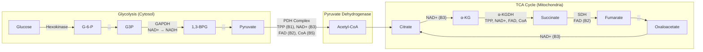
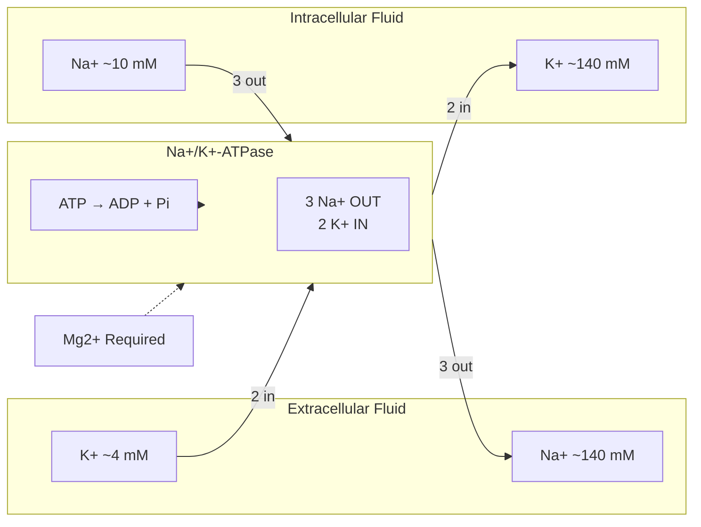
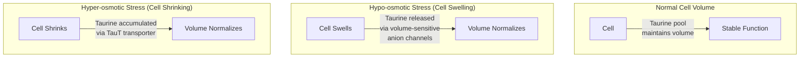
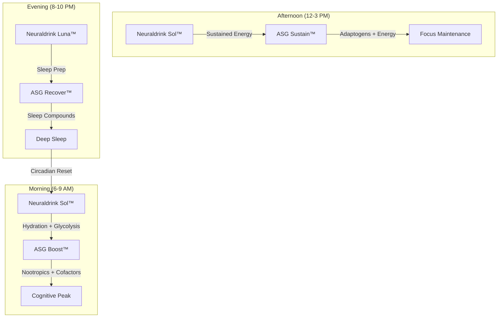

# Neuraldrink™ Complete Formulation Guide

<Note>
**Two Systems. One Philosophy.** Neuraldrink™ is not a sports drink, not an energy drink, and not a sleep aid. It's a precision-engineered brain fuel delivery system — Sol™ for daytime glycolysis optimization and cognitive hydration, Luna™ for nighttime recovery, sleep support, and metabolic restoration. Every ingredient, every form, every dose — calibrated for synergy with the NTRPX ecosystem.
</Note>

---

## Executive Summary

### The Neuraldrink™ Premise

The brain consumes **~120 grams of glucose daily** — approximately 20-25% of total body energy — despite representing only 2% of body mass. This metabolic demand is non-negotiable. Unlike muscles, the brain cannot store significant glycogen reserves and cannot efficiently burn fat for fuel. It requires a continuous, precisely-regulated glucose supply.

Neuraldrink™ Sol and Luna are engineered around this biological imperative:

| System | Primary Mission | Secondary Missions | Timing |
|--------|-----------------|-------------------|--------|
| **Neuraldrink Sol™** | Glycolysis optimization | Hydration, electrolyte balance, cognitive facilitation | Morning / Afternoon |
| **Neuraldrink Luna™** | Sleep quality optimization | Baseline hydration, metabolic restoration, circadian alignment | 30-60 min before bed |

### Why Powdered Drink Mix?

Certain high-efficacy nutrients are impractical for capsule delivery due to bulk requirements:

| Ingredient | Effective Dose | Capsules Required | Solution |
|------------|---------------|-------------------|----------|
| Glucose | 15,000 mg | Impossible | Drink mix |
| Creatine Monohydrate | 3,000-5,000 mg | 5-8 capsules | Drink mix |
| Glycine | 3,000 mg | 5-6 capsules | Drink mix |
| Magnesium Glycinate | 2,000+ mg | 3-4 capsules | Drink mix |
| Electrolytes | Variable | 2-4 capsules | Drink mix |

By consolidating these into drink mixes, Neuraldrink™ eliminates **15+ daily capsules** while providing optimal dosing, rapid absorption, and enhanced palatability.

---

## Part I: Neuraldrink Sol™ — Daytime Formulation

### Design Philosophy

**Sol** (Latin: *sun*) is engineered for the active, cognitive-demanding hours. Its three pillars:

1. **Glycolysis Optimization** — Complete glucose metabolism cofactor suite
2. **Precision Hydration** — Electrolytes calibrated for cellular function, not just fluid replacement
3. **Cognitive Facilitation** — Research-calibrated glucose dose for memory and attention enhancement

---

### Complete Ingredient Matrix — Neuraldrink Sol™

<Tabs>
<Tab title="Energy Substrates">

| Ingredient | Form | Amount | Function | Evidence |
|------------|------|--------|----------|----------|
| **D-Glucose** | Dextrose Monohydrate | 15,000 mg | Brain's obligatory fuel; glycolysis substrate | Brain requires ~120g/day; 25g optimal for acute cognition |
| **Fructose** | Anhydrous | 8,000 mg | Sustained energy; liver glycogen replenishment | GLUT5 transport; hepatic metabolism |
| **Total Sugars** | — | 23,000 mg | ~65:35 glucose:fructose ratio | Maximizes dual intestinal transport (SGLT1 + GLUT5) |

**Caloric Impact:** ~92 kcal per serving (23g carbohydrate × 4 kcal/g)

**Glucose:Fructose Rationale:**

The ~65:35 ratio is optimized for:
- **Dual transporter utilization**: Glucose via SGLT1 (active transport, ~60g/hour capacity), fructose via GLUT5 (facilitated diffusion, ~30g/hour)
- **Minimized GI distress**: Pure fructose > 25g causes osmotic diarrhea in many individuals
- **Sustained energy curve**: Glucose provides rapid energy; fructose metabolizes through liver for sustained release
- **Natural food mimicry**: Honey, fruits naturally contain similar ratios

</Tab>
<Tab title="Electrolytes">

| Ingredient | Form | Amount | %DV | Function |
|------------|------|--------|-----|----------|
| **Sodium** | Sodium Citrate + Sea Salt | 500 mg | 22% | ECF volume; nerve conduction; glucose co-transport |
| **Potassium** | Potassium Citrate | 400 mg | 9% | ICF volume; Na+/K+-ATPase; muscle function |
| **Magnesium** | Magnesium Citrate | 100 mg | 24% | ATP cofactor; 300+ enzyme activator; muscle relaxation |
| **Chloride** | From sea salt | 350 mg | 15% | Fluid balance; HCl production; nerve impulses |
| **Calcium** | Calcium Citrate | 50 mg | 4% | Nerve transmission; muscle contraction; enzyme cofactor |
| **Phosphate** | Dipotassium Phosphate | 100 mg | 8% | ATP component; bone mineralization; pH buffer |

**Electrolyte Ratio Strategy:**

The Neuraldrink Sol™ electrolyte profile follows a **balanced hydration** approach rather than extreme sodium loading:

- **Sodium:Potassium ratio ~1.25:1** — Balanced for cellular function, not pure sweat replacement
- **Citrate forms predominate** — Excellent bioavailability, alkalinizing effect, masks bitter mineral tastes
- **Sea salt inclusion** — Provides trace minerals (zinc, iodine, manganese) naturally present in unrefined salt

</Tab>
<Tab title="Glycolysis Cofactors">

| Ingredient | Form | Amount | %DV | Glycolytic Function |
|------------|------|--------|-----|---------------------|
| **Vitamin B1** | Thiamine HCl | 2 mg | 167% | TPP for pyruvate dehydrogenase (glycolysis → TCA gateway) |
| **Vitamin B2** | Riboflavin | 2 mg | 154% | FAD for ETC Complex I/II |
| **Vitamin B3** | Niacinamide | 25 mg | 156% | NAD+ for 5 dehydrogenases (GAPDH, PDH, etc.) |
| **Vitamin B5** | Calcium D-Pantothenate | 15 mg | 300% | Coenzyme A for acetyl-CoA formation |
| **Chromium** | Chromium Picolinate | 100 mcg | 286% | Insulin signaling; GLUT4 translocation |

**Why These Specific B-Vitamins?**

These four B-vitamins are directly required for glycolysis and oxidative phosphorylation:

**B1 (Thiamine):** The "glucose gateway" — forms TPP (thiamine pyrophosphate), the essential cofactor for pyruvate dehydrogenase (PDH), which converts pyruvate to acetyl-CoA. Without B1, glycolysis stalls at pyruvate and lactate accumulates.

**B2 (Riboflavin):** Forms FAD, the electron carrier for succinate dehydrogenase (Complex II) in the TCA cycle and for electron transport chain function.

**B3 (Niacin):** Forms NAD+, required for GAPDH (glycolysis step 6), PDH, isocitrate dehydrogenase, α-ketoglutarate dehydrogenase, and malate dehydrogenase — five critical dehydrogenases.

**B5 (Pantothenic Acid):** Forms Coenzyme A (CoA), required for acetyl-CoA synthesis — the molecule that feeds the TCA cycle.

**Chromium:** Enhances insulin receptor sensitivity via the chromodulin complex, improving cellular glucose uptake (GLUT4 translocation). Particularly important for glucose-facilitated cognition.

</Tab>
<Tab title="Cellular Hydration Support">

| Ingredient | Form | Amount | Function |
|------------|------|--------|----------|
| **Taurine** | Free-form | 1,000 mg | Osmolyte; cell volume regulation; GABAergic support |
| **Creatine** | Creapure® Monohydrate | 3,000 mg | Intracellular hydration; phosphocreatine system; cognitive support |
| **Vitamin C** | Ascorbic Acid | 100 mg | Antioxidant; collagen synthesis; iron absorption |

**Taurine — The Cellular Water Manager:**

Taurine is the most abundant free amino acid in the brain, heart, and skeletal muscle. Its primary role in hydration:

- **Osmoregulation**: Taurine is released from cells under hypoosmotic stress and accumulated under hyperosmotic stress, acting as a "water buffer"
- **Brain protection**: Taurine constitutes ~50% of adaptable intracellular osmolytes in brain tissue
- **Cell volume**: Maintains optimal cell volume for neurotransmission and enzyme function

**Creatine — Intracellular Hydration:**

Beyond its role in ATP regeneration, creatine draws water into cells through osmotic effects:

- **Cellular hydration**: Creatine uptake is accompanied by water influx, increasing cell volume
- **Cognitive benefits**: Meta-analyses confirm creatine improves working memory and processing speed, particularly under stress or sleep deprivation
- **Synergy with glucose**: Carbohydrate co-ingestion enhances creatine muscle uptake via insulin

</Tab>
</Tabs>

---

### Neuraldrink Sol™ Complete Formula

<Card title="Neuraldrink Sol™ — Per Serving (~26g powder)" icon="sun-bright">

| Category | Ingredient | Amount |
|----------|------------|--------|
| **Energy Substrates** | | |
| | D-Glucose (Dextrose Monohydrate) | 15,000 mg |
| | Fructose (Anhydrous) | 8,000 mg |
| **Electrolytes** | | |
| | Sodium (as citrate + sea salt) | 500 mg |
| | Potassium (as citrate + phosphate) | 400 mg |
| | Magnesium (as citrate) | 100 mg |
| | Chloride (from sea salt) | 350 mg |
| | Calcium (as citrate) | 50 mg |
| | Phosphate (as dipotassium phosphate) | 100 mg |
| **Glycolysis Cofactors** | | |
| | Thiamine (B1) | 2 mg |
| | Riboflavin (B2) | 2 mg |
| | Niacinamide (B3) | 25 mg |
| | Pantothenic Acid (B5) | 15 mg |
| | Chromium (as picolinate) | 100 mcg |
| **Cellular Support** | | |
| | Taurine | 1,000 mg |
| | Creatine Monohydrate (Creapure®) | 3,000 mg |
| | Vitamin C (Ascorbic Acid) | 100 mg |
| **Flavor System** | | |
| | Natural Citrus Flavor | q.s. |
| | Citric Acid | ~500 mg |
| | Stevia Extract (Reb-A 97%) | &lt;100 mg |

</Card>

**Nutrition Facts (Per Serving):**
- **Calories:** 92
- **Total Carbohydrate:** 23g (8% DV)
- **Sugars:** 23g
- **Added Sugars:** 23g (46% DV)

---

## Part II: Neuraldrink Luna™ — Nighttime Formulation

### Design Philosophy

**Luna** (Latin: *moon*) is engineered for the recovery and regeneration hours. Its three pillars:

1. **Sleep Architecture Optimization** — Glycine, magnesium glycinate, L-theanine, apigenin for deep sleep
2. **Metabolic Restoration** — Baseline glucose for overnight brain maintenance
3. **Circadian Alignment** — Low-stimulation formula to support natural sleep onset

---

### Complete Ingredient Matrix — Neuraldrink Luna™

<Tabs>
<Tab title="Sleep Support">

| Ingredient | Form | Amount | Function | Evidence |
|------------|------|--------|----------|----------|
| **Glycine** | Free-form | 3,000 mg | Core body temp ↓; NMDA receptor modulation; sleep quality | Multiple RCTs: 3g improves subjective sleep quality |
| **Magnesium** | Magnesium Glycinate | 300 mg (elemental) | GABA agonism; muscle relaxation; sleep onset | High bioavailability; calming form |
| **L-Theanine** | Suntheanine® | 200 mg | Alpha wave promotion; stress reduction; GABA/glutamate modulation | Synergy with glycine for relaxation |
| **Apigenin** | Chamomile extract (standardized) | 50 mg | Benzodiazepine site binding; anxiolytic | Traditional sleep support; mild |

**Glycine — The Sleep Optimizer:**

Glycine is the cornerstone of the Luna formula. At 3g, glycine:

- **Lowers core body temperature**: Peripheral vasodilation induces heat loss, signaling sleep onset
- **Improves sleep architecture**: Enhances slow-wave (deep) sleep without morning grogginess
- **Provides metabolic substrate**: Glycine is a glucogenic amino acid and neurotransmitter
- **Tastes pleasant**: Unlike most amino acids, glycine is naturally sweet (hence its name from Greek *glykys* = sweet)

**Magnesium Glycinate — The Calming Form:**

Magnesium glycinate combines elemental magnesium with glycine, providing:

- **Dual action**: Both magnesium and glycine support sleep
- **GABA enhancement**: Magnesium binds GABA-A receptors, promoting relaxation
- **No laxative effect**: Unlike magnesium citrate or oxide, glycinate is GI-gentle
- **High bioavailability**: Amino acid chelate ensures superior absorption

**L-Theanine — Alpha Wave Amplifier:**

L-theanine, the calming amino acid from green tea:

- **Alpha brain waves**: Promotes wakeful relaxation (8-12 Hz EEG activity)
- **GABA/glutamate balance**: Modulates excitatory/inhibitory neurotransmitter ratio
- **Cortisol reduction**: Blunts stress hormone response
- **Synergy**: Enhances the calming effects of glycine and magnesium

**Apigenin — Gentle GABAergic Support:**

Apigenin, the active compound in chamomile:

- **Benzodiazepine site**: Binds GABA-A receptors at the benzodiazepine binding site
- **Mild anxiolytic**: Reduces anxiety without sedation or dependency
- **CD38 inhibition**: May support NAD+ levels (secondary benefit)

</Tab>
<Tab title="Baseline Energy">

| Ingredient | Form | Amount | Function |
|------------|------|--------|----------|
| **D-Glucose** | Dextrose Monohydrate | 8,000 mg | Overnight brain fuel maintenance |
| **Fructose** | Anhydrous | 4,000 mg | Sustained liver glycogen; hepatic glucose production |
| **Total Sugars** | — | 12,000 mg | ~67:33 glucose:fructose ratio |

**Why Include Sugars in a Sleep Formula?**

The brain doesn't sleep. During sleep, the brain:
- Performs memory consolidation (requires ATP)
- Clears metabolic waste via glymphatic system (requires energy)
- Maintains neuronal membrane potentials (requires glucose)

A moderate glucose dose (8g) ensures:
- No hypoglycemic awakening
- Adequate substrate for overnight brain maintenance
- Minimal blood sugar disruption (low total carb load)

The lower glucose:fructose ratio (67:33 vs. 65:35 in Sol) slightly favors fructose for:
- Gentler glycemic response
- Sustained liver glycogen release through the night

</Tab>
<Tab title="Minimal Electrolytes">

| Ingredient | Form | Amount | %DV | Function |
|------------|------|--------|-----|----------|
| **Sodium** | Sodium Citrate | 200 mg | 9% | Minimal; avoid fluid retention before bed |
| **Potassium** | Potassium Citrate | 200 mg | 4% | Minimal; support nighttime muscle recovery |
| **Magnesium** | From Mg Glycinate | 300 mg | 71% | Primary sleep support mineral |

**Reduced Electrolyte Rationale:**

Unlike Sol, Luna deliberately minimizes sodium and potassium because:
- High sodium before bed → fluid retention → nocturnal urination
- High potassium → may interfere with heart rate variability during sleep in sensitive individuals
- Magnesium is prioritized as the sleep-supporting electrolyte

</Tab>
</Tabs>

---

### Neuraldrink Luna™ Complete Formula

<Card title="Neuraldrink Luna™ — Per Serving (~15g powder)" icon="moon">

| Category | Ingredient | Amount |
|----------|------------|--------|
| **Sleep Support** | | |
| | Glycine | 3,000 mg |
| | Magnesium (as glycinate) | 300 mg |
| | L-Theanine (Suntheanine®) | 200 mg |
| | Apigenin (Chamomile extract) | 50 mg |
| **Baseline Energy** | | |
| | D-Glucose (Dextrose Monohydrate) | 8,000 mg |
| | Fructose (Anhydrous) | 4,000 mg |
| **Minimal Electrolytes** | | |
| | Sodium (as citrate) | 200 mg |
| | Potassium (as citrate) | 200 mg |
| **Flavor System** | | |
| | Natural Berry Flavor | q.s. |
| | Citric Acid | ~300 mg |
| | Stevia Extract (Reb-A 97%) | &lt;50 mg |

</Card>

**Nutrition Facts (Per Serving):**
- **Calories:** 48
- **Total Carbohydrate:** 12g (4% DV)
- **Sugars:** 12g
- **Added Sugars:** 12g (24% DV)
- **Magnesium:** 300 mg (71% DV)

---

## Part III: The Science of Precision Hydration

### Beyond "Drink More Water"

Traditional hydration advice treats water as fungible. But cellular hydration is not just about water volume — it's about **osmotic gradients**, **electrolyte balance**, and **organic osmolytes** that regulate cell volume.

### The Na+/K+-ATPase Pump — The Heart of Cellular Hydration

Every cell maintains ionic gradients through the Na+/K+-ATPase pump:

**Key Points:**
- **ATP-dependent**: The pump consumes ~40% of the brain's resting ATP
- **Magnesium-required**: Mg2+ is essential for ATPase activity
- **Ratio matters**: 3 Na+ out : 2 K+ in creates electrochemical gradient
- **Brain energy**: Neuronal signaling depends entirely on these gradients

This is why Neuraldrink™ includes **both** sodium and potassium in bioavailable forms, with adequate magnesium to support pump function.

### Electrolyte Forms — Why Citrates Dominate

| Form | Bioavailability | GI Tolerance | Taste | Notes |
|------|-----------------|--------------|-------|-------|
| **Citrate** | ★★★★★ | ★★★★★ | Slightly tart | Alkalinizing; masks bitterness |
| Chloride | ★★★★☆ | ★★★☆☆ | Salty | Can cause GI distress at high doses |
| Gluconate | ★★★★☆ | ★★★★★ | Neutral | Lower elemental yield |
| Oxide | ★★☆☆☆ | ★★☆☆☆ | Chalky | Poor absorption; laxative effect |
| Sulfate | ★★★☆☆ | ★★☆☆☆ | Bitter | Osmotic laxative |

**Neuraldrink™ uses citrate forms primarily because:**
1. Superior bioavailability (organic acid chelation)
2. Excellent GI tolerance
3. Mild citrus-compatible taste profile
4. Alkalinizing effect (buffers acid-generating metabolism)

### Taurine — The Osmolyte Expert

Taurine's role in cellular hydration is often overlooked:

**Brain-Specific Importance:**
- Taurine is the dominant organic osmolyte in brain tissue
- Depletion → increased mortality and seizure activity under osmotic stress
- 1,000 mg provides meaningful osmolyte support without excessive doses

### Creatine — The Intracellular Hydration Agent

Creatine's osmotic effects:

- Creatine is actively transported into cells via CRT (creatine transporter)
- Water follows creatine into cells, increasing cell volume
- Cell hydration status → enhanced protein synthesis, reduced protein breakdown
- Brain creatine levels → cognitive function under stress

**Synergy with Glucose:**
Carbohydrate co-ingestion enhances creatine uptake through insulin-mediated mechanisms. The glucose in Neuraldrink Sol™ supports both cognitive function AND creatine absorption.

---

## Part IV: Glycolysis Optimization — Complete Pathway Support

### Why Glycolysis Matters

Glycolysis is the 10-step pathway that converts glucose to pyruvate, generating:
- **2 ATP** (net) directly
- **2 NADH** (→ ~5 ATP via ETC)
- **2 Pyruvate** (→ ~25 ATP via TCA + ETC)

**Total yield: ~30-38 ATP per glucose molecule**

For the brain consuming 120g glucose/day, this translates to:

**120g ÷ 180g/mol = 0.67 mol glucose/day**
**0.67 mol × 30 ATP × 507.18 g/mol ATP ≈ 10 kg ATP/day**

The brain produces and consumes roughly **10 kilograms of ATP daily** — 6-7× its own mass.

### The Glycolysis Cofactor Suite

Neuraldrink Sol™ provides the complete cofactor suite for glycolysis and oxidative phosphorylation:

| Enzyme/Complex | Cofactor Required | Neuraldrink Sol™ Provision |
|----------------|-------------------|---------------------------|
| Hexokinase | Mg2+ | Magnesium 100mg |
| Phosphofructokinase | Mg2+ | Magnesium 100mg |
| GAPDH | NAD+ | Niacinamide → NAD+ |
| Phosphoglycerate kinase | Mg2+ | Magnesium 100mg |
| Pyruvate kinase | Mg2+, K+ | Magnesium 100mg, Potassium 400mg |
| Pyruvate dehydrogenase | TPP, NAD+, FAD, CoA, lipoate | B1, B3, B2, B5 |
| Isocitrate dehydrogenase | NAD+ | Niacinamide → NAD+ |
| α-Ketoglutarate dehydrogenase | TPP, NAD+, FAD, CoA, lipoate | B1, B3, B2, B5 |
| Succinate dehydrogenase | FAD | Riboflavin → FAD |
| Malate dehydrogenase | NAD+ | Niacinamide → NAD+ |
| ETC Complex I | FMN, NAD+ | Riboflavin, Niacinamide |
| ETC Complex II | FAD | Riboflavin |
| ATP Synthase | Mg2+ | Magnesium 100mg |

**The critical insight:** Glycolysis and oxidative phosphorylation are **not** limited by enzyme quantity under normal conditions — they're limited by **cofactor availability** and **substrate supply**. Neuraldrink Sol™ ensures neither is rate-limiting.

### Chromium — The Insulin Potentiator

Chromium enhances insulin signaling through the chromodulin complex:

1. Insulin binds receptor → receptor autophosphorylation
2. Chromodulin (with 4 Cr3+ ions) binds to and amplifies receptor kinase activity
3. Enhanced signaling → increased GLUT4 translocation
4. More glucose enters cells for glycolysis

**Clinical relevance:** People with poor glucose regulation show greater cognitive benefit from glucose supplementation. Chromium helps optimize glucose uptake, potentially extending the cognitive facilitation effect.

---

## Part V: Ingredients Intentionally Excluded

### Palmitic Acid — Evaluated and Rejected

<Warning>
**Formulation Decision:** Palmitic acid (C16:0) was evaluated for potential glycolysis/hydration benefits and was **intentionally excluded** from all NTRPX formulations.
</Warning>

**Rationale for Exclusion:**

Palmitic acid is a saturated fatty acid with concerning metabolic effects:

| Concern | Evidence |
|---------|----------|
| ↑ LDL cholesterol | Raises atherogenic lipoproteins |
| TLR4 activation | Promotes systemic inflammation |
| Endothelial dysfunction | Impairs vascular health |
| Lipotoxicity | Accumulates in non-adipose tissues |

While some research suggests palmitic acid may play roles in membrane structure and signaling, the evidence for harm far outweighs potential benefits when taken as a supplement. The body synthesizes adequate palmitic acid endogenously and tightly regulates tissue concentrations.

**NTRPX Position:** No ingredient with significant cardiovascular or metabolic risk belongs in a daily-use formulation. Palmitic acid fails this criterion.

### High-Fructose Corn Syrup (HFCS) — Rejected

Neuraldrink™ uses **pure crystalline fructose**, not HFCS, because:

| Factor | HFCS-55 | Pure Fructose |
|--------|---------|---------------|
| Composition | 55% fructose, 45% glucose (mixture) | 100% fructose (precise dosing) |
| Processing | Industrial enzymatic conversion | Simple crystallization |
| Inflammation | ↑ CRP vs. sucrose in meta-analysis | No excess inflammation data |
| Dosing precision | Variable | Exact |
| Matrix | Often includes maltodextrin, preservatives | Pure compound |

### Artificial Sweeteners — Minimized

While aspartame, sucralose, and acesulfame-K are GRAS, Neuraldrink™ uses only **stevia (Reb-A)** in minimal quantities because:

- No known metabolic concerns
- Does not affect gut microbiome
- No insulin response
- Sufficient to enhance palatability without masking natural flavors

### Caffeine — Absent by Design

Neuraldrink™ contains **zero caffeine** to preserve circadian flexibility and stack compatibility:

- Sol can be consumed afternoon without sleep disruption
- Luna would be counterproductive with caffeine
- Users who want stimulation should use **ParaCaffeine™** or **Sprint™** separately

---

## Part VI: System Synergies

### Neuraldrink™ × All Systems Go™

**Key Synergies:**

| Timing | Neuraldrink™ | ASG Phase | Synergy |
|--------|--------------|-----------|---------|
| Morning | Sol | Boost | Creatine + CDP-Choline = enhanced ATP, cognition |
| Morning | Sol | Boost | B-vitamins + CoQ10 = complete ETC support |
| Afternoon | Sol | Sustain | Glucose + Adaptogens = sustained mental energy |
| Evening | Luna | Recover | Glycine + Magnesium glycinate = potentiated sleep onset |

### Neuraldrink™ × ParaCaffeine™

**Sol + ParaCaffeine = Enhanced Energy Drink Alternative**

When consumed together, Neuraldrink Sol™ + ParaCaffeine™ provide:
- Glucose for brain fuel + Paraxanthine for adenosine antagonism
- No jitters (paraxanthine is cleaner than caffeine)
- Electrolytes prevent dehydration from caffeine's mild diuretic effect
- Creatine + caffeine synergy for cognitive and physical performance

### Neuraldrink™ × Sprint™

**Sol + Sprint = Pre-Performance Stack**

For acute high-demand situations (exams, competitions, presentations):
- Neuraldrink Sol provides substrate and hydration base
- Sprint adds Alpha-GPC, Huperzine A, paraxanthine for peak acetylcholine and alertness
- The combination maximizes brain energy AND neurotransmitter function

---

## Part VII: Taste, Solubility, and Practical Considerations

### Flavor System Design

**Neuraldrink Sol™ (Citrus Profile):**
- Base sweetness: Glucose/fructose (~23g)
- Tartness: Citric acid (~500mg) + magnesium citrate
- Character: Natural citrus flavor
- Enhancement: Stevia (&lt;100mg) for sweetness without added sugars
- Target: Refreshing, not overly sweet; Pocari Sweat-like sensory profile

**Neuraldrink Luna™ (Berry Profile):**
- Base sweetness: Glucose/fructose (~12g) + glycine (naturally sweet)
- Tartness: Citric acid (~300mg)
- Character: Natural mixed berry flavor
- Enhancement: Stevia (&lt;50mg)
- Target: Mild, soothing, evening-appropriate

### Solubility Notes

| Ingredient | Solubility (g/100mL) | Notes |
|------------|---------------------|-------|
| Glucose | >100 | Excellent, rapid |
| Fructose | >400 | Excellent, rapid |
| Creatine Monohydrate | 1.6 (cold), 14 (hot) | Requires stirring; slightly gritty if undissolved |
| Glycine | 25 | Good; dissolves readily |
| Taurine | 10 | Good |
| Magnesium Citrate | 20 | Good |
| Magnesium Glycinate | ~5 | Moderate; dissolves with stirring |
| L-Theanine | 5 | Moderate |
| B-vitamins | Variable | Excellent at mg doses |

**Mixing Instructions:**
1. Add powder to 16-20 oz (473-591 mL) cold water
2. Shake or stir vigorously for 30 seconds
3. Allow creatine to fully hydrate (1-2 min)
4. Consume within 30 minutes

### Ingredients Relegated to Capsule Systems

Certain NTRPX ingredients are intentionally **excluded from the drink mix** due to taste, solubility, or stability concerns:

| Ingredient | Reason | Product Placement |
|------------|--------|-------------------|
| Huperzine A | Extremely bitter | Sprint™ capsules |
| Alpha-GPC | Potential fishy taste | Sprint™ capsules |
| Salidroside | Bitter | ASG Sustain™ capsules |
| Phosphatidylserine | Fat-soluble | ASG Boost™ capsules |
| PQQ | Red-orange color; metallic taste | ASG Boost™ capsules |
| CDP-Choline | Stable in capsules; hygroscopic | ASG Boost/Sustain™ capsules |

---

## Part VIII: Quality Specifications

### Ingredient Sourcing

| Ingredient | Preferred Source | Certification |
|------------|-----------------|---------------|
| Creatine Monohydrate | Creapure® (AlzChem, Germany) | Kosher, Halal, WADA |
| L-Theanine | Suntheanine® (Taiyo) | Patented enzymatic process |
| Magnesium Glycinate | Albion Minerals | TRAACS® chelate |
| Glucose | USP/Ph. Eur. grade | ≥99.5% purity |
| Fructose | USP grade | ≥99.0% purity |
| Glycine | USP grade | ≥99.0% purity |
| Taurine | Fermentation-derived | Vegan, Non-GMO |
| Apigenin | Chamomile extract, standardized | ≥98% apigenin |
| Sea Salt | Celtic or Himalayan | Unrefined |

### Heavy Metal Limits

| Metal | Limit |
|-------|-------|
| Lead | &lt;0.5 ppm |
| Arsenic | &lt;1.0 ppm |
| Cadmium | &lt;0.5 ppm |
| Mercury | &lt;0.1 ppm |

### Microbiological Limits

| Test | Specification |
|------|---------------|
| Total Plate Count | &lt;1,000 CFU/g |
| Yeast & Mold | &lt;100 CFU/g |
| E. coli | Not detected |
| Salmonella | Not detected |

---

## Part IX: Usage Guidelines

### Neuraldrink Sol™ Timing

| Use Case | Timing | Notes |
|----------|--------|-------|
| General daily use | Morning with breakfast | Best with food for stable glucose |
| Pre-workout | 30-60 min before | Provides substrate and hydration |
| Cognitive demand | 30-40 min before | Allows glucose facilitation effect |
| Afternoon refresh | Early afternoon | Avoid late afternoon to prevent sleep interference |

**Maximum Daily Servings:** 2 (morning + afternoon)

### Neuraldrink Luna™ Timing

| Use Case | Timing | Notes |
|----------|--------|-------|
| Sleep support | 30-60 min before bed | Allows glycine/theanine absorption |
| Nighttime relaxation | Evening, as desired | Can use earlier for relaxation without sleep |

**Maximum Daily Servings:** 1

### Contraindications and Precautions

| Condition | Sol | Luna | Notes |
|-----------|-----|------|-------|
| Diabetes (Type 1 or 2) | Caution | Caution | Monitor blood glucose; consult physician |
| Prediabetes | Caution | Use with meals | May need smaller portions |
| Reactive hypoglycemia | Caution | Use with protein | Combine with protein/fat to slow absorption |
| Chronic kidney disease | Avoid | Avoid | Electrolyte/creatine load inappropriate |
| Low-carb/keto diet | Consider Zero variant | Lower dose okay | May disrupt ketosis |
| Pregnancy/nursing | Consult physician | Consult physician | Generally safe but confirm with provider |

---

## Part X: Frequently Asked Questions

<AccordionGroup>

<Accordion title="Isn't this just a sugary drink?">

**No.** Neuraldrink™ is a precision-formulated brain fuel system, not a recreational beverage.

The glucose isn't "sugar for sweetness" — it's the brain's **obligatory metabolic substrate**. The 15g dose (Sol) is calibrated based on cognitive facilitation research showing optimal effects at 25g acutely, scaled down for daily use. The B-vitamins, magnesium, chromium, and other cofactors ensure that glucose is efficiently metabolized through glycolysis and oxidative phosphorylation rather than spilling into non-oxidative pathways.

This is analogous to questioning whether a sports car "just runs on gas" — yes, but it's engineered to use that fuel optimally.

</Accordion>

<Accordion title="How does this compare to sports drinks like Gatorade?">

| Feature | Gatorade (20 oz) | Neuraldrink Sol™ (20 oz) |
|---------|-----------------|-------------------------|
| Sugars | 36g | 23g |
| Sodium | 270 mg | 500 mg |
| Potassium | 75 mg | 400 mg |
| Magnesium | 0 mg | 100 mg |
| B-vitamins | None | Full glycolysis suite |
| Creatine | None | 3,000 mg |
| Taurine | None | 1,000 mg |
| Chromium | None | 100 mcg |
| Purpose | Sweat replacement | Brain optimization |

Gatorade was designed in 1965 for football players losing sweat. Neuraldrink™ was designed in 2026 for knowledge workers optimizing cognition.

</Accordion>

<Accordion title="Can I use this if I'm on a low-carb or keto diet?">

**Sol:** Will temporarily disrupt ketosis. If strict keto is your goal, consider the Neuraldrink Zero™ variant (coming soon) or use Sol only for high-demand cognitive situations.

**Luna:** The 12g carbohydrate is low enough that most people can maintain ketosis, especially if timing allows (consumed after daily carb limit reset). The glycine and magnesium actually support ketogenic metabolism.

</Accordion>

<Accordion title="Why include creatine in a drink mix?">

Creatine monohydrate is bulky (3-5g/day therapeutic dose) and doesn't dissolve well in water. However, it dissolves **well enough** with stirring and provides:

1. **Phosphocreatine buffer**: Rapid ATP regeneration for brain
2. **Intracellular hydration**: Draws water into cells
3. **Synergy with glucose**: Insulin enhances creatine uptake
4. **Capsule count reduction**: 3g creatine = 5-6 capsules avoided

The slight grittiness is the tradeoff for avoiding a handful of additional capsules daily.

</Accordion>

<Accordion title="Is 300mg magnesium in Luna safe to take daily?">

**Yes.** The Tolerable Upper Intake Level (UL) for supplemental magnesium is 350mg/day for adults. Luna provides 300mg, well within safe limits.

Magnesium glycinate is also the best-tolerated form — unlike magnesium citrate or oxide, it rarely causes GI distress even at higher doses.

Note that this UL applies only to supplemental magnesium, not dietary magnesium from food. You can safely consume Luna while eating magnesium-rich foods.

</Accordion>

<Accordion title="Will the sugars in Luna interfere with sleep?">

**Unlikely.** The 12g carbohydrate in Luna is modest, and the glycemic response is blunted by:

1. The fructose component (lower GI)
2. The protein/amino acid content (glycine, L-theanine)
3. Evening insulin sensitivity (generally lower than morning)

If you're particularly sensitive to carbohydrates before bed, consider having Luna 60-90 minutes before sleep rather than immediately before.

</Accordion>

</AccordionGroup>

---

## Summary Tables

### Neuraldrink Sol™ Complete Specification

| Parameter | Specification |
|-----------|---------------|
| **NTRPX Name** | CerebroFuel Sol™ |
| **Category** | Daytime Brain Hydration System |
| **Products** | Neuraldrink Sol™ |
| **Serving Size** | ~26g powder + 16-20 oz water |
| **Primary Function** | Glycolysis optimization + Hydration |
| **Key Ingredients** | Glucose 15g, Fructose 8g, Creatine 3g, Electrolytes, B-vitamins |
| **Calories** | 92 kcal |
| **Timing** | Morning/Afternoon |
| **Max Servings/Day** | 2 |

### Neuraldrink Luna™ Complete Specification

| Parameter | Specification |
|-----------|---------------|
| **NTRPX Name** | CerebroRest Luna™ |
| **Category** | Nighttime Sleep & Recovery System |
| **Products** | Neuraldrink Luna™ |
| **Serving Size** | ~15g powder + 12-16 oz water |
| **Primary Function** | Sleep optimization + Baseline hydration |
| **Key Ingredients** | Glycine 3g, Magnesium glycinate 300mg, L-Theanine 200mg, Apigenin 50mg, Glucose 8g |
| **Calories** | 48 kcal |
| **Timing** | 30-60 min before bed |
| **Max Servings/Day** | 1 |

---

## References

<AccordionGroup>

<Accordion title="Glucose & Glycolysis">

1. Mergenthaler P, et al. Sugar for the brain: the role of glucose in physiological and pathological brain function. *Trends Neurosci*. 2013;36(10):587-597.
2. Messier C. Glucose improvement of memory: a review. *Eur J Pharmacol*. 2004;490(1-3):33-57.
3. Riby LM. The impact of age and task domain on cognitive performance: a meta-analytic review of the glucose facilitation effect. *Brain Impairment*. 2004;5(2):145-165.
4. Owen L, et al. Metabolic agents that enhance ATP can improve cognitive functioning: a review of the evidence for glucose, oxygen, pyruvate, creatine, and L-carnitine. *Nutrients*. 2011;3(8):735-755.

</Accordion>

<Accordion title="Electrolytes & Hydration">

5. Shirreffs SM, Sawka MN. Fluid and electrolyte needs for training, competition, and recovery. *J Sports Sci*. 2011;29 Suppl 1:S39-46.
6. de Baaij JH, et al. Magnesium in man: implications for health and disease. *Physiol Rev*. 2015;95(1):1-46.
7. Rondanelli M, et al. The effects of magnesium supplementation on subjective anxiety and stress—a systematic review. *Nutrients*. 2021;13(4):1161.

</Accordion>

<Accordion title="Taurine & Osmolytes">

8. Schaffer S, et al. Role of osmoregulation in the actions of taurine. *Amino Acids*. 2000;19(3-4):527-546.
9. Pasantes-Morales H, et al. Role of taurine in osmoregulation in brain cells: mechanisms and functional implications. *Amino Acids*. 1998;14(1-3):317-325.
10. Trachtman H, et al. Taurine and osmoregulation: taurine is a cerebral osmoprotective molecule in chronic hypernatremic dehydration. *Pediatr Res*. 1988;23(1):35-39.

</Accordion>

<Accordion title="Sleep Support">

11. Bannai M, et al. The effects of glycine on subjective daytime performance in partially sleep-restricted healthy volunteers. *Front Neurol*. 2012;3:61.
12. Inagawa K, et al. Subjective effects of glycine ingestion before bedtime on sleep quality. *Sleep Biol Rhythms*. 2006;4(1):75-77.
13. Abbasi B, et al. The effect of magnesium supplementation on primary insomnia in elderly: a double-blind placebo-controlled clinical trial. *J Res Med Sci*. 2012;17(12):1161-1169.
14. Kim S, et al. GABA and L-theanine mixture decreases sleep latency and improves NREM sleep. *Pharm Biol*. 2019;57(1):65-73.

</Accordion>

<Accordion title="Creatine & Cognition">

15. Avgerinos KI, et al. Effects of creatine supplementation on cognitive function of healthy individuals: a systematic review of randomized controlled trials. *Exp Gerontol*. 2018;108:166-173.
16. Rae C, et al. Oral creatine monohydrate supplementation improves brain performance: a double-blind, placebo-controlled, cross-over trial. *Proc Biol Sci*. 2003;270(1529):2147-2150.
17. Kreider RB, et al. International Society of Sports Nutrition position stand: safety and efficacy of creatine supplementation in exercise, sport, and medicine. *J Int Soc Sports Nutr*. 2017;14:18.

</Accordion>

</AccordionGroup>

---

<Note>
**Version:** 1.0 | **Last Updated:** January 2026 | **Document Status:** Complete Formulation Guide

This document represents the definitive formulation specification for Neuraldrink Sol™ and Neuraldrink Luna™. All ingredients, forms, and doses have been selected based on clinical evidence, safety data, and synergistic optimization with the NTRPX product ecosystem.
</Note>