```mermaid
flowchart TB
    subgraph BOOST_MECH["BOOST™ Mechanism Integration"]
        subgraph CHOLINERGIC_B["Cholinergic Priming"]
            CDP_B[CDP-Choline 300mg] --> ACH_B[↑ Acetylcholine]
            CDP_B --> URIDINE_B[Uridine Release]
            URIDINE_B --> MEMBRANE_B[↑ Membrane Synthesis]
        end
        
        subgraph DOPAMINE_B["Dopaminergic Drive"]
            TYR_B[L-Tyrosine 500mg] --> DA_B[↑ Dopamine Synthesis]
            SALID_B[Salidroside 100mg] --> MAO_B[MAO-B Inhibition]
            MAO_B --> DA_SPARE[↑ Dopamine Availability]
            DA_B --> MOTIVATION[Motivation & Drive]
            DA_SPARE --> MOTIVATION
        end
        
        subgraph MITO_B["Mitochondrial Ignition"]
            PQQ_B[PQQ 20mg] --> BIOGEN[↑ Mitochondrial Biogenesis]
            COQ10_B[CoQ10 100mg] --> ETC[↑ Electron Transport]
            CREATINE_B[Creatine 2.5g] --> PCR[↑ Phosphocreatine]
            BIOGEN --> ATP_B[Maximum ATP Capacity]
            ETC --> ATP_B
            PCR --> ATP_B
        end
        
        subgraph NEURO_B["Neuroprotection"]
            LION_B[Lion's Mane 500mg] --> NGF_B[↑ NGF]
            NGF_B --> PLASTIC[↑ Neuroplasticity]
        end
        
        ACH_B --> MORNING_OUTPUT[MORNING OUTPUT:<br>Sharp, Motivated, Energized]
        MOTIVATION --> MORNING_OUTPUT
        ATP_B --> MORNING_OUTPUT
        PLASTIC --> MORNING_OUTPUT
    end
```

```mermaid
flowchart TB
    subgraph RECOVER_MECH["RECOVER™ Mechanism Integration"]
        subgraph SLEEP_ONSET_R["Sleep Onset"]
            GLYCINE_R[Glycine 3g] --> THERMO_R[Core Temp ↓0.3°C]
            THERMO_R --> SLEEP_SIGNAL[Natural Sleep Signal]
            MAG_R[Magnesium 244mg] --> GABA_POT[GABA Potentiation]
            THEA_R[L-Theanine 200mg] --> ALPHA_R[↑ Alpha Waves]
            GABA_POT --> RELAX[Relaxation]
            ALPHA_R --> RELAX
        end
        
        subgraph SLEEP_QUALITY_R["Sleep Architecture"]
            TAURINE_R[Taurine 1g] --> GABA_A[GABA-A Agonism]
            APIG_R[Apigenin 50mg] --> ANXIO_R[Anxiolytic]
            APIG_R --> CD38_R[CD38 Inhibition]
            GABA_A --> DEEP_SLEEP[↑ Deep Sleep]
            ANXIO_R --> DEEP_SLEEP
        end
        
        subgraph OVERNIGHT_REPAIR_R["Overnight Repair"]
            NR_R[NR 300mg] --> NAD_R[↑ NAD+]
            CD38_R --> NAD_R
            NAD_R --> SIRT_R[Sirtuin Activation]
            ZINC_R[Zinc 15mg] --> IMMUNE_R[Immune Function]
            SIRT_R --> REPAIR_R[Cellular Repair]
            IMMUNE_R --> REPAIR_R
        end
        
        SLEEP_SIGNAL --> EVENING_OUTPUT[EVENING OUTPUT:<br>Rapid Onset, Deep Sleep, Full Repair]
        RELAX --> EVENING_OUTPUT
        DEEP_SLEEP --> EVENING_OUTPUT
        REPAIR_R --> EVENING_OUTPUT
    end
```

## NTRPX Meta System™

<CardGroup cols={4}>

<Card title="Systems" icon="cubes" color="#5A8FA8">
4 Integrated Systems
</Card>

<Card title="Subsystems" icon="cube" color="#5A8FA8">
7 Targeted Formulations
</Card>

<Card title="Biological Domains" icon="dna" color="#5A8FA8">
12 Optimized Pathways
</Card>

<Card title="Design Principle" icon="circle-nodes" color="#5A8FA8">
Circadian Synchronization
</Card>

</CardGroup>

**The most comprehensive, synergistic supplementation system ever conceived — engineered from first principles to optimize every domain of human biological performance.** The NTRPX Meta System™ is not a collection of supplements. It is a unified architecture where every ingredient, dose, and timing decision has been made with full awareness of every other component. Whether you use a single subsystem or the complete protocol, each piece is designed to function independently while amplifying the others when combined. The result: a complete biological optimization system that enhances energy, cognition, motivation, mood, sleep quality, recovery, and longevity — synchronized to your circadian rhythm for maximum effect.

<Note>
**Design Philosophy:** We don't formulate products, then figure out how they work together. We map the complete biological terrain first, identify every pathway that governs human performance, then engineer a unified system where each component plays a defined role. Redundancy is eliminated. Synergies are maximized. Antagonisms are impossible.
</Note>

---

## System Architecture Overview

```mermaid
flowchart TB
    subgraph META["NTRPX META SYSTEM™"]
        subgraph ASG["ALL SYSTEMS GO™ — Foundation System"]
            BOOST[BOOST™<br>Morning Activation<br>━━━━━━━━━━━━<br>Cholinergic Priming<br>Dopaminergic Drive<br>Mitochondrial Ignition]
            SUSTAIN[SUSTAIN™<br>Daytime Performance<br>━━━━━━━━━━━━<br>Cognitive Endurance<br>Membrane Support<br>Clean Adenosine Antagonism]
            RECOVER[RECOVER™<br>Evening Recovery<br>━━━━━━━━━━━━<br>GABAergic Calm<br>Thermoregulatory Sleep<br>Cellular Repair]
        end
        
        subgraph NEURAL["NEURALDRINK™ — Circadian Beverages"]
            SOL[SOL™<br>Daytime Hydration<br>━━━━━━━━━━━━<br>Electrolyte Optimization<br>Glucose Metabolism<br>Sustained Energy]
            LUNA[LUNA™<br>Nighttime Hydration<br>━━━━━━━━━━━━<br>Sleep Architecture<br>Thermoregulation<br>Overnight Recovery]
        end
        
        subgraph PERFORMANCE["PERFORMANCE STACKS"]
            PARA[PARACAFFEINE +™<br>Clean Stimulation<br>━━━━━━━━━━━━<br>A2A Antagonism<br>No Anxiogenic Metabolites<br>Sleep-Compatible]
            SPRINT[SPRINT™<br>Acute Performance<br>━━━━━━━━━━━━<br>Maximum Cholinergic<br>Dopaminergic Surge<br>Peak Output]
        end
    end
    
    BOOST --> |"6AM-10AM"| SUSTAIN
    SUSTAIN --> |"10AM-6PM"| RECOVER
    RECOVER --> |"6PM-10PM"| BOOST
    
    SOL -.-> |"Pairs with"| BOOST
    SOL -.-> |"Pairs with"| SUSTAIN
    LUNA -.-> |"Pairs with"| RECOVER
    
    PARA -.-> |"Add to"| SUSTAIN
    SPRINT -.-> |"Replace for"| BOOST
```

---

## The 12 Biological Domains

<AccordionGroup>

<Accordion title="Complete Biological Coverage" icon="dna">

The NTRPX Meta System™ optimizes 12 distinct biological domains. Every ingredient is mapped to specific domains, ensuring complete coverage without redundancy.

### Domain Coverage Matrix

| Domain | Boost™ | Sustain™ | Recover™ | Sol™ | Luna™ | ParaCaffeine +™ | Sprint™ |
|--------|--------|----------|----------|------|-------|-----------------|---------|
| **1. Cholinergic** | ★★★ | ★★★ | ★ | — | — | ★ | ★★★★★ |
| **2. Dopaminergic** | ★★★★ | ★★ | — | ★★ | — | ★★ | ★★★★★ |
| **3. Serotonergic** | ★ | ★★ | ★★ | — | ★ | — | — |
| **4. GABAergic** | — | ★ | ★★★★★ | — | ★★★★ | — | — |
| **5. Mitochondrial** | ★★★★★ | ★★★ | ★★★ | ★★★ | ★★ | ★★ | ★★★ |
| **6. ATP Systems** | ★★★★ | ★★★ | ★★ | ★★★★ | ★★ | ★★★ | ★★★★ |
| **7. NAD+ Metabolism** | ★★★ | ★★ | ★★★★ | ★★ | ★★ | — | ★★ |
| **8. HPA Axis** | ★★★ | ★★★ | ★★★ | ★★ | ★★ | ★ | ★ |
| **9. Circadian** | ★★★★ | ★★★ | ★★★★★ | ★★★ | ★★★★★ | ★★ | ★ |
| **10. Methylation** | ★★★★ | ★★★ | ★★★ | ★★ | ★★ | ★ | ★★ |
| **11. Neuroprotection** | ★★★★ | ★★★★ | ★★★ | ★★ | ★★ | ★★ | ★★ |
| **12. Cellular Repair** | ★★ | ★★ | ★★★★★ | ★★ | ★★★★ | — | — |

<Note>
**Reading the Matrix:** ★★★★★ = Primary target / maximum support. — = Not targeted (intentionally excluded to maintain circadian appropriateness). Notice how GABAergic compounds are concentrated in evening formulas, while dopaminergic drive is morning-weighted.
</Note>

</Accordion>

</AccordionGroup>

---

## Circadian Synchronization

<AccordionGroup>

<Accordion title="24-Hour Optimization Protocol" icon="clock">

### The Circadian Imperative

Human biology is not static — it oscillates across predictable 24-hour cycles. Cortisol peaks in morning, melatonin rises at night, neurotransmitter sensitivity shifts throughout the day. **A supplementation system that ignores circadian biology is fundamentally flawed.**

```mermaid
flowchart LR
    subgraph MORNING["MORNING 6AM-10AM"]
        M_BIO[Cortisol Peak<br>Dopamine Sensitive<br>Mitochondria Activating]
        M_SYS[BOOST™ + SOL™<br>━━━━━━━━━━━━<br>Activate, Energize, Prime]
    end
    
    subgraph MIDDAY["MIDDAY 10AM-6PM"]
        D_BIO[Sustained Alertness<br>Acetylcholine Demand<br>Adenosine Accumulating]
        D_SYS[SUSTAIN™ + SOL™<br>± PARACAFFEINE +™<br>━━━━━━━━━━━━<br>Endure, Focus, Perform]
    end
    
    subgraph EVENING["EVENING 6PM-10PM"]
        E_BIO[Cortisol Declining<br>GABA Rising<br>Melatonin Preparing]
        E_SYS[RECOVER™ + LUNA™<br>━━━━━━━━━━━━<br>Calm, Repair, Sleep]
    end
    
    subgraph NIGHT["NIGHT 10PM-6AM"]
        N_BIO[Deep Sleep<br>Growth Hormone<br>Cellular Repair<br>Memory Consolidation]
        N_SYS[LUNA™ Effects Active<br>━━━━━━━━━━━━<br>Thermoregulation<br>Sleep Architecture<br>Overnight Recovery]
    end
    
    MORNING --> MIDDAY --> EVENING --> NIGHT --> MORNING
```

### Circadian-Appropriate Ingredient Placement

| Ingredient Class | Morning | Midday | Evening | Night | Rationale |
|------------------|---------|--------|---------|-------|-----------|
| **Dopamine precursors** | ✓ | — | ✗ | ✗ | Aligns with natural DA rhythm; evening use disrupts sleep |
| **Cholinergics** | ✓ | ✓ | Low | ✗ | Supports waking cognition; high doses impair sleep |
| **Adenosine antagonists** | ✓ | ✓ | ✗ | ✗ | Must clear before sleep (paraxanthine t½ ~3-4h) |
| **Adaptogens** | ✓ | ✓ | Select | — | Morning/midday for stress resilience |
| **GABAergics** | ✗ | Low | ✓ | ✓ | Evening/night for calm and sleep |
| **Glycine** | — | — | ✓ | Active | Thermoregulatory sleep onset |
| **Magnesium** | Low | Low | ✓ | Active | Evening relaxation, sleep quality |
| **Stimulants** | ✓ | ✓ | ✗ | ✗ | Morning/midday only; 8+ hours before bed |
| **Mitochondrial** | ✓ | ✓ | ✓ | — | All day; energy demands are constant |
| **B-vitamins** | ✓ | ✓ | Select | — | Energy metabolism; some (B6) support GABA at night |

</Accordion>

</AccordionGroup>

---

## System Synergy Architecture

<AccordionGroup>

<Accordion title="Cross-System Synergies" icon="arrows-spin">

### Principle: Every Ingredient Knows Its Neighbors

When designing the Meta System, every ingredient is evaluated not just for its individual effects, but for its interactions with every other ingredient across all subsystems. This creates emergent benefits that exceed the sum of parts.

### Key Synergy Networks

```mermaid
flowchart TB
    subgraph CHOLINE_NETWORK["CHOLINERGIC NETWORK"]
        CDP[CDP-Choline<br>BOOST/SUSTAIN]
        AGPC[Alpha-GPC<br>SPRINT]
        PS[Phosphatidylserine<br>SUSTAIN]
        URIDINE[Uridine from CDP<br>Membrane Synthesis]
        
        CDP --> |"Provides choline"| ACH[Acetylcholine<br>Synthesis]
        CDP --> |"Releases"| URIDINE
        AGPC --> |"Rapid choline"| ACH
        PS --> |"Membrane support"| ACH_RECEPTOR[ACh Receptor<br>Density]
        URIDINE --> |"Phosphatidylcholine"| ACH_RECEPTOR
    end
    
    subgraph MITO_NETWORK["MITOCHONDRIAL NETWORK"]
        PQQ[PQQ<br>BOOST]
        COQ10[CoQ10<br>BOOST/SUSTAIN]
        CREATINE[Creatine<br>BOOST/SOL]
        NR[NR<br>RECOVER]
        
        PQQ --> |"Creates new"| MITO[Mitochondria]
        COQ10 --> |"Fuels existing"| MITO
        CREATINE --> |"Buffers ATP"| ATP_POOL[ATP Availability]
        NR --> |"NAD+ for"| MITO
        MITO --> ATP_POOL
    end
    
    subgraph SLEEP_NETWORK["SLEEP ARCHITECTURE NETWORK"]
        GLYCINE[Glycine 3g<br>RECOVER/LUNA]
        MAG[Magnesium<br>RECOVER/LUNA]
        APIGENIN[Apigenin<br>RECOVER/LUNA]
        THEANINE[L-Theanine<br>RECOVER]
        
        GLYCINE --> |"Core temp ↓0.3°C"| SLEEP_ONSET[Sleep Onset]
        MAG --> |"GABA potentiation"| SLEEP_ONSET
        APIGENIN --> |"CD38 inhibition"| NAD_NIGHT[Nighttime NAD+]
        APIGENIN --> |"Anxiolytic"| SLEEP_ONSET
        THEANINE --> |"Alpha waves"| SLEEP_QUALITY[Sleep Quality]
        NAD_NIGHT --> |"Sirtuin activation"| REPAIR[Overnight Repair]
    end
```

### Synergy Matrix: Key Combinations

| Combination | Mechanism | Effect | Location |
|-------------|-----------|--------|----------|
| **CDP-Choline + Uridine (endogenous)** | Phosphatidylcholine synthesis | Enhanced membrane + ACh | Boost™/Sustain™ |
| **PQQ + CoQ10** | Biogenesis + electron transport | New mitochondria that work efficiently | Boost™ |
| **Creatine + ATP demand** | Phosphocreatine buffering | Sustained high-intensity output | Boost™/Sol™ |
| **Paraxanthine + L-Theanine** | A2A antagonism + glutamate modulation | Alert without anxious | ParaCaffeine +™ |
| **Glycine + Magnesium** | Thermoregulation + GABA | Rapid sleep onset, deep sleep | Recover™/Luna™ |
| **Apigenin + NAD+ precursors** | CD38 inhibition preserves NAD+ | Enhanced overnight repair | Recover™ |
| **Salidroside + Tyrosine** | MAO-B inhibition + DA precursor | Extended dopamine availability | Boost™ |
| **B-vitamins (active forms) + Methylation substrates** | Cofactor saturation | Optimized one-carbon metabolism | All Systems Go™ |

### Antagonism Prevention

| Avoided Combination | Reason | NTRPX Solution |
|---------------------|--------|----------------|
| **High-dose B6 + Levodopa** | Peripheral conversion reduces efficacy | L-DOPA only in Sprint™ (acute); P5P doses moderate |
| **Stimulants + GABAergics (same time)** | Opposing effects, wasted resources | Circadian separation |
| **Iron + Polyphenols (same dose)** | Absorption interference | No iron in polyphenol-containing formulas |
| **Excessive choline + TMAO concerns** | Gut microbiome conversion | CDP-Choline (lower TMAO) preferred over choline salts |
| **Multiple strong adaptogens** | Redundancy, unclear interactions | Single primary adaptogen per formula |

</Accordion>

</AccordionGroup>

---

## Standalone vs. Combined Use

<AccordionGroup>

<Accordion title="Modularity by Design" icon="puzzle-piece">

### Each Subsystem Works Alone — But Better Together

The NTRPX Meta System™ is designed for flexibility. Users may enter at any point:

```mermaid
flowchart TB
    subgraph ENTRY_POINTS["ENTRY POINTS"]
        E1[Just want better sleep?<br>→ LUNA™]
        E2[Replace caffeine?<br>→ PARACAFFEINE +™]
        E3[Daily optimization?<br>→ ALL SYSTEMS GO™]
        E4[Complete protocol?<br>→ FULL META SYSTEM™]
    end
    
    subgraph PROGRESSION["NATURAL PROGRESSION"]
        E1 --> |"Add morning"| P1[LUNA → BOOST]
        E2 --> |"Add foundation"| P2[PARA → ALL SYSTEMS GO]
        E3 --> |"Add hydration"| P3[ASG → + NEURALDRINK]
        P1 --> P4[FULL SYSTEM]
        P2 --> P4
        P3 --> P4
    end
```

### Usage Tiers

<CardGroup cols={3}>

<Card title="Tier 1: Entry" icon="seedling" color="#5A8FA8">
**Single Subsystem**

- Luna™ for sleep
- ParaCaffeine +™ for energy
- Sol™ for hydration

*Immediate benefit, specific need*
</Card>

<Card title="Tier 2: Foundation" icon="building" color="#2E5A7C">
**All Systems Go™**

Boost → Sustain → Recover

Complete circadian coverage. The core protocol for daily optimization.

*Comprehensive daily support*
</Card>

<Card title="Tier 3: Complete" icon="castle" color="#1A3A4A">
**Full Meta System™**

All Systems Go™
+ Neuraldrink™ (Sol + Luna)
+ ParaCaffeine +™ (as needed)
+ Sprint™ (occasional)

*Maximum optimization*
</Card>

</CardGroup>

### Ingredient Distribution Philosophy

To enable standalone use while maximizing combined benefit:

| Principle | Implementation |
|-----------|----------------|
| **Essential nutrients distributed** | B-vitamins split across Boost/Sustain/Recover for all-day coverage |
| **No critical single-points** | Missing one subsystem doesn't create deficiency |
| **Acute vs. Chronic separation** | Daily essentials in All Systems Go™; situational compounds in Sprint™/ParaCaffeine +™ |
| **Hydration independence** | Sol™/Luna™ provide benefits without requiring other systems |
| **Dose optimization when combined** | Combined use hits optimal ranges; single use hits effective ranges |

</Accordion>

</AccordionGroup>

---

# All Systems Go™ — Foundation System

<CardGroup cols={3}>

<Card title="Boost™" icon="sunrise" color="#F4A460">
Morning Activation
</Card>

<Card title="Sustain™" icon="sun" color="#FFD700">
Daytime Performance
</Card>

<Card title="Recover™" icon="moon" color="#4A5568">
Evening Recovery
</Card>

</CardGroup>

**The foundation of the NTRPX Meta System™ — a complete daily protocol synchronized to your circadian biology.** All Systems Go™ provides comprehensive coverage of the 12 biological domains across three time-targeted formulations. This is the core system upon which all other NTRPX products build.

---

## Boost™ — Morning Activation

<CardGroup cols={4}>

<Card title="Timing" icon="clock" color="#F4A460">
6:00 - 10:00 AM
</Card>

<Card title="Primary Targets" icon="bullseye" color="#F4A460">
Cholinergic, Dopaminergic, Mitochondrial
</Card>

<Card title="Philosophy" icon="lightbulb" color="#F4A460">
"Wake up sharp, not wired"
</Card>

<Card title="Form" icon="capsules" color="#F4A460">
Capsules (4-6)
</Card>

</CardGroup>

<AccordionGroup>

<Accordion title="Complete Formulation" icon="flask-vial">

### Boost™ Ingredient Matrix

| Ingredient | Form | Dose | Primary Domain | Mechanism | Evidence Tier |
|------------|------|------|----------------|-----------|---------------|
| **CDP-Choline** | Cognizin® | 300 mg | Cholinergic | Choline + uridine donor; ACh synthesis, membrane support | TIER 1 |
| **L-Tyrosine** | N-Acetyl-L-Tyrosine | 500 mg | Dopaminergic | Dopamine/norepinephrine precursor | TIER 1 |
| **Creatine** | Creapure® Monohydrate | 2.5 g | ATP Systems | Phosphocreatine buffering; cognitive reserve | TIER 1 |
| **PQQ** | BioPQQ® | 20 mg | Mitochondrial | PGC-1α activation; mitochondrial biogenesis | TIER 2 |
| **Salidroside** | Rhodiola standardized | 100 mg | HPA Axis, Dopaminergic | Adaptogen; MAO-B inhibition; dopamine sparing | TIER 2 |
| **CoQ10** | Ubiquinol (Kaneka QH®) | 100 mg | Mitochondrial | Electron transport chain; ATP production | TIER 1 |
| **Lion's Mane** | Fruiting body 8:1 | 500 mg | Neuroprotection | NGF stimulation; neuroplasticity | TIER 2 |
| **B-Complex AM** | Active forms | — | Methylation, Energy | Cofactor support (see below) | TIER 1 |

### B-Complex AM (within Boost™)

| Vitamin | Form | Dose | Rationale |
|---------|------|------|-----------|
| **B1** | Benfotiamine | 150 mg | Peripheral metabolic support; AGE inhibition |
| **B2** | Riboflavin-5'-Phosphate | 15 mg | Active coenzyme; supports B6/B9 activation |
| **B3** | Nicotinamide | 100 mg | NAD+ precursor; morning energy |
| **B5** | D-Calcium Pantothenate | 50 mg | CoA synthesis |
| **B6** | Pyridoxal-5'-Phosphate | 15 mg | Neurotransmitter synthesis; avoids neurotoxicity |
| **B7** | D-Biotin | 150 mcg | Carboxylase support |
| **B9** | L-5-MTHF (Quatrefolic®) | 400 mcg | Active folate; methylation |
| **B12** | Methylcobalamin | 500 mcg | Active coenzyme; methylation |

### Mechanism Integration

</Accordion>

<Accordion title="Evidence Base" icon="book-medical">

### Key Clinical Evidence

| Ingredient | Study | Design | N | Dose | Finding | Reference |
|------------|-------|--------|---|------|---------|-----------|
| **CDP-Choline** | Alvarez et al. 1997 | RCT, DB, PC | 24 | 500-1000mg | ↑ Memory in elderly | [Arzneimittelforschung](https://pubmed.ncbi.nlm.nih.gov/9342857/) |
| **CDP-Choline** | McGlade et al. 2012 | RCT, DB, PC | 60 | 250-500mg | ↑ Attention, cognitive performance | [Food Nutr Sci](https://doi.org/10.4236/fns.2012.36103) |
| **L-Tyrosine** | Jongkees et al. 2015 | Meta-analysis | 15 studies | Variable | ↑ Cognitive flexibility under stress | [Neurosci Biobehav Rev](https://doi.org/10.1016/j.neubiorev.2015.09.012) |
| **Creatine** | Avgerinos et al. 2018 | Meta-analysis | 6 RCTs | 5-20g | ↑ Short-term memory, reasoning | [Exp Gerontol](https://doi.org/10.1016/j.exger.2018.06.011) |
| **PQQ** | Itoh et al. 2016 | RCT, DB, PC | 41 | 20mg | ↑ Attention (Stroop test) | [Adv Exp Med Biol](https://pubmed.ncbi.nlm.nih.gov/26782228/) |
| **Rhodiola/Salidroside** | Hung et al. 2011 | RCT, DB, PC | 101 | 200mg extract | ↓ Fatigue, ↑ cognitive function | [Planta Med](https://doi.org/10.1055/s-0030-1250132) |
| **CoQ10** | Sanoobar et al. 2015 | RCT | 45 | 500mg | ↓ Fatigue, ↓ depression | [Nutr Neurosci](https://doi.org/10.1179/1476830513Y.0000000066) |
| **Lion's Mane** | Mori et al. 2009 | RCT, DB, PC | 30 | 3g/day | ↑ Cognitive function in MCI | [Phytother Res](https://doi.org/10.1002/ptr.2634) |

</Accordion>

<Accordion title="Timing & Administration" icon="clock">

### Optimal Protocol

| Parameter | Recommendation | Rationale |
|-----------|----------------|-----------|
| **Time** | Within 1 hour of waking | Aligns with cortisol awakening response |
| **With food** | Yes (light breakfast) | Enhances absorption of fat-soluble compounds |
| **Consistency** | Daily | Creatine, Lion's Mane, PQQ require chronic loading |
| **Caffeine timing** | 90-120 min after waking | Allows natural cortisol peak; add ParaCaffeine +™ after if needed |

### Expected Timeline

| Timeframe | Effects |
|-----------|---------|
| **Day 1** | Mild increase in alertness (tyrosine, CDP-choline acute effects) |
| **Week 1** | Noticeable improvement in morning clarity |
| **Week 2-4** | Creatine saturation; PQQ mitochondrial effects emerging |
| **Week 8+** | Full neuroplastic benefits (Lion's Mane, PQQ) |

</Accordion>

</AccordionGroup>

---

## Sustain™ — Daytime Performance

<CardGroup cols={4}>

<Card title="Timing" icon="clock" color="#FFD700">
10:00 AM - 6:00 PM
</Card>

<Card title="Primary Targets" icon="bullseye" color="#FFD700">
Cholinergic, Membrane, Adenosine
</Card>

<Card title="Philosophy" icon="lightbulb" color="#FFD700">
"All-day cognitive endurance"
</Card>

<Card title="Form" icon="capsules" color="#FFD700">
Capsules (3-4)
</Card>

</CardGroup>

<AccordionGroup>

<Accordion title="Complete Formulation" icon="flask-vial">

### Sustain™ Ingredient Matrix

| Ingredient | Form | Dose | Primary Domain | Mechanism | Evidence Tier |
|------------|------|------|----------------|-----------|---------------|
| **CDP-Choline** | Cognizin® | 250 mg | Cholinergic | Continued ACh support; uridine for membranes | TIER 1 |
| **Phosphatidylserine** | Sharp-PS® (Sunflower) | 100 mg | Neuroprotection, Cholinergic | Membrane fluidity; cortisol modulation | TIER 1 |
| **Bacopa monnieri** | BaCognize® (45% bacosides) | 300 mg | Neuroprotection, Serotonergic | Memory consolidation; anxiolytic | TIER 1 |
| **Paraxanthine** | enfinity® | 100 mg | Adenosine | Clean A2A antagonism; no anxiogenic metabolites | TIER 2 |
| **L-Theanine** | Suntheanine® | 100 mg | GABAergic, Glutamatergic | Balances paraxanthine; promotes alpha waves | TIER 1 |
| **Omega-3 DHA** | Life's DHA® (Algal) | 250 mg | Neuroprotection | Membrane fluidity; anti-inflammatory | TIER 1 |
| **B-Complex PM** | Active forms | — | Methylation, Energy | Continued cofactor support (see below) | TIER 1 |

### B-Complex PM (within Sustain™)

| Vitamin | Form | Dose | Rationale |
|---------|------|------|-----------|
| **B1** | Benfotiamine | 100 mg | Continued metabolic support |
| **B2** | Riboflavin-5'-Phosphate | 10 mg | Cofactor maintenance |
| **B5** | D-Calcium Pantothenate | 50 mg | CoA synthesis |
| **B6** | Pyridoxal-5'-Phosphate | 10 mg | Neurotransmitter maintenance |
| **B12** | Adenosylcobalamin | 250 mcg | Mitochondrial B12 form; complements morning methylcobalamin |

### Mechanism Integration

</Accordion>

<Accordion title="Evidence Base" icon="book-medical">

### Key Clinical Evidence

| Ingredient | Study | Design | N | Dose | Finding | Reference |
|------------|-------|--------|---|------|---------|-----------|
| **Phosphatidylserine** | Kato-Kataoka et al. 2010 | RCT, DB, PC | 78 | 100mg | ↑ Memory in elderly | [J Clin Biochem Nutr](https://doi.org/10.3164/jcbn.10-19) |
| **Phosphatidylserine** | Baumeister et al. 2008 | RCT | 20 | 300mg | ↓ Cortisol post-exercise | [Int J Sports Med](https://doi.org/10.1055/s-2008-1038957) |
| **Bacopa** | Kongkeaw et al. 2014 | Meta-analysis | 9 RCTs | Variable | ↑ Attention, cognitive processing | [J Ethnopharmacol](https://doi.org/10.1016/j.jep.2013.11.037) |
| **Paraxanthine** | Xing et al. 2021 | RCT, DB, PC | 11 | 200mg | ↑ Sustained attention, reaction time | [Nutrients](https://doi.org/10.3390/nu13103980) |
| **L-Theanine + Caffeine** | Owen et al. 2008 | RCT, DB, PC | 27 | 50mg + 50mg | ↑ Attention, task switching | [Nutr Neurosci](https://doi.org/10.1179/147683008X301513) |
| **DHA** | Yurko-Mauro et al. 2010 | RCT, DB, PC | 485 | 900mg | ↑ Memory in elderly | [Alzheimers Dement](https://doi.org/10.1016/j.jalz.2010.01.013) |

</Accordion>

<Accordion title="Timing & Administration" icon="clock">

### Optimal Protocol

| Parameter | Recommendation | Rationale |
|-----------|----------------|-----------|
| **Time** | Late morning / early afternoon (10AM-2PM) | Bridges Boost™ to evening; when adenosine starts accumulating |
| **With food** | Yes (with lunch ideal) | Enhances absorption of PS, DHA |
| **Paraxanthine cutoff** | No later than 2-3 PM | Ensures clearance before sleep (t½ ~3-4h) |
| **Split dosing option** | Can split into 2 doses | Morning + early afternoon for extended coverage |

### Synergy with ParaCaffeine +™

Sustain™ contains 100mg paraxanthine. If additional stimulation is needed:
- **Light day:** Sustain™ alone (100mg paraxanthine)
- **Moderate day:** Sustain™ + ParaCaffeine +™ (200mg total paraxanthine)
- **Never exceed 300mg paraxanthine in a day**

</Accordion>

</AccordionGroup>

---

## Recover™ — Evening Recovery

<CardGroup cols={4}>

<Card title="Timing" icon="clock" color="#4A5568">
6:00 - 10:00 PM
</Card>

<Card title="Primary Targets" icon="bullseye" color="#4A5568">
GABAergic, Circadian, Cellular Repair
</Card>

<Card title="Philosophy" icon="lightbulb" color="#4A5568">
"Sleep deep, wake restored"
</Card>

<Card title="Form" icon="capsules" color="#4A5568">
Capsules (4-6) + Powder Option
</Card>

</CardGroup>

<AccordionGroup>

<Accordion title="Complete Formulation" icon="flask-vial">

### Recover™ Ingredient Matrix

| Ingredient | Form | Dose | Primary Domain | Mechanism | Evidence Tier |
|------------|------|------|----------------|-----------|---------------|
| **Glycine** | Pharmaceutical grade | 3,000 mg | Circadian, GABAergic | Thermoregulation (-0.3°C core temp); inhibitory neurotransmitter | TIER 1 |
| **Magnesium** | Magnesium L-Threonate (Magtein®) | 144 mg elemental | GABAergic, Cellular Repair | GABA potentiation; brain bioavailability; sleep quality | TIER 2 |
| **Magnesium** | Magnesium Glycinate | 100 mg elemental | GABAergic | Relaxation; additional glycine | TIER 1 |
| **Apigenin** | 98% extract | 50 mg | GABAergic, NAD+ | CD38 inhibition (preserves NAD+); anxiolytic | TIER 2 |
| **L-Theanine** | Suntheanine® | 200 mg | GABAergic, Glutamatergic | Alpha waves; relaxation without sedation | TIER 1 |
| **Taurine** | Pharmaceutical grade | 1,000 mg | GABAergic, Cellular Repair | GABA-A agonist; antioxidant; osmoregulation | TIER 2 |
| **NR** | Niagen® | 300 mg | NAD+ Metabolism | NAD+ for overnight repair; sirtuin activation | TIER 2 |
| **Zinc** | Zinc Picolinate | 15 mg | Cellular Repair | Immune, repair, sleep regulation | TIER 1 |
| **B6** | Pyridoxal-5'-Phosphate | 10 mg | GABAergic | GABA synthesis cofactor | TIER 1 |

### Mechanism Integration

</Accordion>

<Accordion title="Evidence Base" icon="book-medical">

### Key Clinical Evidence

| Ingredient | Study | Design | N | Dose | Finding | Reference |
|------------|-------|--------|---|------|---------|-----------|
| **Glycine** | Bannai et al. 2012 | RCT, DB, PC | 11 | 3g | ↓ Core body temp, ↑ sleep quality | [Sleep Biol Rhythms](https://doi.org/10.1111/j.1479-8425.2012.00532.x) |
| **Glycine** | Inagawa et al. 2006 | RCT | 15 | 3g | ↓ Fatigue, ↑ daytime alertness | [Sleep Biol Rhythms](https://doi.org/10.1111/j.1479-8425.2006.00193.x) |
| **Magnesium L-Threonate** | Slutsky et al. 2010 | Animal + Human | — | Variable | ↑ Brain Mg, ↑ synaptic plasticity | [Neuron](https://doi.org/10.1016/j.neuron.2009.12.026) |
| **Magnesium** | Abbasi et al. 2012 | RCT, DB, PC | 46 | 500mg | ↑ Sleep quality in elderly | [J Res Med Sci](https://www.ncbi.nlm.nih.gov/pmc/articles/PMC3703169/) |
| **L-Theanine** | Lyon et al. 2011 | RCT, DB, PC | 98 | 200mg | ↑ Sleep quality in ADHD boys | [Altern Med Rev](https://pubmed.ncbi.nlm.nih.gov/22214254/) |
| **Apigenin** | Salehi et al. 2019 | Review | — | — | Anxiolytic, sedative mechanisms | [Molecules](https://doi.org/10.3390/molecules24152097) |
| **Taurine** | Zhang et al. 2017 | Review | — | — | GABAergic, sleep promotion | [Amino Acids](https://doi.org/10.1007/s00726-017-2508-7) |
| **NR** | Martens et al. 2018 | RCT, DB, PC | 24 | 1g | ↑ NAD+ 60% | [Nat Commun](https://doi.org/10.1038/s41467-018-03421-7) |

</Accordion>

<Accordion title="Timing & Administration" icon="clock">

### Optimal Protocol

| Parameter | Recommendation | Rationale |
|-----------|----------------|-----------|
| **Time** | 30-60 minutes before bed | Allows glycine thermoregulation to initiate |
| **With food** | Light snack or without | Heavy meals delay sleep onset |
| **Glycine** | Can take as powder in water | Mildly sweet taste; pleasant |
| **Consistency** | Nightly | Sleep architecture benefits compound over time |

### Luna™ Pairing

Recover™ can be paired with Luna™ for enhanced effect:
- **Recover™ alone:** Complete evening formula
- **Recover™ + Luna™:** Additional hydration + electrolytes; ideal for athletes or high recovery demands

</Accordion>

</AccordionGroup>

---

## All Systems Go™ — Complete Protocol Summary

<AccordionGroup>

<Accordion title="Full Day Integration" icon="calendar-day">

### Morning-to-Night Protocol

### Total Daily Intake Summary

| Category | Boost™ | Sustain™ | Recover™ | Daily Total |
|----------|--------|----------|----------|-------------|
| **CDP-Choline** | 300 mg | 250 mg | — | 550 mg |
| **L-Tyrosine** | 500 mg | — | — | 500 mg |
| **Creatine** | 2,500 mg | — | — | 2,500 mg |
| **PQQ** | 20 mg | — | — | 20 mg |
| **CoQ10** | 100 mg | — | — | 100 mg |
| **Salidroside** | 100 mg | — | — | 100 mg |
| **Lion's Mane** | 500 mg | — | — | 500 mg |
| **Phosphatidylserine** | — | 100 mg | — | 100 mg |
| **Bacopa** | — | 300 mg | — | 300 mg |
| **Paraxanthine** | — | 100 mg | — | 100 mg |
| **DHA** | — | 250 mg | — | 250 mg |
| **L-Theanine** | — | 100 mg | 200 mg | 300 mg |
| **Glycine** | — | — | 3,000 mg | 3,000 mg |
| **Magnesium** | — | — | 244 mg | 244 mg |
| **Apigenin** | — | — | 50 mg | 50 mg |
| **Taurine** | — | — | 1,000 mg | 1,000 mg |
| **NR** | — | — | 300 mg | 300 mg |
| **Zinc** | — | — | 15 mg | 15 mg |

### B-Vitamin Daily Totals (All Systems Go™)

| Vitamin | Form | Boost™ | Sustain™ | Recover™ | Daily Total | % RDA |
|---------|------|--------|----------|----------|-------------|-------|
| **B1** | Benfotiamine | 150 mg | 100 mg | — | 250 mg | >10,000% |
| **B2** | R5P | 15 mg | 10 mg | — | 25 mg | 1,900% |
| **B3** | Nicotinamide | 100 mg | — | — | 100 mg | 625% |
| **B5** | Calcium Pantothenate | 50 mg | 50 mg | — | 100 mg | 2,000% |
| **B6** | P5P | 15 mg | 10 mg | 10 mg | 35 mg | 2,050% |
| **B7** | D-Biotin | 150 mcg | — | — | 150 mcg | 500% |
| **B9** | L-5-MTHF | 400 mcg | — | — | 400 mcg | 100% |
| **B12** | Methyl + Adenosyl | 500 mcg | 250 mcg | — | 750 mcg | 31,250% |

<Note>
**B-vitamin doses exceed RDA intentionally.** RDAs prevent deficiency; optimal performance requires higher intakes. All forms are active coenzymes to maximize utilization and safety. Water-soluble vitamins have no established UL for most forms, and these doses are well within studied safe ranges.
</Note>

</Accordion>

<Accordion title="What You Can Expect" icon="chart-line">

### Timeline of Effects

| Timeframe | Expected Changes |
|-----------|------------------|
| **Day 1-3** | Noticeable improvement in morning alertness; better sleep onset |
| **Week 1** | Sustained energy throughout day; reduced afternoon slump |
| **Week 2-3** | Creatine saturation complete; cognitive reserve increased |
| **Week 4** | Memory and learning improvements (Bacopa, Lion's Mane emerging) |
| **Week 8+** | Full neuroplastic benefits; optimized mitochondrial function; established circadian rhythm |

### Domains Optimized

<CardGroup cols={4}>

<Card title="Energy" icon="battery-full" color="#2E5A7C">
Mitochondrial biogenesis, ATP buffering, NAD+ optimization
</Card>

<Card title="Cognition" icon="brain" color="#2E5A7C">
Cholinergic drive, membrane integrity, neuroplasticity
</Card>

<Card title="Mood" icon="face-smile" color="#2E5A7C">
Dopaminergic support, adaptogenic resilience, anxiolytic calm
</Card>

<Card title="Sleep" icon="bed" color="#2E5A7C">
Thermoregulation, GABA potentiation, overnight repair
</Card>

</CardGroup>

</Accordion>

</AccordionGroup>

---

## Meta System Integration Preview

<Note>
**Coming Next:** Detailed formulations for Neuraldrink™ (Sol™ + Luna™), ParaCaffeine +™, and Sprint™ — each designed to integrate seamlessly with All Systems Go™ while providing standalone value.
</Note>

<CardGroup cols={2}>

<Card title="Neuraldrink™ Sol" icon="sun" color="#FFD700">
**Daytime Hydration + Performance**

Electrolyte-optimized beverage with paraxanthine, creatine, and adaptogens. Pairs with Boost™/Sustain™ for enhanced daytime output.

*Detailed formulation: Next section*
</Card>

<Card title="Neuraldrink™ Luna" icon="moon" color="#4A5568">
**Nighttime Hydration + Recovery**

Glycine, magnesium, and electrolytes in a calming evening beverage. Pairs with Recover™ for maximum sleep architecture support.

*Detailed formulation: Next section*
</Card>

<Card title="ParaCaffeine +™" icon="bolt" color="#5A8FA8">
**Clean Stimulation, As Needed**

Paraxanthine with synergistic cofactors for on-demand alertness without anxiety, crash, or sleep interference.

*Detailed formulation: Next section*
</Card>

<Card title="Sprint™" icon="rocket" color="#FF6B6B">
**Acute Peak Performance**

Maximum cholinergic + dopaminergic drive for high-demand situations. Occasional use only.

*Detailed formulation: Next section*
</Card>

</CardGroup>

---

## Document Control

| Version | Date | Author | Changes |
|---------|------|--------|---------|
| 1.0 | 2026-01-24 | NTRPX R&D | Initial Meta System architecture + All Systems Go™ complete formulation |

---

<Tip>
**NTRPX Meta System™ Summary:** A unified supplementation architecture where every ingredient, dose, and timing decision is made with awareness of the complete system. All Systems Go™ provides the foundation — Boost™ (morning activation), Sustain™ (daytime performance), Recover™ (evening recovery). Additional systems (Neuraldrink™, ParaCaffeine +™, Sprint™) integrate seamlessly for complete biological optimization across all 12 domains of human performance.
</Tip>