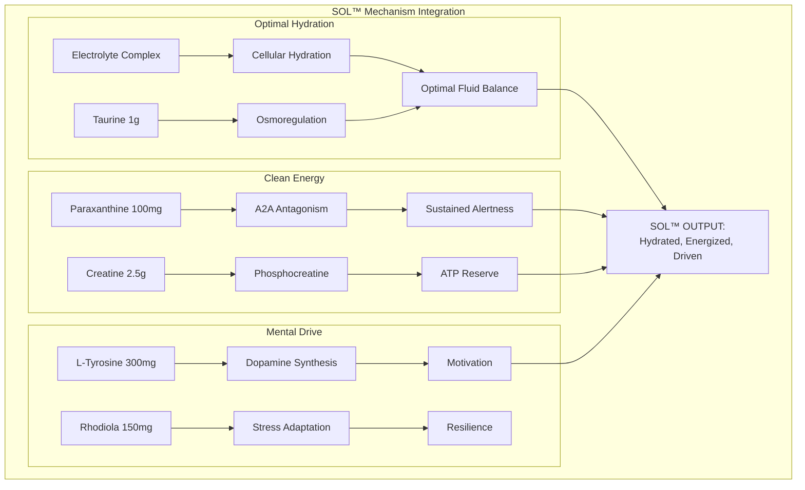
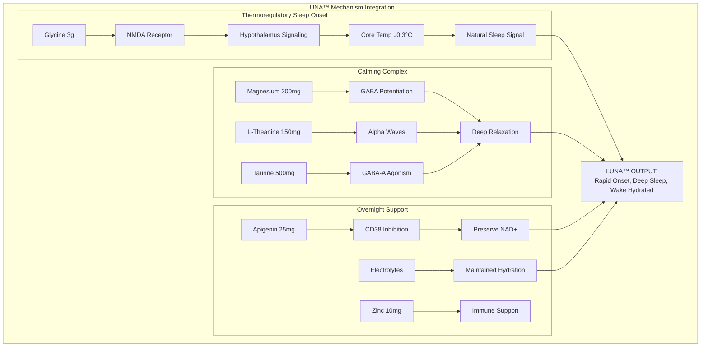
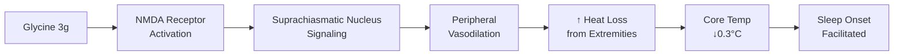
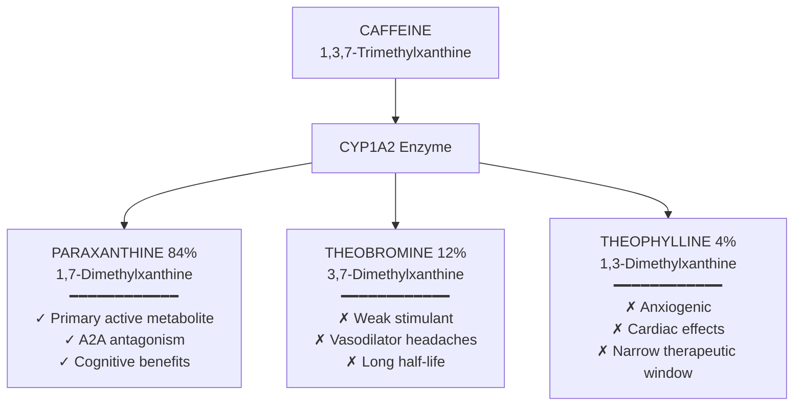
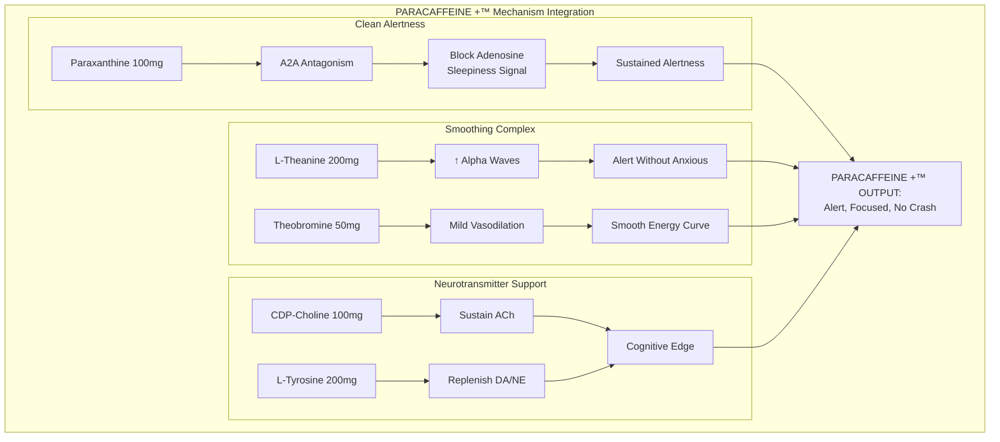
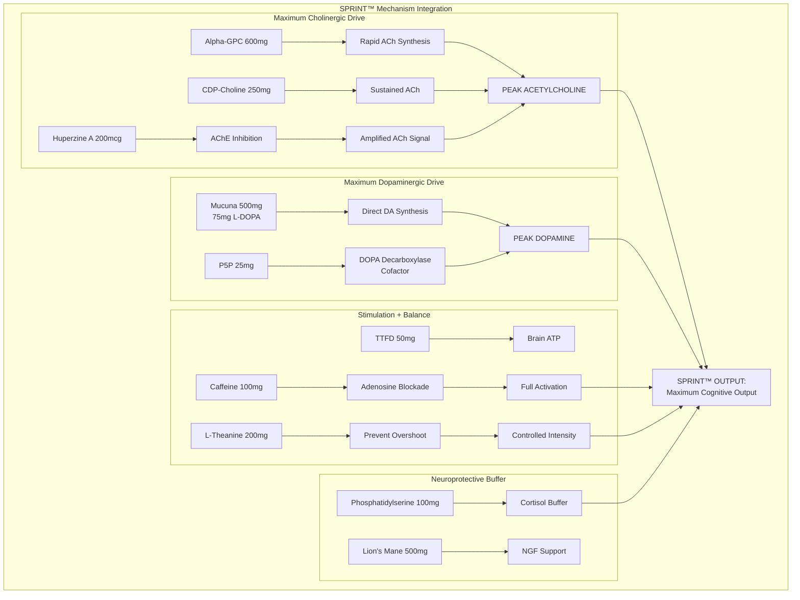
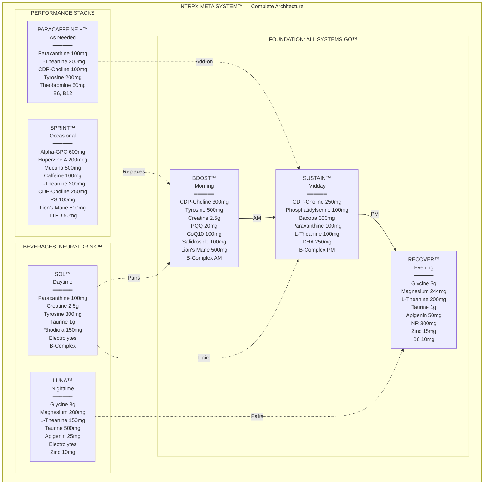

## Neuraldrink™ — Circadian Functional Beverages

<CardGroup cols={2}>

<Card title="Sol™" icon="sun" color="#FFD700">
Daytime Hydration + Performance
</Card>

<Card title="Luna™" icon="moon" color="#4A5568">
Nighttime Hydration + Recovery
</Card>

</CardGroup>

**Hydration is the foundation of biological performance — but water alone is insufficient.** Neuraldrink™ delivers precision-formulated electrolyte beverages synchronized to circadian demands. Sol™ fuels daytime output with clean energy and cognitive support. Luna™ promotes deep sleep through thermoregulation while maintaining overnight hydration. Both integrate seamlessly with All Systems Go™ or function as powerful standalones.

---

## Sol™ — Daytime Hydration + Performance

<CardGroup cols={4}>

<Card title="Timing" icon="clock" color="#FFD700">
Morning through Early Afternoon
</Card>

<Card title="Primary Targets" icon="bullseye" color="#FFD700">
Hydration, ATP, Dopaminergic
</Card>

<Card title="Philosophy" icon="lightbulb" color="#FFD700">
"Clean energy that sustains"
</Card>

<Card title="Form" icon="glass-water" color="#FFD700">
Powder → 16-20 oz water
</Card>

</CardGroup>

<AccordionGroup>

<Accordion title="Complete Formulation" icon="flask-vial">

### Sol™ Ingredient Matrix

| Ingredient | Form | Dose | Primary Domain | Mechanism | Evidence Tier |
|------------|------|------|----------------|-----------|---------------|
| **Paraxanthine** | enfinity® | 100 mg | Adenosine | A2A antagonism; clean alertness | TIER 2 |
| **Creatine** | Creapure® Monohydrate | 2,500 mg | ATP Systems | Phosphocreatine buffering; dissolves well | TIER 1 |
| **L-Tyrosine** | N-Acetyl-L-Tyrosine | 300 mg | Dopaminergic | DA/NE precursor; stress resilience | TIER 1 |
| **Taurine** | Pharmaceutical grade | 1,000 mg | Cellular, Osmoregulation | Cellular hydration; antioxidant | TIER 1 |
| **Rhodiola Extract** | 3% salidroside | 150 mg | HPA Axis | Adaptogenic; fatigue resistance | TIER 2 |
| **Electrolyte Complex** | — | — | Hydration | Optimal cellular hydration | TIER 1 |
| **B-Vitamin Hydration Complex** | Active forms | — | Energy, Methylation | Water-soluble; lost in sweat | TIER 1 |

### Electrolyte Complex (per serving)

| Electrolyte | Form | Dose | Rationale |
|-------------|------|------|-----------|
| **Sodium** | Sodium Citrate + Pink Himalayan | 500 mg | Primary extracellular electrolyte; drives hydration |
| **Potassium** | Potassium Citrate | 300 mg | Intracellular balance; muscle function |
| **Magnesium** | Magnesium Citrate | 75 mg | Cofactor; often depleted; muscle relaxation |
| **Chloride** | From sodium chloride | 200 mg | Fluid balance; gastric function |
| **Calcium** | Calcium Citrate | 50 mg | Nerve transmission; muscle contraction |

### B-Vitamin Hydration Complex (within Sol™)

| Vitamin | Form | Dose | Rationale |
|---------|------|------|-----------|
| **B1** | Thiamine HCl | 25 mg | Sweat loss replacement; energy |
| **B2** | Riboflavin-5'-Phosphate | 10 mg | Energy metabolism |
| **B3** | Niacinamide | 50 mg | NAD+ support |
| **B5** | D-Calcium Pantothenate | 25 mg | CoA synthesis |
| **B6** | Pyridoxal-5'-Phosphate | 10 mg | Amino acid metabolism |
| **B12** | Methylcobalamin | 250 mcg | Energy; nerve function |
| **Vitamin C** | Ascorbic Acid | 100 mg | Antioxidant; enhances absorption |

### Mechanism Integration

</Accordion>

<Accordion title="Usage Protocol" icon="clock">

### Optimal Use

| Parameter | Recommendation | Rationale |
|-----------|----------------|-----------|
| **Timing** | Morning or early afternoon | Paraxanthine needs 6+ hours before sleep |
| **Frequency** | 1-2 servings daily | Based on activity level and heat exposure |
| **Mixing** | 16-20 oz cold water | Dissolve fully before drinking |
| **Pairs with** | Boost™ (morning) or Sustain™ (midday) | Complementary, not redundant |

### Activity-Based Dosing

| Scenario | Sol™ Protocol |
|----------|---------------|
| **Office work** | 1 serving morning |
| **Light exercise** | 1 serving pre-workout |
| **Intense exercise / heat** | 1 serving pre, 1 serving during/post |
| **Travel / dehydration** | 1-2 servings as needed |

### Flavor Options

| Flavor | Notes |
|--------|-------|
| **Citrus Sunrise** | Orange, lemon, hint of ginger |
| **Tropical Focus** | Mango, pineapple, coconut |
| **Berry Charge** | Mixed berry, light tartness |

</Accordion>

<Accordion title="Integration with All Systems Go™" icon="link">

### Combination Protocol

| Time | All Systems Go™ | Neuraldrink™ | Notes |
|------|-----------------|--------------|-------|
| **6-7 AM** | Boost™ | — | Foundation morning stack |
| **8-10 AM** | — | Sol™ | Hydration + extended energy |
| **12-2 PM** | Sustain™ | — | Midday cognitive support |
| **2-4 PM** | — | Sol™ (optional) | If extended afternoon demands |

### Synergy Analysis

| Combination | Effect | Caution |
|-------------|--------|---------|
| **Sol™ + Boost™** | Comprehensive morning activation | Total paraxanthine stays at 100mg (safe) |
| **Sol™ + Sustain™** | Total paraxanthine = 200mg | Maximum safe daily level; do not add ParaCaffeine +™ |
| **Sol™ + ParaCaffeine +™** | 200mg paraxanthine | Safe but watch timing; no more than 2PM |

<Warning>
**Paraxanthine Stacking:** Sol™ contains 100mg paraxanthine. When combining with Sustain™ (100mg) or ParaCaffeine +™ (100mg), total daily paraxanthine should not exceed 300mg. Stay below 200mg for sleep-sensitive individuals.
</Warning>

</Accordion>

</AccordionGroup>

---

## Luna™ — Nighttime Hydration + Recovery

<CardGroup cols={4}>

<Card title="Timing" icon="clock" color="#4A5568">
Evening (1-2 hours before bed)
</Card>

<Card title="Primary Targets" icon="bullseye" color="#4A5568">
Hydration, Circadian, GABAergic
</Card>

<Card title="Philosophy" icon="lightbulb" color="#4A5568">
"Hydrate while you restore"
</Card>

<Card title="Form" icon="glass-water" color="#4A5568">
Powder → 12-16 oz water
</Card>

</CardGroup>

<AccordionGroup>

<Accordion title="Complete Formulation" icon="flask-vial">

### Luna™ Ingredient Matrix

| Ingredient | Form | Dose | Primary Domain | Mechanism | Evidence Tier |
|------------|------|------|----------------|-----------|---------------|
| **Glycine** | Pharmaceutical grade | 3,000 mg | Circadian | Thermoregulation (-0.3°C core temp) | TIER 1 |
| **Magnesium** | Magnesium Glycinate | 200 mg elemental | GABAergic | GABA potentiation; relaxation; additional glycine | TIER 1 |
| **L-Theanine** | Suntheanine® | 150 mg | GABAergic | Alpha waves; calm without sedation | TIER 1 |
| **Taurine** | Pharmaceutical grade | 500 mg | GABAergic | GABA-A agonist; inhibitory tone | TIER 2 |
| **Apigenin** | 98% extract | 25 mg | NAD+, GABAergic | CD38 inhibition; mild anxiolytic | TIER 2 |
| **Electrolyte Complex (Night)** | — | — | Hydration | Overnight hydration; reduced sodium | TIER 1 |

### Electrolyte Complex — Night (per serving)

| Electrolyte | Form | Dose | Rationale |
|-------------|------|------|-----------|
| **Sodium** | Sodium Citrate | 200 mg | Lower than Sol™; prevents nighttime thirst/urination |
| **Potassium** | Potassium Citrate | 300 mg | Maintains intracellular balance |
| **Magnesium** | From Mag Glycinate above | (included) | Relaxation |
| **Zinc** | Zinc Picolinate | 10 mg | Sleep regulation; immune overnight |

### Mechanism Integration

</Accordion>

<Accordion title="The Glycine-Thermoregulation Mechanism" icon="temperature-low">

### Why 3g Glycine is Essential

Glycine at 3g triggers a specific physiological cascade:

| Clinical Evidence | Finding | Reference |
|-------------------|---------|-----------|
| **Bannai et al. 2012** | 3g glycine reduced core body temperature and improved subjective sleep quality | [Sleep Biol Rhythms](https://doi.org/10.1111/j.1479-8425.2012.00532.x) |
| **Kawai et al. 2015** | Glycine increased cutaneous blood flow, facilitating heat dissipation | [Neuropsychopharmacology](https://doi.org/10.1016/j.neuropharm.2014.12.007) |
| **Inagawa et al. 2006** | 3g glycine improved next-day alertness and reduced daytime fatigue | [Sleep Biol Rhythms](https://doi.org/10.1111/j.1479-8425.2006.00193.x) |

<Note>
**Why This Matters:** Most sleep supplements target sedation (GABA, melatonin). Luna™ targets the **thermoregulatory pathway** — the body's natural sleep-onset mechanism. This produces deeper, more restorative sleep without morning grogginess or dependence.
</Note>

</Accordion>

<Accordion title="Usage Protocol" icon="clock">

### Optimal Use

| Parameter | Recommendation | Rationale |
|-----------|----------------|-----------|
| **Timing** | 30-90 minutes before bed | Allows thermoregulation to initiate |
| **Mixing** | 12-16 oz cool water | Smaller volume prevents nighttime urination |
| **Temperature** | Room temp or slightly cool | Hot liquid raises core temp (counterproductive) |
| **Consistency** | Nightly | Sleep architecture benefits compound |

### Flavor Options

| Flavor | Notes |
|--------|-------|
| **Lavender Calm** | Light lavender, hint of vanilla |
| **Chamomile Honey** | Subtle sweetness, herbal notes |
| **Unflavored** | For those who prefer neutral; mixes into any beverage |

</Accordion>

<Accordion title="Integration with All Systems Go™" icon="link">

### Combination Protocol

| Time | All Systems Go™ | Neuraldrink™ | Notes |
|------|-----------------|--------------|-------|
| **6-8 PM** | Dinner | — | Allow digestion |
| **8-9 PM** | — | Luna™ | Begin thermoregulation |
| **9-10 PM** | Recover™ | — | Complete sleep stack |
| **10-11 PM** | — | Sleep | Full protocol active |

### Synergy with Recover™

| Ingredient | Recover™ | Luna™ | Combined Total | Notes |
|------------|----------|-------|----------------|-------|
| **Glycine** | 3,000 mg | 3,000 mg | 6,000 mg | Safe; enhanced thermoregulation |
| **Magnesium** | 244 mg | 200 mg | 444 mg | Optimal range; no excess |
| **L-Theanine** | 200 mg | 150 mg | 350 mg | Enhanced alpha waves |
| **Taurine** | 1,000 mg | 500 mg | 1,500 mg | Strong GABAergic tone |
| **Apigenin** | 50 mg | 25 mg | 75 mg | Robust CD38 inhibition |

<Tip>
**Maximum Sleep Protocol:** Recover™ + Luna™ together provides the most comprehensive sleep architecture support in the NTRPX system. The combination is safe and synergistic — use for periods of high recovery demand, jet lag, or sleep debt payoff.
</Tip>

</Accordion>

</AccordionGroup>

---

## ParaCaffeine +™ — Clean Stimulation

<CardGroup cols={4}>

<Card title="Timing" icon="clock" color="#5A8FA8">
As Needed (before 2 PM)
</Card>

<Card title="Primary Targets" icon="bullseye" color="#5A8FA8">
Adenosine, Dopaminergic
</Card>

<Card title="Philosophy" icon="lightbulb" color="#5A8FA8">
"Caffeine evolved — no jitters, no crash"
</Card>

<Card title="Form" icon="capsules" color="#5A8FA8">
Capsules (2)
</Card>

</CardGroup>

**Paraxanthine is caffeine's primary active metabolite — the compound actually responsible for most of caffeine's cognitive benefits.** By supplementing paraxanthine directly, you bypass caffeine's problematic metabolites (theobromine, theophylline) that cause anxiety, jitters, and sleep disruption. ParaCaffeine +™ delivers clean adenosine antagonism with synergistic cofactors for sustained, sleep-friendly alertness.

<AccordionGroup>

<Accordion title="Why Paraxanthine > Caffeine" icon="arrow-trend-up">

### Caffeine Metabolism

### Comparative Pharmacology

| Property | Caffeine | Paraxanthine |
|----------|----------|--------------|
| **A2A receptor affinity** | 1× | **2.2×** |
| **Half-life** | 5-6 hours | **3-4 hours** |
| **Anxiogenic metabolites** | Yes (theophylline) | **None** |
| **Sleep interference** | High | **Lower** |
| **Jitters/anxiety** | Common | **Rare** |
| **Tolerance development** | Rapid | **Slower** |
| **Crash** | Common | **Minimal** |

### Clinical Evidence

| Study | Design | N | Finding | Reference |
|-------|--------|---|---------|-----------|
| **Xing et al. 2021** | RCT, DB, PC | 11 | Paraxanthine improved sustained attention and reaction time | [Nutrients](https://doi.org/10.3390/nu13103980) |
| **Yoo et al. 2021** | Acute pharmacology | — | Paraxanthine has higher A2A selectivity than caffeine | [Psychopharmacology](https://doi.org/10.1007/s00213-021-05931-7) |
| **Benowitz et al. 1995** | Pharmacokinetic | 10 | Paraxanthine clearance faster than caffeine | [Clin Pharmacol Ther](https://doi.org/10.1038/clpt.1995.7) |

</Accordion>

<Accordion title="Complete Formulation" icon="flask-vial">

### ParaCaffeine +™ Ingredient Matrix

| Ingredient | Form | Dose | Primary Domain | Mechanism | Evidence Tier |
|------------|------|------|----------------|-----------|---------------|
| **Paraxanthine** | enfinity® | 100 mg | Adenosine | A2A antagonism; clean alertness | TIER 2 |
| **L-Theanine** | Suntheanine® | 200 mg | GABAergic | Smooths stimulation; alpha waves | TIER 1 |
| **CDP-Choline** | Cognizin® | 100 mg | Cholinergic | Sustains acetylcholine under stimulation | TIER 1 |
| **L-Tyrosine** | N-Acetyl-L-Tyrosine | 200 mg | Dopaminergic | Replenishes catecholamines | TIER 1 |
| **Theobromine** | Cacao-derived | 50 mg | Cardiovascular | Mild vasodilation; smooth energy curve | TIER 2 |
| **B6** | Pyridoxal-5'-Phosphate | 10 mg | Methylation | Neurotransmitter synthesis cofactor | TIER 1 |
| **B12** | Methylcobalamin | 250 mcg | Methylation | Energy; nerve function | TIER 1 |

### Mechanism Integration

### Why These Cofactors?

| Cofactor | Rationale |
|----------|-----------|
| **L-Theanine** | Proven synergy with xanthines; promotes alpha waves; eliminates jitteriness |
| **CDP-Choline** | Stimulants deplete acetylcholine; CDP-Choline prevents this |
| **L-Tyrosine** | Stimulants deplete catecholamines; tyrosine replenishes |
| **Theobromine (low dose)** | Extends energy curve without caffeine's downsides |
| **B6, B12** | Neurotransmitter synthesis requires these cofactors |

</Accordion>

<Accordion title="Usage Protocol" icon="clock">

### Optimal Use

| Parameter | Recommendation | Rationale |
|-----------|----------------|-----------|
| **Timing** | Morning or early afternoon | Allow 6+ hours before sleep |
| **Cutoff** | 2 PM (strict) | Even with shorter half-life, evening use affects sleep |
| **Frequency** | As needed, not daily | Prevents tolerance; maintains sensitivity |
| **Maximum** | 2 servings (200mg paraxanthine) | Higher doses lose benefit/risk ratio |

### Comparison to Coffee

| 1 Cup Coffee (~95mg caffeine) | ParaCaffeine +™ (100mg paraxanthine) |
|------------------------------|--------------------------------------|
| Mixed metabolites | Pure active compound |
| Jitters common | Jitters rare |
| 5-6 hour half-life | 3-4 hour half-life |
| Sleep disruption likely | Sleep-compatible (if before 2 PM) |
| Crash common | Crash minimal |
| Acidic, GI issues | Neutral, well-tolerated |

### Integration with NTRPX

| Combination | Total Paraxanthine | Recommendation |
|-------------|-------------------|----------------|
| **ParaCaffeine +™ alone** | 100 mg | Safe; ideal standalone |
| **+ Sustain™** | 200 mg | Safe; do not add Sol™ |
| **+ Sol™** | 200 mg | Safe; do not add Sustain™ |
| **+ Sustain™ + Sol™** | 300 mg | Maximum; use rarely |

</Accordion>

</AccordionGroup>

---

## Sprint™ — Acute Peak Performance

<CardGroup cols={4}>

<Card title="Timing" icon="clock" color="#FF6B6B">
High-Demand Events Only
</Card>

<Card title="Primary Targets" icon="bullseye" color="#FF6B6B">
Cholinergic MAX, Dopaminergic MAX
</Card>

<Card title="Philosophy" icon="lightbulb" color="#FF6B6B">
"Reserved for when you need peak output"
</Card>

<Card title="Form" icon="capsules" color="#FF6B6B">
Capsules (4-6)
</Card>

</CardGroup>

**Sprint™ is not for daily use. It is the high-performance formulation reserved for demanding cognitive events — presentations, exams, competitions, critical deadlines.** Sprint™ provides maximum cholinergic drive via Alpha-GPC and Huperzine A, combined with dopaminergic surge from Mucuna pruriens (L-DOPA). This is the most aggressive nootropic stack in the NTRPX system, designed for occasional peak performance when the stakes are highest.

<Warning>
**Sprint™ is for occasional use only (1-2× per week maximum).** Daily use will lead to tolerance, receptor downregulation, and diminished efficacy. Reserve for genuinely high-demand situations.
</Warning>

<AccordionGroup>

<Accordion title="Complete Formulation" icon="flask-vial">

### Sprint™ Ingredient Matrix

| Ingredient | Form | Dose | Primary Domain | Mechanism | Evidence Tier |
|------------|------|------|----------------|-----------|---------------|
| **Alpha-GPC** | 50% | 600 mg (300 mg Alpha-GPC) | Cholinergic | Rapid, high-bioavailability choline; crosses BBB | TIER 2 |
| **Huperzine A** | 1% extract | 200 mcg | Cholinergic | Acetylcholinesterase inhibitor; amplifies ACh | TIER 2 |
| **Mucuna pruriens** | 15% L-DOPA | 500 mg (75 mg L-DOPA) | Dopaminergic | Direct dopamine precursor; bypasses rate-limitation | TIER 2 |
| **Caffeine Anhydrous** | Pharmaceutical grade | 100 mg | Adenosine | Broader receptor profile than paraxanthine; acute power | TIER 1 |
| **L-Theanine** | Suntheanine® | 200 mg | GABAergic | Balances stimulation; prevents overshoot | TIER 1 |
| **CDP-Choline** | Cognizin® | 250 mg | Cholinergic | Additional choline; membrane support | TIER 1 |
| **Phosphatidylserine** | Sharp-PS® | 100 mg | Neuroprotection | Membrane; cortisol modulation under pressure | TIER 1 |
| **Lion's Mane** | Fruiting body 8:1 | 500 mg | Neuroprotection | NGF support; neuroplasticity | TIER 2 |
| **TTFD** | Thiamine derivative | 50 mg | Mitochondrial | BBB-penetrant B1; cognitive energy | TIER 3 |
| **B6** | Pyridoxal-5'-Phosphate | 25 mg | Dopaminergic | DOPA decarboxylase cofactor | TIER 1 |
| **B12** | Methylcobalamin | 1,000 mcg | Methylation | Elevated for acute demand | TIER 1 |

### Mechanism Integration

### Why Caffeine Instead of Paraxanthine?

For Sprint™ specifically, caffeine is preferred:

| Factor | Rationale |
|--------|-----------|
| **Broader receptor profile** | Caffeine hits A1 and A2A; more complete adenosine blockade |
| **Faster onset** | Caffeine peaks faster for acute demands |
| **Occasional use context** | Sleep disruption less relevant for single-use scenarios |
| **Synergy with L-DOPA** | Traditional pairing with demonstrated effects |

</Accordion>

<Accordion title="Evidence Base" icon="book-medical">

### Key Clinical Evidence

| Ingredient | Study | Design | N | Dose | Finding | Reference |
|------------|-------|--------|---|------|---------|-----------|
| **Alpha-GPC** | Parker et al. 2015 | RCT, DB, PC | 48 | 600mg | ↑ Lower body force production | [J Int Soc Sports Nutr](https://doi.org/10.1186/s12970-015-0098-3) |
| **Alpha-GPC** | Bellar et al. 2015 | RCT | 13 | 600mg | ↑ Isometric strength | [J Int Soc Sports Nutr](https://doi.org/10.1186/s12970-015-0099-2) |
| **Huperzine A** | Sun et al. 1999 | RCT, DB, PC | 103 | 200mcg BID | ↑ Memory in AD patients | [Zhongguo Yao Li Xue Bao](https://pubmed.ncbi.nlm.nih.gov/10678121/) |
| **Mucuna** | Katzenschlager et al. 2004 | RCT | 8 PD patients | 30g (contains L-DOPA) | Comparable to L-DOPA/carbidopa | [J Neurol Neurosurg Psychiatry](https://doi.org/10.1136/jnnp.2003.028761) |
| **Caffeine + L-Theanine** | Haskell et al. 2008 | RCT, DB, PC | 48 | 150mg + 250mg | ↑ Attention, task switching | [Biol Psychol](https://doi.org/10.1016/j.biopsycho.2007.09.008) |

</Accordion>

<Accordion title="Usage Protocol" icon="clock">

### When to Use Sprint™

| ✅ Appropriate | ❌ Not Appropriate |
|----------------|-------------------|
| Major presentation | Daily productivity |
| Final exam | Regular work tasks |
| Competition day | Catching up on sleep debt |
| Critical negotiation | Social events |
| Job interview | Routine exercise |
| Creative deadline | Ongoing projects |

### Protocol

| Parameter | Recommendation | Rationale |
|-----------|----------------|-----------|
| **Timing** | 60-90 minutes before peak demand | Allows full onset |
| **Frequency** | 1-2× per week MAXIMUM | Prevents tolerance |
| **Cycling** | 2 weeks on, 1 week off if using weekly | Maintains efficacy |
| **Sleep** | Do not use after 12 PM | Caffeine + L-DOPA will disrupt sleep |
| **Food** | Light meal or empty stomach | Heavy food delays absorption |

### What to Expect

| Timeframe | Effects |
|-----------|---------|
| **30-60 min** | Onset of alertness, focus sharpening |
| **60-180 min** | Peak performance window |
| **3-5 hours** | Gradual return to baseline |
| **Post-event** | May feel mentally tired (normal; used resources) |

<Warning>
**Do NOT combine Sprint™ with All Systems Go™ Boost on the same day.** Sprint™ replaces Boost™ for that day. Combining creates excessive stimulation and cholinergic load.
</Warning>

</Accordion>

<Accordion title="Safety Considerations" icon="shield-check">

### Contraindications

| Condition | Recommendation |
|-----------|----------------|
| **Cardiovascular disease** | Avoid (caffeine, stimulation) |
| **Anxiety disorders** | Avoid (may exacerbate) |
| **Pregnancy/nursing** | Avoid |
| **MAO inhibitor medications** | Contraindicated (L-DOPA interaction) |
| **Parkinson's medications** | Consult physician (L-DOPA overlap) |
| **Glaucoma** | Caution (cholinergic effects) |

### Side Effect Management

| Potential Side Effect | Cause | Management |
|-----------------------|-------|------------|
| **Overstimulation** | Caffeine + L-DOPA | Reduce dose; add more L-theanine |
| **Headache** | Cholinergic excess | Ensure hydration; reduce next dose |
| **GI upset** | L-DOPA | Take with light food |
| **Insomnia** | Too late in day | Strict AM use only |

</Accordion>

</AccordionGroup>

---

## Complete Meta System Summary

<AccordionGroup>

<Accordion title="Total System Architecture" icon="sitemap">

### All Products at a Glance

</Accordion>

<Accordion title="Usage Scenarios" icon="route">

### Protocol Options

| Goal | Protocol | Products |
|------|----------|----------|
| **Basic optimization** | Foundation only | All Systems Go™ (Boost → Sustain → Recover) |
| **Enhanced hydration** | Foundation + Beverages | All Systems Go™ + Sol™ + Luna™ |
| **Caffeine replacement** | Entry point | ParaCaffeine +™ |
| **Sleep focus** | Evening stack | Recover™ + Luna™ |
| **Maximum daily** | Complete circadian | Boost → Sol → Sustain → Luna → Recover |
| **High-demand event** | Acute performance | Sprint™ (replaces Boost that day) |

### Sample Weekly Schedule

| Day | Morning | Midday | Evening | Notes |
|-----|---------|--------|---------|-------|
| **Monday** | Boost + Sol | Sustain | Recover + Luna | Full protocol |
| **Tuesday** | Boost | Sustain + ParaCaffeine+ | Recover | Extra afternoon energy |
| **Wednesday** | Boost + Sol | Sustain | Recover + Luna | Full protocol |
| **Thursday** | **Sprint** | (ride effect) | Recover + Luna | Major presentation |
| **Friday** | Boost | Sustain | Recover | Standard day |
| **Saturday** | Sol only | — | Luna | Light weekend |
| **Sunday** | — | — | Luna | Rest day |

</Accordion>

<Accordion title="Quality Specifications" icon="certificate">

### Ingredient Sourcing Standards

| Category | Standard | Verification |
|----------|----------|--------------|
| **Branded ingredients** | Use specified brands (Cognizin®, Suntheanine®, etc.) | CoA required |
| **Generic ingredients** | ≥98% purity pharmaceutical grade | Third-party testing |
| **Botanical extracts** | Standardized to active compounds | HPLC verification |
| **Heavy metals** | USP \<232>/\<233> limits | ICP-MS testing |
| **Microbial** | USP \<2021> standards | Batch testing |
| **Stability** | 24-month shelf life | Accelerated stability data |

### Manufacturing Standards

| Parameter | Requirement |
|-----------|-------------|
| **Facility** | cGMP-certified |
| **Testing** | Identity, potency, purity each batch |
| **Encapsulation** | Vegetarian capsules (HPMC) |
| **Powder mixing** | V-blender with validated homogeneity |
| **Packaging** | UV-protective bottles; desiccant included |

</Accordion>

</AccordionGroup>

---

## Document Control

| Version | Date | Author | Changes |
|---------|------|--------|---------|
| 1.0 | 2026-01-24 | NTRPX R&D | Complete Meta System formulations |

---

<Tip>
**NTRPX Meta System™ Complete:** Seven integrated products spanning foundation daily support (All Systems Go™), circadian beverages (Neuraldrink™), clean stimulation (ParaCaffeine +™), and acute performance (Sprint™). Every ingredient, dose, and timing decision made with full awareness of the complete system. Use individually for targeted benefits, or combine for complete biological optimization across all 12 domains of human performance.
</Tip>